# DESIGN.md — Hierarchical Context Augmented Generation (HCAG)

An LLM agent backed by a hierarchical knowledge base. Instead of flat-index RAG over chunks, HCAG navigates a taxonomy, retrieves whole leaf documents, classifies the problem's branch once, and reuses that retrieval across the reasoning steps of a task.

---

## Table of Contents

- [Part 1 — High-Level Design](#part-1--high-level-design)
  - [1.1 The HCAG Approach](#11-the-hcag-approach)
  - [1.2 What HCAG Solves](#12-what-hcag-solves)
    - [Problem 1 — Knowledge Isolation](#problem-1--knowledge-isolation)
    - [Problem 2 — Complex Reasoning](#problem-2--complex-reasoning)
    - [Problem 3 — Speed and Cost](#problem-3--speed-and-cost)
  - [1.3 When to Use HCAG (vs Alternatives)](#13-when-to-use-hcag-vs-alternatives)
    - [1.3.1 Choose HCAG when…](#131-choose-hcag-when)
    - [1.3.2 Choose Agentic Search when…](#132-choose-agentic-search-when)
    - [1.3.3 Choose Flat RAG when…](#133-choose-flat-rag-when)
    - [1.3.4 At a Glance](#134-at-a-glance)
    - [1.3.5 Combining Approaches](#135-combining-approaches)
  - [1.4 What the Agent Provides](#14-what-the-agent-provides)
  - [1.5 Design Goals](#15-design-goals)
  - [1.6 Non-Goals](#16-non-goals)
  - [1.7 Core Concepts](#17-core-concepts)
  - [1.8 Key Design Decisions](#18-key-design-decisions)
  - [1.9 Component Boundary](#19-component-boundary)
  - [1.10 Tool Surface](#110-tool-surface)
  - [1.11 Out of Scope](#111-out-of-scope)
- [Part 2 — Detailed Design](#part-2--detailed-design)
  - [2.1 KB Layout](#21-kb-layout)
  - [2.2 `compiled.md` Schema](#22-compiledmd-schema)
    - [2.2.1 The catalog table](#221-the-catalog-table)
  - [2.3 Tool Contracts](#23-tool-contracts)
    - [2.3.1 `get_catalog`](#231-get_catalog)
    - [2.3.2 `check_and_load_kb`](#232-check_and_load_kb)
    - [2.3.3 Selection semantics](#233-selection-semantics)
  - [2.4 Active-Set Protocol](#24-active-set-protocol)
  - [2.5 Token Budget & Eviction Algorithm](#25-token-budget--eviction-algorithm)
  - [2.6 Packet Loading (Multimodal Assembly)](#26-packet-loading-multimodal-assembly)
  - [2.7 System Prompt Composition (Bootstrap)](#27-system-prompt-composition-bootstrap)
    - [2.7.1 The load decision — one test, in both directions](#271-the-load-decision--one-test-in-both-directions)
    - [2.7.2 Enforcing the load-before-answer half](#272-enforcing-the-load-before-answer-half)
  - [2.8 Error Handling](#28-error-handling)
  - [2.9 Component Class Diagram](#29-component-class-diagram)
  - [2.10 Sequence Diagrams](#210-sequence-diagrams)
    - [2.10.1 Cold start + first turn (additive load)](#2101-cold-start--first-turn-additive-load)
    - [2.10.2 Follow-up turn — no reload needed](#2102-follow-up-turn--no-reload-needed)
    - [2.10.3 Follow-up turn — additive load within budget](#2103-follow-up-turn--additive-load-within-budget)
    - [2.10.4 Follow-up turn — load with eviction](#2104-follow-up-turn--load-with-eviction)
  - [2.11 Observability](#211-observability)
    - [2.11.1 Configuration](#2111-configuration)
    - [2.11.2 OTEL Trace Model](#2112-otel-trace-model)
    - [2.11.3 Local File Logging](#2113-local-file-logging)
    - [2.11.4 What the Two Layers Together Answer](#2114-what-the-two-layers-together-answer)
  - [2.12 Prompt-Cache Alignment (realizing Problem 3)](#212-prompt-cache-alignment-realizing-problem-3)
  - [2.13 Tech Stack](#213-tech-stack)
    - [2.13.1 Language and Runtime](#2131-language-and-runtime)
    - [2.13.2 LLM Access — Provider-Neutral](#2132-llm-access--provider-neutral)
    - [2.13.3 Configuration, CLI, Content, Tokenization](#2133-configuration-cli-content-tokenization)
    - [2.13.4 Observability](#2134-observability)
    - [2.13.5 Testing and Packaging](#2135-testing-and-packaging)
    - [2.13.6 Dependency Summary](#2136-dependency-summary)
    - [2.13.7 Credentials](#2137-credentials)
    - [2.13.8 Deliberate Non-Dependencies](#2138-deliberate-non-dependencies)
  - [2.14 Turn API — Synchronous and Streaming](#214-turn-api--synchronous-and-streaming)
    - [2.14.1 Event vocabulary](#2141-event-vocabulary)
    - [2.14.2 Why both, and which is primitive](#2142-why-both-and-which-is-primitive)
    - [2.14.3 Errors after the first byte](#2143-errors-after-the-first-byte)
  - [2.15 Prompts — Loaded by Name, Not Hard-Coded](#215-prompts--loaded-by-name-not-hard-coded)
    - [2.15.1 Name to filename](#2151-name-to-filename)
    - [2.15.2 Resolution order and failure](#2152-resolution-order-and-failure)
    - [2.15.3 Placeholders](#2153-placeholders)
    - [2.15.4 Loaded once, at startup](#2154-loaded-once-at-startup)
    - [2.15.5 The registry](#2155-the-registry)
  - [2.16 Open Questions / Future Work](#216-open-questions--future-work)
- [Part 3 — The `hcag` CLI Tool](#part-3--the-hcag-cli-tool)
  - [3.1 Purpose](#31-purpose)
  - [3.2 KB Input Model](#32-kb-input-model)
  - [3.3 CLI Overview](#33-cli-overview)
  - [3.4 `hcag` — Detailed Semantics](#34-hcag--detailed-semantics)
    - [3.4.1 DFS traversal](#341-dfs-traversal)
    - [3.4.2 Per-folder classification](#342-per-folder-classification)
    - [3.4.3 `compiled.md` assembly](#343-compiledmd-assembly)
    - [3.4.4 Descriptions and the catalog table](#344-descriptions-and-the-catalog-table)
    - [3.4.5 Packet ID scheme](#345-packet-id-scheme)
    - [3.4.6 Asset policy](#346-asset-policy)
    - [3.4.7 Overwrite policy](#347-overwrite-policy)
    - [3.4.8 Failure modes](#348-failure-modes)
    - [3.4.9 LLM preflight and failure policy](#349-llm-preflight-and-failure-policy)
  - [3.5 Aggregation (folded into `preprocess`)](#35-aggregation-folded-into-preprocess)
  - [3.6 Configuration](#36-configuration)
  - [3.7 Generated File Format — Summary](#37-generated-file-format--summary)
  - [3.8 End-to-End Workflow](#38-end-to-end-workflow)
  - [3.9 Observability (CLI)](#39-observability-cli)
  - [3.10 Non-Goals for the CLI](#310-non-goals-for-the-cli)
  - [3.11 Sequence Diagram](#311-sequence-diagram)
- [Part 4 — The `crawl` CLI Tool](#part-4--the-crawl-cli-tool)
  - [4.1 Purpose](#41-purpose)
  - [4.2 Invocation](#42-invocation)
  - [4.3 Traversal Semantics](#43-traversal-semantics)
    - [4.3.1 Seed prefix scope](#431-seed-prefix-scope)
    - [4.3.2 Visited-URL tracking](#432-visited-url-tracking)
    - [4.3.3 Depth](#433-depth)
    - [4.3.4 Asset scope](#434-asset-scope)
    - [4.3.5 Request pacing](#435-request-pacing)
  - [4.4 Document Types](#44-document-types)
    - [4.4.1 HTML — main-content extraction](#441-html--main-content-extraction)
    - [4.4.2 PDF](#442-pdf)
      - [Tech-stack decision: PyMuPDF4LLM](#tech-stack-decision-pymupdf4llm)
    - [4.4.3 Images](#443-images)
  - [4.5 Output Layout](#45-output-layout)
    - [4.5.1 Why placement is not just filing](#451-why-placement-is-not-just-filing)
    - [4.5.2 Resolving placement at the end of the crawl](#452-resolving-placement-at-the-end-of-the-crawl)
    - [4.5.3 Link-order sidecar](#453-link-order-sidecar)
  - [4.6 Relationship to `hcag`](#46-relationship-to-hcag)
  - [4.7 Observability (CLI)](#47-observability-cli)
    - [4.7.1 Console output](#471-console-output)
  - [4.8 Non-Goals](#48-non-goals)
  - [4.9 Sequence Diagram](#49-sequence-diagram)
- [Part 5 — Voice Agent (LiveKit)](#part-5--voice-agent-livekit)
  - [5.1 Purpose](#51-purpose)
  - [5.2 Component Boundary](#52-component-boundary)
    - [5.2.1 Voice Class Diagram](#521-voice-class-diagram)
  - [5.3 Real-Time Architecture](#53-real-time-architecture)
  - [5.4 Session Startup](#54-session-startup)
    - [5.4.1 Warm-start with initial packets](#541-warm-start-with-initial-packets)
    - [5.4.2 Prompt-cache warm-up call](#542-prompt-cache-warm-up-call)
    - [5.4.3 Startup Sequence Diagram](#543-startup-sequence-diagram)
  - [5.5 Real-Time Turn Pipeline](#55-real-time-turn-pipeline)
  - [5.6 STT / TTS Provider Selection](#56-stt--tts-provider-selection)
  - [5.7 Live Transcription Channel (Web Client Contract)](#57-live-transcription-channel-web-client-contract)
  - [5.8 Configuration](#58-configuration)
  - [5.9 CLI](#59-cli)
  - [5.10 Observability](#510-observability)
  - [5.11 Non-Goals](#511-non-goals)
- [Part 6 — The `evalgen` CLI Tool](#part-6--the-evalgen-cli-tool)
  - [6.1 Purpose](#61-purpose)
  - [6.2 Input Model](#62-input-model)
    - [6.2.1 Paragraphs — the grounding unit](#621-paragraphs--the-grounding-unit)
    - [6.2.2 Startup — config visibility and LLM preflight](#622-startup--config-visibility-and-llm-preflight)
    - [6.2.3 The persona file](#623-the-persona-file)
  - [6.3 Invocation](#63-invocation)
  - [6.4 Question Types](#64-question-types)
    - [6.4.1 `simple`](#641-simple)
    - [6.4.2 `medium`](#642-medium)
    - [6.4.3 `complex`](#643-complex)
    - [6.4.4 `hard-1` (cross-packet)](#644-hard-1-cross-packet)
    - [6.4.5 `hard-2` (multimodal)](#645-hard-2-multimodal)
    - [6.4.6 Personas — who is asking](#646-personas--who-is-asking)
  - [6.5 Quantity Control](#65-quantity-control)
    - [6.5.1 How personas divide the requested counts](#651-how-personas-divide-the-requested-counts)
  - [6.6 Generation Algorithm](#66-generation-algorithm)
  - [6.7 Output CSV Schema](#67-output-csv-schema)
    - [6.6.1 The determinacy check — route the question through the catalog](#661-the-determinacy-check--route-the-question-through-the-catalog)
    - [6.7.1 The `source` column](#671-the-source-column)
    - [6.7.2 The `persona` column](#672-the-persona-column)
  - [6.8 Configuration](#68-configuration)
  - [6.9 Failure Modes](#69-failure-modes)
  - [6.10 Observability (CLI)](#610-observability-cli)
  - [6.11 Non-Goals](#611-non-goals)
  - [6.12 Sequence Diagram](#612-sequence-diagram)
- [Part 7 — The `evalrun` CLI Tool](#part-7--the-evalrun-cli-tool)
  - [7.1 Purpose](#71-purpose)
  - [7.2 Input Model](#72-input-model)
  - [7.3 Invocation](#73-invocation)
    - [7.3.1 Startup — config visibility and LLM preflight](#731-startup--config-visibility-and-llm-preflight)
    - [7.3.2 Resuming a run — `--from`](#732-resuming-a-run----from)
  - [7.4 Execution Loop](#74-execution-loop)
    - [7.4.1 Single-turn exchange](#741-single-turn-exchange)
    - [7.4.2 Multi-turn clarification](#742-multi-turn-clarification)
    - [7.4.3 Turn limit and termination](#743-turn-limit-and-termination)
  - [7.5 LLM-as-Judge Scoring](#75-llm-as-judge-scoring)
  - [7.6 Test Harness (promptfoo)](#76-test-harness-promptfoo)
  - [7.7 Output — Completed CSV](#77-output--completed-csv)
  - [7.8 Output — HTML Report](#78-output--html-report)
  - [7.9 Configuration](#79-configuration)
  - [7.10 Failure Modes](#710-failure-modes)
  - [7.11 Observability (CLI)](#711-observability-cli)
  - [7.12 Non-Goals](#712-non-goals)
  - [7.13 Sequence Diagram](#713-sequence-diagram)
- [Part 8 — The `rag` CLI Tool](#part-8--the-rag-cli-tool)
  - [8.1 Purpose](#81-purpose)
  - [8.2 KB Input Model](#82-kb-input-model)
  - [8.3 Invocation](#83-invocation)
  - [8.4 Indexing Pipeline](#84-indexing-pipeline)
    - [8.4.1 Walk and file classification](#841-walk-and-file-classification)
    - [8.4.2 Text extraction and chunking](#842-text-extraction-and-chunking)
    - [8.4.3 Image description](#843-image-description)
    - [8.4.4 Embedding and batching](#844-embedding-and-batching)
    - [8.4.5 Idempotency and re-indexing](#845-idempotency-and-re-indexing)
  - [8.5 Index Schema](#85-index-schema)
  - [8.6 Hybrid Search Semantics](#86-hybrid-search-semantics)
  - [8.7 Configuration](#87-configuration)
  - [8.8 Failure Modes](#88-failure-modes)
  - [8.9 Observability (CLI)](#89-observability-cli)
  - [8.10 Non-Goals](#810-non-goals)
  - [8.11 Sequence Diagram](#811-sequence-diagram)
- [Part 9 — The RAG Chat Agent (Competing Baseline)](#part-9--the-rag-chat-agent-competing-baseline)
  - [9.1 Purpose](#91-purpose)
  - [9.2 Component Boundary](#92-component-boundary)
  - [9.3 Turn Pipeline](#93-turn-pipeline)
    - [9.3.1 Query embedding](#931-query-embedding)
    - [9.3.2 Hybrid retrieval](#932-hybrid-retrieval)
    - [9.3.3 Chunk assembly](#933-chunk-assembly)
    - [9.3.4 Prompt composition](#934-prompt-composition)
    - [9.3.5 Sequence diagram](#935-sequence-diagram)
  - [9.4 Comparison to HCAG](#94-comparison-to-hcag)
  - [9.5 Backend Server Integration (`hcag-server --agent`)](#95-backend-server-integration-hcag-server---agent)
    - [9.5.1 Sequence diagram — HCAG agent path](#951-sequence-diagram--hcag-agent-path)
  - [9.6 Configuration](#96-configuration)
  - [9.7 Failure Modes](#97-failure-modes)
  - [9.8 Observability](#98-observability)
  - [9.9 Non-Goals](#99-non-goals)
- [Part 10 — Web Chat Widget](#part-10--web-chat-widget)
  - [10.1 Purpose](#101-purpose)
  - [10.2 Component Layout](#102-component-layout)
  - [10.3 Markdown Rendering](#103-markdown-rendering)
    - [10.3.1 Supported constructs](#1031-supported-constructs)
    - [10.3.2 Sanitization](#1032-sanitization)
    - [10.3.3 Streaming and partial syntax](#1033-streaming-and-partial-syntax)
    - [10.3.4 KB-specific link and image handling](#1034-kb-specific-link-and-image-handling)
    - [10.3.5 Style isolation on a host page](#1035-style-isolation-on-a-host-page)
  - [10.4 Wire Contract](#104-wire-contract)
  - [10.5 Non-Goals](#105-non-goals)

---

# Part 1 — High-Level Design

## 1.1 The HCAG Approach

HCAG is a knowledge-taxonomy pattern for agentic AI applications. Rather than searching a flat index of chunks on every query, an HCAG agent classifies the problem — **domain → subdomain → topic** — and lets that classification decide which documents from the knowledge base are active. The classification happens **once per task** (or, at most, a few times when a task genuinely spans multiple branches), and the same active set is reused across the many reasoning, tool-use, and generation steps that follow.

**The core mechanism.**

1. The KB is organized as a tree: **domain → subdomain → topic → leaf documents**.
2. On receiving a task, the agent classifies the task's branch(es) and loads the corresponding leaf documents in full.
3. The agent then performs all subsequent reasoning steps — planning, tool use, drafting, refining — against that stable active set.
4. Only if a new step genuinely requires knowledge outside the active branch does the agent re-classify and load additional documents.

**How this differs from flat RAG.**

| | Flat RAG | HCAG |
|---|---|---|
| Retrieval unit | Chunks (fragments of documents) | Whole leaf documents |
| When retrieval fires | Every query, often every step | Once per task, reused across steps |
| Candidate pool per retrieval | All chunks from all documents (potentially millions) | Only leaves under the classified branch (a handful) |
| What competes | Every chunk in the corpus | Nothing — the taxonomy has already gated the corpus |
| Failure mode | "Similar but wrong" chunks from unrelated documents | Wrong branch classification (rarer, and detectable) |
| Continuity across steps | Working set flickers as each step retrieves anew | Working set is stable across the task |

The essential shift is **from repeated similarity search over a flat pool to a one-shot taxonomic classification that gates the pool**. Because only a few branches are ever active, thousands of unrelated documents cannot compete for the model's attention. Because leaves are retrieved whole, disambiguating context (definitions, caveats, scope) travels with the content instead of being sheared off by chunking. And because classification is amortized across the task, retrieval cost is paid once instead of at every reasoning step.

The rest of §1 makes this concrete: the three problems this solves (§1.2), when to reach for HCAG vs alternatives (§1.3), what the agent provides (§1.4), the design decisions that realize it (§1.8), and the component boundary that isolates the KB behind a memory module (§1.9).

## 1.2 What HCAG Solves

Given the approach in §1.1, HCAG addresses three failure modes of flat RAG.

### Problem 1 — Knowledge Isolation

The KB is organized as a **taxonomy**, not a flat index. At any point in a task, only one or two branches are active; the remaining 90%+ of the corpus is out of scope and cannot compete during retrieval. Flat RAG has no such gate — every chunk in the store is a candidate on every query, which is where "similar but wrong" retrievals come from, and those wrong retrievals are a common source of hallucination.

HCAG also retrieves **whole leaf documents**, not fragments. A full document carries its own disambiguating context — definitions, caveats, scope — that a chunk usually strips away. This is why packets are folder-scoped (see D2): the atomic unit of loading is a whole document plus its images, not a slice.

### Problem 2 — Complex Reasoning

Multi-faceted problems are where flat RAG breaks down: covering them properly requires several distinct queries, and any one of them can miss the right chunk. Once HCAG selects the correct branch, the model has the **complete body of knowledge that the problem needs**, in one shot. It reasons over full material rather than assembling an answer from partial excerpts.

### Problem 3 — Speed and Cost

Two effects compound:

| Mechanism | Effect |
|---|---|
| Prompt caching across repeated LLM calls sharing a stable prefix | 90%+ reduction in token cost on repeat calls, lower latency |
| Domain → subdomain → topic classification done **once** per task, retrieval reused across reasoning steps | Removes one or more retrieval round-trips per step |

The agent classifies the problem's domain / subdomain / topic up front and then stays with that active set for most of the task. Retrieval cost is paid once, not at every reasoning step. Decisions D5 (agent-driven, explicit reload) and D6 (delta-only responses) exist to protect this property: they keep the prompt prefix byte-stable across turns so cache hits accumulate.

## 1.3 When to Use HCAG (vs Alternatives)

HCAG is not a universal replacement for retrieval. It sits on a spectrum whose other main points are **Agentic Search** and **flat RAG**. The right choice depends on latency budget, cost sensitivity, task shape, and how much unpredictability the application can tolerate.

### 1.3.1 Choose HCAG when…

- You need **fast responses at low cost** on a **knowledge-heavy** task.
- The task requires **strong reasoning and planning grounded in specific knowledge** — diagnostic assistants, technical support agents, policy or compliance advisors, developer copilots against a large internal documentation set.
- The KB is large enough that injecting all of it every turn is impractical, but structured enough that a taxonomy exists or can be created.
- You want **predictable behavior**: the classification is inspectable, the loaded packets are enumerable, and the same question routes to the same knowledge.
- Prompt-cache hit rate matters — long conversations against the same branch.

**Prototypical use cases.** The pattern fits when the task is knowledge-heavy, largely stays within one branch of a well-defined taxonomy, and demands strong reasoning grounded in that branch:

- **Autonomous customer support over large, complex knowledge.** A support agent handling technical questions against a big product or policy corpus. Each conversation anchors in one or two product areas, classification stays stable across turns, and multi-turn reasoning benefits from the same active documents.
- **Root cause analysis.** A diagnostic agent walks a fault tree — symptoms → subsystem → component — retrieves the runbooks, telemetry references, and known-issue notes for the classified branch, and reasons through causes and fixes against that stable set. The taxonomy *is* the diagnostic hierarchy.
- **Autonomous operation workflows.** An operational agent executing a multi-step procedure (incident response, change management, provisioning, compliance action) grounded in the SOPs for a specific operation type. Classification picks the workflow; the packet holds the procedure and prerequisites; the agent plans and executes across many steps against that same knowledge without re-retrieving.

**Prerequisite — taxonomy investment.** HCAG's quality is bounded by the quality of the taxonomy. If a good taxonomy for your domain does not already exist, expect meaningful upfront work to design one — deciding what the branches are, where the boundaries fall, and how leaf documents map onto them. A poorly-crafted taxonomy will cause branch misclassification (the model activates the wrong branch) and coverage gaps (relevant knowledge is spread across branches that never co-activate). Existing documentation ontologies (product areas, service catalogs, policy chapters) are often good starting points, but rarely usable as-is. Budget for this. HCAG shifts effort from *repeated retrieval quality tuning* (RAG's ongoing cost) to *one-time taxonomy design* (HCAG's upfront cost).

### 1.3.2 Choose Agentic Search when…

- The task is **open-ended** — a research question, an investigative report, a market scan — where the agent should decide *what* to look for as it works.
- **Predictability is less important than coverage.** You want the agent to surprise you with connections across the KB or the open web.
- Backend batch processing is acceptable; the user is not waiting synchronously for a snappy response.
- Latency in the seconds-to-minutes range is fine; cost per task is amortized over the value of the output.

Agentic Search means the agent iteratively issues search queries (over web, KB, or both), reads results, refines queries, and synthesizes. There is no single upfront classification; the search plan evolves with what the agent finds.

**Prototypical use case:** "Write me a report on how our competitors are positioning against feature X." The agent decides what to search for, follows leads, cross-references sources. Wrong or missing sources are recoverable in-loop.

### 1.3.3 Choose Flat RAG when…

- You need a **quick MVP** — ship a knowledge-grounded feature this week.
- The **KB is small** and unlikely to grow into taxonomy territory.
- The questions are **FAQ-style** — short, self-contained, answered from a single passage.
- The task requires **little multi-step reasoning** — the answer lives in one passage, not synthesized across many.
- You can accept a **~70–80% accuracy ceiling**. The "similar but wrong" chunks that Problem 1 (§1.2) describes will be a persistent noise floor.
- You do **not** want to invest in taxonomy design; embedding + chunking gives you a working system on day one.

Flat RAG is the right first-cut for many products; it becomes limiting when the task shifts from "answer a question" to "reason across a body of knowledge," or when the KB grows past what a flat similarity search can gate well.

### 1.3.4 At a Glance

| | HCAG | Agentic Search | Flat RAG |
|---|---|---|---|
| **Best task shape** | Knowledge-heavy reasoning within a bounded domain | Open-ended research and report generation | FAQ / single-passage lookup |
| **Latency** | Low (single classification + cached prefix) | Medium–high (multi-step search loop) | Low |
| **Cost per task** | Low (retrieval paid once, cache reused) | High (many LLM calls, many searches) | Low |
| **Predictability** | High | Low (varies by query) | Medium |
| **Accuracy ceiling** | High when taxonomy is well-designed | Task-dependent, hard to bound | ~70–80% for non-trivial questions |
| **Setup cost** | Medium–high (**design a good taxonomy** + run `hcag`) | Low (define search tools) | Low (embed and index) |
| **Prerequisite** | A well-crafted taxonomy for the domain (often the biggest cost) | Well-defined search corpus/tools | A chunkable KB and an embedding model |
| **Fails when…** | Taxonomy is missing, poor quality, or the task genuinely spans many branches | Open-ended goals get lost mid-loop | Question requires reasoning across multiple documents, or KB is large enough that similar-but-wrong retrievals dominate |

### 1.3.5 Combining Approaches

The three are not mutually exclusive:

- **HCAG + Agentic Search fallback.** Use HCAG for the common case; if the agent's classification confidence is low, or the active set fails to answer, fall back to agentic search over the same KB (or the open web).
- **HCAG + Flat RAG within a packet.** For very large leaf documents, an embedding index over the packet's content can support fine-grained lookup while the taxonomy still gates the outer scope.
- **Agentic Search grounded on HCAG catalogs.** The agent's search tool can search over catalog metadata as one of its sources, mixing taxonomic navigation with open exploration.

## 1.4 What the Agent Provides

To realize the three properties above, the agent:

1. Sees a **catalog** (the taxonomy) describing everything available in the KB.
2. Loads specific **knowledge packets** (folders of markdown + images = whole leaf documents) on demand.
3. **Classifies the task's branch once** and persists that active set across turns rather than re-selecting each turn.
4. Reloads **only when the agent itself decides** its current knowledge is insufficient.
5. Handles **multimodal** content (a folder's `compiled.md` + its `assets/` images) as first-class.

## 1.5 Design Goals

- **Taxonomic gating.** Only packets from the selected branch(es) of the KB can enter the model's context; the rest of the corpus is out of scope by construction, not by similarity score.
- **Whole-document retrieval.** Leaf documents load in full; no chunking, no fragment assembly.
- **Classify once, reason many times.** The task's branch is decided up front and reused across reasoning steps; the active set stays put unless the agent judges it insufficient.
- **Explicit, agent-driven memory control.** The agent decides when to expand its working knowledge, not a background retriever.
- **Prompt-cache friendliness.** The prompt prefix (system prompt + prior tool results) stays byte-stable across turns so cache hits accumulate and per-call cost drops.
- **Delta-only transport.** Reloads move only what changed (newly-loaded packets + newly-evicted IDs), never re-transmitting stable packets.
- **Bounded working memory.** A token budget caps the active set; LRU eviction reclaims space when the agent asks for more than fits.
- **Multimodal by default.** Images referenced by a packet ride with the packet as multimodal content blocks.
- **Framework-agnostic contract.** The design describes interfaces and protocols; a concrete implementation may bind to any agent SDK.
- **Deterministic packet units.** A packet is a folder; boundaries are physical, not inferred.

## 1.6 Non-Goals

- ~~Catalog generation~~ — **in scope**, covered by the `hcag` CLI in Part 3. The runtime agent still assumes a valid root `compiled.md` (with its `## Catalog` section populated) already exists at query time; the CLI is what produces it.
- **Semantic embedding retrieval.** No vector store, no similarity search. Selection is LLM-driven, informed by catalog metadata.
- **Multi-user / concurrent-session** orchestration. Single conversation, single agent instance.
- **Write-back / KB mutation** from the agent. The KB is read-only from the agent's perspective.
- **Persistence of the active set across process restarts.** Session-scoped only.

## 1.7 Core Concepts

| Term | Definition |
|---|---|
| **Knowledge Base (KB)** | A file-system tree of taxonomy folders rooted at a KB directory. Every folder — leaf, taxonomy node, mixed, and root — carries one `compiled.md`. |
| **Packet** | A folder containing a `compiled.md` and an optional `assets/` subdirectory of images. Every folder is a packet in the runtime sense — leaves, taxonomy nodes, and the root alike are loadable via `check_and_load_kb`. |
| **Catalog** | The `## Catalog` section of the **root** `compiled.md`: one table, one row per content-bearing folder in the KB, columns `id`, `path`, `depth`, `title`, `long`, in depth-first order (D3a, §3.4.4). No other folder carries one. That is what the runtime injects at bootstrap. |
| **Active Set** | The set of packets currently loaded into the agent's working context in the current conversation. |
| **Delta** | The pair `(loaded, evicted)` returned when the active set changes — only new packet content is transmitted; only evicted IDs are named. |
| **Token Budget** | A hard upper bound on the total tokens the active set may occupy. Enforced by the memory module via LRU eviction. |

## 1.8 Key Design Decisions

Each decision below is a choice made deliberately over specific alternatives.

### D1. Hierarchy = file-system tree
The KB is a nested directory tree. Hierarchy is physical (folders), not conceptual (taxonomy) or temporal (memory tiers). **Rationale:** Simplest mental model; the directory is the source of truth; no separate taxonomy to keep in sync.

### D2. Every folder = one `compiled.md` (+ optional `assets/`)
Each folder — leaf, taxonomy node, mixed, or root — has exactly one `compiled.md` carrying this level's own content, in an explicitly delimited `## Content` section. The root's additionally carries the KB's `## Catalog` (D3a). Images live in an optional `assets/` subdirectory alongside. Subfolders are independently loadable folders in their own right. **Rationale:** One file kind at every level means one code path in the memory module and one unit of retrieval throughout the system; images travel with the text they belong to; no distinction between "leaf" and "node" artifacts.

### D3. Catalog = the `## Catalog` section of the root `compiled.md`
No standalone catalog file, and no per-folder index either: the KB has exactly one catalog and it lives in the root's `compiled.md`, which is what the runtime auto-injects at bootstrap. Every folder's `compiled.md` carries its own content; only the root's carries the index of the KB. **Rationale:** One index, in one place, that cannot disagree with itself. A per-folder index has to be kept consistent with the root's at build time and is never read at runtime anyway — the agent holds the whole catalog from turn one, so a copy inside a loaded packet is duplicate text with no navigational value.

**Both sections are machine-delimited, not merely headed.** `## Catalog` and `## Content` are each wrapped in `<!-- HCAG:CATALOG BEGIN -->` / `<!-- HCAG:CATALOG END -->` and `<!-- HCAG:CONTENT BEGIN -->` / `<!-- HCAG:CONTENT END -->`. Locating a section by scanning for its `##` heading works until a source document contains a heading of the same name — and crawled corpora do, since "Content" is an unremarkable thing for a page to call a section. The consequence of a mis-parse is silent and severe: content read as catalog, or a truncated packet. The markers are also what makes the boundary legible to the model reading the file, which is the other half of why they are there.

### D3a. One flat catalog table, written only from what each folder actually holds

The catalog is a single Markdown table: one row per **content-bearing** folder in the KB, in depth-first pre-order, with columns `id`, `path`, `depth`, `title`, `long`. Hierarchy is carried by `path` and `depth`. Nothing is nested, nothing is indented, and no description is ever written from another description.

**This replaces a tree of rolled-up summaries, and it replaces it because the roll-up manufactured text.** In the earlier design a folder's description was generated from its own content *plus its children's descriptions*, and every ancestor re-indexed its entire subtree. Two failures followed, and neither was incidental:

- **Loss.** A description written from descriptions is a compression of a compression. A branch genuinely about *"SAML assertion mapping, certificate rotation, and IdP metadata exchange"* arrived at the root, two hops later, as *"authentication settings"* — generic exactly where routing has to discriminate, and unrecoverable, because the detail was discarded a level below. The root description, the first prose the agent reads about the KB, was the most compressed text in the file.
- **Invention.** A pure taxonomy node has no text of its own. Asked to describe one, the summarizer had only a handful of child summaries and a folder name, and it wrote fluent, specific, confident prose about a branch nobody had read. Those inventions went into the system prompt, where D3b's rule is the only thing standing between them and an answer.

**The new rule removes the input that caused both: a description is generated from one folder's own content, and from nothing else.** No children, no siblings, no parent. A folder with no content of its own gets no description, no LLM call, and no row — a waypoint has nothing to serve, and a row for it is an invitation to spend a turn loading nothing. Its existence stays visible in every descendant's `path`.

Three costs fall away with it. The build makes one LLM call per *content-bearing* folder rather than one per folder. The tree stops carrying `N × D` copies of an index nobody reads. And the runtime no longer elides anything when it serves a packet, because no packet except the root has a catalog to elide.

**Why a table.** The nested per-entry block it replaces spent eight labelled lines on each folder; a row spends one. On a 200-folder KB that is the difference between a catalog the model scans and a wall of prose it skims. A table also makes an absent value obvious — an empty cell in a column every other row fills — where a missing bullet in a block is invisible. And the columns are exactly what a routing decision needs: `id` to pass to `check_and_load_kb`, `path` and `depth` to see where the folder sits, `title` and `long` to judge whether the answer is in it.

**What is deliberately not in the table.** `parent` is the `id` minus its last segment (§3.4.5), so a column for it would restate the key. `kind` distinguished a loadable folder from a waypoint, and every row is now loadable. `tokens` let the agent budget-check before requesting a load, which the memory module already enforces by eviction (§2.5) — and an agent that declines to load the right packet because it looks expensive fails the question in a way no metric catches.

**The single-index property still holds.** The agent sees every content folder in the KB from turn one and resolves a question to a packet id in one hop, without walking the tree a level at a time. That was the point of the roll-up, and it survives; what does not survive is generating prose about folders nobody read.

### D3b. The catalog routes; only packet content answers
The `## Catalog` table is **navigation metadata, never a source**. Its `title` and `long` columns exist so the agent can decide *which* packet to load. Every factual claim in an answer must come from the `## Content` of a packet actually loaded into the conversation (§2.6). If no loaded packet supports an answer, the agent says so and loads the packet that would — it does not fill the gap from a catalog description, from folder names, or from its own pretrained knowledge.

**Rationale:** This is the failure mode that most damages a KB-grounded agent, and a whole-KB index makes it *more* likely, not less. The catalog puts several hundred LLM-written descriptions in the system prompt — fluent, on-topic prose that reads exactly like source material. A model asked "how long do refunds take?" with `billing.refunds` described as *"Covers the full refund lifecycle: eligibility, states, partial refunds, chargebacks"* in front of it can produce a confident, plausible, entirely ungrounded answer without ever calling `check_and_load_kb`. The answer looks sourced. Nothing in it is.

D3a's revision helps here and does not close it. Every description is now one hop from real text rather than a summary of summaries, so a description at least corresponds to a document that exists and was read. But it is still LLM prose *about* a document rather than the document, still written to be suggestive — that is what makes routing work — and suggestive is precisely what must not be answered from. A description that correctly says a folder covers refund eligibility still cannot tell anyone how long a refund takes.

Two symptoms tell an operator this is happening, and both are visible without reading transcripts: `reload.redundant_rate` (§2.7.1) near zero looks healthy, but paired with a **zero** `hcag.turn.reload_calls` on turns that clearly needed knowledge, it means the agent is answering from the index. Second, a trace's `gen_ai.chat` input payload (§2.11.2) shows whether any packet content was in context at all when the answer was produced.

**Enforcement is stated in prompt at all three places the model encounters the catalog**, and then checked once in the runtime.

The three statements: the system prompt opens with the rule before anything else (§2.7); the injected catalog is delimited as `INDEX ONLY` with the rule repeated inside it, because a table of plausible prose is otherwise easy to mistake for content; and the `check_and_load_kb` description says that a question the catalog appears to describe is a question that must be *loaded*, not answered — and that the load is a step before replying, not an alternative to it.

**Wording alone was tried and it lost.** Asked how soon a ONE Pass holder must report a change of address, a deployed agent answered *"within 2 weeks, through the EP eService"* without loading anything. Both facts were in the catalog row, which read *"the requirement to update residential address or mobile number within 2 weeks … via EP eService"*. The model was not being careless; it was using the best information in front of it. On that KB, 87 of 150 rows state a figure or a deadline, so the index reads as a reference document, and the rule asks the model to ignore an answer it can already see.

What it cost the user is the part that is easy to miss. The packet also says the holder may be penalised for missing the deadline, and that the new address must first meet housing requirements. Neither is in the row. The answer was fluent, correct as far as it went, and missing the two things that would have changed what the person did.

**So the rule is stated to the model as one test and checked in the runtime as its consequences (§2.7.1, §2.7.2).** The test: `check_and_load_kb` is called exactly when the catalog names a row covering part of the question that is not already loaded — which makes loading a *precondition on answering*, not merely a licence to call. The runtime cannot evaluate that test, because "covers part of the question" is the retrieval judgement itself. What it can see is two consequences of the test being skipped: an answer produced with nothing loaded at all, and an answer stating figures that appear in no loaded packet. Both are decidable without knowing what was relevant, and both withhold the answer once rather than refusing it.

### D4. Catalog auto-injected into system prompt (fetched via memory module)
At conversation start, the agent runtime calls `memory_module.get_catalog()` — which returns the `## Catalog` section of the root `compiled.md`, i.e. (per D3a) the **table of every content-bearing folder in the KB** — and injects it into the system prompt. The agent always "knows" the full shape of the KB and the identity of every document in it. `get_catalog` remains available as a tool for re-inspection mid-session, but the common path is a single bootstrap call and no further catalog reads at all. **Rationale:** Removes an entire round-trip class from the per-turn common path; combined with D3a it removes the *per-level* round trips as well — the agent resolves a question directly to a leaf packet ID in one hop instead of descending the tree one `check_and_load_kb` at a time. The catalog is injected once and never mutates mid-session, which is also what makes the system-prompt prefix cacheable (§2.12).

### D4a. Memory module is the sole KB accessor
Neither the agent runtime nor the LLM ever reads the KB file system directly — not for the catalog, not for packets, not for images. Every byte of KB content is fetched via the memory module's tools (`get_catalog`, `check_and_load_kb`). **Rationale:** The KB backing store is an implementation detail of the memory module. Today it is a local file tree; tomorrow it can become an object store, a versioned KV, or a remote service — with zero change to the agent contract. This isolation is enforced at the layering boundary: the runtime has no KB path, no reader, no direct dependency on the file system for KB content.

### D5. Classify once, agent-driven explicit reload
The agent classifies the task's domain / subdomain / topic at the first turn and loads the corresponding leaf packet(s) via `check_and_load_kb`. On subsequent turns it does **not** re-classify or re-select — it calls `check_and_load_kb` only when it judges its current active set insufficient for the new request, and **the default on any given turn is not to call it at all**. No per-turn re-evaluation, no background retriever, no topic-shift heuristic. Left to itself a tool-using model will call a retrieval tool every turn out of reflex, so this is not self-enforcing: §2.7.1 specifies the decision rule, the three enforcement layers, and the metric that says whether it is holding. **Rationale:** Prevents active-set churn; preserves prompt-cache locality across turns (Problem 3); matches the observation that most multi-step reasoning within a task stays inside the same branch.

### D6. Delta-only responses from `check_and_load_kb`
The tool returns only **newly loaded packets** (with content) and **newly evicted packet IDs** (without content). It does not re-send content of packets already in the active set. **Rationale:** Minimizes token traffic **and** — critically for Problem 3 — keeps prior tool-result blocks byte-stable in history, so the prompt prefix remains cacheable turn after turn.

### D7. Agent tracks the active set; the module keeps its order
The agent LLM tracks currently-loaded packet IDs (they are in its conversation history) and passes them as an argument to `check_and_load_kb`; that claim decides **membership**, including for ids the module never loaded (a resumed session, a voice startup that preloaded elsewhere). **Order** is the module's: it remembers the sequence packets were first loaded in, and returns the active set in that sequence. **Rationale:** Framework-agnostic and no session store for what is loaded — the ground truth is the conversation itself — but the sequence of packet blocks in that conversation is a fact about history, not an opinion the model gets to restate. A model that re-orders (or garbles) `active_packet_ids` would otherwise reshuffle the cached prefix and change which packet is evicted next.

### D8. Token-budget-bounded active set with LRU eviction
The module enforces a hard token budget. If new loads would exceed budget, the module evicts least-recently-used packets from the caller-supplied active set to make room, and reports the eviction in the delta. **Rationale:** Predictable context growth; the agent never has to reason about tokens itself.

### D9. Multimodal loading is first-class
Images under a folder's `assets/` directory are loaded as multimodal content blocks alongside its `compiled.md`. Not text descriptions, not deferred loads. **Rationale:** The agent should see what the folder contains, in full fidelity, from the moment it is loaded.

### D10. Framework-agnostic contracts
The design specifies interfaces (tool schemas, return shapes, active-set protocol) but not a specific SDK, language, or LLM binding. **Rationale:** Portable across Claude Agent SDK (Python/TS), raw Anthropic SDK, or any other agent runtime.

### D11. Prompts are data, not code
**No prompt text is written in a `.py` file.** Every string the model reads — system prompts, tool descriptions, the catalog delimiter, the build-time summarizer, judge rubrics — lives in a Markdown file under a prompts directory and is loaded by **name** at startup. Code refers to `"agent.system"`; it never contains the words that name resolves to.

**Rationale:** prompts are the part of this system most often wrong and least often owned by whoever can fix it. Every prompt change in this design so far — the reload discipline (§2.7.1), the grounding rule (D3b), the summarizer's scoping (§3.4.4) — was a *content* change reasoned about in English, and each one required editing Python, a review, and a release. That is the wrong loop for the wrong people: the subject-matter expert who knows that "insurance" must be recognised as financial services should be able to change what the model is told without touching code or waiting for a deploy.

Making prompts data also makes them diffable as prose, reviewable by non-engineers, and swappable per deployment — a KB about work passes and one about medical devices need different wording, not different builds.

## 1.9 Component Boundary

```
┌──────────────────────────────────────────────────────────┐
│                    AGENT RUNTIME                         │
│                                                          │
│  ┌────────────────────────────────────────────────────┐  │
│  │   LLM (holds active-set IDs in its context)        │  │
│  └───────────────┬────────────────────────────────────┘  │
│                  │ tool calls                            │
│                  │ (get_catalog, check_and_load_kb)      │
│                  │                                       │
│  Bootstrap ▲     │                                       │
│  get_catalog│    │                                       │
│             │    ▼                                       │
│  ┌────────────────────────────────────────────────────┐  │
│  │           Memory Module (per-call stateless)       │  │
│  │  - get_catalog                                     │  │
│  │  - check_and_load_kb(context, requested, active)   │  │
│  │  - Token budgeting + LRU eviction                  │  │
│  │  - Multimodal packet assembly                      │  │
│  │  - **SOLE OWNER OF KB ACCESS**                     │  │
│  └───────────────┬────────────────────────────────────┘  │
└──────────────────┼───────────────────────────────────────┘
                   │ reads (private to module)
        ┌──────────▼──────────┐
        │  KB (backing store) │
        │  compiled.md        │  (root)
        │  <folder>/compiled.md
        │  <folder>/assets/*  │
        └─────────────────────┘
```

The **Memory Module** is the only component that touches the KB. Everything else — the agent runtime (for bootstrap), the LLM (for per-turn loads) — goes through it. Because of this, the backing store can be swapped (local FS → object store → remote KV service) without any change to the agent or LLM contract.

## 1.10 Tool Surface

Two tools are exposed to the agent:

| Tool | Purpose | When the agent calls it |
|---|---|---|
| `get_catalog` | Return the current catalog. | Rare — catalog is auto-injected. Used only if agent wants to re-examine metadata mid-session. |
| `check_and_load_kb` | Given a natural-language description of what the agent needs and the current active-set IDs, load any missing packets (with eviction if needed) and return the delta. The *schema* below is code; the *description* the model reads is a prompt, loaded from `tool/check_and_load_kb.md` (§2.15). | **Rarely — most turns need no call.** Only when the catalog names a packet that covers the gap and that packet is not already active. Requesting already-active ids is an error, not a no-op worth making (§2.7.1). |

## 1.11 Out of Scope

- Catalog generation pipeline (batch scanner + summarizer).
- Multi-tenant / concurrent-session state.
- Persistence of active set across process restarts.
- Vector search or embedding-based retrieval.
- KB write-back from the agent.
- Cross-packet reference resolution (e.g., a packet linking to another by ID).

---

# Part 2 — Detailed Design

## 2.1 KB Layout

```
<kb_root>/
├── compiled.md                       # Root artifact — its `## Catalog` section is the catalog
├── billing/
│   ├── compiled.md                   # Mixed: own overview content + catalog of refunds/invoices
│   ├── assets/
│   │   └── billing_ecosystem.png
│   ├── refunds/
│   │   ├── compiled.md               # Leaf: content only
│   │   └── assets/
│   │       ├── refund_flow.png
│   │       └── refund_states.png
│   └── invoices/
│       ├── compiled.md               # Leaf: content only
│       └── assets/
│           └── invoice_layout.png
├── auth/
│   ├── compiled.md                   # Node: catalog only (auth has no own-level .md)
│   ├── oauth/
│   │   └── compiled.md               # Leaf, no images
│   └── sso/
│       ├── compiled.md
│       └── assets/
│           └── sso_sequence.png
└── ...
```

**Rules:**

- Every directory that qualifies as a leaf, taxonomy node, or mixed folder has exactly one `compiled.md` at its immediate level (§3.4.2). This includes the root.
- A folder's `assets/` directory is optional and, if present, contains images referenced by that folder's own content section.
- Packet IDs are the dotted path from the KB root (§3.4.5). The memory module reads them from `compiled.md` front-matter — path derivation at runtime is never required.
- The root's `compiled.md` is what the memory module auto-injects at bootstrap (§2.7); every other folder's `compiled.md` is loadable on demand via `check_and_load_kb`.

## 2.2 `compiled.md` Schema

`compiled.md` is a human-readable + machine-parseable markdown document. Every folder produces one, and the same schema applies to leaves, taxonomy nodes, mixed folders, and the root. Each file has YAML front-matter carrying the folder's own metadata, plus body sections that are **explicitly delimited rather than merely headed** (D3):

| Section | Present in | Delimiters |
|---|---|---|
| `## Catalog` | the root only | `<!-- HCAG:CATALOG BEGIN -->` … `<!-- HCAG:CATALOG END -->` |
| `## Content` | any folder with source markdown of its own | `<!-- HCAG:CONTENT BEGIN -->` … `<!-- HCAG:CONTENT END -->` |

A pure taxonomy node therefore has front-matter and nothing else. That is not a degenerate case to work around — it is the honest representation of a folder that holds no knowledge, and it is why such folders do not appear in the catalog (D3a).

**Front-matter fields** (readable per folder):

| Field | Type | Description |
|---|---|---|
| `id` | string | Dotted-path packet identifier for this folder (§3.4.5). |
| `title` | string | Human-readable title. LLM-generated for a content-bearing folder; for a pure node, the folder name in title case. |
| `long_description` | string | Multi-sentence description of **this folder's own content**, generated from that content alone (§3.4.4). It is the `long` column of this folder's catalog row and the field the runtime LLM routes on, which makes it the one field worth investing prose in. Absent for a pure taxonomy node, which has no content to describe. |
| `token_size_estimate` | integer | Precomputed total token count for the assembled `compiled.md` + image blocks. Used for budgeting **without** loading. |
| `kind` | enum | `leaf` \| `node` \| `mixed`. Front-matter only — it is not a catalog column (D3a). |
| `source_files` | list<string> | Source `.md` filenames concatenated into `## Content`, **in reading order** (§3.4.3): `index.md` first, then the order the index page links them, then the rest alphabetically. Empty for pure taxonomy nodes. |
| `source_urls` | list<string> | The origin URL of each entry in `source_files`, positionally aligned, read from the crawl sidecar (§4.5.3). An entry is the empty string where the origin is unknown — a hand-authored file, or a KB crawled before provenance was recorded. Omitted entirely when no source has a known origin. |
| `image_urls` | map<string,string> | Origin URL per file under `assets/`, same source and same degradation. Lets a consumer cite the image a multimodal answer used (§6.7.1). |
| `children` | list<string> | IDs of **immediate** child folders. Empty for pure leaves. |
| `descendants` | integer | Count of folders in this folder's subtree, excluding itself. `0` for a pure leaf. |
| `subtree_depth` | integer | Depth of the deepest descendant, relative to this folder. `0` for a pure leaf. |
| `content_token_estimate` | integer | Tokens for the `## Content` section + image blocks only. **This is the figure the runtime budgets against** (§2.5). Equal to `token_size_estimate` minus front-matter everywhere except the root. |
| `catalog_token_estimate` | integer | Tokens for the `## Catalog` section. **Root only**; absent elsewhere. This is the size of the bootstrap injection (§2.7). |

**`short_description` no longer exists.** It was a one-line label duplicating a field that is written to be substantive, and it did two jobs badly: it was the catalog's default description, where one line is too little to route on, and it was the metadata header's summary, where the packet's own content is already present. Both now read `long_description`, and there is one description per folder rather than two that can disagree.

### 2.2.1 The catalog table

One Markdown table, one row per **content-bearing** folder in the KB, in **depth-first pre-order** — a folder immediately followed by its own subtree, siblings alphabetical — so the table reads top-down as an outline of the KB.

| Column | Description |
|---|---|
| `id` | The folder's packet ID — the exact string to pass to `check_and_load_kb`. |
| `path` | Path from the KB root, e.g. `billing/refunds/`. A self-contained locator, and the only place a pure taxonomy node's existence shows. |
| `depth` | Levels below the root. `1` = a top-level folder. |
| `title` | The folder's title. |
| `long` | The folder's `long_description`, describing what that folder's own content holds. Never a summary of anything below it. |

Rows for pure taxonomy nodes are **absent**, not empty: a node has no content, so loading it returns nothing, and a row is an invitation to spend a turn discovering that. `depth` therefore skips values where a branch is a pure waypoint, which is the correct reading — the table indexes knowledge, not directories.

**Every description is single-hop.** The `long` in a row was generated from that folder's own `## Content` and nothing else (§3.4.4). No row describes another row's subject, so two rows never compete to answer the same question with the same words.

**The table is the model's view of the catalog, not the runtime's.** The memory module's in-memory `CatalogEntry` (§2.13) carries one field the table does not: `content_token_estimate`, which §2.5 budgets against before a packet is loaded. It is read from each folder's front-matter in one pass at bootstrap, not parsed out of the table, which is why dropping the old `tokens` column costs nothing operationally. The distinction is worth keeping sharp: the table exists to help a model choose, and a number it cannot act on — the module evicts, the model does not — is a column of noise in several hundred rows.

**Illustrative rendering** (an excerpt of the root's `## Catalog`):

```markdown
<!-- HCAG:CATALOG BEGIN -->
## Catalog

| id | path | depth | title | long |
|---|---|---|---|---|
| `billing` | `billing/` | 1 | Billing Overview | Defines the billing cycle, the invoice-to-cash sequence, and which ledger each movement posts to. Does not cover refund states, which are held under `billing.refunds`. |
| `billing.refunds` | `billing/refunds/` | 2 | Refund Processing and States | The refund state machine end to end: eligibility windows, the five states and their transitions, partial refunds and how they are apportioned, and the 5-7 business-day settlement timeline. |
| `billing.refunds.chargebacks` | `billing/refunds/chargebacks/` | 3 | Network Chargeback Handling | Card-network chargeback reason codes, what evidence each requires, and the representment deadlines by network. |
| `auth.sso.saml` | `auth/sso/saml/` | 3 | SAML Configuration | IdP metadata exchange, assertion attribute mapping, and certificate rotation procedure including the overlap window. |
<!-- HCAG:CATALOG END -->
```

`auth` and `auth.sso` have no rows: both are pure waypoints holding no content of their own. Their existence is legible in the fourth row's `path`, and the agent answering a question about SAML certificate rotation requests `auth.sso.saml` directly — which is what it would have done anyway.

## 2.3 Tool Contracts

### 2.3.1 `get_catalog`

**Input:** none.

**Output:** the current KB's catalog (string) — the `## Catalog` section of `<kb_root>/compiled.md`, formatted per §2.2.1. It is the **whole index**: every content-bearing folder in the KB, at every depth, in one table. There is no deeper catalog to discover, because no other folder has one (D3a). Equivalent to what is auto-injected at conversation start; provided only in case the agent wants to re-examine it, and normally never called (§2.12 item 5).

### 2.3.2 `check_and_load_kb`

**Input:**

| Field | Type | Description |
|---|---|---|
| `context` | string | The agent's own description of what it currently needs from the KB (natural language). Used only for logging/observability — the module does not perform selection from this. |
| `requested_packet_ids` | list<string> | The packet IDs the agent wants **added** to its active set. |
| `active_packet_ids` | list<string> | The packet IDs the agent believes are currently active (its self-tracked set). Ordered by most-recently-used **last**. |

**Output (delta):**

| Field | Type | Description |
|---|---|---|
| `loaded` | list<Packet> | Newly-loaded packets (full content — markdown + image content blocks + per-packet metadata header). |
| `evicted` | list<string> | Packet IDs that were evicted from the active set to make room. |
| `active_after` | list<string> | The authoritative active-set IDs after this call, in LRU order (most-recently-used last). Serves as a reconciliation aid. |
| `errors` | list<Error> | Per-packet errors (e.g., unknown ID, load failure). Non-fatal — the call still returns whatever succeeded. |

**Packet content shape (per loaded folder — one `compiled.md`):**

```
[
  { "type": "text",  "text": "--- packet: billing.refunds ---\nTitle: Refund Processing\n..." },
  { "type": "text",  "text": "<contents of compiled.md — front-matter stripped, sub-topics + content sections included>" },
  { "type": "image", "source": {...} },   # for each image under assets/
  { "type": "image", "source": {...} },
  ...
]
```

A textual **metadata header** precedes each folder's content so the LLM can always identify what it is looking at from context alone. It names the packet and nothing more; the agent already holds every folder's id, path and description in the catalog from turn one, so a loaded packet has no navigational work left to do. Images from the folder's own `assets/` follow the markdown.

### 2.3.3 Selection semantics

The agent picks `requested_packet_ids` by consulting the catalog (already in its context), and names every id the turn needs in one call (§2.4). The module does **not** perform semantic matching. If `requested_packet_ids` is a subset of `active_packet_ids`, the module returns an empty delta (no-op) whose result text says so in as many words — `no packets loaded: every requested id was already active` — and logs the call as redundant (§2.7.1). The module does not reject the call: D7 keeps the agent authoritative over its own active set. But a silent empty delta teaches the model nothing, and the call it should not have made is the one behavior §2.7.1 exists to suppress.

## 2.4 Active-Set Protocol

- The **agent** is the tracker of the active set. Its knowledge of "what is loaded" is the sequence of prior `check_and_load_kb` tool results in its own conversation history.
- The **module** is stateless across calls; it treats `active_packet_ids` as authoritative input each call.
- The module returns `active_after` so the agent can reconcile in case of eviction. The agent trusts `active_after` over its own prior tracking.

**Ordering (load order):**

- The module holds the active set in **load order** — the sequence packets were first loaded in — and that order, not the caller's, is what `active_after` reports. A caller-claimed id the module has no record of is appended at the tail in the order given; a claim that disagrees with the module's record is logged as `check_and_load_kb.active_drift`.
- On each call the candidate set is the effective active set `++ requested_packet_ids` (duplicates removed). Newly loaded packets append at the tail, so the prefix only ever grows at the end — which is what keeps it cacheable (§2.12) and keeps the packet blocks in the conversation in the same sequence as the ids in `active_after`.
- Re-requesting an already-active packet does **not** promote it: the redundant call is named and the order is left alone (§2.7.1).
- Eviction, when needed, removes from the **head** (the oldest-loaded packet).

**One call per turn.** A turn's retrieval need is decided once, and `check_and_load_kb` carries every id it implies — a multi-part question usually needs a packet per part, often from different branches. Two enforcement layers back the prompt wording:

- Sibling calls in one assistant message are **merged by the runtime** into a single load (`check_and_load_kb.merged`), so they cost one eviction pass and land in the conversation in one deterministic order. Each absorbed `tool_call_id` still receives a tool result pointing at the merged one, since the provider requires every call to be answered.
- A **sequential** second call in the same turn cannot be merged — it is already a second model round-trip — so it is counted (`turn.end.turn_reload_calls`), logged (`check_and_load_kb.extra_call_in_turn`) and answered with an in-band note telling the model to batch next time.

## 2.5 Token Budget & Eviction Algorithm

**Configuration:** `MAX_ACTIVE_TOKENS` — a fixed budget for the active set (excluding conversation, system prompt, and other overhead — this is the packet-content budget only).

**Algorithm** (executed inside `check_and_load_kb`):

```
Input: active_ids (ordered LRU), requested_ids
Let catalog = load_catalog()
Let to_add = [id for id in requested_ids if id not in active_ids]

# Build LRU-ordered candidate set: existing (in LRU order) + newly-requested at the tail
Let ordered = dedup_keep_last(active_ids + to_add)

# Sum token estimates from catalog. content_token_estimate (not
# token_size_estimate) is the right figure: what a packet costs the active
# set is its content, and only the root carries a catalog section at all.
Let total = sum(catalog[id].content_token_estimate for id in ordered)
Let evicted = []

# Evict from the head (LRU) until total fits within budget
While total > MAX_ACTIVE_TOKENS and len(ordered) > 0:
    victim = ordered.pop_front()
    if victim in to_add or victim == ordered_tail:
        # Special case: cannot evict a packet the agent just requested;
        # if a single requested packet exceeds budget alone, return an error.
        raise BudgetExceeded(victim)
    total -= catalog[victim].content_token_estimate
    evicted.append(victim)

# Load only the newly-added packets (existing active packets are already in
# the agent's context from prior tool results and are NOT re-transmitted)
Let loaded = [load_packet(id) for id in to_add if id in ordered]

Return { loaded, evicted, active_after: ordered }
```

**Guarantees:**

- Packets in the delta's `loaded` list are always a subset of `to_add`.
- Packets in `evicted` are always drawn from the input `active_ids` (never from the same-call `to_add`).
- `active_after` equals the LRU-ordered final active set.

## 2.6 Packet Loading (Multimodal Assembly)

Given a packet ID (any folder in the KB, from the root down to a leaf), the module:

1. Resolves `<kb_root>/<path>/compiled.md` using the dotted-path ID (§3.4.5). The root has an empty ID and resolves to `<kb_root>/compiled.md`.
2. Reads `compiled.md` as UTF-8. Front-matter is parsed out and the delimited `## Content` section (D3) is what ships — the actual document text this packet exists to deliver. **Nothing has to be elided.** Under the old subtree roll-up every packet carried its own index and the module stripped it before serving; now only the root has a catalog section, and the root is not served as a packet. The special case, its configuration knob, and the class of bug where a stale flag shipped several thousand tokens of duplicate index inside every load, all disappear with it.

   A pure taxonomy node has no `## Content` at all, so it loads as a metadata header and nothing else. That is the expected shape, and it is why such a folder has no catalog row to tempt the agent into loading it (D3a).
3. Enumerates `<kb_root>/<path>/assets/*` (if the folder exists) for image files.
4. Emits, in order:
   - A text metadata header block (packet ID, title, `kind`). No description: the packet's own content follows immediately, and a generated summary sitting above the source it summarizes is something a model can quote in preference to the text itself.
   - The raw markdown body of `compiled.md` (post-frontmatter).
   - One image content block per file under `assets/`, in a stable order (lexicographic filename).

Images are read from disk and passed as multimodal image content blocks to the agent runtime (encoding — base64, URL, file reference — is chosen by the runtime binding; the module contract is "multimodal content block").

## 2.7 System Prompt Composition (Bootstrap)

The prompt text below is illustrative: it is **loaded from `agent/system.md` and `agent/catalog_delimiter.md` at startup**, not written in the runtime (D11, §2.15). What the runtime owns is the *composition* — that the catalog goes into the system prompt once, at bootstrap — not the wording.

The agent runtime **never** reads the KB directly. At conversation start it obtains the catalog by calling `memory_module.get_catalog()` — which returns the `## Catalog` section of `<kb_root>/compiled.md`, i.e. the **table of every content-bearing folder in the KB at every depth** (D3a) — and injects the returned string into the system prompt:

```
<static agent instructions>
<usage guidance for get_catalog and check_and_load_kb>

--- KNOWLEDGE CATALOG (INDEX ONLY — every folder, all depths) ---
The table below is routing metadata. Use it to choose packet ids to
load. Do NOT answer any question from the text below; answers come only
from the ## Content of packets you have loaded.

<catalog returned by memory_module.get_catalog()>
--- END CATALOG (nothing above is a source) ---
```

Because the whole hierarchy is visible at bootstrap, **the agent does not navigate the taxonomy — it resolves directly to a target.** Classification and retrieval collapse into one step: the agent reads the question, finds the matching leaf entry (any depth) in the injected catalog, and issues a single `check_and_load_kb` with that leaf's exact ID. Intermediate taxonomy nodes are not on the path; they exist in the catalog as `kind: node` waypoints that give branch-level prose context, and are loaded only in the rare case where a node's own overview content is itself the answer (a `mixed` folder).

The agent is instructed to:

- Treat the catalog as an **index, not a source** (D3b): its descriptions select packets to load and are never themselves an answer. Every factual claim must come from the `## Content` of a loaded packet; when none supports an answer, say so and load the packet that would.
- Consult the catalog in the system prompt when planning a task, and select entries by **what their own content covers, not by how deep they sit**:
  - `leaf` — documents, nothing below it.
  - `mixed` — its own documents *and* children. **Its content is not repeated in those children**, so a deeper entry never supersedes it. When a mixed topic and one of its specialised children both look relevant, the parent usually carries the governing rule and the child the detail.
  - `node` — a waypoint with no content of its own; go to its descendants instead.

  An earlier version of this rule said to prefer the most specific entry, "since ancestors carry no content a leaf does not". That is true of a `node` ancestor and **false of a `mixed` one**, and the difference is not academic: on a real KB it sent the agent to `…eligibility.compass-c1-salary-benchmarks` (a `leaf`, whose description names *Insurance* and *45+* verbatim) instead of `…eligibility` (its `mixed` parent, holding the qualifying-salary floor that actually decides the question, and which the leaf does not contain). Depth is not specificity.
- Beware an entry whose description matches the question's keywords but names a narrow sub-document: check whether the broader topic it sits under defines the governing rule. A specialised child's description is often the *stronger* lexical match precisely because it enumerates particulars.
- Request deep IDs directly. Loading `auth` on the way to `auth.sso.saml` is never necessary and wastes budget.
- Call `check_and_load_kb` **only when** its currently-loaded folders are insufficient — to add a leaf it has not loaded, or to jump to a different branch. The default on any turn is **no call**: answer from the active set, and call only when it can name a catalog entry that covers the gap and is not already active (§2.7.1).
- Pass its currently-known active IDs and its requested IDs.
- Trust `active_after` from the tool result as authoritative.
- Never assume it can read the KB directly — every folder's `compiled.md` must be obtained via `check_and_load_kb`.
- Not call `get_catalog`: the injected catalog is complete and does not change mid-session.

**The agent answers as a support officer, not as a retrieval system.** Grounding decides what it may rely on; the persona decides what it sounds like, and the two are separate rules in `agent/system.md`. The officer states what is true as fact, in its own words, and never narrates its own working. A user should experience a colleague who knows the policy.

**The rule is stated as a test, not as a list of banned phrases**, because a list is read as a definition. It shipped as six examples — "based on the knowledge base", "the documents state", "according to my sources", and so on — and every one of them named an artifact or a channel. A reply then opened *"Based on the information I have, I need to give you both good and challenging news about your candidate's situation"*, which names no artifact, and the trailing "or any variant" was left carrying the whole rule alone. This is the same failure as "route" below: the enumeration became the category, and the intended one was wider.

The test now stated is **whether the words are about the agent rather than about the asker's situation** — what it consulted, what it holds, how sure it is, what it is about to do. Three families are named under it, and the second and third were the ones getting through:

- **Where it came from.** The original list. Naming the knowledge base, the documents, the sources, the loading.
- **What it holds, or how sure it is.** "Based on the information I have", "as far as I know", "the guidance I have access to". These name no system and are banned all the same: the agent's own state of knowledge is not a fact about the asker's case.
- **What the reply is about to do.** "I need to give you both good and challenging news", "let me explain", "here's what you need to know". This family was not covered at all — the rule banned narrating the *source* and nothing banned narrating the *answer*. A preamble announcing the reply is not the reply.

**The rule was also stated twice, and the second statement was weaker.** A later `STYLE` paragraph repeated it in looser words forty-five lines further down. Two versions of one rule that differ in strength is a hazard of its own: the weaker one is satisfiable on its own terms, and in a long prompt the later text is the one in view. It is deleted; its only distinct clause, that the catalog is internal, was already in `GROUNDING`.

Three behaviours follow from that framing, and they are prompt text (D11), not runtime code:

- **Plan, then hand over in parts.** The agent plans silently — what is this person trying to do, what does resolving it need, what is the ONE next step — and then replies in **50–80 words**, giving the piece that moves them forward and stopping. An eight-step procedure is eight turns, not one reply with eight bullets, and each part closes by handing the user the next move. The limit is per reply, not an average.

  **This rule lived only here for a while, which is why replies did not follow it.** The shipped prompt said "if longer than 400 characters, divide and share in smaller parts" and named no format at all, so a reply came back with a markdown heading and two bullet lists — obeying nothing that was written down, because the prohibition existed in this document and not in the prompt the model reads. The prompt now carries the word limit in the same units this paragraph uses, and carries the format rule explicitly.

  **What that format rule bans is the shape of a document, not Markdown itself**, and the distinction is worth stating because the two rules read as a contradiction otherwise. §10.3 renders assistant messages as Markdown and argues at length that the whole pipeline preserves structure so it can survive to the reader; this paragraph says an eight-step procedure is eight turns rather than one reply with eight bullets. Both hold. A three-item list inside an 80-word reply renders as a list and helps. Headings, section titles, tables, and a list that dumps every criterion at once with sub-points under each are what turn a reply into a page, and none of them fits the word limit regardless. The reported reply had a heading and two bullet blocks and ran several times over.
- **Work verdict questions as a procedure, not a principle.** Eligibility is the easiest question type to answer wrongly, because the wrong answer comes from silently narrowing it: asked "can a self-employed person apply?", a model answers "does self-employment income satisfy the salary route?" — lists the achievements route that waives that very requirement, and still concludes *cannot apply*. Telling it "answer no only when the guidance says no" did not prevent this; a three-step procedure did. List every way in, test the asker against each, answer no only if all of them fail. Three supporting rules carry the weight: a fact about the person (self-employed, retired, overseas) disqualifies nobody unless the guidance names it as disqualifying; the assessment posture ("assessed case by case", "may be considered") is stated first rather than after a ruling, because for a borderline asker it is the most useful fact there is; and a final consistency check — if the reply names a way in the asker could plausibly meet, the conclusion cannot be "no". Measured on `claude-sonnet-4-5`, this took the reported failure from a confident "cannot apply" to 3/3 correct openings. **The counter-rule matters as much**: pushing toward "yes, if" makes a model invent a way in ("your own company could count"), which is worse than the false no it replaced, so naming a way in is explicitly not permission to explain how this asker might satisfy it.

  **Three later revisions, each from a reply where the procedure above was in force and did not fire.** They are recorded because the pattern is the same every time — the rule was right and its *scope* was wrong.

  - **The trigger is the shape of the answer, not the shape of the question.** Asked *"does the company qualify as established, and what documents do we need?"*, the model never entered the procedure: the section was headed "can I" questions, and this reads as a factual classification of an employer. It is the same question. The heading now names the class by what the reply will be — a ruling that something is met or not met, whether the subject is a person, an employer, a figure, a document or a date.
  - **A "route" is any provision that could change the outcome**, not only an alternative pathway. In the same reply the thing that could save the candidate was the *same* revenue test measured on a different basis: *"combined amounts from the entire global office can also be considered, and will be assessed on a case-by-case basis."* Told to list routes, a model enumerates the two thresholds and files that sentence as a caveat decorating a settled answer. The instruction now enumerates what counts — an alternative threshold, a different basis of measurement, a discretionary assessment, an exemption, a waiver, an appeal, a transitional date — and says a caveat attached to a rule is one of them.
  - **The permitted verdicts are named, and the fourth is forbidden.** The procedure said what to do when a route is open ("yes, if") and when all fail ("no"), and said a flat no was unavailable where assessment is case by case. It never said what to do when the literal test fails *and* discretion exists, so the model invented a shape that evades the ban on a technicality: **"no, but it might be considered"**. The reply opened *"The company does not qualify as established"* and conceded four paragraphs later that combined global revenue *"can also be considered … assessed on a case-by-case basis"* — with the asker's own combined figure clearing the threshold. The verdict is now chosen from exactly three: **met**, **open but not settled**, **not met**. Where the literal figures fail and a discretionary basis exists that the asker could plausibly fall under, the answer is *open*, the concession is the answer rather than a footnote to it, and the reply leads with what decides it and what to submit. A reader stops at the first sentence and acts on it, so a verdict contradicted two paragraphs later is a wrong answer delivered with its own correction attached.
- **Clarify to reach the contextual answer.** When the answer genuinely differs on something the agent does not know — pass type, salary, which of two situations applies — it asks **one** question, the one that most narrows the outcome. It gives whatever already holds either way first: nobody should have to answer a question to receive information the agent could already have given.
- **Reason freely, and silently.** The prompt licenses inference — working from general knowledge and the ordinary meaning of words, where the loaded content supports the conclusion, rather than refusing for want of a sentence that says it outright. That licence shipped as a standalone `REASONING` line that said to use reasoning and nothing about keeping it private, forty-five lines below the rule that says to plan silently. The later, looser statement won: a reply arrived with its whole deliberation on screen — *"Looking at the content I already have loaded…"*, a weighing of what the packet did and did not contain, a `---`, and then the actual answer beneath it. This is the third instance of one rule stated twice at different strengths, after `STYLE` against `VOICE` (§2.7) and the two halves of the load decision (§2.7.1), and each time the weaker statement was the one obeyed. The licence and the silence are now one rule in one place: the reply begins at the answer, and what the agent worked out belongs to the user while how it worked it out does not.
- **Escalate rather than guess.** When the guidance does not cover the situation, or the agent cannot reason to an answer it would stand behind, it says so plainly and offers a human colleague — in its own voice, never as a bare "contact us", and never as a system limitation. It escalates too when only a person can act: a decision on a specific file, an exception, an appeal, a complaint. A confident wrong answer is the worst outcome available; an honest hand-over is a good one.

**This trades measured score for real-world usefulness, and §7.5's rubric has not moved with it.** The judge rewards an answer "substantively equivalent to the reference", and the reference answers are long and complete; it also weighs against a reply the user had to steer with clarifying questions. Chunked answers and clarification will therefore *lower* the eval score while being the behaviour a support desk wants. Before reading a drop in `mean_score` as a regression, check whether it is this. The rubric is the thing to change if the persona is here to stay.

**Cross-branch lookup.** The full index also makes questions that straddle branches tractable in one hop. A question touching both refund settlement and ledger reconciliation surfaces `billing.refunds` and `finance.ledger` in the same catalog read, and both are requested in one `check_and_load_kb` call — under one-level catalogs the agent would have had to open and read two separate branches to discover that the second leaf existed.

### 2.7.1 The load decision — one test, in both directions

`check_and_load_kb` is called **exactly when the catalog names a row that covers some part of the question and is not already in the active set.** One condition, and it settles both questions a turn has to answer: whether to call, and whether it is yet permitted to reply.

- **If such a row exists, the agent must load it before answering.** Answering first is answering without the source, whatever the catalog row appears to say about it (D3b).
- **If no such row exists — everything relevant is already loaded — the agent must answer without calling.** There is nothing to acquire, and the call costs a full round trip to learn that.

Both directions are failures and they look nothing alike. Under-loading produces a fluent answer with no source behind it, which no latency metric shows. Over-calling produces a slow, correct answer, which no correctness metric shows. The rest of this section is about the second, because it is the one an unconstrained tool-using model falls into by default; §2.7.2 is about the first, because it is the one that reaches the user as a wrong answer.

D5 says the agent classifies once and reloads only when it judges the active set insufficient. In practice the reflex runs the other way: a model handed a retrieval tool tends to call it **every turn** — re-requesting packets it already holds, "refreshing" before answering, or treating the call as the ritual that precedes a response.

**The rule.** `check_and_load_kb` acquires *missing* knowledge. It is not an acknowledgement of a turn, not a refresh, and not a way to confirm what is loaded. The default action on any turn is **no call at all**. Before calling, the agent must be able to name a specific catalog row that (a) covers the gap and (b) is not already in its active set. The decision, in order:

1. **Can the question be answered from the active set?** Then answer it. No call.
2. **Is the needed material inside a packet that is already active?** Then it is already in context — the model can re-read it. No call. A packet does not need re-requesting to be re-read.
3. **Is there a catalog row covering the gap that is absent from `active_after`?** Then call, with exactly those ids and no others — and do not answer until it returns.

**Step 3 is a precondition on answering, not only a licence to call.** Reading it as "you may call now" leaves the model free to skip the call and answer anyway, which is exactly what happened in the incident D3b records: the catalog row named the deadline, the model read step 3 as optional, and the packet was never opened.

**The budget is round trips, not packets — and the prompt said so badly enough to matter.** One call carries as many ids as the question needs, sibling calls in one message are merged into a single load (§2.4), and the rule below pushes *toward* over-including: an extra packet costs almost nothing next to a second round trip. The prompt nonetheless carried this under the heading "ONE CALL PER TURN", opening "a turn gets one load". A reader of this design misread that as a one-packet budget, and a model under pressure can land in the same place — load the single best-looking id, find it thin, answer short. It is now headed ONE ROUND TRIP and states the distinction in its first sentence.

**A second call is legitimate when the loaded content proves the first choice wrong.** This is the one exception, and it needs to be stated because the rule that forbids dribbling also forbade recovery. Observed: asked whether replacing a returned EP card costs anything, the agent loaded the `employment-pass` hub, found it held the replacement *fee table* but not the renewal rule that actually decides the question, said so in the reply — *"the complete fee structure … was not included in what loaded"* — and answered anyway from what it had, inventing a procedure. It had spent its one call.

The distinction that keeps this from reopening reflex-calling is **what licenses the second call**. Evidence from loaded content licenses it: the `## Content` in front of the model does not contain the rule, which is a fact it can see. Uncertainty does not: "I am not sure this is enough" *before* reading anything means the first call was too narrow, and the remedy is a wider first call rather than a sequence of small ones. Answering from content the model can see is insufficient is the worst available outcome — it costs the user a wrong instruction they will act on, against a few seconds for a second round trip.

**Relevance is the model's judgement, made against the catalog, and nothing else can make it.** The runtime cannot know which rows bear on a question — that is the retrieval decision itself, and a component able to make it would not need the agent. So the rule is stated to the model, and the runtime checks the consequences it *can* see (§2.7.2) rather than the judgement it cannot.

**A description is not a list of contents, and the prompt now says so.** A `long` is a few sentences about a folder of tens of thousands of characters (§3.4.4). It names what the folder is about; it cannot enumerate every rule inside and does not try. The failure that follows is a model treating absence from a description as absence from the packet, and it is the harder half of §3.4.4's problem: that section works on making descriptions accurate, and no amount of accuracy makes four sentences exhaustive. The routing rule therefore has to hold on the reading side too — *which folder owns this subject* rather than *which description mentions my words*.

**Keyword matching fails in both directions, and only one direction was documented.** The prompt already warned about a narrow row naming the question's exact words when the governing rule sits in the broader topic above it. The symmetric case is a broad row naming them because it lists everything beneath it: a hub matches on mention, not on possession, and §3.4.4's hub-page discussion is the supply side of the same failure.

**The id choice is therefore specified as two steps, not one.** The model resolves, in order, **the situation the person is in** — renewing, cancelling, appealing, applying, changing employer, which fixes the folder that governs it — and then **the specific thing being asked within it**, which fixes the folder holding the detail. They are often different folders, and then both belong in one call (§2.7.1).

**Where the two steps land on one folder, the situation-specific rule is the one that applies — and that is the case worth stating carefully.** Observed: *"I mailed my EP card back after the renewal was approved — do I have to pay to replace it?"* The agent loaded the `employment-pass` hub and answered from the general card-replacement fees it holds. The rule that decides the question is in `renew-a-pass`: at renewal the notification letter may say to keep the existing card, and returning it needlessly costs $65.40 to replace. Both folders state a replacement fee. Only one states the rule for someone renewing, and the hub's answer was plausible, in the asker's own words, and about a different situation.

**This also corrected a heuristic that had been pointing the wrong way.** The prompt had said that where a broad topic and a specialised child both look relevant, "the parent usually carries the governing rule and the child the detail" — true of the eligibility case it was written from (§3.4.4), and backwards here, where the child carries the governing rule for this situation and the parent the general one. Depth decides nothing on its own. What decides is whether the person named a situation: if they did, the folder for that situation governs even when a broader folder states a general version of the same rule; if they did not, and are asking the rule at large, the broader folder usually carries it.

Concretely forbidden, each a call that produces no new knowledge:

- Calling with ids that are all already active (the redundant call — §2.3.3).
- Calling "to refresh" or "to make sure" before an answer the active set already supports.
- Calling on a turn that is conversational rather than informational — a follow-up, a clarification, a thank-you, a rephrasing of the previous question.
- Re-requesting a packet that was evicted, unless *this* question needs it.
- Splitting one gap across several sequential calls when the catalog names all the needed ids at once (§2.7, *Cross-branch lookup*).

**Why it is worth being strict about.** A needless call is not free in three separate ways, and they compound:

- **A full extra LLM round trip per turn.** The model emits a tool call, the runtime answers, the model is re-invoked. On a text UI that is added latency on every turn; in the voice agent (Part 5) it is the difference between conversational and broken.
- **Uncached tail growth.** Every call appends a new tool-result block to history. The prefix stays cacheable (D6), but the tail the provider must re-read grows monotonically with the number of calls — the exact cost §2.12 exists to minimize.
- **LRU churn.** Each call re-orders the active set (§2.4). A reflex call that re-requests an already-active packet moves it to the most-recently-used tail, which changes which packet gets evicted next. Needless calls therefore make eviction decisions worse, not just slower.

**How it is enforced — three layers, none sufficient alone:**

1. **Tool description states the negative case first** (§1.10). The description the model reads leads with when *not* to call, names the redundant call as an error, and says the common case is no call at all. A description that only describes what the tool does invites use.
2. **The system prompt carries the decision rule** (§2.7). The three-step check above is part of the injected instructions, immediately after the catalog, so it sits in the same cached prefix as the thing it governs.
3. **The runtime names redundant calls in the result.** A call whose requested ids are all already active returns an empty delta whose text says exactly that (§2.3.3). The model sees, in-conversation, that the call bought it nothing — which corrects the behavior for the rest of the session in a way a system-prompt rule alone does not.

**Making it visible.** The runtime counts redundant calls and reports `reload.redundant_rate` — redundant calls divided by turns — alongside the per-turn logs (§2.11.3). It is the single number that says whether the discipline is holding; the healthy value is at or near zero, and a rate near 1.0 means the model is calling the tool every turn and the three layers above need attention (usually layer 1, the tool description). Sustained thrash — repeated load/evict cycles over the same ids — is logged at `WARN` for the same reason.

### 2.7.2 Enforcing the load-before-answer half

§2.7.1's condition is what the model is told. This section is what the runtime can verify, which is strictly less — and the gap between the two is stated here rather than papered over.

**The rule to enforce.** An answer must not leave the runtime while a catalog row that covers part of the question sits unloaded.

**Why it cannot be checked directly.** "Covers part of the question" is the retrieval judgement itself. A runtime able to evaluate it would be able to do the agent's job, and a cheap approximation of it — keyword overlap between the question and the catalog, say — would fire on every question that shares a word with a row it does not need, and would push the model toward loading more, which §2.7.1 spends its length arguing against. So the runtime checks **consequences of the rule being broken**, each of which is decidable without knowing what is relevant.

#### Check 1 — nothing is loaded at all

With an empty active set there is no packet content in the conversation, so an answer came from the catalog, from folder names, or from pretraining. All three are the failure D3b names, and no judgement about relevance is needed to see it: if *any* row is relevant, it is unloaded.

This is the floor, and it is where the reported incident sat: zero packets loaded, the whole answer taken from a row that read *"the requirement to update residential address or mobile number within 2 weeks … via EP eService"*.

#### Check 2 — the answer states specifics no loaded packet contains

The floor does not reach a turn that loaded *something* and answered partly from a row it did not load — the case where one of two relevant packets is missing. That case is decidable from a weaker signal: **every figure in an answer should appear in a packet the conversation is holding.**

Concrete values are the right thing to check, for the same reason §6.4.0 makes them the strict half of `evalgen`'s grounding test. They are what an ungrounded answer gets wrong, what a reader acts on, and what a catalog row is most likely to have supplied — a deadline, a threshold, a fee, a processing time. When a figure in the answer appears in no loaded packet, that figure did not come from the active set.

Comparison is on normalized numeric tokens, and three sources are excluded before the check runs, because each is a legitimate figure with no packet behind it:

- **Figures the user supplied**, quoted back to them. Their salary is not a claim about the guidance.
- **Today's date and anything derived from it** (§2.15.3). "You have about a week left" is arithmetic, not a citation, and blocking it would be worse than the failure it prevents.
- **Formatting differences.** `$5,600` and `5600` are the same figure; `2 weeks` and `two weeks` are not distinguished by a numeric check at all, which is a known hole rather than a solved case.

#### What both checks do when they fire

The same thing, once per turn: the answer is **withheld rather than delivered**, an in-band note (`agent.grounding_nudge`) tells the model which part was unsupported and that the rule is to load the row that covers it, and the turn is re-invoked. A second pass is always allowed through, whatever it says.

Three properties of that response are deliberate:

- **It never refuses and never loops.** A greeting and a knowledge question are indistinguishable at this layer, and so are an arithmetic figure and a fabricated one. Yielding on the second pass caps the cost of a false positive at one round trip.
- **It never asks for a load in general, only for the row that covers the gap.** A note that said "load something" would trade this failure for the one §2.7.1 exists to prevent.
- **The second pass is logged at `WARN` as `agent.answer.ungrounded`.** That is the signal D3b asks an operator to watch, as a real event rather than something inferred from a zero reload count, with a `grounding_nudges` count on the turn span.

**Text is withheld, not streamed and retracted.** While a turn is subject to check 1 the assistant's text is buffered rather than emitted as `assistant.delta` (§2.14.1), so a user never watches an ungrounded answer appear and then get replaced. This costs nothing on the common path: a turn that opens with a tool call streams no text at all. A client that wants to show progress gets an `assistant.withheld` event, which carries no text because the draft is being replaced rather than shown. Check 2 runs on a turn whose text may already have streamed, so it can only re-invoke and replace — which is why check 1 exists separately rather than being folded into it.

#### What is left uncovered, stated plainly

- **A qualitative claim with no figure in it.** "You can do this online" is unsupported in exactly the same way and passes both checks.
- **A relevant packet nobody thought to load**, where the answer given is fully supported by what *was* loaded but incomplete because of what was not. This is the under-loading failure in its pure form, and it is invisible from inside a turn: the answer is grounded in everything present, and what is absent leaves no trace. The catalog-side defence is the only one available — a row that describes what a folder decides, rather than what it decided, gives the model no way to believe it already has the answer.
- **The turn after a load.** Once the active set is non-empty, a row stating a deadline is still an answer sitting in the system prompt, and check 2 only catches it if the deadline is a figure the loaded packets do not contain.

These checks bound the worst case. They do not make the catalog safe to answer from, and no runtime check will.

## 2.8 Error Handling

| Condition | Behavior |
|---|---|
| Unknown packet ID in `requested_packet_ids` | Skip; add an entry to `errors[]`; other loads proceed. |
| `compiled.md` missing on disk at a resolved path | Add to `errors[]`; do not add packet to active set. |
| Image under `assets/` unreadable | Include the packet with a placeholder text block noting the missing image; add to `errors[]`. |
| Single requested packet exceeds `MAX_ACTIVE_TOKENS` | Return `errors[]` entry with reason prefixed `budget_exceeded:` (followed by a short detail); do not load; active set unchanged. |
| Root `compiled.md` missing at startup | Startup failure — the agent cannot function without a catalog. |
| Root `compiled.md` present but its `## Catalog` section is missing, unterminated, or empty while the KB has content-bearing subfolders | Startup failure — the build did not run or did not complete, and a partial index silently hides folders from the agent. An unterminated section (a `BEGIN` marker with no `END`) is treated as missing rather than read to end-of-file, because a truncated write is exactly how it happens. Re-run `hcag --force`. |
| Requested ID appears in the catalog but its `compiled.md` is absent on disk | Treated as a stale-catalog condition: `errors[]` entry with reason prefixed `stale_catalog:`; other loads proceed. Indicates the KB tree changed without a `preprocess` re-run. |

## 2.9 Component Class Diagram

The class diagram below shows the runtime object model of the HCAG agent: the components introduced conceptually in §1.9 rendered as classes, interfaces, and relationships. The diagram deliberately elides configuration types, logging, and tracing surfaces (those are documented separately in §2.11); it focuses on the domain classes that participate in serving a turn.

The **memory module** is modeled as an interface (`MemoryModule`) with a concrete file-system implementation (`FileSystemMemoryModule`). The KB backing store is a further-abstracted interface (`KBStorage`) so that the file-system implementation can be swapped for an object store, a versioned KV, or a remote service (D4a) without touching the agent runtime or the LLM contract. The two data-transfer objects on the tool boundary (`CheckAndLoadRequest`, `Delta`) are first-class classes so that framework bindings can serialize them to whatever tool-call format their SDK requires.

The voice agent (Part 5) **composes** the classes below rather than modifying them — its `VoiceSession` wraps an `AgentRuntime` and adds STT/TTS adapters plus a transcription publisher. The voice-specific extension is diagrammed in §5.2.1.

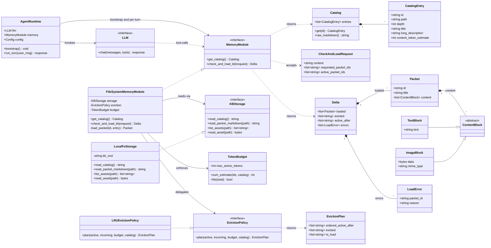
```mermaid
classDiagram
    direction LR

    class AgentRuntime {
        +LLM llm
        +MemoryModule memory
        +Config config
        +bootstrap() void
        +run_turn(user_msg) response
    }

    class LLM {
        <<interface>>
        +chat(messages, tools) response
    }

    class MemoryModule {
        <<interface>>
        +get_catalog() Catalog
        +check_and_load_kb(request) Delta
    }

    class FileSystemMemoryModule {
        -KBStorage storage
        -EvictionPolicy eviction
        -TokenBudget budget
        +get_catalog() Catalog
        +check_and_load_kb(request) Delta
        -load_packet(id, entry) Packet
    }

    class KBStorage {
        <<interface>>
        +read_catalog() string
        +read_packet_markdown(path) string
        +list_assets(path) list~string~
        +read_asset(path) bytes
    }

    class LocalFsStorage {
        -string kb_root
        +read_catalog() string
        +read_packet_markdown(path) string
        +list_assets(path) list~string~
        +read_asset(path) bytes
    }

    class Catalog {
        +list~CatalogEntry~ entries
        +get(id) CatalogEntry
        +raw_markdown() string
    }

    class CatalogEntry {
        +string id
        +string path
        +int depth
        +string title
        +string long_description
        +int content_token_estimate
    }

    class CheckAndLoadRequest {
        +string context
        +list~string~ requested_packet_ids
        +list~string~ active_packet_ids
    }

    class Delta {
        +list~Packet~ loaded
        +list~string~ evicted
        +list~string~ active_after
        +list~LoadError~ errors
    }

    class Packet {
        +string id
        +string title
        +list~ContentBlock~ content
    }

    class ContentBlock {
        <<abstract>>
    }

    class TextBlock {
        +string text
    }

    class ImageBlock {
        +bytes data
        +string mime_type
    }

    class LoadError {
        +string packet_id
        +string reason
    }

    class TokenBudget {
        +int max_active_tokens
        +sum_estimate(ids, catalog) int
        +fits(total) bool
    }

    class EvictionPolicy {
        <<interface>>
        +plan(active, incoming, budget, catalog) EvictionPlan
    }

    class LRUEvictionPolicy {
        +plan(active, incoming, budget, catalog) EvictionPlan
    }

    class EvictionPlan {
        +list~string~ ordered_active_after
        +list~string~ evicted
        +list~string~ to_load
    }

    AgentRuntime --> LLM : invokes
    AgentRuntime --> MemoryModule : bootstrap and per-turn
    LLM ..> MemoryModule : tool-calls

    FileSystemMemoryModule ..|> MemoryModule
    FileSystemMemoryModule --> KBStorage : reads via
    FileSystemMemoryModule --> EvictionPolicy : delegates
    FileSystemMemoryModule --> TokenBudget : enforces

    LocalFsStorage ..|> KBStorage
    LRUEvictionPolicy ..|> EvictionPolicy

    MemoryModule ..> Catalog : returns
    MemoryModule ..> Delta : returns
    MemoryModule ..> CheckAndLoadRequest : accepts
    EvictionPolicy ..> EvictionPlan : returns

    Catalog "1" *-- "*" CatalogEntry
    Delta "1" *-- "*" Packet : loaded
    Delta "1" *-- "*" LoadError : errors
    Packet "1" *-- "*" ContentBlock : content

    TextBlock --|> ContentBlock
    ImageBlock --|> ContentBlock
```

### 2.9.1 Class Responsibilities

| Class | Responsibility | Key references |
|---|---|---|
| `AgentRuntime` | Owns the conversation loop. On bootstrap calls `MemoryModule.get_catalog()` to inject the catalog into the system prompt (§2.7). On each user turn, invokes the LLM; forwards any `check_and_load_kb` tool calls to the memory module. Exposes the turn twice — `run_turn_stream` (the primitive) and `run_turn` (drains it) — per §2.14. | §1.9, §2.7, §2.10, §2.14 |
| `LLM` (interface) | Abstract chat interface, streaming and non-streaming. Any concrete binding (Anthropic SDK, framework SDK) implements this. A binding that cannot stream degrades to one `assistant.delta` carrying the whole answer, so §2.14's contract holds for every provider. | §1.5 (framework-agnostic) |
| `MemoryModule` (interface) | The tool contract exposed to the LLM. Holds no packet content between calls; remembers only the active set's load order (D7). | §1.10, §2.3 |
| `FileSystemMemoryModule` | Concrete implementation. Composes a `KBStorage`, an `EvictionPolicy`, and a `TokenBudget`. Assembles `Packet` objects from storage-returned bytes. | §2.5, §2.6 |
| `KBStorage` (interface) | Backing-store abstraction. The seam that lets the KB move off local disk later (D4a). | §1.9, D4a |
| `LocalFsStorage` | Default implementation: reads catalog and packet files from a local KB root. | §2.1 |
| `Catalog` / `CatalogEntry` | Parsed catalog and per-packet metadata for **every content-bearing folder in the KB** (D3a), keyed by packet ID. `CatalogEntry` carries `id`, `path`, `depth`, `title` and `long`; a parent id is the key minus its last segment, so the tree reconstructs without a stored field. `Catalog.raw_markdown()` returns the exact string for system-prompt injection. | §2.2.1, D3a |
| `CheckAndLoadRequest` | Input DTO for `check_and_load_kb`. Carries `context`, `requested_packet_ids`, `active_packet_ids`. | §2.3.2 |
| `Delta` | Output DTO. Contains `loaded` (new content), `evicted` (IDs only), `active_after` (authoritative), and per-packet `errors`. | §2.3.2, D6 |
| `Packet` | A loaded packet: id, title, and an ordered list of `ContentBlock`s (metadata header text, packet markdown, and images). | §2.6 |
| `ContentBlock` / `TextBlock` / `ImageBlock` | Polymorphic content blocks. `ImageBlock` carries raw bytes + MIME type; runtime bindings render to their SDK's image format. | §2.6, D9 |
| `TokenBudget` | Holds `max_active_tokens`; sums per-entry `token_size_estimate` from the catalog. | §2.5 |
| `EvictionPolicy` (interface) | Decides which packets to evict when adding new ones would exceed budget. Pluggable — LRU is the default. | §2.5, D8 |
| `LRUEvictionPolicy` | Default: order candidates LRU, evict from head until `TokenBudget.fits()`. Produces an `EvictionPlan`. | §2.5 |
| `EvictionPlan` | Result of an eviction pass: `ordered_active_after`, `evicted` IDs, `to_load` IDs. Consumed by `FileSystemMemoryModule` to drive storage reads. | §2.5 |
| `LoadError` | Per-packet error (unknown ID, missing file, budget-exceeded). Bundled inside `Delta.errors` so partial success is representable. | §2.8 |

### 2.9.2 Extension Points

Three points in the class model are designed for substitution:

1. **`KBStorage`** — swap `LocalFsStorage` for `S3Storage`, `GitVersionedStorage`, `RemoteHttpStorage`, etc. Zero changes elsewhere.
2. **`EvictionPolicy`** — swap `LRUEvictionPolicy` for `LFUEvictionPolicy`, `PinnedFirstEvictionPolicy` (allow pinning a packet), or `TaskAwareEvictionPolicy` (weight by classification confidence).
3. **`LLM`** — bind to any framework or provider. `AgentRuntime` depends only on the `chat(messages, tools)` shape.

`MemoryModule` itself is also an interface, so in principle an alternative implementation (e.g., an in-process cache-only module wrapping another) could replace `FileSystemMemoryModule` without touching the agent.

## 2.10 Sequence Diagrams

**Diagram conventions.** To keep Mermaid syntax portable, message labels are short verbs, and structured data (packet ID lists, delta contents) is shown in `Note` blocks. No semicolons, brackets, or pipes appear inside labels or notes.

### 2.10.1 Cold start + first turn (additive load)

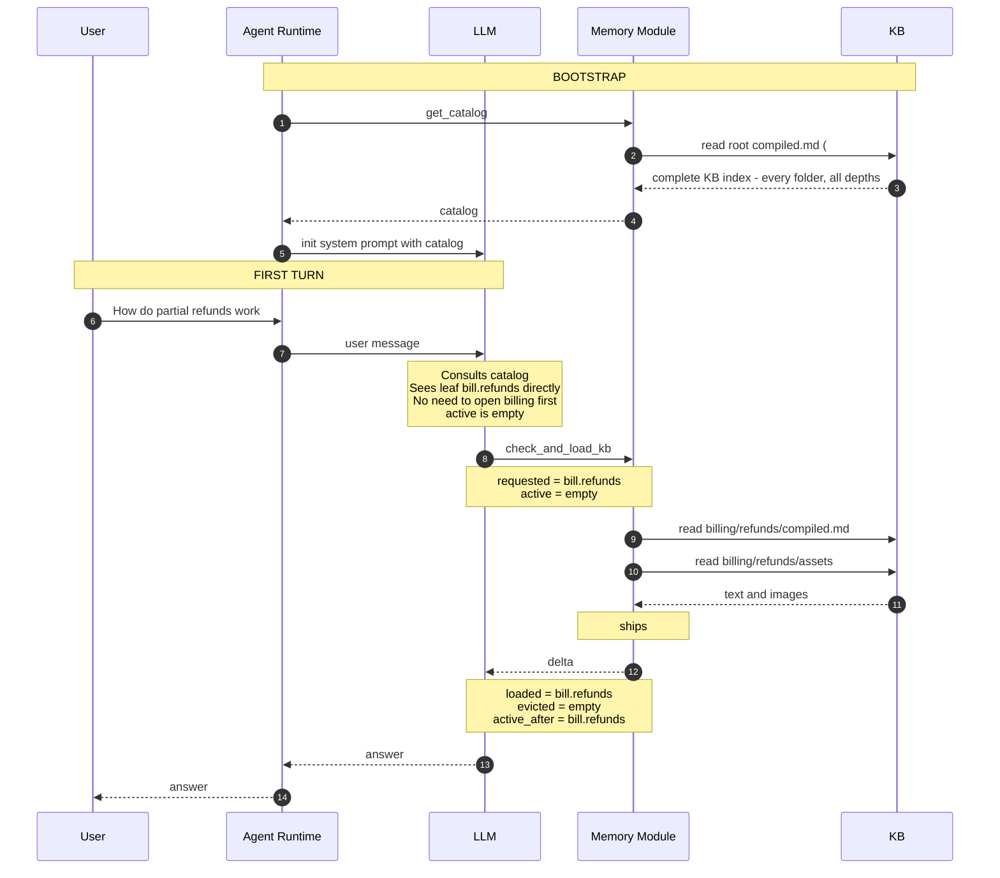
```mermaid
sequenceDiagram
    autonumber
    participant U as User
    participant R as Agent Runtime
    participant L as LLM
    participant M as Memory Module
    participant K as KB

    Note over R,K: BOOTSTRAP
    R->>M: get_catalog
    M->>K: read root compiled.md (## Catalog section)
    K-->>M: complete KB index - every folder, all depths
    M-->>R: catalog
    R->>L: init system prompt with catalog

    Note over U,L: FIRST TURN
    U->>R: How do partial refunds work
    R->>L: user message
    Note over L: Consults catalog<br/>Sees leaf bill.refunds directly<br/>No need to open billing first<br/>active is empty
    L->>M: check_and_load_kb
    Note over L,M: requested = bill.refunds<br/>active = empty
    M->>K: read billing/refunds/compiled.md
    M->>K: read billing/refunds/assets
    K-->>M: text and images
    Note over M: ships ## Content only<br/>the catalog lives at the root and is already in the system prompt
    M-->>L: delta
    Note over L,M: loaded = bill.refunds<br/>evicted = empty<br/>active_after = bill.refunds
    L-->>R: answer
    R-->>U: answer
```

### 2.10.2 Follow-up turn — no reload needed

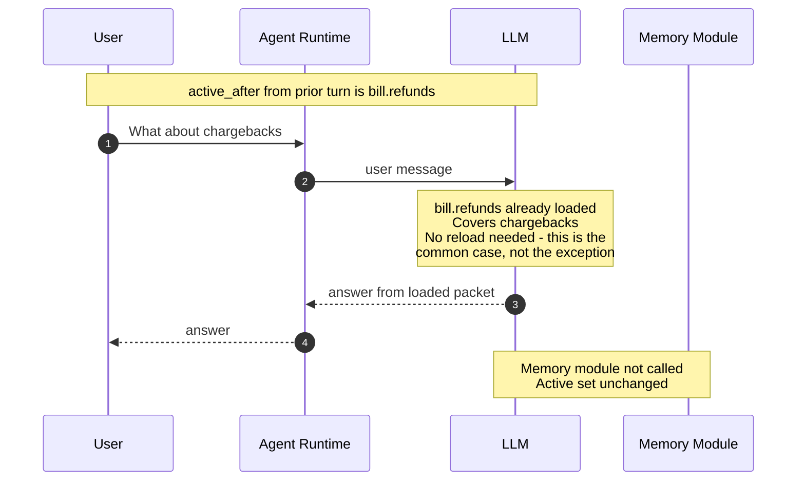
```mermaid
sequenceDiagram
    autonumber
    participant U as User
    participant R as Agent Runtime
    participant L as LLM
    participant M as Memory Module

    Note over U,L: active_after from prior turn is bill.refunds

    U->>R: What about chargebacks
    R->>L: user message
    Note over L: bill.refunds already loaded<br/>Covers chargebacks<br/>No reload needed - this is the<br/>common case, not the exception
    L-->>R: answer from loaded packet
    R-->>U: answer

    Note over L,M: Memory module not called<br/>Active set unchanged
```

### 2.10.3 Follow-up turn — additive load within budget

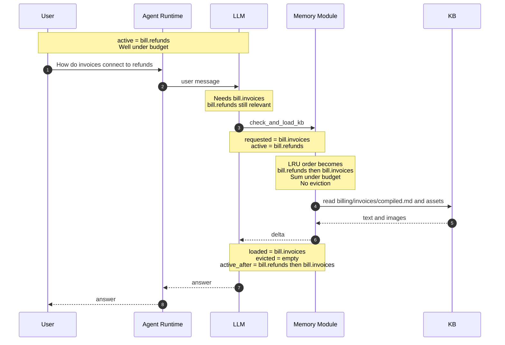
```mermaid
sequenceDiagram
    autonumber
    participant U as User
    participant R as Agent Runtime
    participant L as LLM
    participant M as Memory Module
    participant K as KB

    Note over U,L: active = bill.refunds<br/>Well under budget

    U->>R: How do invoices connect to refunds
    R->>L: user message
    Note over L: Needs bill.invoices<br/>bill.refunds still relevant
    L->>M: check_and_load_kb
    Note over L,M: requested = bill.invoices<br/>active = bill.refunds
    Note over M: LRU order becomes<br/>bill.refunds then bill.invoices<br/>Sum under budget<br/>No eviction
    M->>K: read billing/invoices/compiled.md and assets
    K-->>M: text and images
    M-->>L: delta
    Note over L,M: loaded = bill.invoices<br/>evicted = empty<br/>active_after = bill.refunds then bill.invoices
    L-->>R: answer
    R-->>U: answer
```

### 2.10.4 Follow-up turn — load with eviction

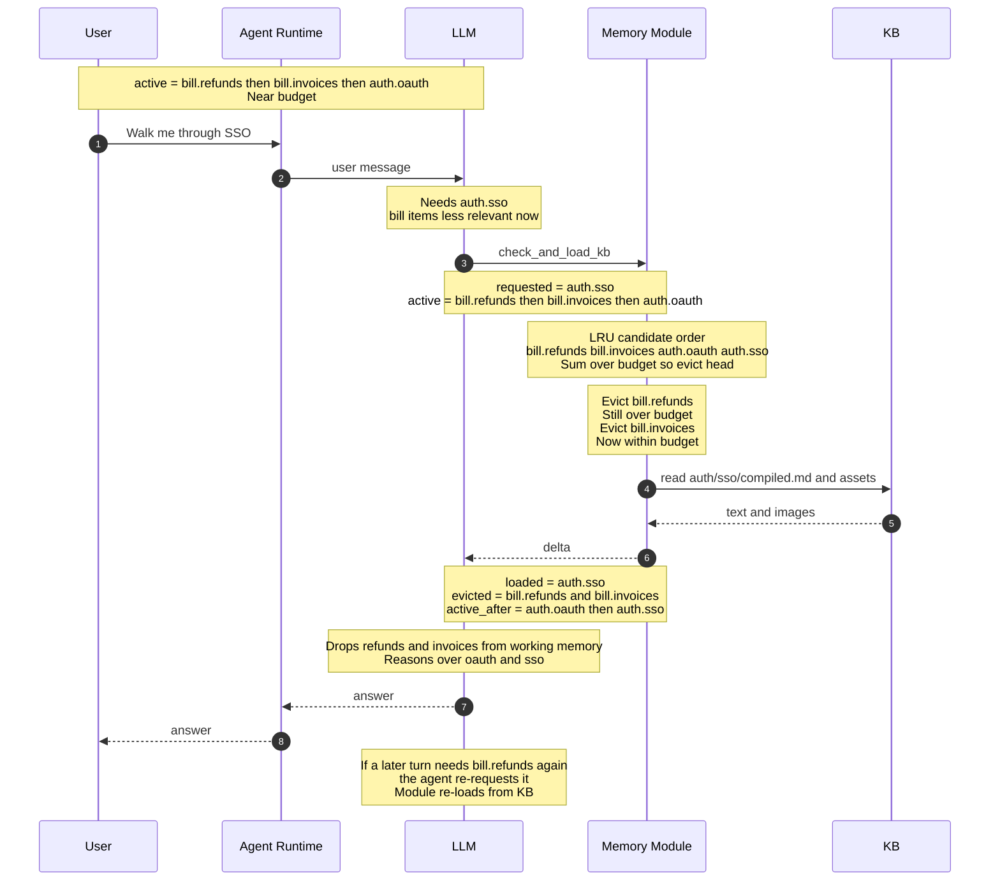
```mermaid
sequenceDiagram
    autonumber
    participant U as User
    participant R as Agent Runtime
    participant L as LLM
    participant M as Memory Module
    participant K as KB

    Note over U,L: active = bill.refunds then bill.invoices then auth.oauth<br/>Near budget

    U->>R: Walk me through SSO
    R->>L: user message
    Note over L: Needs auth.sso<br/>bill items less relevant now
    L->>M: check_and_load_kb
    Note over L,M: requested = auth.sso<br/>active = bill.refunds then bill.invoices then auth.oauth
    Note over M: LRU candidate order<br/>bill.refunds bill.invoices auth.oauth auth.sso<br/>Sum over budget so evict head
    Note over M: Evict bill.refunds<br/>Still over budget<br/>Evict bill.invoices<br/>Now within budget
    M->>K: read auth/sso/compiled.md and assets
    K-->>M: text and images
    M-->>L: delta
    Note over L,M: loaded = auth.sso<br/>evicted = bill.refunds and bill.invoices<br/>active_after = auth.oauth then auth.sso
    Note over L: Drops refunds and invoices from working memory<br/>Reasons over oauth and sso
    L-->>R: answer
    R-->>U: answer

    Note over L: If a later turn needs bill.refunds again<br/>the agent re-requests it<br/>Module re-loads from KB
```

## 2.11 Observability

Observability has two independent layers:

1. **OTEL traces for AI observability** — *optional*, configuration-driven. When a trace destination is configured, the agent emits distributed traces of turns, LLM calls, and tool calls. Consumers can point this at Langfuse, AWS CloudWatch, Grafana Tempo, Honeycomb, or any OpenTelemetry-compatible backend without code changes. Langfuse — by far the most common destination for this workload — additionally has a **direct configuration form** that needs only a key pair, rather than a hand-assembled OTLP endpoint and auth header (§2.11.1).
2. **Local file logging** — *always on*. Structured log lines at `DEBUG` / `INFO` / `WARN` / `ERROR` levels written to a local log file. Ensures that key decisions (which branch was classified, which packets loaded, which evicted, why) are followable post-hoc even when tracing is disabled.

### 2.11.1 Configuration

Observability is driven by configuration only — no code changes to switch backends.

| Config key | Type | Default | Effect |
|---|---|---|---|
| `otel.endpoint` | URL (string) | unset | If set, initialize OTEL SDK with an OTLP exporter pointing here. If unset (and no Langfuse block), tracing is a no-op. |
| `otel.protocol` | `http/protobuf` or `grpc` | `http/protobuf` | OTLP transport. |
| `otel.headers` | map<string,string> | empty | Auth headers (e.g., AWS SigV4 side-car, bearer tokens). |
| `otel.service_name` | string | `hcag-agent` | `service.name` resource attribute. Shared by both destination forms. |
| `langfuse.host` | URL (string) | `https://cloud.langfuse.com` | Langfuse base URL. Set for the EU/US regional hosts or a self-hosted instance. The OTLP path is appended by HCAG — give the base URL only. |
| `langfuse.public_key_env` | string | `LANGFUSE_PUBLIC_KEY` | Env var holding the Langfuse public key. |
| `langfuse.secret_key_env` | string | `LANGFUSE_SECRET_KEY` | Env var holding the Langfuse secret key. |
| `capture_content` | bool | `true` | Export prompt/completion payloads on spans (§2.11.2). Off drops the payloads and keeps structure, model, and token counts. |
| `max_content_chars` | integer | `250000` | Cap on one exported payload. Oversized payloads shed whole messages from the middle and budget from the tail backwards (§2.11.2), never a head cut. |
| `max_message_chars` | integer | `25000` | Cap on a single message inside a payload. Long messages are cut in the middle, keeping both ends. |
| `log.file_path` | path (string) | `./hcag.log` | Local log file destination. |
| `log.level` | `DEBUG` \| `INFO` \| `WARN` \| `ERROR` | `INFO` | Threshold for file logging. |
| `log.rotation` | struct (size/time) | size 50MB, keep 5 | Optional rotation policy. |

#### Two ways to configure one exporter

Langfuse ingests OpenTelemetry over OTLP, so the direct form is **not a second tracing pipeline** — it is a shorthand that materializes the same OTLP exporter the `otel.*` keys build by hand:

| | Derived from `[observability.langfuse]` |
|---|---|
| endpoint | `<langfuse.host>` + `/api/public/otel` + `/v1/traces` |
| protocol | `http/protobuf` (pinned — Langfuse's OTLP ingest is HTTP; `otel.protocol` is not consulted) |
| headers | `Authorization: Basic base64(<public key>:<secret key>)`, assembled from the env vars |

**The signal path is HCAG's job, not the exporter's.** OTLP/HTTP carries each signal on its own path, and the OpenTelemetry exporter appends `/v1/traces` *only* when it falls back to the `OTEL_EXPORTER_OTLP_ENDPOINT` environment variable — an `endpoint` passed to it in code is used verbatim. Vendors, Langfuse included, document the base URL (`https://cloud.langfuse.com/api/public/otel`), so handing that straight to the exporter POSTs to a route that does not exist and every batch fails with `404, reason: Not Found`. HCAG therefore appends `/v1/traces` itself, for **both** configuration forms — a generic `otel.endpoint` of `http://localhost:4318` has exactly the same problem — and tolerates an endpoint that already names the signal, so a URL copied from either style of documentation works. gRPC endpoints have no path semantics and are passed through untouched.

Everything downstream is unchanged: the same span tree (§2.11.2), the same `service.name`, the same `trace_id` in the file log (§2.11.3), the same LiteLLM-native `gen_ai.*` spans that Langfuse renders as generations.

**Why this exists.** The generic form asks an operator to know Langfuse's OTLP path, know that auth is HTTP Basic rather than a bearer token, and base64-encode a key pair by hand into a config file — three chances to get it wrong, producing a setup that looks configured and silently exports nothing. The direct form asks for a key pair. This is a configuration-ergonomics change and nothing more; it deliberately does not add the Langfuse Python SDK as a dependency, because a second span pipeline would mean two code paths to keep in sync with §2.11.2 for no gain.

**Activation and precedence.** Tracing initializes only when a destination is configured, and exactly one may be:

- Neither `otel.endpoint` nor `[observability.langfuse]` present → tracing is a **no-op**. This is the default and stays the default; nothing is sent anywhere unless asked for.
- `[observability.langfuse]` present → the derived exporter above.
- `otel.endpoint` present → the generic exporter, unchanged.
- **Both present → startup error**, naming both keys. Silently preferring one would produce an agent whose traces go somewhere the operator did not intend, which is worse than not starting. Fan-out to two backends is deliberately unsupported: point `otel.endpoint` at a collector and let the collector fan out — that is what collectors are for.

**Credentials never live in the config file.** Like every other secret in this system (`llm.api_key_env`, §3.6; the LiveKit key pair, §5.8), the Langfuse keys are named by env var and read from the environment. `[observability.langfuse]` accepts no inline key fields at all, so a secret cannot be committed by accident.

**Failure modes — loud, but not fatal.** This is the one place the fail-closed stance of §3.4.9 does *not* apply, and the asymmetry is deliberate. `hcag`'s build aborts without an LLM because there is no build without one; the agent's *purpose* is answering questions, and it can do that perfectly well while unable to report on itself. Refusing to start over a missing trace key trades a total outage for a partial one, and does it at the worst possible moment — a key rotation, a new environment, a first deploy.

What the original fail-closed rule was protecting is the word *silently*: an operator who asked for traces and is not getting them must find out immediately, not next week when they go looking for a trace that was never recorded. That property is kept in full. A broken destination is reported on **stderr and at `ERROR` in the log**, naming the exact variable — the operator who just set a destination is usually watching a terminal, and being told now is what matters, not whether the process then exits.

| Condition | Behavior |
|---|---|
| No trace destination configured at all | Silent no-op. Not configuring tracing is a choice, not a misconfiguration, and warning about it would train operators to ignore the channel that carries the real warnings. |
| `[observability.langfuse]` present, key env var unset or empty | **`ERROR` + stderr** naming the variable and that it is read from the environment; the agent starts and serves turns with tracing off. |
| Exporter cannot be constructed (bad endpoint, TLS failure, SDK mismatch) | Same: reported, tracing off, agent runs. |
| OTEL SDK not installed | Same: reported, tracing off. Tracing is an optional extra (§2.13.6); a missing optional dependency is not a reason to refuse to answer questions. |
| Langfuse host unreachable at runtime | Export failures are logged by the OTLP exporter and dropped. Traces are best-effort — a telemetry outage must never fail a user turn. |
| Both `otel.endpoint` and `[observability.langfuse]` configured | **Startup error** naming both, asking the operator to pick one. |

The last row stays fatal, and the distinction is worth being precise about. Every other row is *the operator asked for X and cannot have it* — recoverable, because running without X is a coherent state. Configuring both destinations is *the operator's intent is unknown*: traces would go somewhere they did not choose, and there is no safe default to fall back to. Ambiguity about where a conversation's contents get sent is a config bug to fix before starting, not a degraded mode to run in.

`resolve_destination` still raises on a broken destination; degrading is `build_tracer`'s policy, layered on top. The check and the response to it are separate on purpose, so a caller that genuinely wants startup to fail can have that by calling the former.

Example destinations:

- **Langfuse (direct):** set `[observability.langfuse]` and export `LANGFUSE_PUBLIC_KEY` / `LANGFUSE_SECRET_KEY`. Nothing else. `docker compose up` in a clone of `langfuse/langfuse` brings a local instance up on `http://localhost:3000` if you do not have one; Langfuse Cloud needs only `host = "https://cloud.langfuse.com"`. The sample `examples/agent.toml` ships with this block **commented out**, so a fresh checkout runs with no trace backend and no warnings.
- **Langfuse (generic OTLP):** `otel.endpoint = https://cloud.langfuse.com/api/public/otel` with a hand-built `Authorization: Basic <base64(pk:sk)>` header. Still supported; the direct form exists because this is the step people get wrong.
- **AWS CloudWatch (via ADOT):** `otel.endpoint = http://localhost:4318` pointing at a local ADOT collector, which forwards to CloudWatch.
- In both cases the base URL is what you configure; HCAG appends `/v1/traces`.
- **Grafana Tempo / Honeycomb / any OTLP receiver:** point `otel.endpoint` at their OTLP ingest URL.

### 2.11.2 OTEL Trace Model

When enabled, the agent emits a span hierarchy per user turn. Spans follow OpenTelemetry **GenAI semantic conventions** where they exist and custom `hcag.*` attributes where they do not.

**`conversation.turn` is the root, and the runtime populates every attribute itself.** Both halves matter. Without a turn-scoped root span each LLM call becomes its own disconnected trace, and a backend shows a conversation as unrelated fragments rather than one turn with its tool calls beneath it. And the attributes are set by `AgentRuntime` around its own calls rather than harvested from a provider SDK's instrumentation: a bare `start_as_current_span("gen_ai.chat")` that wraps the call without recording anything exports a span with a name and a duration and nothing else — structurally present, analytically useless. Request attributes go on **before** the call so a failed call still carries its model and parameters; usage and output go on after.

```
conversation.turn                              [span] ROOT — one per user turn
├─ attrs: hcag.turn.index, hcag.user.message.chars,
│         hcag.turn.reload_calls, hcag.turn.redundant_reloads,
│         session.id, langfuse.session.id
│
├─ gen_ai.chat                                 [span] LLM call
│  └─ attrs: langfuse.observation.type=generation,
│            gen_ai.system=anthropic,
│            gen_ai.operation.name=chat,
│            gen_ai.request.model,
│            gen_ai.request.max_tokens,
│            gen_ai.request.temperature,
│            gen_ai.response.model,
│            gen_ai.response.tool_calls,
│            gen_ai.usage.input_tokens,
│            gen_ai.usage.output_tokens,
│            gen_ai.usage.cache_read_input_tokens
│
├─ tool.<name>                                 [span] one per tool call
│  ├─ attrs (every tool): gen_ai.operation.name=execute_tool,
│  │                      gen_ai.tool.name
│  │
│  ├─ tool.check_and_load_kb adds:
│  │      hcag.tool.requested_ids,
│  │      hcag.tool.active_ids_in,
│  │      hcag.tool.context (truncated),
│  │      hcag.tool.loaded_ids,
│  │      hcag.tool.evicted_ids,
│  │      hcag.tool.active_ids_after,
│  │      hcag.tool.redundant,
│  │      hcag.tool.errors,
│  │      hcag.tool.tokens_used,
│  │      hcag.tool.tokens_budget
│  │
│  ├─ tool.get_catalog adds: hcag.tool.unnecessary=true (§2.12 item 6)
│  └─ tool.<unrecognized> adds: hcag.tool.unknown=true, span status ERROR
│
│     ├─ kb.packet.load                        [span] per loaded packet
│     │  ├─ attrs: hcag.packet.id,
│     │  │         hcag.packet.path,
│     │  │         hcag.packet.markdown_bytes,
│     │  │         hcag.packet.image_count,
│     │  │         hcag.packet.token_estimate
│     │  └─ status: OK | ERROR (with error message)
│     │
│     └─ kb.eviction                           [span, only if evictions occurred]
│        └─ attrs: hcag.eviction.ids,
│                  hcag.eviction.reason=budget,
│                  hcag.eviction.tokens_reclaimed
│
└─ gen_ai.chat (final answer)                  [span]
   └─ attrs: gen_ai.usage.*
```

**Tool spans are siblings of `gen_ai.chat`, not children of it.** The model's turn is a sequence — call, tool, call — and the chat span closes when the LLM returns, before the tool runs. Nesting the tool under the call that requested it would misreport the timing (the tool's duration is not part of the LLM's) and would leave the final answering call looking unrelated to the work that fed it. Both hang off `conversation.turn`, in the order they happened.

**Every tool call gets a span, named `tool.<name>`, whatever the name.** The span is opened around the dispatch rather than inside the branch for each tool we recognize. Instrumenting only the tools we care about is how a `get_catalog` call — or a hallucinated tool name — ends up producing no span at all, leaving a trace in which the turn appears to do nothing between two LLM calls. A trace that omits some tool calls cannot be used to answer what a turn did.

#### Input and output payloads

Token counts and latency say what a turn *cost*; they do not say what it *did*. A trace without the prompt and the completion cannot answer most of §2.11.4's questions — which packets the model was actually reasoning over, why it picked the branch it picked, what it said. So `conversation.turn`, `gen_ai.chat`, and `tool.check_and_load_kb` each carry an input and an output payload as JSON strings on `langfuse.observation.input` / `langfuse.observation.output`, and `gen_ai.chat` additionally sets `langfuse.observation.type = "generation"` so a backend renders it as a model call rather than a plain span.

These are ordinary OTEL attributes. They are named for the backend that reads them most directly, but nothing in the agent depends on Langfuse, and they are inert on any other OTLP receiver — which keeps §2.11.1's promise that the two configuration forms differ only in how the exporter is addressed.

Three rules govern what actually ships:

- **Content export is opt-out, not mandatory** (`observability.capture_content`, default on). Prompts contain KB content and user questions; exporting them to a third party is a decision, not a detail. Turning it off drops the payloads and keeps everything else, so cost and latency stay observable when the content itself must not leave the process.
- **Payloads are capped, and reduced from the right end.** `observability.max_content_chars` (default 250 000) bounds one payload and `observability.max_message_chars` (default 25 000) bounds any single message inside it. The defaults are sized so a real prompt — catalog plus a loaded active set — fits whole, because the question a trace exists to answer is *"did the model actually have the right information?"*, and a payload cut short cannot answer it.

  **Head truncation is the wrong strategy and the default cap must not be small.** An HCAG prompt opens with the system prompt and the entire catalog, and the material that answers that question — the loaded packets, arriving as tool results — sits at the **end**. Cutting a character budget off a serialized conversation keeps the least informative part and discards exactly the part being looked for. So an oversized payload is reduced in three stages: emit as-is; shed whole messages from the middle, oldest first, keeping the system prompt and the last three (a turn's tail is question → tool call → tool result, and losing any one removes what the trace was opened to check); then allocate the remaining characters **from the tail backwards**, so the newest messages are served whole and the bulky catalog is what shrinks. An individual message that must be shortened is cut in the **middle**, keeping both ends, because for a packet the identifying head and the trailing detail are both load-bearing.

  Every reduction is marked with the original size. A silently shortened payload is worse than no payload: it looks complete, so a reader concludes the prompt lacked something it contained.
- **Image bytes never enter a trace.** A packet's images ride the conversation as base64 (§2.6) and would add megabytes per span. They are replaced by an `[image]` marker, which preserves the shape of the conversation without the weight.

**Bootstrap-only span (once per conversation):**

```
memory.bootstrap                               [span]
└─ tool.get_catalog                            [span]
   ├─ attrs: hcag.catalog.entries,
   │         hcag.catalog.bytes
   └─ status: OK | ERROR
```

**Attribute policy.** Never put full packet content, full user messages, or full LLM outputs into span attributes — attributes are size-bounded and often sent unfiltered to third-party services. Truncate to a configurable byte cap (default 512 chars) and prefer IDs + sizes over payloads. Full payloads belong in the file log, at DEBUG.

### 2.11.3 Local File Logging

The file log is the **decision log**. Its job is to make it possible to reconstruct, after the fact, what the agent decided and why — without needing an OTEL backend running. It is always on.

**Levels and what belongs at each:**

| Level | What is logged |
|---|---|
| `ERROR` | Failures that abort a step or turn: catalog missing at startup, packet load failure, budget-exceeded on a single requested packet, tool contract violation. |
| `WARN` | Recoverable oddities: unknown packet ID skipped, image unreadable (packet still returned), unusually large delta, active-set thrash detected (N reloads within M turns), redundant `check_and_load_kb` call whose requested ids were all already active (§2.7.1). |
| `INFO` | Key decisions: bootstrap complete (catalog entries, bytes), turn start, `check_and_load_kb` call with counts (requested, active-in, loaded, evicted, budget), branch classification result (which domain/subdomain/topic the agent picked), and per-session `reload.redundant_rate` (§2.7.1) — turns that called the tool without loading anything, over total turns. |
| `DEBUG` | Full detail: catalog contents digest, per-packet metadata, full requested/active/loaded/evicted ID lists, per-packet token accounting, full tool arguments and results (subject to a max-size cap). |

**Format.** JSON-lines, one record per line, with fields: `ts` (ISO-8601), `level`, `event`, `session_id`, `turn`, `trace_id` (correlates with OTEL when enabled), and event-specific fields. Example:

```json
{"ts":"2026-08-23T14:22:07Z","level":"INFO","event":"check_and_load_kb.result","session_id":"s-abc","turn":3,"trace_id":"7f2a...","requested":["auth.sso"],"active_in":["bill.refunds","bill.invoices","auth.oauth"],"loaded":["auth.sso"],"evicted":["bill.refunds","bill.invoices"],"active_after":["auth.oauth","auth.sso"],"tokens_used":6820,"tokens_budget":8000}
```

**Correlation.** Every log record includes `trace_id` (and `span_id` where available). When tracing is enabled — through either configuration form (§2.11.1) — a support engineer can pivot from a log line to the corresponding trace in Langfuse / CloudWatch and vice versa. The id is the same either way, because both forms feed the same exporter.

### 2.11.4 What the Two Layers Together Answer

- **"Why did the agent load bill.refunds on turn 3?"** — INFO log has the classification decision and the requested IDs; DEBUG log has the reasoning context; OTEL span has the timing and token counts.
- **"Is the active set thrashing?"** — WARN log fires on excessive reload rate; OTEL dashboard shows load/evict spans per turn over time.
- **"Where is the token cost going?"** — OTEL `gen_ai.usage.*` attributes aggregated across `gen_ai.chat` spans; file log gives per-turn budget snapshots.
- **"Did prompt caching hit?"** — OTEL `gen_ai.usage.cache_read_input_tokens` per LLM span.


## 2.12 Prompt-Cache Alignment (realizing Problem 3)

The "classify once, reuse across steps" property in §1.1 and §1.2 only pays off if the prompt prefix that the model sees stays byte-stable across turns. Concrete implementation guidance:

1. **Stable system prompt.** The catalog is injected once at conversation start and does not change mid-session. If catalog re-inspection is needed, use the `get_catalog` tool (which appears as a per-turn tool result, not a system-prompt mutation). The whole-KB index (D3a) makes the system prompt larger but **more** cache-friendly, not less: it is a one-time prefix cost paid at the cache-write rate on turn one and read at ~10% thereafter, and it displaces per-level `check_and_load_kb` round trips that would each have appended a fresh, uncached tool-result block mid-conversation. The move to a table cuts that prefix substantially — a row against eight labelled lines per folder — so the cheapest turn in the system got cheaper.
2. **Stable tool-result blocks.** A prior `check_and_load_kb` response, once emitted into history, is never rewritten. Delta semantics (D6) guarantee this — subsequent calls append new tool results rather than modifying old ones.
3. **Deterministic packet serialization.** For a given packet ID, the module must emit byte-identical content (same metadata header, same markdown, same image ordering) across calls. Any nondeterminism (e.g., variable timestamps in headers) breaks caching.
4. **Cache-control markers.** In runtimes that expose them (e.g., Anthropic prompt caching), mark the system prompt and each `check_and_load_kb` tool result as a cache breakpoint. Combined with (1)–(3), this yields the 90%+ token-cost reduction on subsequent reasoning steps within the same task.
5. **Avoid unnecessary reloads.** The agent should not call `check_and_load_kb` "just to refresh" — every call that produces a delta (even an empty one) is a new tool-result block, plus a full extra LLM round trip. D5 forbids this and §2.7.1 specifies how it is enforced and measured.
6. **No catalog traffic in history.** With the full index in the cached system prefix, `get_catalog` should never be called mid-session and intermediate taxonomy nodes should never be loaded for navigation (§2.7). Both would inject catalog text into the uncached tail of the conversation — text that is already in the cached head.

## 2.13 Tech Stack

Design decisions above are language-agnostic; this section pins the implementation choices. The overriding constraint: **the LLM is invoked through a provider-neutral library, not a vendor SDK**. This preserves D10 (framework-agnostic contracts) at the implementation layer and lets the same code target Anthropic direct today and AWS Bedrock (or others) tomorrow with only a config change.

### 2.13.1 Language and Runtime

- **Python 3.11+**
- Rationale: `tomllib` is stdlib (config parsing), mature OTEL SDK, first-class LiteLLM support, wide availability of tokenizers, natural fit for CLI + service in one package.

### 2.13.2 LLM Access — Provider-Neutral

**Chosen library: LiteLLM (`litellm`).**

LiteLLM exposes a single `litellm.completion(model, messages, tools, ...)` API that transparently dispatches to 100+ providers. Provider selection is a config-only switch — no code changes to move between Anthropic-direct and Bedrock.

| Provider | LiteLLM `model` string | Credentials source |
|---|---|---|
| Anthropic direct | `claude-3-5-sonnet-20241022`, `claude-3-5-haiku-20241022`, etc. | `ANTHROPIC_API_KEY` env var |
| AWS Bedrock (Anthropic models) | `bedrock/anthropic.claude-3-5-sonnet-20241022-v2:0` | Standard AWS credential chain (`AWS_ACCESS_KEY_ID`/`AWS_SECRET_ACCESS_KEY`/`AWS_REGION`, or IAM role) |
| AWS Bedrock (other models) | `bedrock/<vendor>.<model>` | Same |
| Ollama (local) | `ollama/llama3`, `ollama/mistral` | `OLLAMA_API_BASE` (default `http://localhost:11434`) |
| OpenAI-compatible (future) | `openai/<model>` with `api_base` | `OPENAI_API_KEY` |

**Consequences of the LiteLLM choice, relevant to HCAG:**

- **Tool use.** LiteLLM normalizes tool-call format across providers. HCAG's `get_catalog` and `check_and_load_kb` are defined once and work identically on Anthropic and Bedrock.
- **Prompt caching.** LiteLLM supports Anthropic's `cache_control` markers (§2.12); on Bedrock, prompt caching is enabled per Bedrock's own semantics. The HCAG runtime tags the system prompt and each `check_and_load_kb` tool-result block as cache breakpoints; LiteLLM forwards this to whichever provider is active.
- **OTEL integration.** LiteLLM emits GenAI-semantic-convention spans natively when the OTEL SDK is initialized; this satisfies most of §2.11.2's `gen_ai.chat` span layer with zero extra glue. HCAG adds only the `tool.*`, `kb.*`, `hcag.*` spans.

The runtime's `LLM` interface (§2.9) is bound to LiteLLM by a single thin adapter class — the rest of the code sees only the interface.

### 2.13.3 Configuration, CLI, Content, Tokenization

| Concern | Library | Notes |
|---|---|---|
| Config schema and validation | **Pydantic v2** | `hcag.toml` (CLI) and `agent.toml` (runtime) are loaded into typed models |
| TOML parsing | **`tomllib`** (stdlib) | Python 3.11+ |
| YAML front-matter in `compiled.md` | **python-frontmatter** + **PyYAML** | Reading and writing |
| CLI framework | **Typer** (built on Click) | Typed subcommands (`hcag`) |
| Tokenization (build-time estimates) | **tiktoken** (default, `cl100k_base` proxy) | Runtime never re-tokenizes; the design's `token_size_estimate` is read from catalog |
| Image MIME detection (CLI, optional) | **Pillow** | Runtime uses file extension only |
| HTML fetch (`crawl`) | **httpx** | Sync client with retries and a redirect cap (§4.4.1) |
| Main-content extraction (`crawl`) | **trafilatura** (`>=2.0` — Markdown output) | Reading-mode extraction of the article body, Markdown output with links, formatting, tables, and images; comments/nav/header/footer excluded (§4.4.1). Pulls in `lxml`. |
| DOM pre-pass and fallback conversion (`crawl`) | **beautifulsoup4** + **markdownify** | Link harvesting and `` rewriting before extraction; whole-DOM Markdown for pages extraction rejects (§4.4.1 stage 3) |
| PDF text/image extraction (`crawl`) | **pypdf** | §4.4.2 |

Markdown content is treated as opaque UTF-8 text; no markdown-parser dependency is required for the memory module. The CLI concatenates source `.md` files verbatim between separators, so no round-tripping through a markdown AST.

**Prompts.** `prompts_dir` (default `./prompts`) names the directory an operator's prompt overrides are read from (§2.15). Prompt files are Markdown, loaded by name at startup, and layered over the defaults packaged with `hcag`. No prompt text appears in a `.py` module (D11). Variable substitution is **stdlib `string.Template`** (`$name` / `${name}`) — no new dependency, and its single reserved character keeps the braces in a prompt's JSON examples as ordinary text (§2.15.3).

### 2.13.4 Observability

| Layer | Library | Notes |
|---|---|---|
| Traces | **`opentelemetry-api`**, **`opentelemetry-sdk`**, **`opentelemetry-exporter-otlp-proto-http`** | Initialized only when a destination is configured — `otel.endpoint` or `[observability.langfuse]` (§2.11.1). `otel.protocol=grpc` swaps to `opentelemetry-exporter-otlp-proto-grpc`. |
| Langfuse | **none — no new dependency** | The direct form (§2.11.1) derives an OTLP endpoint and a Basic auth header from the configured key pair and reuses the exporter above. The `langfuse` SDK is deliberately not a dependency: a second span pipeline would be two code paths to keep in sync with §2.11.2. |
| File log | **stdlib `logging`** + custom JSON formatter | No extra dependency; JSON-lines format per §2.11.3 |
| GenAI spans | **LiteLLM native OTEL** | Emits `gen_ai.chat` spans with the usage attributes described in §2.11.2 |
| HCAG-specific spans | Direct OTEL SDK calls | `tool.*`, `kb.*`, `hcag.*` per §2.11.2 |

The two layers stay independent (§2.11): tracing may be disabled entirely; file logging is always on.

### 2.13.5 Testing and Packaging

- **Testing:** `pytest` + `pytest-mock`. LLM calls in tests are stubbed via a `FakeLLM` implementing the same `LLM` protocol as the LiteLLM adapter (see §2.9). No live network calls in the default test suite.
- **Packaging:** `pyproject.toml` with PEP 621 metadata. Package-manager-neutral (works with `uv`, `pip`, `poetry`). The `hcag` command is registered as a console script.

### 2.13.6 Dependency Summary

```
Required (runtime + CLI):
  litellm                                        # LLM provider abstraction
  pydantic>=2                                    # Config validation
  typer                                          # CLI
  python-frontmatter                             # compiled.md front-matter
  pyyaml                                         # YAML
  tiktoken                                       # Token estimation

Crawl (`crawl` CLI — §4):
  httpx                                          # fetching
  trafilatura>=2.0                               # main-content (reading-mode) extraction (Markdown output)
  beautifulsoup4                                 # DOM pre-pass: links + image src rewriting
  markdownify                                    # whole-DOM fallback conversion
  pymupdf4llm                                    # PDF -> Markdown incl. GFM tables (§4.4.2)
                                                 #   ^ AGPL-3.0 / Artifex commercial — see below

Optional (feature-flagged by config):
  opentelemetry-api                              # tracing (enabled when a destination is configured)
  opentelemetry-sdk
  opentelemetry-exporter-otlp-proto-http
  opentelemetry-exporter-otlp-proto-grpc         # only for otel.protocol=grpc
  pillow                                         # image MIME detection in CLI

Dev:
  pytest
  pytest-mock
```

**Licensing.** Every dependency above is permissive (MIT / BSD / Apache-2.0) **except one**: `pymupdf4llm` and its PyMuPDF core are **AGPL-3.0 or an Artifex commercial licence**. It is called out here because AGPL's network clause reaches software offered as a *service*, not only software shipped as binaries, so it is a constraint on how HCAG may be deployed rather than merely on how it is redistributed. §4.4.2 records why it was chosen anyway — PDF tables are where a KB's most load-bearing content lives, and losing their structure inverts answers rather than degrading them — and names `pdfplumber` (MIT) as the fallback if the licence is a blocker. The seam is a single function, `convert_pdf`.

### 2.13.7 Credentials

The provider is picked in config; the corresponding env vars must be present at runtime and CLI build time.

| Provider | Required env vars |
|---|---|
| **Anthropic direct** (default) | `ANTHROPIC_API_KEY` |
| **AWS Bedrock** | `AWS_ACCESS_KEY_ID`, `AWS_SECRET_ACCESS_KEY`, `AWS_REGION` — or an attached IAM role / AWS profile |
| Ollama / local | `OLLAMA_API_BASE` (optional; defaults to `http://localhost:11434`) |
| OpenAI-compatible (future) | `OPENAI_API_KEY` |

### 2.13.8 Deliberate Non-Dependencies

The implementation does **not** import these libraries, and the design forbids adding them at the LLM call site:

- **`anthropic`** — the vendor SDK. Adding it would tie HCAG to one provider and violate D10. LiteLLM handles Anthropic transparently.
- **`openai`** — same rationale.
- **`boto3` at the call site** — Bedrock is reached via LiteLLM, not by direct `boto3.client('bedrock-runtime')` calls in HCAG code. (`boto3` may appear transitively via LiteLLM's Bedrock backend; that transitive presence is acceptable because it does not leak into HCAG's own API surface.)
- **`langchain` / `llama-index`** — heavy retrieval frameworks. HCAG's retrieval pattern is agent-driven and controlled by the memory module (Part 2); a chain/graph framework would add layers without benefit here.

## 2.14 Turn API — Synchronous and Streaming

`AgentRuntime` exposes a turn two ways:

| | Returns | For |
|---|---|---|
| `run_turn(user_message) -> str` | the finished answer | `evalrun` (Part 7), scripts, tests, anything that wants one value |
| `run_turn_stream(user_message) -> Iterator[Event]` | events as they happen | the chat widget (Part 10), the voice session (Part 5) |

Both are on the same object and both produce byte-identical conversation history, so a session can mix them turn to turn.

### 2.14.1 Event vocabulary

A turn is not just text arriving in pieces. An HCAG turn *loads packets*, and which packets it chose is the most interesting thing about it — for a user watching a spinner, and for anyone debugging a wrong answer. The stream therefore carries tool activity as first-class events, not only tokens:

```json
{ "seq": 1, "kind": "assistant.start",  "turn_id": "t_9" }
{ "seq": 2, "kind": "tool.start",       "turn_id": "t_9", "tool": "check_and_load_kb",
  "requested": ["…employment-pass.eligibility"], "context": "EP qualifying salary at 45" }
{ "seq": 3, "kind": "tool.end",         "turn_id": "t_9", "tool": "check_and_load_kb",
  "loaded": ["…employment-pass.eligibility"], "evicted": [], "redundant": false }
{ "seq": 4, "kind": "assistant.delta",  "turn_id": "t_9", "text": "At 45, the " }
{ "seq": 5, "kind": "assistant.delta",  "turn_id": "t_9", "text": "qualifying salary is " }
{ "seq": 6, "kind": "assistant.final",  "turn_id": "t_9", "text": "At 45, the qualifying salary is …",
  "active_after": ["…employment-pass.eligibility"] }
```

`assistant.withheld` joins them for the case in §2.7.2: an answer was drafted with no packet loaded and is being replaced. It carries no text, because the draft is never shown; a client's only use for it is a progress indicator and a debug trail, and a client that ignores it sees a turn that simply took longer.

**This is deliberately the same vocabulary as the voice transcription channel (§5.7)** — `assistant.delta`, `assistant.final`, `system.*`, the monotonic `seq`, the grouping `turn_id`. One event schema, two transports: a LiveKit data channel for voice, SSE for chat. The widget renders both modes from one reducer, and a bug in delta handling is one bug rather than two. The alternative — a bespoke chat schema — would have made the widget's two modes structurally different for no reason beyond how the bytes arrive.

`tool.*` events are new here and are added to §5.7's channel as well, so voice can show the same "consulting *Employment Pass eligibility*…" affordance while the packet loads. That pause is otherwise the most conspicuous silence in a voice turn.

### 2.14.2 Why both, and which is primitive

**Streaming is the primitive; synchronous is derived.** `run_turn` consumes `run_turn_stream` and returns the final text. Not the other way around, and not two parallel implementations — a runtime with two independent turn paths grows two sets of behaviour, and the one with fewer users rots. Whatever a streaming turn does about tool loops, eviction, budget, or history, the synchronous turn does identically, because it *is* the same code.

**Both must exist.** Streaming is the right default for anything with a human waiting: an HCAG turn does a tool round trip before its first token, so time-to-first-token without streaming is the *whole* retrieval plus generation. But a streaming-only API would be actively worse for the things that consume this system programmatically. `evalrun` (§7.3) scores one answer per row and would gain nothing but a reassembly loop; the promptfoo provider (§7.4) wants a value; tests want a value.

**Streaming changes nothing about history or the prompt cache.** Deltas are accumulated and the assistant message is appended once, byte-identical to the non-streaming case — so §2.12's cache-alignment rules hold unchanged, and a session that streamed turn 3 and did not stream turn 4 has the same prefix either way. Delta-only tool results (D6) are likewise unaffected: `tool.end` reports *what* was loaded, while the packet content still enters history exactly once, in the tool-result block.

### 2.14.3 Errors after the first byte

Once a stream has started, **the HTTP status is already sent**. A failure at token 300 cannot become a `500`, which is the one genuinely new failure mode streaming introduces and the reason it needs its own contract rather than inheriting the synchronous one:

- Failures before the first event use ordinary HTTP status codes, exactly as the synchronous API does.
- Failures after it emit `{"kind": "error", "detail": …}` in-band and then close.
- A stream that ends **without** `assistant.final` is a failed turn, whatever the status line said. Clients must treat "closed early" as an error rather than as a short answer — a truncated answer that renders as a complete one is worse than a visible failure.
- The turn is not retried server-side. Retrying would re-emit deltas the client has already rendered, and there is no way to un-render them.

## 2.15 Prompts — Loaded by Name, Not Hard-Coded

Code names a prompt; a file supplies it (D11):

```python
prompts.get("agent.system")           # never a string literal in the module
```

### 2.15.1 Name to filename

A prompt name is a dotted identifier — `agent.system`, `tool.check_and_load_kb`, `preprocess.folder_metadata`. It resolves to a path by a deliberately narrow rule:

1. Lowercase.
2. Dots become directory separators, so `agent.system` reads `agent/system.md` and names group into folders on disk.
3. **Every character outside `[a-z0-9_-]` is stripped** from each segment — not escaped, not rejected, removed.
4. Append `.md`.

**Stripping rather than escaping is a security decision, not a cosmetic one.** A prompt name may one day come from configuration, an experiment matrix, or a per-tenant override; anything that survives into a path is a path-traversal primitive. `../../etc/passwd` and `prompts/../secrets` must not be able to name a file, and the only way to be certain is that the characters which make traversal possible — `.` as a segment, `/`, `\`, `~`, `%`, whitespace, control characters — cannot appear in a resolved segment at all. An allowlist that strips is verifiable by reading it; a denylist that escapes is a bet on having thought of everything.

**The consequence must be stated because it is a real one: stripping is lossy, so distinct names can collide.** `folder.metadata` and `folder-metadata!` both resolve to `folder/metadata.md` and `folder-metadata.md` respectively — but `a.b` and `a..b` and `a. .b` all resolve to `a/b.md`. Two prompts whose names differ only in stripped characters are the *same prompt*, silently. The registry (§2.15.5) is therefore validated at startup: **if two registered names resolve to the same path, that is a startup error**, so a collision is caught once by whoever adds the name rather than repeatedly by whoever debugs the behaviour.

An empty segment after stripping (a name that was entirely punctuation) is likewise a startup error rather than a file called `.md`.

### 2.15.2 Resolution order and failure

Two layers, checked in order:

1. **`prompts_dir`** — the operator's directory, `./prompts` by default, configurable per §2.13. This is what a subject-matter expert edits.
2. **The packaged defaults** shipped inside the `hcag` package.

Packaged defaults are what keeps "no hard-coded prompts" from meaning "unusable on install". They are still data — Markdown files, diffable, overridable by dropping a same-named file into `prompts_dir` — and the distinction that matters is not where the bytes live but that no prompt is a string literal in a module, so changing one never means editing code.

Overriding is **per prompt, not per directory**: an operator who supplies `agent/system.md` and nothing else gets their system prompt and the packaged everything-else. A directory that had to be complete would make a one-line change a fork.

Failure is closed, consistent with §3.4.9:

| Condition | Behavior |
|---|---|
| Name resolves in neither layer | **Startup error** naming the prompt, the resolved relative path, and both directories searched. Never an empty string — an agent running with a blank system prompt looks like a model quality problem and is not one. |
| File is empty or whitespace | **Startup error.** Almost always a truncated edit, and the failure it causes is silent. |
| File unreadable | **Startup error** with the OS error. |
| Two registered names resolve to one path | **Startup error** (§2.15.1). |
| Required variable missing, or an unsupplied one used | **Startup error** (§2.15.3). |
| Unescaped `$` — e.g. `$11,800` where `$$11,800` was meant | **Startup error** via `Template.is_valid()`, naming the file and the text (§2.15.3). |

### 2.15.3 Placeholders

Prompt files are templates. A prompt author places a variable where a value should go, and the loader substitutes at render time:

```markdown
<!-- prompts/agent/system.md -->
You are an HCAG agent grounded in a hierarchical knowledge base.

--- KNOWLEDGE ---
$packets
--- END KNOWLEDGE ---

GROUNDING. The catalog below is an INDEX, not a source. …

$catalog

Today's date is $today. Where the knowledge base distinguishes current rules
from ones taking effect on a future date, use this to decide which applies.
```

**Substitution uses `string.Template` from the standard library** — `$name`, or `${name}` where the following character would otherwise run into the name. Not `str.format`, and not a templating engine.

**Why `Template` and not `str.format`.** Prompts are Markdown written by non-programmers, and they are *full of braces*: JSON examples in tool descriptions, event schemas, code fences, `{"kind": "assistant.delta"}`. Under `str.format` every one of those is a substitution site — the prompt either raises on render or silently mangles an example. `Template` treats only `$` as special, so braces are ordinary text and an SME can paste a JSON sample without knowing that braces are magic. A full templating engine (Jinja and friends) was rejected in the other direction: conditionals and loops in a prompt file turn prose into a program, which is precisely the thing this design is moving *out* of the code.

**The `$` hazard, stated because this KB is full of money.** `Template` reserves `$`, and a knowledge base about salary thresholds will have prompt authors writing `$11,800`. A literal dollar sign must be escaped as `$$`. This is not left to be discovered at runtime: `Template.is_valid()` is checked at load, so `$11,800` fails **at startup** with the file and the offending text, rather than raising on the first turn that renders that prompt — or, worse, being silently swallowed by `safe_substitute`. Strict `substitute` is used deliberately for the same reason.

**Each prompt declares the variables it requires**, and the loader checks them at startup with `Template.get_identifiers()`:

- A required variable **absent** from the file is a startup error.
- A variable **used** in the file that is not supplied is a startup error.

That declaration is the point of the whole mechanism. An SME editing `agent/system.md` who deletes `$catalog` — or renames it, or reflows it into a code fence — would otherwise produce an agent that starts cleanly, answers fluently, and has no knowledge base, with nothing in the logs to say why. Every failure mode of a hand-edited template is silent, so each one has to be converted into a loud startup failure.

**Available variables:**

| Variable | Value | Notes |
|---|---|---|
| `$catalog` | the root `## Catalog` table (§2.7) | The KB's shape. Required by `agent.system`. |
| `$packets` | the content of any preloaded packets, concatenated | Empty unless the deployment warm-starts an active set (§5.4.1). Puts known-needed knowledge in the cached prefix instead of arriving as tool results — which is why the voice agent wants it, and why it cannot later be evicted (§2.5). |
| `$today` | today's date, `YYYY-MM-DD` | See below. |
| `$sections` | the folder's own content, as the build-time summarizer sees it (§3.4.4) | |

Operator-defined variables can be added through configuration; the registry check means an unused or misspelled one fails at startup rather than rendering as literal text in the model's context.

**`$today` deserves its own note, because a date interacts with the prompt cache.** It earns its place: this KB states both a current qualifying salary and one that applies "from 1 Jan 2027", and an agent with no notion of today cannot tell which is in force — it will either answer with whichever number it read first or hedge unhelpfully. But the system prompt is the head of the cached prefix (§2.12), so anything varying inside it invalidates that prefix when it changes. Two consequences follow, and both are deliberate:

- **Date granularity, never a timestamp.** A timestamp would change on every turn and destroy prompt caching entirely; a date changes once a day, so the cache is rebuilt at most daily.
- **Resolved once, when the runtime is constructed** — like every other prompt value (§2.15.4), so a conversation is governed by one prompt from first turn to last. A runtime is created per `session_id` (§9.5), so a new conversation always sees the current date; only a single conversation held open across midnight will keep yesterday's, which is the right trade against re-rendering a cached prefix mid-session.

### 2.15.4 Loaded once, at startup

Prompts are read **once, when the runtime is constructed**, and held for the process's life. Not per turn.

This is forced by §2.12: the system prompt is the head of the cached prefix, and re-reading a file per turn would let an edit change that prefix mid-session — invalidating the prompt cache for every subsequent turn of every live conversation, and worse, producing a session whose early turns were answered under different instructions than its later ones. A conversation must be governed by one set of prompts.

**Changing a prompt therefore requires a restart**, and that is the intended contract rather than a limitation to be engineered away. It is worth stating plainly in operator documentation, because "edit the file and it takes effect" is the natural assumption and it is wrong here. The same applies to values: `$today` is resolved when the runtime is built, not read from the clock per turn (§2.15.3).

### 2.15.5 The registry

Every prompt the system can load is declared in one place, with its required placeholders. The registry is what makes the startup checks possible — collisions, missing files, and missing placeholders are all checked against it rather than discovered when a code path first runs, which for a rarely-taken branch could be weeks later.

| Name | Used by | Required variables |
|---|---|---|
| `agent.system` | runtime system prompt (§2.7) | `$catalog` |
| `agent.catalog_delimiter` | the `INDEX ONLY` block wrapping the injected catalog (D3b) | `$catalog` |
| `tool.get_catalog` | `get_catalog` description (§1.10) | — |
| `tool.check_and_load_kb` | `check_and_load_kb` description (§2.7.1) | — |
| `agent.grounding_nudge` | the in-band note when an answer is withheld for having no packet loaded (§2.7.2) | — |
| `memory.redundant_note` | the in-band note on a redundant call (§2.3.3) | `$requested` |
| `voice.system` | voice system prompt (§5.8) | `$catalog` |
| `preprocess.folder_metadata` | build-time folder summary (§3.4.4) | `$sections` |
| `evalgen.answer_rules` | the completeness standard every kind injects (§6.4.0) | — |
| `evalgen.persona_framing` | the asking role every kind injects (§6.4.6) | `$persona_name`, `$persona_description` |
| `evalgen.simple` | FAQ-style question (§6.4.1) | `$content`, `$answer_rules`, `$persona_framing` |
| `evalgen.medium` | single-paragraph reasoning question (§6.4.2) | `$packet_id`, `$paragraph`, `$answer_rules`, `$persona_framing` |
| `evalgen.complex` | whole-packet reasoning question (§6.4.3) | `$packet_id`, `$paragraphs`, `$answer_rules`, `$persona_framing` |
| `evalgen.hard1` | cross-packet question (§6.4.4) | `$packet_a_id`, `$packet_b_id`, `$paragraphs_a`, `$paragraphs_b`, `$answer_rules`, `$persona_framing` |
| `evalgen.hard2` | multimodal question (§6.4.5) | `$packet_id`, `$content`, `$answer_rules`, `$persona_framing` |
| `eval.classify` | answer / clarify / refusal classifier (§7.4.2) | `$question`, `$reply` |
| `eval.clarify` | clarifier playing the user role (§7.4.2) | `$question`, `$expected_answer`, `$transcript`, `$last_reply` |
| `eval.score` | LLM-judge rubric (§7.5) | `$question`, `$expected_answer`, `$actual_answer`, `$transcript` |

`evalgen.persona_framing` is `evalgen.answer_rules`' twin and is registered the same way for the same reason (§6.4.0's "one file, not five"): the framing renders to the empty string on a persona-free run, so every kind prompt carries the slot whether or not a persona file was passed, and a prompt file missing the slot fails at startup instead of silently discarding the persona.

What counts as a "hard" question about work-pass rules is a domain judgement, so `evalgen`'s wording belongs in files for the same reason the agent's does. The same holds for `evalrun`'s judge rubric: what separates a score of 1 from a score of 2 on a given KB is a domain call, and a team that wants to tighten it should not need a release to do so.

The three `eval.*` prompts are also the clearest demonstration of why `Template` and not `.format`. Each one instructs the model to answer with a literal JSON object, so each one contains braces as content — `{"score": 0 | 1 | 2 | 3, "remark": "..."}`. They were originally loaded by a separate ad-hoc loader that rendered with `str.format`, under which those braces are substitution sites: `eval.classify` and `eval.score` raised `KeyError` before emitting a character, so no reply was ever classified and no answer was ever scored. Being outside the registry is what let that ship — a registered prompt is rendered at startup by the same loader every other prompt uses, and this would have been a startup error on the first run.

`$packets` and `$today` are available to any prompt and required by none — a deployment that wants them writes them into its file, and one that does not simply omits them.

**Tool descriptions are prompts.** They are model-facing text that decides behaviour — §2.7.1's whole enforcement layer 1 is the wording of `tool.check_and_load_kb` — so they belong in the registry rather than in a Python dict. What stays in code is the tool *schema*: names, parameter types, required fields. The contract is code; the persuasion is data.

**Operator-facing text is not a prompt.** Log messages, CLI output, and HTTP error details stay in code. The rule is "text the model reads", not "text that is written in English" — externalizing error strings would add indirection for people who are not the audience for this mechanism.

## 2.16 Open Questions / Future Work

1. **Catalog scaling.** If the catalog itself grows beyond a comfortable system-prompt size, we may need a summarized catalog + on-demand `get_catalog_entry(id)` tool. Deferred.
2. **Partial packet loading.** Packets are all-or-nothing today. If some packets become very large, section-level loading could be introduced without changing the tool surface (packet IDs would become `packet_id#section`).
3. **Cross-packet links.** Packets may reference each other by ID in prose; today the agent must interpret and re-request. A "referenced_ids" hint in the catalog could enable eager prefetch.
4. **Prompt-cache alignment.** Because delta responses do not retransmit stable packets, prior tool results remain byte-stable in history — good for prompt caching. Explicit cache-control markers on tool-result blocks may further improve hit rates; runtime-specific.
5. **Session persistence.** Currently the active set is implicit in the conversation history. A resumable-session feature would require serializing active-set IDs (not content).

---

# Part 3 — The `hcag` CLI Tool

## 3.1 Purpose

`hcag` is a command-line tool that transforms a **raw KB folder tree** — where subject-matter experts have dropped `.md` files and images according to a taxonomy of their choosing — into a **normalized KB** that the runtime memory module (Part 2) can serve directly. It standardizes:

- The **format** of `compiled.md` — the single per-folder artifact carrying this level's own content, and, at the root, the KB's one catalog table (D3a).
- The **metadata schema** each catalog entry must carry (id, path, title, short/long description, token estimate).
- The **layout** of every folder's assets (`compiled.md` + `assets/`).

This lets KB teams focus on the one thing that requires human judgment — extracting well-organized markdown from source documents — and delegates everything else (layout normalization, image relocation, metadata generation, catalog assembly) to the tool.

## 3.2 KB Input Model

Before `hcag` runs, the tree looks like whatever the KB team produced. Only three rules apply on input:

1. **Only markdown files (`.md`) and recognized image types** (`.png`, `.jpg`, `.jpeg`, `.gif`, `.webp`, `.svg`) contribute to the KB. Any other file encountered during preprocessing is **silently ignored** (a `WARN` is logged for observability). This lets teams keep incidental artifacts — `.DS_Store`, editor lock files, source documents like `.docx` / `.pdf` kept alongside extracted markdown, `README` notes, etc. — inside the KB tree without breaking the build.
1a. **HCAG-owned sidecars are recognized, not ignored.** `.hcag-crawl.json` (§4.5.3) is read for the ordering signal it carries and is never treated as content: it contributes nothing to `## Content`, is not an image, and does not make a folder non-empty for classification purposes (§3.4.2). It is exempt from the WARN in rule 1 — a file HCAG itself writes should not be reported as an unrecognized stray on every folder.
2. **`compiled.md` is an HCAG-owned output artifact, never input.** If it exists in a folder from a prior run, it is ignored for input-classification purposes — its contents are never treated as source markdown to be merged. Preprocessing either regenerates it from the true sources or skips per the overwrite policy (§3.4.7); it does not concatenate it into a new artifact.
3. **The folder structure encodes the taxonomy.** Depth is unrestricted; there is no required schema for folder names beyond being valid filesystem names.

A **leaf** in taxonomy terms is a folder that contains at least one `.md` file — regardless of whether it also has subfolders. A **taxonomy node** is a folder that contains at least one subfolder.

**Every folder becomes a compiled unit.** A leaf folder's `compiled.md` carries its own content and an empty catalog section. A pure taxonomy node's `compiled.md` carries only a catalog section (summaries of every folder in its subtree, at every depth). A **mixed folder** — one that has both subfolders *and* source `.md` files at its own level — carries both. This is a first-class case, not an edge case: it lets a taxonomy node hold its own overview content (e.g., a `billing/` folder that contains `billing/refunds/`, `billing/invoices/`, **and** a top-level `billing.md` overview all in one `compiled.md`).

Example raw KB before `hcag`:

```
raw_kb/
├── billing/
│   ├── overview.md
│   ├── glossary.md
│   ├── billing_ecosystem.png
│   ├── refunds/
│   │   ├── refund_policy.md
│   │   ├── refund_states.md
│   │   ├── flow.png
│   │   └── state_machine.png
│   └── invoices/
│       ├── invoicing.md
│       └── layout.png
└── auth/
    ├── oauth/
    │   └── oauth_spec.md
    └── sso/
        ├── sso_intro.md
        ├── sso_flows.md
        └── sso_seq.png
```

## 3.3 CLI Overview

A single subcommand does the full build in one pass:

| Command | Purpose |
|---|---|
| `hcag <root>` | Preflights the LLM (§3.4.9) and aborts before touching the tree if it is unusable, then walks the tree in **DFS post-order**. At every folder — leaf, taxonomy node, or mixed — assembles one `compiled.md` carrying that folder's own source content in a delimited `## Content` section. Images are copied into a per-folder `assets/`. Each content-bearing folder is summarized once, from its own content alone, and contributes one catalog row; the recursion returns those rows upward and the root renders them as the KB's single `## Catalog` table (D3a, §3.4.4). No separate aggregate pass needed. |

**`hcag` takes no subcommand.** Building a KB is the only thing this CLI does, so a `preprocess` verb would be a word every invocation had to carry and no invocation could vary. It was there when a second command (`aggregate`) existed; that command is gone (§3.5), and the verb went with it. Flags still scope a run — `--only`, `--force`, `--allow-partial` — which is the axis that actually varies.

**Design decisions embedded in this structure:**

- One pass, not two. Because DFS naturally returns each child's assembled summary to its parent, a single traversal can populate every level's catalog section without a second top-down walk. The old two-command pipeline (`preprocess` → `aggregate`) is folded into the single `hcag` invocation; see §3.5 for the migration note.
- Every folder is loadable. The old design gave taxonomy nodes a `catalog.md` and leaves a `packet.md` — two distinct file kinds that different code paths handled. With one `compiled.md` per folder, the memory module (§2.6) has exactly one file to open at any level and the runtime treats every folder as a first-class loadable unit.
- Fail closed, and fail early. The build cannot do its job without the LLM, so it proves the LLM works before it writes anything and aborts rather than degrading if that stops being true mid-walk (§3.4.9). A half-built KB that resumes is a better outcome than a fully-built KB whose summaries are quietly placeholders.
- No super-command, and no subcommand either. `hcag raw_kb` is the whole build. Editorial edits to a subtree re-run it scoped with `--only <subpath>` (§3.4.7).

## 3.4 `hcag` — Detailed Semantics

### 3.4.1 DFS traversal

The tool walks the tree with a **depth-first, post-order** traversal — children before parents, siblings in alphabetical order for determinism. The recursion returns one thing: the flat, DFS-pre-ordered list of catalog rows for the folder and everything beneath it.

A parent concatenates what its children returned, prepends its own row if it has content of its own, and hands the result up. Nothing is re-parented, because ids and paths are absolute from the KB root (§3.4.5) and were already correct when the row was created. Nothing is re-summarized, because a row's `long` came from that folder's own content and no ancestor has anything to add to it. The list reaches its full size at the root, which renders it as the single `## Catalog` table (D3a) — every intermediate folder writes only its own `## Content`.

Pseudocode. Note `preflight()` outside the recursion — the LLM is proven usable
before the walk begins, not discovered to be broken partway up it (§3.4.9):

```
def preprocess(root):
    preflight(llm)          # one probe call; raises and exits non-zero on failure
    rows = process(root, 0) # nothing above has written a byte until this line
    write_root_catalog(root, rows)

def process(folder, depth_from_root):
    rows = []                                        # flat, DFS pre-order

    own_content = assemble_own_content(folder)       # concat source .md + copy images

    if own_content:
        # One LLM call, and only for a folder that has text of its own. The
        # summarizer sees this folder's content and nothing else (§3.4.4).
        summary = summarize(folder, own_content)
        rows.append(row(id=folder.id, path=folder.path_from_root,
                        depth=depth_from_root, title=summary.title,
                        long=summary.long_description))
    else:
        # A pure waypoint. No call, no description, no row (D3a).
        summary = mechanical_summary(folder)         # title from the folder name

    for sub in sorted(folder.subdirs):
        rows.extend(process(sub, depth_from_root + 1))

    write_compiled_md(folder, summary, own_content)  # content section only
    return rows
```

Three properties follow, and each was a cost in the design this replaces:

- **One LLM call per content-bearing folder**, not per folder. A KB whose tree is mostly waypoints — which is what a crawled site's path structure produces — gets materially cheaper to build.
- **`id` and `path` are computed once.** They are absolute from the KB root, so there is no rebase step and no coordinate arithmetic to get wrong as records climb.
- **The catalog is written once, at the root.** Intermediate folders no longer render an index, so the `N × D` duplication on disk is gone along with the possibility of an ancestor's copy disagreeing with the root's.

Pre-order is preserved by construction: a folder's own row is appended before it recurses into its children, so a parent is always immediately followed by its subtree, and siblings follow alphabetical order.

### 3.4.2 Per-folder classification

For each folder `F` encountered:

1. Let `has_md = any .md file directly in F (excluding generated compiled.md)`
2. Let `has_subdirs = any subdirectory of F`
3. Classify:
   - `has_md AND NOT has_subdirs` → **leaf**: `compiled.md` has a `## Content` section. Summarized, and gets a catalog row.
   - `has_subdirs AND NOT has_md` → **taxonomy node**: `compiled.md` is front-matter only. Not summarized — no LLM call — and no catalog row (D3a).
   - `has_md AND has_subdirs` → **mixed**: same as a leaf. Its children are separate folders with rows of their own; being a parent changes nothing about how this folder is described.
   - Neither → skip with WARN.

Every folder in the first three cases gets exactly one `compiled.md`. The classification now decides two things — whether a `## Content` section exists, and whether the folder costs an LLM call and earns a catalog row — where it used to also decide which of two summarizer prompts ran. That second prompt is gone: a node is not summarized at all (§3.4.4).

The root is classified like any other folder, with one addition: it always writes the `## Catalog` section, whether or not it has content of its own.

### 3.4.3 `compiled.md` assembly

For every folder that classifies as leaf, taxonomy node, or mixed, produce one `compiled.md`:

1. **Collect source .md files** in **reading order** (below). Only true source `.md` files count — `compiled.md` is an HCAG-owned output artifact and is **excluded from the source set** even if present in the folder (§3.2 rule 2). Skip only if `compiled.md` already exists from a prior run AND `--force` is not set.

   **Reading order.** A packet is one document that an LLM reads top to bottom, so the order its sources are concatenated in *is* the order the model reads them. Alphabetical order is an accident of slug spelling — it opens a work-pass topic on `appeal-against-a-rejected-application` and buries `key-facts` in the middle. The folder's own index page already carries a better answer: it is the site's own table of contents for that topic, and the order it links its children in is editorial (key facts → eligibility → apply → cancel is a reader's journey, not an alphabet). So:

   1. **`index.md` leads.** The folder's own page (§4.5) introduces the topic, so it is concatenated first, always.
   2. **Then the remaining files, in the order the index page mentions them**, from the first of these sources that is available:

      - **`.hcag-crawl.json`, if present** (§4.5.3). `crawl` records the child slugs the index page linked, in document order, taken from the *full DOM* before extraction. This is the authoritative source and the only one that works on a hub page, because extraction removes the link list that would otherwise carry the order.
      - **Otherwise, the links in `index.md` itself.** Every link in a crawled document is an absolute URL (§4.4.1 stage 1) and the tree mirrors the URL path (§4.5), so a link's last path segment names a sibling: `…/employment-pass/apply-for-a-pass` selects `apply-for-a-pass.md`. First mention wins; repeat links are ignored. This covers hand-authored folders and crawls predating the sidecar.

   3. **Then anything unmentioned, alphabetically.** A page the index does not link to still belongs to the packet — it was crawled from somewhere — and appending it in a deterministic order keeps the build reproducible.

   Slugs naming something that is not a source file in this folder are skipped: links resolving outside the folder, and links to subdirectories, which are child *packets* with catalog rows of their own (§3.4.4) rather than sources for this one. A sidecar is never trusted blindly — an entry that does not match a file present now is ignored, so an edited tree cannot make the build fail or reference a missing source.

   **When there is no `index.md`** — a folder of flat pages whose own URL was never crawled, or a hand-authored KB folder — the order falls back to lexicographic, exactly as before. The rule adds an ordering signal where one exists; it does not require one.

   `source_files` in the front-matter lists the files in this same order, so the front-matter records the reading order rather than merely the set.

   **Why the sidecar is the primary source, not a nicety.** Reading the order out of `index.md` alone works only where the index page kept its links through extraction, and hub pages are exactly where it does not: a hub's *content is its link list*, and reading-mode extraction treats a link list as navigation and drops it (§4.4.1 stage 2). Measured on the 35-page `mom.gov.sg` crawl before the sidecar existed, 2 of the 6 branch folders had a usable order left in their Markdown; the two largest — 16 and 10 children — had none. The folders where ordering matters most are precisely the ones where reading the extracted Markdown yields nothing. The sidecar reads the full DOM instead, which is where the order survives.

   **Ordering is a preference, never a requirement.** Every stage degrades rather than fails: no sidecar falls back to the index's own links, no links falls back to alphabetical, no `index.md` falls back to alphabetical. A folder always has a deterministic order, so a build is always reproducible; what changes is whether that order is the site's editorial sequence or an artifact of slug spelling.
2. **Copy all images** at this folder's own level (referenced or not — see §3.4.6) into `F/assets/`. The originals are left in place. Rewrite every image reference in the concatenated content to `assets/<filename>`.
3. **Compute the folder's summary record** (via LLM per §3.4.4). This is the record that `process()` returns to the parent's DFS call so the parent's catalog section can render an entry for this folder.
4. **Emit `compiled.md`** with the shape below. The front-matter carries the folder's own metadata; the `## Content` section carries the concatenated source markdown; the root additionally carries the `## Catalog` table. Both sections are wrapped in machine-readable delimiters (D3) so a source document containing a heading called "Content" cannot be mistaken for the section boundary.

   A content-bearing folder, mid-tree:

   ```markdown
   <!-- HCAG:COMPILED id=billing -->
   ---
   id: billing
   title: <LLM-generated title for this level>
   long_description: <LLM-generated 2-4 sentences about THIS folder's content>
   token_size_estimate: <computed on the whole assembled compiled.md + image count>
   content_token_estimate: <## Content + images only — the runtime budgeting figure>
   kind: mixed            # leaf | node | mixed
   source_files:
     - overview.md
     - glossary.md
   children:              # immediate only
     - billing.refunds
     - billing.invoices
   descendants: 3         # whole subtree, excluding self
   subtree_depth: 2
   ---

   # <title>

   <!-- HCAG:CONTENT BEGIN -->
   ## Content

   <content of overview.md, image refs rewritten to assets/…>

   ---

   <content of glossary.md, image refs rewritten to assets/…>
   <!-- HCAG:CONTENT END -->
   ```

   The root, which additionally carries the catalog:

   ```markdown
   <!-- HCAG:COMPILED id=_root -->
   ---
   id: _root
   title: <KB title>
   token_size_estimate: …
   content_token_estimate: …
   catalog_token_estimate: <## Catalog only — the bootstrap injection size>
   kind: node
   children:
     - billing
     - auth
   descendants: 12
   subtree_depth: 3
   ---

   # <title>

   <!-- HCAG:CATALOG BEGIN -->
   ## Catalog

   | id | path | depth | title | long |
   |---|---|---|---|---|
   | `billing` | `billing/` | 1 | Billing Overview | … |
   | `billing.refunds` | `billing/refunds/` | 2 | Refund Processing and States | … |
   | `billing.refunds.chargebacks` | `billing/refunds/chargebacks/` | 3 | Network Chargeback Handling | … |
   | `auth.sso.saml` | `auth/sso/saml/` | 3 | SAML Configuration | … |
   <!-- HCAG:CATALOG END -->
   ```

   Note what is absent. The root above has no `long_description`, because it has no content of its own to describe. `auth` and `auth.sso` have no rows, for the same reason — they are waypoints, and the tree beneath them is still fully legible from the fourth row's `path`. A pure taxonomy node's `compiled.md` is front-matter and a title, nothing more.

   **Table cells are escaped, not truncated.** A `long_description` is prose and will contain `|`; it is escaped as `\|`, and any newline inside it becomes a space. The description is not shortened to fit the column — a table that quietly drops the second half of a description would reintroduce, as a rendering detail, exactly the information loss D3a exists to remove.

4a. **Carry provenance forward.** Read the folder's `.hcag-crawl.json` (§4.5.3) and record each source file's and image's origin URL in front-matter. `preprocess` does not fetch, verify, or rewrite these — it copies what `crawl` observed, so provenance stays a fact about the fetch rather than a claim made at build time. A missing sidecar is not an error: the fields are simply absent, and everything downstream degrades to empty (§6.7.1).

5. **Preserve the original source files.** After assembly, the source `.md` files and the original image files remain untouched at their locations; they are the KB team's authoring surface and the source of truth for future re-runs. `compiled.md` and everything under `assets/` are derived artifacts. On the next `hcag --force`, the sources are re-read and both are regenerated.
6. **Compute token size estimates** using a configured tokenizer (see §3.6) and store them in front-matter: `content_token_estimate` (the `## Content` section + image count) and `token_size_estimate` (the whole file + images), plus `catalog_token_estimate` at the root. The runtime budgets against `content_token_estimate` (§2.5); `catalog_token_estimate` is what the build reports, because it is the size of the system-prompt injection every conversation pays for.
7. **Return this folder's catalog rows** — its own, if it has content, followed by everything its children returned — to the DFS caller (§3.4.1). The root writes the accumulated list as the KB's one catalog.

### 3.4.4 Descriptions and the catalog table

Two things are produced here: the `long_description` of each content-bearing folder, and the one table that indexes them.

**A folder is described from its own content and nothing else.** The summarizer's entire input is the folder's concatenated `## Content`. Not its children's descriptions, not its parent's, not its siblings'. A folder with no content of its own is not summarized at all — no LLM call is made, no description is written, and it gets no row (D3a).

This is the change that section exists to record, so it is worth stating what it removed rather than only what it does now. The previous build fed each folder its **immediate children's `long_description`s** alongside its own content, and re-indexed every subtree at every level. It failed in two directions at once:

- **Summaries of summaries lost the thing that routes.** Compression iterated with depth: a branch about *"SAML assertion mapping, certificate rotation, and IdP metadata exchange"* reached the root as *"authentication settings"*. Detail discarded at one level could not be recovered at the next, and the descriptions nearest the root — the ones an agent reads first — were the most degraded in the file.
- **A folder with no text got a description anyway.** A pure taxonomy node has nothing to summarize, so the model wrote from child summaries and a folder name, and produced confident specifics about documents it had never seen. Those went into the system prompt, where they read exactly like source material.

Removing children from the summarizer's input fixes both by construction, and it also retires a whole class of prompt engineering. The old design needed an explicit rule that *a parent must not advertise its children's contents*, because a parent's entry that names a child's particulars is often the **stronger** lexical match — particulars are what queries contain — so the parent captured questions only the child could answer. Observed on a real KB: an `…employment-pass.eligibility` folder whose description had absorbed a child's *"sector-specific salary benchmark tables"* pulled the agent to that child, which named the query's terms *Insurance* and *45+* verbatim, and away from the parent, which held the qualifying-salary floor that actually decided the question. A summarizer that cannot see its children cannot borrow from them.

#### Aboutness, not coverage

One failure survives the change, because it never involved children. A folder's own content names topics the folder does not cover: it cites neighbouring rules, defers to definitions held elsewhere, and links out for detail. Those mentions are real text in the folder, so a summarizer asked what the folder contains reports them — accurately, and destructively.

Observed on the same KB. `…eligibility.compass-c1-salary-benchmarks` is 47 KB of COMPASS sector benchmark tables. Two bullets in it read *"candidates who do not meet the EP qualifying salary will not be eligible for an EP, regardless of the points they would have scored under C1"* and *"EP candidates earning at least $22,500 are exempted from COMPASS"* — both hyperlinked to the **parent** `eligibility` folder, which is where the qualifying-salary tables live. The generated description came out as *"Sector-specific salary benchmarks (65th & 90th percentile) by age for COMPASS C1 scoring, **with rules on EP qualifying salary and exemptions**."*

Every word of that is true. The packet does state rules that mention EP qualifying salary and exemptions. And a question about EP qualifying salary by sector, age and renewal timing then loaded `compass-c1-salary-benchmarks`, `key-facts` and `renew-a-pass` — none of which contains the qualifying-salary table, the age schedule, or the 1 Jan 2027 timing rule — while `eligibility`, which contains all three, was not loaded at all.

**The distinction the summarizer has to make** is between a document that is *about* a topic and a document that *mentions* one:

- A catalog description is read by something choosing **one** folder to open. A topic named in the description is a promise that opening this folder answers questions about that topic.
- A passing mention cannot keep that promise. The reader arrives with the question unanswered and, worse, no signal they are in the wrong place — a pointer reads as an answer that is merely brief.
- The operative test is therefore not "is this in the text" but **"would someone opening this folder for that topic find the answer here, or only a pointer elsewhere?"** Only the first belongs in the description.

**Cross-references to a parent or sibling are the common case and the most costly.** A child folder naturally cites its parent's subject — that is what makes it a child. Surfacing that citation names precisely the topic that should have routed to the *other* folder, and the two rows then compete, with the child advertising a subject the parent holds. Where a reference is genuinely important context it is phrased as the pointer it is ("notes that the X gate applies, defined under `<folder>`"), so a router can tell direction from possession.

#### When the whole document is pointers

The rule above assumes a document that mostly holds content and cites a neighbour in passing. A hub page is the other shape: an index that introduces a topic and then lists its sub-topics, each with a line of summary and a link. Every sentence in it is a pointer, so there is no passing reference to exclude — excluding them all would leave nothing.

Observed on the same KB, and it is what routed the incident in §2.7.1 to the wrong folder. `…passes-and-permits.employment-pass` is a `mixed` folder with nine children whose own content is the Employment Pass index page: 24 kB with an outbound link every 530 characters, structured as section titles each followed by a one-line summary. Summarized faithfully, it came out as *"Covers the full lifecycle of Singapore's Employment Pass: what it is … fair-consideration and job-advertising requirements … family passes … appealing a rejected application … cancelling a pass …"*. That description names nine subjects and decides none of them, and it reads like the most complete row in the catalog. An agent asked about a rule belonging to one of those nine goes there and finds a pointer.

**Removing children from the summarizer's input does not help here, which is why this needs its own rule.** D3a's fix stopped a parent borrowing from its children's *descriptions*. A hub's problem is that the children's topics are in the parent's **own text**, so the summarizer is reporting what it was given, accurately, exactly as instructed.

The instruction added: when the supplied content is mostly headings and links, describe what the folder **is** — the starting point for a topic, listing the sub-topics that cover it — and name those sub-topics as what lies elsewhere rather than as subjects this folder covers. Describe whatever small amount it decides on its own, and stop. A hub decides nothing, and its row should make that plain to something choosing where to look.

**Proportion is part of accuracy here.** Two sentences out of 47 KB were given the same billing as the document's entire subject. A description weights what it names by how much of the folder is devoted to it; a passing caveat must not read like a co-equal subject.

**Titles carry lexical signal and are chosen accordingly.** In the same incident `eligibility` was titled *"Employment Pass Eligibility & COMPASS Framework"* — containing neither "salary" nor "renewal" — while its sibling's title read *"COMPASS C1 Salary Benchmarks by Sector"*. The folder holding the answer advertised none of the query's terms and the folder deferring it advertised two. A title leads with what the folder is about, in the words a reader would search for, rather than the section heading it happened to sit under.

**Length is not trimmed to fit the table.** A `long_description` runs two to four sentences and is written to discriminate, not to be short; the table escapes it rather than shortening it (§3.4.3). Trimming for layout would reimpose, one character at a time, the loss this section removed.

#### Rendering the table

The root renders the accumulated rows (§3.4.1) as a single Markdown table: `id`, `path`, `depth`, `title`, `long`, in DFS pre-order. `id` is fenced in backticks so it can be copied straight into `check_and_load_kb`; `path` likewise. `|` inside a description is escaped and newlines become spaces, so one malformed description cannot break the table for every row after it.

#### Sizing model

Let `N` be the number of content-bearing folders in the KB — note that this is folders with content, not folders.

- **Per-row size.** A row is `id`, `path`, `depth`, `title` and a two-to-four-sentence `long`: roughly 70-110 tokens, dominated by the description. The old block form spent the same on the description plus eight labelled lines of scaffolding around it.
- **Root catalog.** ≈ `N × 90` tokens. A 200-folder KB whose folders are mostly content lands around 18k tokens; the same KB crawled from a site, where more than half the folders are path waypoints, lands nearer 8k — those folders now cost nothing at all.
- **Total on disk.** ≈ `N × 90` tokens, once. The previous design paid `N × D` because every ancestor re-indexed its descendants.
- **Build cost.** One LLM call per content-bearing folder, down from one per folder.

There is one knob rather than four, in §3.6:

| Knob | Effect |
|---|---|
| `catalog.warn_tokens` (default `40000`) | WARN at build time if the root catalog exceeds this. Advisory — what counts as too large depends on the runtime's context window. |

`catalog.long_depth`, `catalog.max_depth`, `catalog.include_tree` and `catalog.strip_subtopics_on_load` are **gone**. The first two traded description quality for size, which is the trade this revision refuses to make — a truncated catalog routes badly and says nothing about it. The third rendered a tree outline that the table's DFS order and `path` column now provide for free. The fourth configured an elision the runtime no longer performs (§2.6).

`hcag` logs the root's `catalog_token_estimate` at INFO on every run (§3.9), so a KB outgrowing its budget is visible at build time rather than at the first agent turn.

### 3.4.5 Packet ID scheme

Every folder — leaf, taxonomy node, mixed, or root — has an ID that is the **dotted path from the KB root**, using folder names as segments.

- `raw_kb/billing/refunds/` → id `billing.refunds`
- `raw_kb/auth/sso/` → id `auth.sso`
- `raw_kb/billing/` (mixed folder) → id `billing`
- `raw_kb/` (root) → id `` (empty string, or `_root` if a non-empty ID is required by a downstream consumer; configurable via `--root-id`)

Because there is now only one artifact per folder, the historical collision between a mixed folder's packet ID and its taxonomy-node ID is gone; the previous `--mixed-suffix` flag is no longer needed.

**Rationale:** Human-readable, stable as long as folder names are stable, computable without any state. Changing folder names is a deliberate ID-change operation.

IDs being **absolute from the KB root** is what lets the catalog be assembled by concatenation (D3a): a row is created once, at the folder it describes, with its final `id` and `path` already correct, and it travels up the recursion unchanged. The ID the agent reads in the catalog is byte-identical to the one `check_and_load_kb` resolves — no rebasing, no path arithmetic at either end. It is also why the table needs no `parent` column: a parent id is the key minus its last segment.

### 3.4.6 Asset policy

- **All images at a folder's own level are copied into that folder's `assets/`**, whether referenced by any MD or not. Originals are **not** moved or deleted — they remain at their authored location. Rationale: images the KB team dropped into a folder are intentional even if not yet linked; keeping a copy in `assets/` ensures they travel with the `compiled.md` at load time, while preserving the original preserves the authoring workflow and lets re-runs regenerate `assets/` from source.
- **External references** (an MD referencing `../other/img.png`) are resolved: the image is copied into the current folder's `assets/` and the reference rewritten. The original at the external path is untouched. A WARN is logged because an external reference usually indicates the source content was authored assuming a different layout.
- **HCAG-owned sidecars** (`.hcag-crawl.json`, §4.5.3) are consumed for metadata and never reported as strays.
- **Other non-MD, non-image files** are **silently ignored** — the file is left in place, a `WARN` log line records what was skipped (path + reason), and preprocessing proceeds. Rationale: KB teams often keep original source documents (`.docx`, `.pdf`), editorial notes (`README`), or OS metadata (`.DS_Store`, `Thumbs.db`) inside the tree; failing the build over them is more disruptive than useful. The runtime never sees these files because the memory module reads only `compiled.md` and files under `assets/`.

### 3.4.7 Overwrite policy

Default: **skip folders that already contain a generated `compiled.md`** (identified by the `<!-- HCAG:COMPILED -->` marker). This protects re-runs from clobbering hand-edits.

- `--force` regenerates unconditionally.
- `--only <subpath>` restricts preprocessing to a subtree — useful for iterating on one branch. The **root** is still re-emitted at the end of the run, because a change anywhere alters one or more catalog rows and the root holds the only copy of them. Re-emission is a re-render, not a re-summarize: rows for folders outside the subpath are read from their existing front-matter and no LLM call is made for them. Skipping it would leave the catalog stale and the agent unable to see the edited folder. Intermediate ancestors need no re-emission at all now that they carry no index of their own.
- Folders outside `--only` that are *not* ancestors of the subpath are untouched: their existing `compiled.md` front-matter supplies their summary records — `long_description` included, which is what a re-summarized ancestor needs as input (§3.4.4) — so the ancestor chain re-inherits them without re-reading their sources or re-calling the LLM for them.

If a `compiled.md` file exists without the HCAG marker, the tool errors — it will not overwrite what it did not create.

### 3.4.8 Failure modes

| Condition | Behavior |
|---|---|
| Non-MD/non-image file present | WARN, ignored, preprocessing continues. |
| Folder with no `.md` and no subfolders | WARN, skip. The folder is omitted from every ancestor's catalog — an empty folder is not a loadable packet. |
| LLM unreachable or misconfigured | **ERROR at startup, before the traversal begins and before a single file is written** — the preflight probe (§3.4.9) fails, the command exits non-zero, and the KB is left exactly as it was found. |
| LLM becomes unavailable mid-run (auth revoked, endpoint down, quota exhausted) | **Abort the run** after the configured retries (§3.4.9). Artifacts already written stay on disk and are valid; the run does not continue writing placeholder summaries into the rest of the tree. Re-running resumes (§3.4.9, *What a partial tree looks like*). |
| LLM call fails for one folder for a folder-specific reason (unparseable response, content filter) | Retried per §3.4.9. If it still fails, **abort** by default. With `--allow-partial`, degrade instead: ERROR for that folder, DFS continues, and its row falls back to `title = <folder-name>`, `long = "(description unavailable)"` so the folder still appears in the catalog and stays loadable, with a non-zero final exit. The fallback text is deliberately not plausible prose — a row that reads like a description is one an agent will route on. |
| Root `catalog_token_estimate` exceeds `catalog.warn_tokens` | WARN naming the figure and the folders contributing most to it. Build still succeeds — the threshold is advisory, since what counts as too large depends on the runtime's context window. There is no knob that shrinks the catalog, by design (§3.4.4): the remedy is a KB with fewer or larger content folders, not an index that describes them less well. |
| Image referenced by MD but not found | WARN, leave the (broken) reference in `compiled.md`. |
| Existing `compiled.md` without HCAG marker | ERROR — refuses to clobber hand-written content. |
| Cycle detected via symlink | ERROR at startup — DFS won't recurse into it. |

### 3.4.9 LLM preflight and failure policy

Every folder with content of its own needs an LLM call (§3.4.4). A build that discovers the LLM is unusable only once it is halfway up the tree has already written artifacts, burned tokens, and — worse — produced a `compiled.md` set that *looks* complete. This section specifies fail-closed behavior at both ends: a preflight before the walk starts, and abort-not-degrade once it is running.

**Preflight, before the traversal.** `hcag` issues one probe call to the configured provider **before scanning the tree and before writing anything**. It is deliberately a real `generate_folder_metadata`-shaped request against the configured `model` and `endpoint`, not a credentials-present check or a `/models` ping, so that it exercises the same path the build will: env-var resolution, provider dispatch, model-id validity, endpoint reachability, auth, and JSON-parseability of the reply. A probe that returns a well-formed object is the only evidence that the build's per-folder calls will work.

If the probe fails, the command **exits non-zero immediately with the provider's own error text**, having created, modified, or deleted nothing. The distinction that matters to the operator is *which* thing is wrong, so the failure names it:

| Probe failure | What the operator is told |
|---|---|
| `api_key_env` names a variable that is unset or empty | The variable name, and that the build reads it from the environment (not from the config file). |
| Auth rejected by the provider | The provider's status and message, plus the resolved model string and the env var the key came from. |
| Endpoint unreachable / connection refused | The resolved `endpoint`, with the note that `ollama` / `llamacpp` providers need a locally running server. |
| Unknown or unavailable model id | The resolved LiteLLM model string (§2.13.2) — the common cause is a provider prefix that does not match the `provider` field. |
| Quota or rate limit already exhausted | The provider's message; a build of *N* folders is *N* calls, so starting into a dry quota is never useful. |
| Reply is not parseable as the expected JSON object | The raw reply, truncated. This usually means a model too small to follow the output contract, and it is far cheaper to learn on call one than on call one hundred. |

The probe honors `llm.max_retries` for the transient classes below, so a single 503 at startup does not fail a build that would otherwise have succeeded; every other class fails the probe on the first response.

Preflight is on by default and controlled by `llm.preflight` (§3.6). Turning it off is for offline test runs where every LLM call is stubbed; it does not make the mid-run policy below any weaker.

**Mid-run: abort, don't degrade.** Once the walk starts, a failing call is retried up to `llm.max_retries` with exponential backoff (retrying is worth it for the transient classes — 429s, 5xx, connection resets). After retries are exhausted, the default is to **abort the whole run**, not to substitute a placeholder and carry on.

This is a deliberate reversal of the older "placeholder and continue" default. The original reason was compounding: a parent summarized from its children's descriptions, so one failed leaf silently degraded the prose of every ancestor above it. **That reason is gone** — §3.4.4 no longer feeds any description into any other, so a failure is now confined to the folder it happened in.

The default stays `abort` on a narrower argument. A folder whose description failed is a folder the agent routes past: the catalog is the only way it learns that folder exists, and a row saying nothing is functionally an absent row. One such folder in a KB of two hundred is invisible in every aggregate — the build succeeds, the catalog looks full, and the one document that answers a question is the one nobody can find. Exiting non-zero at the end was the old signal, but it competes with a full tree of plausible-looking artifacts already on disk; aborting at the point of failure does not. `--allow-partial` exists for the operator who has weighed that and wants the rest of the KB anyway.

`--allow-partial` restores the degrade-and-continue behavior for operators who want a best-effort tree from a flaky provider. It is opt-in precisely because its output is indistinguishable from a good build by inspection alone.

**What a partial tree looks like.** Because the traversal is DFS post-order, an abort leaves a tree where completed subtrees have correct `compiled.md` files and everything above the failure point is stale or absent. That state is safe and resumable rather than corrupt:

- The default overwrite policy (§3.4.7) skips folders that already have a generated `compiled.md`, so a plain re-run resumes at the failure without re-summarizing — and without re-spending — what already succeeded.
- The root catalog is re-rendered from the descriptions in each folder's existing front-matter (§3.4.7), so a resumed pass produces a complete index without re-summarizing what already succeeded.
- The runtime refuses to bootstrap against a root `compiled.md` whose catalog is missing or empty (§2.8), so an aborted build cannot quietly become a half-indexed KB at query time.

**Symmetry with the runtime.** This mirrors §2.8's startup rule for the agent: a missing root `compiled.md` is a startup failure, not a degraded mode. Both tools fail closed on the input they cannot function without, and both fail at startup rather than partway through serving.

## 3.5 Aggregation (folded into `preprocess`)

The prior design had a separate `hcag aggregate` subcommand that ran after `preprocess` to merge per-level `catalog.md` intermediates into a root `catalog.md`. With the DFS-based single-artifact design, aggregation happens on the recursion's return path: each folder hands its rows up to its parent (§3.4.1), and the root folder's `compiled.md` — the final write of the traversal — renders the accumulated list as the KB's one catalog. This is the aggregate step, absorbed into the traversal it always logically belonged to. No separate command exists in the current CLI.

Callers migrating from the old pipeline should replace the former `hcag preprocess raw_kb && hcag aggregate raw_kb` with a single `hcag raw_kb` — both subcommands are gone. The runtime memory module (§2.7) now reads `<root>/compiled.md` at bootstrap and injects its catalog section into the system prompt — there is no separate root catalog file.

## 3.6 Configuration

`hcag` reads a config file (`hcag.toml` or `hcag.yaml`) at the KB root, or accepts flags:

```toml
[llm]
provider = "anthropic"            # anthropic | openai | bedrock | ollama | llamacpp
model    = "claude-haiku-4-5"     # provider-specific model id
api_key_env = "ANTHROPIC_API_KEY" # env var to read
endpoint = ""                     # override for local/self-hosted (Ollama, llama.cpp)
preflight = true                  # probe the LLM before the walk starts (§3.4.9).
                                  # Off only for offline runs with stubbed calls.
max_retries = 2                   # retries per folder, exponential backoff, before
                                  # the run aborts (or degrades under --allow-partial)

# Prompt overrides (§2.15). Files are looked up by NAME, not by path:
# `preprocess.folder_metadata` reads `<prompts_dir>/preprocess/folder_metadata.md`,
# falling back to the copy packaged with hcag when the operator has not
# supplied one. Editing a file here is how a subject-matter expert changes what
# the model is told without touching code (D11).
prompts_dir = "./prompts"

[tokenizer]
kind = "tiktoken"                 # tiktoken | anthropic | rough
# "rough" = chars/4 heuristic; "tiktoken" and "anthropic" call the real tokenizer

[compiled]
root_id = "_root"                 # id to use for the root folder if it needs a non-empty one
                                  # (a top-level `root_id` is also accepted for
                                  # configs written before this table existed;
                                  # `[compiled]` wins when both are set)

[catalog]
# The `## Catalog` table in the root's compiled.md (D3a, §3.4.4).
warn_tokens = 40000               # WARN at build time if the root catalog exceeds this (§3.4.8)

# There is deliberately nothing else here. `long_depth`, `max_depth` and
# `include_tree` each bought size by degrading the index, which is the trade
# this design refuses; `strip_subtopics_on_load` configured an elision the
# runtime no longer performs, because only the root has a catalog section.

[log]
file_path = "./hcag-build.log"
level     = "INFO"
```

**Local model support.** The `[llm]` block accepts `provider = "ollama"` or `provider = "llamacpp"` with a local `endpoint`. This lets KB teams without cloud credentials build a KB against a locally-hosted model. Metadata quality varies with model choice.

## 3.7 Generated File Format — Summary

### `compiled.md` (per folder — leaf, taxonomy node, mixed, and root alike)

- HTML comment marker: `<!-- HCAG:COMPILED id=<dotted-id> -->`
- YAML front-matter: `id`, `title`, `long_description` (absent for a pure taxonomy node), `token_size_estimate`, `content_token_estimate`, `catalog_token_estimate` (root only), `kind` (`leaf` | `node` | `mixed`), `source_files` (in reading order per §3.4.3; empty for a pure taxonomy node), `source_urls` and `image_urls` (crawl provenance, §4.5.3; absent when unknown), `children` (immediate only; empty for a pure leaf), `descendants`, `subtree_depth`.
- Body:
  - `# <title>` heading.
  - `## Catalog` — **root only**, wrapped in `<!-- HCAG:CATALOG BEGIN/END -->`: one table with columns `id`, `path`, `depth`, `title`, `long`, one row per content-bearing folder, in DFS pre-order.
  - `## Content` — concatenated source markdown in reading order (§3.4.3), with image refs rewritten to `assets/<name>`. Omitted for pure taxonomy nodes.
- **The root folder's `compiled.md` is the file the runtime memory module's `get_catalog` returns** (§2.7). Its `## Catalog` section indexes every content-bearing folder in the KB, so the agent can resolve any document in one `check_and_load_kb` call (§2.3.2) without walking the tree. Non-root folders' `compiled.md` files are loaded for their `## Content` and carry no index of their own.

## 3.8 End-to-End Workflow

```
1. KB team drops raw .md and image files into taxonomy folders.
   $ ls raw_kb/billing/refunds/
     refund_policy.md  refund_states.md  flow.png  state_machine.png

2. Run preprocess (single DFS pass — writes compiled.md at every folder,
   including the root). It preflights the LLM first and exits non-zero
   without touching the tree if the provider is unreachable or
   misconfigured (§3.4.9).
   $ hcag raw_kb/
   # If it aborts partway, just re-run: the default skip-existing policy
   # resumes at the failure without re-spending what already succeeded.

3. Point the runtime memory module at raw_kb/ (now normalized).
   The agent's get_catalog serves raw_kb/compiled.md, whose ## Catalog
   section indexes EVERY folder in the tree at every depth. check_and_load_kb
   then pulls any leaf's content directly by ID -- no level-by-level descent.
```

**Re-run after editorial edits:**

```
# Edit refund_policy.md, add a new section
$ vim raw_kb/billing/refunds/refund_policy.md   # edit sources and re-run
$ hcag raw_kb/ --only billing/refunds/ --force
# The DFS walk regenerates billing/refunds/compiled.md and then re-emits
# the root's compiled.md, so the one `## Catalog` table picks up the changed
# row. Required, not optional:
# the root catalog contains an entry for every folder, so any leaf edit
# invalidates the root index. No separate aggregate step needed.
```

## 3.9 Observability (CLI)

`hcag` writes a build log to the path in `[log]` config (default `./hcag-build.log`), using the same JSON-lines format as the runtime file log (§2.11.3). Levels:

- `INFO`: preflight probe outcome (provider, resolved model string, latency), pass start/end, per-folder classification, LLM call summary, per-folder token estimates (`content_` / `catalog_` / total), per-folder catalog entry count and `subtree_depth`, and — at the end of the run — the root's `descendants` count and `catalog_token_estimate` (the size of what will be injected into the agent's system prompt).
- `DEBUG`: full LLM prompts and responses, full front-matter written, file moves.
- `WARN`: skipped folders, external image references, unreferenced images copied, non-.md/non-image files ignored, root catalog exceeding `catalog.warn_tokens` (§3.4.8), each retried LLM call, and — under `--allow-partial` only — each folder that fell back to a placeholder summary.
- `ERROR`: aborts (see failure-mode table in §3.4.8) — including the preflight failure, which names the specific misconfiguration (§3.4.9), and a mid-run abort, which records how many folders had been written when it fired so the operator knows how much a resumed run will skip.

The CLI also honors the `OTEL_EXPORTER_OTLP_ENDPOINT` env var: if set, build spans (`hcag.preprocess.folder`, `hcag.llm.call`) are exported for build-time observability. This is symmetric with §2.11 — runtime and build tooling share the same observability model.

## 3.10 Non-Goals for the CLI

- **Content editing.** `hcag` does not rewrite the meaning of source markdown; it only concatenates, moves images, and adds metadata front-matter.
- **Vector embedding generation.** Explicitly not produced; HCAG retrieval is taxonomic, not embedding-based (§1.1).
- **Runtime hot-reload.** The CLI is a build tool. Runtime picks up new artifacts on next agent bootstrap; no watcher.
- **KB validation beyond schema.** Fact-checking, link-checking across folders, and stale-content detection are separate concerns.

## 3.11 Sequence Diagram

One DFS post-order pass over a two-level tree (root with two children, one of them itself a mixed folder with a leaf child). The pass opens with the LLM preflight (§3.4.9): the build needs an LLM call at every folder that has content, so it proves the LLM works before scanning the tree or writing a byte. Note what each `_process_folder` call returns — a flat list of catalog rows, its own first if it has content, then its children's — and note where the LLM is *not* called: `auth/` is a pure waypoint, so it costs nothing and contributes no row (D3a). The root renders the accumulated list as the KB's one catalog.

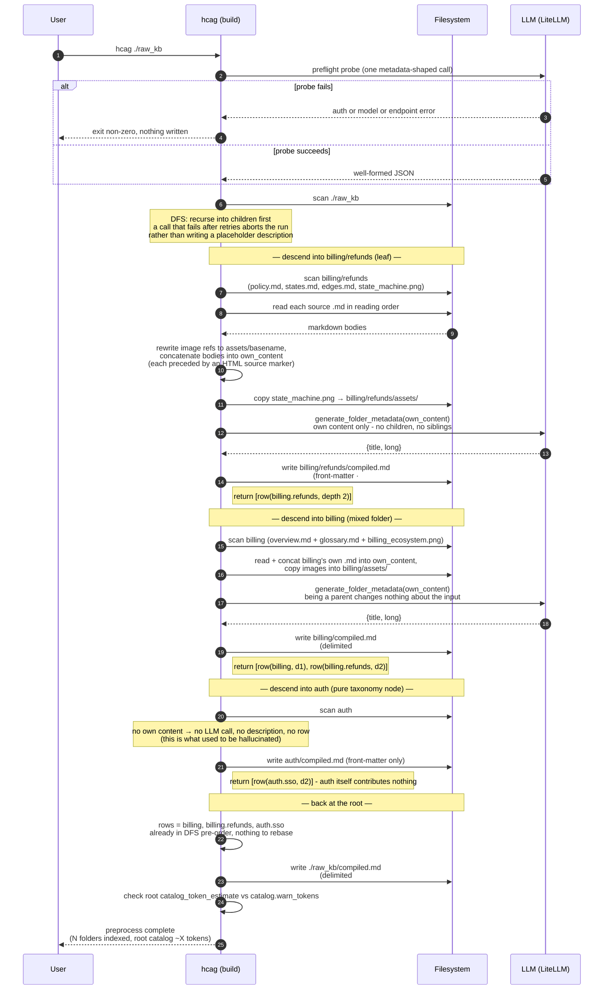
```mermaid
sequenceDiagram
    autonumber
    participant U as User
    participant CLI as hcag (build)
    participant FS as Filesystem
    participant LLM as LLM (LiteLLM)

    U->>CLI: hcag ./raw_kb
    CLI->>LLM: preflight probe (one metadata-shaped call)
    alt probe fails
        LLM-->>CLI: auth or model or endpoint error
        CLI-->>U: exit non-zero, nothing written
    else probe succeeds
        LLM-->>CLI: well-formed JSON
    end
    CLI->>FS: scan ./raw_kb
    Note over CLI: DFS: recurse into children first<br/>a call that fails after retries aborts the run<br/>rather than writing a placeholder description

    Note over CLI,FS: — descend into billing/refunds (leaf) —
    CLI->>FS: scan billing/refunds<br/>(policy.md, states.md, edges.md, state_machine.png)
    CLI->>FS: read each source .md in reading order
    FS-->>CLI: markdown bodies
    CLI->>CLI: rewrite image refs to assets/basename,<br/>concatenate bodies into own_content<br/>(each preceded by an HTML source marker)
    CLI->>FS: copy state_machine.png → billing/refunds/assets/
    CLI->>LLM: generate_folder_metadata(own_content)<br/>own content only - no children, no siblings
    LLM-->>CLI: {title, long}
    CLI->>FS: write billing/refunds/compiled.md<br/>(front-matter · # title · delimited ## Content)
    Note right of CLI: return [row(billing.refunds, depth 2)]

    Note over CLI,FS: — descend into billing (mixed folder) —
    CLI->>FS: scan billing (overview.md + glossary.md + billing_ecosystem.png)
    CLI->>FS: read + concat billing's own .md into own_content,<br/>copy images into billing/assets/
    CLI->>LLM: generate_folder_metadata(own_content)<br/>being a parent changes nothing about the input
    LLM-->>CLI: {title, long}
    CLI->>FS: write billing/compiled.md<br/>(delimited ## Content only - no index of its own)
    Note right of CLI: return [row(billing, d1), row(billing.refunds, d2)]

    Note over CLI,FS: — descend into auth (pure taxonomy node) —
    CLI->>FS: scan auth
    Note over CLI: no own content → no LLM call, no description, no row<br/>(this is what used to be hallucinated)
    CLI->>FS: write auth/compiled.md (front-matter only)
    Note right of CLI: return [row(auth.sso, d2)] - auth itself contributes nothing

    Note over CLI,FS: — back at the root —
    CLI->>CLI: rows = billing, billing.refunds, auth.sso<br/>already in DFS pre-order, nothing to rebase
    CLI->>FS: write ./raw_kb/compiled.md<br/>(delimited ## Catalog = one table, every content folder)
    CLI->>CLI: check root catalog_token_estimate vs catalog.warn_tokens
    CLI-->>U: preprocess complete<br/>(N folders indexed, root catalog ~X tokens)
```

---

# Part 4 — The `crawl` CLI Tool

## 4.1 Purpose

`crawl` takes a set of seed URLs and builds a local Markdown knowledge base from the pages they lead to. Each seed is fetched, reduced to its **main content**, converted to Markdown, and its outbound links are followed recursively — staying within the site regions defined by the seed URL prefixes. The output is a local `./kb/` tree whose directory shape mirrors the domains and URL paths of the crawled sites, ready to hand to `hcag` (Part 3) as raw KB input.

The page reduction is the load-bearing part. A fetched HTML document is mostly *not* the document: top navigation, mega-menus, breadcrumbs, sidebars, cookie banners, "related articles" rails, comment threads, and link-heavy footers routinely outweigh the prose an author actually wrote. `crawl` does not try to out-guess that template itself — it delegates the decision to a library purpose-built for it, **[trafilatura](https://trafilatura.readthedocs.io/)**, the same class of tool that powers browser reading modes (§4.4.1). What lands on disk is the article body with its structure intact — headings, **bold**/*italic*, lists, tables, code blocks, in-body links, and content images — and nothing of the chrome around it.

Extraction is the *only* content decision `crawl` makes. There is no second stripping pass, no cross-page analysis, and no corpus-level state: each page is decided by itself, from itself, and written as soon as it is fetched.

## 4.2 Invocation

```
$ crawl --depth <N> <seed_url> [<seed_url> ...]
```

- `<seed_url>` — one or more starting URLs. Each seed defines both a starting point and a prefix scope (§4.3.1). At least one seed is required.
- `--depth <N>` — maximum link-following depth from any seed. `N=0` fetches only the seed documents themselves; `N=1` also fetches documents reachable in one hop from a seed; and so on. Applies to *pages*; assets are terminal and exempt (§4.3.4).
- `--asset-hosts <host>[,<host>…]` — additional hosts from which PDFs and images may be fetched. By default an asset is fetched only from the same host as the page that cited it (§4.3.4); this widens that to a CDN or media subdomain.
- `--quiet` — suppress the per-URL progress lines on stderr (§4.7.1). The end-of-run report is still printed.
- `--report-limit <N>` — example URLs shown per skip group in the end-of-run report (default `20`). `0` prints counts only; a negative value prints every URL.
- `--extract-favor {balanced,precision,recall}` — bias of the main-content extractor (§4.4.1). `precision` drops anything the extractor is unsure about (cleanest output, occasionally loses a short real section); `recall` keeps borderline blocks (fuller output, occasionally keeps a sidebar). Default `balanced`.
- `--no-extract` — disable main-content extraction entirely. Every page is converted whole-DOM and written verbatim, chrome included. Use it to inspect raw output, or on sites the extractor mishandles.
- `--min-extract-chars <N>` — extraction results shorter than `N` characters are treated as a failed extraction and the page falls back (§4.4.1). Default `200`. Set to `0` to accept any non-empty extraction.
- `--min-image-bytes <N>` — skip images whose fetched byte size is below `N` (§4.4.3). Default `10240` (10 KB). Set to `0` to keep every image regardless of size.
- `--request-delay-ms <N>` — milliseconds to wait between requests to the same host (§4.3.5). Default `5000`. `0` disables the wait and is appropriate only for a host the operator runs.

Output is written under `./kb/` in the current working directory (§4.5).

## 4.3 Traversal Semantics

### 4.3.1 Seed prefix scope

Each seed URL doubles as a **prefix scope**. A discovered link is followed only if its URL begins with the same string as at least one of the seed URLs. This keeps the crawl inside the sites and subpaths the operator explicitly named, and prevents it from escaping to unrelated domains or wandering up to parent paths.

- A seed of `https://docs.example.com/api/v2/` allows following `https://docs.example.com/api/v2/auth.html` but **not** `https://docs.example.com/api/v1/anything` (different subpath) or `https://blog.example.com/…` (different subdomain).
- With multiple seeds, the allowed set is the union of their prefixes: a link is in scope if it matches **any** seed's prefix.

**Prefix scope governs traversal, not assets.** It answers "which *pages* is this crawl about", and it answers it with a path prefix because a site's page hierarchy is its information architecture. Assets — PDFs and images — are not pages and are not filed that way; they are content *of* a page, and §4.3.4 scopes them by that relationship instead.

Rationale: the seed set defines both *where to start* and *what belongs in the KB* with a single knob — the operator does not have to state the site boundary a second time.

Note that the candidate links come from the **full DOM**, not from the extracted main content (§4.4.1) — navigation is discarded from the *output* but is still the primary way a site exposes its own structure.

### 4.3.2 Visited-URL tracking

`crawl` maintains a set of every URL it has already fetched. If a link resolves to a URL already in that set, it is skipped — neither re-fetched nor recursed into. Every in-scope URL is therefore fetched and converted at most once per invocation, and cycles between pages cannot cause repeat work or infinite loops.

### 4.3.3 Depth

The seed URL sits at depth `0`. A document reached by following a link from a depth-`k` document is at depth `k+1`. Links discovered *inside* a document whose depth equals `--depth` are **not** followed; the document itself is still fetched, converted, and written, but no further descent occurs from it.

### 4.3.4 Asset scope

**A PDF or image referenced by an in-scope page is fetched, whatever its path.** Prefix scope does not apply to it, and neither does the depth limit.

**Why.** Sites store assets where the CMS puts them, not where the information architecture would suggest. On `mom.gov.sg` every linked PDF lives under `/-/media/mom/documents/…` — a Sitecore media root that has nothing to do with `/passes-and-permits/…`, the path the pages themselves live under. The numbers are not marginal: of the 17 PDFs cited by a 35-page crawl of that site, **17 are outside the seed prefix and zero are inside**. Scoping assets by prefix therefore does not filter the citations; it drops all of them, and with them the primary sources — salary benchmark tables, occupation lists, application forms — that the prose exists to point at.

The prefix is the right tool for the wrong question here. `/-/media/…` is a *storage* path; `/passes-and-permits/…` is an *editorial* one. Judging an asset by its own path asks where the CMS filed it. Judging it by the page that cites it asks what it is about, which is the question that matters.

**Why this is safe.** Assets are **terminal**: fetched, converted, written, and never queued for link extraction. Nothing is ever discovered *through* an asset, so exempting them cannot expand the frontier — the number fetched is bounded by (pages crawled × assets per page), never by the link graph. That is also why the depth limit does not apply: a PDF cited by a page at maximum depth is that page's content, not a level beyond it, and excluding it would silently truncate the deepest pages' evidence while keeping their prose.

**What still bounds it.** Unbounded off-site fetching is a different risk class from following a citation, so:

- An asset is fetched only if it is on the **same host as the page that referenced it**, or on a host named by `--asset-hosts` (§4.2). The default keeps a crawl to the site the operator named; the flag exists because a site's images frequently live on a CDN under a different hostname.
- The existing image size filter (§4.4.3) still applies unchanged: off-prefix does not mean unfiltered.
- Assets are deduplicated by the same visited-URL set as pages (§4.3.2), so a PDF cited by twenty pages is fetched once.

**Where they land.** An off-prefix asset is written into the folder of the page that cited it (§4.5), *not* mirrored at its own URL path. Mirroring `/-/media/mom/documents/compass/c1-salary-benchmarks.pdf` would create `kb/www.mom.gov.sg/-/media/mom/documents/compass/…` — a parallel tree, disconnected from the taxonomy, whose folders `hcag` would turn into packets about nothing. A CMS media root is not an information architecture and must not be allowed to manufacture one. The asset has no taxonomy of its own; it inherits the topic of the page that cites it, and belongs in that page's packet.

With deduplication, the **first citer wins**: the asset is written into the folder of the first page that referenced it, and later citers keep the link as a remote URL. This trades a little locality for not duplicating a 5 MB PDF into twenty packets; the alternative is defensible, and if whole-packet self-containment turns out to matter more than size, this is the knob to revisit.

### 4.3.5 Request pacing

`crawl` waits `--request-delay-ms` milliseconds between HTTP requests to the same host. The default is `5000` — at most one request every five seconds.

**A delay is not a nicety here.** A crawler is the only client that asks a site for every page it has, one after another, as fast as the link graph and the network allow, and the person running it is almost never the person operating the site. A depth-3 crawl of a public site is thousands of candidate URLs; issued back to back, that traffic is indistinguishable at the server from a denial-of-service attempt and is frequently treated as one. The good outcome is being rate-limited or blocked. The bad one is degrading a service other people are in the middle of using — and for the government and public-sector sites this tool is pointed at, those people are trying to apply for something. `crawl` has no way to measure how much headroom a site has, so it assumes none.

**The knob is a wait, not a rate.** The same policy could be written as 0.2 requests per second, and nobody chooses that number on purpose. An operator deciding whether they are being rude thinks in *how long to leave between hits*, so that is what the flag takes. Milliseconds, because that unit stays an integer across the whole useful range: `200` for a local fixture server, `5000` for someone else's production site.

**Measured per host, from the end of the previous request.** Two properties, each deliberate:

- **Per host.** Politeness is owed to a server, not to the run. Two seeds on two different sites do not queue behind each other, and an asset host named in `--asset-hosts` (§4.3.4) gets its own budget rather than spending the page host's.
- **From the end of the previous request, not its start.** A host taking six seconds to answer is a host under load, and that is the moment to give it more room rather than less. Anchoring the clock at the previous request's *start* would count the site's own slowness as part of the courtesy interval and fire the next request the instant the slow one returned — backing off least exactly when it should back off most. The consequence is that the rate to a host is *at most* one request per `--request-delay-ms`, and lower when the host is struggling. That asymmetry is the point.

**Every request waits, not just page fetches.** Asset fetches (§4.3.4), each hop of a redirect chain, and every retry after a failure take their turn in the same per-host queue. Retries matter most: a failing request is the least safe moment to hurry, and retrying on error without pacing is the standard way a crawler turns a struggling server into an unreachable one. A four-hop redirect is four requests and four waits.

**A `Retry-After` header wins when it asks for longer.** A `429` or `503` carrying `Retry-After` is the server stating its own limit, and a limiter that ignores an explicit request to slow down is not a limiter. The wait before the next request to that host becomes the larger of the header's value and `--request-delay-ms`, both forms the RFC allows are accepted, and a malformed value is ignored rather than treated as a reason to stall. It is `WARN`-logged with both numbers (§4.7), so a crawl that has been asked to back off says so rather than absorbing it silently.

A `429` or `503` is also the one status worth **retrying**, precisely because the wait between attempts is now enforced: dropping the URL on the first one loses a page from the KB for what is usually a moment's throttling, and the retry cannot pile on because the host's next slot has already been pushed out. The existing retry cap bounds it — a host that keeps refusing runs out of attempts and the URL is dropped like any other non-2xx.

**A long wait is announced.** An honoured `Retry-After` of several minutes is indistinguishable from a hang if nothing says so, so a wait more than twice the configured delay prints a line on the console naming the host and the wait. The ordinary per-request delay stays silent: a crawl that narrated every five-second pause would drown in its own politeness.

**`0` disables the wait, and says so.** Crawling a local fixture server, a staging mirror, or a site the operator runs themselves is a real case where politeness has no one to protect, so the escape hatch exists. It is logged once at `WARN` at startup rather than accepted silently, because this is the one setting whose misuse is paid for by somebody else. A negative value is a startup `ERROR`.

**What the default costs.** The 35-page `mom.gov.sg` crawl used throughout Part 4 fetches 35 pages, 17 PDFs and 3 images — 55 requests, so a little over four and a half minutes of it is waiting. That is the right trade. A KB is crawled once per revision and rebuilt rarely (§4.6), nothing downstream is waiting on it, and the cost of being too slow is a coffee while the cost of being too fast is borne by a third party who never agreed to it. Operators who own the site can lower it knowingly; everyone else should leave it alone or raise it. The end-of-run log summary reports how much of the wall-clock went to waiting (§4.7), so the trade is visible rather than assumed.

**If concurrency is ever added, the limiter stays here.** `crawl` fetches one URL at a time (§4.9), so the wait is a sleep before each request. Should parallel fetching arrive, the pacing must remain per host *and* shared across workers — a per-worker delay with four workers is four times the request rate, which is precisely the failure this section exists to prevent.

## 4.4 Document Types

### 4.4.1 HTML — main-content extraction

An HTML response goes through three stages: a DOM pre-pass that harvests links and rewrites image sources, reading-mode extraction that decides what the page's content actually is, and a fallback for the pages extraction cannot handle. The page is written at the end of the third stage and never revisited.

**Stage 1 — DOM pre-pass (BeautifulSoup).** Runs on the raw HTML, before any content decision:

- **Traversal links.** Every `<a href>` in the document is resolved against the fetched URL (after redirects) and handed to the traversal loop (§4.3.1), **in document order**. Anchors, `javascript:`, `mailto:`, and `tel:` targets are dropped. This deliberately reads the *whole* document — a docs site's left-hand nav is chrome in the output but is exactly how the crawler discovers the rest of the site. Discarding nav before link discovery would collapse coverage to whatever the body prose happens to cross-reference. Reading the whole document is also what preserves a hub page's link order for §4.5.3: the extracted body will not have it, because a link list is the first thing stage 2 drops.
- **Image source rewriting.** Every `` is given a local filename of the form `<doc-basename>-<remote-basename>` (with in-document collision disambiguation, §4.5) and its `src` attribute is rewritten **in place** to that local name. Lazy-loading attributes (`data-src`, `data-original`, and the first candidate of a `srcset`) are promoted into `src` first, so images that a plain parse would miss survive. Because the rewrite happens before extraction, whatever markup survives extraction already points at local files — no post-hoc Markdown surgery, and the extractor's own link/image handling never sees a relative URL.
- **Page-wrapping `<form>` unwrapping.** Any `<form>` holding at least half the body's visible text is unwrapped — the tag goes, every child stays exactly where it was. This is the one structural edit the pre-pass makes, and it exists because reading-mode extractors discard form subtrees as chrome (search boxes, newsletter signups, comment boxes) while **ASP.NET WebForms wraps the entire page body in a single `<form runat="server">`**. On such a site the "discard forms" heuristic discards the article. Observed on `mom.gov.sg`: trafilatura's balanced mode returned 10.5k characters of a 24k-character page, dropping the "Who is eligible" section and the EP qualifying-salary tables — the page's principal content — while still reporting a successful extraction. Unwrapping first restores the full 24k. This is not specific to trafilatura: an independent converter (`html-to-markdown`) reduced the same page to nothing but front-matter for the identical reason.

  Detection is by **text share, not by tag or attribute**, which is what keeps real forms working as chrome: a genuine search box holds a rounding error's worth of the body's text, while a framework wrapper holds nearly all of it. The count is reported as `forms_unwrapped` for the build log.
- Nothing else is removed at this stage. The pre-pass otherwise only annotates; the content decision belongs to stage 2.

**Stage 2 — reading-mode extraction (trafilatura).** The mutated DOM is serialized and passed to `trafilatura.extract()`, which returns Markdown for the main content only. Settings:

| Option | Value | Why |
|---|---|---|
| `output_format` | `"markdown"` | Markdown is the KB's on-disk format (§4.5); no second conversion pass, no markdownify round-trip. |
| `include_formatting` | `True` | Preserve headings, `**bold**`, `*italic*`, lists, and code blocks — structure `hcag` and downstream chunkers rely on. |
| `include_links` | `True` | In-body links are content: cross-references between KB pages and citations to sources. |
| `include_tables` | `True` | Tables carry a large share of the facts on reference and policy sites (eligibility criteria, salary benchmarks, fee schedules). Dropping them is the single most damaging default in naive extractors. |
| `include_images` | `True` | Emits `` for content images; the `src` is already the local filename from stage 1. Images outside the main content — logos, icon rails, social badges — are never emitted, and therefore never fetched (§4.4.3). |
| `include_comments` | `False` | User comments and discussion threads are not authored knowledge. This is the explicit exclusion the KB needs most: comment threads are long, repetitive, and confidently wrong. |
| `favor_precision` / `favor_recall` | from `--extract-favor` | `balanced` sets neither. |
| `url` | **not passed** | Given a URL, trafilatura resolves relative image sources against it — which would undo stage 1's local-filename rewriting. Links are already absolute by then, so nothing is lost by omitting it. |
| `deduplicate` | `False` | trafilatura's near-duplicate suppression is an LRU cache that **spans calls**, so a paragraph legitimately repeated on two pages of a corpus would silently vanish from the second. Cross-page decisions belong to §4.4.4, where they are logged. |

What extraction removes, by construction: site header and top navigation, mega-menus and breadcrumbs, sidebars and "in this section" rails, cookie/consent banners, newsletter and share widgets, related-content teasers, comment threads, and footers. What it keeps: the article body with its heading hierarchy and inline formatting.

**Table repair.** One formatting fix is applied to the extracted Markdown: when a table run has no GFM delimiter row (`|---|---|`) under its first row — which happens whenever a site marks header cells up as `<td>` rather than `<th>` — one is inserted. Without it the rows are just pipe-separated text to every Markdown renderer and every Markdown-aware chunker, and the table's structure is lost exactly where it matters most. No cell content is touched.

**Title.** The `<h1>` of a page frequently lives in the template header, outside the extracted body. If the extracted Markdown does not already begin with an H1, the page title from trafilatura's metadata is prepended as one. A KB packet whose first line names the topic is worth the special case — `hcag` (§3.4.3) and every downstream chunker key off it.

**Stage 3 — fallback.** Extraction is a heuristic and it does fail: JS-rendered shells, index pages that are genuinely nothing but links, and unusual templates. Each fetched HTML page is therefore classified:

| Condition | Classification | Handling |
|---|---|---|
| Extraction returns Markdown ≥ `--min-extract-chars` | `extracted` | Written to `./kb/…` (§4.5) as-is. |
| Extraction returns nothing, or shorter than `--min-extract-chars` | `fallback` | Whole-DOM markdownify conversion, written verbatim with the chrome still attached. `WARN crawl.extract.fallback` with `reason ∈ {no_output, too_short}`. |
| `--no-extract` given | `fallback` | Every HTML page takes the whole-DOM path. |

A fallback page is a **loud** failure, not a silent one: it keeps whatever the page contained — a dirty page is more useful to a downstream index than a missing one — and it says so in the log, so a run with many fallbacks is visible and actionable (`--extract-favor recall`, or accept that the site is JS-rendered). What `crawl` does not do is try to clean it up with a second heuristic; one page, one decision, one write.

**Why a library, and why this one.** Main-content extraction is a well-studied problem with a decade of published benchmarks and a long tail of per-site quirks — the wrong thing to reimplement from `<header>`/`<footer>`/`<nav>` guesses. trafilatura combines DOM-structure rules with text-density and link-density statistics, scores consistently at or near the top of independent extraction benchmarks, is pure-Python with `lxml`, is deterministic, needs no network and no model, and emits Markdown natively with per-feature switches for exactly the axes this design cares about (links, formatting, tables, images, comments). It also degrades honestly: when it cannot find a main body it returns nothing rather than guessing, which is precisely the signal stage 3 needs.

### 4.4.2 PDF

Linked `.pdf` documents are treated as first-class pages: fetched, converted to Markdown, and written to the same layout as HTML output. PDFs do not contribute outbound links for further traversal. Main-content extraction (§4.4.1) does not apply to them — a PDF has no site template around it.

Each page is converted independently and grouped under a `## Page N` heading, so the coarse structure of the source survives and any extract stays traceable to a page. Embedded raster images are pulled out and written beside the Markdown (§4.4.3), referenced from the page they appear on.

#### Tech-stack decision: PyMuPDF4LLM

**Chosen library: `pymupdf4llm`.** The decisive property is **table reconstruction**: it emits GFM tables, and PDF tables are where the KB's most load-bearing content lives — salary bands by age, qualification lists, points matrices.

This replaced `pypdf`'s `page.extract_text()`, and the reason is worth recording, because the failure it fixes is a correctness failure rather than a cosmetic one. `extract_text()` returns a flat glyph stream in reading order with no table model at all. On a two-column list that merely erases the column boundary:

| | |
|---|---|
| `pypdf` | `Boston University United States of America` |
| `pymupdf4llm` | `\|Boston University\|United States of America\|` |

On a table with **vertically merged cells** it is worse than ugly. In MOM's COMPASS Criterion 2 list, eight business schools share one merged "Business Administration (MBAs only)" faculty cell and one "EDB" agency cell. Flattened, those rows arrive as bare institution + country — so an agent asked whether an ESSEC degree qualifies reads *no faculty restriction* and answers the opposite of the truth, with every appearance of being grounded. Losing a table's structure does not degrade an answer gracefully; it inverts it.

Measured on that document: 32 GFM tables recovered where the previous path produced none, at comparable text volume (16.1k vs 16.5k characters). 24 documents in a single `mom.gov.sg` crawl are PDF-derived, so this is a property of the corpus, not one awkward file.

**Known limitation, stated because it is not fully solved.** A vertically merged cell's text is distributed line-by-line down the rows it spans rather than repeated into each. The ESSEC row shows `master's` where the full qualifier is `Business Administration (for MBAs – master's degrees)`. The columns are now visible and the fragments are recognisably continuations, which is a large improvement on their being invisible — but a consumer must not assume each row's cells are independently complete.

**Licence — read before shipping.** PyMuPDF (and therefore `pymupdf4llm`) is **AGPL-3.0 or an Artifex commercial licence**. Every other dependency in this project is permissive (§2.13.6), so this is the one that constrains distribution: AGPL's network clause reaches software offered as a service, not only software distributed as binaries. An operator running HCAG as a hosted product needs either the commercial licence or a different converter. The alternative evaluated was `pdfplumber` (MIT, `pdfminer.six`-based), which also recovers the table cells from the same document but returns raw cell grids rather than Markdown, so it would need its own GFM rendering and delimiter normalisation. It is the fallback if the licence is a blocker — the seam is one function, `convert_pdf`.

### 4.4.3 Images

Images referenced by the **main content** of HTML pages and images embedded inside PDF documents are extracted and saved as separate files alongside the Markdown output (§4.5). Every image reference in the generated Markdown points at the local saved file rather than the original remote URL, so the Markdown renders correctly offline.

Images are content of their containing document, not link targets: they are neither depth-counted nor prefix-checked.

**A PDF's images are deduplicated by content.** A letterhead, seal, or footer rule placed on every page of a PDF is *one* image referenced many times, not many images. Extraction sees it once per page, so the naive rule — dedupe by the name the PDF gives each placement — writes N byte-identical copies. Measured on `mom.gov.sg`: one 18 KB graphic written 10 times from a single document, and **46 duplicate copies across 94 images** corpus-wide, one of them repeated 25 times.

The cost is not only disk. Each copy becomes its own multimodal content block when the packet is loaded (§2.6), so a ten-page PDF spends ten images' worth of the token budget showing the model the same logo ten times; and `evalgen`'s multimodal question kind (§6.4.5) samples an image per packet, so roughly half its samples would land on a decorative graphic that cannot ground a question about anything.

So images are hashed as they are extracted and each distinct image is **written once**, with every page that carries it referencing the same file. Deduplication is per document rather than corpus-wide: two PDFs that happen to share a logo still get a copy each, because a packet must be self-contained (D2) and cross-document sharing would make one packet's assets depend on another's presence.

**Only what survives extraction is fetched.** Stage 1 (§4.4.1) assigns a local name to every `` in the DOM, but the fetch happens only for the names that still appear in the extracted Markdown. Header logos, nav icons, social badges, and footer seals are dropped by extraction and therefore cost zero HTTP requests — a large bandwidth saving on top of the correctness one. On a fallback page (§4.4.1 stage 3) and under `--no-extract`, the whole-DOM Markdown references every ``, so every image is fetched.

**Size filter.** After the bytes are in hand (fetched over HTTP for HTML `` targets, or extracted from the PDF stream for embedded images), images below `--min-image-bytes` (default `10240` = 10 KB) are dropped. Two things happen for a dropped image:

- The image bytes are **not written** to `./kb/`.
- The Markdown reference `` is **removed** from the page's body **before** it lands on disk — no dangling links.

Rationale: extraction removes chrome images by *position*; the size filter removes decorative images by *weight* — inline glyphs, spacer rules, and rating stars that sit inside the article body and survive extraction legitimately. 10 KB is a conservative default: it lets through typical diagrams, charts, screenshots, and photographs while catching most decorative icons. Set `--min-image-bytes 0` to disable the filter for corpora where every image matters (e.g., an icon-set reference).

The filter is applied uniformly to HTML-embedded images and PDF-embedded images; nothing about the source medium is a special case. Reference removal happens in memory before the page is written, so the on-disk `.md` is always internally consistent.

## 4.5 Output Layout

Output is rooted at `./kb/`, with the domain as the first path segment and the URL path preserved below it.

**A page's Markdown belongs at the deepest level of its own URL path, not at its parent's.** A page at `…/topic/subtopic` that has crawled descendants is written as `…/topic/subtopic/index.md` — *inside* the `subtopic/` directory, alongside its children — not as `…/topic/subtopic.md` sitting next to it. This is the rule the rest of this section elaborates, and §4.5.1 explains why it matters more than a filing preference.

**Stated as a checkable invariant:**

> No directory may contain both a subdirectory `X/` and a file `X.md`.

If both would exist, `X.md` belongs *inside* `X/` as `index.md`. The pair is the signature of the bug: two artifacts describing the same URL, filed at two different levels, with the folder that owns the topic missing the page that introduces it. It is worth checking directly on any crawl output, because it is a one-line test that catches the whole class:

```bash
find kb -type d | while read -r d; do [ -f "$d.md" ] && echo "collision: $d.md + $d/"; done
```

A conforming crawl prints nothing. Before this rule, a 35-page `mom.gov.sg` crawl printed six, `…/employment-pass/eligibility.md` beside `…/employment-pass/eligibility/` among them.

For a page at `https://webdomain/topic-domain/topic/subtopic/something.html` with no crawled descendants:

- Markdown goes to `./kb/webdomain/topic-domain/topic/subtopic/something.md`.
- An embedded image named `apple.jpg` goes to `./kb/webdomain/topic-domain/topic/subtopic/something-apple.jpg`.

And for `https://webdomain/topic-domain/topic/subtopic`, which *does* have descendants (`/subtopic/a`, `/subtopic/b`, `/subtopic/c`):

```
kb/webdomain/topic-domain/topic/
└── subtopic/
    ├── index.md          ← the /topic/subtopic page itself
    ├── index-apple.jpg   ← its images, beside it
    ├── a.md
    ├── b.md
    └── c.md
```

Rules:

- **Domain first.** Content from different sites lands in distinct top-level folders under `./kb/`, so multiple seed domains stay cleanly separated.
- **Path preservation.** Below the domain, the directory structure mirrors the URL path, so the shape of the source site is legible in the output tree.
- **Own-page placement.** A page whose URL path has crawled descendants is written as `index.md` inside its own directory. `index.md` rather than `<segment>.md` both avoids the `subtopic/subtopic.md` stutter and marks unambiguously which file is the folder's *own* page versus a child page.
- **Leaves stay flat.** A page with no crawled descendants gets no directory of its own; it is written as `<segment>.md` in its parent's directory. This is what keeps a crawl from producing one directory per document, and it is why **a depth limit of 4 puts every level-4 page at level 3 of the tree**: nothing below them is fetched, so nothing below them exists to be the deeper level. Depth truncation and a natural leaf are indistinguishable in the output, by design — the tree describes what was crawled, not what the site contains.
- **Extension.** Output Markdown always uses the `.md` extension, regardless of the source (`.html`, `.htm`, `.pdf`, or a directory-index URL that ends with `/`).
- **Assets follow their citer, not their own path.** A PDF or image fetched from outside the seed prefix (§4.3.4) is written into the folder of the page that referenced it — a converted PDF as `<pdf-stem>.md`, an image under the naming rule below — never mirrored at its own URL path. Its own path is where a CMS filed it, not what it is about; mirroring it would grow a parallel tree of packets about nothing. Name collisions with an existing sibling are disambiguated the same way as images.
- **Image naming.** Each extracted image is written with a filename of the form `<document-basename>-<image-name>`, in the same directory as the Markdown that references it. Prefixing with the source document's basename guarantees that identically-named images extracted from different pages do not collide when they land in the same directory. For an own-page the basename is `index`, so its images are `index-<image-name>` inside its own directory.

### 4.5.1 Why placement is not just filing

The old layout put `subtopic.md` in `topic/` and the subtopic's children in `topic/subtopic/`. That splits one topic across two levels, and it is not a cosmetic problem: `hcag` treats **a folder as the unit of knowledge** (D2). Under the old layout the subtopic's own overview is concatenated into the *parent's* packet, where it describes a sibling rather than the folder it is in, while `subtopic/` — the folder the agent actually loads when it wants that topic — has no overview at all. Placing the page inside its own directory puts a topic's overview and its detail pages in the same packet, which is what a reader, and the agent, expect.

It also makes the folder classification in §3.4.2 mean what it says. A URL that has both its own content and sub-pages should produce a **mixed** folder (own content + children); under the old layout it produced a pure taxonomy node with the content misfiled one level up.

### 4.5.2 Resolving placement at the end of the crawl

Whether a page has descendants is not known when the page is written. The crawl is breadth-first (§4.3), so a page at depth *d* is fetched and written before anything at *d+1* is discovered — the crawler cannot know, at write time, whether the page it is writing will turn out to be a branch or a leaf.

The layout is therefore resolved in two steps:

1. **During the crawl, every page is written at the deepest level of its own path** — `…/topic/subtopic/index.md`, with its images beside it. This is the uniform case, needs no lookahead, and matches the invariant stated above.
2. **After the crawl completes, leaf directories collapse.** Once the full set of fetched URLs is known, any directory containing nothing but its own `index.md` and that page's images — no child pages, no subdirectories — is collapsed into its parent: `…/topic/subtopic/index.md` becomes `…/topic/subtopic.md`, and `index-apple.jpg` becomes `subtopic-apple.jpg`, preserving the `<document-basename>-<image-name>` rule. The now-empty directory is removed.

Collapsing only ever removes a directory that has just been emptied, so it cannot produce the `X/` + `X.md` pair the invariant forbids: the file is created at `X.md` in the same operation that removes `X/`. The invariant is the finalize pass's postcondition, and worth asserting as one — it is cheap to check and it is the single condition that distinguishes this layout from the one it replaces.

Collapsing runs on the filesystem rather than on the URL set, so it stays correct when a page was skipped mid-crawl (fetch error, out-of-scope redirect, unsupported content type): a directory is a branch because it *has* files in it, not because a URL suggested it might.

**Links need no rewriting; image references do.** In-body links were absolutized to remote URLs in §4.4.1 stage 1, so no link in any document points at a local path that moving a file could break. Images are the exception: stage 1 rewrites every `` to a *bare local filename*, so renaming `index-apple.jpg` to `subtopic-apple.jpg` without also rewriting the reference inside the Markdown leaves a broken image. The collapse rewrites each renamed filename in the page it belongs to, in the same step.

A directory is also left alone if collapsing it would overwrite an existing `<name>.md` beside it — two URLs can sanitize to the same name, and losing a page is worse than leaving one branch un-flattened.

The collapse count is reported in the end-of-crawl summary (§4.7) so the tree's final shape is auditable from the log alone.

### 4.5.3 Link-order sidecar

`preprocess` orders a packet's sources by the order its index page mentions them (§3.4.3), which needs one thing `preprocess` cannot recover on its own: **the order the index page linked its children in.**

It cannot recover it because extraction destroys it. A hub page's content *is* its link list, and reading-mode extraction treats a link list as navigation and drops it (§4.4.1 stage 2) — so the `index.md` on disk for a 16-child hub often contains no links at all. Measured on `mom.gov.sg`, only 2 of 6 branch folders had a usable order left in their Markdown. The ordering signal exists at crawl time and is thrown away.

**`crawl` already has it.** Stage 1 parses every `<a href>` in the *full DOM*, in document order, because that is how traversal discovers the site (§4.4.1) — and reading the whole document rather than the extracted body is exactly what makes it survive. Today that order is consumed by the traversal queue and discarded. Recording it costs nothing new.

**The artifact.** Any folder that keeps its own `index.md` after the collapse (§4.5.2) — i.e. any branch folder — gets a sibling sidecar:

```json
// kb/www.mom.gov.sg/passes-and-permits/employment-pass/.hcag-crawl.json
{
  "source_url": "https://www.mom.gov.sg/passes-and-permits/employment-pass",
  "link_order": ["key-facts", "eligibility", "apply-for-a-pass", "documents-required", "…"],
  "documents": {
    "index.md":     "https://www.mom.gov.sg/passes-and-permits/employment-pass",
    "key-facts.md": "https://www.mom.gov.sg/passes-and-permits/employment-pass/key-facts",
    "compass-booklet.md": "https://www.mom.gov.sg/-/media/mom/documents/…/compass-booklet.pdf"
  },
  "images": {
    "index-compass.png": "https://www.mom.gov.sg/-/media/mom/documents/…/compass.png"
  }
}
```

- `link_order` holds the **child slugs** the index page linked, in first-mention document order, deduplicated. Only entries that correspond to something actually written in that folder are recorded — a link to a page that was never fetched (out of scope, over the depth limit, failed) is dropped, so the sidecar never names a file that does not exist.
- `source_url` records which page the order came from, making the mapping auditable without re-fetching.
- `documents` and `images` map **every file the crawl wrote into this folder** to the URL it came from — including PDFs pulled in from outside the prefix (§4.3.4), whose origin is otherwise unguessable from a filename like `compass-booklet.md`.
- It is written in the finalize pass, after the collapse, so it describes the tree as it finally stands.

**A sidecar is written for every folder holding documents, not only branch folders.** The link order needs one only where an `index.md` survives, but provenance is needed everywhere: a folder of collapsed leaves has no index page and still holds documents whose origin someone will want. `link_order` is simply absent from a sidecar that has no index page to derive it from.

**Provenance is the reason this file exists as much as ordering is.** A mirrored tree loses the one fact that makes it checkable — where each document came from. Without it a KB is a snapshot with no way back to the source: a reviewer cannot verify a generated eval question (§6.7.1), an operator cannot tell whether a page has changed since the crawl, and a citation in an answer cannot be resolved to anything a user can open. The filename is a sanitized, collapsed, extension-stripped derivative of the URL and cannot be inverted.

**Why a sidecar rather than front-matter in `index.md`.** Crawled Markdown is content — `preprocess` concatenates it verbatim into `## Content` (§3.4.3). Metadata written into that file would either surface as literal text in the packet or require every consumer to learn to strip it. A separate file keeps provenance out of content, which is the same reason `compiled.md` carries its metadata in front-matter that the packet loader strips (§2.6) rather than inline.

**This does not breach the §4.6 boundary.** `crawl` is recording *what the source document did* — a fact about the fetched page, like the links and images it already records. It is not deciding what the order means, which folders are topics, or how packets are assembled; `preprocess` remains free to use the order, ignore it, or fall back (§3.4.3). Provenance is not a taxonomy decision.

## 4.6 Relationship to `hcag`

`crawl` produces the raw markdown-and-image tree that `hcag` (§3.4) consumes. The two tools compose end-to-end:

```
$ crawl --depth 3 https://docs.example.com/api/
$ hcag kb/
```

`crawl` is responsible only for turning a set of remote sites into a mirrored local Markdown tree. It does not classify folders, produce `compiled.md`, call an LLM, or make any decisions about the KB's taxonomy — those remain `hcag`'s job.

**The one place the two designs have to agree is folder shape.** `preprocess` treats a folder as the unit of knowledge (D2) and classifies it by what is in it (§3.4.2), so where `crawl` puts a page decides which packet that page ends up in. §4.5's placement rule exists to make that mapping right: a URL with its own content *and* sub-pages becomes a **mixed** folder, and a URL that is only a hub becomes a **node**.

The layout also hands `preprocess` an ordering signal it did not previously have. `index.md` does not sort first among arbitrary slugs, so lexicographic concatenation would drop a topic's overview somewhere between two of its children; and the index page's *links* record the order the site itself presents those children in. §3.4.3 specifies both: `index.md` leads the packet, and the remaining sources follow the order the index page mentions them. That ordering exists only because §4.5 puts the index page in the same folder as the pages it links to.

That order is carried across the boundary as data, not as a decision: `crawl` writes a `.hcag-crawl.json` sidecar recording what the source page linked and in what order (§4.5.3), and `preprocess` is free to use it, ignore it, or fall back. `crawl` still classifies nothing.

## 4.7 Observability (CLI)

`crawl` emits a log line for every meaningful event during a crawl — each URL fetched, each content-extraction decision, each Markdown document written, each image extracted, and each candidate link that was skipped — using the same JSON-lines format as the rest of the toolchain (§2.11.3, §3.9). This makes a completed crawl auditable after the fact: given the log, an operator can reconstruct exactly which URLs were visited, which were skipped and why, how much of each page survived extraction, and which files ended up in `./kb/`.

That is the machine-readable record. The human-readable one — live progress while the crawl runs, and a report of what it collected and skipped when it finishes — is §4.7.1. The two are generated from the same counters and cannot disagree.

**Configuration.** The log path defaults to `./crawl.log` and can be overridden with `--log-file <path>`. Level is controlled with `--log-level {debug,info,warn,error}` (default `info`). If `OTEL_EXPORTER_OTLP_ENDPOINT` is set, spans (`crawl.fetch`, `crawl.extract`, `crawl.convert`, `crawl.image.extract`) are also exported, matching the observability model used by the runtime (§2.11) and by `hcag` (§3.9).

**Levels.**

- `INFO`:
  - Crawl start line with the resolved seed list, `--depth`, the output root, the extraction settings (`extract_favor`, `min_extract_chars`, `no_extract`), and `request_delay_ms` (§4.3.5) — how hard a run leaned on a site is not something to reconstruct from timestamps afterwards.
  - One line per fetched document: URL, depth, content type, byte size, elapsed fetch time, and the output Markdown path.
  - `crawl.extract.ok` per successfully extracted HTML page: `url`, `html_bytes`, `markdown_chars`, `retained_pct` (extracted Markdown chars ÷ the DOM's total visible-text chars — cheap to compute, no second conversion), `links`, `images`, `tables`, `elapsed_ms`. `retained_pct` is the field to scan when judging whether an extractor setting is too aggressive for a site — and `crawl.extract.low_retention` below scans it for you.
  - One line per extracted image: source document URL, remote image URL, and the local file path written under `./kb/`.
  - `crawl.image.skipped_small` per dropped image (§4.4.3): source document URL, remote image URL (or embedded index for PDFs), fetched byte size, threshold.
  - `crawl.asset.offsite_fetched` per asset fetched from outside the seed prefix (§4.3.4): the citing page, the asset URL, its kind (`pdf` / `image`), and the folder it was written into. These are the fetches prefix scope would have dropped, so they are worth being able to count — on `mom.gov.sg` they are 100% of the cited PDFs.
  - `crawl.asset.skipped_host` at `WARN` per asset skipped because its host is neither the citing page's nor in `--asset-hosts`: the citing page, the asset URL, and its host. A recurring host here is the signal to add it to the flag.
  - `crawl.extract.fallback` with `reason = disabled` under `--no-extract` — the whole-DOM path was the operator's choice, not a failure, so it is INFO rather than the `WARN` below.
  - `crawl.extract.detail` at `DEBUG` adds `favor`, `title_synthesized`, `forms_unwrapped` (§4.4.1 stage 1), and the full feature counts.
  - `crawl.layout.collapsed` per leaf directory collapsed in the finalize pass (§4.5.2): the directory removed, the resulting Markdown path, and the number of images renamed with it.
  - `crawl.layout.link_order` per sidecar written (§4.5.3): the folder, its `source_url`, how many child slugs were recorded, and how many linked slugs were dropped because nothing was written for them. A branch folder whose recorded order is empty is the signal that extraction ate the hub's link list *and* the full-DOM order found no in-folder children — worth a look before trusting the resulting packet order.
  - `crawl.layout.invariant_violated` at `ERROR` if the finalize pass leaves any `X/` + `X.md` pair (§4.5). It is the postcondition of the pass and cannot legitimately fail; if it does, the tree is mis-shaped in exactly the way this layout exists to prevent, and the operator needs to know before `hcag` builds packets on top of it.
  - Crawl end summary: totals for pages fetched, pages extracted vs. pages fallen back, pages written, `dirs_collapsed`, images extracted, images skipped for size, links skipped (out-of-scope / already-visited), wall-clock elapsed, `throttle_wait_ms` (total time spent waiting between requests, §4.3.5), and log-level counts. Wall-clock next to throttle wait is what separates "the site is slow" from "we are being polite" without any arithmetic.
- `DEBUG`:
  - HTTP request/response headers, redirect chains, and retry attempts.
  - `crawl.fetch.throttled` per paced request: `host`, `waited_ms`, and the configured `delay_ms`. At `DEBUG` because on a default run it fires for every request but the first to each host and says nothing surprising; it earns its place when a crawl is slower than the delay alone explains, which the two numbers side by side answer immediately.
  - Extraction internals per page: the resolved trafilatura option set, whether a title was synthesized, and the per-feature counts (headings, tables, code blocks, in-body links, images) in the extracted Markdown.
  - PDF-extraction internals (page count, image count).
  - For each page, the full list of `<a href>` values discovered, each tagged with its disposition: `queued`, `skipped:out-of-scope`, `skipped:visited`, or `skipped:depth-cap`.
- `WARN`:

  - `crawl.extract.low_retention` when extraction *succeeded* but kept less than 25% of the page's visible text: `url`, `retained_pct`, `threshold_pct`, `markdown_chars`, `text_chars`. This catches the failure mode that `min_extract_chars` structurally cannot. That floor only rejects a near-empty result; a **partial** extraction clears it easily and is then indistinguishable from a good one — the `mom.gov.sg` case in §4.4.1 passed at 10.5k characters while missing the page's principal tables. Retention is the only cheap signal that separates "this page really is mostly chrome" from "the extractor ate the article", so a low ratio is surfaced rather than left as a number in the INFO line. It is advisory — a genuinely nav-heavy page can sit low legitimately — which is why it is a `WARN` and not a fallback trigger.

    **The threshold is calibrated, not chosen.** `retained_pct`'s denominator is the whole DOM's text, chrome included, so on a nav-heavy site a *perfect* extraction still scores 40-50% and an intuitive threshold is useless: on a 35-page `mom.gov.sg` crawl, 55% flagged 15 pages of which 11 had lost nothing. Checking each flagged page against its real main-content container gives 3 caught / 0 false alarms at 25%, against 4 / 11 at 55%. 25% is the knee, and precision is the property that matters for a warning meant to be acted on rather than filtered out. Re-calibrate against a hand-checked sample before trusting the default on a very differently-shaped corpus.
  - `crawl.pacing.disabled` once at startup when `--request-delay-ms 0` was passed (§4.3.5): the run will fetch as fast as the network allows. Not an error — it is legitimate against a host the operator runs — but not something to accept in silence either, since the cost of a mistake here is paid by the site.
  - `crawl.fetch.retry_after` when a `429` or `503` asked for a longer wait than the configured delay (§4.3.5): `host`, `url`, `status`, `retry_after_ms`, `applied_ms`. The server has explicitly said the crawl is too fast for it, which is worth surfacing even though it is handled.
  - Fetch returned a non-2xx status for an in-scope URL (URL is dropped, siblings continue).
  - Fetched content type is neither HTML nor PDF (URL is dropped).
  - `crawl.extract.fallback` — extraction produced no usable main content for a page: `url`, `reason ∈ {no_output, too_short}`, `chars`, `min_extract_chars`. The page still lands on disk via the whole-DOM path, chrome included (§4.4.1 stage 3). A run with many of these is the signal to re-run with `--extract-favor recall`, or to accept that the site is JS-rendered (§4.8).
  - Image extraction failed for a specific asset — the containing page is still written; the image reference is left pointing at the original remote URL and flagged in the log.
  - `href` value could not be parsed or resolved against the base URL.
  - Redirect chain exceeded the safety cap and was terminated.
  - Output path collision detected and resolved by disambiguation (e.g., two URLs mapping to the same local filename).
- `ERROR`:
  - Crawl cannot start: no valid seeds, seed URL malformed, or `./kb/` not writable.
  - Fetch aborted after retries due to network failure or timeout.
  - Extraction raised (malformed markup that defeats the parser) — distinct from the `WARN` fallback case, which is an orderly "no main content found".
  - Fatal I/O error while writing Markdown or an image file.

If any `ERROR`-level event is logged during a run, `crawl` exits with a non-zero status; `WARN`-level events do not affect exit status but are reflected in the end-of-run summary.

### 4.7.1 Console output

The log answers "what happened, exactly" after the fact. The console answers a different question — "what is it doing *now*, and what did I end up with" — for a human watching a crawl run. They are separate surfaces and neither replaces the other: the console output described here changes nothing about the JSON-lines log above, and `--verbose` continues to mirror that log to stderr for anyone who wants the raw events instead.

**Live progress.** Each URL is printed as it is fetched, one line per document:

```
[  1] d0  html   https://www.mom.gov.sg/passes-and-permits/employment-pass
[  2] d1  html   https://www.mom.gov.sg/passes-and-permits/employment-pass/eligibility
[  3] d1  pdf    https://www.mom.gov.sg/-/media/mom/documents/…/c1-salary-benchmarks.pdf
[  4] d1  img    https://www.mom.gov.sg/-/media/mom/documents/…/compass.png
[  5] d1  html   https://www.mom.gov.sg/passes-and-permits/employment-pass/apply-for-a-pass
      !  404     https://www.mom.gov.sg/passes-and-permits/employment-pass/old-page
```

Three details are deliberate:

- **The line prints when the fetch *starts*, not when it finishes.** A crawl that hangs then leaves the responsible URL as the last thing on screen, which is the entire reason to watch a crawl live. Printing on completion would show everything except the one that matters.
- **Failures print immediately** on their own line, rather than waiting for the final report — a run that is failing every fetch should be obvious in the first seconds, not after it finishes.
- **No cursor control, no in-place rewriting.** Plain lines that scroll, so the output stays readable when piped to a file or captured by CI. A progress display that only works on a TTY is one that breaks exactly where the record is most needed. The counter has no total because breadth-first traversal does not know one until it is done.

Progress goes to **stderr**, so redirecting stdout captures the report below without the running commentary. `--quiet` suppresses progress entirely and keeps the report.

**End-of-run report.** Printed to **stdout** — it is the result of the run, and belongs in whatever the operator redirects to a file:

```
Included (35 html, 17 pdf, 3 img)

  html  /passes-and-permits/employment-pass
  html  /passes-and-permits/employment-pass/eligibility
  …
  pdf   /-/media/mom/documents/work-passes-and-permits/compass/c1-salary-benchmarks.pdf
  …
  img   /-/media/mom/documents/work-passes-and-permits/compass/compass.png

Skipped (2,404)

  out-of-scope          1,463   (showing 20)
      https://www.mom.gov.sg/eservices/…
      …and 1,443 more — see crawl.log
  depth-limit             498   (showing 20)
      …
  already-visited         441   (count only — every one of these was crawled via another link)
  image-too-small          21   (showing 20)
  non-2xx                   1
      https://www.mom.gov.sg/passes-and-permits/employment-pass/old-page  → 404
  asset-host-not-allowed    0
```

- **Included is listed in full**, grouped by kind. It is the KB's contents — bounded, and the thing worth diffing between runs. Paths are shown relative to the host, with the host stated once per group, because the full URLs are mostly a repeated prefix.
- **Skipped is grouped by reason, with a count always and examples by default.** The full lists live in the log at `DEBUG`; reprinting 1,463 out-of-scope URLs to a terminal buries the four numbers that actually inform a decision. `--report-limit <N>` (default 20) sets the examples per group; `--report-limit 0` prints counts only, and a negative value prints everything.
- **`already-visited` is a count only, whatever the limit.** Every URL in it was crawled — it is a dedup tally, not a list of things that were missed, and listing it invites exactly the wrong conclusion.
- Groups are printed in descending count order, and URLs within a group are sorted, so two runs of the same crawl produce a diffable report.
- Every skip reason is a group, **including empty ones**. A reason showing `0` is information: `asset-host-not-allowed: 0` says the `--asset-hosts` default cost this crawl nothing (§4.3.4), which is not something the absence of a line could tell you.

The report is derived from the same counters as the `crawl.done` log record, so the two can never disagree.

## 4.8 Non-Goals

- **Content editing.** `crawl` selects the main content of a page (§4.4.1); it does not rewrite prose, summarize, translate, or reorder it. Within the selected region the HTML/PDF → Markdown conversion is mechanical.
- **JavaScript execution.** Only the initial fetched HTML is parsed. Pages whose content is constructed client-side are captured only to the extent that content is present in the server-rendered response — and typically surface as `crawl.extract.fallback` warnings rather than silent empties.
- **LLM-based content classification.** Extraction is a deterministic, offline library decision — no per-page latency, no per-page cost, no model dependency. An LLM would likely beat it on ambiguous pages and is still not worth its price in a tool whose job is to mirror, not to interpret.
- **Corpus-level content analysis.** No cross-page comparison of any kind: no repeated-block voting, no shingling, no near-duplicate suppression. Every page is decided from its own markup, which is what keeps the tool single-pass, order-independent, resumable in principle, and correct on a one-page crawl.
- **Local link rewriting.** In-body links are preserved as absolute source URLs. Rewriting cross-page links to relative `./kb/…/*.md` paths is not attempted — the mapping is only valid for the subset of the web that this crawl happened to capture. This applies to PDFs pulled in under §4.3.4 as well: the citing page keeps the remote URL in its prose, and the converted PDF lands beside it as a separate source file in the same packet.
- **Auth-gated content.** Login flows, cookies, and custom headers beyond a plain fetch are out of scope.
- **`robots.txt` and crawl permission.** `--request-delay-ms` (§4.3.5) bounds how *hard* a crawl hits a site; it says nothing about whether the site wanted to be crawled at all. `crawl` does not fetch or honour `robots.txt`, does not read `Crawl-delay`, and does not check a sitemap. Deciding a crawl is permitted remains the operator's, and pointing the tool at a site is asserting it.
- **Non-HTML, non-PDF assets.** Videos, archives, and other binary formats are neither followed as links nor mirrored into `./kb/` — the asset exemption in §4.3.4 widens *where* a PDF or image may come from, not *what kinds* of file are collected.
- **Unbounded off-site fetching.** §4.3.4 lifts the path-prefix restriction for assets, not the host restriction. An asset on a third-party host is fetched only when the operator names that host with `--asset-hosts`; following a citation off-domain by default is a different risk class from mirroring a site.
- **Incremental re-crawl.** Each invocation fetches every in-scope URL once; change detection and freshness re-crawling are not provided.
- **Per-site extraction rules.** No site-specific selectors, allow-lists, or template overrides. If a site defeats the extractor, the knobs are `--extract-favor`, `--min-extract-chars`, and `--no-extract` — nothing per-domain.

## 4.9 Sequence Diagram

A single prefix-scoped BFS pass, one request at a time. Every popped URL runs three skip decisions (visited-dedup, depth-cap, out-of-scope) and then waits out the per-host delay (§4.3.5) before a fetch. Each HTML page then runs the DOM pre-pass (harvest links, rewrite `` to local names) and reading-mode extraction, and is written before the loop moves on — extracted if extraction succeeded, whole-DOM verbatim if it did not. Nothing is buffered across pages and there is no post-BFS phase; when the queue drains, the crawl is done.

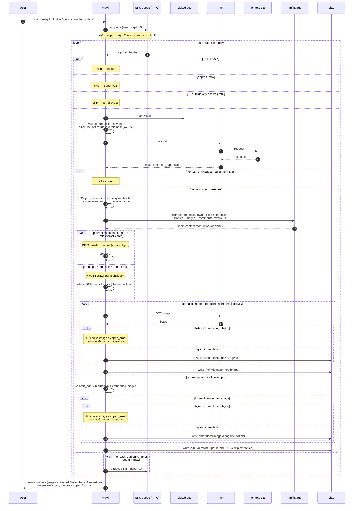
```mermaid
sequenceDiagram
    autonumber
    participant U as User
    participant CLI as crawl
    participant Q as BFS queue (FIFO)
    participant V as visited set
    participant HTTP as httpx
    participant Site as Remote site
    participant TR as trafilatura
    participant FS as ./kb/

    U->>CLI: crawl --depth 3 https://docs.example.com/api/
    CLI->>Q: enqueue (seed, depth=0)
    Note over CLI,Q: prefix scope = https://docs.example.com/api/

    loop until queue is empty
        Q-->>CLI: pop (url, depth)
        alt url ∈ visited
            Note over CLI: skip — dedup
        else depth > max
            Note over CLI: skip — depth-cap
        else url outside any seed's prefix
            Note over CLI: skip — out-of-scope
        else
            CLI->>V: mark visited
            CLI->>CLI: wait out request_delay_ms<br/>since the last request to this host (§4.3.5)
            CLI->>HTTP: GET url
            HTTP->>Site: request
            Site-->>HTTP: response
            HTTP-->>CLI: (status, content_type, bytes)
            alt non-2xx or unsupported content-type
                Note over CLI: WARN, skip
            else content-type = text/html
                CLI->>CLI: DOM pre-pass — collect every anchor href,<br/>rewrite every img src to a local name
                CLI->>TR: extract(dom, markdown, +links +formatting<br/>+tables +images, −comments, favor=…)
                TR-->>CLI: main-content Markdown (or None)
                alt extraction ok and length ≥ --min-extract-chars
                    Note over CLI: INFO crawl.extract.ok (retained_pct)
                    CLI->>CLI: prepend "# title" if body has no H1
                else no output / too short / --no-extract
                    Note over CLI: WARN crawl.extract.fallback
                    CLI->>CLI: whole-DOM markdownify (chrome included)
                end
                loop for each image referenced in the resulting MD
                    CLI->>HTTP: GET image
                    HTTP-->>CLI: bytes
                    alt bytes < --min-image-bytes
                        Note over CLI: INFO crawl.image.skipped_small,<br/>remove Markdown reference
                    else bytes ≥ threshold
                        CLI->>FS: write <doc-basename>-<img>.ext
                    end
                end
                CLI->>FS: write ./kb/<domain>/<path>.md
            else content-type = application/pdf
                CLI->>CLI: convert_pdf → markdown + embedded images
                loop for each embedded image
                    alt bytes < --min-image-bytes
                        Note over CLI: INFO crawl.image.skipped_small,<br/>remove Markdown reference
                    else bytes ≥ threshold
                        CLI->>FS: write embedded image alongside pdf.md
                    end
                end
                CLI->>FS: write ./kb/<domain>/<path>.md (PDFs skip extraction)
            end
            loop for each outbound link at depth < max
                CLI->>Q: enqueue (link, depth+1)
            end
        end
    end
    CLI-->>U: crawl complete (pages extracted / fallen back, files written,<br/>images extracted, images skipped for size)
```

# Part 5 — Voice Agent (LiveKit)

## 5.1 Purpose

A real-time voice interface to the HCAG agent, embeddable on a website. The user speaks; the agent transcribes, reasons over the HCAG active set, and speaks the answer back — with the running transcript and the streaming assistant response rendered live in the browser.

Two properties matter beyond the baseline agent (§1.4):

1. **Fast first-turn latency.** A voice conversation cannot afford a cold-start `check_and_load_kb` round trip on the user's first sentence. The voice session is therefore started with a **configured set of initial packet IDs** that are loaded into the active set before the room opens (§5.4.1), so the very first user turn already has the relevant knowledge in memory. When a mid-conversation load is unavoidable, the `tool.*` events of §2.14.1 at least let the client say what the pause is for.
2. **Sub-second inter-turn latency.** After the first turn, subsequent LLM calls must ride the prompt cache. The voice session issues a synthetic **cache warm-up call** immediately after packet loading (§5.4.2), so the prefix that all real turns will share is committed to the provider's prompt cache before the user starts talking.

## 5.2 Component Boundary

The voice agent **wraps** the runtime defined in Parts 1–2 rather than replacing it. Everything about the HCAG active-set protocol (§2.4), token budget (§2.5), packet loader (§2.6), and prompt-cache alignment (§2.12) is reused verbatim. The voice layer adds:

- A **LiveKit worker process** that joins a LiveKit room per user session.
- A **STT adapter** (Deepgram or ElevenLabs) that streams partial and final transcripts from the user's audio track.
- A **TTS adapter** (ElevenLabs or Deepgram) that streams synthesized audio from assistant text back to the room.
- A **transcription publisher** that mirrors both sides of the conversation onto a LiveKit text/data channel so the browser can render live captions and streaming assistant text. It consumes `AgentRuntime.run_turn_stream` (§2.14) — the same iterator the HTTP streaming route serves — so voice and chat cannot drift in what a turn emits.
- A **web client** (LiveKit JS SDK) that publishes the mic track, subscribes to the agent's audio track, and renders the transcription channel.

The `AgentRuntime`, `MemoryModule`, and `compiled.md` artifacts are unchanged. Swapping the voice front-end for a text front-end does not touch the reasoning path.

### 5.2.1 Voice Class Diagram

Extends the core class diagram (§2.9). `VoiceSession` is the new orchestrator; it composes an `AgentRuntime` (reused verbatim) with an `STTAdapter`, a `TTSAdapter`, and a `TranscriptionPublisher`. The two startup phases (§5.4.1, §5.4.2) are pure functions that operate on a runtime — modeled here as free-standing operations rather than methods so they can be exercised independently in tests and in the `dry-run` CLI (§5.9).

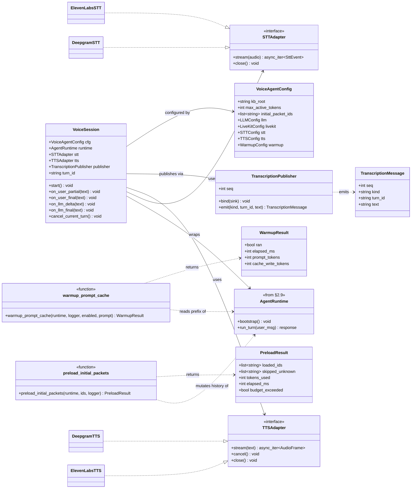
```mermaid
classDiagram
    direction LR

    class VoiceSession {
        +VoiceAgentConfig cfg
        +AgentRuntime runtime
        +STTAdapter stt
        +TTSAdapter tts
        +TranscriptionPublisher publisher
        +string turn_id
        +start() void
        +on_user_partial(text) void
        +on_user_final(text) void
        +on_llm_delta(text) void
        +on_llm_final(text) void
        +cancel_current_turn() void
    }

    class VoiceAgentConfig {
        +string kb_root
        +int max_active_tokens
        +list~string~ initial_packet_ids
        +LLMConfig llm
        +LiveKitConfig livekit
        +STTConfig stt
        +TTSConfig tts
        +WarmupConfig warmup
    }

    class AgentRuntime {
        <<from §2.9>>
        +bootstrap() void
        +run_turn(user_msg) response
    }

    class STTAdapter {
        <<interface>>
        +stream(audio) async_iter~SttEvent~
        +close() void
    }

    class TTSAdapter {
        <<interface>>
        +stream(text) async_iter~AudioFrame~
        +cancel() void
        +close() void
    }

    class DeepgramSTT
    class ElevenLabsSTT
    class ElevenLabsTTS
    class DeepgramTTS

    class TranscriptionPublisher {
        +int seq
        +bind(sink) void
        +emit(kind, turn_id, text) TranscriptionMessage
    }

    class TranscriptionMessage {
        +int seq
        +string kind
        +string turn_id
        +string text
    }

    class PreloadResult {
        +list~string~ loaded_ids
        +list~string~ skipped_unknown
        +int tokens_used
        +int elapsed_ms
        +bool budget_exceeded
    }

    class WarmupResult {
        +bool ran
        +int elapsed_ms
        +int prompt_tokens
        +int cache_write_tokens
    }

    class preload_initial_packets {
        <<function>>
        +preload_initial_packets(runtime, ids, logger) PreloadResult
    }

    class warmup_prompt_cache {
        <<function>>
        +warmup_prompt_cache(runtime, logger, enabled, prompt) WarmupResult
    }

    VoiceSession --> AgentRuntime : wraps
    VoiceSession --> STTAdapter : uses
    VoiceSession --> TTSAdapter : uses
    VoiceSession --> TranscriptionPublisher : publishes via
    VoiceSession --> VoiceAgentConfig : configured by

    DeepgramSTT ..|> STTAdapter
    ElevenLabsSTT ..|> STTAdapter
    ElevenLabsTTS ..|> TTSAdapter
    DeepgramTTS ..|> TTSAdapter

    TranscriptionPublisher ..> TranscriptionMessage : emits

    preload_initial_packets ..> AgentRuntime : mutates history of
    preload_initial_packets ..> PreloadResult : returns
    warmup_prompt_cache ..> AgentRuntime : reads prefix of
    warmup_prompt_cache ..> WarmupResult : returns
```

**How this composes with §2.9.** `AgentRuntime`, `MemoryModule`, `Catalog`, `Delta`, and the packet loader are unchanged — they appear in this diagram only where `VoiceSession` reaches into them. Every real-turn call still goes through `AgentRuntime.run_turn`, so §2.10's sequence diagrams apply to the reasoning path even inside a voice session.

## 5.3 Real-Time Architecture

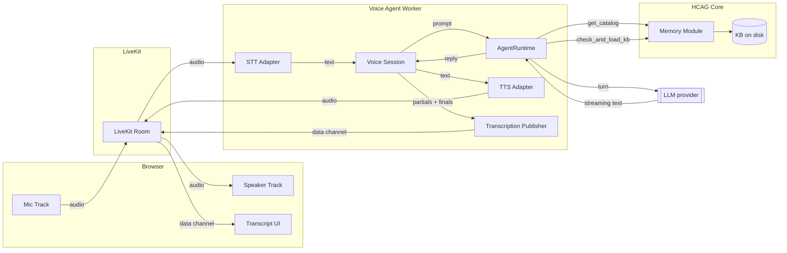
```mermaid
flowchart LR
    subgraph Browser
        Mic[Mic Track]
        Spk[Speaker Track]
        UI[Transcript UI]
    end
    subgraph LiveKit
        Room[LiveKit Room]
    end
    subgraph Worker[Voice Agent Worker]
        STT[STT Adapter]
        VA[Voice Session]
        RT[AgentRuntime]
        TTS[TTS Adapter]
        Pub[Transcription Publisher]
    end
    subgraph HCAG[HCAG Core]
        MM[Memory Module]
        KB[(KB on disk)]
    end
    LLM[[LLM provider]]

    Mic -- audio --> Room
    Room -- audio --> STT
    STT -- text --> VA
    VA -- prompt --> RT
    RT -- turn --> LLM
    LLM -- streaming text --> RT
    RT -- reply --> VA
    VA -- text --> TTS
    TTS -- audio --> Room
    Room -- audio --> Spk
    VA -- partials + finals --> Pub
    Pub -- data channel --> Room
    Room -- data channel --> UI
    RT -- get_catalog --> MM
    RT -- check_and_load_kb --> MM
    MM --> KB
```

**One worker per session.** A new LiveKit room implies a new worker instance holding its own `AgentRuntime`, its own active set, and its own STT/TTS stream handles. Cross-session state is not shared (each user's classification and packet load are independent).

## 5.4 Session Startup

Session startup runs to completion before the browser is allowed to send audio. Its two phases are ordered:

### 5.4.1 Warm-start with initial packets

The voice agent accepts an ordered list of packet IDs — `initial_packet_ids` — via config (§5.8) or CLI (§5.9). Before opening the room to input:

1. Instantiate `AgentRuntime` with the standard bootstrap (§2.7): read the root `compiled.md`'s `## Catalog` section (the whole-KB index — D3a), inject into the system prompt.
2. For each ID in `initial_packet_ids`, call `memory_module.check_and_load_kb(requested=[id], active=<current>)` and apply the returned delta exactly as an in-turn call would. This produces a byte-identical sequence of tool-result blocks in history — the same shape a normal turn would create — so the cache-alignment rules (§2.12) apply unchanged.
3. If the union of initial packets exceeds `MAX_ACTIVE_TOKENS`, startup fails with an explicit error (`errors[].reason = "BudgetExceeded"`). Voice sessions do not silently drop preloads — the operator misconfigured the initial set.
4. Unknown packet IDs are logged as `voice.startup.unknown_packet` WARN entries and skipped; startup continues with the remainder. Rationale: an outdated deploy config should not brick the room.

The initial-packet list is a **classification hint**, not a policy override. Nothing prevents the agent from calling `check_and_load_kb` mid-conversation to load additional branches; the preload only guarantees that the *first* user sentence lands on a warm active set.

### 5.4.2 Prompt-cache warm-up call

After initial packets are loaded, the voice agent issues a synthetic LLM call whose sole purpose is to commit the shared prefix to the provider's prompt cache:

```
system: <static prefix> + <catalog> + <preload tool-result blocks>
user:   "Ready. Await user turn."
```

with `cache_control` breakpoints placed at the end of the system block and after each preload tool-result block (§2.12). The response is discarded. The provider now holds a cache entry keyed on the exact prefix that every real turn in this session will share, so the first real turn incurs a cache hit rather than a full-prefix read.

**Ordering matters.** The warm-up call must run *after* §5.4.1 — the byte-stable prefix is only defined once the initial packets have been folded in. Running it earlier caches a prefix the real turns will never send, wasting the write.

**Cost accounting.** The warm-up call is a full-prefix cache *write*, priced above a cold prompt at most providers. It is paid once per session and amortizes across every subsequent turn. If a session ends before the first real turn, the write is a loss; §5.10 tracks this as `voice.warmup.wasted` for tuning.

### 5.4.3 Startup Sequence Diagram

The two-phase startup, end-to-end. The room is created up front but the browser is told to wait until `system.ready` is emitted — nothing from the mic is transported to the STT adapter before the cache is primed.

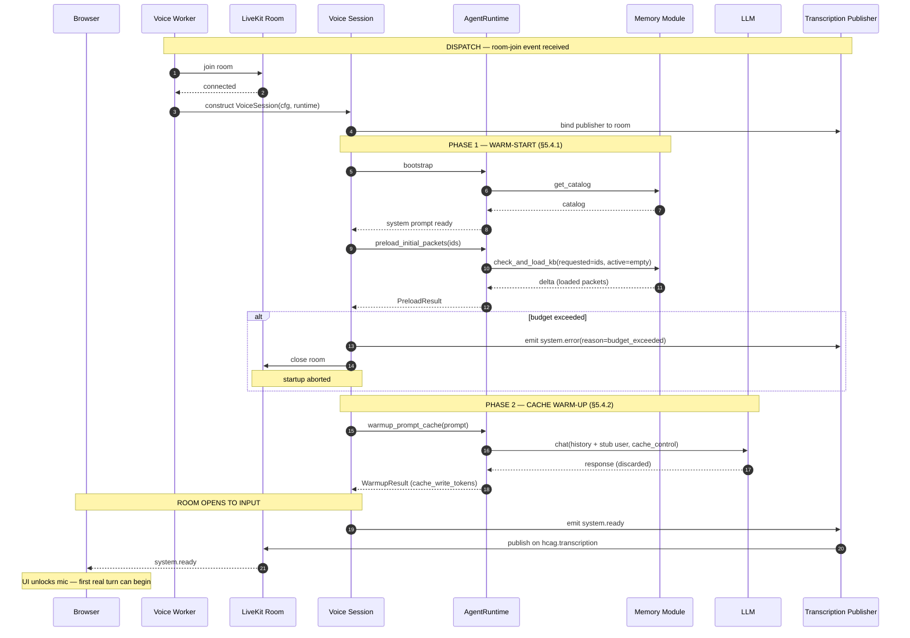
```mermaid
sequenceDiagram
    autonumber
    participant B as Browser
    participant W as Voice Worker
    participant R as LiveKit Room
    participant V as Voice Session
    participant A as AgentRuntime
    participant M as Memory Module
    participant L as LLM
    participant P as Transcription Publisher

    Note over W,P: DISPATCH — room-join event received

    W->>R: join room
    R-->>W: connected
    W->>V: construct VoiceSession(cfg, runtime)
    V->>P: bind publisher to room

    Note over V,M: PHASE 1 — WARM-START (§5.4.1)

    V->>A: bootstrap
    A->>M: get_catalog
    M-->>A: catalog
    A-->>V: system prompt ready

    V->>A: preload_initial_packets(ids)
    A->>M: check_and_load_kb(requested=ids, active=empty)
    M-->>A: delta (loaded packets)
    A-->>V: PreloadResult

    alt budget exceeded
        V->>P: emit system.error(reason=budget_exceeded)
        V->>R: close room
        Note over V,R: startup aborted
    end

    Note over V,L: PHASE 2 — CACHE WARM-UP (§5.4.2)

    V->>A: warmup_prompt_cache(prompt)
    A->>L: chat(history + stub user, cache_control)
    L-->>A: response (discarded)
    A-->>V: WarmupResult (cache_write_tokens)

    Note over V,B: ROOM OPENS TO INPUT

    V->>P: emit system.ready
    P->>R: publish on hcag.transcription
    R-->>B: system.ready
    Note over B: UI unlocks mic — first real turn can begin
```

Failure paths are explicit: an unknown packet ID logs `voice.startup.unknown_packet` and continues (step 8 loops on the remaining IDs); a budget-exceeded delta shortcuts to `system.error` and closes the room; a warm-up call that errors is a WARN, not a fatal — the session proceeds without a primed cache (first real turn eats the full-prefix read).

## 5.5 Real-Time Turn Pipeline

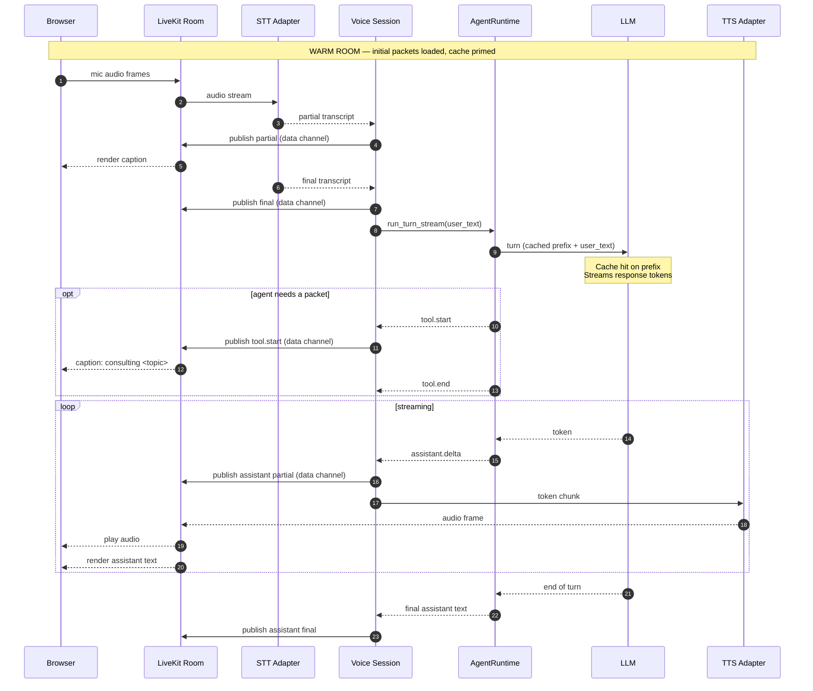
```mermaid
sequenceDiagram
    autonumber
    participant B as Browser
    participant R as LiveKit Room
    participant S as STT Adapter
    participant V as Voice Session
    participant A as AgentRuntime
    participant L as LLM
    participant T as TTS Adapter

    Note over B,T: WARM ROOM — initial packets loaded, cache primed

    B->>R: mic audio frames
    R->>S: audio stream
    S-->>V: partial transcript
    V->>R: publish partial (data channel)
    R-->>B: render caption

    S-->>V: final transcript
    V->>R: publish final (data channel)
    V->>A: run_turn_stream(user_text)
    A->>L: turn (cached prefix + user_text)
    Note over L: Cache hit on prefix<br/>Streams response tokens

    opt agent needs a packet
        A-->>V: tool.start
        V->>R: publish tool.start (data channel)
        R-->>B: caption: consulting <topic>
        A-->>V: tool.end
    end

    loop streaming
        L-->>A: token
        A-->>V: assistant.delta
        V->>R: publish assistant partial (data channel)
        V->>T: token chunk
        T-->>R: audio frame
        R-->>B: play audio
        R-->>B: render assistant text
    end

    L-->>A: end of turn
    A-->>V: final assistant text
    V->>R: publish assistant final
```

**Barge-in.** If the STT adapter emits a new final transcript while TTS is still speaking, the voice session cancels the in-flight TTS stream and the in-flight LLM stream, publishes an `assistant.interrupted` marker on the data channel, and starts a new turn. The `AgentRuntime` sees the cancellation as a turn-boundary event and does not persist the truncated assistant message into history.

**Streaming while thinking.** Assistant text is published to the data channel as tokens arrive from the LLM, *before* TTS has finished synthesizing the corresponding audio. This lets the browser render text ahead of audio — perceptually the response feels instantaneous even if audio has a few hundred ms of TTS latency.

## 5.6 STT / TTS Provider Selection

Both STT and TTS are provider-neutral behind a small adapter interface. Two providers are supported out of the box:

| Role | Providers | Selection knob |
|---|---|---|
| STT (audio → text) | `deepgram`, `elevenlabs` | `stt.provider` (config) or `--stt-provider` (CLI) |
| TTS (text → audio) | `elevenlabs`, `deepgram` | `tts.provider` (config) or `--tts-provider` (CLI) |

Each provider block additionally accepts:

- `model` — provider-specific model identifier (e.g. `nova-2-general` for Deepgram STT, `eleven_turbo_v2_5` for ElevenLabs TTS). Overridable at the CLI with `--stt-model` / `--tts-model`.
- `api_key_env` — env var to read the credential from; the raw key is never written to config.
- `language` (STT) / `voice_id` (TTS) — optional provider-specific tuning.
- `endpoint` — override URL for self-hosted or region-pinned endpoints.

**CLI overrides win.** Precedence is `CLI flag > env var > config file > adapter default`. The startup log line records the resolved provider, model, and endpoint for each of STT and TTS (`voice.startup.resolved`) so a mis-set flag is obvious at a glance.

**Provider swap is per session, not per turn.** Changing providers mid-session would invalidate the cache warm-up (system prompt is unaffected, but audio format contracts break). Provider choice is fixed at session start.

## 5.7 Live Transcription Channel (Web Client Contract)

Transcription and streaming text are published on a LiveKit **data channel** named `hcag.transcription`. Payloads are JSON, one message per event, monotonically increasing `seq`. **The event vocabulary is the one defined in §2.14.1** — the same schema the chat widget consumes over SSE, differing only in transport:

```json
{ "seq": 42, "kind": "user.partial",     "text": "how do partial ref",     "turn_id": "t_9" }
{ "seq": 43, "kind": "user.final",       "text": "how do partial refunds work", "turn_id": "t_9" }
{ "seq": 44, "kind": "assistant.delta",  "text": "Partial refunds are ", "turn_id": "t_9" }
{ "seq": 45, "kind": "assistant.delta",  "text": "issued when...",       "turn_id": "t_9" }
{ "seq": 46, "kind": "assistant.final",  "text": "Partial refunds are issued when...", "turn_id": "t_9" }
{ "seq": 47, "kind": "assistant.interrupted", "turn_id": "t_9" }
```

- `kind` values are namespaced (`user.*`, `assistant.*`, `system.*`) so the client can render user captions and assistant text in different UI slots without keyword-matching text content.
- `turn_id` groups deltas with their finalizing message and lets the client discard stale partials after an `assistant.interrupted`.
- `tool.start` / `tool.end` (§2.14.1) are published here too. The packet load between the user's last word and the agent's first is the most conspicuous silence in a voice turn, and it is the one pause the client can explain rather than merely fill: the caption pane can say *"Consulting Employment Pass eligibility…"* while it happens. `user.*` events remain voice-only — a chat client has no partial transcript.
- The `system.*` namespace carries session lifecycle events (`system.ready` once §5.4.2 completes; `system.error` on unrecoverable failure) so the browser can show a "connecting…" state until the room is warm.
- Audio itself is **not** on the data channel — it flows through the standard LiveKit audio track. The data channel is text-only.

The web client is not otherwise specified here: any application that speaks the LiveKit JS SDK and consumes `hcag.transcription` per the schema above is a valid front-end.

## 5.8 Configuration

Voice agent configuration lives in `voice.toml`, layered on top of the same `AgentConfig` used by the text runtime:

```toml
kb_root           = "./my-kb"
max_active_tokens = 32000

# Preloaded packet IDs (§5.4.1). Ordered — earlier IDs take budget first.
initial_packet_ids = ["billing.refunds", "billing.invoices", "auth.oauth"]

[llm]
provider = "anthropic"
model    = "claude-3-5-haiku-20241022"

[livekit]
url        = "wss://my-app.livekit.cloud"
api_key_env    = "LIVEKIT_API_KEY"
api_secret_env = "LIVEKIT_API_SECRET"
room_prefix    = "hcag-"       # rooms are named "<prefix><session-id>"

[stt]
provider    = "deepgram"                  # deepgram | elevenlabs
model       = "nova-2-general"
api_key_env = "DEEPGRAM_API_KEY"
language    = "en-US"
endpoint    = ""                          # optional override

[tts]
provider    = "elevenlabs"                # elevenlabs | deepgram
model       = "eleven_turbo_v2_5"
voice_id    = "21m00Tcm4TlvDq8ikWAM"
api_key_env = "ELEVENLABS_API_KEY"
endpoint    = ""

[warmup]
enabled = true                            # skip only for local dev with cache-less providers

[log]
file_path = "./hcag-voice.log"
level     = "INFO"
```

**Reused blocks.** `[llm]`, `[log]`, and OTEL config follow the same schemas as §2.13 and §3.6 — the voice agent does not fork configuration models for the pieces it shares with the text runtime.

## 5.9 CLI

The voice agent runs as a long-lived worker process:

```
$ hcag-voice serve --config voice.toml [flags]
```

Flags override the corresponding `voice.toml` fields:

| Flag | Overrides | Notes |
|---|---|---|
| `--kb-root PATH` | `kb_root` | |
| `--initial-packets id1,id2,...` | `initial_packet_ids` | Comma-separated. Order preserved. |
| `--stt-provider {deepgram,elevenlabs}` | `stt.provider` | |
| `--stt-model NAME` | `stt.model` | Any provider-valid model ID. |
| `--tts-provider {elevenlabs,deepgram}` | `tts.provider` | |
| `--tts-model NAME` | `tts.model` | |
| `--tts-voice ID` | `tts.voice_id` | TTS-only. |
| `--livekit-url URL` | `livekit.url` | |
| `--no-warmup` | `warmup.enabled = false` | Skip §5.4.2 (dev only). |
| `--log-file PATH` / `--log-level LEVEL` | `log.file_path` / `log.level` | Same shape as §3.9 / §4.7. |

`serve` blocks in the foreground. It joins the LiveKit dispatcher, accepts room-join events, and spins up one `AgentRuntime + STT + TTS` triple per session. Shutdown on `SIGTERM` drains in-flight sessions (finishes the current TTS utterance, publishes `system.error` with reason `shutdown`, closes the room) before exiting.

A one-shot `hcag-voice dry-run` subcommand runs §5.4.1 and §5.4.2 without joining any room and prints the resolved provider/model/preload summary. Useful in CI to catch a bad initial-packet ID before deploy.

## 5.10 Observability

Reuses the JSON-lines log format (§2.11.3) and OTEL trace model (§2.11.2). The `[observability]` block in `voice.toml` is the same shape as the runtime's, so the voice worker accepts either trace destination form — including the direct `[observability.langfuse]` block (§2.11.1) — with the same activation, precedence, and failure rules. Voice-specific events:

- `INFO`:
  - `voice.startup.resolved` — resolved STT/TTS provider + model + endpoint, and the effective `initial_packet_ids`.
  - `voice.startup.preload_done` — packet IDs loaded, tokens consumed, wall-clock elapsed.
  - `voice.warmup.done` — prompt-cache warm-up latency and reported cache write size.
  - `voice.session.opened` / `voice.session.closed` — room name, session ID, duration, turn count.
  - `voice.turn.completed` — turn ID, user-final length, assistant-final length, first-token latency, first-audio latency, total turn duration.
- `DEBUG`:
  - STT partials/finals with timestamps.
  - Assistant token deltas.
  - TTS chunk boundaries.
  - Barge-in cancellation points.
- `WARN`:
  - `voice.startup.unknown_packet` — packet ID in `initial_packet_ids` not present in catalog.
  - `voice.warmup.wasted` — session closed before any real turn used the primed cache.
  - STT/TTS transient errors that were retried successfully.
  - Data-channel publish backpressure.
- `ERROR`:
  - `voice.startup.budget_exceeded` — initial packets exceed `MAX_ACTIVE_TOKENS`; startup aborted.
  - STT/TTS/LiveKit connection failures that terminate the session.
  - LLM streaming errors that could not be recovered mid-turn (the current turn ends with a `system.error` on the data channel; the session stays alive for the next turn).

New OTEL spans:

- `voice.session` (root, per room) with attributes for STT/TTS provider and model, initial-packet count, warmup latency.
- `voice.turn` (child) with first-token / first-audio latency attributes.
- `voice.stt.stream` and `voice.tts.stream` bracket the per-turn STT and TTS work so the audio pipeline is visible alongside the LLM call.

## 5.11 Non-Goals

- **Multi-party audio.** One user, one agent per room. Conference-style N-to-1 or N-to-N sessions are out of scope.
- **Speaker diarization.** Single-speaker input assumed. Distinguishing multiple speakers on the mic track is a provider-level feature and not exposed here.
- **Client-side reasoning.** The browser is a thin transport for audio in, audio out, and transcript rendering. No inference runs in the browser.
- **Persistent conversation memory across sessions.** Each room is a fresh `AgentRuntime`. Long-term user memory is a separate concern.
- **Voice cloning / custom voices.** Whatever the TTS provider offers is what is available; the voice agent does not build or manage voice models itself.
- **Failover between STT/TTS providers mid-session.** Provider is fixed at session start (§5.6). Switching mid-session would invalidate the warm cache and audio contracts.

---

# Part 6 — The `evalgen` CLI Tool

## 6.1 Purpose

`evalgen` generates evaluation question / expected-answer pairs from a normalized KB, for use in scoring retrieval quality and answer quality against the runtime agent (Part 2) or the voice agent (Part 5). It gives KB owners a repeatable way to build an eval set that is grounded in the same content the agent will serve at runtime — so regressions in retrieval selection, packet coverage, or multimodal reasoning surface as measurable score drops on a fixed set of questions.

Questions may be generated **in character**. An optional persona file (§6.2.3) — a CSV of `persona_id`, `persona_name`, `persona_description` — declares the roles the KB's users actually occupy: the HR officer filing an Employment Pass application for a candidate, the candidate trying to work out whether they qualify. Each generated item is asked from one of them (§6.4.6). The KB still decides what is true; the persona decides who is asking, in what words, and **which questions are worth asking at all** — the ones that role brings to the agent in the course of its work, not the ones an examiner would construct from the same page (§6.4.6).

The tool is a **question / expected-answer generator only**. It does not run the agent, score responses, or persist verdicts; those columns are left empty in the CSV output and filled in by a separate evaluation pass (§6.7).

## 6.2 Input Model

`evalgen` reads two inputs. The **KB** is required and supplies everything a question can be grounded in. The **persona file** is optional and supplies the roles questions are asked from (§6.2.3); without it, generation is persona-free and behaves exactly as it did before personas existed.

`evalgen` consumes a KB directory that has already been normalized by `hcag` (§3.4):

- Every folder (leaf, taxonomy node, mixed, and root) contains a `compiled.md` with HCAG front-matter (id, title, descriptions, `kind`, token estimate) and — when applicable — a `## Content` section carrying the folder's own source markdown.
- Images referenced by a folder live in that folder's `assets/` subdirectory.
- `source_urls` and `image_urls` in front-matter give each source file's and image's origin (§3.4.3). `evalgen` reads them for the `source` column (§6.7.1) and never fetches them — an eval set is generated offline against the KB as it stands.
- The root `compiled.md` — produced by `hcag` (§3) — is always available. Its `## Catalog` table indexes every content-bearing folder in the KB with an `id`, `path` and `depth` on every row (D3a), so the taxonomy is readable from that one file; `evalgen` uses taxonomic adjacency to bias cross-packet pairing (§6.4.4). Folders absent from the table hold no content and are nothing to generate a question from, so the table and the set of eligible packets are the same set.

`evalgen` reads folders as-is; it does not modify the KB. Source `.md` files outside `compiled.md` and images outside `assets/` are ignored — the tool operates only on the artifacts the runtime actually serves.

### 6.2.2 Startup — config visibility and LLM preflight

`evalgen` makes one LLM call per question and writes its CSV at the end, so anything wrong with the LLM is discovered late and costs the whole run. Two checks run before generation starts, mirroring `hcag` (§3.4.9).

**A missing `evalgen.toml` is announced, not silently absorbed.** The config resolves as `--config <path>`, else `<kb_root>/evalgen.toml`, else built-in defaults — and the fallback is deliberate, since `evalgen` is runnable without a config file. But the defaults resolve to a small, cheap model, and question quality tracks model strength: `hard-2` needs a **multimodal** model and produces nothing without one (§6.4.5), while the reasoning kinds degrade quietly into trivia. Getting that instead of the strong model an `evalgen.toml` would have named is invisible in the output, so the run says on stderr which path it looked for and which provider and model it fell back to. It is a warning rather than an error: running on defaults is legitimate, running on them *unknowingly* is not.

**The LLM is preflighted.** One generation-shaped probe against the configured model, checked for a parseable JSON reply — the same contract the generators depend on. It exercises env-var resolution, provider dispatch, model-id validity, auth, and the model's ability to follow the output format. Systemic failures (bad key, unknown model) fail immediately; transient ones honour `llm.max_retries`. A reply that will not parse fails the probe, because a model too small to hold the output contract is far cheaper to detect on call one than on question forty.

**The persona roster is echoed.** When `--personas` is given, the run prints the file path and the ids it parsed, in allocation order, before the first LLM call. A roster silently short by one row still generates a full CSV, just one whose coverage does not match what the author asked for — a trailing blank line, a row lost to an unbalanced quote, and the output looks entirely healthy. Parse failures themselves are startup errors (§6.9), not warnings: the roster shapes every row, so there is no degraded mode worth continuing into.

On failure `evalgen` exits non-zero having written nothing — there is no partial CSV to mistake for a complete eval set. `llm.preflight = false` disables the probe for offline runs with stubbed calls.

### 6.2.1 Paragraphs — the grounding unit

Several question kinds are grounded in a *paragraph* (§6.4.2, §6.4.3, §6.4.4), so what counts as one decides what a question can be about. Paragraphs are the blank-line-separated blocks of a folder's `## Content`, filtered by `generation.paragraph_min_chars`.

Blank-line splitting is right for prose and needs exactly one repair for PDF-derived content, which since §4.4.2 makes up the majority of some KBs. `pymupdf4llm` sometimes emits a whole logical row as a **single table cell**, so a paragraph of real prose arrives fenced in pipes:

```
| Eligible job titles Novel food biotechnologist Job duties Develop bioprocess … |
```

That is not a table and not a fragment of one — no delimiter row, no second cell — but it reads as a broken table row, and a question grounded in it inherits the confusion. Such a block is unwrapped to plain text. **Only the unambiguous case**: one line, no delimiter row, no internal `|`. Anything with real cell boundaries is left exactly as it is, because guessing where a row's columns were is how a table stops being ugly and starts being wrong.

**Multi-row tables are left whole**, header included, and are legitimate grounding units — a salary band table is often the most answerable thing in a packet.

**No header reattachment, deliberately.** The obvious next worry is a table split across a page boundary, whose continuation would arrive as headerless rows meaning nothing on their own. That was measured rather than assumed: on a 19-packet `mom.gov.sg` KB, **every** headerless table block was a single-cell paragraph and **none** was a continuation — `pymupdf4llm` repeats the header on each page. Machinery to carry headers forward would be speculative, and speculative repair of table structure is the failure mode this section is trying to avoid. If a corpus is found where continuations do occur, that measurement is the thing to redo first.

### 6.2.3 The persona file

The persona file is a **CSV** declaring the roles questions are asked from. It is passed as `--personas <path>` (§6.3) and is entirely optional.

| Column | Required | Description |
|---|---|---|
| `persona_id` | yes | Stable token identifying the role. Written to the eval set's `persona` column (§6.7.2), accepted by `--persona`, and used to group the scored report (§7.8). Lowercase letters, digits, `-` and `_`. |
| `persona_name` | yes | Human-readable label — `HR professional`, `Prospective pass holder`. Rendered into the generation prompt as `$persona_name` and used as the display label in the report. |
| `persona_description` | yes | The prose that does the work: who this person is, what they are trying to get done, what they already know and do not know, the words they use, and — most importantly — **what they typically ask** (§6.4.6). |
| `topics` | no | Space-separated packet-id prefixes (the dotted paths of §3.4.5) biasing sampling toward the part of the taxonomy this role lives in (§6.4.6). Space-separated for the same reason `source` is (§6.7.1): a comma inside a CSV cell costs a layer of quoting for nothing. Omit the column entirely and every persona samples the whole KB. |

Columns are matched by header name; order does not matter and unrecognized columns are ignored, so a roster may carry an owner or a review date without `evalgen` needing to know about them. Encoding and quoting are the same as everywhere else in this system: UTF-8, RFC 4180. Descriptions contain commas and often line breaks, so they are quoted; RFC 4180 permits embedded newlines inside a quoted field, which is what lets a multi-paragraph description live in one cell.

**Why CSV.** The roster is a table of short records with one long prose field, and it is authored by the people who know the audience — a policy, service-design, or support team — rather than by whoever maintains the prompts. That is a spreadsheet, and handing those people a spreadsheet is the difference between a roster that gets revised when the audience is better understood and one that is written once and never touched. It is also the format the tool already reads and writes at both ends (§6.7, §7.2), so a reviewer opens the roster and the eval set with the same thing.

**Ids are authored, not derived.** The id is a column rather than a slug of the name, so the name and description can be rewritten — sharpened after reading a bad batch of questions, which is the normal way a roster improves — without breaking comparability with eval sets generated earlier (§6.7.2). The obligation that comes with that: an id must not be **reused for a different role**. Rewording `hr-professional` is free; repointing it at, say, an employment agent silently makes two eval sets look comparable when they are not.

Example:

```csv
persona_id,persona_name,persona_description,topics
hr-professional,HR professional,"Files work-pass transactions for a Singapore employer. Applies for Employment Passes for candidates the company wants to hire, checks in advance whether a candidate is likely to qualify, renews passes before they lapse, cancels a pass when someone resigns or is terminated, and appeals rejections. Typically asks whether a specific candidate will clear the bar, what to submit and in what order, how long a transaction takes, what happens when a deadline is missed, and what the company is liable for. Says ""our candidate"" and ""we"", uses the transaction names, and almost never quotes a regulation by name.",passes-and-permits.employment-pass passes-and-permits.work-permit
prospective-pass-holder,Prospective pass holder,"A foreign professional weighing or preparing a move to Singapore. Typically asks whether they personally qualify, what a salary offer means for someone of their age and sector, what the application will ask of them, how long it takes, what happens to the pass if the job ends, and what their family can and cannot do on a dependant's pass. Describes their own situation in plain words rather than in the scheme's vocabulary, and often does not know which pass type applies to them.",passes-and-permits.employment-pass
```

Both descriptions spend a sentence on what the role *typically asks*. That sentence is the most load-bearing part of the file: it is what §6.4.6 uses to keep generated questions inside the population of questions the role actually brings, and a description that only says who someone is leaves the generator to invent that population itself.

**Validation is at startup, and it is strict.** A missing required column, a file with a header and no rows, a blank `persona_id` or `persona_description`, and two rows sharing an id are all startup errors (§6.9). None has a sensible degraded reading: an empty roster is a mis-authored file rather than a request for persona-free generation, which is what omitting the flag already means, and a duplicate id makes the `persona` column ambiguous for every row either one generated.

## 6.3 Invocation

```
$ evalgen <kb_root> --out <output.csv> [--total <N> | --simple <n1> --medium <n2> --complex <n3> --hard-1 <n4> --hard-2 <n5>] [--personas <personas.csv>] [options]
```

| Parameter | Required | Description |
|---|---|---|
| `<kb_root>` | yes | Path to the normalized KB directory (the same directory `hcag` was run on). |
| `--out <path>` | yes | Path to the output CSV file. Overwritten if it exists. |
| `--total <N>` | one-of | Total number of question/answer pairs to generate, split equally across the five types (§6.5). |
| `--simple <n>` | one-of | Explicit count of `simple` questions to generate. |
| `--medium <n>` | one-of | Explicit count of `medium` questions to generate. |
| `--complex <n>` | one-of | Explicit count of `complex` questions to generate. |
| `--hard-1 <n>` | one-of | Explicit count of `hard-1` (cross-packet) questions to generate. |
| `--hard-2 <n>` | one-of | Explicit count of `hard-2` (multimodal) questions to generate. |
| `--seed <int>` | no | Random seed for packet/paragraph selection. Fixed seed → reproducible eval set for a given KB revision. |
| `--id-prefix <str>` | no | Prefix for `question_id` values (default `q`). Useful when merging multiple eval sets. |
| `--personas <path>` | no | Path to a persona CSV (§6.2.3). Every generated item is asked as one of its personas would ask it. Omitted → persona-free generation and an empty `persona` column. |
| `--persona <id>` | no | Restrict generation to one `persona_id` from that file. Repeatable. Requires `--personas`. |
| `--config <path>` | no | Path to `evalgen.toml` (§6.8). Defaults to `<kb_root>/evalgen.toml` if present. |

**Mutual exclusivity.** `--total` and any of the `--<kind> <n>` flags are mutually exclusive. Pass **either** a single `--total` **or** one-to-five explicit per-type flags; mixing the two forms is a startup error. Per-type flags default to `0` when omitted, so `--simple 20 --hard-2 5` generates exactly 25 questions of only those two kinds.

Example invocation:

```
$ evalgen kb/ --out kb-eval.csv --total 100 --seed 42
```

Generates 100 pairs — 20 `simple`, 20 `medium`, 20 `complex`, 20 `hard-1`, 20 `hard-2` — using seed `42`, and writes them to `kb-eval.csv`. Equivalent explicit form:

```
$ evalgen kb/ --out kb-eval.csv \
    --simple 20 --medium 20 --complex 20 --hard-1 20 --hard-2 20 --seed 42
```

With personas:

```
$ evalgen kb/ --out kb-eval.csv --total 100 --seed 42 --personas personas.csv
```

Still 100 pairs, 20 per kind, but each kind's 20 are dealt round-robin across the roster — 10 asked as the HR professional and 10 as the prospective pass holder, for the two-persona file in §6.2.3 (§6.5). To regenerate only one persona's rows:

```
$ evalgen kb/ --out hr-eval.csv --total 50 --seed 42 \
    --personas personas.csv --persona hr-professional
```

## 6.4 Question Types

Each row's `kind` column carries one of five string tags corresponding to how the question was constructed. The tags are stable — the evaluation pass filters and scores by `kind`.

`kind` is one of two axes. It fixes **how hard** a question is and **what grounds** it. The persona (§6.4.6) fixes **who asks** it, **in what words**, and **whether it is a question anyone would actually ask**. The two are independent: every kind can be asked by every persona, and no persona changes which packets or paragraphs an item is grounded in.

### 6.4.0 Expected answers must be complete

**The kinds differ in how hard the question is. They do not differ in how complete the answer must be.** Every kind is generated with one shared completeness standard (`evalgen.answer_rules`, §2.15.5), and it is the single most consequential thing about a generated eval set.

**Why: an incomplete reference answer certifies wrong behaviour as correct.** The expected answer is what an agent is scored against, so anything it omits is something the agent may also omit and still be marked fully correct. This is not a matter of style. Asked *"what is the minimum monthly salary an Employment Pass candidate needs?"*, an expected answer of *"Candidates need to earn at least $5,600 a month"* is **wrong**, not merely terse: in the source, $5,600 applies only below age 24, only outside financial services, and only to applications before a stated date — the figure rises to $10,700 by age 45, to $6,200–$11,800 in financial services, and again from 1 January 2027. An eval built on that reference answer scores an agent full marks for telling an applicant a number that does not apply to them, and it would never have caught the misrouting diagnosed in D3b.

So a generated answer must state the fact **with every condition the source attaches to it**: what it varies by, the full range rather than one end of it, when a different value applies, the exceptions, and concrete worked values where the source gives them. Length follows completeness; there is no brevity target.

**Comprehensive is not licence to invent.** The answer exhausts what the source says and stops there. If the source is itself incomplete, so is the answer.

**One file, not five.** The standard lives in a single prompt shared by every kind, because a quality bar duplicated across five prompts is one that four of them silently drift from.

The standard is also what a persona must not erode. A question asked in character narrows toward one person's case, and the answer is tempting to narrow with it; §6.4.6 says why it must not, and what a narrowed question's answer has to contain instead.

### 6.4.1 `simple`

- **Definition.** A question **requiring no reasoning** — the reader looks the answer up rather than working it out. FAQ-shaped.
- **Source.** One packet. The answer may draw on several places within it; a looked-up fact is often stated in one sentence and qualified in another.
- **Expected answer.** Complete, per §6.4.0. **Not a quote.** "No reasoning" describes the *question*, not the answer: a fact that is simple to locate is routinely conditional, and the item exists to test whether an agent states the whole of it rather than its first clause.
- **Signal.** Measures whether the agent retrieved and read the correct packet, *and reported all of what it found*. A `simple` failure usually means retrieval is broken; a partially-correct `simple` usually means the agent stopped at the first true sentence.

**This kind was previously specified as verbatim extraction**, with a validator requiring the answer to appear literally in the packet. That was the direct cause of inadequate reference answers: the only text guaranteed to appear verbatim in a packet is a fragment of it, so the constraint capped every `simple` answer at one clause. Grounding is now checked instead of extraction (§6.9).

### 6.4.2 `medium`

- **Definition.** Requires **reasoning grounded in a single paragraph** of a single packet. The answer is not a verbatim quote — the reader must interpret or combine facts within one paragraph.
- **Source.** One folder, one paragraph (a contiguous block delimited by blank lines in that folder's `compiled.md` `## Content` section).
- **Expected answer.** A short natural-language answer whose supporting facts all appear in the chosen paragraph, but which is not a direct quotation of it.
- **Signal.** Measures within-passage comprehension once retrieval has succeeded.

### 6.4.3 `complex`

- **Definition.** Requires **significant deduction across at least three distinct concepts, drawn from at least three different paragraphs within a single folder's `compiled.md` `## Content` section**.
- **Source.** One packet; at least three distinct paragraphs, each contributing a different concept the answer depends on.
- **Expected answer.** A synthesized answer that cannot be produced from any single paragraph in isolation. The generation prompt requires the LLM to identify each paragraph's contribution before composing the answer, so the eval remains auditable.
- **Signal.** Measures whole-packet reasoning — whether the agent uses everything a loaded packet contains, not just the first hit.

### 6.4.4 `hard-1` (cross-packet)

- **Definition.** Requires **two packets** to answer correctly, drawing on **at least three different paragraphs spread across those two packets** (e.g., 2 + 1, or 1 + 2). Neither packet alone is sufficient.
- **Source.** A pair of folders. Pairs are biased toward siblings or cousins in the taxonomy (topically adjacent) — derived from the tree's dotted-path IDs, which name a folder's parent by construction (§3.4.5); the root catalog's explicit `parent`/`depth` fields (§6.2) carry the same relation for callers that prefer to read it off the index. Those are the pairs the agent is most likely to load together. When taxonomy metadata is unavailable, pairs are drawn uniformly at random.
- **Expected answer.** A synthesized answer whose supporting facts are split across the two packets, with at least three distinct paragraphs contributing.
- **Signal.** Measures the `check_and_load_kb` selection loop (§2.3.2) — specifically whether the agent recognizes it needs a second packet and loads it, rather than answering from only the first.

### 6.4.5 `hard-2` (multimodal)

- **Definition.** Requires an **image from the packet's `assets/` folder to be read together with the packet markdown**. The image must hold information **essential** to the answer, so that the question cannot be answered from the markdown alone and the model must perform multimodal reasoning across text and image.
- **Source.** One packet whose `assets/` folder contains at least one image. Only packets with images are eligible; packets with no assets are silently skipped for this kind. Sampling is meaningful only because a PDF's repeated letterheads are collapsed to one file at crawl time (§4.4.3) — without that, roughly half of a PDF-heavy packet's images are the same decorative graphic, and a random draw grounds the question in nothing.
- **Expected answer.** A short answer whose key fact is visually present in the image (a label on a diagram, a value in a chart, a state in a state-machine figure, a component in a screenshot) and only weakly implied — or not implied at all — by the surrounding markdown.
- **Signal.** Measures the multimodal loading path (§2.6) — whether images are actually attached to the LLM call and whether the model uses them.
- **Availability.** If the requested `--hard-2` count exceeds the number of image-bearing packets, `evalgen` generates as many as it can and logs a `WARN` indicating the shortfall. It does **not** substitute another kind to reach the requested total.

### 6.4.6 Personas — who is asking

A persona is applied on top of a kind, never in place of one. The kind selects the packets and paragraphs and sets the reasoning depth; the persona decides what that content is asked *about* and how. Every kind accepts every persona, `hard-2` included — a diagram is read by an HR officer and by a candidate alike.

**Why a persona changes anything.** A question generated straight from a packet inherits the packet's vocabulary. *"What is the qualifying salary for an Employment Pass candidate aged 30 in the financial services sector?"* is the source document's own phrasing handed back as a test, and an eval built entirely of such questions measures retrieval against text that was indexed using those exact words. The person the agent actually serves does not talk like that. An HR officer asks what the company has to pay a 30-year-old quantitative analyst to get the pass approved; a candidate asks whether the offer they just received is enough. Same fact, same packet, almost no shared vocabulary — and the distance between the two phrasings is exactly the retrieval failure a KB-derived eval set cannot see, because it was generated from the side of the gap the retriever is already good at.

Personas also generate questions the KB's structure never suggests. Cancellation, appeal after rejection, and what happens to a pass when employment ends are transactions an HR persona asks about as a matter of course, and they sit in different packets from the eligibility content a content-first sampler keeps landing on.

**The question must be one the persona would typically ask — not a puzzle built from the page.** This is the point of the whole mechanism and the rule most likely to be violated quietly.

Left to itself, a generator with the source text in front of it drifts toward exam questions, because that is the cheapest way to make a question hard: bundle three scattered facts into one sentence, ask for an enumeration, quiz on the one number in the packet that is easy to check. Every such item is well-formed, grounded, and difficult, and **no user will ever ask it**. An eval set made of them scores the agent against a population of questions it will never see, and it does so while looking rigorous — which is worse than looking wrong, because nobody investigates a rigorous-looking eval.

The generated question must therefore be one the persona would plausibly bring to the agent **unprompted, with no knowledge that the source document exists**. Concretely, these are rejected and retried (§6.6):

- **References to the corpus.** *"According to the guidance…"*, *"as stated on the page…"*, *"in the table above…"*. The asker cannot see the table. An agent that answers these is being handed the retrieval step for free, which is the step the eval exists to measure.
- **Enumeration scaffolding.** *"List all four criteria"*, *"which of the following"*, *"state the two conditions under which…"*. A person asks about a situation; the count of things in the answer is what they are hoping to find out, not something they already know to ask for.
- **Bundling for difficulty.** One sentence demanding the salary threshold, the levy tiers, and the appeal window. Nobody asks three unrelated things at once, and an agent that gets two of the three scores as a partial failure on a question that never had a coherent asker.
- **Trivia.** A fact that is in the packet and answerable but that no one in the roster has a reason to want. Findable is not the same as asked.

**Difficulty then has to come from the situation, not the construction.** The multi-paragraph and cross-packet requirements of `complex` and `hard-1` (§6.4.3, §6.4.4) describe what the **answer** must draw on. They never license a question that announces its own difficulty. *"Our candidate is on a Personalised Employment Pass and we want to move them onto a company-tied EP before their project starts — what do we need to do, and in what order?"* draws on two packets and several paragraphs, and no one would call it a puzzle. That is the shape: one real situation that happens to need several facts, asked by someone who does not know how many facts it will take.

**Typical is not vague.** The failure at the opposite end is a question so true to life that it cannot be scored: real users leave out their age, their sector, and their pass type, and a question missing those has no single correct answer to hold a reference against. The item must still be answerable from the sampled content alone, so the generated question supplies whatever detail the answer turns on, phrased the way the asker would supply it — *"our candidate is 30 and joining the trading desk"*, not *"for a candidate aged 30 in the financial services sector"*. Realism lives in the framing and the situation, never in withholding what makes the answer determinate. Testing how the agent handles genuinely under-specified questions is a different mechanism with a different home: `evalrun`'s clarification loop (§7.4.2), where a transcript exists to resolve them in.

**Name the rule, not the scheme it sits in.** The under-specification that actually gets past the generator is not a missing age or sector. It is a missing *frame*: the question names a framework and the answer is about one mechanism inside it.

Observed. A generated item asked *"we're bringing in an integrated circuit engineer for our semiconductor fab … does the candidate need to satisfy both the semiconductor firm verification and the degree requirement, or is one sufficient?"*, framed as **"the requirements for this role under COMPASS"**. The expected answer is about the additional criteria for the **Shortage Occupation List bonus**, and the question never says so. As worded it is also answerable from the C1 qualifying-salary rule or the C2 qualification rule, which live in other packets.

**The generator cannot see this, for the same reason §3.4.4's summarizer could not.** The frame was in its context. It was reading a section headed *"what additional requirements must my candidate meet to obtain the SOL bonus points"*, so "under COMPASS" felt unambiguous while writing it. Hidden context makes an incomplete artifact look complete to its author.

**And it is worse than an item that is merely vague, because it penalizes a correct agent.** An agent that answers about the qualifying salary has answered the question that was asked, and scores zero. The item then measures whether the agent guessed the same sub-rule the sampler happened to draw, and a score drop on it says nothing about retrieval or about knowledge.

The rule follows: **when the answer lives in one mechanism inside a larger scheme, the question names that mechanism, in the asker's words.** "Under COMPASS" is a container; "the bonus points for shortage occupations" is the rule. This is §6.4.6's typicality rule biting harder rather than a new constraint pulling against it — a real HR officer chasing the shortage-occupation bonus *says so*, because they know what they want. The defective question is unrealistic as well as ambiguous: nobody asks about "requirements under COMPASS" while silently meaning one bonus criterion.

The frame is usually available locally. For the paragraph-grounded kinds the enclosing section heading states it, and in this case it stated it exactly.

**The persona is a role, not a source of fact.** Anything factual in a persona description — a salary figure, a deadline, a nationality rule — is ignored by the generator, which is instructed to read the description for intent, vocabulary, and the population of questions the role asks, and for nothing else. Grounding comes from the sampled content and nowhere else. Without this rule a persona file drifts stale in exactly the way §6.7.1 describes for expected answers, except invisibly, poisoning every row generated under it rather than one. The existing grounding check (§6.9) is the enforcement: an expected answer asserting something absent from the supplied content fails validation whatever it was that suggested it.

**A persona may narrow the question. It may not narrow the answer.** This is the sharpest interaction with §6.4.0 and the one most likely to go wrong. Asked in character, *"our candidate is 30 and joining our trading desk — what do we need to pay to clear the EP bar?"* is a better eval item than the neutral phrasing, and its natural answer is a single number. A single number is precisely the reference answer §6.4.0 was written against. So the expected answer states the applicable value **and** the conditions that select it, **and** what changes when a condition differs: the financial-services figure for that age, the fact that sector and age are what select it, the non-financial-services figure alongside, and the date from which a different table applies. The narrowed question plus the conditioned answer is a strictly better test than either half — it asks the agent to apply the rule to a case, and it still catches an agent that recites one cell of a table as though it were the whole rule.

**Content that the persona cannot ask about is resampled, not forced.** Sampling is content-driven: the kind picks packets and paragraphs, and only then is a persona applied to what was picked. Sometimes there is nothing there that the role would plausibly ask — a candidate persona handed a packet about an employer's levy-payment obligations. The generator reports the mismatch instead of writing a question, the item is resampled against the same persona, and after `max_retries_per_item` it is dropped with a `WARN` naming `reason=persona_content_mismatch` (§6.9).

Forcing the pairing is the alternative and it fails both ways. Forced into character, the model either writes something the role would never ask, in which case the persona has bought nothing, or it stretches the answer past the packet to reach material the role cares about, in which case the eval set is wrong in the one way that is worst — confidently, in the reference column. Dropping is the only outcome that keeps both the persona and the grounding honest.

**The optional `topics` column biases sampling to keep that loop cheap.** A narrow persona against a broad KB retries a lot, and every retry is an LLM call. A persona's `topics` prefixes (§6.2.3) weight sampling toward the subtree that role lives in — the same mechanism `cross_packet_bias = "taxonomy"` already uses for `hard-1` pairing (§6.8). It is a bias and not a filter: a persona whose topics match nothing still generates, from the whole KB, with a `WARN`. Making it a filter would turn one mistyped path into a silently empty persona, and a persona that generates nothing is indistinguishable in the output from one that was never listed. A roster that omits the column entirely is the normal case and costs only retries.

**Near-duplicate questions across personas are the point, not a defect.** Two personas asking about the same salary table produce two rows about the same fact, which is what makes the pair diagnostic: an agent that scores 3 on one and 0 on the other has a vocabulary problem, not a knowledge problem, and that is invisible in any eval set where each fact is asked once. The exact-text duplicate rule (§6.10) still applies across the whole run — two personas that generate byte-identical text are two personas that are not pulling apart, and the second row is dropped.

**Persona-free remains a first-class mode.** With no `--personas`, the framing renders empty, the prompts are what they were, and the `persona` column is blank. Eval sets generated before a roster existed stay comparable with ones generated after it, which matters because the whole tool exists to detect drift over time.

## 6.5 Quantity Control

`evalgen` accepts the requested question count in exactly one of two forms:

1. **Single total (`--total N`).** `evalgen` divides `N` equally across the five kinds. If `N` is not divisible by 5, the remainder is distributed one at a time in the order `simple, medium, complex, hard-1, hard-2` — so `--total 12` produces `3, 3, 2, 2, 2`.
2. **Explicit per-type counts (`--simple n1 --medium n2 --complex n3 --hard-1 n4 --hard-2 n5`).** Any subset may be passed; omitted kinds default to `0`. The total emitted is exactly the sum.

If a per-type count exceeds the maximum feasible for that kind (e.g., more `hard-2` than image-bearing packets), `evalgen` emits as many as it can, logs a `WARN` naming the shortfall (`requested=N, generated=M, kind=hard-2, reason=insufficient_image_packets`), and continues with the remaining kinds. The run's exit code is non-zero only for `ERROR`-level events (§6.9), not shortfalls.

### 6.5.1 How personas divide the requested counts

**By default a persona roster does not change the totals — it partitions them.** Under `personas.allocation = "round-robin"`, the requested count for each kind is dealt across the roster in row order: item *i* of a kind goes to persona *i mod P*. `--total 100` with two personas is still 100 rows, 20 per kind, 10 per persona per kind. An uneven split favours the personas nearer the top of the file, which is why row order is worth being deliberate about — `--simple 20` across three personas gives 7, 7, 6.

Round-robin runs *inside* each kind rather than across the whole run, so every persona is represented in every kind. Dealing across the run as a whole would let a small `--total` hand `hard-2` entirely to one persona, and a per-kind score that is really a per-persona score is worse than no breakdown at all.

Persona assignment is a deterministic function of position and row order, not of the seed. The seed governs content sampling only. Re-running the same command against the same roster therefore reproduces both the same questions and the same persona layout; inserting a row in the middle of the roster reshuffles the layout, and appending one to the end does not.

**`personas.allocation = "matched"` trades count for control.** Under it the requested counts are read as *per persona*, and each sampled grounding is put to every persona in turn: `--total 100` with three personas emits 300 rows in 100 groups of three, each group sharing one packet, one paragraph set, and one `source` cell. This is the controlled form of the comparison §6.4.6 describes — same fact, same grounding, one phrasing per role — and it is the mode to use when the question is which audience the agent serves worst rather than how the agent scores overall. It costs `P` times the LLM calls and produces `P` times the rows for human review, so it is not the default.

`--persona <id>` narrows the roster before allocation, so restricting a run to one persona gives that persona the full requested counts under either allocation.

## 6.6 Generation Algorithm

Broadly, for each kind, `evalgen`:

1. Assigns the item's persona from the roster per §6.5.1, if a roster was given.
2. Selects the required packet(s) and paragraph(s) per the kind's rules (§6.4), using the configured `--seed` for reproducibility — weighted by the persona's `topics` prefixes when the roster carries them (§6.4.6).
3. Sends the selected content — packet markdown plus any required images for `hard-2` — to the configured LLM (§6.8) with a fixed per-kind prompt template, into which the shared completeness standard (§6.4.0) and the rendered persona framing (§6.4.6) are injected. The prompt instructs the model to produce one `question` and one `expected_answer` grounded strictly in the supplied content, asked as the persona would ask it. On a persona-free run the framing renders empty and the prompt is what it was.
4. Validates the LLM's response against per-kind constraints (e.g., `complex` must cite at least three paragraphs; `hard-2` must reference at least one image) and, on a persona run, against the typicality rule of §6.4.6 — a question that cites the source, asks for an enumeration, or bundles unrelated facts is rejected here. On validation failure, the item is retried up to a configurable cap (default 2); persistent failures are dropped with a `WARN`.
5. Retries against a fresh sample when the model reports that the content supports nothing the persona would ask (§6.4.6), drawing on the same retry cap. The persona is held fixed across those retries — swapping it to salvage the sample would quietly rewrite the allocation of §6.5.1.
6. Checks that the question determines its own answer (§6.6.1), regenerating it when it does not.
7. Assigns a stable `question_id` of the form `<prefix>-<zero-padded-index>` (e.g., `q-0001`) in generation order.
8. Appends the row to the output CSV with the `actual_answer`, `score`, and `remark` columns left empty (§6.7).

Kinds are generated in the fixed order `simple → medium → complex → hard-1 → hard-2`, so `question_id`s cluster by kind — useful when diff-ing eval runs. Personas interleave within a kind rather than clustering, so a truncated or partially-failed run still covers the whole roster.

### 6.6.1 The determinacy check — route the question through the catalog

Steps 3 to 5 all look at the question beside the content it was generated from, which is exactly the vantage point that cannot see a missing frame (§6.4.6): from there, "under COMPASS" reads as unambiguous because the SOL section is on screen. This check changes the vantage point.

**The question is sent to a model with the root catalog and nothing else** — every content folder's id, path and description (§2.2.1), and no packet text at all. The model is asked which rows could contain the answer to the question *as worded*. Three outcomes:

- **Only the grounding packet.** The question determines its answer. Keep it.
- **The grounding packet is absent.** The question is mis-framed: it points somewhere other than the content it was built from, and scoring an agent against that content would penalize it for going where the question sent it. Regenerate.
- **The grounding packet plus others.** The question is under-specified. As worded it has more than one correct answer, and an agent that picks one of the others has answered the question that was asked. Regenerate.

For `hard-1` the designated pair counts as one answer, since needing both packets is the item's definition (§6.4.4).

**Determinacy, not ease — the distinction the check lives or dies by.** It would be easy to slide this into "keep only the questions a router finds obvious", and that would blunt the eval precisely where it is meant to bite: a `hard-1` item exists to detect a router that fails to find a second packet, and pre-filtering to easy finds would remove the failures it was built to catch. So the check asks how many packets could bear the answer, never how hard the right one is to spot. A question whose answer sits in one hard-to-find packet is a good item. A question whose answer sits in three is not an item at all.

**A separate call with a separate context, deliberately.** The check needs the catalog; the generator must not have it. A generator holding descriptions of every other folder would write questions and answers that borrow from packets it never read, which is the failure D3a removed from the build and there is no reason to reintroduce it here. The two contexts stay disjoint: the generator sees content and no catalog, the checker sees the catalog and no content.

**Cost.** One extra call per item, against a prompt of the catalog plus one question — far smaller than the generation call, which carries packet markdown and sometimes an image. `generation.determinacy_check = false` (§6.8) turns it off for a run that cannot afford it, and the run then says so on stderr, because an eval set built without it looks identical to one built with it.

**What it cannot catch.** A question that is under-specified *within* one packet — two rules in the same folder, one question that could be about either — routes to exactly one row and passes. The catalog's granularity is the folder, so the check's granularity is too.

## 6.7 Output CSV Schema

`evalgen` writes a single CSV file with a header row and one row per generated pair. Columns are fixed and ordered:

| Column | Written by `evalgen` | Description |
|---|---|---|
| `question_id` | yes | Stable identifier (`<prefix>-<zero-padded-index>`), unique within the file. |
| `kind` | yes | One of `simple`, `medium`, `complex`, `hard-1`, `hard-2`. |
| `persona` | yes | The id of the persona the question was asked as (§6.7.2). Empty on a persona-free run. |
| `question` | yes | The generated question text, single-line where possible; multi-line values are quoted per RFC 4180. |
| `expected_answer` | yes | The reference answer produced against the KB. |
| `source` | yes | Space-separated source URLs the question and answer were grounded in — the packets' original pages first, then any images used, in the order the generator used them (§6.7.1). |
| `actual_answer` | **empty** | Populated during evaluation by whatever harness runs the agent. |
| `score` | **empty** | Integer 0–3, populated during evaluation. `0`=wrong, `1`=partially correct, `2`=mostly correct, `3`=fully correct. `evalgen` always writes this empty. |
| `remark` | **empty** | Free-text notes from the evaluator (missing packet, wrong image, hallucination, etc.). `evalgen` always writes this empty. |

CSV formatting rules:

- **UTF-8 with a byte-order mark**, LF line endings, RFC 4180 quoting.
- Header row is always present.
- The final three columns (`actual_answer`, `score`, `remark`) are always emitted as empty fields — never omitted, so downstream tools can open the file with a fixed 9-column schema.
- **Columns are addressed by header name, never by position.** `persona` sits after `kind` because that is where it reads, and putting it there moves every column behind it. The header row is always present precisely so that costs nothing; a reader that indexes by position will break on this change and would have broken on the next one.

Example (header + two rows):

```csv
question_id,kind,persona,question,expected_answer,source,actual_answer,score,remark
q-0001,simple,hr-professional,"One of our engineers resigned last week — how long do we have to cancel their Employment Pass?","...",https://www.mom.gov.sg/passes-and-permits/employment-pass/cancel,,,
q-0002,simple,prospective-pass-holder,"If I leave the job I moved here for, how long can I stay in Singapore?","...",https://www.mom.gov.sg/passes-and-permits/employment-pass/cancel,,,
q-0021,hard-2,hr-professional,"We're hiring a 45-year-old for our trading desk — is the salary bar higher than for our engineering roles?","...",https://www.mom.gov.sg/passes-and-permits/employment-pass/eligibility https://www.mom.gov.sg/-/media/mom/documents/work-passes-and-permits/compass/compass.png,,,
```

The `expected_answer` cells are elided here for width. In a real file each is several sentences long, because §6.4.0 requires the whole rule and §6.4.6 requires the conditions that select the value the question narrowed to. The first two rows are the pair §6.4.6 describes: one fact, one packet, two roles, wholly different words.

**The mark is there for the human reviewer.** §6.7.1 exists because a generated question needs a human pass before it becomes a regression baseline, and the tool people open a `.csv` with is a spreadsheet. Excel for Mac, handed a plain UTF-8 file with nothing identifying it, falls back to the legacy system encoding — and the reference answers are model-written prose, thick with em dashes and smart quotes, every one of which then arrives as `‚Äî` or `‚Äô`. The file is not corrupt and no amount of reading it in Python will show the problem, which is what makes it expensive: the person who sees it is the reviewer, and what they conclude is that the eval set is broken.

Three bytes at the front settle it, and nothing downstream notices. Every reader in this system already decodes with `utf-8-sig` — it had to, since a spreadsheet writes the same mark back on save (§7.6) — so the mark survives a round trip through Excel in both directions.

### 6.7.1 The `source` column

**Why a URL and not the packet id.** The CSV already identifies a packet by id, which locates a folder in *this* KB. That is enough to regenerate a question and not enough to check one. An eval set outlives the snapshot it was built from: when MOM revises a salary table, every expected answer derived from it becomes silently wrong, and the row gives a reviewer no way to see that except by rebuilding the KB. A URL is the authoritative document — it is how a subject-matter expert validates a generated question, how a wrong expected answer is traced, and how a stale eval set is detected without re-crawling.

It also makes review possible at all. `evalgen` output is LLM-generated and needs a human pass before it becomes a regression baseline; asking a reviewer to locate the grounding by packet id inside a mirrored tree is asking them not to bother.

**Contents and order.** Packet URLs first, in the order the generator used them — so a `hard-1` row shows packet A then packet B, matching the question's structure — then any image URLs. `hard-2`'s image is the grounding for the question, so seeing which image was used is the difference between a reviewable row and a mystery. Separator is a single space, unambiguous because a URL cannot contain an unescaped one.

**Unknown provenance is empty, never invented.** A hand-authored KB folder, or one crawled before provenance was recorded (§4.5.3), has no URL. The cell is then empty for that source. It is never filled with a local path or a packet id: a `source` column that sometimes contains URLs and sometimes something else is worse than one that is sometimes blank, because only the second is safe to feed to a link checker.

**This depends on provenance the KB must carry.** URLs are not recoverable from `compiled.md` alone — the chain is `crawl` recording each document's and image's origin (§4.5.3), `preprocess` carrying it into front-matter (§3.4.3), and `evalgen` reading it here. A KB built before that chain existed yields empty `source` cells rather than an error, which is the correct degradation: an eval set without provenance is worse but still usable.

### 6.7.2 The `persona` column

**The id, not the description.** The persona file is the authority on what a persona is; the row carries only enough to group by. Inlining the description would repeat a paragraph in every row it generated, and would let two eval sets carrying the same id disagree about what that id meant — the opposite of what the column is for.

**What it is for is grouping.** A per-persona score breakdown (§7.8) is the payoff of the whole feature: overall pass rate says the agent is fine, and per-persona pass rate says it is fine for the HR team and failing the candidates, which is a different bug with a different fix. That breakdown needs one stable token per row and nothing more.

**Empty means persona-free, and that is a legitimate value.** It is not a missing-data marker. A blank `persona` says the row was generated without a roster (§6.4.6), which is a real and supported mode; nothing downstream should treat it as an error, and nothing should fill it in retroactively.

**The id is stable as long as the roster is honest about reuse** (§6.2.3). Because `persona_id` is an authored column rather than a slug of the name, rewording a persona's name or description leaves it intact, which is what makes a roster safe to sharpen between runs. The one thing that breaks the column is repointing an existing id at a different role: comparing per-persona scores across two eval sets compares ids, and two ids that no longer describe the same person make the comparison silently meaningless rather than visibly absent.

## 6.8 Configuration

`evalgen` reads an optional `evalgen.toml` (or per-invocation flags):

```toml
[llm]
provider = "anthropic"            # anthropic | openai | bedrock | ollama | llamacpp
model    = "claude-opus-4-7"      # generation quality benefits from a strong model
api_key_env = "ANTHROPIC_API_KEY"
endpoint = ""                     # override for local/self-hosted

[llm.prompts]
simple          = "prompts/eval_simple.md"
medium          = "prompts/eval_medium.md"
complex         = "prompts/eval_complex.md"
hard_1          = "prompts/eval_hard1.md"
hard_2          = "prompts/eval_hard2.md"
persona_framing = "prompts/eval_persona.md"   # wraps each kind's prompt with the asking role (§6.4.6)

[generation]
max_retries_per_item = 2          # retry cap on validation failure (and on persona/content mismatch)
determinacy_check    = true       # route each question through the catalog to confirm it
                                  # determines a single packet (§6.6.1). One extra small
                                  # call per item; off is announced on stderr
paragraph_min_chars  = 120        # ignore too-short "paragraphs" for medium/complex/hard-1
cross_packet_bias    = "taxonomy" # taxonomy | uniform — pair selection for hard-1

[personas]
file       = ""                   # default persona CSV; --personas overrides. Empty → persona-free
allocation = "round-robin"        # round-robin | matched (§6.5.1)
topic_bias = true                 # honour the roster's topics column when sampling (§6.4.6)

[log]
file_path = "./evalgen.log"
level     = "INFO"
```

`personas.file` exists so a KB that has a roster does not depend on every caller remembering to pass it — an eval set silently regenerated without personas looks perfectly healthy and is not the same eval set. `--personas` overrides it; there is deliberately no flag to suppress it, since `--persona <id>` covers narrowing and a run that wants no personas at all can point `--config` at a config without one.

Local model support mirrors `hcag` (§3.6): `provider = "ollama"` or `"llamacpp"` with a local `endpoint` runs the whole generation without cloud credentials. Question quality varies with model choice; `hard-2` in particular requires a multimodal-capable model. Personas raise the bar again: staying in a role while respecting §6.4.0's completeness standard is a harder instruction-following task than either alone, and a small model tends to drop one of the two — usually the completeness, which is the half that fails silently.

## 6.9 Failure Modes

| Condition | Behavior |
|---|---|
| `<kb_root>` has no packets | ERROR — nothing to generate against; exit non-zero. |
| Both `--total` and any `--<kind>` flag passed | ERROR at startup — mutually exclusive. |
| No image-bearing packets and `hard-2 > 0` requested | WARN, `hard-2` count reduced to `0`; other kinds proceed. |
| Requested `hard-2` count exceeds image-bearing packets | WARN, shortfall logged; produce as many as feasible. |
| LLM call fails for a single item | WARN, item dropped; run continues with next item. |
| LLM validation fails past `max_retries_per_item` | WARN, item dropped; run continues. |
| Output CSV path not writable | ERROR at startup — fail fast rather than partial write. |
| Config references a prompt template that does not exist | ERROR at startup. |
| `--personas` path missing or unreadable | ERROR at startup. |
| Persona CSV missing a required column | ERROR at startup, naming the column and the headers it did find. |
| Persona CSV has a header and no rows | ERROR at startup — an empty roster is a mis-authored file, not a request for persona-free generation. Omitting the flag is how that is requested. |
| A row has a blank `persona_id` or `persona_description` | ERROR at startup, naming the row number — a role with no description renders a framing that says nothing. |
| Two rows share a `persona_id` | ERROR at startup, naming both rows — the `persona` column would be ambiguous for every row either one generated. |
| `--persona <id>` names an id not in the file | ERROR at startup, listing the ids that are present. |
| `--persona` passed without `--personas` | ERROR at startup — mutually dependent. |
| A kind prompt lacks the `$persona_framing` slot | ERROR at startup via the registry check (§2.15.5) — the alternative is generating a full CSV with the personas silently discarded. |
| A persona's `topics` prefixes match no packet | WARN once per persona; sampling for that persona falls back to the whole KB (§6.4.6). |
| Persona cannot be reconciled with the sampled content past `max_retries_per_item` | WARN, item dropped (`reason=persona_content_mismatch`); run continues. |
| Question still fails the determinacy check past `max_retries_per_item` | WARN, item dropped (`reason=underspecified_question`), naming the other packets the catalog said could answer it (§6.6.1). |
| Question keeps failing the typicality rule past `max_retries_per_item` | WARN, item dropped (`reason=exam_framing`); run continues (§6.4.6). |

If any `ERROR`-level event fires, `evalgen` exits with a non-zero status. `WARN`-level shortfalls do not affect exit status but are surfaced in the end-of-run summary.

**Provenance missing for a chosen source.** The `source` cell omits that entry rather than substituting a packet id or a local path, and a `WARN` names the packet once per run (§6.10). A KB crawled before §4.5.3 existed produces rows with an empty `source` throughout — degraded, not broken: the questions are still valid, they are merely harder to review.

## 6.10 Observability (CLI)

`evalgen` writes a JSON-lines log to the path in `[log]` config (default `./evalgen.log`), matching the format used by the runtime (§2.11.3), `hcag` (§3.9), and `crawl` (§4.7):

- `INFO`: run start (KB path, requested counts, resolved counts after feasibility check, persona file path and roster ids in allocation order, allocation mode), per-item generation summary (`question_id`, `kind`, `persona`, source packet id(s), token usage), run end summary (generated/dropped counts broken down by kind **and** by persona, wall-clock elapsed).
- `DEBUG`: full LLM prompts and responses per item — including the rendered persona framing, so a question that reads out of character can be traced to the description that produced it — chosen paragraph offsets, and image paths attached for `hard-2`.
- `WARN`: kind shortfalls, dropped items (with reason, including `persona_content_mismatch` and `exam_framing`), packets skipped for `hard-2` (no images), personas whose `topics` matched nothing, duplicate question detection (if the same question text is generated twice, the second is dropped).
- `ERROR`: startup failures, unwritable output path, KB with no packets, persona-file parse and validation failures (§6.9).

The end-of-run summary carries the per-persona counts and not only the per-kind ones because that is where an unproductive persona shows up: a role that drops half its items to `persona_content_mismatch` is one whose description does not match what the KB actually covers, and the run is the only place that is visible — the CSV shows the rows that survived.

If `OTEL_EXPORTER_OTLP_ENDPOINT` is set, spans (`evalgen.run`, `evalgen.item`, `evalgen.llm.call`) are exported — symmetric with §2.11, §3.9, §4.7. `evalgen.item` carries `persona` as a span attribute alongside `kind`.

## 6.11 Non-Goals

- **Running the agent.** `evalgen` only produces question / expected-answer pairs. Executing the agent against those questions, filling `actual_answer`, and scoring are separate concerns handled by a downstream eval harness.
- **Judging answers.** The `score` and `remark` columns are always empty on output; `evalgen` does not implement an LLM-as-judge or any other scoring mechanism.
- **Ground-truth curation.** Generated `expected_answer` values are grounded in the KB but are themselves LLM output. Human review of the eval set before use is expected; `evalgen` does not claim editorial correctness.
- **Adversarial or jailbreak questions.** All questions are strictly grounded in the KB's own content. Prompt-injection probes, safety evals, and out-of-distribution questions are out of scope.
- **Simulating a user.** A persona shapes the wording of one self-contained question. It does not hold a conversation, follow up, or react to an answer — multi-turn behaviour under a role belongs to `evalrun`'s clarifier (§7.4.2), which is where the transcript exists to support it.
- **Inventing people.** Personas are roles, not individuals. The generator does not fabricate names, passport or identity numbers, employers, or nationalities to make a question concrete; a question needs a *situation* to be realistic, not an identity, and synthesizing plausible personal data into a file destined for version control is a cost with no matching benefit.
- **Personas as a source of truth.** Facts asserted inside a persona description are ignored (§6.4.6). A roster is not a second KB.
- **Deriving personas from the KB.** Who a KB's audiences are, and what they typically ask, is a judgement its owner makes; `evalgen` does not cluster the corpus to guess at roles.
- **Mining real user questions.** The roster describes what a role typically asks in prose. Harvesting actual query logs and generating from those is a better source of typicality and a different feature, with its own privacy and retention obligations; `evalgen` reads a CSV a human wrote.
- **Cross-run diffing or eval-set versioning.** Each invocation writes a fresh CSV. Snapshotting eval sets under version control and diffing successive runs is left to the caller (e.g., commit the CSV alongside the KB revision it was generated from).

## 6.12 Sequence Diagram

Kinds are generated in the fixed order `simple → medium → complex → hard-1 → hard-2` (§6.6). Within each kind, one LLM call per item with a validate-and-retry inner loop; validation failures past `max_retries_per_item` drop the item with a WARN and the run continues.

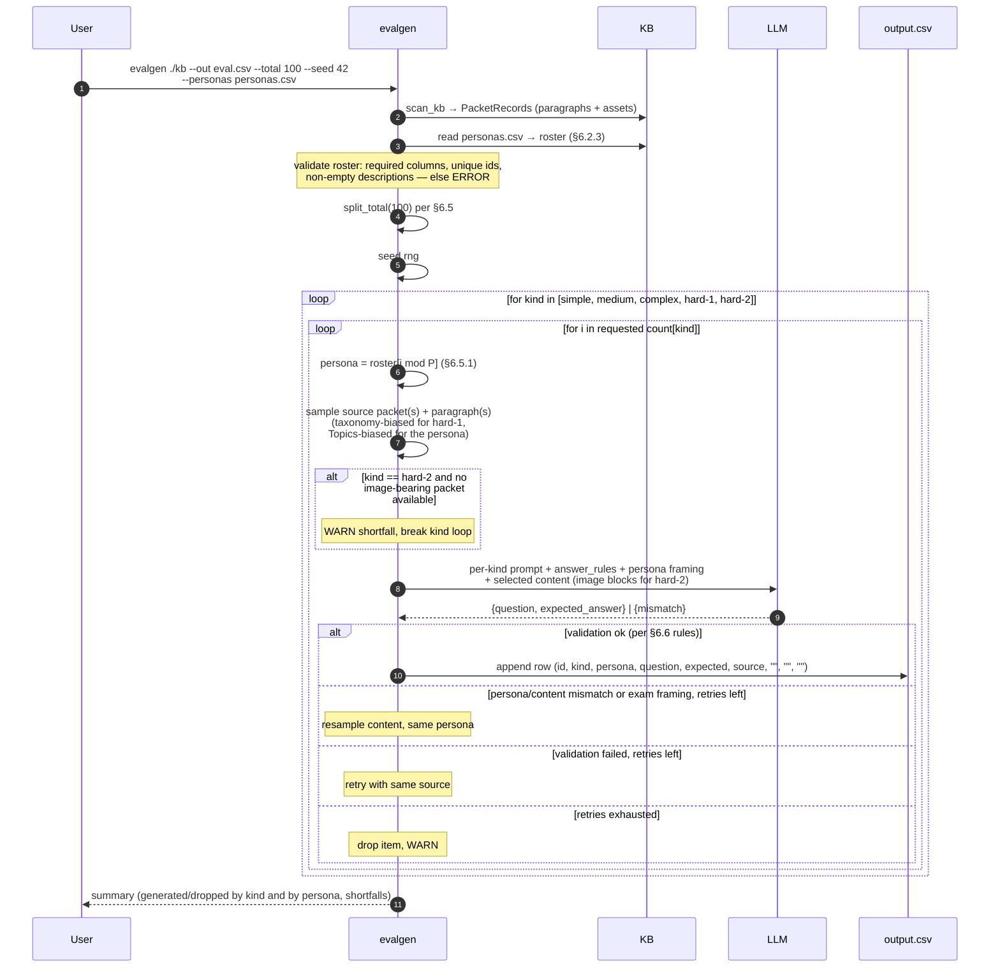
```mermaid
sequenceDiagram
    autonumber
    participant U as User
    participant CLI as evalgen
    participant FS as KB
    participant LLM as LLM
    participant CSV as output.csv

    U->>CLI: evalgen ./kb --out eval.csv --total 100 --seed 42<br/>--personas personas.csv
    CLI->>FS: scan_kb → PacketRecords (paragraphs + assets)
    CLI->>FS: read personas.csv → roster (§6.2.3)
    Note over CLI: validate roster: required columns, unique ids,<br/>non-empty descriptions — else ERROR
    CLI->>CLI: split_total(100) per §6.5
    CLI->>CLI: seed rng

    loop for kind in [simple, medium, complex, hard-1, hard-2]
        loop for i in requested count[kind]
            CLI->>CLI: persona = roster[i mod P] (§6.5.1)
            CLI->>CLI: sample source packet(s) + paragraph(s)<br/>(taxonomy-biased for hard-1,<br/>Topics-biased for the persona)
            alt kind == hard-2 and no image-bearing packet available
                Note over CLI: WARN shortfall, break kind loop
            end
            CLI->>LLM: per-kind prompt + answer_rules + persona framing<br/>+ selected content (image blocks for hard-2)
            LLM-->>CLI: {question, expected_answer} | {mismatch}
            alt validation ok (per §6.6 rules)
                CLI->>CSV: append row (id, kind, persona, question, expected, source, "", "", "")
            else persona/content mismatch or exam framing, retries left
                Note over CLI: resample content, same persona
            else validation failed, retries left
                Note over CLI: retry with same source
            else retries exhausted
                Note over CLI: drop item, WARN
            end
        end
    end
    CLI-->>U: summary (generated/dropped by kind and by persona, shortfalls)
```

---

# Part 7 — The `evalrun` CLI Tool

## 7.1 Purpose

`evalrun` executes the question set produced by `evalgen` (Part 6) against a **live** chatbot backend and scores each answer with an LLM-as-judge. It closes the loop that `evalgen` deliberately leaves open (§6.11): where `evalgen` produces `(question, expected_answer)` pairs and stops, `evalrun` runs the agent, captures `actual_answer`, judges it against `expected_answer`, and writes the completed rubric row.

The tool is symmetric with `evalgen` in scope: `evalgen` is a **generator only**, `evalrun` is a **runner and scorer only**. Neither reads or mutates the KB directly. Together they form the KB-owner's regression harness: freeze a KB revision, generate an eval set once (§6.6), then re-run `evalrun` after each agent, prompt, or KB change to detect quality drift.

## 7.2 Input Model

`evalrun` consumes exactly the CSV `evalgen` emits (§6.7):

| Column | Read | Written |
|---|---|---|
| `question_id`     | yes | passed through unchanged |
| `kind`            | yes | passed through unchanged |
| `persona`         | yes | passed through unchanged — used to group the report (§7.8), never sent to the agent |
| `question`        | yes | passed through unchanged |
| `expected_answer` | yes | passed through unchanged |
| `source`          | yes | passed through unchanged (§7.6) |
| `actual_answer`   | no  | **populated** — the chatbot's final answer text |
| `score`           | no  | **populated** — integer `0`–`3` per the rubric (§7.5) |
| `remark`          | no  | **populated** — one-sentence judge justification |

The first six columns are the eval set's identity; `evalrun` treats them as read-only and copies them verbatim into the output. The last three columns are `evalrun`'s work product. Rows whose `actual_answer`, `score`, and `remark` are already populated are re-run by default so re-scoring stays reproducible; `--skip-completed` short-circuits them if the caller wants incremental resumption, and `--from` (§7.3.2) resumes by position instead.

**The input may be a scored output.** Reading a completed CSV back in is how a resumed run inherits what the interrupted one achieved: the last three columns are input to `--from` and `--skip-completed`, and output to everything else. Nothing distinguishes a file `evalgen` wrote from one `evalrun` wrote except whether those columns are populated.

## 7.3 Invocation

```
$ evalrun <input.csv> --backend-url <url> --out <output.csv> --report <report.html> [options]
```

| Parameter | Required | Description |
|---|---|---|
| `<input.csv>` | yes | Path to the CSV produced by `evalgen` (§6.7). |
| `--backend-url <url>` | yes | Base URL of the chatbot backend. `evalrun` calls `POST <url>/chat` with each question (§7.4). |
| `--out <path>` | yes | Path to the completed output CSV. Overwritten if it exists. |
| `--report <path>` | yes | Path to the HTML report emitted from the promptfoo run (§7.6, §7.8). Overwritten if it exists. |
| `--max-turns <N>` | no | Max chatbot turns per question before giving up (§7.4.3). Default `5`. |
| `--concurrency <N>` | no | Number of questions evaluated in parallel. Default `4`. Bounded by backend rate limits. |
| `--request-timeout <sec>` | no | Per-`/chat` HTTP timeout. Default `60`. |
| `--session-scope <mode>` | no | `per-question` (default, fresh `session_id` per question) or `per-run` (share one `session_id` across all questions). Fresh sessions isolate scoring; shared sessions stress the multi-turn memory path. |
| `--kinds <list>` | no | Comma-separated subset of question kinds to run (e.g. `--kinds simple,hard-2`). Default: all five. |
| `--personas <list>` | no | Comma-separated subset of persona ids to run (e.g. `--personas hr-professional`). Default: every persona present in the input, persona-free rows included. |
| `--from <question_id>` | no | Resume: re-run this row and every row after it, inheriting every earlier row's result from the input file (§7.3.2). |
| `--skip-completed` | no | Skip input rows whose `score` column is already populated. Off by default so re-runs re-score deterministically. |
| `--seed <int>` | no | Seed for the judge LLM's sampling and any tie-breaking in the clarification generator. Fixed seed → reproducible scoring. |
| `--config <path>` | no | Path to `evalrun.toml` (§7.9). Defaults to `./evalrun.toml` if present. |
| `--baseline <path>` | no | A prior `--out` CSV to compare against in the HTML report (§7.8). |
| `--quiet` | no | Suppress the live per-row progress line on stderr (§7.11.1). The run summary on stdout is unaffected. |
| `--verbose` / `-v` | no | Also stream the log to stderr, same JSON-lines shape as the file sink (§7.11). |

Example invocation:

```
$ evalrun kb-eval.csv \
    --backend-url http://localhost:8000 \
    --out kb-eval-scored.csv \
    --report kb-eval-report.html \
    --max-turns 5 --concurrency 4 --seed 42
```

Runs every question from `kb-eval.csv` against `http://localhost:8000/chat` (the `hcag-server` behind the web widget in Part 10, or any compatible backend), writes the scored CSV to `kb-eval-scored.csv`, and emits an HTML summary to `kb-eval-report.html`.

### 7.3.1 Startup — config visibility and LLM preflight

`evalrun` performs four checks before the first row is dispatched, and aborts on any of them. Nothing has been written when they fire.

**1. The backend must answer.** `GET <backend-url>/health` is probed once. A run against a backend that is not up produces a CSV of `[backend_error]` rows, which costs the judge nothing but reads like a catastrophic quality regression.

**2. A missing config is announced.** With no `evalrun.toml`, the run proceeds on built-in defaults and says so on stderr, naming both models. This is the same reasoning as `evalgen` §6.2.2 with more at stake: **every score in the report comes from the judge model**, so which model ran is not a detail to reconstruct afterwards from a log file. A scored CSV carries no record of the judge that produced it.

**3. Prompts are loaded in the parent process.** The classifier, clarifier and judge prompts are registry entries (§2.15.5), resolved against `prompts_dir` once, up front. Loading them here rather than lazily inside each promptfoo worker turns a missing or malformed override into one startup error instead of one identical failure per row — which would otherwise arrive as N `[judge_failed]` remarks and read as model flakiness.

**4. Both eval LLMs are preflighted.** Each configured model gets one real, generation-shaped request whose reply must parse as the JSON the caller expects — exercising env-var resolution, provider dispatch, model-id validity, auth, and output shape.

The preflight matters more here than in `evalgen`, because of *when* the eval LLMs are called. `evalgen` fails on its first generation. `evalrun` spends the entire run against the backend first — every row, every clarification turn, up to `max_turns` each — and only then invokes the judge. A bad judge key is discovered after the whole run has been paid for, and it fails *every* row identically, so the output is not a partial result to salvage but a total loss shaped like a bug report.

Both roles are probed because they are separately configured and commonly separately keyed — a cheap classifier against one provider, a strong judge against another. Every preflight failure is labelled with the role that failed, the credential check included: with two models configured, "which one" is the entire question the message has to answer.

Preflight is per-model and defaults to on; `preflight = false` under either `[classifier.llm]` or `[judge.llm]` skips that one.

### 7.3.2 Resuming a run — `--from`

`--from <question_id>` splits the input in two. Rows **before** that id are inherited: their `actual_answer`, `score` and `remark` are copied from the input file untouched, and the backend and judge are never called for them. Rows **from** that id onward are executed as if the run were fresh, overwriting whatever those columns held.

**What it is for.** A long run dies partway — the backend runs out of quota, a deploy restarts it, a network partition opens. What is left on disk is a file whose first *N* rows are real results and whose remainder is a wall of `[backend_error]`. Re-running the whole thing pays for the first *N* again, and against an LLM judge it also re-rolls them: rows that already passed may come back scored differently, so a re-run is not a resumption but a fresh measurement with the old one discarded.

**Position, not content — which is why it is not `--skip-completed`.** The two answer different questions and both belong.

- `--skip-completed` is **content-addressed**: it skips any row that already carries a score. It is right when the interruption left a clean boundary, and it needs no argument.
- `--from` is **position-addressed**: it re-runs everything at or after a row, whatever those rows look like. It is right when the damage is not visible in the columns — a backend that degraded before it failed outright and returned plausible answers that scored, a judge swapped mid-file, a deploy at a known point in the run. `--skip-completed` preserves exactly those rows, because they look finished.

**File order is the authority.** "Before" means earlier in the input file, not lower by id sort. Ids are strings and a merged eval set (`evalgen --id-prefix`, §6.3) may not sort in execution order, while the CSV's row order is the order `evalrun` executes and preserves (§7.7). The split is at the first row whose `question_id` matches.

**With `--from`, nothing is ever dropped from the output.** The other filters subset a run: `--kinds` and `--personas` narrow which rows execute *and* which rows the output CSV contains. That composition is wrong for a resume, where the point is to end up holding the complete eval set. So when `--from` is given, the output carries every input row, and the filters narrow only which of the rows at or after the split are re-run; everything else is inherited. A resumed run's output is a whole file, ready to be resumed again.

**An id that is not in the file is a startup error**, naming it. Silently starting from row one would re-run the whole set and cost the thing the flag exists to save.

**Inheriting rows that were never run is a `WARN`, not an error.** If rows before the split carry no score, the output has holes: the operator asked to start at row 40 of a file whose first 39 never executed. That is a legitimate thing to want — a deliberate slice — so the run continues, names the count, and reports inherited, executed and empty separately in the end-of-run summary (§7.11).

**A resumed output mixes two measurements, and that has to be said out loud.** The inherited rows were scored by whatever judge ran earlier, against whatever KB and agent revision was deployed then. The current run may use a different judge — §7.3.1 exists because a scored CSV carries no record of which one — and it is certainly running against a backend that has at minimum been restarted. So:

- The **report** (§7.8) states the inherited count in its run summary and marks inherited rows in the row table. A page whose headline pass rate is computed across two runs has to say so on the page, not in a log the reader does not have.
- The **CSV is not marked.** Its nine columns are a contract with `evalgen` (§6.7) and with every eval set already committed, and a tenth column recording a transient property of one run is not worth breaking that for. The consequence is stated rather than hidden: a scored CSV alone cannot tell you it was assembled from two runs, which is one more reason to keep the report beside it.

**A resumed run is a repair, not a baseline.** Where the two halves used different judges or different agent revisions, the honest move is to re-run the set whole once the cause is fixed, and to treat the resumed file as what got the numbers back rather than as the measurement of record.

## 7.4 Execution Loop

For each input row, `evalrun` opens a conversation with the backend and drives it until the chatbot returns a scorable answer or the turn limit is hit. The exchange is captured verbatim so the judge (§7.5) and the report (§7.8) can inspect it.

### 7.4.1 Single-turn exchange

The happy path — one request, one answer:

1. `evalrun` mints a `session_id` per the `--session-scope` policy.
2. `evalrun` sends `POST <backend-url>/chat` with:
   ```json
   { "session_id": "<sid>", "message": "<row.question>", "history": [] }
   ```
3. The backend returns `{ "text": "<answer>", ... }`.
4. `evalrun` classifies the response (§7.4.2). If it is an **answer**, the loop ends: `actual_answer` = `<answer>`.

### 7.4.2 Multi-turn clarification

When the chatbot responds with a clarifying question rather than an answer, the LLM judge fills the user role and the conversation continues:

1. `evalrun` runs a lightweight **response classifier** over the chatbot's reply (a separate small LLM prompt, or a rule when the backend marks clarifications explicitly). Classification categories:
   - `answer` — a substantive response to `question`. Terminate; assign this text to `actual_answer`.
   - `clarify` — a follow-up question or request for information. Continue.
   - `refusal` — an explicit refusal, safety block, or out-of-scope disclaimer. Terminate; assign this text to `actual_answer` (and the judge will score it accordingly).
2. On `clarify`, `evalrun` calls the **judge LLM in clarifier mode**, giving it:
   - The original `question` and `expected_answer` (so the judge knows what facts the user "has").
   - The full exchange so far.
   - A directive to answer the chatbot's clarification the way the real user would, using only information available in `expected_answer` or reasonable defaults. The clarifier is instructed to **never leak** `expected_answer` verbatim.
3. The clarifier's reply is sent as the next user message on the same `session_id`. The full multi-turn transcript is retained for scoring (§7.5) and for the HTML report (§7.8).

The clarifier is the **same LLM** as the judge (§7.9), configured with a distinct prompt. Using one model keeps operator setup minimal and makes clarification style consistent across runs.

### 7.4.3 Turn limit and termination

`--max-turns` bounds the loop (default `5`, counting one user + one assistant as one turn). When the limit is reached without an `answer` classification, the loop ends and `actual_answer` is set to a synthesized string of the form:

```
[max_turns_exceeded] last_response=<final chatbot reply verbatim>
```

The `remark` written by the judge then reflects why scoring proceeded on an unresolved exchange (§7.5). This preserves the failure signal — a chatbot that spirals into endless clarifications scores poorly rather than crashing the run.

Additional termination conditions:

| Condition | Behavior |
|---|---|
| Backend HTTP error after retries exhausted | `actual_answer = [backend_error] <status> <body>`; judge scores it as `0`. |
| Backend timeout after retries exhausted | `actual_answer = [backend_timeout]`; judge scores it as `0`. |
| Response classifier fails to categorize (rare) | Treated as `answer` — captured verbatim and passed to the judge. |

## 7.5 LLM-as-Judge Scoring

Once the exchange is complete, `evalrun` invokes the judge LLM once per row with:

- `question`
- `expected_answer`
- **What the chatbot answered** — see *Scope* below
- The full multi-turn transcript when clarification occurred (§7.4.2), so the judge can see who drove the exchange.
- The scoring rubric (below), fixed and identical for every row. It is the `eval.score` prompt (§2.15.5) — a Markdown file like every other model-facing string, overridable per-KB through `prompts_dir` without touching Python.

**Scope — the exchange, not the last reply.** `[judge] scope` selects what is scored:

| `scope` | What the judge is given | When |
|---|---|---|
| `conversation` *(default)* | Every reply the chatbot made, in order, labelled `[part N of M]` when there is more than one | An agent that answers in parts |
| `final` | Only the reply the classifier called an `answer` | Reproducing a benchmark taken before this option existed |

The default changed because the agent's own answering doctrine changed. §2.7 has it delivering an answer in 50–80 word parts across several turns and handing the user the next move each time; under `final`, a complete four-part answer would be scored on its fourth part and marked down for omitting the first three. That measures pacing, not substance. The rubric is told the same thing in as many words: score the parts' combined content, and treat staged delivery as a deliberate style rather than an omission.

Two properties this must not lose, both asserted by tests:

- **A hard failure is still a hard failure.** `[backend_error]`, `[backend_timeout]`, `[clarifier_failed]` and `[max_turns_exceeded]` live in `actual_answer` rather than in a chatbot turn, so they are handed to the judge verbatim under either scope and keep scoring `0`. Reassembling a `max_turns_exceeded` row out of its partial replies would launder a failed run into a passing answer.
- **Who drove the exchange still counts.** The rubric now distinguishes the two multi-turn shapes it used to score alike: the chatbot asking a clarifying question, or offering the next part and being taken up on it, is the chatbot working as designed and is not penalised; the *user* having to steer — repeating themselves, correcting a wrong turn, dragging out what should have been offered — still weighs against the score. Content the chatbot never produced is missing however many turns it had.

**Known interaction — the loop can stop before the answer is complete (§7.4).** The conversation ends as soon as the classifier calls a reply an `answer`, and a first part is substantive enough to be classified that way. When it ends with an offer ("Do you want the fees as well?") the classifier usually reads it as `clarify`, the clarifier takes it up, and the remaining parts follow — but that is a fortunate reading of a prompt written for a different purpose, not a guarantee. Judging the whole exchange fixes how the parts are *scored*; it does not make the loop ask for parts the chatbot never offered. Closing that properly needs a `partial` outcome in `eval.classify` (§7.4.2), which is not built.

Rubric — the judge must return exactly one of these integers:

| Score | Meaning |
|---|---|
| `0` | **Wrong and misleading answer.** Factually incorrect, hallucinated, or would mislead the user. Also assigned to hard failures (backend errors, refusals on in-scope questions, `[max_turns_exceeded]`) — see *Scope* on why these bypass reassembly. |
| `1` | **Partially correct, but missing key points.** Contains no outright errors, but omits information the expected answer identifies as essential. |
| `2` | **Partially correct, and includes the key points.** Covers the essential information but adds noise, extraneous detail, or minor imprecision. |
| `3` | **Accurate and comprehensive answer.** Substantively equivalent to `expected_answer`; a reasonable user would consider the question fully answered. |

The judge's structured output is `{ "score": <0|1|2|3>, "remark": "<one-sentence justification>" }`. `evalrun` writes `score` and `remark` into their columns unchanged. If the judge returns malformed output past the retry cap (§7.9), the row's `score` is left empty and `remark` is set to `[judge_failed] <reason>` — never a fabricated numeric score.

The judge is deliberately **stateless per row**: it never sees another question's answer or score. This keeps scoring order-independent and lets `--concurrency` fan out safely.

The classifier (§7.4.2) and clarifier (§7.4.2) are the registry's `eval.classify` and `eval.clarify`. All three render through `string.Template`, which is not incidental: these prompts instruct the model to reply with a literal JSON object, so their text contains `{"score": 0 | 1 | 2 | 3, ...}` and `{"category": "answer" | "clarify" | "refusal"}`. Under `str.format` every one of those braces is a substitution site and the render raises before producing a character — the precise failure §2.15 gives as the reason the whole system reserves only `$`.

## 7.6 Test Harness (promptfoo)

`evalrun` is implemented on top of [promptfoo](https://www.promptfoo.dev/) — each CSV row becomes one promptfoo test case, and promptfoo drives the parallel execution and retry policy. What it buys is process orchestration: concurrent test execution with a stable, well-tested rate limiter, and a worker model that isolates one row's crash from the rest of the run.

**What it does not do is score or report.** Both live in HCAG:

- **Scoring happens inside the provider**, not as a promptfoo `llm-rubric` assertion. By the time `call_api` returns, the row has already been judged (§7.5) and the score rides back in `metadata`. The multi-turn loop (§7.4) is the reason: an assertion sees one prompt and one response, but a row's score depends on the whole transcript — how many clarifications the chatbot needed, and whether the user had to lead it. That is not expressible as an assertion over a single output.
- **The HTML report is rendered by HCAG** (`render_report`, §7.8), not by `promptfoo view`. The per-kind panels, the score histogram, and the `--baseline` comparison are all shaped by the five question kinds of §6.4, which promptfoo has no concept of.

The generated `promptfooconfig.yaml` is deliberately minimal: one provider (our Python file), one prompt (`{{question}}`), one test per row, no assertions. Concurrency and output path go on the CLI rather than in the YAML, because promptfoo's YAML surface for those has moved across versions while the flags have stayed put.

The promptfoo integration is an implementation detail — the CLI surface, input CSV schema, and output CSV schema are stable. The mapping is:

| `evalrun` concept | promptfoo concept |
|---|---|
| Input CSV row | `test` |
| `question` | rendered into the `prompt` sent to the provider |
| `POST /chat` conversation loop (§7.4) | a custom promptfoo `provider` that speaks the `{ session_id, message, history[] }` protocol and returns the final `actual_answer` |
| Multi-turn clarification (§7.4.2) | handled inside the provider before returning — promptfoo sees one prompt → one final response |
| LLM-as-judge scoring (§7.5) | performed inside the provider before it returns; the score and remark ride back in the result's `metadata` |
| Per-kind breakdown (§7.8) | promptfoo test `metadata` carries `kind` and `question_id`; the breakdown itself is computed by HCAG from the completed rows |
| HTML report | rendered by HCAG from the merged rows (§7.8) — promptfoo's own report is not used |
| Live progress (§7.11.1) | not promptfoo's; the provider reports per row and the parent renders |

`evalrun` writes the completed CSV itself (§7.7) rather than deriving it from promptfoo's native output — CSV round-tripping is part of the tool's contract with `evalgen`, and decoupling it from promptfoo's output format shields callers from harness changes.

`source` (§6.7.1) is carried through untouched: `evalrun` reads it, writes it back, and never uses it to answer. It is provenance for a human reviewing a row, and feeding it to the agent would make the eval measure retrieval-with-hints rather than retrieval. It is absent from the promptfoo test `vars` for that reason — the prompt is `{{question}}` alone, so provenance cannot reach the model even by accident. Scoring mutates the input rows in place rather than rebuilding them from the harness's output, so the column survives a scored run without any merge logic having to know about it.

`persona` (§6.7.2) is carried through the same way and is likewise absent from the promptfoo test `vars`. The reason is sharper here than for `source`: the persona is already expressed in the question's wording, which is the entire point of generating it in character, and passing the role separately would tell the agent who is asking before it has to work that out from the words — turning a test of whether the agent understands an HR officer's phrasing into a test of whether it can follow a label.

**`source` and `persona` are both optional on input.** Eval sets generated before provenance existed have seven columns, and ones generated before personas have eight; refusing either would strand every eval set already in use, so a missing column reads as empty throughout. Because `evalrun` always *writes* the full schema, reading an older file and writing it back upgrades it in place — the columns appear, empty, and fill in on the next `evalgen` run against a provenance-carrying KB and a persona roster. It is also why columns are matched by header name (§6.7): the same tool must read seven-, eight-, and nine-column files.

## 7.7 Output — Completed CSV

`evalrun` writes a CSV to `--out` with the same 9-column schema as the input (§6.7). Columns `question_id`, `kind`, `persona`, `question`, `expected_answer`, and `source` are copied verbatim from the input row. Columns `actual_answer`, `score`, and `remark` are populated per §7.4 and §7.5.

Row-level rules:

- **Row order is preserved.** Even under `--concurrency > 1`, rows are emitted in input order so `diff` on two run outputs is meaningful.
- **Same encoding as `evalgen`.** UTF-8 with a byte-order mark (§6.7), LF line endings, RFC 4180 quoting, header row always present. Preserving the mark here is what carries the property through a round trip: an eval set that survives generation only to lose its punctuation at scoring time is no better off, and the scored CSV is the one a reviewer opens most.
- **Never partial.** `evalrun` writes the output CSV atomically at the end of the run (temp file + rename). A crash mid-run leaves the previous output untouched, which is what makes the interrupted run's file worth resuming from: it is the last complete write, not a half-written one. Recover it with `--from` (§7.3.2) or `--skip-completed`.
- **A resumed run writes the whole input back.** With `--from`, inherited rows are emitted in their original positions with their original `actual_answer`, `score` and `remark`, so the output is a complete eval set rather than the slice that was re-run (§7.3.2).
- **Score column is integer or empty.** Never a string, never a float. Empty means the judge failed for that row (§7.5); `remark` explains why.

Example (header + three rows, one of each outcome shape):

```csv
question_id,kind,persona,question,expected_answer,source,actual_answer,score,remark
q-0001,simple,hr-professional,"How long do we have to cancel a pass after someone resigns?","...",https://...,"Within one week of the last day of employment.",3,"States the cancellation window correctly."
q-0007,medium,prospective-pass-holder,"My offer is $5,600 and I turn 32 next month — is that enough for an EP?","...",https://...,"Yes, $5,600 meets the Employment Pass minimum.",1,"Quotes the entry-level figure without the age and sector conditions that decide whether it applies."
q-0021,hard-2,hr-professional,"Is the salary bar higher for our trading desk than for our engineering roles?","...",https://...,"[max_turns_exceeded] last_response=""Which sector do you mean?""",0,"Chatbot never produced an answer within the turn limit."
```

`expected_answer` is elided for width; each is several sentences per §6.4.0. Row `q-0007` is the failure §6.4.6 exists to catch — the persona narrowed the question to one person's case and the agent replied with the headline number instead of the conditions that decide whether it applies. An eval set whose reference answer was equally terse would have scored that a 3.

## 7.8 Output — HTML Report

`evalrun` emits an HTML report to `--report` generated by promptfoo's report renderer, extended with per-kind summary panels. The report includes:

- **Run summary.** Total questions, per-kind counts, overall pass rate (fraction scoring `≥ 2`), mean and median score, wall-clock elapsed, backend URL, seed, model IDs (chatbot + judge). When the run resumed from `--from`, it also states how many rows were **inherited** rather than executed, because every headline figure on the page is then computed across two runs made at different times, possibly by different judges (§7.3.2).
- **Inherited rows are marked** in the row-level table and excluded from nothing: they count toward every figure, which is exactly why they are labelled. A reader comparing two reports needs to see that half of one was measured a day earlier.
- **Per-kind breakdown.** One panel each for `simple`, `medium`, `complex`, `hard-1`, `hard-2` showing count, mean score, score histogram (0/1/2/3 bars), and pass rate. Enables at-a-glance drift detection — a `hard-1` regression tells you retrieval selection broke; a `hard-2` regression tells you multimodal loading broke, mirroring the signal design in §6.4.
- **Per-persona breakdown.** The same panel shape as the per-kind one, keyed on `persona` (§6.7.2), shown only when the input carries personas. This is the view the roster was built for: an overall pass rate that looks healthy while one role's rows sit a point lower says the agent handles the vocabulary of the KB's authors and not that of half its users — a phrasing and retrieval problem, not a knowledge gap, and invisible in every other panel on the page. Rows with an empty `persona` are grouped under a single *unattributed* entry rather than dropped.
- **Persona × kind grid** when both axes are populated: mean score per cell. It separates the two readings of a weak persona — low across every kind means that role's phrasing is not being retrieved against, low only on `complex` and `hard-1` means that role simply asks harder questions.
- **Score distribution histogram** across all kinds.
- **Row-level table** — every question with its score and the judge's remark, filterable by kind and by score bucket. The question and answer columns clip to one line; the remark column wraps to three, because a remark ellipsised to a single line cannot be read and it is the reason the row scored what it did. Every clipped cell carries its full text as a `title`, so hovering reads it without expanding.
- **Expandable detail row** — the full record of one scored question, and the place where nothing is clipped: **question, expected answer, actual answer, the judge's remark (labelled with the score it justifies), and the multi-turn transcript.** A row with no remark says so rather than rendering an empty block, which distinguishes "the judge said nothing" from "the report dropped it". The detail cell spans every column of the table, including the `--baseline` Δ column when present — one short and the expanded block stops before the table's right edge.
- **Comparison bar** at the top when `--baseline <prior-output.csv>` is passed: side-by-side per-kind pass rates and a delta column, so regressions vs. a committed baseline are immediately visible.
- **Regenerable and self-contained.** Single `.html` file — inlined CSS/JS, no external assets, safe to commit or attach to a PR.

The report and the completed CSV are the two deliverables of a run. Both are always written when the run completes; a crash before completion leaves the previous versions of both untouched (§7.7).

## 7.9 Configuration

`evalrun` reads an optional `evalrun.toml`. All values are overridable by CLI flags (§7.3):

```toml
# Operator prompt overrides (§2.15.2), resolved per prompt against the copies
# packaged with hcag. Drop in `eval/score.md` alone and the classifier and
# clarifier keep their packaged text.
prompts_dir = "./prompts"

# Chatbot under test — the backend `evalrun` calls.
[backend]
url             = "http://localhost:8000"
chat_path       = "/chat"           # POST endpoint under `url`
request_timeout = 60                # seconds
retries         = 2                 # per-request retries on 5xx / timeouts
session_scope   = "per-question"    # per-question | per-run

# Multi-turn loop (§7.4).
[loop]
max_turns = 5

# Response classifier — small LLM prompt that decides answer / clarify / refusal.
[classifier.llm]
provider    = "anthropic"
model       = "claude-haiku-4-5-20251001"
api_key_env = "ANTHROPIC_API_KEY"
preflight   = true                        # abort at startup if unreachable (§7.3.1)

# LLM-as-judge (§7.5) and clarifier (§7.4.2) — same provider, distinct prompts.
[judge.llm]
provider          = "anthropic"
model             = "claude-opus-4-7"     # scoring benefits from a strong model
api_key_env       = "ANTHROPIC_API_KEY"
max_tokens        = 512
preflight         = true

[judge]
retries           = 2                     # on malformed structured output
scope             = "conversation"        # score the whole exchange | "final" = last reply only (§7.5)

# Execution.
[run]
concurrency = 4
seed        = 42

# Reporting.
[report]
title    = "HCAG evalrun — <kb-name>"
baseline = ""                             # optional path to a prior --out CSV

[log]
file_path = "./evalrun.log"
level     = "INFO"
```

There is no per-role `prompt_path` setting. The three prompts are registry entries and are overridden the way every prompt in the system is overridden — by placing a file at the matching path under `prompts_dir` (§2.15.2). A bespoke path per role would be a second override mechanism for the same job, and the one an operator already knows would be the one that does not work here.

Local model support mirrors `evalgen` (§6.8): `provider = "ollama"` or `"llamacpp"` with a local `endpoint` runs classification, clarification, and scoring without cloud credentials. Judge quality bounds `evalrun` quality — the same guidance as `evalgen`'s generation-quality note applies.

## 7.10 Failure Modes

| Condition | Behavior |
|---|---|
| `<input.csv>` missing or malformed | ERROR at startup — non-zero exit. |
| Backend URL unreachable at run start (`GET /health` probe fails) | ERROR at startup — non-zero exit, no partial output written. |
| A prompt file is missing, empty, or has an invalid `$` placeholder | ERROR at startup (§7.3.1) — raised once in the parent, not per row. |
| Classifier or judge LLM unreachable at run start (preflight, §7.3.1) | ERROR at startup — non-zero exit, labelled with the failing role. |
| No `evalrun.toml` found | WARN at startup — proceeds on defaults, naming both models on stderr. |
| Backend returns 5xx on a single row past retries | Row's `actual_answer = [backend_error] ...`, judge scores it, run continues. |
| Backend times out on a single row past retries | Row's `actual_answer = [backend_timeout]`, judge scores it, run continues. |
| Judge LLM returns malformed structured output past `retries` | Row's `score` left empty, `remark = [judge_failed] <reason>`; run continues. |
| Clarifier fails past retries | Loop terminates as if `max_turns` reached; row scored per §7.4.3. |
| `--kinds` filter matches zero rows | ERROR at startup — nothing to run. |
| `--from <id>` names a `question_id` not in the input | ERROR at startup, naming it. Starting from row one instead would re-run the whole set and cost exactly what the flag exists to save (§7.3.2). |
| `--from` inherits rows that carry no score | WARN naming the count — the output has holes. Legitimate for a deliberate slice, so the run continues and the summary reports inherited, executed and empty separately. |
| `--out` or `--report` path not writable | ERROR at startup — fail fast rather than partial write. |
| `--baseline` file schema mismatch | ERROR at startup — the report can't render a comparison. |

If any `ERROR`-level event fires, `evalrun` exits with a non-zero status. Per-row `WARN`s (backend errors, judge failures) do not affect exit status but are surfaced in the end-of-run summary and in the report.

## 7.11 Observability (CLI)

`evalrun` writes a JSON-lines log to the path in `[log]` config (default `./evalrun.log`), matching the format used by the runtime (§2.11.3), `hcag` (§3.9), `crawl` (§4.7), and `evalgen` (§6.10):

- `INFO`: run start (input path, row count, per-kind counts, backend URL, resolved model IDs, concurrency, seed, and — when resuming — the `--from` id with the inherited and executed counts it resolves to), per-row summary (`question_id`, `kind`, turn count, wall-clock elapsed, chatbot tokens, judge tokens, final `score`), run end summary (per-kind mean scores and pass rates, inherited / executed / empty counts, wall-clock elapsed).
- `DEBUG`: full multi-turn transcripts per row, full judge prompt + response, classifier decisions, clarifier prompts + responses.
- `WARN`: backend errors, backend timeouts, judge malformed outputs, clarifier failures, `[max_turns_exceeded]` rows, rows filtered out by `--skip-completed`, and — on a resumed run — inherited rows that carry no score (§7.3.2).
- `ERROR`: startup failures — unreadable input, unwritable output, unreachable backend, empty kind filter.

If `OTEL_EXPORTER_OTLP_ENDPOINT` is set, spans (`eval.run`, `eval.row`, `eval.chat_turn`, `eval.judge`, `eval.clarify`) are exported — symmetric with §2.11, §3.9, §4.7, and §6.10.

### 7.11.1 Live progress

`evalrun` hands the run to a promptfoo subprocess and consumes its results only at the end. Without a progress channel that makes the CLI silent for the whole run — commonly half an hour at 100 rows — during which **a slow eval and a wedged one are indistinguishable**. That ambiguity is the real cost: not the missing entertainment, but having no basis to decide whether to keep waiting or kill it, and no way to notice in minute two that the backend is returning errors on every row.

The parent process cannot observe the loop directly: promptfoo owns it and fans out to `--concurrency` workers. But our provider (§7.6) is what every worker calls, once per row, and by the time it returns it knows the question, the kind, the judge's score and the row's wall-clock. So **the workers report and the parent renders**.

The channel is an append-only JSON-lines file whose path reaches the workers in `HCAG_EVAL_PROGRESS` — the same environment handoff `HCAG_EVAL_CONFIG_JSON` already uses. A file rather than a pipe, because the workers are processes promptfoo spawns and we never hold their stdout; a pipe with nobody draining it deadlocks once a buffer fills, which would look exactly like the hang this feature exists to rule out. A single `write()` of one line under `O_APPEND` does not tear, so concurrent workers interleave lines safely.

While promptfoo runs, the parent polls that file once a second and renders one line to stderr:

```
running 100 row(s) — waiting for the first result
42/100 rows · mean 2.14 · 3 unscored · 4m18s elapsed · ~6m07s left · last q042
```

Design points, each answering a way the display could mislead:

- **Unscored rows are counted, never averaged in.** A `[judge_failed]` row has no score; folding it in as a `0` would report a quality collapse where there is an infrastructure problem. It gets its own counter, so a run whose judge key expired mid-way is visible as it happens.
- **The ETA is a linear extrapolation from completed rows**, and is labelled `~`. It is wrong early and honest later; rows vary by kind and by how many clarification turns they take.
- **Before the first row completes it says so**, rather than showing `0/N` with an ETA computed from no data.
- **stderr, not stdout.** Progress is transient status; stdout carries the run summary. Same split as `crawl` (§4.7.1), and it keeps `evalrun ... > summary.json` clean.
- **Non-TTY output is append-only.** A carriage return into a CI log or a file produces one unreadable mega-line, so when stderr is not a terminal the line is reprinted periodically instead of rewritten in place.
- **Reporting is best-effort.** `emit` swallows every error: a row that scored must not fail because it could not announce that it scored.
- **`--quiet` suppresses it**, symmetric with `crawl`.

`Ctrl-C` terminates the promptfoo child rather than orphaning it. An abandoned run keeps calling the backend and spending judge tokens, and the operator who interrupted has already said they want it to stop.

**Where the progress goes.** Three destinations, all fed from the same worker events, so they cannot disagree:

| Destination | Content | When |
|---|---|---|
| `<tempdir>/progress.jsonl` | Raw events, one JSON object per row | Always. An internal channel inside the run's temp directory, deleted with it — not an artifact, and not a path to depend on. |
| stderr | The rendered aggregate line | Unless `--quiet` |
| The log file (`[log].file_path`) | One `eval.row.done` per row: `question_id`, `kind`, `score`, `turns`, `elapsed_ms` | Always, at `INFO` |

The per-row records are the reason the transient display can stay a single line. Someone watching wants one number that moves; someone debugging afterwards wants every row, and the log already exists for that. `--verbose` mirrors the log to stderr in its JSON-lines shape (§7.11), so a run started with `-v` shows both: the aggregate line for the human and the per-row records for the file. Neither is a separate code path — the events are emitted once and fan out.

## 7.12 Non-Goals

- **Generating questions.** `evalrun` never fabricates test items; the input CSV is the authority. Curation is `evalgen`'s job (Part 6) and human review (§6.11).
- **Editing the reference answer.** `expected_answer` is treated as ground truth. If it is wrong for a given KB revision, fix the source and re-run `evalgen`; `evalrun` does not rewrite the column.
- **Running the KB or the agent directly.** `evalrun` only speaks to the backend over `POST /chat`. It does not import `AgentRuntime`, does not touch the KB, and does not care whether the backend is `hcag-server` (the widget's backend, Part 10), a mocked stub, a different agent, or a hosted service — the contract is the HTTP endpoint alone. This keeps `evalrun` usable as a black-box regression harness against any chatbot that speaks the same protocol.
- **CI orchestration or threshold enforcement.** `evalrun` reports scores; it does not fail the CI job on a pass-rate drop. Callers wire the exit-code policy they want on top of the completed CSV (e.g., a wrapper script that parses the mean score per kind and gates a PR).
- **Adversarial or safety evaluation.** Scoring is grounded strictly in `expected_answer`. Prompt-injection tests, jailbreak resistance, and toxicity checks are separate concerns and out of scope.

## 7.13 Sequence Diagram

Whole-run view. `evalrun` writes a promptfoo config + JSON-serialized `EvalConfig` into a tempdir and hands off concurrent per-row execution to `npx promptfoo eval`. Each row's provider spawns the multi-turn conversation loop (§7.4), classifies each chatbot reply, drives clarifications via the judge LLM when the reply isn't a real answer, and — once an answer is captured — runs the judge one final time to score against `expected_answer`. The runner then atomically writes the completed CSV and renders the HTML report.

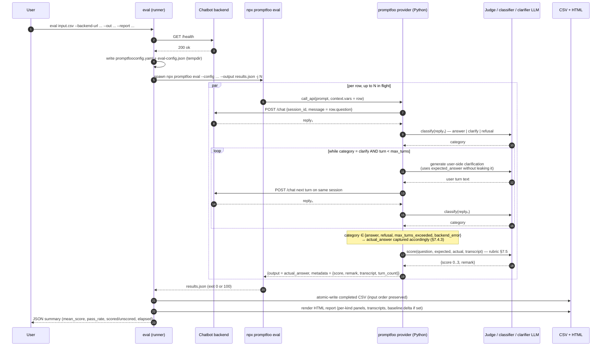
```mermaid
sequenceDiagram
    autonumber
    participant U as User
    participant CLI as eval (runner)
    participant Bk as Chatbot backend
    participant PF as npx promptfoo eval
    participant PY as promptfoo provider (Python)
    participant J as Judge / classifier / clarifier LLM
    participant OUT as CSV + HTML

    U->>CLI: eval input.csv --backend-url ... --out ... --report ...
    CLI->>Bk: GET /health
    Bk-->>CLI: 200 ok
    CLI->>CLI: write promptfooconfig.yaml + eval-config.json (tempdir)
    CLI->>PF: spawn npx promptfoo eval --config … --output results.json -j N

    par per row, up to N in flight
        PF->>PY: call_api(prompt, context.vars = row)
        PY->>Bk: POST /chat {session_id, message = row.question}
        Bk-->>PY: reply₁
        PY->>J: classify(reply₁) — answer | clarify | refusal
        J-->>PY: category
        loop while category = clarify AND turn < max_turns
            PY->>J: generate user-side clarification<br/>(uses expected_answer without leaking it)
            J-->>PY: user turn text
            PY->>Bk: POST /chat next turn on same session
            Bk-->>PY: replyₙ
            PY->>J: classify(replyₙ)
            J-->>PY: category
        end
        Note over PY: category ∈ {answer, refusal, max_turns_exceeded, backend_error}<br/>→ actual_answer captured accordingly (§7.4.3)
        PY->>J: score(question, expected, actual, transcript) — rubric §7.5
        J-->>PY: {score 0..3, remark}
        PY-->>PF: {output = actual_answer, metadata = {score, remark, transcript, turn_count}}
    end

    PF-->>CLI: results.json (exit 0 or 100)
    CLI->>OUT: atomic-write completed CSV (input order preserved)
    CLI->>OUT: render HTML report (per-kind panels, transcripts, baseline delta if set)
    CLI-->>U: JSON summary (mean_score, pass_rate, scored/unscored, elapsed)
```

---

# Part 8 — The `rag` CLI Tool

## 8.1 Purpose

`rag` indexes a knowledge-base folder into a local [LanceDB](https://lancedb.github.io/lancedb/) store, producing an on-disk index that supports **hybrid retrieval** — dense vector search over LLM embeddings combined with keyword (BM25-style) search over the same text — from a single query. It is a companion to HCAG, not a replacement for it: the HCAG agent already navigates the taxonomy and loads whole packets, but many workflows also want flat retrieval over the same source material — for eval baselines, ad-hoc grep, or a Flat-RAG fallback (§1.3.3) that the caller composes on top of HCAG (§1.3.5).

The tool is a **one-shot indexer**. It does not serve queries, does not stand up an HTTP endpoint, and is not required at runtime. Downstream code — a notebook, a retriever service, or a comparison harness — opens the resulting LanceDB folder directly and queries it.

## 8.2 KB Input Model

`rag` operates on a **raw** KB folder — the same layout `hcag` (§3.4) and `crawl` (§4) produce. It intentionally does **not** require the KB to have been normalized: `compiled.md` files may or may not exist, and the tool works on either shape.

Two exclusion rules govern what gets indexed:

1. **Skip `compiled.md` files.** These are HCAG-assembled artifacts (§3.4.3): a folder's own source markdown concatenated into one file, plus, at the root, the KB catalog. Indexing them alongside the underlying source would double-count every fact and skew retrieval scores — and at the root it would index a table of LLM-written descriptions as though it were source text. Root `compiled.md` and every folder's `compiled.md` (§3.7) are skipped for the same reason.
2. **Skip anything inside an HCAG `assets/` folder.** Per §2.1 and §3.4.6, an `assets/` directory sits alongside a `compiled.md` — it is HCAG's home for the images that folder's content section references. Those images are already indirectly indexed via the folder's `compiled.md` body; letting `rag` re-index them would again double-count.

Everything else under `<kb_root>` is a candidate for indexing — the raw `.md`, `.txt`, and `.pdf` files a taxonomy owner authored, plus any images that live **outside** an HCAG `assets/` folder (loose reference material, source screenshots, diagrams the taxonomy author has not yet folded into a packet). Files whose extension is unknown are skipped with a `DEBUG` log line.

## 8.3 Invocation

```
$ rag --kb <kb_root> [--index <index_dir>] [options]
```

| Parameter | Required | Description |
|---|---|---|
| `--kb <path>` | yes | Path to the KB folder to index. `rag` walks it recursively per §8.4.1. |
| `--index <path>` | no | Path to the LanceDB folder that holds the index. Default: `./local_lancedb`. Created if it does not exist. |
| `--config <path>` | no | Path to `rag.toml` (§8.7). Defaults to `<kb_root>/rag.toml` if present. |
| `--table <name>` | no | LanceDB table name inside the index directory. Default: `kb`. |
| `--recreate` | no | Drop the existing table before indexing. Without this flag, `rag` upserts by `id` — unchanged files are skipped (§8.4.5). |
| `--include-images / --no-include-images` | no | Toggle the image-description pipeline (§8.4.3). Default: `--include-images`. |
| `--log-file <path>` | no | Log file path. Default: `./rag.log`. |
| `--log-level <lvl>` | no | `DEBUG` \| `INFO` \| `WARN` \| `ERROR`. Default: `INFO`. |

Example invocation:

```
$ rag --kb ./kb --index ./local_lancedb
```

Indexes every non-excluded file under `./kb` into a LanceDB table named `kb` inside `./local_lancedb/`. On a second run, only files whose content or path has changed since the last run are re-embedded (§8.4.5).

Equivalent with an explicit table name, a rag.toml, and image indexing disabled:

```
$ rag --kb ./kb --index ./local_lancedb \
      --table support-docs --config ./rag.toml --no-include-images
```

## 8.4 Indexing Pipeline

### 8.4.1 Walk and file classification

`rag` walks `<kb_root>` with a deterministic pre-order traversal (alphabetical within each directory) so a re-run against the same tree produces the same row ordering — this makes `diff`-ing successive index snapshots meaningful.

For each file it classifies against the exclusion rules (§8.2) and the source-kind table:

| Extension | `source_kind` | Handling |
|---|---|---|
| `.md`, `.markdown` | `markdown` | Parsed as Markdown; chunked on heading boundaries (§8.4.2). |
| `.txt` | `text` | Chunked with a fixed sliding window. |
| `.html`, `.htm` | `html` | Reduced to main content with the same extractor `crawl` uses (§4.4.1), then chunked. |
| `.pdf` | `pdf` | Converted to Markdown via the same converter `crawl` uses (§4.4.2), then chunked. |
| `.png`, `.jpg`, `.jpeg`, `.gif`, `.webp` | `image` | Sent through the image-description pipeline (§8.4.3). Skipped entirely when `--no-include-images` is set. |
| anything else | — | Skipped with a `DEBUG` `rag.file.skip_unknown_ext` log line. |

Files that match an exclusion rule (§8.2) are skipped before extension classification and logged at `DEBUG` as `rag.file.skip_packet_md` or `rag.file.skip_hcag_asset` respectively.

### 8.4.2 Text extraction and chunking

For each in-scope textual file, `rag`:

1. Extracts UTF-8 text (via the source-kind-appropriate converter above).
2. Splits into chunks using a **Markdown-aware windowing strategy**: chunks respect heading boundaries and paragraph breaks where possible, and never split inside a fenced code block. The default target is 500 tokens per chunk with a 60-token overlap between adjacent chunks; both are overridable in `rag.toml` (§8.7). Non-Markdown text uses the same target but with a plain sliding window.
3. Emits one index row per chunk (§8.5), carrying:
   - the chunk's byte offset span within the source file,
   - the innermost heading path (for Markdown) as a `headings` array — useful to reconstruct provenance at query time,
   - a stable `id` derived from the file's relative path plus the chunk index (§8.4.5).

**The heading path is prefixed to `text`.** `text` is both the string that gets embedded and the column the FTS index covers (§8.6), and only a document's *first* chunk contains its title — so without this, every later chunk is unreachable by a query naming the document it belongs to. Each chunk's stored text opens with one `Parent > Child` line, which reads as context to the generating model as well as supplying terms to BM25; a trailing component the text already opens with as a Markdown heading is not repeated. Measured over ten document-naming queries against the MOM KB, on-topic hits in the FTS top-8 rose from 35 to 41. It is not a cure for every miss: a query using a name the corpus does not use (`onepass` for "ONE Pass") still matches nothing lexically, since the prefix carries the document's own title and not its aliases.

Note that `text` consequently does not slice out of the source at `char_start:char_end` — it already did not, since a chunk also carries the previous chunk's overlap tail. The offsets locate the chunk's *body* in the source; they are provenance, not a substring contract.

**Empty headings are ignored.** A crawled page can contain a bare `#` with no title. Pushing it would supersede the document's real name with `""` for every chunk that follows, which is how a page titled "Eligibility for the Overseas Networks & Expertise Pass" came to carry `headings = ['', 'Who is eligible']` from its second chunk on.

### 8.4.3 Image description

Images are **indirectly indexed**: `rag` never embeds the raw bytes. Instead, each in-scope image is passed to a multimodal LLM (default: the same provider/model used for the text embeddings' companion LLM, configurable per §8.7) with a fixed description prompt. The prompt asks for:

- a one-sentence caption of the primary subject,
- a short paragraph enumerating visible entities, labels, and any text content in the image (e.g., diagram labels, chart axis titles, screenshot UI copy),
- optional structural notes when the image is clearly a diagram, chart, or state machine (e.g., "state-machine diagram with 4 nodes and 5 labeled transitions").

The returned text is the chunk that gets embedded and stored. Each image produces exactly one row (never chunked further) with `source_kind = "image"`, `image_path` set to the image's path relative to `<kb_root>`, and `text` holding the LLM-generated description. Retrieval consumers can dereference `image_path` to fetch the original bytes when they need to show or re-analyze the image.

If the description call fails past the configured retry cap, the image is dropped with a `WARN` (`rag.image.description_failed`) and no row is emitted for it. The rest of the run proceeds.

### 8.4.4 Embedding and batching

After chunk assembly, `rag` batches chunks into groups (default 32) and calls the configured **embedding provider** to produce dense vectors. The provider is LiteLLM-routed for the same reason as the runtime (§2.13.2, §2.13.8) — no direct vendor SDK imports at the call site. The embedding dimension is discovered from the first response and pinned for the whole run; a subsequent chunk whose vector has a different dimension aborts the run with a clear error (misconfiguration between chunk types).

Batches are dispatched sequentially (not concurrently) by default. The chunking + embedding stages are both CPU-cheap and I/O-bound; the bottleneck is the embedding provider's rate limit, which the caller tunes via `[embedding].batch_size` in `rag.toml` rather than by adding parallelism `rag` cannot rate-limit safely.

### 8.4.5 Idempotency and re-indexing

`rag` is idempotent under repeated invocations against a stable KB:

- Each row's `id` is a stable digest of `(<relative_path>, <chunk_index>, <source_content_hash>)`. Content changes flip the `id`, so old rows for a modified file are naturally superseded rather than mutated in place.
- Without `--recreate`, `rag` **upserts** by `id` and issues a **delete-by-`kb_path`-then-insert** for any file whose current content hash differs from the stored one. Untouched files skip the embed step entirely — the run's cost scales with the size of the diff, not the size of the KB.
- With `--recreate`, the target table is dropped first and every in-scope file is re-embedded. Useful when embedding model or chunk parameters change (§8.7).

**A chunker change needs `--recreate`.** The skip decision compares the *source file's* content hash, so a run against an unchanged KB skips every file and no amount of re-running will apply a change to how chunks are built. Because `--recreate` drops the table before the first embed, verify the embedding credential is present before starting: a run that drops the table and then fails to embed leaves no index behind.

The tool records a `manifest` row per source file containing its content hash, byte size, mtime, and chunk count, so a subsequent run can detect changes without re-reading whole files unnecessarily.

## 8.5 Index Schema

`rag` writes a single LanceDB table (default name `kb`) with a fixed column schema. All chunks — text and image-description — share the same columns; per-kind fields (`image_path`, `headings`) are nullable.

| Column | Type | Description |
|---|---|---|
| `id` | `string` (primary key) | Stable digest of `(kb_path, chunk_index, content_hash)`. Upsert key. |
| `kb_path` | `string` | Path relative to `<kb_root>` (POSIX form). Same file, many chunks. |
| `chunk_index` | `int32` | 0-based position of the chunk within the source file. Always `0` for images. |
| `source_kind` | `string` | One of `markdown`, `text`, `html`, `pdf`, `image` (§8.4.1). |
| `text` | `string` | The chunk text — either the extracted excerpt (for textual chunks) or the LLM-generated description (for images). This is the column embedded into `vector` and FTS-indexed for keyword search (§8.6). |
| `vector` | `fixed_size_list<float32, D>` | Dense embedding of `text`. `D` is discovered from the embedding provider on the first row (§8.4.4) and pinned per table. |
| `char_start`, `char_end` | `int64` | Byte offsets of the chunk inside the source file. `null` for images. |
| `headings` | `list<string>` | Ordered heading path down to the chunk (Markdown/HTML only). e.g. `["Refunds", "Partial refunds"]`. `null` otherwise. |
| `image_path` | `string?` | Path (relative to `<kb_root>`) of the source image. Populated iff `source_kind = "image"`. |
| `token_estimate` | `int32` | Approximate token count of `text` (same estimator as the memory module — §2.5). Useful for budget-aware assembly downstream. |
| `content_hash` | `string` | SHA-256 of the underlying source file's bytes (not the chunk). Used for idempotency (§8.4.5). |
| `metadata` | `string` | JSON blob for anything provider- or run-specific — the description prompt version for images, the chunking parameters used for text, the embedding model ID. Never queried directly; provenance only. |
| `indexed_at` | `timestamp` | UTC timestamp of the row's insertion. |

In addition to the primary table, `rag` writes a `manifest` table with one row per source file: `kb_path`, `content_hash`, `bytes`, `mtime`, `chunk_count`, `source_kind`, `indexed_at`. The manifest lets `rag` decide what changed on a subsequent run (§8.4.5) without scanning the chunk table.

**Indexes created after ingestion:**

- **Vector index** on `vector` (IVF-PQ by default; LanceDB picks parameters from the row count). Enables `table.search(vec)` at query time.
- **FTS (full-text search) index** on `text` (LanceDB's `create_fts_index("text")`). Enables `table.search(query_string).text()` and BM25-style scoring.

Both indexes are refreshed automatically after each `rag` run so downstream queries see a consistent view.

## 8.6 Hybrid Search Semantics

The index is **hybrid-ready** — every row carries both a dense vector and an FTS-indexed text column — but the CLI itself never issues a query; retrieval is a downstream concern. The design is that a consumer opens the LanceDB folder and issues a hybrid search of the form:

```python
import lancedb
db  = lancedb.connect("./local_lancedb")
tbl = db.open_table("kb")
hits = (
    tbl.search(query="how do partial refunds work?", query_type="hybrid")
       .rerank(reranker=lancedb.rerankers.RRFReranker())
       .limit(10)
       .to_list()
)
```

At query time, LanceDB runs both a k-nearest-neighbour vector search and a BM25 keyword search over the same table, then fuses the two ranked lists with a reranker (RRF by default; any `lancedb.rerankers` subclass is compatible). The columns `id`, `kb_path`, `chunk_index`, `text`, `headings`, and `image_path` are the retrieval consumer's contract — everything else (offsets, hashes, metadata) is provenance.

Hybrid search deliberately outperforms either mode alone on the two failure classes flat RAG suffers from (§1.2): pure-lexical queries lose recall on paraphrased content (which vectors catch); pure-vector queries lose precision on rare tokens like IDs, product SKUs, or policy version numbers (which BM25 catches).

## 8.7 Configuration

`rag` reads an optional `rag.toml` (or per-invocation flags):

```toml
[embedding]
provider    = "openai"                       # openai | anthropic | bedrock | ollama
model       = "text-embedding-3-small"       # any LiteLLM-supported embedding model
api_key_env = "OPENAI_API_KEY"
endpoint    = ""                             # for self-hosted / local
batch_size  = 32
dimension   = 1536                           # optional pin; validated against first response

[image]
provider           = "anthropic"             # multimodal LLM for image descriptions
model              = "claude-haiku-4-5-20251001"
api_key_env        = "ANTHROPIC_API_KEY"
prompt_path        = ""                      # override packaged default (§8.4.3)
max_retries        = 2
max_output_tokens  = 400

[chunking]
target_tokens = 500                          # per chunk
overlap_tokens = 60                          # between adjacent chunks
respect_headings = true                      # Markdown-aware boundaries

[index]
table = "kb"                                 # LanceDB table name
# recreate = false                           # equivalent of the --recreate flag

[log]
file_path = "./rag.log"
level     = "INFO"
```

Local model support mirrors `hcag` (§3.6) and `evalgen` (§6.8): `provider = "ollama"` with a local `endpoint` runs both embeddings and image descriptions without cloud credentials, at the cost of index-build quality.

## 8.8 Failure Modes

| Condition | Behavior |
|---|---|
| `<kb_root>` missing or not a directory | ERROR at startup — non-zero exit. |
| `<kb_root>` contains no in-scope files | ERROR — nothing to index; exit non-zero. |
| `--index` path exists but is not a LanceDB folder | ERROR — refuse to write into an unrelated directory. |
| Embedding provider returns a different dimension than the pinned one | ERROR mid-run — pinned dimension is a hard invariant per table (§8.4.4). |
| Embedding call fails for a single batch past retries | WARN, batch dropped; run continues with the next batch. |
| Image description fails past retries | WARN, image dropped; row not emitted (§8.4.3). |
| A single file fails to parse (malformed PDF, unreadable HTML) | WARN, file dropped; run continues. |
| Index directory is not writable | ERROR at startup. |

If any `ERROR`-level event fires, `rag` exits with a non-zero status. `WARN`-level drops do not affect exit status but are surfaced in the end-of-run summary along with the counts of skipped files, dropped chunks, and dropped images.

## 8.9 Observability (CLI)

`rag` writes a JSON-lines log to the path in `[log]` config (default `./rag.log`), matching the format used by the runtime (§2.11.3), `hcag` (§3.9), `crawl` (§4.7), `evalgen` (§6.10), and `evalrun` (§7.11):

- `INFO`: run start (kb root, index path, resolved embedding + image models, pinned dimension), per-file summary (`kb_path`, `source_kind`, chunk count, embed tokens, wall-clock elapsed), run end summary (files scanned / indexed / skipped, chunks written, images described, dropped counts, total wall-clock).
- `DEBUG`: skip decisions with the matched exclusion rule, chunk boundaries and their heading paths, full image-description prompts and responses, embedding batch sizes and per-batch elapsed.
- `WARN`: failed embed batches, failed image descriptions, unparseable files, files skipped for unknown extension when `--log-level DEBUG` is not set (they still log at DEBUG then).
- `ERROR`: startup failures, mid-run dimension drift, unwritable index directory.

If `OTEL_EXPORTER_OTLP_ENDPOINT` is set, spans (`rag.run`, `rag.file`, `rag.chunk_batch`, `rag.embed`, `rag.image.describe`) are exported — symmetric with §2.11, §3.9, §4.7, §6.10, and §7.11.

## 8.10 Non-Goals

- **Serving queries.** `rag` produces an index; retrieval, ranking, and query APIs live in downstream code. Keeping the CLI one-shot means it composes cleanly into batch jobs, evaluation pipelines (Part 7), and notebooks without a long-lived process.
- **Replacing HCAG.** `rag` is a **flat** retrieval layer over the same source content HCAG structures into a taxonomy. Use it as a Flat-RAG fallback (§1.3.3) or as a baseline in eval runs, not as a substitute for the taxonomy-driven agent (§1.3.1).
- **Editing the KB.** `rag` never mutates `<kb_root>`. It only reads. The index directory is the only write target.
- **Cross-KB indexes.** One `rag` invocation indexes one KB into one table. Building a multi-tenant or multi-KB index (with a `tenant_id` column, for instance) is a downstream concern; run `rag` per KB and union the tables at query time if that's what the caller needs.
- **Re-embedding on model change without `--recreate`.** If the embedding provider or model changes between runs, existing rows keep their old vectors — `rag` does not silently mix embedding spaces. Pass `--recreate` (or drop the table manually) to rebuild.

## 8.11 Sequence Diagram

End-to-end index build for a KB that mixes text and images. Every file is manifest-checked so a re-run against a stable tree is a no-op; only the diff pays embedding cost (§8.4.5). LanceDB tables are opened lazily on the first embedded chunk so the pinned vector dimension matches the provider's actual response (§8.4.4).

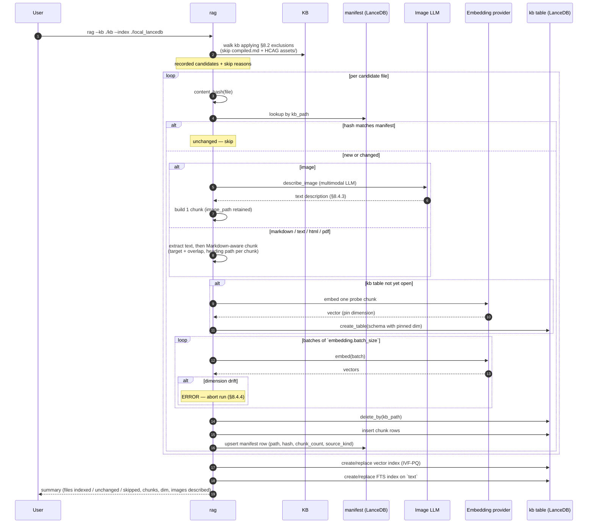
```mermaid
sequenceDiagram
    autonumber
    participant U as User
    participant CLI as rag
    participant FS as KB
    participant M as manifest (LanceDB)
    participant IMG as Image LLM
    participant EMB as Embedding provider
    participant KB_T as kb table (LanceDB)

    U->>CLI: rag --kb ./kb --index ./local_lancedb
    CLI->>FS: walk kb applying §8.2 exclusions<br/>(skip compiled.md + HCAG assets/)
    Note over CLI: recorded candidates + skip reasons

    loop per candidate file
        CLI->>CLI: content_hash(file)
        CLI->>M: lookup by kb_path
        alt hash matches manifest
            Note over CLI: unchanged — skip
        else new or changed
            alt image
                CLI->>IMG: describe_image (multimodal LLM)
                IMG-->>CLI: text description (§8.4.3)
                CLI->>CLI: build 1 chunk (image_path retained)
            else markdown / text / html / pdf
                CLI->>CLI: extract text, then Markdown-aware chunk<br/>(target + overlap, heading path per chunk)
            end
            alt kb table not yet open
                CLI->>EMB: embed one probe chunk
                EMB-->>CLI: vector (pin dimension)
                CLI->>KB_T: create_table(schema with pinned dim)
            end
            loop batches of `embedding.batch_size`
                CLI->>EMB: embed(batch)
                EMB-->>CLI: vectors
                alt dimension drift
                    Note over CLI: ERROR — abort run (§8.4.4)
                end
            end
            CLI->>KB_T: delete_by(kb_path)
            CLI->>KB_T: insert chunk rows
            CLI->>M: upsert manifest row (path, hash, chunk_count, source_kind)
        end
    end

    CLI->>KB_T: create/replace vector index (IVF-PQ)
    CLI->>KB_T: create/replace FTS index on `text`
    CLI-->>U: summary (files indexed / unchanged / skipped, chunks, dim, images described)
```

---

# Part 9 — The RAG Chat Agent (Competing Baseline)

## 9.1 Purpose

The **RAG chat agent** is a second, deliberately simpler answering agent that serves the same `POST /chat` contract as the HCAG `AgentRuntime` (§2) — but uses the flat LanceDB hybrid index produced by `rag` (Part 8) as its retrieval backend instead of navigating a taxonomy. It exists for one reason: **so HCAG can be compared against a serious flat-RAG baseline on the same KB, under the same eval set, on the same wire protocol.**

Without a competing agent, HCAG evaluation is either self-referential (score HCAG vs. HCAG on different prompts) or requires the eval harness to know about two different agent shapes. With the RAG agent:

1. Both agents implement the same `run_turn(user_message) -> str` interface (§9.2).
2. Both agents are served through the same `hcag-server` process (§9.5) — a startup flag picks which one instantiates.
3. `evalrun` (Part 7) scores them identically — the same CSV, the same judge, the same rubric. The only variable is the agent under test.

The RAG agent is **not** intended to beat HCAG on knowledge-heavy tasks (that would defeat HCAG's own purpose per §1.3). It is intended to be a **credible** flat-RAG implementation — good enough that a win for HCAG is a real win, and a loss for HCAG is a real loss and worth investigating.

## 9.2 Component Boundary

The RAG agent lives at `hcag/rag/agent.py`, package-cohesive with the index format it queries. It presents the same public surface as `AgentRuntime`:

```python
class RagAgent:
    def __init__(self, cfg: RagAgentConfig, ...): ...
    def bootstrap(self) -> None: ...
    def run_turn(self, user_message: str) -> str: ...
```

Both `AgentRuntime.run_turn` and `RagAgent.run_turn` take a plain user string and return a plain assistant string; they hold per-instance conversation history so successive calls compose one session. That interface parity is what lets `hcag-server` swap them behind the same HTTP route (§9.5).

Dependencies used by the RAG agent, all already present for `rag` (Part 8):

- **LanceDB** — opens the index directory and executes the hybrid search.
- **LiteLLM** — for both the query embedding call and the final answer LLM call. Provider-neutral, symmetric with §2.13.2.
- **`hcag/rag/schema.py`** — reads the same column contract the indexer writes.

The RAG agent does **not** import anything from `hcag/runtime/` (the HCAG agent) or `hcag/memory/`. The two agents share no per-turn state and no code path beyond the LiteLLM adapter and the logger — this isolation is deliberate so eval comparisons stay clean and a regression in one cannot mask a regression in the other.

## 9.3 Turn Pipeline

Each `run_turn` call is a **stateless retrieval** followed by an LLM generation. Unlike HCAG — which maintains an LRU-ordered active packet set across turns (§2.4) — the RAG agent retrieves fresh chunks for every turn based on the current user message. This is the standard flat-RAG loop and is what a downstream operator would build if they hadn't heard of HCAG.

### 9.3.1 Query embedding

The user message is embedded using the **same embedding provider + model** that indexed the corpus. The RAG agent reads that pair from the LanceDB `manifest` (row's `metadata` blob carries `embed_model`) at bootstrap and hard-fails if the configured `[embedding]` in `rag_agent.toml` disagrees — a query vector from a different space is silently useless, so the mismatch surfaces at startup rather than as a mysterious quality drop.

### 9.3.2 Hybrid retrieval

The agent issues one LanceDB hybrid query per turn (§8.6):

```python
hits = (
    tbl.search(query_text, query_type="hybrid", vector_column_name="vector")
       .rerank(reranker=lancedb.rerankers.RRFReranker())
       .limit(top_k)
       .to_list()
)
```

The reranker fuses the vector KNN result and the BM25 result via reciprocal-rank fusion. `top_k` defaults to `8` (overridable per §9.6) — enough to cover multi-hop answers without blowing the LLM prompt budget in §9.3.4.

Every hit carries the columns fixed in §8.5: `id`, `kb_path`, `chunk_index`, `text`, `headings`, `image_path`, `token_estimate`.

**Query-time vocabulary.** Hybrid insures each leg against the other's weakness — BM25 misses paraphrase, dense retrieval blurs rare exact tokens — but neither leg can bridge a name the corpus never spells. MOM's pages say "ONE Pass" and "Overseas Networks & Expertise Pass" and never "onepass": BM25 matched nothing at all, and a three-word question built on a coined compound gave the embedder too little to separate one pass from the 239 chunks that mention some pass. `[retrieval.aliases]` in `rag_agent.toml` (§9.6) maps what users type to what the corpus spells. Keys match on word boundaries, case-insensitively, and the value is **appended** to the retrieval query rather than substituted, so the user's own wording keeps its weight. The mechanism is general; the vocabulary is data about one KB, so it ships empty.

**The generator has to be told too.** Fixing retrieval alone did not answer the question. With the defining excerpt in context, the model still refused — *"the context does not contain any information about 'onepass'"* — and it was right to under §9.3.3's grounding rule: nothing in the excerpts said that "onepass" IS that pass. The link exists only in the operator's alias map, so a turn whose query was expanded opens its context with a `VOCABULARY` block naming what the question's words refer to, and the system prompt's rule 2 tells the model to follow it into the excerpts. This is grounding, not invention: the names come from a curated file, the facts still come only from the excerpts, and the QUESTION the model answers stays the user's own wording. The measured effect on "what is one pass" is a refusal turning into a cited answer.

### 9.3.3 Chunk assembly

Retrieved chunks are assembled into a single **context block** in three steps:

1. **Deduplicate by `kb_path` + adjacent `chunk_index`.** If two hits are consecutive chunks from the same file, merge them into one span so the LLM sees continuous prose instead of two nearly-duplicated fragments.
2. **Budget-cap by `token_estimate`.** Sum chunk token estimates in rank order; stop when the running total would exceed `max_context_tokens` (default `6000` — leaves room for the user turn, system prompt, and answer within a typical 8k–16k model window). Dropped chunks are logged at `DEBUG`.
3. **Sort survivors by `(kb_path, chunk_index)`.** Presenting them in source order (not rank order) inside the prompt reads better to the LLM and is what a human would do reading the same material.

The result is a list of `(kb_path, headings_path, chunk_text, image_path?)` tuples with a stable, deterministic ordering.

### 9.3.4 Prompt composition

The RAG agent composes a per-turn prompt of this shape:

```
system: <RAG-agent system prompt: answer strictly from the CONTEXT below;
         if the CONTEXT is insufficient, say so; cite kb_path for facts>

user: CONTEXT
      <for each retrieved chunk in source order:>
        [source: <kb_path> § <headings>]
        <chunk_text>
      ---
      QUESTION
      <turn N user_message>

<prior conversation turns interleaved as user/assistant messages, so
 clarifying questions and previous answers stay visible>

user: <the current user_message>
```

Two properties worth calling out explicitly:

- **The system prompt is byte-stable across turns of one session** (it never changes), so it caches under the same rules HCAG relies on (§2.12). The **user turn is not** — the retrieved context changes every turn, which is the RAG loop's fundamental cache-hostile shape and one of the axes on which HCAG outperforms it (§9.4).
- **Image chunks are included as text** (their LLM-generated description from §8.4.3), plus their `image_path` cited alongside `kb_path`. The RAG agent does **not** re-attach image bytes to the LLM call — the whole point of §8.4.3 is that image content is captured as text at index time. Callers who want vision-in-the-loop should use HCAG (which does packet-level multimodal loading per §2.6) or extend the RAG agent to re-attach originals on hit (out of scope here).

### 9.3.5 Sequence diagram

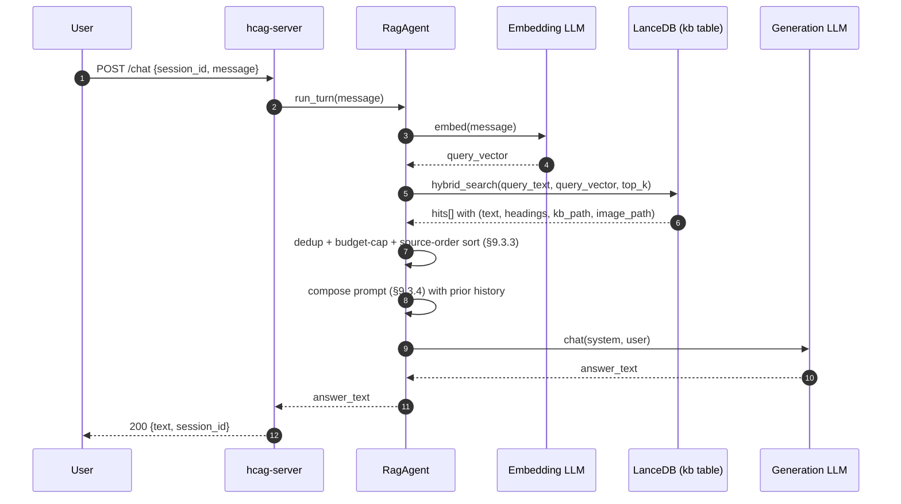
```mermaid
sequenceDiagram
    autonumber
    participant U as User
    participant S as hcag-server
    participant A as RagAgent
    participant E as Embedding LLM
    participant L as LanceDB (kb table)
    participant G as Generation LLM

    U->>S: POST /chat {session_id, message}
    S->>A: run_turn(message)
    A->>E: embed(message)
    E-->>A: query_vector
    A->>L: hybrid_search(query_text, query_vector, top_k)
    L-->>A: hits[] with (text, headings, kb_path, image_path)
    A->>A: dedup + budget-cap + source-order sort (§9.3.3)
    A->>A: compose prompt (§9.3.4) with prior history
    A->>G: chat(system, user)
    G-->>A: answer_text
    A-->>S: answer_text
    S-->>U: 200 {text, session_id}
```

## 9.4 Comparison to HCAG

Both agents answer the same wire question and are scored on the same rubric. What differs is *how* they get to the answer. The table below is the mental model the eval-run operator should carry into every score-diff.

| Axis | HCAG (`AgentRuntime`) | RAG Chat Agent (`RagAgent`) |
|---|---|---|
| Retrieval unit | Whole folder (`compiled.md` + `assets/`) — high-context, coherent | Top-k chunks — smaller, fragmented across sources |
| Retrieval trigger | LLM decides via `check_and_load_kb` tool once per task branch (§2.3.2) | Retriever runs unconditionally, once per turn |
| Cross-turn reuse | Active packet set carried in LRU-ordered context; cache-friendly (§2.12) | Fresh retrieval per turn; prompt varies each call — cache-hostile |
| Selection signal | LLM reasoning over the catalog (semantic + structural) | Embedding similarity + BM25 (surface signal) fused by RRF |
| Multi-hop reasoning | Whole-packet + explicit-load loop supports chains of retrieval | One-shot retrieval; multi-hop requires all evidence to co-rank in a single query |
| Multimodal | Images attached as first-class content blocks at load time (§2.6) | Images seen only via their LLM-generated text description (§8.4.3) |
| Latency | Higher when a load fires; near-zero on cached branches | ~constant per turn (one embed + one hybrid search + one generation) |
| Prompt tokens per turn | Amortized down by cache hits (§2.12) — dominant cost is the packet(s) once | Full context re-sent every turn; scales with `max_context_tokens` |
| Failure mode | Wrong classification → wrong packet → wrong answer, easy to spot in logs | Wrong retrieval ranking → chunks missing key context → subtle degradation |
| KB build cost | `hcag` — single DFS pass (§3) | `rag` (§8) — usually faster; no taxonomy authoring needed |

The intended narrative when scoring both: **`simple` and `medium`** questions (§6.4.1–2) should be roughly tied — a single well-retrieved packet or a single well-retrieved chunk both suffice. **`complex` and `hard-1`** (§6.4.3–4) should favor HCAG — whole-packet load and the cross-packet loading loop both help. **`hard-2`** (§6.4.5) should strongly favor HCAG — direct image attachment beats text-of-image. A run that contradicts this is a signal worth chasing, not a bug in the eval.

## 9.5 Backend Server Integration (`hcag-server --agent`)

`hcag-server` (the FastAPI backend from `hcag/server/`, exercised by the web widget in Part 10 and by `evalrun`) chooses which agent to instantiate at startup via a single flag. The wire contract on `POST /chat` is unchanged — clients and `evalrun` do not know or care which agent is answering.

**Two routes, one turn (§2.14):**

| Route | Response | Consumer |
|---|---|---|
| `POST /chat` | `{ text, session_id }` — one JSON object when the turn finishes | `evalrun` (§7.3), curl, any non-streaming client |
| `POST /chat/stream` | `text/event-stream` — §2.14.1 events as SSE frames | the chat widget (§10.4); both agents implement it |

Both take the same request body and share a session; a client may stream one turn and not the next.

**A separate path, not content negotiation.** Switching on `Accept: text/event-stream` would have kept one route, and was rejected: `POST /chat`'s shape is depended on by `evalrun` and is the contract the RAG baseline implements identically (§9.4), so making its response type depend on a header risks silent divergence between the two agents and turns a mis-set header into what looks like an agent bug. A distinct path is greppable in logs, routable in a proxy, and impossible to hit by accident. The two also differ in more than framing — §2.14.3's post-first-byte error semantics have no equivalent in the synchronous route.

**Degradation, not collapse.** Retrieval runs two independent legs (§9.3.2) and either can carry a turn alone, so the failure of one is a degraded turn rather than a blank one: if the query cannot be embedded (no credential, provider down), the vector leg is skipped and full-text search — which needs no embedding — answers on its own. `TurnMetrics.degraded` records which leg was lost (`vector`, or `all` when nothing came back), a `rag_agent.retrieval.degraded` WARN names it, and the `tool.end` stream event carries it to the client. This matters because the alternative is indistinguishable from a content gap: an empty context makes the agent say "I don't have enough information to answer that from the knowledge base", which reads like a retrieval-quality problem and is in fact a missing API key.

**Both agents stream.** The RAG baseline implements `run_turn_stream` too, emitting the same §2.14.1 vocabulary: `assistant.start`, a `tool.start`/`tool.end` pair around retrieval — reporting chunks kept, chunks dropped, context tokens and the KB paths cited, where an HCAG turn reports packet ids — then `assistant.delta` tokens and `assistant.final`. One client reducer therefore renders both agents, and the §9.4 comparison covers what the two feel like as well as what they retrieve, which matters because perceived latency is half of what the architectures differ on.

This reverses an earlier decision to answer `501` for `--agent rag` on the grounds that its stream "would carry deltas and nothing else". That was wrong on the facts — a RAG turn's retrieval is worth showing, and is the part of a RAG answer a reader needs in order to judge it — and it broke the widget (§10.4), which posts every turn to `/chat/stream`. `501` remains the answer for any agent that genuinely has no streaming path; it is a property of the agent, not of the route.

`run_turn` keeps its own non-streaming provider call rather than draining the stream: `evalrun` (§7.3) runs the comparison through `POST /chat`, and the synchronous path should keep issuing the request it always has. The two paths share every step that decides an answer — retrieval, context block, message build, history — so they can differ in transport but not in substance.

```
$ hcag-server --agent {hcag|rag} [options]
```

Precedence for the choice: `--agent` CLI flag > `HCAG_SERVER_AGENT` env var > default (`hcag`).

Per-agent options resolve to different config paths and different startup work:

| Flag | Applies to | Purpose |
|---|---|---|
| `--agent hcag` (default) | HCAG runtime | Load `agent.toml` (§2.13), instantiate `AgentRuntime`, bootstrap catalog. |
| `--agent rag` | RAG chat agent | Load `rag_agent.toml` (§9.6), open the LanceDB index (`--rag-index`, default `./local_lancedb`), instantiate `RagAgent`, run a sanity probe on the `kb` table. |
| `--agent-config <path>` | HCAG only | Path to `agent.toml`. Ignored when `--agent rag`. |
| `--rag-index <path>` | RAG only | Path to the LanceDB folder produced by `rag` (Part 8). Ignored when `--agent hcag`. |
| `--rag-config <path>` | RAG only | Path to `rag_agent.toml`. Ignored when `--agent hcag`. |

Startup is fail-fast for the selected agent only:

- With `--agent hcag`: missing `agent.toml`, missing `kb_root`, or an empty catalog is a startup error.
- With `--agent rag`: a missing `--rag-index` directory, a missing `kb` table, an empty `kb` table, or a manifest that lists an embedding model different from `[embedding].model` in `rag_agent.toml` is a startup error.

The other agent's config is not touched. Running both agents side by side requires two `hcag-server` processes on two ports — the eval harness already routes by `--backend-url` (§7.3) so this drops in cleanly.

**Session state.** Both agents keep per-`session_id` conversation history in memory (single-node dev server, per §5 of `hcag/web/README.md`). The state is agent-specific: an HCAG session carries the LRU-ordered active packet set; a RAG session carries only the raw turn history (RAG retrieval is stateless). The `session_id` namespace is not shared across the two agents — if the same id shows up under `hcag` and `rag` in separate runs, they are independent conversations. Callers that mix agents (unusual) should mint distinct ids.

### 9.5.1 Sequence diagram — HCAG agent path

Companion to the RAG-agent turn diagram in §9.3.5. When `hcag-server` is started with `--agent hcag`, the same `POST /chat` route dispatches into `AgentRuntime.run_turn` (Part 2). On the first request per `session_id` the runtime is created and bootstrapped, injecting the root `compiled.md`'s `## Catalog` into the system prompt; subsequent turns reuse the same runtime and its LRU-ordered active packet set. The inner tool loop (`check_and_load_kb`, packet loading, LLM re-invocation) is documented in §2.10.1–4 and elided here so the diagram stays focused on the routing.

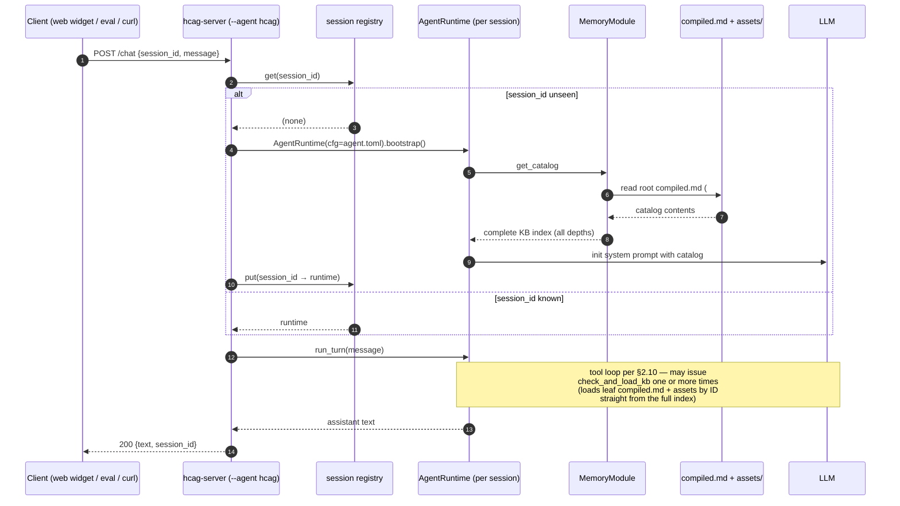
```mermaid
sequenceDiagram
    autonumber
    participant Cl as Client (web widget / eval / curl)
    participant S as hcag-server (--agent hcag)
    participant Reg as session registry
    participant R as AgentRuntime (per session)
    participant M as MemoryModule
    participant KB as compiled.md + assets/
    participant L as LLM

    Cl->>S: POST /chat {session_id, message}
    S->>Reg: get(session_id)
    alt session_id unseen
        Reg-->>S: (none)
        S->>R: AgentRuntime(cfg=agent.toml).bootstrap()
        R->>M: get_catalog
        M->>KB: read root compiled.md (## Catalog section)
        KB-->>M: catalog contents
        M-->>R: complete KB index (all depths)
        R->>L: init system prompt with catalog
        S->>Reg: put(session_id → runtime)
    else session_id known
        Reg-->>S: runtime
    end

    S->>R: run_turn(message)
    Note over R,L: tool loop per §2.10 — may issue<br/>check_and_load_kb one or more times<br/>(loads leaf compiled.md + assets by ID<br/>straight from the full index)
    R-->>S: assistant text
    S-->>Cl: 200 {text, session_id}
```

## 9.6 Configuration

`rag_agent.toml` layers on top of the settings the `rag` indexer already used, so the same file can drive both index-build and query-time in matched setups. The RAG agent reads only the sections below; unrelated `rag.toml` sections (like `[chunking]`) are ignored.

```toml
# Which LanceDB table to query (must match the one `rag` wrote — §8.7 [index]).
[index]
path  = "./local_lancedb"
table = "kb"

# Query embedding — MUST match the model the corpus was indexed with (§9.3.1).
[embedding]
provider    = "openai"
model       = "text-embedding-3-small"
api_key_env = "OPENAI_API_KEY"

# Generation LLM — the model that writes the answer.
[llm]
provider    = "anthropic"
model       = "claude-haiku-4-5-20251001"
api_key_env = "ANTHROPIC_API_KEY"
max_tokens  = 1024
temperature = 0.0

# Retrieval + prompt shaping (§9.3.2, §9.3.3).
[retrieval]
top_k               = 8       # hits requested from LanceDB
reranker            = "rrf"   # rrf | linear | none
max_context_tokens  = 6000    # sum of chunk token_estimates in the assembled prompt
merge_adjacent      = true    # collapse consecutive chunks from the same file

# Query-time vocabulary (§9.3.2): what users type -> what this corpus spells.
# Empty by default; the mechanism is general, the names are data about one KB.
# The value is appended to the retrieval query AND shown to the generator as a
# VOCABULARY note, so write it as a name a sentence can contain while still
# carrying the terms BM25 needs.
[retrieval.aliases]
"onepass"  = "the ONE Pass, formally the Overseas Networks & Expertise Pass"
"ep"       = "the Employment Pass"

# Optional: override the packaged system prompt for the RAG agent.
# system_prompt_path = "prompts/rag_agent_system.md"

[log]
file_path = "./rag-agent.log"
level     = "INFO"
```

## 9.7 Failure Modes

| Condition | Behavior |
|---|---|
| `--agent rag` + `--rag-index` path missing or has no `kb` table | ERROR at startup — non-zero exit; `hcag-server` refuses to bind. |
| Embedding model in `rag_agent.toml` disagrees with `manifest` metadata | ERROR at startup — refuses to serve a mismatched query space (§9.3.1). |
| `top_k` returns 0 hits for a turn | Prompt is composed with an empty CONTEXT block; the system prompt instructs the LLM to say "insufficient information." Judge scoring per §7.5 handles the rest. |
| LanceDB read fails mid-turn (disk error, corruption) | Turn returns a `[retrieval_error] <reason>` string as the assistant message. The session survives; next turn re-attempts. |
| Embedding call fails past provider retries | Turn returns `[embedding_error] <reason>`. Same session-survives semantics. |
| Generation call fails past provider retries | Turn returns `[generation_error] <reason>`. Same session-survives semantics. |
| `max_context_tokens` set below `token_estimate` of even the top hit | Include that one hit anyway, log a `WARN` — refusing the query is worse than crowding the budget. |

`hcag-server`'s HTTP layer maps these to `500` with the error string in the JSON body, so `evalrun` (§7.4.3) captures them as `[backend_error]` and the judge scores them appropriately.

## 9.8 Observability

The RAG agent writes to the same JSON-lines logger the rest of the stack uses (§2.11.3), namespaced `hcag.rag.agent`:

- `INFO`: agent bootstrap (index path, table name, resolved embed + generation model IDs, top_k, max_context_tokens), per-turn summary (session_id, chunk-hit count, retained-after-cap count, prompt tokens, generation tokens, wall-clock elapsed).
- `DEBUG`: full hybrid-search result list (id, kb_path, chunk_index, rerank score) before dedup + cap, the final assembled CONTEXT block, the full prompt.
- `WARN`: zero-hit turns, dropped chunks past the budget, embedding-model manifest mismatches promoted from ERROR when `--allow-embed-mismatch` is set (an escape hatch for experiments — off by default).
- `ERROR`: startup failures (missing index / table / manifest mismatch), fatal LanceDB corruption.

If `OTEL_EXPORTER_OTLP_ENDPOINT` is set, spans (`rag_agent.turn`, `rag_agent.embed`, `rag_agent.search`, `rag_agent.generate`) are exported — symmetric with §2.11. `rag_agent.toml` has no `[observability]` block: the config-file trace destinations of §2.11.1, the direct Langfuse form included, are a property of the HCAG runtime's `AgentConfig`, and the baseline deliberately does not grow a parallel one. Pointing both at the same backend for an A/B comparison means setting the env var for the RAG process and the config block for the HCAG one.

## 9.9 Non-Goals

- **Replacing HCAG in production.** The RAG agent exists to be a serious baseline for measuring HCAG. If a KB's workload is genuinely a fit for flat RAG (small corpus, short queries, few multi-hop questions per §1.3.3), then RAG is the right choice — but that's an operator decision made on the eval evidence, not a claim this design makes for it.
- **Tool use / dynamic reload.** The RAG agent does not expose tools to the LLM. There is no equivalent of `check_and_load_kb` (§2.3.2) — retrieval happens once, up front, with no re-issuance mid-turn. Adding tools would make it a different agent design; the point of the baseline is to be a faithful representation of *flat* RAG.
- **Query rewriting or HyDE.** Retrieval uses the raw user turn as the query. Common flat-RAG add-ons — HyDE-style hypothetical-answer expansion, LLM-based query rewriting, multi-query fanout — are deliberately omitted from the baseline so the eval comparison isolates the *architecture* (taxonomy vs. flat index), not the *tuning*.
- **Cross-agent state.** An HCAG session and a RAG session never share state. Migrating a conversation between them is out of scope; `evalrun` fresh-sessions per row anyway (§7.3 `--session-scope`).
- **Multimodal generation.** Images are consulted only through their §8.4.3 text description. Passing the original image bytes to the generation model at answer time is a future-work item for a "RAG-with-vision" variant; it is not what the baseline models.


---

# Part 10 — Web Chat Widget

## 10.1 Purpose

The browser front-end for the HCAG agent: a launcher and chat panel embedded in a host page, talking to `hcag-server` over `POST /chat` (§9.5), with an optional voice overlay that hands off to the LiveKit session in Part 5. It is a **presentation layer only** — it holds no KB knowledge, makes no retrieval decisions, and adds nothing to the reasoning path. Swapping it for a different client changes nothing above it.

The design content here is small but load-bearing: the widget is where the KB's structure either survives to the user or is destroyed at the last step.

## 10.2 Component Layout

| Piece | Responsibility |
|---|---|
| Host page | The embedding site. Owns its own styles; the widget must not disturb them (§10.3.5). |
| Launcher | Collapsed affordance that opens the panel. |
| Panel | Header, scrolling message list, composer. |
| Message | Renders one turn. **Assistant turns render Markdown (§10.3); user turns render as plain text.** |
| Composer | Text input and send. Plain text in — the user is not writing Markdown. |
| Voice overlay | Hands off to the LiveKit room (Part 5) and renders the `hcag.transcription` channel (§5.7). |

**Session continuity.** The widget holds a `session_id` for the life of the panel and sends it with every turn, so the server reuses one `AgentRuntime` and its active packet set (§9.5). This is what makes §2.7.1's reload discipline observable from the client: a correctly behaving session loads packets on the first substantive turn and then stops, and the panel should feel *faster* after the first answer, not the same.

## 10.3 Markdown Rendering

**Assistant messages are rendered as Markdown, not as plain text.**

This is not cosmetic. Every layer below the widget goes to deliberate trouble to preserve document structure: `crawl` extracts the article body with its heading hierarchy, lists, and tables intact, and even repairs tables whose header row lost its GFM delimiter (§4.4.1) — a fix that exists *only* so the structure survives to a Markdown renderer. `preprocess` concatenates that source Markdown into `## Content` verbatim (§3.4.3). The packet loader ships it to the model unmodified (§2.6). The model then quotes it back: eligibility criteria as a bulleted list, a fee schedule as a table, a procedure as numbered steps.

Rendering that as raw text throws all of it away at the final hop. A table arrives as pipe-and-dash soup, a numbered procedure as a wall of `1.` `2.` `3.` inside one paragraph, emphasis as literal asterisks. The user sees the one view of the KB that is *less* readable than the source document the KB was built from, and the table repair in §4.4.1 buys nothing.

**User messages stay plain text.** A user typing `2 * 3 * 4` or `_maybe_` must see exactly that. Markdown rendering applies to model output only; user input is escaped and displayed literally. The same holds for the voice overlay's caption pane (§5.7), which mirrors *spoken* text — the voice agent is prompted for conversational answers (§5.8) and its captions are rendered plain.

### 10.3.1 Supported constructs

GitHub-Flavored Markdown, restricted to what KB content actually contains:

| Rendered | Notes |
|---|---|
| Headings (`#`–`######`) | Downscaled to fit inside a chat bubble — an `h1` in a packet is a section title, not a page title. |
| Bold, italic, strikethrough | |
| Ordered and unordered lists, nested | The most common structure in procedural KB content. |
| Tables | The reason §4.4.1's delimiter repair exists. Wide tables scroll horizontally inside the bubble; the panel itself never scrolls sideways. |
| Fenced and inline code | Monospace, with horizontal scroll rather than wrapping mid-token. |
| Blockquotes | |
| Links | See §10.3.4. |
| Horizontal rules | `preprocess` joins multiple source files with `---` (§3.4.3), so these appear in quoted content. |
| Line breaks | Soft breaks inside a paragraph are preserved — model output uses them for readability. |

Everything else — raw HTML in particular — is not rendered (§10.3.2).

### 10.3.2 Sanitization

**Mandatory, and non-negotiable.** Assistant text is model output derived from KB documents that were, in the `crawl` case, fetched from the public web (Part 4). It is not authored by the operator and must never be treated as trusted markup.

- Markdown is parsed to a **safe node tree and rendered through the framework**, never assigned as an HTML string to an innerHTML-style sink.
- **Raw HTML passthrough is disabled** in the parser, and the output is filtered through an allowlist sanitizer covering the constructs in §10.3.1. Both — the parser setting alone is not a security boundary.
- URL schemes are allowlisted to `http`, `https`, and `mailto`. `javascript:`, `data:`, and `vbscript:` hrefs are dropped, not linkified.
- No construct may execute script, load a remote subresource, or submit a form.

The renderer is any library satisfying the above; the reference implementation pins a Markdown component with a GFM plugin and a sanitizing plugin, at exact versions. Pinned, because a transitive bump in a Markdown parser is a change to a security boundary.

### 10.3.3 Streaming and partial syntax

When assistant text streams in, the panel re-renders the **accumulated** text on each delta rather than appending rendered fragments. A Markdown document is not concatenative — a fragment ending mid-table or inside an unterminated code fence is not a valid document, and rendering fragments independently produces flicker and broken structure.

The consequence is that partial syntax is normal and must be tolerated, not treated as an error: an unclosed code fence, a table with its delimiter row still arriving, a list item cut mid-word. The renderer must produce *something* reasonable for every prefix of the final text, and must not throw. The visible behavior is a block that settles into its final shape as it completes, never one that disappears and reappears.

### 10.3.4 KB-specific link and image handling

Two cases arise from how packets are built, and both are silent failures if unhandled:

- **Relative image references.** `preprocess` rewrites every image reference to `assets/<filename>`, relative to the packet folder (§3.4.6). Those paths mean nothing to the browser: the widget is not served from the KB tree, and the assets are not on its origin. A relative `` quoted into an answer must therefore render as a labeled placeholder carrying its alt text — not as a broken-image icon, and not as a request the browser cannot satisfy. Serving packet assets to the client is future work (§10.5); until then the widget states plainly that an image exists rather than pretending to show it.
- **Links.** Absolute `http(s)` links render as links and open in a new tab with `rel="noopener noreferrer"`. Relative links — which in KB content point at sibling source documents, not at web pages — render as plain text, since following them would navigate the host page to a 404.

### 10.3.5 Style isolation on a host page

The widget is embedded in someone else's page, so Markdown styling cuts both ways: the widget's rules must not restyle the host's headings and tables, and the host's global CSS must not restyle the widget's. All Markdown styling is scoped to the message container, and the widget sets its own explicit values for the elements it renders rather than inheriting whatever the host page happens to define. This matters more for Markdown than for plain text precisely because Markdown emits the generic tags — `h2`, `table`, `li`, `code` — that a host page is most likely to have opinions about.

## 10.4 Wire Contract

**The widget streams.** It posts to `POST /chat/stream` (§9.5) with `{ session_id, message, history[] }` and reads an SSE body of §2.14.1 events. `POST /chat` remains available and is what the widget falls back to when streaming is unavailable — a proxy that buffers, or the `--agent rag` backend, which returns `501` for the streaming route.

Streaming matters more here than in a typical chat UI because of what an HCAG turn does before it speaks. The first token cannot arrive until the model has chosen a packet, the memory module has read it, and the model has been re-invoked over it — on a large packet that is seconds of nothing. Synchronously, that whole interval is a blank panel. Streaming turns it into visible progress, and the `tool.*` events make the progress *specific*: **"Consulting Employment Pass eligibility…"** rather than a spinner. That the widget can name the source before the answer arrives is a property of taxonomic retrieval — it is one of the few places HCAG's structure is visible to an end user, and it would be wasted on a synchronous response.

Rendering rules follow §10.3 unchanged, and §10.3.3 already specifies the one that matters: the panel re-renders the **accumulated** text on each delta rather than appending rendered fragments, because a Markdown fragment ending mid-table is not a document. Partial syntax is normal input, not an error.

Two client obligations from §2.14.3, both easy to get wrong:

- A stream that closes without `assistant.final` is a **failed turn**, not a short answer. The panel must show it as failed; a truncated answer rendered as complete is the worst outcome available.
- An `error` event arrives *in-band*, after a `200`. The widget cannot infer failure from the status line.

The voice path is separate transport, same events: `POST /livekit/token` mints a room token, after which the browser speaks LiveKit directly and consumes the `hcag.transcription` channel (§5.7) — which carries the §2.14.1 vocabulary. **One reducer serves both modes**: chat frames arrive over SSE, voice frames over the data channel, and the widget's state machine does not care which.

## 10.5 Non-Goals

- **Rendering packet assets.** Images referenced by packets are not served to the browser today (§10.3.4). An asset endpoint on `hcag-server` would be the natural place for it; it is not in scope here.
- **Client-side KB access.** The widget never reads the KB, never sees the catalog, and never names a packet id. D4a's boundary extends to the front-end.
- **Markdown input.** The composer sends plain text. Rendering the user's own Markdown would make it impossible to quote Markdown syntax in a question.
- **Persistence.** Conversation state lives in the server's in-memory session registry (§9.5) and the panel's own state. Reloading the page starts a new conversation.
- **Theming API.** The widget picks up its palette from CSS custom properties; a configurable theming surface for embedders is future work.
