# DESIGN.md — Hierarchical Context Augmented Generation (HCAG)

An LLM agent backed by a hierarchical knowledge base. Instead of flat-index RAG over chunks, HCAG navigates a taxonomy, retrieves whole leaf documents, classifies the problem's branch once, and reuses that retrieval across the reasoning steps of a task.

---

## Table of Contents

- [Part 1 — High-Level Design](#part-1--high-level-design)
  - [1.1 The HCAG Approach](#11-the-hcag-approach)
  - [1.2 What HCAG Solves](#12-what-hcag-solves)
    - [Problem 1 — Knowledge Isolation](#problem-1--knowledge-isolation)
    - [Problem 2 — Complex Reasoning](#problem-2--complex-reasoning)
    - [Problem 3 — Speed and Cost](#problem-3--speed-and-cost)
  - [1.3 When to Use HCAG (vs Alternatives)](#13-when-to-use-hcag-vs-alternatives)
    - [1.3.1 Choose HCAG when…](#131-choose-hcag-when)
    - [1.3.2 Choose Agentic Search when…](#132-choose-agentic-search-when)
    - [1.3.3 Choose Flat RAG when…](#133-choose-flat-rag-when)
    - [1.3.4 At a Glance](#134-at-a-glance)
    - [1.3.5 Combining Approaches](#135-combining-approaches)
  - [1.4 What the Agent Provides](#14-what-the-agent-provides)
  - [1.5 Design Goals](#15-design-goals)
  - [1.6 Non-Goals](#16-non-goals)
  - [1.7 Core Concepts](#17-core-concepts)
  - [1.8 Key Design Decisions](#18-key-design-decisions)
  - [1.9 Component Boundary](#19-component-boundary)
  - [1.10 Tool Surface](#110-tool-surface)
  - [1.11 Out of Scope](#111-out-of-scope)
- [Part 2 — Detailed Design](#part-2--detailed-design)
  - [2.1 KB Layout](#21-kb-layout)
  - [2.2 `compiled.md` Schema](#22-compiledmd-schema)
  - [2.3 Tool Contracts](#23-tool-contracts)
    - [2.3.1 `get_catalog`](#231-get_catalog)
    - [2.3.2 `check_and_load_kb`](#232-check_and_load_kb)
    - [2.3.3 Selection semantics](#233-selection-semantics)
  - [2.4 Active-Set Protocol](#24-active-set-protocol)
  - [2.5 Token Budget & Eviction Algorithm](#25-token-budget--eviction-algorithm)
  - [2.6 Packet Loading (Multimodal Assembly)](#26-packet-loading-multimodal-assembly)
  - [2.7 System Prompt Composition (Bootstrap)](#27-system-prompt-composition-bootstrap)
  - [2.8 Error Handling](#28-error-handling)
  - [2.9 Component Class Diagram](#29-component-class-diagram)
  - [2.10 Sequence Diagrams](#210-sequence-diagrams)
    - [2.10.1 Cold start + first turn (additive load)](#2101-cold-start--first-turn-additive-load)
    - [2.10.2 Follow-up turn — no reload needed](#2102-follow-up-turn--no-reload-needed)
    - [2.10.3 Follow-up turn — additive load within budget](#2103-follow-up-turn--additive-load-within-budget)
    - [2.10.4 Follow-up turn — load with eviction](#2104-follow-up-turn--load-with-eviction)
  - [2.11 Observability](#211-observability)
    - [2.11.1 Configuration](#2111-configuration)
    - [2.11.2 OTEL Trace Model](#2112-otel-trace-model)
    - [2.11.3 Local File Logging](#2113-local-file-logging)
    - [2.11.4 What the Two Layers Together Answer](#2114-what-the-two-layers-together-answer)
  - [2.12 Prompt-Cache Alignment (realizing Problem 3)](#212-prompt-cache-alignment-realizing-problem-3)
  - [2.13 Tech Stack](#213-tech-stack)
    - [2.13.1 Language and Runtime](#2131-language-and-runtime)
    - [2.13.2 LLM Access — Provider-Neutral](#2132-llm-access--provider-neutral)
    - [2.13.3 Configuration, CLI, Content, Tokenization](#2133-configuration-cli-content-tokenization)
    - [2.13.4 Observability](#2134-observability)
    - [2.13.5 Testing and Packaging](#2135-testing-and-packaging)
    - [2.13.6 Dependency Summary](#2136-dependency-summary)
    - [2.13.7 Credentials](#2137-credentials)
    - [2.13.8 Deliberate Non-Dependencies](#2138-deliberate-non-dependencies)
  - [2.14 Open Questions / Future Work](#214-open-questions--future-work)
- [Part 3 — The `hcag` CLI Tool](#part-3--the-hcag-cli-tool)
  - [3.1 Purpose](#31-purpose)
  - [3.2 KB Input Model](#32-kb-input-model)
  - [3.3 CLI Overview](#33-cli-overview)
  - [3.4 `hcag preprocess` — Detailed Semantics](#34-hcag-preprocess--detailed-semantics)
    - [3.4.1 DFS traversal](#341-dfs-traversal)
    - [3.4.2 Per-folder classification](#342-per-folder-classification)
    - [3.4.3 `compiled.md` assembly](#343-compiledmd-assembly)
    - [3.4.4 Catalog section content](#344-catalog-section-content)
    - [3.4.5 Packet ID scheme](#345-packet-id-scheme)
    - [3.4.6 Asset policy](#346-asset-policy)
    - [3.4.7 Overwrite policy](#347-overwrite-policy)
    - [3.4.8 Failure modes](#348-failure-modes)
  - [3.5 Aggregation (folded into `preprocess`)](#35-aggregation-folded-into-preprocess)
  - [3.6 Configuration](#36-configuration)
  - [3.7 Generated File Format — Summary](#37-generated-file-format--summary)
  - [3.8 End-to-End Workflow](#38-end-to-end-workflow)
  - [3.9 Observability (CLI)](#39-observability-cli)
  - [3.10 Non-Goals for the CLI](#310-non-goals-for-the-cli)
  - [3.11 Sequence Diagram](#311-sequence-diagram)
- [Part 4 — The `crawl` CLI Tool](#part-4--the-crawl-cli-tool)
  - [4.1 Purpose](#41-purpose)
  - [4.2 Invocation](#42-invocation)
  - [4.3 Traversal Semantics](#43-traversal-semantics)
    - [4.3.1 Seed prefix scope](#431-seed-prefix-scope)
    - [4.3.2 Visited-URL tracking](#432-visited-url-tracking)
    - [4.3.3 Depth](#433-depth)
  - [4.4 Document Types](#44-document-types)
    - [4.4.1 HTML](#441-html)
    - [4.4.2 PDF](#442-pdf)
    - [4.4.3 Images](#443-images)
  - [4.5 Output Layout](#45-output-layout)
  - [4.6 Relationship to `hcag`](#46-relationship-to-hcag)
  - [4.7 Observability (CLI)](#47-observability-cli)
  - [4.8 Non-Goals](#48-non-goals)
  - [4.9 Sequence Diagram](#49-sequence-diagram)
- [Part 5 — Voice Agent (LiveKit)](#part-5--voice-agent-livekit)
  - [5.1 Purpose](#51-purpose)
  - [5.2 Component Boundary](#52-component-boundary)
    - [5.2.1 Voice Class Diagram](#521-voice-class-diagram)
  - [5.3 Real-Time Architecture](#53-real-time-architecture)
  - [5.4 Session Startup](#54-session-startup)
    - [5.4.1 Warm-start with initial packets](#541-warm-start-with-initial-packets)
    - [5.4.2 Prompt-cache warm-up call](#542-prompt-cache-warm-up-call)
    - [5.4.3 Startup Sequence Diagram](#543-startup-sequence-diagram)
  - [5.5 Real-Time Turn Pipeline](#55-real-time-turn-pipeline)
  - [5.6 STT / TTS Provider Selection](#56-stt--tts-provider-selection)
  - [5.7 Live Transcription Channel (Web Client Contract)](#57-live-transcription-channel-web-client-contract)
  - [5.8 Configuration](#58-configuration)
  - [5.9 CLI](#59-cli)
  - [5.10 Observability](#510-observability)
  - [5.11 Non-Goals](#511-non-goals)
- [Part 6 — The `evalgen` CLI Tool](#part-6--the-evalgen-cli-tool)
  - [6.1 Purpose](#61-purpose)
  - [6.2 KB Input Model](#62-kb-input-model)
  - [6.3 Invocation](#63-invocation)
  - [6.4 Question Types](#64-question-types)
    - [6.4.1 `simple`](#641-simple)
    - [6.4.2 `medium`](#642-medium)
    - [6.4.3 `complex`](#643-complex)
    - [6.4.4 `hard-1` (cross-packet)](#644-hard-1-cross-packet)
    - [6.4.5 `hard-2` (multimodal)](#645-hard-2-multimodal)
  - [6.5 Quantity Control](#65-quantity-control)
  - [6.6 Generation Algorithm](#66-generation-algorithm)
  - [6.7 Output CSV Schema](#67-output-csv-schema)
  - [6.8 Configuration](#68-configuration)
  - [6.9 Failure Modes](#69-failure-modes)
  - [6.10 Observability (CLI)](#610-observability-cli)
  - [6.11 Non-Goals](#611-non-goals)
  - [6.12 Sequence Diagram](#612-sequence-diagram)
- [Part 7 — The `eval` CLI Tool](#part-7--the-eval-cli-tool)
  - [7.1 Purpose](#71-purpose)
  - [7.2 Input Model](#72-input-model)
  - [7.3 Invocation](#73-invocation)
  - [7.4 Execution Loop](#74-execution-loop)
    - [7.4.1 Single-turn exchange](#741-single-turn-exchange)
    - [7.4.2 Multi-turn clarification](#742-multi-turn-clarification)
    - [7.4.3 Turn limit and termination](#743-turn-limit-and-termination)
  - [7.5 LLM-as-Judge Scoring](#75-llm-as-judge-scoring)
  - [7.6 Test Harness (promptfoo)](#76-test-harness-promptfoo)
  - [7.7 Output — Completed CSV](#77-output--completed-csv)
  - [7.8 Output — HTML Report](#78-output--html-report)
  - [7.9 Configuration](#79-configuration)
  - [7.10 Failure Modes](#710-failure-modes)
  - [7.11 Observability (CLI)](#711-observability-cli)
  - [7.12 Non-Goals](#712-non-goals)
  - [7.13 Sequence Diagram](#713-sequence-diagram)
- [Part 8 — The `rag` CLI Tool](#part-8--the-rag-cli-tool)
  - [8.1 Purpose](#81-purpose)
  - [8.2 KB Input Model](#82-kb-input-model)
  - [8.3 Invocation](#83-invocation)
  - [8.4 Indexing Pipeline](#84-indexing-pipeline)
    - [8.4.1 Walk and file classification](#841-walk-and-file-classification)
    - [8.4.2 Text extraction and chunking](#842-text-extraction-and-chunking)
    - [8.4.3 Image description](#843-image-description)
    - [8.4.4 Embedding and batching](#844-embedding-and-batching)
    - [8.4.5 Idempotency and re-indexing](#845-idempotency-and-re-indexing)
  - [8.5 Index Schema](#85-index-schema)
  - [8.6 Hybrid Search Semantics](#86-hybrid-search-semantics)
  - [8.7 Configuration](#87-configuration)
  - [8.8 Failure Modes](#88-failure-modes)
  - [8.9 Observability (CLI)](#89-observability-cli)
  - [8.10 Non-Goals](#810-non-goals)
  - [8.11 Sequence Diagram](#811-sequence-diagram)
- [Part 9 — The RAG Chat Agent (Competing Baseline)](#part-9--the-rag-chat-agent-competing-baseline)
  - [9.1 Purpose](#91-purpose)
  - [9.2 Component Boundary](#92-component-boundary)
  - [9.3 Turn Pipeline](#93-turn-pipeline)
    - [9.3.1 Query embedding](#931-query-embedding)
    - [9.3.2 Hybrid retrieval](#932-hybrid-retrieval)
    - [9.3.3 Chunk assembly](#933-chunk-assembly)
    - [9.3.4 Prompt composition](#934-prompt-composition)
    - [9.3.5 Sequence diagram](#935-sequence-diagram)
  - [9.4 Comparison to HCAG](#94-comparison-to-hcag)
  - [9.5 Backend Server Integration (`hcag-server --agent`)](#95-backend-server-integration-hcag-server---agent)
    - [9.5.1 Sequence diagram — HCAG agent path](#951-sequence-diagram--hcag-agent-path)
  - [9.6 Configuration](#96-configuration)
  - [9.7 Failure Modes](#97-failure-modes)
  - [9.8 Observability](#98-observability)
  - [9.9 Non-Goals](#99-non-goals)

---

# Part 1 — High-Level Design

## 1.1 The HCAG Approach

HCAG is a knowledge-taxonomy pattern for agentic AI applications. Rather than searching a flat index of chunks on every query, an HCAG agent classifies the problem — **domain → subdomain → topic** — and lets that classification decide which documents from the knowledge base are active. The classification happens **once per task** (or, at most, a few times when a task genuinely spans multiple branches), and the same active set is reused across the many reasoning, tool-use, and generation steps that follow.

**The core mechanism.**

1. The KB is organized as a tree: **domain → subdomain → topic → leaf documents**.
2. On receiving a task, the agent classifies the task's branch(es) and loads the corresponding leaf documents in full.
3. The agent then performs all subsequent reasoning steps — planning, tool use, drafting, refining — against that stable active set.
4. Only if a new step genuinely requires knowledge outside the active branch does the agent re-classify and load additional documents.

**How this differs from flat RAG.**

| | Flat RAG | HCAG |
|---|---|---|
| Retrieval unit | Chunks (fragments of documents) | Whole leaf documents |
| When retrieval fires | Every query, often every step | Once per task, reused across steps |
| Candidate pool per retrieval | All chunks from all documents (potentially millions) | Only leaves under the classified branch (a handful) |
| What competes | Every chunk in the corpus | Nothing — the taxonomy has already gated the corpus |
| Failure mode | "Similar but wrong" chunks from unrelated documents | Wrong branch classification (rarer, and detectable) |
| Continuity across steps | Working set flickers as each step retrieves anew | Working set is stable across the task |

The essential shift is **from repeated similarity search over a flat pool to a one-shot taxonomic classification that gates the pool**. Because only a few branches are ever active, thousands of unrelated documents cannot compete for the model's attention. Because leaves are retrieved whole, disambiguating context (definitions, caveats, scope) travels with the content instead of being sheared off by chunking. And because classification is amortized across the task, retrieval cost is paid once instead of at every reasoning step.

The rest of §1 makes this concrete: the three problems this solves (§1.2), when to reach for HCAG vs alternatives (§1.3), what the agent provides (§1.4), the design decisions that realize it (§1.8), and the component boundary that isolates the KB behind a memory module (§1.9).

## 1.2 What HCAG Solves

Given the approach in §1.1, HCAG addresses three failure modes of flat RAG.

### Problem 1 — Knowledge Isolation

The KB is organized as a **taxonomy**, not a flat index. At any point in a task, only one or two branches are active; the remaining 90%+ of the corpus is out of scope and cannot compete during retrieval. Flat RAG has no such gate — every chunk in the store is a candidate on every query, which is where "similar but wrong" retrievals come from, and those wrong retrievals are a common source of hallucination.

HCAG also retrieves **whole leaf documents**, not fragments. A full document carries its own disambiguating context — definitions, caveats, scope — that a chunk usually strips away. This is why packets are folder-scoped (see D2): the atomic unit of loading is a whole document plus its images, not a slice.

### Problem 2 — Complex Reasoning

Multi-faceted problems are where flat RAG breaks down: covering them properly requires several distinct queries, and any one of them can miss the right chunk. Once HCAG selects the correct branch, the model has the **complete body of knowledge that the problem needs**, in one shot. It reasons over full material rather than assembling an answer from partial excerpts.

### Problem 3 — Speed and Cost

Two effects compound:

| Mechanism | Effect |
|---|---|
| Prompt caching across repeated LLM calls sharing a stable prefix | 90%+ reduction in token cost on repeat calls, lower latency |
| Domain → subdomain → topic classification done **once** per task, retrieval reused across reasoning steps | Removes one or more retrieval round-trips per step |

The agent classifies the problem's domain / subdomain / topic up front and then stays with that active set for most of the task. Retrieval cost is paid once, not at every reasoning step. Decisions D5 (agent-driven, explicit reload) and D6 (delta-only responses) exist to protect this property: they keep the prompt prefix byte-stable across turns so cache hits accumulate.

## 1.3 When to Use HCAG (vs Alternatives)

HCAG is not a universal replacement for retrieval. It sits on a spectrum whose other main points are **Agentic Search** and **flat RAG**. The right choice depends on latency budget, cost sensitivity, task shape, and how much unpredictability the application can tolerate.

### 1.3.1 Choose HCAG when…

- You need **fast responses at low cost** on a **knowledge-heavy** task.
- The task requires **strong reasoning and planning grounded in specific knowledge** — diagnostic assistants, technical support agents, policy or compliance advisors, developer copilots against a large internal documentation set.
- The KB is large enough that injecting all of it every turn is impractical, but structured enough that a taxonomy exists or can be created.
- You want **predictable behavior**: the classification is inspectable, the loaded packets are enumerable, and the same question routes to the same knowledge.
- Prompt-cache hit rate matters — long conversations against the same branch.

**Prototypical use cases.** The pattern fits when the task is knowledge-heavy, largely stays within one branch of a well-defined taxonomy, and demands strong reasoning grounded in that branch:

- **Autonomous customer support over large, complex knowledge.** A support agent handling technical questions against a big product or policy corpus. Each conversation anchors in one or two product areas, classification stays stable across turns, and multi-turn reasoning benefits from the same active documents.
- **Root cause analysis.** A diagnostic agent walks a fault tree — symptoms → subsystem → component — retrieves the runbooks, telemetry references, and known-issue notes for the classified branch, and reasons through causes and fixes against that stable set. The taxonomy *is* the diagnostic hierarchy.
- **Autonomous operation workflows.** An operational agent executing a multi-step procedure (incident response, change management, provisioning, compliance action) grounded in the SOPs for a specific operation type. Classification picks the workflow; the packet holds the procedure and prerequisites; the agent plans and executes across many steps against that same knowledge without re-retrieving.

**Prerequisite — taxonomy investment.** HCAG's quality is bounded by the quality of the taxonomy. If a good taxonomy for your domain does not already exist, expect meaningful upfront work to design one — deciding what the branches are, where the boundaries fall, and how leaf documents map onto them. A poorly-crafted taxonomy will cause branch misclassification (the model activates the wrong branch) and coverage gaps (relevant knowledge is spread across branches that never co-activate). Existing documentation ontologies (product areas, service catalogs, policy chapters) are often good starting points, but rarely usable as-is. Budget for this. HCAG shifts effort from *repeated retrieval quality tuning* (RAG's ongoing cost) to *one-time taxonomy design* (HCAG's upfront cost).

### 1.3.2 Choose Agentic Search when…

- The task is **open-ended** — a research question, an investigative report, a market scan — where the agent should decide *what* to look for as it works.
- **Predictability is less important than coverage.** You want the agent to surprise you with connections across the KB or the open web.
- Backend batch processing is acceptable; the user is not waiting synchronously for a snappy response.
- Latency in the seconds-to-minutes range is fine; cost per task is amortized over the value of the output.

Agentic Search means the agent iteratively issues search queries (over web, KB, or both), reads results, refines queries, and synthesizes. There is no single upfront classification; the search plan evolves with what the agent finds.

**Prototypical use case:** "Write me a report on how our competitors are positioning against feature X." The agent decides what to search for, follows leads, cross-references sources. Wrong or missing sources are recoverable in-loop.

### 1.3.3 Choose Flat RAG when…

- You need a **quick MVP** — ship a knowledge-grounded feature this week.
- The **KB is small** and unlikely to grow into taxonomy territory.
- The questions are **FAQ-style** — short, self-contained, answered from a single passage.
- The task requires **little multi-step reasoning** — the answer lives in one passage, not synthesized across many.
- You can accept a **~70–80% accuracy ceiling**. The "similar but wrong" chunks that Problem 1 (§1.2) describes will be a persistent noise floor.
- You do **not** want to invest in taxonomy design; embedding + chunking gives you a working system on day one.

Flat RAG is the right first-cut for many products; it becomes limiting when the task shifts from "answer a question" to "reason across a body of knowledge," or when the KB grows past what a flat similarity search can gate well.

### 1.3.4 At a Glance

| | HCAG | Agentic Search | Flat RAG |
|---|---|---|---|
| **Best task shape** | Knowledge-heavy reasoning within a bounded domain | Open-ended research and report generation | FAQ / single-passage lookup |
| **Latency** | Low (single classification + cached prefix) | Medium–high (multi-step search loop) | Low |
| **Cost per task** | Low (retrieval paid once, cache reused) | High (many LLM calls, many searches) | Low |
| **Predictability** | High | Low (varies by query) | Medium |
| **Accuracy ceiling** | High when taxonomy is well-designed | Task-dependent, hard to bound | ~70–80% for non-trivial questions |
| **Setup cost** | Medium–high (**design a good taxonomy** + run `hcag`) | Low (define search tools) | Low (embed and index) |
| **Prerequisite** | A well-crafted taxonomy for the domain (often the biggest cost) | Well-defined search corpus/tools | A chunkable KB and an embedding model |
| **Fails when…** | Taxonomy is missing, poor quality, or the task genuinely spans many branches | Open-ended goals get lost mid-loop | Question requires reasoning across multiple documents, or KB is large enough that similar-but-wrong retrievals dominate |

### 1.3.5 Combining Approaches

The three are not mutually exclusive:

- **HCAG + Agentic Search fallback.** Use HCAG for the common case; if the agent's classification confidence is low, or the active set fails to answer, fall back to agentic search over the same KB (or the open web).
- **HCAG + Flat RAG within a packet.** For very large leaf documents, an embedding index over the packet's content can support fine-grained lookup while the taxonomy still gates the outer scope.
- **Agentic Search grounded on HCAG catalogs.** The agent's search tool can search over catalog metadata as one of its sources, mixing taxonomic navigation with open exploration.

## 1.4 What the Agent Provides

To realize the three properties above, the agent:

1. Sees a **catalog** (the taxonomy) describing everything available in the KB.
2. Loads specific **knowledge packets** (folders of markdown + images = whole leaf documents) on demand.
3. **Classifies the task's branch once** and persists that active set across turns rather than re-selecting each turn.
4. Reloads **only when the agent itself decides** its current knowledge is insufficient.
5. Handles **multimodal** content (a folder's `compiled.md` + its `assets/` images) as first-class.

## 1.5 Design Goals

- **Taxonomic gating.** Only packets from the selected branch(es) of the KB can enter the model's context; the rest of the corpus is out of scope by construction, not by similarity score.
- **Whole-document retrieval.** Leaf documents load in full; no chunking, no fragment assembly.
- **Classify once, reason many times.** The task's branch is decided up front and reused across reasoning steps; the active set stays put unless the agent judges it insufficient.
- **Explicit, agent-driven memory control.** The agent decides when to expand its working knowledge, not a background retriever.
- **Prompt-cache friendliness.** The prompt prefix (system prompt + prior tool results) stays byte-stable across turns so cache hits accumulate and per-call cost drops.
- **Delta-only transport.** Reloads move only what changed (newly-loaded packets + newly-evicted IDs), never re-transmitting stable packets.
- **Bounded working memory.** A token budget caps the active set; LRU eviction reclaims space when the agent asks for more than fits.
- **Multimodal by default.** Images referenced by a packet ride with the packet as multimodal content blocks.
- **Framework-agnostic contract.** The design describes interfaces and protocols; a concrete implementation may bind to any agent SDK.
- **Deterministic packet units.** A packet is a folder; boundaries are physical, not inferred.

## 1.6 Non-Goals

- ~~Catalog generation~~ — **in scope**, covered by the `hcag` CLI in Part 3. The runtime agent still assumes a valid root `compiled.md` (with its `## Sub-topics` catalog section populated) already exists at query time; the CLI is what produces it.
- **Semantic embedding retrieval.** No vector store, no similarity search. Selection is LLM-driven, informed by catalog metadata.
- **Multi-user / concurrent-session** orchestration. Single conversation, single agent instance.
- **Write-back / KB mutation** from the agent. The KB is read-only from the agent's perspective.
- **Persistence of the active set across process restarts.** Session-scoped only.

## 1.7 Core Concepts

| Term | Definition |
|---|---|
| **Knowledge Base (KB)** | A file-system tree of taxonomy folders rooted at a KB directory. Every folder — leaf, taxonomy node, mixed, and root — carries one `compiled.md`. |
| **Packet** | A folder containing a `compiled.md` and an optional `assets/` subdirectory of images. Every folder is a packet in the runtime sense — leaves, taxonomy nodes, and the root alike are loadable via `check_and_load_kb`. |
| **Catalog** | The `## Sub-topics` section inside every folder's `compiled.md`, listing its immediate children with metadata (id, path, title, short + long description, token size estimate). The root's catalog section — the top-level branches — is what the runtime injects at bootstrap. |
| **Active Set** | The set of packets currently loaded into the agent's working context in the current conversation. |
| **Delta** | The pair `(loaded, evicted)` returned when the active set changes — only new packet content is transmitted; only evicted IDs are named. |
| **Token Budget** | A hard upper bound on the total tokens the active set may occupy. Enforced by the memory module via LRU eviction. |

## 1.8 Key Design Decisions

Each decision below is a choice made deliberately over specific alternatives.

### D1. Hierarchy = file-system tree
The KB is a nested directory tree. Hierarchy is physical (folders), not conceptual (taxonomy) or temporal (memory tiers). **Rationale:** Simplest mental model; the directory is the source of truth; no separate taxonomy to keep in sync.

### D2. Every folder = one `compiled.md` (+ optional `assets/`)
Each folder — leaf, taxonomy node, mixed, or root — has exactly one `compiled.md` that carries this level's own content and a catalog section listing its immediate children. Images live in an optional `assets/` subdirectory alongside. Subfolders are independently loadable folders in their own right. **Rationale:** One file kind at every level means one code path in the memory module and one unit of retrieval throughout the system; images travel with the text they belong to; no distinction between "leaf" and "node" artifacts.

### D3. Catalog = the `## Sub-topics` section of every `compiled.md`
No standalone catalog file. Each folder's `compiled.md` includes a `## Sub-topics` section that lists its immediate children with metadata; loading a folder therefore exposes both its own content and the next-level catalog to the LLM in one step. The **root**'s `compiled.md` is what the runtime auto-injects at bootstrap — its catalog section describes the top-level branches. Deeper catalogs are seen only when the agent loads that deeper folder (§2.7). **Rationale:** One place to look at each level; no separate global index to reconcile at runtime; a standardized single-pass DFS build (Part 3) lets KB authors focus on extracting raw markdown from source documents.

### D4. Catalog auto-injected into system prompt (fetched via memory module)
At conversation start, the agent runtime calls `memory_module.get_catalog()` — which returns the `## Sub-topics` section of the root `compiled.md`, i.e., the top-level branches with metadata — and injects it into the system prompt. The agent always "knows" the top-level shape of the KB. Deeper catalogs are revealed on demand: loading a taxonomy node's `compiled.md` via `check_and_load_kb` exposes that node's own `## Sub-topics` section as part of the tool result, so the agent can then decide which of its children to drill into. `get_catalog` remains available as a tool for re-inspection mid-session, but the common path is a single bootstrap call. **Rationale:** Removes an entire round-trip class from the per-turn common path; agent can decide from the outset which branch to enter; deeper structure is loaded only when a branch is actually opened.

### D4a. Memory module is the sole KB accessor
Neither the agent runtime nor the LLM ever reads the KB file system directly — not for the catalog, not for packets, not for images. Every byte of KB content is fetched via the memory module's tools (`get_catalog`, `check_and_load_kb`). **Rationale:** The KB backing store is an implementation detail of the memory module. Today it is a local file tree; tomorrow it can become an object store, a versioned KV, or a remote service — with zero change to the agent contract. This isolation is enforced at the layering boundary: the runtime has no KB path, no reader, no direct dependency on the file system for KB content.

### D5. Classify once, agent-driven explicit reload
The agent classifies the task's domain / subdomain / topic at the first turn and loads the corresponding leaf packet(s) via `check_and_load_kb`. On subsequent turns it does **not** re-classify or re-select — it calls `check_and_load_kb` only when it judges its current active set insufficient for the new request. No per-turn re-evaluation, no background retriever, no topic-shift heuristic. **Rationale:** Prevents active-set churn; preserves prompt-cache locality across turns (Problem 3); matches the observation that most multi-step reasoning within a task stays inside the same branch.

### D6. Delta-only responses from `check_and_load_kb`
The tool returns only **newly loaded packets** (with content) and **newly evicted packet IDs** (without content). It does not re-send content of packets already in the active set. **Rationale:** Minimizes token traffic **and** — critically for Problem 3 — keeps prior tool-result blocks byte-stable in history, so the prompt prefix remains cacheable turn after turn.

### D7. Agent tracks the active set; passes it in each call
The memory module is **stateless across calls**. The agent LLM tracks currently-loaded packet IDs (they are in its conversation history) and passes them as an argument to `check_and_load_kb`. **Rationale:** Framework-agnostic; no session store; the ground truth is the conversation itself.

### D8. Token-budget-bounded active set with LRU eviction
The module enforces a hard token budget. If new loads would exceed budget, the module evicts least-recently-used packets from the caller-supplied active set to make room, and reports the eviction in the delta. **Rationale:** Predictable context growth; the agent never has to reason about tokens itself.

### D9. Multimodal loading is first-class
Images under a folder's `assets/` directory are loaded as multimodal content blocks alongside its `compiled.md`. Not text descriptions, not deferred loads. **Rationale:** The agent should see what the folder contains, in full fidelity, from the moment it is loaded.

### D10. Framework-agnostic contracts
The design specifies interfaces (tool schemas, return shapes, active-set protocol) but not a specific SDK, language, or LLM binding. **Rationale:** Portable across Claude Agent SDK (Python/TS), raw Anthropic SDK, or any other agent runtime.

## 1.9 Component Boundary

```
┌──────────────────────────────────────────────────────────┐
│                    AGENT RUNTIME                         │
│                                                          │
│  ┌────────────────────────────────────────────────────┐  │
│  │   LLM (holds active-set IDs in its context)        │  │
│  └───────────────┬────────────────────────────────────┘  │
│                  │ tool calls                            │
│                  │ (get_catalog, check_and_load_kb)      │
│                  │                                       │
│  Bootstrap ▲     │                                       │
│  get_catalog│    │                                       │
│             │    ▼                                       │
│  ┌────────────────────────────────────────────────────┐  │
│  │           Memory Module (per-call stateless)       │  │
│  │  - get_catalog                                     │  │
│  │  - check_and_load_kb(context, requested, active)   │  │
│  │  - Token budgeting + LRU eviction                  │  │
│  │  - Multimodal packet assembly                      │  │
│  │  - **SOLE OWNER OF KB ACCESS**                     │  │
│  └───────────────┬────────────────────────────────────┘  │
└──────────────────┼───────────────────────────────────────┘
                   │ reads (private to module)
        ┌──────────▼──────────┐
        │  KB (backing store) │
        │  compiled.md        │  (root)
        │  <folder>/compiled.md
        │  <folder>/assets/*  │
        └─────────────────────┘
```

The **Memory Module** is the only component that touches the KB. Everything else — the agent runtime (for bootstrap), the LLM (for per-turn loads) — goes through it. Because of this, the backing store can be swapped (local FS → object store → remote KV service) without any change to the agent or LLM contract.

## 1.10 Tool Surface

Two tools are exposed to the agent:

| Tool | Purpose | When the agent calls it |
|---|---|---|
| `get_catalog` | Return the current catalog. | Rare — catalog is auto-injected. Used only if agent wants to re-examine metadata mid-session. |
| `check_and_load_kb` | Given a natural-language description of what the agent needs and the current active-set IDs, load any missing packets (with eviction if needed) and return the delta. | When the agent judges its current active set insufficient for the user's request. |

## 1.11 Out of Scope

- Catalog generation pipeline (batch scanner + summarizer).
- Multi-tenant / concurrent-session state.
- Persistence of active set across process restarts.
- Vector search or embedding-based retrieval.
- KB write-back from the agent.
- Cross-packet reference resolution (e.g., a packet linking to another by ID).

---

# Part 2 — Detailed Design

## 2.1 KB Layout

```
<kb_root>/
├── compiled.md                       # Root artifact — its `## Sub-topics` section is the catalog
├── billing/
│   ├── compiled.md                   # Mixed: own overview content + catalog of refunds/invoices
│   ├── assets/
│   │   └── billing_ecosystem.png
│   ├── refunds/
│   │   ├── compiled.md               # Leaf: content only
│   │   └── assets/
│   │       ├── refund_flow.png
│   │       └── refund_states.png
│   └── invoices/
│       ├── compiled.md               # Leaf: content only
│       └── assets/
│           └── invoice_layout.png
├── auth/
│   ├── compiled.md                   # Node: catalog only (auth has no own-level .md)
│   ├── oauth/
│   │   └── compiled.md               # Leaf, no images
│   └── sso/
│       ├── compiled.md
│       └── assets/
│           └── sso_sequence.png
└── ...
```

**Rules:**

- Every directory that qualifies as a leaf, taxonomy node, or mixed folder has exactly one `compiled.md` at its immediate level (§3.4.2). This includes the root.
- A folder's `assets/` directory is optional and, if present, contains images referenced by that folder's own content section.
- Packet IDs are the dotted path from the KB root (§3.4.5). The memory module reads them from `compiled.md` front-matter — path derivation at runtime is never required.
- The root's `compiled.md` is what the memory module auto-injects at bootstrap (§2.7); every other folder's `compiled.md` is loadable on demand via `check_and_load_kb`.

## 2.2 `compiled.md` Schema

`compiled.md` is a human-readable + machine-parseable markdown document. Every folder produces one, and the same schema applies to leaves, taxonomy nodes, mixed folders, and the root. Each file has YAML front-matter carrying the folder's own summary metadata, plus two optional body sections — the `## Sub-topics` catalog (present when the folder has children) and the `## Content` block (present when the folder has its own source markdown).

**Front-matter fields** (readable per folder):

| Field | Type | Description |
|---|---|---|
| `id` | string | Dotted-path packet identifier for this folder (§3.4.5). |
| `title` | string | Human-readable title (LLM-generated). |
| `short_description` | string | One-line summary — shown in the parent's `## Sub-topics` listing. |
| `long_description` | string | Multi-sentence description — used by the LLM when deciding whether to load this folder. |
| `token_size_estimate` | integer | Precomputed total token count for the assembled `compiled.md` + image blocks. Used for budgeting **without** loading. |
| `kind` | enum | `leaf` \| `node` \| `mixed`. |
| `source_files` | list<string> | Source `.md` filenames concatenated into `## Content`. Empty for pure taxonomy nodes. |
| `children` | list<string> | IDs of immediate child folders. Empty for pure leaves. |

**Sub-topics entry fields** (one entry per immediate child, when children exist):

| Field | Type | Description |
|---|---|---|
| `id` | string | The child's packet ID. |
| `path` | string | Relative path from this folder to the child. |
| `title` | string | Child's title. |
| `short` | string | Child's short_description. |
| `long` | string | Child's long_description. |
| `tokens` | integer | Child's `token_size_estimate` — lets the LLM budget-check before requesting a load. |

**Illustrative rendering** (one child entry inside a parent's `## Sub-topics`):

```markdown
### `billing.refunds`

- **path**: `refunds/`
- **title**: Refund Processing
- **short**: How refunds are issued, states, and edge cases.
- **long**: Covers the full refund lifecycle: eligibility rules, state machine
  (pending → approved → issued → settled), partial refunds, chargebacks,
  and reconciliation. Includes two diagrams (flow, state machine).
- **tokens**: 3420
```

## 2.3 Tool Contracts

### 2.3.1 `get_catalog`

**Input:** none.

**Output:** the current KB's root-level catalog (string) — the `## Sub-topics` section of `<kb_root>/compiled.md`, formatted per §2.2. Equivalent to what is auto-injected at conversation start; provided in case the agent wants to re-examine. Deeper levels' `## Sub-topics` sections are seen by the agent only via `check_and_load_kb` (§2.3.2) when it loads that folder's `compiled.md`.

### 2.3.2 `check_and_load_kb`

**Input:**

| Field | Type | Description |
|---|---|---|
| `context` | string | The agent's own description of what it currently needs from the KB (natural language). Used only for logging/observability — the module does not perform selection from this. |
| `requested_packet_ids` | list<string> | The packet IDs the agent wants **added** to its active set. |
| `active_packet_ids` | list<string> | The packet IDs the agent believes are currently active (its self-tracked set). Ordered by most-recently-used **last**. |

**Output (delta):**

| Field | Type | Description |
|---|---|---|
| `loaded` | list<Packet> | Newly-loaded packets (full content — markdown + image content blocks + per-packet metadata header). |
| `evicted` | list<string> | Packet IDs that were evicted from the active set to make room. |
| `active_after` | list<string> | The authoritative active-set IDs after this call, in LRU order (most-recently-used last). Serves as a reconciliation aid. |
| `errors` | list<Error> | Per-packet errors (e.g., unknown ID, load failure). Non-fatal — the call still returns whatever succeeded. |

**Packet content shape (per loaded folder — one `compiled.md`):**

```
[
  { "type": "text",  "text": "--- packet: billing.refunds ---\nTitle: Refund Processing\n..." },
  { "type": "text",  "text": "<contents of compiled.md — front-matter stripped, sub-topics + content sections included>" },
  { "type": "image", "source": {...} },   # for each image under assets/
  { "type": "image", "source": {...} },
  ...
]
```

A textual **metadata header** precedes each folder's content so the LLM can always identify what it is looking at from context alone. When the loaded folder has a `## Sub-topics` section (a taxonomy node or mixed folder), the agent gains visibility into that folder's children and can request them in a subsequent `check_and_load_kb` call. Images from the folder's own `assets/` follow the markdown.

### 2.3.3 Selection semantics

The agent picks `requested_packet_ids` by consulting the catalog (already in its context). The module does **not** perform semantic matching. If `requested_packet_ids` is a subset of `active_packet_ids`, the module returns an empty delta (no-op).

## 2.4 Active-Set Protocol

- The **agent** is the tracker of the active set. Its knowledge of "what is loaded" is the sequence of prior `check_and_load_kb` tool results in its own conversation history.
- The **module** is stateless across calls; it treats `active_packet_ids` as authoritative input each call.
- The module returns `active_after` so the agent can reconcile in case of eviction. The agent trusts `active_after` over its own prior tracking.

**Ordering (LRU):**

- On each call, the module treats the concatenation `active_packet_ids ++ requested_packet_ids` (with duplicates removed, keeping the last occurrence) as the LRU-ordered candidate set. Most-recently-used is at the tail.
- Eviction, when needed, removes from the **head** (least-recently-used).

## 2.5 Token Budget & Eviction Algorithm

**Configuration:** `MAX_ACTIVE_TOKENS` — a fixed budget for the active set (excluding conversation, system prompt, and other overhead — this is the packet-content budget only).

**Algorithm** (executed inside `check_and_load_kb`):

```
Input: active_ids (ordered LRU), requested_ids
Let catalog = load_catalog()
Let to_add = [id for id in requested_ids if id not in active_ids]

# Build LRU-ordered candidate set: existing (in LRU order) + newly-requested at the tail
Let ordered = dedup_keep_last(active_ids + to_add)

# Sum token estimates from catalog
Let total = sum(catalog[id].token_size_estimate for id in ordered)
Let evicted = []

# Evict from the head (LRU) until total fits within budget
While total > MAX_ACTIVE_TOKENS and len(ordered) > 0:
    victim = ordered.pop_front()
    if victim in to_add or victim == ordered_tail:
        # Special case: cannot evict a packet the agent just requested;
        # if a single requested packet exceeds budget alone, return an error.
        raise BudgetExceeded(victim)
    total -= catalog[victim].token_size_estimate
    evicted.append(victim)

# Load only the newly-added packets (existing active packets are already in
# the agent's context from prior tool results and are NOT re-transmitted)
Let loaded = [load_packet(id) for id in to_add if id in ordered]

Return { loaded, evicted, active_after: ordered }
```

**Guarantees:**

- Packets in the delta's `loaded` list are always a subset of `to_add`.
- Packets in `evicted` are always drawn from the input `active_ids` (never from the same-call `to_add`).
- `active_after` equals the LRU-ordered final active set.

## 2.6 Packet Loading (Multimodal Assembly)

Given a packet ID (any folder in the KB, from the root down to a leaf), the module:

1. Resolves `<kb_root>/<path>/compiled.md` using the dotted-path ID (§3.4.5). The root has an empty ID and resolves to `<kb_root>/compiled.md`.
2. Reads `compiled.md` as UTF-8. Front-matter is parsed out; the body — `## Sub-topics` and/or `## Content` sections, whichever are present — is what's shipped to the agent.
3. Enumerates `<kb_root>/<path>/assets/*` (if the folder exists) for image files.
4. Emits, in order:
   - A text metadata header block (packet ID, title, short description, `kind`).
   - The raw markdown body of `compiled.md` (post-frontmatter).
   - One image content block per file under `assets/`, in a stable order (lexicographic filename).

Images are read from disk and passed as multimodal image content blocks to the agent runtime (encoding — base64, URL, file reference — is chosen by the runtime binding; the module contract is "multimodal content block").

## 2.7 System Prompt Composition (Bootstrap)

The agent runtime **never** reads the KB directly. At conversation start it obtains the root-level catalog by calling `memory_module.get_catalog()` — which returns the `## Sub-topics` section of `<kb_root>/compiled.md` (top-level branches only) — and injects the returned string into the system prompt:

```
<static agent instructions>
<usage guidance for get_catalog and check_and_load_kb>

--- KNOWLEDGE CATALOG (top-level branches) ---
<catalog returned by memory_module.get_catalog()>
--- END CATALOG ---
```

Because only the root's immediate children are visible at bootstrap, the agent navigates the taxonomy progressively: loading a taxonomy node's `compiled.md` reveals that node's own children (its `## Sub-topics` section becomes visible in the tool result), and the agent can then request one of those children in a subsequent `check_and_load_kb` call. Leaves have no `## Sub-topics` section, so loading a leaf terminates that branch of navigation and delivers its `## Content` for reasoning.

The agent is instructed to:

- Consult the top-level catalog in the system prompt when planning a task.
- Call `check_and_load_kb` **only when** its currently-loaded folders are insufficient — either to drill deeper (load a child of an already-loaded taxonomy node) or to jump to a sibling branch (load a top-level branch listed in the root catalog).
- Pass its currently-known active IDs and its requested IDs.
- Trust `active_after` from the tool result as authoritative.
- Never assume it can read the KB directly — every folder's `compiled.md` must be obtained via `check_and_load_kb`.

## 2.8 Error Handling

| Condition | Behavior |
|---|---|
| Unknown packet ID in `requested_packet_ids` | Skip; add an entry to `errors[]`; other loads proceed. |
| `compiled.md` missing on disk at a resolved path | Add to `errors[]`; do not add packet to active set. |
| Image under `assets/` unreadable | Include the packet with a placeholder text block noting the missing image; add to `errors[]`. |
| Single requested packet exceeds `MAX_ACTIVE_TOKENS` | Return `errors[]` entry with reason prefixed `budget_exceeded:` (followed by a short detail); do not load; active set unchanged. |
| Root `compiled.md` missing at startup | Startup failure — the agent cannot function without a catalog. |

## 2.9 Component Class Diagram

The class diagram below shows the runtime object model of the HCAG agent: the components introduced conceptually in §1.9 rendered as classes, interfaces, and relationships. The diagram deliberately elides configuration types, logging, and tracing surfaces (those are documented separately in §2.11); it focuses on the domain classes that participate in serving a turn.

The **memory module** is modeled as an interface (`MemoryModule`) with a concrete file-system implementation (`FileSystemMemoryModule`). The KB backing store is a further-abstracted interface (`KBStorage`) so that the file-system implementation can be swapped for an object store, a versioned KV, or a remote service (D4a) without touching the agent runtime or the LLM contract. The two data-transfer objects on the tool boundary (`CheckAndLoadRequest`, `Delta`) are first-class classes so that framework bindings can serialize them to whatever tool-call format their SDK requires.

The voice agent (Part 5) **composes** the classes below rather than modifying them — its `VoiceSession` wraps an `AgentRuntime` and adds STT/TTS adapters plus a transcription publisher. The voice-specific extension is diagrammed in §5.2.1.

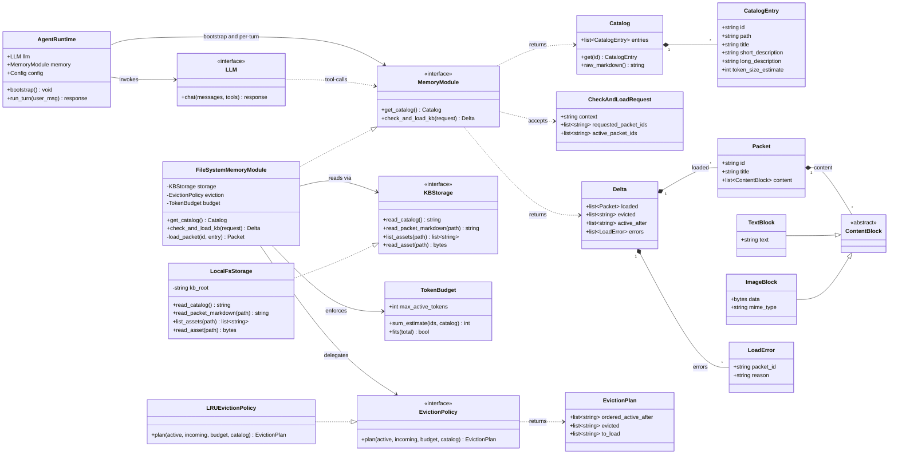

### 2.9.1 Class Responsibilities

| Class | Responsibility | Key references |
|---|---|---|
| `AgentRuntime` | Owns the conversation loop. On bootstrap calls `MemoryModule.get_catalog()` to inject the catalog into the system prompt (§2.7). On each user turn, invokes the LLM; forwards any `check_and_load_kb` tool calls to the memory module. | §1.9, §2.7, §2.10 |
| `LLM` (interface) | Abstract chat interface. Any concrete binding (Anthropic SDK, framework SDK) implements this. | §1.5 (framework-agnostic) |
| `MemoryModule` (interface) | The tool contract exposed to the LLM. Stateless across calls (D7). | §1.10, §2.3 |
| `FileSystemMemoryModule` | Concrete implementation. Composes a `KBStorage`, an `EvictionPolicy`, and a `TokenBudget`. Assembles `Packet` objects from storage-returned bytes. | §2.5, §2.6 |
| `KBStorage` (interface) | Backing-store abstraction. The seam that lets the KB move off local disk later (D4a). | §1.9, D4a |
| `LocalFsStorage` | Default implementation: reads catalog and packet files from a local KB root. | §2.1 |
| `Catalog` / `CatalogEntry` | Parsed catalog and per-packet metadata. `Catalog.raw_markdown()` returns the exact string for system-prompt injection. | §2.2 |
| `CheckAndLoadRequest` | Input DTO for `check_and_load_kb`. Carries `context`, `requested_packet_ids`, `active_packet_ids`. | §2.3.2 |
| `Delta` | Output DTO. Contains `loaded` (new content), `evicted` (IDs only), `active_after` (authoritative), and per-packet `errors`. | §2.3.2, D6 |
| `Packet` | A loaded packet: id, title, and an ordered list of `ContentBlock`s (metadata header text, packet markdown, and images). | §2.6 |
| `ContentBlock` / `TextBlock` / `ImageBlock` | Polymorphic content blocks. `ImageBlock` carries raw bytes + MIME type; runtime bindings render to their SDK's image format. | §2.6, D9 |
| `TokenBudget` | Holds `max_active_tokens`; sums per-entry `token_size_estimate` from the catalog. | §2.5 |
| `EvictionPolicy` (interface) | Decides which packets to evict when adding new ones would exceed budget. Pluggable — LRU is the default. | §2.5, D8 |
| `LRUEvictionPolicy` | Default: order candidates LRU, evict from head until `TokenBudget.fits()`. Produces an `EvictionPlan`. | §2.5 |
| `EvictionPlan` | Result of an eviction pass: `ordered_active_after`, `evicted` IDs, `to_load` IDs. Consumed by `FileSystemMemoryModule` to drive storage reads. | §2.5 |
| `LoadError` | Per-packet error (unknown ID, missing file, budget-exceeded). Bundled inside `Delta.errors` so partial success is representable. | §2.8 |

### 2.9.2 Extension Points

Three points in the class model are designed for substitution:

1. **`KBStorage`** — swap `LocalFsStorage` for `S3Storage`, `GitVersionedStorage`, `RemoteHttpStorage`, etc. Zero changes elsewhere.
2. **`EvictionPolicy`** — swap `LRUEvictionPolicy` for `LFUEvictionPolicy`, `PinnedFirstEvictionPolicy` (allow pinning a packet), or `TaskAwareEvictionPolicy` (weight by classification confidence).
3. **`LLM`** — bind to any framework or provider. `AgentRuntime` depends only on the `chat(messages, tools)` shape.

`MemoryModule` itself is also an interface, so in principle an alternative implementation (e.g., an in-process cache-only module wrapping another) could replace `FileSystemMemoryModule` without touching the agent.

## 2.10 Sequence Diagrams

**Diagram conventions.** To keep Mermaid syntax portable, message labels are short verbs, and structured data (packet ID lists, delta contents) is shown in `Note` blocks. No semicolons, brackets, or pipes appear inside labels or notes.

### 2.10.1 Cold start + first turn (additive load)

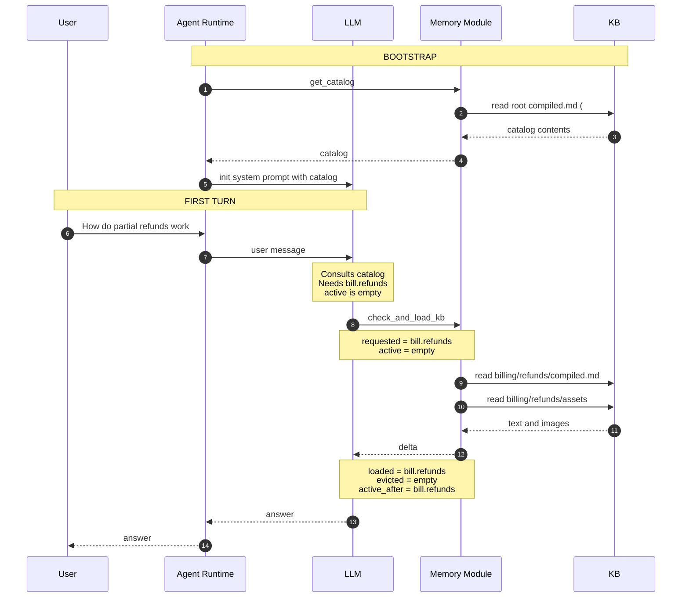

### 2.10.2 Follow-up turn — no reload needed

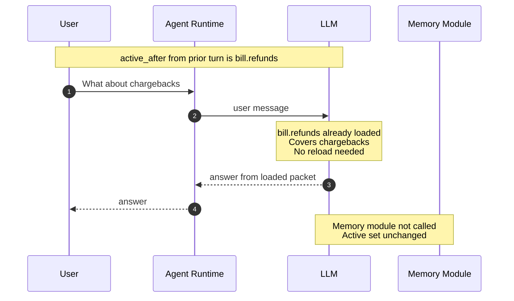

### 2.10.3 Follow-up turn — additive load within budget

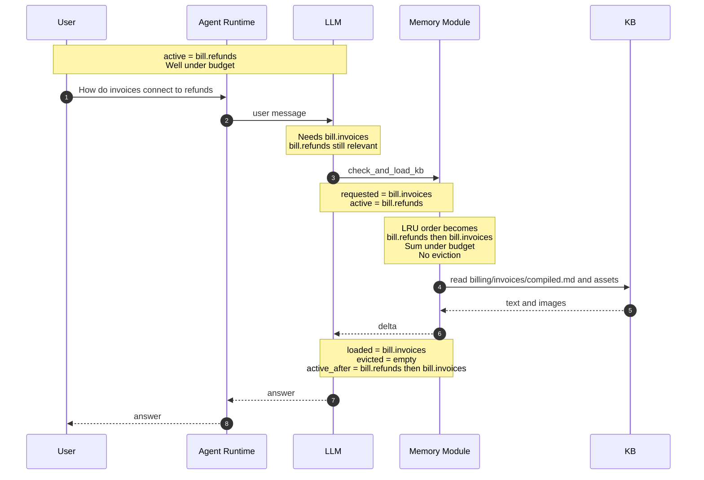

### 2.10.4 Follow-up turn — load with eviction

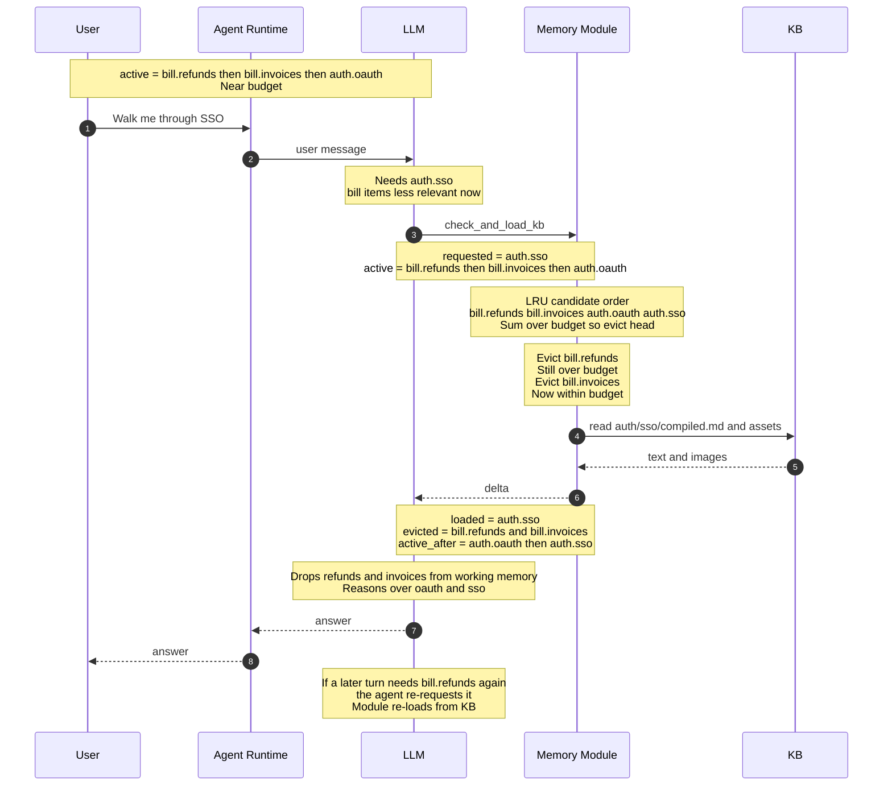

## 2.11 Observability

Observability has two independent layers:

1. **OTEL traces for AI observability** — *optional*, configuration-driven. When an OTEL exporter endpoint is configured, the agent emits distributed traces of turns, LLM calls, and tool calls. Consumers can point this at Langfuse, AWS CloudWatch, Grafana Tempo, Honeycomb, or any OpenTelemetry-compatible backend without code changes.
2. **Local file logging** — *always on*. Structured log lines at `DEBUG` / `INFO` / `WARN` / `ERROR` levels written to a local log file. Ensures that key decisions (which branch was classified, which packets loaded, which evicted, why) are followable post-hoc even when tracing is disabled.

### 2.11.1 Configuration

Observability is driven by configuration only — no code changes to switch backends.

| Config key | Type | Default | Effect |
|---|---|---|---|
| `otel.endpoint` | URL (string) | unset | If set, initialize OTEL SDK with an OTLP exporter pointing here. If unset, tracing is a no-op. |
| `otel.protocol` | `http/protobuf` or `grpc` | `http/protobuf` | OTLP transport. |
| `otel.headers` | map<string,string> | empty | Auth headers (e.g., Langfuse public/secret, AWS SigV4 side-car, bearer tokens). |
| `otel.service_name` | string | `hcag-agent` | `service.name` resource attribute. |
| `log.file_path` | path (string) | `./hcag.log` | Local log file destination. |
| `log.level` | `DEBUG` \| `INFO` \| `WARN` \| `ERROR` | `INFO` | Threshold for file logging. |
| `log.rotation` | struct (size/time) | size 50MB, keep 5 | Optional rotation policy. |

Example destinations:

- **Langfuse:** `otel.endpoint = https://cloud.langfuse.com/api/public/otel`, headers include the Langfuse public/secret key pair.
- **AWS CloudWatch (via ADOT):** `otel.endpoint = http://localhost:4318` pointing at a local ADOT collector, which forwards to CloudWatch.
- **Grafana Tempo / Honeycomb / any OTLP receiver:** point `otel.endpoint` at their OTLP ingest URL.

### 2.11.2 OTEL Trace Model

When enabled, the agent emits a span hierarchy per user turn. Spans follow OpenTelemetry **GenAI semantic conventions** where they exist and custom `hcag.*` attributes where they do not.

```
conversation.turn                              [span]
├─ attrs: turn.index, session.id, user.message.chars
│
├─ gen_ai.chat                                 [span] LLM call
│  ├─ attrs: gen_ai.system=anthropic,
│  │         gen_ai.request.model,
│  │         gen_ai.usage.input_tokens,
│  │         gen_ai.usage.output_tokens,
│  │         gen_ai.usage.cache_read_input_tokens
│  │
│  └─ tool.check_and_load_kb                   [span] tool call
│     ├─ attrs: hcag.tool.requested_ids,
│     │         hcag.tool.active_ids_in,
│     │         hcag.tool.context (truncated),
│     │         hcag.tool.loaded_ids,
│     │         hcag.tool.evicted_ids,
│     │         hcag.tool.active_ids_after,
│     │         hcag.tool.tokens_used,
│     │         hcag.tool.tokens_budget
│     │
│     ├─ kb.packet.load                        [span] per loaded packet
│     │  ├─ attrs: hcag.packet.id,
│     │  │         hcag.packet.path,
│     │  │         hcag.packet.markdown_bytes,
│     │  │         hcag.packet.image_count,
│     │  │         hcag.packet.token_estimate
│     │  └─ status: OK | ERROR (with error message)
│     │
│     └─ kb.eviction                           [span, only if evictions occurred]
│        └─ attrs: hcag.eviction.ids,
│                  hcag.eviction.reason=budget,
│                  hcag.eviction.tokens_reclaimed
│
└─ gen_ai.chat (final answer)                  [span]
   └─ attrs: gen_ai.usage.*
```

**Bootstrap-only span (once per conversation):**

```
memory.bootstrap                               [span]
└─ tool.get_catalog                            [span]
   ├─ attrs: hcag.catalog.entries,
   │         hcag.catalog.bytes
   └─ status: OK | ERROR
```

**Attribute policy.** Never put full packet content, full user messages, or full LLM outputs into span attributes — attributes are size-bounded and often sent unfiltered to third-party services. Truncate to a configurable byte cap (default 512 chars) and prefer IDs + sizes over payloads. Full payloads belong in the file log, at DEBUG.

### 2.11.3 Local File Logging

The file log is the **decision log**. Its job is to make it possible to reconstruct, after the fact, what the agent decided and why — without needing an OTEL backend running. It is always on.

**Levels and what belongs at each:**

| Level | What is logged |
|---|---|
| `ERROR` | Failures that abort a step or turn: catalog missing at startup, packet load failure, budget-exceeded on a single requested packet, tool contract violation. |
| `WARN` | Recoverable oddities: unknown packet ID skipped, image unreadable (packet still returned), unusually large delta, active-set thrash detected (N reloads within M turns). |
| `INFO` | Key decisions: bootstrap complete (catalog entries, bytes), turn start, `check_and_load_kb` call with counts (requested, active-in, loaded, evicted, budget), branch classification result (which domain/subdomain/topic the agent picked). |
| `DEBUG` | Full detail: catalog contents digest, per-packet metadata, full requested/active/loaded/evicted ID lists, per-packet token accounting, full tool arguments and results (subject to a max-size cap). |

**Format.** JSON-lines, one record per line, with fields: `ts` (ISO-8601), `level`, `event`, `session_id`, `turn`, `trace_id` (correlates with OTEL when enabled), and event-specific fields. Example:

```json
{"ts":"2026-08-23T14:22:07Z","level":"INFO","event":"check_and_load_kb.result","session_id":"s-abc","turn":3,"trace_id":"7f2a...","requested":["auth.sso"],"active_in":["bill.refunds","bill.invoices","auth.oauth"],"loaded":["auth.sso"],"evicted":["bill.refunds","bill.invoices"],"active_after":["auth.oauth","auth.sso"],"tokens_used":6820,"tokens_budget":8000}
```

**Correlation.** Every log record includes `trace_id` (and `span_id` where available). When OTEL is enabled, a support engineer can pivot from a log line to the corresponding trace in Langfuse / CloudWatch and vice versa.

### 2.11.4 What the Two Layers Together Answer

- **"Why did the agent load bill.refunds on turn 3?"** — INFO log has the classification decision and the requested IDs; DEBUG log has the reasoning context; OTEL span has the timing and token counts.
- **"Is the active set thrashing?"** — WARN log fires on excessive reload rate; OTEL dashboard shows load/evict spans per turn over time.
- **"Where is the token cost going?"** — OTEL `gen_ai.usage.*` attributes aggregated across `gen_ai.chat` spans; file log gives per-turn budget snapshots.
- **"Did prompt caching hit?"** — OTEL `gen_ai.usage.cache_read_input_tokens` per LLM span.


## 2.12 Prompt-Cache Alignment (realizing Problem 3)

The "classify once, reuse across steps" property in §1.1 and §1.2 only pays off if the prompt prefix that the model sees stays byte-stable across turns. Concrete implementation guidance:

1. **Stable system prompt.** The catalog is injected once at conversation start and does not change mid-session. If catalog re-inspection is needed, use the `get_catalog` tool (which appears as a per-turn tool result, not a system-prompt mutation).
2. **Stable tool-result blocks.** A prior `check_and_load_kb` response, once emitted into history, is never rewritten. Delta semantics (D6) guarantee this — subsequent calls append new tool results rather than modifying old ones.
3. **Deterministic packet serialization.** For a given packet ID, the module must emit byte-identical content (same metadata header, same markdown, same image ordering) across calls. Any nondeterminism (e.g., variable timestamps in headers) breaks caching.
4. **Cache-control markers.** In runtimes that expose them (e.g., Anthropic prompt caching), mark the system prompt and each `check_and_load_kb` tool result as a cache breakpoint. Combined with (1)–(3), this yields the 90%+ token-cost reduction on subsequent reasoning steps within the same task.
5. **Avoid unnecessary reloads.** The agent should not call `check_and_load_kb` "just to refresh" — every call that produces a delta (even an empty one) is a new tool-result block. D5 forbids this.

## 2.13 Tech Stack

Design decisions above are language-agnostic; this section pins the implementation choices. The overriding constraint: **the LLM is invoked through a provider-neutral library, not a vendor SDK**. This preserves D10 (framework-agnostic contracts) at the implementation layer and lets the same code target Anthropic direct today and AWS Bedrock (or others) tomorrow with only a config change.

### 2.13.1 Language and Runtime

- **Python 3.11+**
- Rationale: `tomllib` is stdlib (config parsing), mature OTEL SDK, first-class LiteLLM support, wide availability of tokenizers, natural fit for CLI + service in one package.

### 2.13.2 LLM Access — Provider-Neutral

**Chosen library: LiteLLM (`litellm`).**

LiteLLM exposes a single `litellm.completion(model, messages, tools, ...)` API that transparently dispatches to 100+ providers. Provider selection is a config-only switch — no code changes to move between Anthropic-direct and Bedrock.

| Provider | LiteLLM `model` string | Credentials source |
|---|---|---|
| Anthropic direct | `claude-3-5-sonnet-20241022`, `claude-3-5-haiku-20241022`, etc. | `ANTHROPIC_API_KEY` env var |
| AWS Bedrock (Anthropic models) | `bedrock/anthropic.claude-3-5-sonnet-20241022-v2:0` | Standard AWS credential chain (`AWS_ACCESS_KEY_ID`/`AWS_SECRET_ACCESS_KEY`/`AWS_REGION`, or IAM role) |
| AWS Bedrock (other models) | `bedrock/<vendor>.<model>` | Same |
| Ollama (local) | `ollama/llama3`, `ollama/mistral` | `OLLAMA_API_BASE` (default `http://localhost:11434`) |
| OpenAI-compatible (future) | `openai/<model>` with `api_base` | `OPENAI_API_KEY` |

**Consequences of the LiteLLM choice, relevant to HCAG:**

- **Tool use.** LiteLLM normalizes tool-call format across providers. HCAG's `get_catalog` and `check_and_load_kb` are defined once and work identically on Anthropic and Bedrock.
- **Prompt caching.** LiteLLM supports Anthropic's `cache_control` markers (§2.12); on Bedrock, prompt caching is enabled per Bedrock's own semantics. The HCAG runtime tags the system prompt and each `check_and_load_kb` tool-result block as cache breakpoints; LiteLLM forwards this to whichever provider is active.
- **OTEL integration.** LiteLLM emits GenAI-semantic-convention spans natively when the OTEL SDK is initialized; this satisfies most of §2.11.2's `gen_ai.chat` span layer with zero extra glue. HCAG adds only the `tool.*`, `kb.*`, `hcag.*` spans.

The runtime's `LLM` interface (§2.9) is bound to LiteLLM by a single thin adapter class — the rest of the code sees only the interface.

### 2.13.3 Configuration, CLI, Content, Tokenization

| Concern | Library | Notes |
|---|---|---|
| Config schema and validation | **Pydantic v2** | `hcag.toml` (CLI) and `agent.toml` (runtime) are loaded into typed models |
| TOML parsing | **`tomllib`** (stdlib) | Python 3.11+ |
| YAML front-matter in `compiled.md` | **python-frontmatter** + **PyYAML** | Reading and writing |
| CLI framework | **Typer** (built on Click) | Typed subcommands (`hcag preprocess`) |
| Tokenization (build-time estimates) | **tiktoken** (default, `cl100k_base` proxy) | Runtime never re-tokenizes; the design's `token_size_estimate` is read from catalog |
| Image MIME detection (CLI, optional) | **Pillow** | Runtime uses file extension only |

Markdown content is treated as opaque UTF-8 text; no markdown-parser dependency is required for the memory module. The CLI concatenates source `.md` files verbatim between separators, so no round-tripping through a markdown AST.

### 2.13.4 Observability

| Layer | Library | Notes |
|---|---|---|
| Traces | **`opentelemetry-api`**, **`opentelemetry-sdk`**, **`opentelemetry-exporter-otlp-proto-http`** | Initialized only when `otel.endpoint` is configured (§2.11.1). `otel.protocol=grpc` swaps to `opentelemetry-exporter-otlp-proto-grpc`. |
| File log | **stdlib `logging`** + custom JSON formatter | No extra dependency; JSON-lines format per §2.11.3 |
| GenAI spans | **LiteLLM native OTEL** | Emits `gen_ai.chat` spans with the usage attributes described in §2.11.2 |
| HCAG-specific spans | Direct OTEL SDK calls | `tool.*`, `kb.*`, `hcag.*` per §2.11.2 |

The two layers stay independent (§2.11): tracing may be disabled entirely; file logging is always on.

### 2.13.5 Testing and Packaging

- **Testing:** `pytest` + `pytest-mock`. LLM calls in tests are stubbed via a `FakeLLM` implementing the same `LLM` protocol as the LiteLLM adapter (see §2.9). No live network calls in the default test suite.
- **Packaging:** `pyproject.toml` with PEP 621 metadata. Package-manager-neutral (works with `uv`, `pip`, `poetry`). The `hcag` command is registered as a console script.

### 2.13.6 Dependency Summary

```
Required (runtime + CLI):
  litellm                                        # LLM provider abstraction
  pydantic>=2                                    # Config validation
  typer                                          # CLI
  python-frontmatter                             # compiled.md front-matter
  pyyaml                                         # YAML
  tiktoken                                       # Token estimation

Optional (feature-flagged by config):
  opentelemetry-api                              # tracing (enabled when otel.endpoint is set)
  opentelemetry-sdk
  opentelemetry-exporter-otlp-proto-http
  opentelemetry-exporter-otlp-proto-grpc         # only for otel.protocol=grpc
  pillow                                         # image MIME detection in CLI

Dev:
  pytest
  pytest-mock
```

### 2.13.7 Credentials

The provider is picked in config; the corresponding env vars must be present at runtime and CLI build time.

| Provider | Required env vars |
|---|---|
| **Anthropic direct** (default) | `ANTHROPIC_API_KEY` |
| **AWS Bedrock** | `AWS_ACCESS_KEY_ID`, `AWS_SECRET_ACCESS_KEY`, `AWS_REGION` — or an attached IAM role / AWS profile |
| Ollama / local | `OLLAMA_API_BASE` (optional; defaults to `http://localhost:11434`) |
| OpenAI-compatible (future) | `OPENAI_API_KEY` |

### 2.13.8 Deliberate Non-Dependencies

The implementation does **not** import these libraries, and the design forbids adding them at the LLM call site:

- **`anthropic`** — the vendor SDK. Adding it would tie HCAG to one provider and violate D10. LiteLLM handles Anthropic transparently.
- **`openai`** — same rationale.
- **`boto3` at the call site** — Bedrock is reached via LiteLLM, not by direct `boto3.client('bedrock-runtime')` calls in HCAG code. (`boto3` may appear transitively via LiteLLM's Bedrock backend; that transitive presence is acceptable because it does not leak into HCAG's own API surface.)
- **`langchain` / `llama-index`** — heavy retrieval frameworks. HCAG's retrieval pattern is agent-driven and controlled by the memory module (Part 2); a chain/graph framework would add layers without benefit here.

## 2.14 Open Questions / Future Work

1. **Catalog scaling.** If the catalog itself grows beyond a comfortable system-prompt size, we may need a summarized catalog + on-demand `get_catalog_entry(id)` tool. Deferred.
2. **Partial packet loading.** Packets are all-or-nothing today. If some packets become very large, section-level loading could be introduced without changing the tool surface (packet IDs would become `packet_id#section`).
3. **Cross-packet links.** Packets may reference each other by ID in prose; today the agent must interpret and re-request. A "referenced_ids" hint in the catalog could enable eager prefetch.
4. **Prompt-cache alignment.** Because delta responses do not retransmit stable packets, prior tool results remain byte-stable in history — good for prompt caching. Explicit cache-control markers on tool-result blocks may further improve hit rates; runtime-specific.
5. **Session persistence.** Currently the active set is implicit in the conversation history. A resumable-session feature would require serializing active-set IDs (not content).

---

# Part 3 — The `hcag` CLI Tool

## 3.1 Purpose

`hcag` is a command-line tool that transforms a **raw KB folder tree** — where subject-matter experts have dropped `.md` files and images according to a taxonomy of their choosing — into a **normalized KB** that the runtime memory module (Part 2) can serve directly. It standardizes:

- The **format** of `compiled.md` — the single per-folder artifact that carries both this level's own content and a catalog of its immediate children.
- The **metadata schema** each catalog entry must carry (id, path, title, short/long description, token estimate).
- The **layout** of every folder's assets (`compiled.md` + `assets/`).

This lets KB teams focus on the one thing that requires human judgment — extracting well-organized markdown from source documents — and delegates everything else (layout normalization, image relocation, metadata generation, catalog assembly) to the tool.

## 3.2 KB Input Model

Before `hcag` runs, the tree looks like whatever the KB team produced. Only three rules apply on input:

1. **Only markdown files (`.md`) and recognized image types** (`.png`, `.jpg`, `.jpeg`, `.gif`, `.webp`, `.svg`) contribute to the KB. Any other file encountered during preprocessing is **silently ignored** (a `WARN` is logged for observability). This lets teams keep incidental artifacts — `.DS_Store`, editor lock files, source documents like `.docx` / `.pdf` kept alongside extracted markdown, `README` notes, etc. — inside the KB tree without breaking the build.
2. **`compiled.md` is an HCAG-owned output artifact, never input.** If it exists in a folder from a prior run, it is ignored for input-classification purposes — its contents are never treated as source markdown to be merged. Preprocessing either regenerates it from the true sources or skips per the overwrite policy (§3.4.7); it does not concatenate it into a new artifact.
3. **The folder structure encodes the taxonomy.** Depth is unrestricted; there is no required schema for folder names beyond being valid filesystem names.

A **leaf** in taxonomy terms is a folder that contains at least one `.md` file — regardless of whether it also has subfolders. A **taxonomy node** is a folder that contains at least one subfolder.

**Every folder becomes a compiled unit.** A leaf folder's `compiled.md` carries its own content and an empty catalog section. A pure taxonomy node's `compiled.md` carries only a catalog section (summaries of its immediate children). A **mixed folder** — one that has both subfolders *and* source `.md` files at its own level — carries both. This is a first-class case, not an edge case: it lets a taxonomy node hold its own overview content (e.g., a `billing/` folder that contains `billing/refunds/`, `billing/invoices/`, **and** a top-level `billing.md` overview all in one `compiled.md`).

Example raw KB before `hcag preprocess`:

```
raw_kb/
├── billing/
│   ├── overview.md
│   ├── glossary.md
│   ├── billing_ecosystem.png
│   ├── refunds/
│   │   ├── refund_policy.md
│   │   ├── refund_states.md
│   │   ├── flow.png
│   │   └── state_machine.png
│   └── invoices/
│       ├── invoicing.md
│       └── layout.png
└── auth/
    ├── oauth/
    │   └── oauth_spec.md
    └── sso/
        ├── sso_intro.md
        ├── sso_flows.md
        └── sso_seq.png
```

## 3.3 CLI Overview

A single subcommand does the full build in one pass:

| Command | Purpose |
|---|---|
| `hcag preprocess <root>` | Walks the tree in **DFS post-order**. At every folder — leaf, taxonomy node, or mixed — assembles one `compiled.md` that concatenates a catalog section (summaries of immediate children, using the summaries the DFS recursion just returned from those children) with the folder's own source content. Images are copied into a per-folder `assets/`. Recursion bubbles each folder's summary up to its parent so the parent's catalog section has fresh metadata to render. The root folder's `compiled.md` is written on the way back out — no separate aggregate pass needed. |

**Design decisions embedded in this structure:**

- One pass, not two. Because DFS naturally returns each child's assembled summary to its parent, a single traversal can populate every level's catalog section without a second top-down walk. The old two-command pipeline (`preprocess` → `aggregate`) is folded into `preprocess`; see §3.5 for the migration note.
- Every folder is loadable. The old design gave taxonomy nodes a `catalog.md` and leaves a `packet.md` — two distinct file kinds that different code paths handled. With one `compiled.md` per folder, the memory module (§2.6) has exactly one file to open at any level and the runtime treats every folder as a first-class loadable unit.
- No `hcag build` super-command needed. `hcag preprocess raw_kb` is the whole build. Editorial edits to a subtree re-run `preprocess` scoped with `--only <subpath>` (§3.4.7).

## 3.4 `hcag preprocess` — Detailed Semantics

### 3.4.1 DFS traversal

The tool walks the tree with a **depth-first, post-order** traversal — children before parents, siblings in alphabetical order for determinism. The recursion returns each folder's assembled *summary record* (id, title, short + long description, token estimate) to its caller, so a parent has every child's fresh metadata in hand at the moment it composes its own `compiled.md`. This is what lets one pass do the whole job — the old bottom-up `preprocess` step used to prepare per-level intermediates that a separate top-down `aggregate` step then rolled up; the DFS return channel replaces the intermediate handshake.

Pseudocode:

```
def process(folder):
    child_summaries = []
    for sub in sorted(folder.subdirs):
        child_summaries.append(process(sub))          # DFS recursion
    own_content     = assemble_own_content(folder)    # concat source .md + copy images
    catalog_section = render_catalog(child_summaries) # from children's returned records
    write_compiled_md(folder, catalog_section, own_content)
    return summarize(folder)                          # bubble up to parent
```

The root folder is the outermost call — its `compiled.md` is written last and carries the top-level catalog section plus any root-level own content. There is no separate "root catalog" file.

### 3.4.2 Per-folder classification

For each folder `F` encountered:

1. Let `has_md = any .md file directly in F (excluding generated compiled.md)`
2. Let `has_subdirs = any subdirectory of F`
3. Classify:
   - `has_md AND NOT has_subdirs` → **leaf**: `compiled.md` has content only (catalog section is empty).
   - `has_subdirs AND NOT has_md` → **taxonomy node**: `compiled.md` has catalog section only (own-content section is empty).
   - `has_md AND has_subdirs` → **mixed**: `compiled.md` has both sections.
   - Neither → skip with WARN.

The classification decides which sections of `compiled.md` are populated; every folder in the first three cases gets exactly one `compiled.md`.

### 3.4.3 `compiled.md` assembly

For every folder that classifies as leaf, taxonomy node, or mixed, produce one `compiled.md`:

1. **Collect source .md files** in stable order (lexicographic by filename). Only true source `.md` files count — `compiled.md` is an HCAG-owned output artifact and is **excluded from the source set** even if present in the folder (§3.2 rule 2). Skip only if `compiled.md` already exists from a prior run AND `--force` is not set.
2. **Copy all images** at this folder's own level (referenced or not — see §3.4.6) into `F/assets/`. The originals are left in place. Rewrite every image reference in the concatenated content to `assets/<filename>`.
3. **Compute the folder's summary record** (via LLM per §3.4.4). This is the record that `process()` returns to the parent's DFS call so the parent's catalog section can render an entry for this folder.
4. **Emit `compiled.md`** with the shape below. The header carries the folder's own metadata; the `## Sub-topics` section carries the catalog of immediate children; the `## Content` section carries the concatenated source markdown.

   ```markdown
   <!-- HCAG:COMPILED id=billing -->
   ---
   id: billing
   title: <LLM-generated title for this level>
   short_description: <LLM-generated one-liner>
   long_description: <LLM-generated 2–4 sentences>
   token_size_estimate: <computed on the assembled compiled.md + image count>
   kind: mixed            # leaf | node | mixed
   source_files:
     - overview.md
     - glossary.md
   children:
     - billing.refunds
     - billing.invoices
   ---

   # <title>

   <short_description>

   ## Sub-topics

   ### `billing.refunds`
   - **path**: `refunds/`
   - **title**: Refund Processing
   - **short**: How refunds are issued, states, and edge cases.
   - **long**: Covers the full refund lifecycle…
   - **tokens**: 3420

   ### `billing.invoices`
   - **path**: `invoices/`
   - **title**: Invoice Generation
   - **short**: …
   - **long**: …
   - **tokens**: 2810

   ## Content

   <content of overview.md, image refs rewritten to assets/…>

   ---

   <content of glossary.md, image refs rewritten to assets/…>
   ```

   For a pure leaf (no subfolders), the `## Sub-topics` section is omitted. For a pure taxonomy node (no own `.md`), the `## Content` section is omitted. Frontmatter `kind` reflects the classification.

5. **Preserve the original source files.** After assembly, the source `.md` files and the original image files remain untouched at their locations; they are the KB team's authoring surface and the source of truth for future re-runs. `compiled.md` and everything under `assets/` are derived artifacts. On the next `hcag preprocess --force`, the sources are re-read and both are regenerated.
6. **Compute token size estimate** on the final `compiled.md` + image count using a configured tokenizer (see §3.6). Store in front-matter.
7. **Return the folder's summary** to the DFS caller so the parent can render its own `## Sub-topics` entry for this folder.

### 3.4.4 Catalog section content

The `## Sub-topics` section is what makes a folder's `compiled.md` navigate-able. Its content is derived from the summary records returned by the DFS recursion — one entry per immediate child (leaf, taxonomy node, or mixed alike). Every entry carries the same fields regardless of the child's classification: `path`, `title`, `short`, `long`, `tokens`.

The folder's own `title`, `short_description`, and `long_description` (used by the parent to render **its** catalog entry for **this** folder) are **LLM-generated** from the concatenation of:

- this folder's own content (if any), and
- the short descriptions of its immediate children (if any).

For a leaf folder the summary is drawn from the folder's own content alone. For a taxonomy node it is drawn from the children's short descriptions alone. For a mixed folder it is drawn from both. This bubble-up logic gives every level's summary meaningful roll-up prose — the root's `compiled.md` describes the KB in aggregate; a mid-tree folder describes its branch in aggregate; a leaf describes itself.

### 3.4.5 Packet ID scheme

Every folder — leaf, taxonomy node, mixed, or root — has an ID that is the **dotted path from the KB root**, using folder names as segments.

- `raw_kb/billing/refunds/` → id `billing.refunds`
- `raw_kb/auth/sso/` → id `auth.sso`
- `raw_kb/billing/` (mixed folder) → id `billing`
- `raw_kb/` (root) → id `` (empty string, or `_root` if a non-empty ID is required by a downstream consumer; configurable via `--root-id`)

Because there is now only one artifact per folder, the historical collision between a mixed folder's packet ID and its taxonomy-node ID is gone; the previous `--mixed-suffix` flag is no longer needed.

**Rationale:** Human-readable, stable as long as folder names are stable, computable without any state. Changing folder names is a deliberate ID-change operation.

### 3.4.6 Asset policy

- **All images at a folder's own level are copied into that folder's `assets/`**, whether referenced by any MD or not. Originals are **not** moved or deleted — they remain at their authored location. Rationale: images the KB team dropped into a folder are intentional even if not yet linked; keeping a copy in `assets/` ensures they travel with the `compiled.md` at load time, while preserving the original preserves the authoring workflow and lets re-runs regenerate `assets/` from source.
- **External references** (an MD referencing `../other/img.png`) are resolved: the image is copied into the current folder's `assets/` and the reference rewritten. The original at the external path is untouched. A WARN is logged because an external reference usually indicates the source content was authored assuming a different layout.
- **Non-MD, non-image files** are **silently ignored** — the file is left in place, a `WARN` log line records what was skipped (path + reason), and preprocessing proceeds. Rationale: KB teams often keep original source documents (`.docx`, `.pdf`), editorial notes (`README`), or OS metadata (`.DS_Store`, `Thumbs.db`) inside the tree; failing the build over them is more disruptive than useful. The runtime never sees these files because the memory module reads only `compiled.md` and files under `assets/`.

### 3.4.7 Overwrite policy

Default: **skip folders that already contain a generated `compiled.md`** (identified by the `<!-- HCAG:COMPILED -->` marker). This protects re-runs from clobbering hand-edits.

- `--force` regenerates unconditionally.
- `--only <subpath>` restricts preprocessing to a subtree — useful for iterating on one branch. Ancestors above the subpath are still re-emitted at the end of the run so their catalog sections pick up the changed child summaries; the DFS traversal handles this naturally.

If a `compiled.md` file exists without the HCAG marker, the tool errors — it will not overwrite what it did not create.

### 3.4.8 Failure modes

| Condition | Behavior |
|---|---|
| Non-MD/non-image file present | WARN, ignored, preprocessing continues. |
| Folder with no `.md` and no subfolders | WARN, skip. Parent's catalog section records the folder as empty. |
| LLM call fails for a folder | ERROR for that folder; DFS continues with siblings; the failed folder's summary falls back to `title = <folder-name>, short = "(summary unavailable)"` so the parent's catalog section still renders. Final exit non-zero if any folder failed. |
| Image referenced by MD but not found | WARN, leave the (broken) reference in `compiled.md`. |
| Existing `compiled.md` without HCAG marker | ERROR — refuses to clobber hand-written content. |
| Cycle detected via symlink | ERROR at startup — DFS won't recurse into it. |

## 3.5 Aggregation (folded into `preprocess`)

The prior design had a separate `hcag aggregate` subcommand that ran after `preprocess` to merge per-level `catalog.md` intermediates into a root `catalog.md`. With the DFS-based single-artifact design, aggregation happens implicitly on the recursion's return path: each folder's summary bubbles up to its parent, and the root folder's `compiled.md` is the final write of the traversal. No separate command exists in the current CLI.

Callers migrating from the old pipeline should replace `hcag preprocess raw_kb && hcag aggregate raw_kb` with a single `hcag preprocess raw_kb`. The runtime memory module (§2.7) now reads `<root>/compiled.md` at bootstrap and injects its catalog section into the system prompt — there is no separate root catalog file.

## 3.6 Configuration

`hcag` reads a config file (`hcag.toml` or `hcag.yaml`) at the KB root, or accepts flags:

```toml
[llm]
provider = "anthropic"            # anthropic | openai | bedrock | ollama | llamacpp
model    = "claude-haiku-4-5"     # provider-specific model id
api_key_env = "ANTHROPIC_API_KEY" # env var to read
endpoint = ""                     # override for local/self-hosted (Ollama, llama.cpp)

[llm.prompts]
# Paths to prompt template files, overridable
folder_metadata  = "prompts/folder_metadata.md"   # summarizes a folder for its parent's catalog

[tokenizer]
kind = "tiktoken"                 # tiktoken | anthropic | rough
# "rough" = chars/4 heuristic; "tiktoken" and "anthropic" call the real tokenizer

[compiled]
root_id = "_root"                 # id to use for the root folder if it needs a non-empty one

[log]
file_path = "./hcag-build.log"
level     = "INFO"
```

**Local model support.** The `[llm]` block accepts `provider = "ollama"` or `provider = "llamacpp"` with a local `endpoint`. This lets KB teams without cloud credentials build a KB against a locally-hosted model. Metadata quality varies with model choice.

## 3.7 Generated File Format — Summary

### `compiled.md` (per folder — leaf, taxonomy node, mixed, and root alike)

- HTML comment marker: `<!-- HCAG:COMPILED id=<dotted-id> -->`
- YAML front-matter: `id`, `title`, `short_description`, `long_description`, `token_size_estimate`, `kind` (`leaf` | `node` | `mixed`), `source_files` (empty for a pure taxonomy node), `children` (empty for a pure leaf).
- Body:
  - `# <title>` heading and `<short_description>` preamble.
  - `## Sub-topics` — one section per immediate child with its own summary record. Omitted for pure leaves.
  - `## Content` — concatenated source markdown, with image refs rewritten to `assets/<name>`. Omitted for pure taxonomy nodes.
- **The root folder's `compiled.md` is the file the runtime memory module's `get_catalog` returns** (§2.7). Its `## Sub-topics` section describes the top-level branches; deeper folders' `compiled.md` files are loaded on demand via `check_and_load_kb` (§2.3.2).

## 3.8 End-to-End Workflow

```
1. KB team drops raw .md and image files into taxonomy folders.
   $ ls raw_kb/billing/refunds/
     refund_policy.md  refund_states.md  flow.png  state_machine.png

2. Run preprocess (single DFS pass — writes compiled.md at every folder,
   including the root).
   $ hcag preprocess raw_kb/

3. Point the runtime memory module at raw_kb/ (now normalized).
   The agent's get_catalog will serve raw_kb/compiled.md; check_and_load_kb
   pulls deeper folders' compiled.md files on demand.
```

**Re-run after editorial edits:**

```
# Edit refund_policy.md, add a new section
$ vim raw_kb/billing/refunds/refund_policy.md   # edit sources and re-run
$ hcag preprocess raw_kb/ --only billing/refunds/ --force
# The DFS walk regenerates billing/refunds/compiled.md and then re-emits
# every ancestor's compiled.md so their `## Sub-topics` sections pick up
# the changed child summary — no separate aggregate step needed.
```

## 3.9 Observability (CLI)

`hcag` writes a build log to the path in `[log]` config (default `./hcag-build.log`), using the same JSON-lines format as the runtime file log (§2.11.3). Levels:

- `INFO`: pass start/end, per-folder classification, LLM call summary, per-folder token estimate, catalog-section entry counts.
- `DEBUG`: full LLM prompts and responses, full front-matter written, file moves.
- `WARN`: skipped folders, external image references, unreferenced images copied, non-.md/non-image files ignored.
- `ERROR`: aborts (see failure-mode table in §3.4.8).

The CLI also honors the `OTEL_EXPORTER_OTLP_ENDPOINT` env var: if set, build spans (`hcag.preprocess.folder`, `hcag.llm.call`) are exported for build-time observability. This is symmetric with §2.11 — runtime and build tooling share the same observability model.

## 3.10 Non-Goals for the CLI

- **Content editing.** `hcag` does not rewrite the meaning of source markdown; it only concatenates, moves images, and adds metadata front-matter.
- **Vector embedding generation.** Explicitly not produced; HCAG retrieval is taxonomic, not embedding-based (§1.1).
- **Runtime hot-reload.** The CLI is a build tool. Runtime picks up new artifacts on next agent bootstrap; no watcher.
- **KB validation beyond schema.** Fact-checking, link-checking across folders, and stale-content detection are separate concerns.

## 3.11 Sequence Diagram

One DFS post-order pass over a two-level tree (root with two children, one of them itself a mixed folder with a leaf child). Note how every `_process_folder` call returns a `FolderSummary` to its caller — that's the return channel the parent uses to render its `## Sub-topics` section, and it's what makes a separate `aggregate` step unnecessary (§3.5).

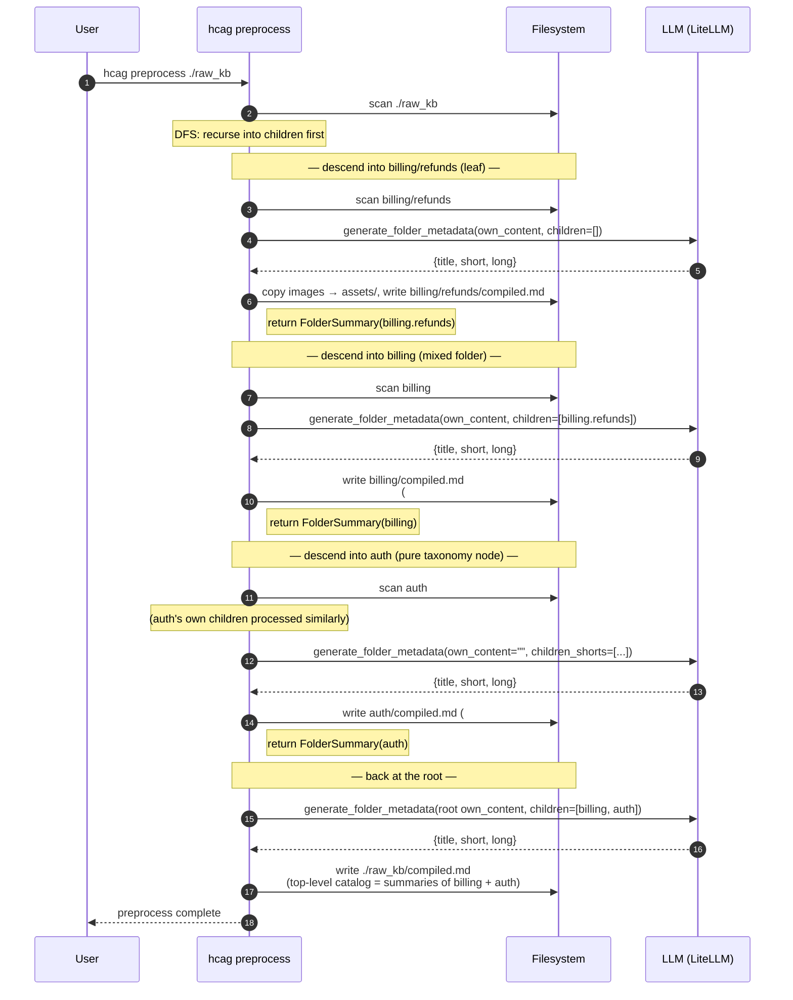

---

# Part 4 — The `crawl` CLI Tool

## 4.1 Purpose

`crawl` takes a set of seed URLs and builds a local Markdown knowledge base from the pages they lead to. Each seed is fetched, converted to Markdown, and its outbound links are followed recursively — staying within the site regions defined by the seed URL prefixes. The output is a local `./kb/` tree whose directory shape mirrors the domains and URL paths of the crawled sites, ready to hand to `hcag preprocess` (Part 3) as raw KB input.

## 4.2 Invocation

```
$ crawl --depth <N> <seed_url> [<seed_url> ...]
```

- `<seed_url>` — one or more starting URLs. Each seed defines both a starting point and a prefix scope (§4.3.1). At least one seed is required.
- `--depth <N>` — maximum link-following depth from any seed. `N=0` fetches only the seed documents themselves; `N=1` also fetches documents reachable in one hop from a seed; and so on.

Output is written under `./kb/` in the current working directory (§4.5).

## 4.3 Traversal Semantics

### 4.3.1 Seed prefix scope

Each seed URL doubles as a **prefix scope**. A discovered link is followed only if its URL begins with the same string as at least one of the seed URLs. This keeps the crawl inside the sites and subpaths the operator explicitly named, and prevents it from escaping to unrelated domains or wandering up to parent paths.

- A seed of `https://docs.example.com/api/v2/` allows following `https://docs.example.com/api/v2/auth.html` but **not** `https://docs.example.com/api/v1/anything` (different subpath) or `https://blog.example.com/…` (different subdomain).
- With multiple seeds, the allowed set is the union of their prefixes: a link is in scope if it matches **any** seed's prefix.

Rationale: the seed set defines both *where to start* and *what belongs in the KB* with a single knob — the operator does not have to state the site boundary a second time.

### 4.3.2 Visited-URL tracking

`crawl` maintains a set of every URL it has already fetched. If a link resolves to a URL already in that set, it is skipped — neither re-fetched nor recursed into. Every in-scope URL is therefore fetched and converted at most once per invocation, and cycles between pages cannot cause repeat work or infinite loops.

### 4.3.3 Depth

The seed URL sits at depth `0`. A document reached by following a link from a depth-`k` document is at depth `k+1`. Links discovered *inside* a document whose depth equals `--depth` are **not** followed; the document itself is still fetched, converted, and written, but no further descent occurs from it.

## 4.4 Document Types

### 4.4.1 HTML

HTML pages are fetched, parsed, and converted to Markdown. The links to follow are the `href` values of `<a>` elements in the document. Relative hrefs are resolved against the fetched document's URL before the prefix-scope check (§4.3.1).

### 4.4.2 PDF

Linked `.pdf` documents are treated as first-class pages: fetched, converted to Markdown (extracted text with document structure preserved), and written to the same layout as HTML output. PDFs do not contribute outbound links for further traversal.

### 4.4.3 Images

Images embedded in HTML pages (``) and images embedded inside PDF documents are extracted and saved as separate files alongside the Markdown output (§4.5). Every image reference in the generated Markdown is rewritten to point at the local saved file rather than the original remote URL, so the Markdown renders correctly offline.

Images are content of their containing document, not link targets: they are neither depth-counted nor prefix-checked.

## 4.5 Output Layout

Output is rooted at `./kb/`, with the domain as the first path segment and the URL path preserved below it. For a page at `https://webdomain/topic-domain/topic/subtopic/something.html`:

- Markdown goes to `./kb/webdomain/topic-domain/topic/subtopic/something.md`.
- An embedded image named `apple.jpg` goes to `./kb/webdomain/topic-domain/topic/subtopic/something-apple.jpg`.

Rules:

- **Domain first.** Content from different sites lands in distinct top-level folders under `./kb/`, so multiple seed domains stay cleanly separated.
- **Path preservation.** Below the domain, the directory structure mirrors the URL path, so the shape of the source site is legible in the output tree.
- **Extension.** Output Markdown always uses the `.md` extension, regardless of the source (`.html`, `.htm`, `.pdf`, or a directory-index URL that ends with `/`).
- **Image naming.** Each extracted image is written with a filename of the form `<document-basename>-<image-name>`. Prefixing with the source document's basename guarantees that identically-named images extracted from different pages do not collide when they land in the same directory.

## 4.6 Relationship to `hcag`

`crawl` produces the raw markdown-and-image tree that `hcag preprocess` (§3.4) consumes. The two tools compose end-to-end:

```
$ crawl --depth 3 https://docs.example.com/api/
$ hcag preprocess kb/
```

`crawl` is responsible only for turning a set of remote sites into a mirrored local Markdown tree. It does not classify folders, produce `compiled.md`, call an LLM, or make any decisions about the KB's taxonomy — those remain `hcag`'s job.

## 4.7 Observability (CLI)

`crawl` emits a log line for every meaningful event during a crawl — each URL fetched, each Markdown document written, each image extracted, and each candidate link that was skipped — using the same JSON-lines format as the rest of the toolchain (§2.11.3, §3.9). This makes a completed crawl auditable after the fact: given the log, an operator can reconstruct exactly which URLs were visited, which were skipped and why, and which files ended up in `./kb/`.

**Configuration.** The log path defaults to `./crawl.log` and can be overridden with `--log-file <path>`. Level is controlled with `--log-level {debug,info,warn,error}` (default `info`). If `OTEL_EXPORTER_OTLP_ENDPOINT` is set, spans (`crawl.fetch`, `crawl.convert`, `crawl.image.extract`) are also exported, matching the observability model used by the runtime (§2.11) and by `hcag` (§3.9).

**Levels.**

- `INFO`:
  - Crawl start line with the resolved seed list, `--depth`, and the output root.
  - One line per fetched document: URL, depth, content type, byte size, elapsed fetch time, and the output Markdown path.
  - One line per extracted image: source document URL, remote image URL, and the local file path written under `./kb/`.
  - Crawl end summary: totals for pages fetched, pages converted, images extracted, links skipped (out-of-scope / already-visited), wall-clock elapsed, and log-level counts.
- `DEBUG`:
  - HTTP request/response headers, redirect chains, and retry attempts.
  - Markdown-conversion internals (heading count, link count, image count per document) and PDF-extraction internals (page count, image count).
  - For each page, the full list of `<a href>` values discovered, each tagged with its disposition: `queued`, `skipped:out-of-scope`, `skipped:visited`, or `skipped:depth-cap`.
- `WARN`:
  - Fetch returned a non-2xx status for an in-scope URL (URL is dropped, siblings continue).
  - Fetched content type is neither HTML nor PDF (URL is dropped).
  - Image extraction failed for a specific asset — the containing page is still written; the image reference is left pointing at the original remote URL and flagged in the log.
  - `href` value could not be parsed or resolved against the base URL.
  - Redirect chain exceeded the safety cap and was terminated.
  - Output path collision detected and resolved by disambiguation (e.g., two URLs mapping to the same local filename).
- `ERROR`:
  - Crawl cannot start: no valid seeds, seed URL malformed, or `./kb/` not writable.
  - Fetch aborted after retries due to network failure or timeout.
  - Fatal I/O error while writing Markdown or an image file.

If any `ERROR`-level event is logged during a run, `crawl` exits with a non-zero status; `WARN`-level events do not affect exit status but are reflected in the end-of-run summary.

## 4.8 Non-Goals

- **Content editing.** `crawl` does not rewrite prose, summarize pages, or filter noise; the HTML/PDF → Markdown conversion is mechanical.
- **JavaScript execution.** Only the initial fetched HTML is parsed. Pages whose content is constructed client-side are captured only to the extent that content is present in the server-rendered response.
- **Auth-gated content.** Login flows, cookies, and custom headers beyond a plain fetch are out of scope.
- **Non-HTML, non-PDF assets.** Videos, archives, and other binary formats are neither followed as links nor mirrored into `./kb/`.
- **Incremental re-crawl.** Each invocation fetches every in-scope URL once; change detection and freshness re-crawling are not provided.

## 4.9 Sequence Diagram

Prefix-scoped BFS starting from one seed. Every popped URL is filtered through three skip decisions (visited-dedup, depth-cap, out-of-scope) before a fetch; every fetched page contributes both a Markdown file and zero-or-more extracted images to `./kb/`, plus any in-scope outbound links back to the queue.

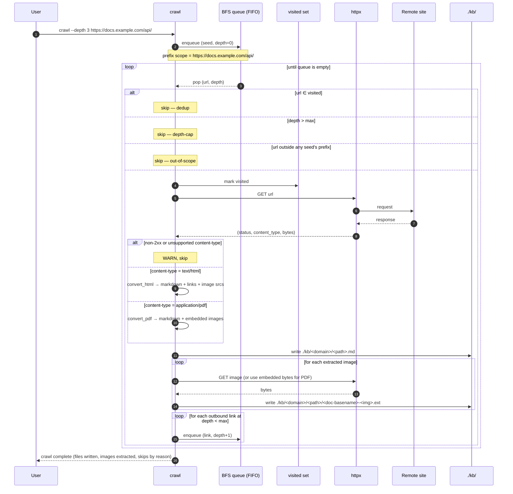

# Part 5 — Voice Agent (LiveKit)

## 5.1 Purpose

A real-time voice interface to the HCAG agent, embeddable on a website. The user speaks; the agent transcribes, reasons over the HCAG active set, and speaks the answer back — with the running transcript and the streaming assistant response rendered live in the browser.

Two properties matter beyond the baseline agent (§1.4):

1. **Fast first-turn latency.** A voice conversation cannot afford a cold-start `check_and_load_kb` round trip on the user's first sentence. The voice session is therefore started with a **configured set of initial packet IDs** that are loaded into the active set before the room opens (§5.4.1), so the very first user turn already has the relevant knowledge in memory.
2. **Sub-second inter-turn latency.** After the first turn, subsequent LLM calls must ride the prompt cache. The voice session issues a synthetic **cache warm-up call** immediately after packet loading (§5.4.2), so the prefix that all real turns will share is committed to the provider's prompt cache before the user starts talking.

## 5.2 Component Boundary

The voice agent **wraps** the runtime defined in Parts 1–2 rather than replacing it. Everything about the HCAG active-set protocol (§2.4), token budget (§2.5), packet loader (§2.6), and prompt-cache alignment (§2.12) is reused verbatim. The voice layer adds:

- A **LiveKit worker process** that joins a LiveKit room per user session.
- A **STT adapter** (Deepgram or ElevenLabs) that streams partial and final transcripts from the user's audio track.
- A **TTS adapter** (ElevenLabs or Deepgram) that streams synthesized audio from assistant text back to the room.
- A **transcription publisher** that mirrors both sides of the conversation onto a LiveKit text/data channel so the browser can render live captions and streaming assistant text.
- A **web client** (LiveKit JS SDK) that publishes the mic track, subscribes to the agent's audio track, and renders the transcription channel.

The `AgentRuntime`, `MemoryModule`, and `compiled.md` artifacts are unchanged. Swapping the voice front-end for a text front-end does not touch the reasoning path.

### 5.2.1 Voice Class Diagram

Extends the core class diagram (§2.9). `VoiceSession` is the new orchestrator; it composes an `AgentRuntime` (reused verbatim) with an `STTAdapter`, a `TTSAdapter`, and a `TranscriptionPublisher`. The two startup phases (§5.4.1, §5.4.2) are pure functions that operate on a runtime — modeled here as free-standing operations rather than methods so they can be exercised independently in tests and in the `dry-run` CLI (§5.9).

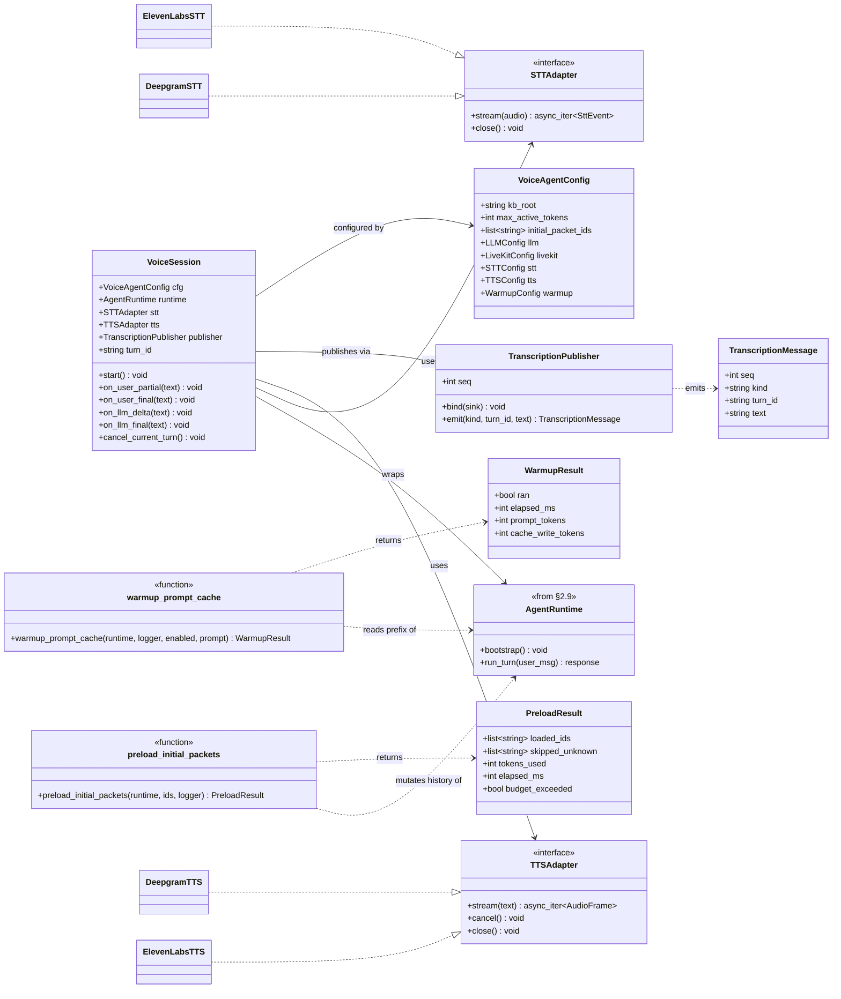

**How this composes with §2.9.** `AgentRuntime`, `MemoryModule`, `Catalog`, `Delta`, and the packet loader are unchanged — they appear in this diagram only where `VoiceSession` reaches into them. Every real-turn call still goes through `AgentRuntime.run_turn`, so §2.10's sequence diagrams apply to the reasoning path even inside a voice session.

## 5.3 Real-Time Architecture

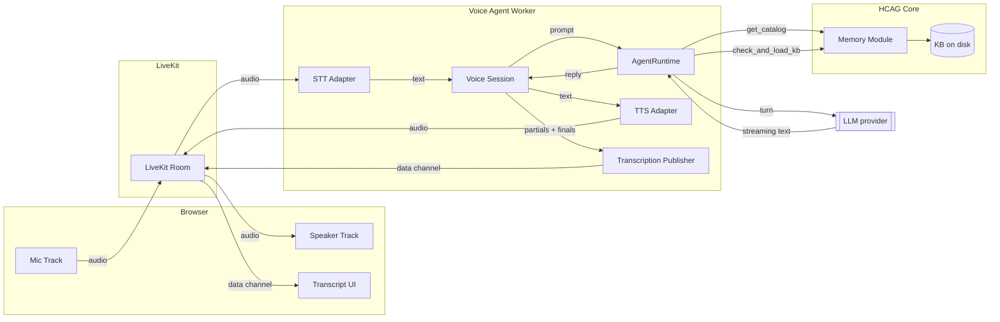

**One worker per session.** A new LiveKit room implies a new worker instance holding its own `AgentRuntime`, its own active set, and its own STT/TTS stream handles. Cross-session state is not shared (each user's classification and packet load are independent).

## 5.4 Session Startup

Session startup runs to completion before the browser is allowed to send audio. Its two phases are ordered:

### 5.4.1 Warm-start with initial packets

The voice agent accepts an ordered list of packet IDs — `initial_packet_ids` — via config (§5.8) or CLI (§5.9). Before opening the room to input:

1. Instantiate `AgentRuntime` with the standard bootstrap (§2.7): read the root `compiled.md`'s `## Sub-topics` section (top-level catalog), inject into the system prompt.
2. For each ID in `initial_packet_ids`, call `memory_module.check_and_load_kb(requested=[id], active=<current>)` and apply the returned delta exactly as an in-turn call would. This produces a byte-identical sequence of tool-result blocks in history — the same shape a normal turn would create — so the cache-alignment rules (§2.12) apply unchanged.
3. If the union of initial packets exceeds `MAX_ACTIVE_TOKENS`, startup fails with an explicit error (`errors[].reason = "BudgetExceeded"`). Voice sessions do not silently drop preloads — the operator misconfigured the initial set.
4. Unknown packet IDs are logged as `voice.startup.unknown_packet` WARN entries and skipped; startup continues with the remainder. Rationale: an outdated deploy config should not brick the room.

The initial-packet list is a **classification hint**, not a policy override. Nothing prevents the agent from calling `check_and_load_kb` mid-conversation to load additional branches; the preload only guarantees that the *first* user sentence lands on a warm active set.

### 5.4.2 Prompt-cache warm-up call

After initial packets are loaded, the voice agent issues a synthetic LLM call whose sole purpose is to commit the shared prefix to the provider's prompt cache:

```
system: <static prefix> + <catalog> + <preload tool-result blocks>
user:   "Ready. Await user turn."
```

with `cache_control` breakpoints placed at the end of the system block and after each preload tool-result block (§2.12). The response is discarded. The provider now holds a cache entry keyed on the exact prefix that every real turn in this session will share, so the first real turn incurs a cache hit rather than a full-prefix read.

**Ordering matters.** The warm-up call must run *after* §5.4.1 — the byte-stable prefix is only defined once the initial packets have been folded in. Running it earlier caches a prefix the real turns will never send, wasting the write.

**Cost accounting.** The warm-up call is a full-prefix cache *write*, priced above a cold prompt at most providers. It is paid once per session and amortizes across every subsequent turn. If a session ends before the first real turn, the write is a loss; §5.10 tracks this as `voice.warmup.wasted` for tuning.

### 5.4.3 Startup Sequence Diagram

The two-phase startup, end-to-end. The room is created up front but the browser is told to wait until `system.ready` is emitted — nothing from the mic is transported to the STT adapter before the cache is primed.

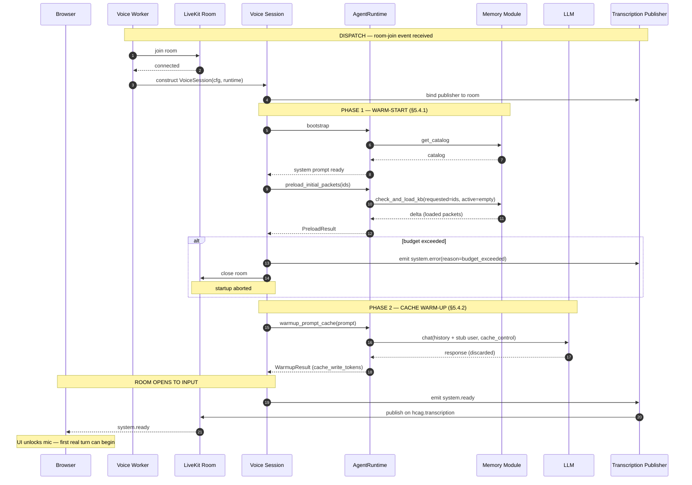

Failure paths are explicit: an unknown packet ID logs `voice.startup.unknown_packet` and continues (step 8 loops on the remaining IDs); a budget-exceeded delta shortcuts to `system.error` and closes the room; a warm-up call that errors is a WARN, not a fatal — the session proceeds without a primed cache (first real turn eats the full-prefix read).

## 5.5 Real-Time Turn Pipeline

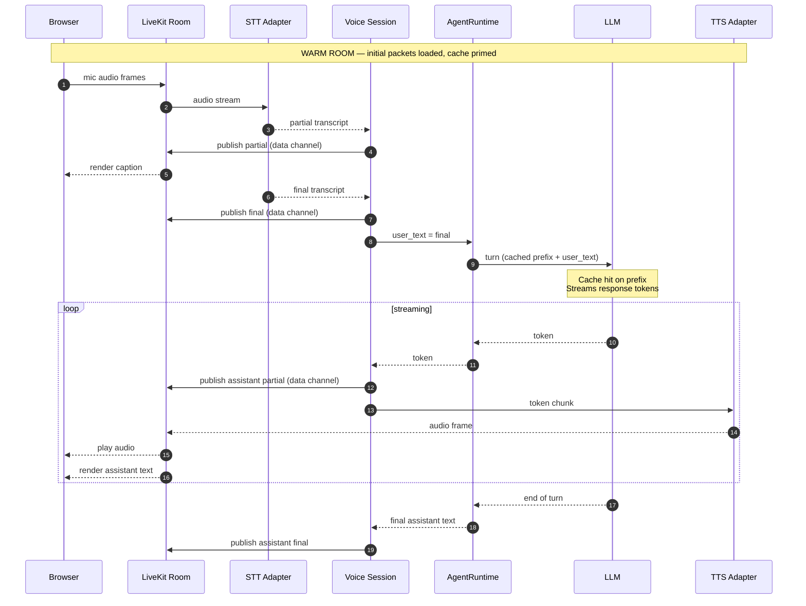

**Barge-in.** If the STT adapter emits a new final transcript while TTS is still speaking, the voice session cancels the in-flight TTS stream and the in-flight LLM stream, publishes an `assistant.interrupted` marker on the data channel, and starts a new turn. The `AgentRuntime` sees the cancellation as a turn-boundary event and does not persist the truncated assistant message into history.

**Streaming while thinking.** Assistant text is published to the data channel as tokens arrive from the LLM, *before* TTS has finished synthesizing the corresponding audio. This lets the browser render text ahead of audio — perceptually the response feels instantaneous even if audio has a few hundred ms of TTS latency.

## 5.6 STT / TTS Provider Selection

Both STT and TTS are provider-neutral behind a small adapter interface. Two providers are supported out of the box:

| Role | Providers | Selection knob |
|---|---|---|
| STT (audio → text) | `deepgram`, `elevenlabs` | `stt.provider` (config) or `--stt-provider` (CLI) |
| TTS (text → audio) | `elevenlabs`, `deepgram` | `tts.provider` (config) or `--tts-provider` (CLI) |

Each provider block additionally accepts:

- `model` — provider-specific model identifier (e.g. `nova-2-general` for Deepgram STT, `eleven_turbo_v2_5` for ElevenLabs TTS). Overridable at the CLI with `--stt-model` / `--tts-model`.
- `api_key_env` — env var to read the credential from; the raw key is never written to config.
- `language` (STT) / `voice_id` (TTS) — optional provider-specific tuning.
- `endpoint` — override URL for self-hosted or region-pinned endpoints.

**CLI overrides win.** Precedence is `CLI flag > env var > config file > adapter default`. The startup log line records the resolved provider, model, and endpoint for each of STT and TTS (`voice.startup.resolved`) so a mis-set flag is obvious at a glance.

**Provider swap is per session, not per turn.** Changing providers mid-session would invalidate the cache warm-up (system prompt is unaffected, but audio format contracts break). Provider choice is fixed at session start.

## 5.7 Live Transcription Channel (Web Client Contract)

Transcription and streaming text are published on a LiveKit **data channel** named `hcag.transcription`. Payloads are JSON, one message per event, monotonically increasing `seq`:

```json
{ "seq": 42, "kind": "user.partial",     "text": "how do partial ref",     "turn_id": "t_9" }
{ "seq": 43, "kind": "user.final",       "text": "how do partial refunds work", "turn_id": "t_9" }
{ "seq": 44, "kind": "assistant.delta",  "text": "Partial refunds are ", "turn_id": "t_9" }
{ "seq": 45, "kind": "assistant.delta",  "text": "issued when...",       "turn_id": "t_9" }
{ "seq": 46, "kind": "assistant.final",  "text": "Partial refunds are issued when...", "turn_id": "t_9" }
{ "seq": 47, "kind": "assistant.interrupted", "turn_id": "t_9" }
```

- `kind` values are namespaced (`user.*`, `assistant.*`, `system.*`) so the client can render user captions and assistant text in different UI slots without keyword-matching text content.
- `turn_id` groups deltas with their finalizing message and lets the client discard stale partials after an `assistant.interrupted`.
- The `system.*` namespace carries session lifecycle events (`system.ready` once §5.4.2 completes; `system.error` on unrecoverable failure) so the browser can show a "connecting…" state until the room is warm.
- Audio itself is **not** on the data channel — it flows through the standard LiveKit audio track. The data channel is text-only.

The web client is not otherwise specified here: any application that speaks the LiveKit JS SDK and consumes `hcag.transcription` per the schema above is a valid front-end.

## 5.8 Configuration

Voice agent configuration lives in `voice.toml`, layered on top of the same `AgentConfig` used by the text runtime:

```toml
kb_root           = "./my-kb"
max_active_tokens = 32000

# Preloaded packet IDs (§5.4.1). Ordered — earlier IDs take budget first.
initial_packet_ids = ["billing.refunds", "billing.invoices", "auth.oauth"]

[llm]
provider = "anthropic"
model    = "claude-3-5-haiku-20241022"

[livekit]
url        = "wss://my-app.livekit.cloud"
api_key_env    = "LIVEKIT_API_KEY"
api_secret_env = "LIVEKIT_API_SECRET"
room_prefix    = "hcag-"       # rooms are named "<prefix><session-id>"

[stt]
provider    = "deepgram"                  # deepgram | elevenlabs
model       = "nova-2-general"
api_key_env = "DEEPGRAM_API_KEY"
language    = "en-US"
endpoint    = ""                          # optional override

[tts]
provider    = "elevenlabs"                # elevenlabs | deepgram
model       = "eleven_turbo_v2_5"
voice_id    = "21m00Tcm4TlvDq8ikWAM"
api_key_env = "ELEVENLABS_API_KEY"
endpoint    = ""

[warmup]
enabled = true                            # skip only for local dev with cache-less providers

[log]
file_path = "./hcag-voice.log"
level     = "INFO"
```

**Reused blocks.** `[llm]`, `[log]`, and OTEL config follow the same schemas as §2.13 and §3.6 — the voice agent does not fork configuration models for the pieces it shares with the text runtime.

## 5.9 CLI

The voice agent runs as a long-lived worker process:

```
$ hcag-voice serve --config voice.toml [flags]
```

Flags override the corresponding `voice.toml` fields:

| Flag | Overrides | Notes |
|---|---|---|
| `--kb-root PATH` | `kb_root` | |
| `--initial-packets id1,id2,...` | `initial_packet_ids` | Comma-separated. Order preserved. |
| `--stt-provider {deepgram,elevenlabs}` | `stt.provider` | |
| `--stt-model NAME` | `stt.model` | Any provider-valid model ID. |
| `--tts-provider {elevenlabs,deepgram}` | `tts.provider` | |
| `--tts-model NAME` | `tts.model` | |
| `--tts-voice ID` | `tts.voice_id` | TTS-only. |
| `--livekit-url URL` | `livekit.url` | |
| `--no-warmup` | `warmup.enabled = false` | Skip §5.4.2 (dev only). |
| `--log-file PATH` / `--log-level LEVEL` | `log.file_path` / `log.level` | Same shape as §3.9 / §4.7. |

`serve` blocks in the foreground. It joins the LiveKit dispatcher, accepts room-join events, and spins up one `AgentRuntime + STT + TTS` triple per session. Shutdown on `SIGTERM` drains in-flight sessions (finishes the current TTS utterance, publishes `system.error` with reason `shutdown`, closes the room) before exiting.

A one-shot `hcag-voice dry-run` subcommand runs §5.4.1 and §5.4.2 without joining any room and prints the resolved provider/model/preload summary. Useful in CI to catch a bad initial-packet ID before deploy.

## 5.10 Observability

Reuses the JSON-lines log format (§2.11.3) and OTEL trace model (§2.11.2). Voice-specific events:

- `INFO`:
  - `voice.startup.resolved` — resolved STT/TTS provider + model + endpoint, and the effective `initial_packet_ids`.
  - `voice.startup.preload_done` — packet IDs loaded, tokens consumed, wall-clock elapsed.
  - `voice.warmup.done` — prompt-cache warm-up latency and reported cache write size.
  - `voice.session.opened` / `voice.session.closed` — room name, session ID, duration, turn count.
  - `voice.turn.completed` — turn ID, user-final length, assistant-final length, first-token latency, first-audio latency, total turn duration.
- `DEBUG`:
  - STT partials/finals with timestamps.
  - Assistant token deltas.
  - TTS chunk boundaries.
  - Barge-in cancellation points.
- `WARN`:
  - `voice.startup.unknown_packet` — packet ID in `initial_packet_ids` not present in catalog.
  - `voice.warmup.wasted` — session closed before any real turn used the primed cache.
  - STT/TTS transient errors that were retried successfully.
  - Data-channel publish backpressure.
- `ERROR`:
  - `voice.startup.budget_exceeded` — initial packets exceed `MAX_ACTIVE_TOKENS`; startup aborted.
  - STT/TTS/LiveKit connection failures that terminate the session.
  - LLM streaming errors that could not be recovered mid-turn (the current turn ends with a `system.error` on the data channel; the session stays alive for the next turn).

New OTEL spans:

- `voice.session` (root, per room) with attributes for STT/TTS provider and model, initial-packet count, warmup latency.
- `voice.turn` (child) with first-token / first-audio latency attributes.
- `voice.stt.stream` and `voice.tts.stream` bracket the per-turn STT and TTS work so the audio pipeline is visible alongside the LLM call.

## 5.11 Non-Goals

- **Multi-party audio.** One user, one agent per room. Conference-style N-to-1 or N-to-N sessions are out of scope.
- **Speaker diarization.** Single-speaker input assumed. Distinguishing multiple speakers on the mic track is a provider-level feature and not exposed here.
- **Client-side reasoning.** The browser is a thin transport for audio in, audio out, and transcript rendering. No inference runs in the browser.
- **Persistent conversation memory across sessions.** Each room is a fresh `AgentRuntime`. Long-term user memory is a separate concern.
- **Voice cloning / custom voices.** Whatever the TTS provider offers is what is available; the voice agent does not build or manage voice models itself.
- **Failover between STT/TTS providers mid-session.** Provider is fixed at session start (§5.6). Switching mid-session would invalidate the warm cache and audio contracts.

---

# Part 6 — The `evalgen` CLI Tool

## 6.1 Purpose

`evalgen` generates evaluation question / expected-answer pairs from a normalized KB, for use in scoring retrieval quality and answer quality against the runtime agent (Part 2) or the voice agent (Part 5). It gives KB owners a repeatable way to build an eval set that is grounded in the same content the agent will serve at runtime — so regressions in retrieval selection, packet coverage, or multimodal reasoning surface as measurable score drops on a fixed set of questions.

The tool is a **question / expected-answer generator only**. It does not run the agent, score responses, or persist verdicts; those columns are left empty in the CSV output and filled in by a separate evaluation pass (§6.7).

## 6.2 KB Input Model

`evalgen` consumes a KB directory that has already been normalized by `hcag preprocess` (§3.4):

- Every folder (leaf, taxonomy node, mixed, and root) contains a `compiled.md` with HCAG front-matter (id, title, descriptions, `kind`, token estimate) and — when applicable — a `## Content` section carrying the folder's own source markdown.
- Images referenced by a folder live in that folder's `assets/` subdirectory.
- The root `compiled.md` — produced by `hcag preprocess` (§3) — is always available; its `## Sub-topics` section is used to bias cross-packet pairing toward taxonomically-related folders (§6.4.4).

`evalgen` reads folders as-is; it does not modify the KB. Source `.md` files outside `compiled.md` and images outside `assets/` are ignored — the tool operates only on the artifacts the runtime actually serves.

## 6.3 Invocation

```
$ evalgen <kb_root> --out <output.csv> [--total <N> | --simple <n1> --medium <n2> --complex <n3> --hard-1 <n4> --hard-2 <n5>] [options]
```

| Parameter | Required | Description |
|---|---|---|
| `<kb_root>` | yes | Path to the normalized KB directory (the same directory `hcag preprocess` was run on). |
| `--out <path>` | yes | Path to the output CSV file. Overwritten if it exists. |
| `--total <N>` | one-of | Total number of question/answer pairs to generate, split equally across the five types (§6.5). |
| `--simple <n>` | one-of | Explicit count of `simple` questions to generate. |
| `--medium <n>` | one-of | Explicit count of `medium` questions to generate. |
| `--complex <n>` | one-of | Explicit count of `complex` questions to generate. |
| `--hard-1 <n>` | one-of | Explicit count of `hard-1` (cross-packet) questions to generate. |
| `--hard-2 <n>` | one-of | Explicit count of `hard-2` (multimodal) questions to generate. |
| `--seed <int>` | no | Random seed for packet/paragraph selection. Fixed seed → reproducible eval set for a given KB revision. |
| `--id-prefix <str>` | no | Prefix for `question_id` values (default `q`). Useful when merging multiple eval sets. |
| `--config <path>` | no | Path to `evalgen.toml` (§6.8). Defaults to `<kb_root>/evalgen.toml` if present. |

**Mutual exclusivity.** `--total` and any of the `--<kind> <n>` flags are mutually exclusive. Pass **either** a single `--total` **or** one-to-five explicit per-type flags; mixing the two forms is a startup error. Per-type flags default to `0` when omitted, so `--simple 20 --hard-2 5` generates exactly 25 questions of only those two kinds.

Example invocation:

```
$ evalgen kb/ --out kb-eval.csv --total 100 --seed 42
```

Generates 100 pairs — 20 `simple`, 20 `medium`, 20 `complex`, 20 `hard-1`, 20 `hard-2` — using seed `42`, and writes them to `kb-eval.csv`. Equivalent explicit form:

```
$ evalgen kb/ --out kb-eval.csv \
    --simple 20 --medium 20 --complex 20 --hard-1 20 --hard-2 20 --seed 42
```

## 6.4 Question Types

Each row's `kind` column carries one of five string tags corresponding to how the question was constructed. The tags are stable — the evaluation pass filters and scores by `kind`.

### 6.4.1 `simple`

- **Definition.** Answerable verbatim from a single packet. FAQ-style factual question with no reasoning; the answer text appears literally in the packet body.
- **Source.** One packet, one contiguous span (typically a sentence or short paragraph).
- **Expected answer.** A verbatim or near-verbatim quote from the packet — the LLM extracts a self-contained fact; no rewording beyond trimming.
- **Signal.** Measures whether the agent retrieved and read the correct packet at all. A `simple` failure usually means retrieval, not reasoning, is broken.

### 6.4.2 `medium`

- **Definition.** Requires **reasoning grounded in a single paragraph** of a single packet. The answer is not a verbatim quote — the reader must interpret or combine facts within one paragraph.
- **Source.** One folder, one paragraph (a contiguous block delimited by blank lines in that folder's `compiled.md` `## Content` section).
- **Expected answer.** A short natural-language answer whose supporting facts all appear in the chosen paragraph, but which is not a direct quotation of it.
- **Signal.** Measures within-passage comprehension once retrieval has succeeded.

### 6.4.3 `complex`

- **Definition.** Requires **significant deduction across at least three distinct concepts, drawn from at least three different paragraphs within a single folder's `compiled.md` `## Content` section**.
- **Source.** One packet; at least three distinct paragraphs, each contributing a different concept the answer depends on.
- **Expected answer.** A synthesized answer that cannot be produced from any single paragraph in isolation. The generation prompt requires the LLM to identify each paragraph's contribution before composing the answer, so the eval remains auditable.
- **Signal.** Measures whole-packet reasoning — whether the agent uses everything a loaded packet contains, not just the first hit.

### 6.4.4 `hard-1` (cross-packet)

- **Definition.** Requires **two packets** to answer correctly, drawing on **at least three different paragraphs spread across those two packets** (e.g., 2 + 1, or 1 + 2). Neither packet alone is sufficient.
- **Source.** A pair of folders. Pairs are biased toward siblings or cousins in the taxonomy (topically adjacent) — inferred by walking each folder's `compiled.md` front-matter and the tree's dotted-path IDs — because those are the pairs the agent is most likely to load together. When taxonomy metadata is unavailable, pairs are drawn uniformly at random.
- **Expected answer.** A synthesized answer whose supporting facts are split across the two packets, with at least three distinct paragraphs contributing.
- **Signal.** Measures the `check_and_load_kb` selection loop (§2.3.2) — specifically whether the agent recognizes it needs a second packet and loads it, rather than answering from only the first.

### 6.4.5 `hard-2` (multimodal)

- **Definition.** Requires an **image from the packet's `assets/` folder to be read together with the packet markdown**. The image must hold information **essential** to the answer, so that the question cannot be answered from the markdown alone and the model must perform multimodal reasoning across text and image.
- **Source.** One packet whose `assets/` folder contains at least one image. Only packets with images are eligible; packets with no assets are silently skipped for this kind.
- **Expected answer.** A short answer whose key fact is visually present in the image (a label on a diagram, a value in a chart, a state in a state-machine figure, a component in a screenshot) and only weakly implied — or not implied at all — by the surrounding markdown.
- **Signal.** Measures the multimodal loading path (§2.6) — whether images are actually attached to the LLM call and whether the model uses them.
- **Availability.** If the requested `--hard-2` count exceeds the number of image-bearing packets, `evalgen` generates as many as it can and logs a `WARN` indicating the shortfall. It does **not** substitute another kind to reach the requested total.

## 6.5 Quantity Control

`evalgen` accepts the requested question count in exactly one of two forms:

1. **Single total (`--total N`).** `evalgen` divides `N` equally across the five kinds. If `N` is not divisible by 5, the remainder is distributed one at a time in the order `simple, medium, complex, hard-1, hard-2` — so `--total 12` produces `3, 3, 2, 2, 2`.
2. **Explicit per-type counts (`--simple n1 --medium n2 --complex n3 --hard-1 n4 --hard-2 n5`).** Any subset may be passed; omitted kinds default to `0`. The total emitted is exactly the sum.

If a per-type count exceeds the maximum feasible for that kind (e.g., more `hard-2` than image-bearing packets), `evalgen` emits as many as it can, logs a `WARN` naming the shortfall (`requested=N, generated=M, kind=hard-2, reason=insufficient_image_packets`), and continues with the remaining kinds. The run's exit code is non-zero only for `ERROR`-level events (§6.9), not shortfalls.

## 6.6 Generation Algorithm

Broadly, for each kind, `evalgen`:

1. Selects the required packet(s) and paragraph(s) per the kind's rules (§6.4), using the configured `--seed` for reproducibility.
2. Sends the selected content — packet markdown plus any required images for `hard-2` — to the configured LLM (§6.8) with a fixed per-kind prompt template. The prompt instructs the model to produce one `question` and one `expected_answer` grounded strictly in the supplied content.
3. Validates the LLM's response against per-kind constraints (e.g., `complex` must cite at least three paragraphs; `hard-2` must reference at least one image). On validation failure, the item is retried up to a configurable cap (default 2); persistent failures are dropped with a `WARN`.
4. Assigns a stable `question_id` of the form `<prefix>-<zero-padded-index>` (e.g., `q-0001`) in generation order.
5. Appends the row to the output CSV with the `actual_answer`, `score`, and `remark` columns left empty (§6.7).

Kinds are generated in the fixed order `simple → medium → complex → hard-1 → hard-2`, so `question_id`s cluster by kind — useful when diff-ing eval runs.

## 6.7 Output CSV Schema

`evalgen` writes a single CSV file with a header row and one row per generated pair. Columns are fixed and ordered:

| Column | Written by `evalgen` | Description |
|---|---|---|
| `question_id` | yes | Stable identifier (`<prefix>-<zero-padded-index>`), unique within the file. |
| `kind` | yes | One of `simple`, `medium`, `complex`, `hard-1`, `hard-2`. |
| `question` | yes | The generated question text, single-line where possible; multi-line values are quoted per RFC 4180. |
| `expected_answer` | yes | The reference answer produced against the KB. |
| `actual_answer` | **empty** | Populated during evaluation by whatever harness runs the agent. |
| `score` | **empty** | Integer 0–3, populated during evaluation. `0`=wrong, `1`=partially correct, `2`=mostly correct, `3`=fully correct. `evalgen` always writes this empty. |
| `remark` | **empty** | Free-text notes from the evaluator (missing packet, wrong image, hallucination, etc.). `evalgen` always writes this empty. |

CSV formatting rules:

- UTF-8, LF line endings, RFC 4180 quoting.
- Header row is always present.
- The final three columns (`actual_answer`, `score`, `remark`) are always emitted as empty fields — never omitted, so downstream tools can open the file with a fixed 7-column schema.

Example (header + two rows):

```csv
question_id,kind,question,expected_answer,actual_answer,score,remark
q-0001,simple,"How long does a standard refund take to process?","5–7 business days.",,,
q-0021,hard-2,"According to the refund state machine, which state immediately follows ""pending_review""?","approved",,,
```

## 6.8 Configuration

`evalgen` reads an optional `evalgen.toml` (or per-invocation flags):

```toml
[llm]
provider = "anthropic"            # anthropic | openai | bedrock | ollama | llamacpp
model    = "claude-opus-4-7"      # generation quality benefits from a strong model
api_key_env = "ANTHROPIC_API_KEY"
endpoint = ""                     # override for local/self-hosted

[llm.prompts]
simple  = "prompts/eval_simple.md"
medium  = "prompts/eval_medium.md"
complex = "prompts/eval_complex.md"
hard_1  = "prompts/eval_hard1.md"
hard_2  = "prompts/eval_hard2.md"

[generation]
max_retries_per_item = 2          # retry cap on validation failure
paragraph_min_chars  = 120        # ignore too-short "paragraphs" for medium/complex/hard-1
cross_packet_bias    = "taxonomy" # taxonomy | uniform — pair selection for hard-1

[log]
file_path = "./evalgen.log"
level     = "INFO"
```

Local model support mirrors `hcag` (§3.6): `provider = "ollama"` or `"llamacpp"` with a local `endpoint` runs the whole generation without cloud credentials. Question quality varies with model choice; `hard-2` in particular requires a multimodal-capable model.

## 6.9 Failure Modes

| Condition | Behavior |
|---|---|
| `<kb_root>` has no packets | ERROR — nothing to generate against; exit non-zero. |
| Both `--total` and any `--<kind>` flag passed | ERROR at startup — mutually exclusive. |
| No image-bearing packets and `hard-2 > 0` requested | WARN, `hard-2` count reduced to `0`; other kinds proceed. |
| Requested `hard-2` count exceeds image-bearing packets | WARN, shortfall logged; produce as many as feasible. |
| LLM call fails for a single item | WARN, item dropped; run continues with next item. |
| LLM validation fails past `max_retries_per_item` | WARN, item dropped; run continues. |
| Output CSV path not writable | ERROR at startup — fail fast rather than partial write. |
| Config references a prompt template that does not exist | ERROR at startup. |

If any `ERROR`-level event fires, `evalgen` exits with a non-zero status. `WARN`-level shortfalls do not affect exit status but are surfaced in the end-of-run summary.

## 6.10 Observability (CLI)

`evalgen` writes a JSON-lines log to the path in `[log]` config (default `./evalgen.log`), matching the format used by the runtime (§2.11.3), `hcag` (§3.9), and `crawl` (§4.7):

- `INFO`: run start (KB path, requested counts, resolved counts after feasibility check), per-item generation summary (`question_id`, `kind`, source packet id(s), token usage), run end summary (per-kind generated/dropped counts, wall-clock elapsed).
- `DEBUG`: full LLM prompts and responses per item, chosen paragraph offsets, image paths attached for `hard-2`.
- `WARN`: kind shortfalls, dropped items (with reason), packets skipped for `hard-2` (no images), duplicate question detection (if the same question text is generated twice, the second is dropped).
- `ERROR`: startup failures, unwritable output path, KB with no packets.

If `OTEL_EXPORTER_OTLP_ENDPOINT` is set, spans (`evalgen.run`, `evalgen.item`, `evalgen.llm.call`) are exported — symmetric with §2.11, §3.9, §4.7.

## 6.11 Non-Goals

- **Running the agent.** `evalgen` only produces question / expected-answer pairs. Executing the agent against those questions, filling `actual_answer`, and scoring are separate concerns handled by a downstream eval harness.
- **Judging answers.** The `score` and `remark` columns are always empty on output; `evalgen` does not implement an LLM-as-judge or any other scoring mechanism.
- **Ground-truth curation.** Generated `expected_answer` values are grounded in the KB but are themselves LLM output. Human review of the eval set before use is expected; `evalgen` does not claim editorial correctness.
- **Adversarial or jailbreak questions.** All questions are strictly grounded in the KB's own content. Prompt-injection probes, safety evals, and out-of-distribution questions are out of scope.
- **Cross-run diffing or eval-set versioning.** Each invocation writes a fresh CSV. Snapshotting eval sets under version control and diffing successive runs is left to the caller (e.g., commit the CSV alongside the KB revision it was generated from).

## 6.12 Sequence Diagram

Kinds are generated in the fixed order `simple → medium → complex → hard-1 → hard-2` (§6.6). Within each kind, one LLM call per item with a validate-and-retry inner loop; validation failures past `max_retries_per_item` drop the item with a WARN and the run continues.

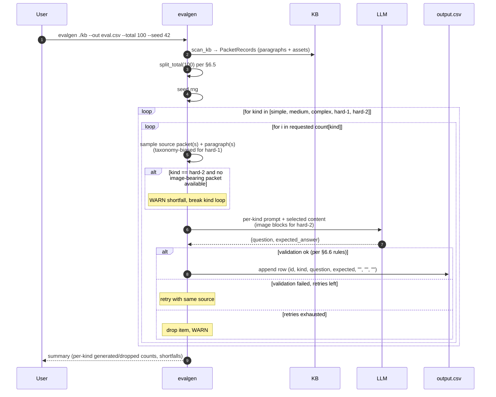

---

# Part 7 — The `eval` CLI Tool

## 7.1 Purpose

`eval` executes the question set produced by `evalgen` (Part 6) against a **live** chatbot backend and scores each answer with an LLM-as-judge. It closes the loop that `evalgen` deliberately leaves open (§6.11): where `evalgen` produces `(question, expected_answer)` pairs and stops, `eval` runs the agent, captures `actual_answer`, judges it against `expected_answer`, and writes the completed rubric row.

The tool is symmetric with `evalgen` in scope: `evalgen` is a **generator only**, `eval` is a **runner and scorer only**. Neither reads or mutates the KB directly. Together they form the KB-owner's regression harness: freeze a KB revision, generate an eval set once (§6.6), then re-run `eval` after each agent, prompt, or KB change to detect quality drift.

## 7.2 Input Model

`eval` consumes exactly the CSV `evalgen` emits (§6.7):

| Column | Read | Written |
|---|---|---|
| `question_id`     | yes | passed through unchanged |
| `kind`            | yes | passed through unchanged |
| `question`        | yes | passed through unchanged |
| `expected_answer` | yes | passed through unchanged |
| `actual_answer`   | no  | **populated** — the chatbot's final answer text |
| `score`           | no  | **populated** — integer `0`–`3` per the rubric (§7.5) |
| `remark`          | no  | **populated** — one-sentence judge justification |

The first four columns are the eval set's identity; `eval` treats them as read-only and copies them verbatim into the output. The last three columns are `eval`'s work product. Rows whose `actual_answer`, `score`, and `remark` are already populated are re-run by default so re-scoring stays reproducible; `--skip-completed` short-circuits them if the caller wants incremental resumption.

## 7.3 Invocation

```
$ eval <input.csv> --backend-url <url> --out <output.csv> --report <report.html> [options]
```

| Parameter | Required | Description |
|---|---|---|
| `<input.csv>` | yes | Path to the CSV produced by `evalgen` (§6.7). |
| `--backend-url <url>` | yes | Base URL of the chatbot backend. `eval` calls `POST <url>/chat` with each question (§7.4). |
| `--out <path>` | yes | Path to the completed output CSV. Overwritten if it exists. |
| `--report <path>` | yes | Path to the HTML report emitted from the promptfoo run (§7.6, §7.8). Overwritten if it exists. |
| `--max-turns <N>` | no | Max chatbot turns per question before giving up (§7.4.3). Default `5`. |
| `--concurrency <N>` | no | Number of questions evaluated in parallel. Default `4`. Bounded by backend rate limits. |
| `--request-timeout <sec>` | no | Per-`/chat` HTTP timeout. Default `60`. |
| `--session-scope <mode>` | no | `per-question` (default, fresh `session_id` per question) or `per-run` (share one `session_id` across all questions). Fresh sessions isolate scoring; shared sessions stress the multi-turn memory path. |
| `--kinds <list>` | no | Comma-separated subset of question kinds to run (e.g. `--kinds simple,hard-2`). Default: all five. |
| `--skip-completed` | no | Skip input rows whose `score` column is already populated. Off by default so re-runs re-score deterministically. |
| `--seed <int>` | no | Seed for the judge LLM's sampling and any tie-breaking in the clarification generator. Fixed seed → reproducible scoring. |
| `--config <path>` | no | Path to `eval.toml` (§7.9). Defaults to `./eval.toml` if present. |

Example invocation:

```
$ eval kb-eval.csv \
    --backend-url http://localhost:8000 \
    --out kb-eval-scored.csv \
    --report kb-eval-report.html \
    --max-turns 5 --concurrency 4 --seed 42
```

Runs every question from `kb-eval.csv` against `http://localhost:8000/chat` (the `hcag-server` from Part 5's web widget, or any compatible backend), writes the scored CSV to `kb-eval-scored.csv`, and emits an HTML summary to `kb-eval-report.html`.

## 7.4 Execution Loop

For each input row, `eval` opens a conversation with the backend and drives it until the chatbot returns a scorable answer or the turn limit is hit. The exchange is captured verbatim so the judge (§7.5) and the report (§7.8) can inspect it.

### 7.4.1 Single-turn exchange

The happy path — one request, one answer:

1. `eval` mints a `session_id` per the `--session-scope` policy.
2. `eval` sends `POST <backend-url>/chat` with:
   ```json
   { "session_id": "<sid>", "message": "<row.question>", "history": [] }
   ```
3. The backend returns `{ "text": "<answer>", ... }`.
4. `eval` classifies the response (§7.4.2). If it is an **answer**, the loop ends: `actual_answer` = `<answer>`.

### 7.4.2 Multi-turn clarification

When the chatbot responds with a clarifying question rather than an answer, the LLM judge fills the user role and the conversation continues:

1. `eval` runs a lightweight **response classifier** over the chatbot's reply (a separate small LLM prompt, or a rule when the backend marks clarifications explicitly). Classification categories:
   - `answer` — a substantive response to `question`. Terminate; assign this text to `actual_answer`.
   - `clarify` — a follow-up question or request for information. Continue.
   - `refusal` — an explicit refusal, safety block, or out-of-scope disclaimer. Terminate; assign this text to `actual_answer` (and the judge will score it accordingly).
2. On `clarify`, `eval` calls the **judge LLM in clarifier mode**, giving it:
   - The original `question` and `expected_answer` (so the judge knows what facts the user "has").
   - The full exchange so far.
   - A directive to answer the chatbot's clarification the way the real user would, using only information available in `expected_answer` or reasonable defaults. The clarifier is instructed to **never leak** `expected_answer` verbatim.
3. The clarifier's reply is sent as the next user message on the same `session_id`. The full multi-turn transcript is retained for scoring (§7.5) and for the HTML report (§7.8).

The clarifier is the **same LLM** as the judge (§7.9), configured with a distinct prompt. Using one model keeps operator setup minimal and makes clarification style consistent across runs.

### 7.4.3 Turn limit and termination

`--max-turns` bounds the loop (default `5`, counting one user + one assistant as one turn). When the limit is reached without an `answer` classification, the loop ends and `actual_answer` is set to a synthesized string of the form:

```
[max_turns_exceeded] last_response=<final chatbot reply verbatim>
```

The `remark` written by the judge then reflects why scoring proceeded on an unresolved exchange (§7.5). This preserves the failure signal — a chatbot that spirals into endless clarifications scores poorly rather than crashing the run.

Additional termination conditions:

| Condition | Behavior |
|---|---|
| Backend HTTP error after retries exhausted | `actual_answer = [backend_error] <status> <body>`; judge scores it as `0`. |
| Backend timeout after retries exhausted | `actual_answer = [backend_timeout]`; judge scores it as `0`. |
| Response classifier fails to categorize (rare) | Treated as `answer` — captured verbatim and passed to the judge. |

## 7.5 LLM-as-Judge Scoring

Once `actual_answer` is populated, `eval` invokes the judge LLM once per row with:

- `question`
- `expected_answer`
- `actual_answer`
- The full multi-turn transcript when clarification occurred (§7.4.2), so the judge can down-weight answers the chatbot only produced after being led there.
- The scoring rubric (below), fixed and identical for every row.

Rubric — the judge must return exactly one of these integers:

| Score | Meaning |
|---|---|
| `0` | **Wrong and misleading answer.** Factually incorrect, hallucinated, or would mislead the user. Also assigned to hard failures (backend errors, refusals on in-scope questions, `[max_turns_exceeded]`). |
| `1` | **Partially correct, but missing key points.** Contains no outright errors, but omits information the expected answer identifies as essential. |
| `2` | **Partially correct, and includes the key points.** Covers the essential information but adds noise, extraneous detail, or minor imprecision. |
| `3` | **Accurate and comprehensive answer.** Substantively equivalent to `expected_answer`; a reasonable user would consider the question fully answered. |

The judge's structured output is `{ "score": <0|1|2|3>, "remark": "<one-sentence justification>" }`. `eval` writes `score` and `remark` into their columns unchanged. If the judge returns malformed output past the retry cap (§7.9), the row's `score` is left empty and `remark` is set to `[judge_failed] <reason>` — never a fabricated numeric score.

The judge is deliberately **stateless per row**: it never sees another question's answer or score. This keeps scoring order-independent and lets `--concurrency` fan out safely.

## 7.6 Test Harness (promptfoo)

`eval` is implemented on top of [promptfoo](https://www.promptfoo.dev/) — each CSV row becomes one promptfoo test case, and promptfoo drives the parallel execution, retry policy, assertion evaluation, and HTML report generation. This choice buys three things that would otherwise be one-off code: (a) concurrent test execution with a stable, well-tested rate limiter; (b) a mature HTML report renderer with pass/fail visualization and drill-down; (c) a plugin surface for custom assertions — `eval` registers the LLM-judge scorer (§7.5) as a promptfoo `assert` of type `llm-rubric`.

The promptfoo integration is an implementation detail — the CLI surface, input CSV schema, and output CSV schema are stable. The mapping is:

| `eval` concept | promptfoo concept |
|---|---|
| Input CSV row | `test` |
| `question` | rendered into the `prompt` sent to the provider |
| `POST /chat` conversation loop (§7.4) | a custom promptfoo `provider` that speaks the `{ session_id, message, history[] }` protocol and returns the final `actual_answer` |
| Multi-turn clarification (§7.4.2) | handled inside the provider before returning — promptfoo sees one prompt → one final response |
| LLM-as-judge scoring (§7.5) | a `llm-rubric` assertion with the rubric text and structured-output contract from §7.5 |
| Per-kind breakdown (§7.8) | promptfoo `tags` set to `{ kind: <row.kind> }` |
| HTML report | `promptfoo view --output <report.html>` invoked by `eval` after the run |

`eval` writes the completed CSV itself (§7.7) rather than deriving it from promptfoo's native output — CSV round-tripping is part of the tool's contract with `evalgen`, and decoupling it from promptfoo's output format shields callers from harness changes.

## 7.7 Output — Completed CSV

`eval` writes a CSV to `--out` with the same 7-column schema as the input (§6.7). Columns `question_id`, `kind`, `question`, and `expected_answer` are copied verbatim from the input row. Columns `actual_answer`, `score`, and `remark` are populated per §7.4 and §7.5.

Row-level rules:

- **Row order is preserved.** Even under `--concurrency > 1`, rows are emitted in input order so `diff` on two run outputs is meaningful.
- **Same encoding as `evalgen`.** UTF-8, LF line endings, RFC 4180 quoting, header row always present.
- **Never partial.** `eval` writes the output CSV atomically at the end of the run (temp file + rename). A crash mid-run leaves the previous output untouched; use `--skip-completed` on a fresh output for incremental resumption.
- **Score column is integer or empty.** Never a string, never a float. Empty means the judge failed for that row (§7.5); `remark` explains why.

Example (header + three rows, one of each outcome shape):

```csv
question_id,kind,question,expected_answer,actual_answer,score,remark
q-0001,simple,"How long does a standard refund take to process?","5–7 business days.","Refunds typically clear in 5 to 7 business days.",3,"Answer matches expected timeframe exactly."
q-0007,medium,"Which document must accompany a partial refund request?","The original signed invoice.","A copy of the invoice is required.",1,"Correct that an invoice is needed but omits the ""original"" and ""signed"" requirements."
q-0021,hard-2,"According to the refund state machine, which state immediately follows ""pending_review""?","approved","[max_turns_exceeded] last_response=""Could you clarify which state machine you mean?""",0,"Chatbot never produced an answer within the turn limit."
```

## 7.8 Output — HTML Report

`eval` emits an HTML report to `--report` generated by promptfoo's report renderer, extended with per-kind summary panels. The report includes:

- **Run summary.** Total questions, per-kind counts, overall pass rate (fraction scoring `≥ 2`), mean and median score, wall-clock elapsed, backend URL, seed, model IDs (chatbot + judge).
- **Per-kind breakdown.** One panel each for `simple`, `medium`, `complex`, `hard-1`, `hard-2` showing count, mean score, score histogram (0/1/2/3 bars), and pass rate. Enables at-a-glance drift detection — a `hard-1` regression tells you retrieval selection broke; a `hard-2` regression tells you multimodal loading broke, mirroring the signal design in §6.4.
- **Score distribution histogram** across all kinds.
- **Row-level table** — every question with its score, one-line remark, and expandable transcript. Filterable by kind and by score bucket.
- **Comparison bar** at the top when `--baseline <prior-output.csv>` is passed: side-by-side per-kind pass rates and a delta column, so regressions vs. a committed baseline are immediately visible.
- **Regenerable and self-contained.** Single `.html` file — inlined CSS/JS, no external assets, safe to commit or attach to a PR.

The report and the completed CSV are the two deliverables of an `eval` run. Both are always written when the run completes; a crash before completion leaves the previous versions of both untouched (§7.7).

## 7.9 Configuration

`eval` reads an optional `eval.toml`. All values are overridable by CLI flags (§7.3):

```toml
# Chatbot under test — the backend `eval` calls.
[backend]
url             = "http://localhost:8000"
chat_path       = "/chat"           # POST endpoint under `url`
request_timeout = 60                # seconds
retries         = 2                 # per-request retries on 5xx / timeouts
session_scope   = "per-question"    # per-question | per-run

# Multi-turn loop (§7.4).
[loop]
max_turns = 5

# Response classifier — small LLM prompt that decides answer / clarify / refusal.
[classifier]
provider    = "anthropic"
model       = "claude-haiku-4-5-20251001"
api_key_env = "ANTHROPIC_API_KEY"

# LLM-as-judge (§7.5) and clarifier (§7.4.2) — same provider, distinct prompts.
[judge]
provider          = "anthropic"
model             = "claude-opus-4-7"     # scoring benefits from a strong model
api_key_env       = "ANTHROPIC_API_KEY"
max_output_tokens = 512
retries           = 2                     # on malformed structured output

[judge.prompts]
score     = "prompts/eval_score.md"       # rubric prompt (§7.5)
clarify   = "prompts/eval_clarify.md"     # user-side clarification (§7.4.2)
classify  = "prompts/eval_classify.md"    # answer / clarify / refusal classifier

# Execution.
[run]
concurrency = 4
seed        = 42

# Reporting.
[report]
title    = "HCAG eval — <kb-name>"
baseline = ""                             # optional path to a prior --out CSV

[log]
file_path = "./eval.log"
level     = "INFO"
```

Local model support mirrors `evalgen` (§6.8): `provider = "ollama"` or `"llamacpp"` with a local `endpoint` runs classification, clarification, and scoring without cloud credentials. Judge quality bounds `eval` quality — the same guidance as `evalgen`'s generation-quality note applies.

## 7.10 Failure Modes

| Condition | Behavior |
|---|---|
| `<input.csv>` missing or malformed | ERROR at startup — non-zero exit. |
| Backend URL unreachable at run start (`GET /health` probe fails) | ERROR at startup — non-zero exit, no partial output written. |
| Backend returns 5xx on a single row past retries | Row's `actual_answer = [backend_error] ...`, judge scores it, run continues. |
| Backend times out on a single row past retries | Row's `actual_answer = [backend_timeout]`, judge scores it, run continues. |
| Judge LLM returns malformed structured output past `retries` | Row's `score` left empty, `remark = [judge_failed] <reason>`; run continues. |
| Clarifier fails past retries | Loop terminates as if `max_turns` reached; row scored per §7.4.3. |
| `--kinds` filter matches zero rows | ERROR at startup — nothing to run. |
| `--out` or `--report` path not writable | ERROR at startup — fail fast rather than partial write. |
| `--baseline` file schema mismatch | ERROR at startup — the report can't render a comparison. |

If any `ERROR`-level event fires, `eval` exits with a non-zero status. Per-row `WARN`s (backend errors, judge failures) do not affect exit status but are surfaced in the end-of-run summary and in the report.

## 7.11 Observability (CLI)

`eval` writes a JSON-lines log to the path in `[log]` config (default `./eval.log`), matching the format used by the runtime (§2.11.3), `hcag` (§3.9), `crawl` (§4.7), and `evalgen` (§6.10):

- `INFO`: run start (input path, row count, per-kind counts, backend URL, resolved model IDs, concurrency, seed), per-row summary (`question_id`, `kind`, turn count, wall-clock elapsed, chatbot tokens, judge tokens, final `score`), run end summary (per-kind mean scores and pass rates, wall-clock elapsed).
- `DEBUG`: full multi-turn transcripts per row, full judge prompt + response, classifier decisions, clarifier prompts + responses.
- `WARN`: backend errors, backend timeouts, judge malformed outputs, clarifier failures, `[max_turns_exceeded]` rows, rows filtered out by `--skip-completed`.
- `ERROR`: startup failures — unreadable input, unwritable output, unreachable backend, empty kind filter.

If `OTEL_EXPORTER_OTLP_ENDPOINT` is set, spans (`eval.run`, `eval.row`, `eval.chat_turn`, `eval.judge`, `eval.clarify`) are exported — symmetric with §2.11, §3.9, §4.7, and §6.10.

## 7.12 Non-Goals

- **Generating questions.** `eval` never fabricates test items; the input CSV is the authority. Curation is `evalgen`'s job (Part 6) and human review (§6.11).
- **Editing the reference answer.** `expected_answer` is treated as ground truth. If it is wrong for a given KB revision, fix the source and re-run `evalgen`; `eval` does not rewrite the column.
- **Running the KB or the agent directly.** `eval` only speaks to the backend over `POST /chat`. It does not import `AgentRuntime`, does not touch the KB, and does not care whether the backend is `hcag-server` (Part 5's web widget), a mocked stub, a different agent, or a hosted service — the contract is the HTTP endpoint alone. This keeps `eval` usable as a black-box regression harness against any chatbot that speaks the same protocol.
- **CI orchestration or threshold enforcement.** `eval` reports scores; it does not fail the CI job on a pass-rate drop. Callers wire the exit-code policy they want on top of the completed CSV (e.g., a wrapper script that parses the mean score per kind and gates a PR).
- **Adversarial or safety evaluation.** Scoring is grounded strictly in `expected_answer`. Prompt-injection tests, jailbreak resistance, and toxicity checks are separate concerns and out of scope.

## 7.13 Sequence Diagram

Whole-run view. `eval` writes a promptfoo config + JSON-serialized `EvalConfig` into a tempdir and hands off concurrent per-row execution to `npx promptfoo eval`. Each row's provider spawns the multi-turn conversation loop (§7.4), classifies each chatbot reply, drives clarifications via the judge LLM when the reply isn't a real answer, and — once an answer is captured — runs the judge one final time to score against `expected_answer`. The runner then atomically writes the completed CSV and renders the HTML report.

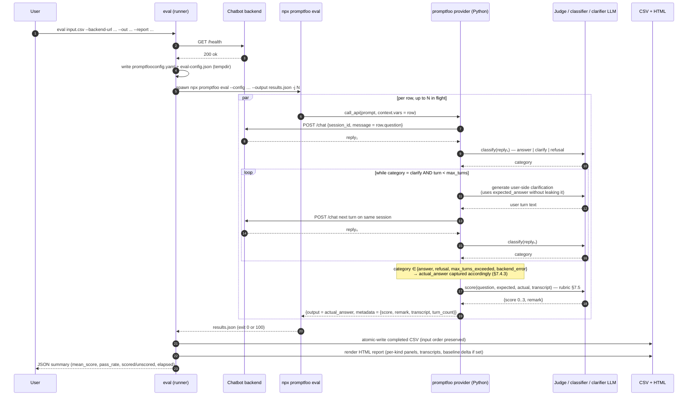

---

# Part 8 — The `rag` CLI Tool

## 8.1 Purpose

`rag` indexes a knowledge-base folder into a local [LanceDB](https://lancedb.github.io/lancedb/) store, producing an on-disk index that supports **hybrid retrieval** — dense vector search over LLM embeddings combined with keyword (BM25-style) search over the same text — from a single query. It is a companion to HCAG, not a replacement for it: the HCAG agent already navigates the taxonomy and loads whole packets, but many workflows also want flat retrieval over the same source material — for eval baselines, ad-hoc grep, or a Flat-RAG fallback (§1.3.3) that the caller composes on top of HCAG (§1.3.5).

The tool is a **one-shot indexer**. It does not serve queries, does not stand up an HTTP endpoint, and is not required at runtime. Downstream code — a notebook, a retriever service, or a comparison harness — opens the resulting LanceDB folder directly and queries it.

## 8.2 KB Input Model

`rag` operates on a **raw** KB folder — the same layout `hcag preprocess` (§3.4) and `crawl` (§4) produce. It intentionally does **not** require the KB to have been normalized: `compiled.md` files may or may not exist, and the tool works on either shape.

Two exclusion rules govern what gets indexed:

1. **Skip `compiled.md` files.** These are HCAG-assembled artifacts (§3.4.3) that concatenate a folder's own source markdown with a catalog of its children into a single file. Indexing them alongside the underlying source would double-count every fact and skew retrieval scores. Root `compiled.md` and every folder's `compiled.md` (§3.7) are skipped for the same reason.
2. **Skip anything inside an HCAG `assets/` folder.** Per §2.1 and §3.4.6, an `assets/` directory sits alongside a `compiled.md` — it is HCAG's home for the images that folder's content section references. Those images are already indirectly indexed via the folder's `compiled.md` body; letting `rag` re-index them would again double-count.

Everything else under `<kb_root>` is a candidate for indexing — the raw `.md`, `.txt`, and `.pdf` files a taxonomy owner authored, plus any images that live **outside** an HCAG `assets/` folder (loose reference material, source screenshots, diagrams the taxonomy author has not yet folded into a packet). Files whose extension is unknown are skipped with a `DEBUG` log line.

## 8.3 Invocation

```
$ rag --kb <kb_root> [--index <index_dir>] [options]
```

| Parameter | Required | Description |
|---|---|---|
| `--kb <path>` | yes | Path to the KB folder to index. `rag` walks it recursively per §8.4.1. |
| `--index <path>` | no | Path to the LanceDB folder that holds the index. Default: `./local_lancedb`. Created if it does not exist. |
| `--config <path>` | no | Path to `rag.toml` (§8.7). Defaults to `<kb_root>/rag.toml` if present. |
| `--table <name>` | no | LanceDB table name inside the index directory. Default: `kb`. |
| `--recreate` | no | Drop the existing table before indexing. Without this flag, `rag` upserts by `id` — unchanged files are skipped (§8.4.5). |
| `--include-images / --no-include-images` | no | Toggle the image-description pipeline (§8.4.3). Default: `--include-images`. |
| `--log-file <path>` | no | Log file path. Default: `./rag.log`. |
| `--log-level <lvl>` | no | `DEBUG` \| `INFO` \| `WARN` \| `ERROR`. Default: `INFO`. |

Example invocation:

```
$ rag --kb ./kb --index ./local_lancedb
```

Indexes every non-excluded file under `./kb` into a LanceDB table named `kb` inside `./local_lancedb/`. On a second run, only files whose content or path has changed since the last run are re-embedded (§8.4.5).

Equivalent with an explicit table name, a rag.toml, and image indexing disabled:

```
$ rag --kb ./kb --index ./local_lancedb \
      --table support-docs --config ./rag.toml --no-include-images
```

## 8.4 Indexing Pipeline

### 8.4.1 Walk and file classification

`rag` walks `<kb_root>` with a deterministic pre-order traversal (alphabetical within each directory) so a re-run against the same tree produces the same row ordering — this makes `diff`-ing successive index snapshots meaningful.

For each file it classifies against the exclusion rules (§8.2) and the source-kind table:

| Extension | `source_kind` | Handling |
|---|---|---|
| `.md`, `.markdown` | `markdown` | Parsed as Markdown; chunked on heading boundaries (§8.4.2). |
| `.txt` | `text` | Chunked with a fixed sliding window. |
| `.html`, `.htm` | `html` | Stripped to text via the same converter `crawl` uses (§4.4.1), then chunked. |
| `.pdf` | `pdf` | Converted to Markdown via the same converter `crawl` uses (§4.4.2), then chunked. |
| `.png`, `.jpg`, `.jpeg`, `.gif`, `.webp` | `image` | Sent through the image-description pipeline (§8.4.3). Skipped entirely when `--no-include-images` is set. |
| anything else | — | Skipped with a `DEBUG` `rag.file.skip_unknown_ext` log line. |

Files that match an exclusion rule (§8.2) are skipped before extension classification and logged at `DEBUG` as `rag.file.skip_packet_md` or `rag.file.skip_hcag_asset` respectively.

### 8.4.2 Text extraction and chunking

For each in-scope textual file, `rag`:

1. Extracts UTF-8 text (via the source-kind-appropriate converter above).
2. Splits into chunks using a **Markdown-aware windowing strategy**: chunks respect heading boundaries and paragraph breaks where possible, and never split inside a fenced code block. The default target is 500 tokens per chunk with a 60-token overlap between adjacent chunks; both are overridable in `rag.toml` (§8.7). Non-Markdown text uses the same target but with a plain sliding window.
3. Emits one index row per chunk (§8.5), carrying:
   - the chunk's byte offset span within the source file,
   - the innermost heading path (for Markdown) as a `headings` array — useful to reconstruct provenance at query time,
   - a stable `id` derived from the file's relative path plus the chunk index (§8.4.5).

### 8.4.3 Image description

Images are **indirectly indexed**: `rag` never embeds the raw bytes. Instead, each in-scope image is passed to a multimodal LLM (default: the same provider/model used for the text embeddings' companion LLM, configurable per §8.7) with a fixed description prompt. The prompt asks for:

- a one-sentence caption of the primary subject,
- a short paragraph enumerating visible entities, labels, and any text content in the image (e.g., diagram labels, chart axis titles, screenshot UI copy),
- optional structural notes when the image is clearly a diagram, chart, or state machine (e.g., "state-machine diagram with 4 nodes and 5 labeled transitions").

The returned text is the chunk that gets embedded and stored. Each image produces exactly one row (never chunked further) with `source_kind = "image"`, `image_path` set to the image's path relative to `<kb_root>`, and `text` holding the LLM-generated description. Retrieval consumers can dereference `image_path` to fetch the original bytes when they need to show or re-analyze the image.

If the description call fails past the configured retry cap, the image is dropped with a `WARN` (`rag.image.description_failed`) and no row is emitted for it. The rest of the run proceeds.

### 8.4.4 Embedding and batching

After chunk assembly, `rag` batches chunks into groups (default 32) and calls the configured **embedding provider** to produce dense vectors. The provider is LiteLLM-routed for the same reason as the runtime (§2.13.2, §2.13.8) — no direct vendor SDK imports at the call site. The embedding dimension is discovered from the first response and pinned for the whole run; a subsequent chunk whose vector has a different dimension aborts the run with a clear error (misconfiguration between chunk types).

Batches are dispatched sequentially (not concurrently) by default. The chunking + embedding stages are both CPU-cheap and I/O-bound; the bottleneck is the embedding provider's rate limit, which the caller tunes via `[embedding].batch_size` in `rag.toml` rather than by adding parallelism `rag` cannot rate-limit safely.

### 8.4.5 Idempotency and re-indexing

`rag` is idempotent under repeated invocations against a stable KB:

- Each row's `id` is a stable digest of `(<relative_path>, <chunk_index>, <source_content_hash>)`. Content changes flip the `id`, so old rows for a modified file are naturally superseded rather than mutated in place.
- Without `--recreate`, `rag` **upserts** by `id` and issues a **delete-by-`kb_path`-then-insert** for any file whose current content hash differs from the stored one. Untouched files skip the embed step entirely — the run's cost scales with the size of the diff, not the size of the KB.
- With `--recreate`, the target table is dropped first and every in-scope file is re-embedded. Useful when embedding model or chunk parameters change (§8.7).

The tool records a `manifest` row per source file containing its content hash, byte size, mtime, and chunk count, so a subsequent run can detect changes without re-reading whole files unnecessarily.

## 8.5 Index Schema

`rag` writes a single LanceDB table (default name `kb`) with a fixed column schema. All chunks — text and image-description — share the same columns; per-kind fields (`image_path`, `headings`) are nullable.

| Column | Type | Description |
|---|---|---|
| `id` | `string` (primary key) | Stable digest of `(kb_path, chunk_index, content_hash)`. Upsert key. |
| `kb_path` | `string` | Path relative to `<kb_root>` (POSIX form). Same file, many chunks. |
| `chunk_index` | `int32` | 0-based position of the chunk within the source file. Always `0` for images. |
| `source_kind` | `string` | One of `markdown`, `text`, `html`, `pdf`, `image` (§8.4.1). |
| `text` | `string` | The chunk text — either the extracted excerpt (for textual chunks) or the LLM-generated description (for images). This is the column embedded into `vector` and FTS-indexed for keyword search (§8.6). |
| `vector` | `fixed_size_list<float32, D>` | Dense embedding of `text`. `D` is discovered from the embedding provider on the first row (§8.4.4) and pinned per table. |
| `char_start`, `char_end` | `int64` | Byte offsets of the chunk inside the source file. `null` for images. |
| `headings` | `list<string>` | Ordered heading path down to the chunk (Markdown/HTML only). e.g. `["Refunds", "Partial refunds"]`. `null` otherwise. |
| `image_path` | `string?` | Path (relative to `<kb_root>`) of the source image. Populated iff `source_kind = "image"`. |
| `token_estimate` | `int32` | Approximate token count of `text` (same estimator as the memory module — §2.5). Useful for budget-aware assembly downstream. |
| `content_hash` | `string` | SHA-256 of the underlying source file's bytes (not the chunk). Used for idempotency (§8.4.5). |
| `metadata` | `string` | JSON blob for anything provider- or run-specific — the description prompt version for images, the chunking parameters used for text, the embedding model ID. Never queried directly; provenance only. |
| `indexed_at` | `timestamp` | UTC timestamp of the row's insertion. |

In addition to the primary table, `rag` writes a `manifest` table with one row per source file: `kb_path`, `content_hash`, `bytes`, `mtime`, `chunk_count`, `source_kind`, `indexed_at`. The manifest lets `rag` decide what changed on a subsequent run (§8.4.5) without scanning the chunk table.

**Indexes created after ingestion:**

- **Vector index** on `vector` (IVF-PQ by default; LanceDB picks parameters from the row count). Enables `table.search(vec)` at query time.
- **FTS (full-text search) index** on `text` (LanceDB's `create_fts_index("text")`). Enables `table.search(query_string).text()` and BM25-style scoring.

Both indexes are refreshed automatically after each `rag` run so downstream queries see a consistent view.

## 8.6 Hybrid Search Semantics

The index is **hybrid-ready** — every row carries both a dense vector and an FTS-indexed text column — but the CLI itself never issues a query; retrieval is a downstream concern. The design is that a consumer opens the LanceDB folder and issues a hybrid search of the form:

```python
import lancedb
db  = lancedb.connect("./local_lancedb")
tbl = db.open_table("kb")
hits = (
    tbl.search(query="how do partial refunds work?", query_type="hybrid")
       .rerank(reranker=lancedb.rerankers.RRFReranker())
       .limit(10)
       .to_list()
)
```

At query time, LanceDB runs both a k-nearest-neighbour vector search and a BM25 keyword search over the same table, then fuses the two ranked lists with a reranker (RRF by default; any `lancedb.rerankers` subclass is compatible). The columns `id`, `kb_path`, `chunk_index`, `text`, `headings`, and `image_path` are the retrieval consumer's contract — everything else (offsets, hashes, metadata) is provenance.

Hybrid search deliberately outperforms either mode alone on the two failure classes flat RAG suffers from (§1.2): pure-lexical queries lose recall on paraphrased content (which vectors catch); pure-vector queries lose precision on rare tokens like IDs, product SKUs, or policy version numbers (which BM25 catches).

## 8.7 Configuration

`rag` reads an optional `rag.toml` (or per-invocation flags):

```toml
[embedding]
provider    = "openai"                       # openai | anthropic | bedrock | ollama
model       = "text-embedding-3-small"       # any LiteLLM-supported embedding model
api_key_env = "OPENAI_API_KEY"
endpoint    = ""                             # for self-hosted / local
batch_size  = 32
dimension   = 1536                           # optional pin; validated against first response

[image]
provider           = "anthropic"             # multimodal LLM for image descriptions
model              = "claude-haiku-4-5-20251001"
api_key_env        = "ANTHROPIC_API_KEY"
prompt_path        = ""                      # override packaged default (§8.4.3)
max_retries        = 2
max_output_tokens  = 400

[chunking]
target_tokens = 500                          # per chunk
overlap_tokens = 60                          # between adjacent chunks
respect_headings = true                      # Markdown-aware boundaries

[index]
table = "kb"                                 # LanceDB table name
# recreate = false                           # equivalent of the --recreate flag

[log]
file_path = "./rag.log"
level     = "INFO"
```

Local model support mirrors `hcag` (§3.6) and `evalgen` (§6.8): `provider = "ollama"` with a local `endpoint` runs both embeddings and image descriptions without cloud credentials, at the cost of index-build quality.

## 8.8 Failure Modes

| Condition | Behavior |
|---|---|
| `<kb_root>` missing or not a directory | ERROR at startup — non-zero exit. |
| `<kb_root>` contains no in-scope files | ERROR — nothing to index; exit non-zero. |
| `--index` path exists but is not a LanceDB folder | ERROR — refuse to write into an unrelated directory. |
| Embedding provider returns a different dimension than the pinned one | ERROR mid-run — pinned dimension is a hard invariant per table (§8.4.4). |
| Embedding call fails for a single batch past retries | WARN, batch dropped; run continues with the next batch. |
| Image description fails past retries | WARN, image dropped; row not emitted (§8.4.3). |
| A single file fails to parse (malformed PDF, unreadable HTML) | WARN, file dropped; run continues. |
| Index directory is not writable | ERROR at startup. |

If any `ERROR`-level event fires, `rag` exits with a non-zero status. `WARN`-level drops do not affect exit status but are surfaced in the end-of-run summary along with the counts of skipped files, dropped chunks, and dropped images.

## 8.9 Observability (CLI)

`rag` writes a JSON-lines log to the path in `[log]` config (default `./rag.log`), matching the format used by the runtime (§2.11.3), `hcag` (§3.9), `crawl` (§4.7), `evalgen` (§6.10), and `eval` (§7.11):

- `INFO`: run start (kb root, index path, resolved embedding + image models, pinned dimension), per-file summary (`kb_path`, `source_kind`, chunk count, embed tokens, wall-clock elapsed), run end summary (files scanned / indexed / skipped, chunks written, images described, dropped counts, total wall-clock).
- `DEBUG`: skip decisions with the matched exclusion rule, chunk boundaries and their heading paths, full image-description prompts and responses, embedding batch sizes and per-batch elapsed.
- `WARN`: failed embed batches, failed image descriptions, unparseable files, files skipped for unknown extension when `--log-level DEBUG` is not set (they still log at DEBUG then).
- `ERROR`: startup failures, mid-run dimension drift, unwritable index directory.

If `OTEL_EXPORTER_OTLP_ENDPOINT` is set, spans (`rag.run`, `rag.file`, `rag.chunk_batch`, `rag.embed`, `rag.image.describe`) are exported — symmetric with §2.11, §3.9, §4.7, §6.10, and §7.11.

## 8.10 Non-Goals

- **Serving queries.** `rag` produces an index; retrieval, ranking, and query APIs live in downstream code. Keeping the CLI one-shot means it composes cleanly into batch jobs, evaluation pipelines (Part 7), and notebooks without a long-lived process.
- **Replacing HCAG.** `rag` is a **flat** retrieval layer over the same source content HCAG structures into a taxonomy. Use it as a Flat-RAG fallback (§1.3.3) or as a baseline in eval runs, not as a substitute for the taxonomy-driven agent (§1.3.1).
- **Editing the KB.** `rag` never mutates `<kb_root>`. It only reads. The index directory is the only write target.
- **Cross-KB indexes.** One `rag` invocation indexes one KB into one table. Building a multi-tenant or multi-KB index (with a `tenant_id` column, for instance) is a downstream concern; run `rag` per KB and union the tables at query time if that's what the caller needs.
- **Re-embedding on model change without `--recreate`.** If the embedding provider or model changes between runs, existing rows keep their old vectors — `rag` does not silently mix embedding spaces. Pass `--recreate` (or drop the table manually) to rebuild.

## 8.11 Sequence Diagram

End-to-end index build for a KB that mixes text and images. Every file is manifest-checked so a re-run against a stable tree is a no-op; only the diff pays embedding cost (§8.4.5). LanceDB tables are opened lazily on the first embedded chunk so the pinned vector dimension matches the provider's actual response (§8.4.4).

```mermaid
sequenceDiagram
    autonumber
    participant U as User
    participant CLI as rag
    participant FS as KB
    participant M as manifest (LanceDB)
    participant IMG as Image LLM
    participant EMB as Embedding provider
    participant KB_T as kb table (LanceDB)

    U->>CLI: rag --kb ./kb --index ./local_lancedb
    CLI->>FS: walk kb applying §8.2 exclusions<br/>(skip compiled.md + HCAG assets/)
    Note over CLI: recorded candidates + skip reasons

    loop per candidate file
        CLI->>CLI: content_hash(file)
        CLI->>M: lookup by kb_path
        alt hash matches manifest
            Note over CLI: unchanged — skip
        else new or changed
            alt image
                CLI->>IMG: describe_image (multimodal LLM)
                IMG-->>CLI: text description (§8.4.3)
                CLI->>CLI: build 1 chunk (image_path retained)
            else markdown / text / html / pdf
                CLI->>CLI: extract text; Markdown-aware chunk<br/>(target + overlap, heading path per chunk)
            end
            alt kb table not yet open
                CLI->>EMB: embed one probe chunk
                EMB-->>CLI: vector (pin dimension)
                CLI->>KB_T: create_table(schema with pinned dim)
            end
            loop batches of `embedding.batch_size`
                CLI->>EMB: embed(batch)
                EMB-->>CLI: vectors
                alt dimension drift
                    Note over CLI: ERROR — abort run (§8.4.4)
                end
            end
            CLI->>KB_T: delete_by(kb_path)
            CLI->>KB_T: insert chunk rows
            CLI->>M: upsert manifest row (path, hash, chunk_count, source_kind)
        end
    end

    CLI->>KB_T: create/replace vector index (IVF-PQ)
    CLI->>KB_T: create/replace FTS index on `text`
    CLI-->>U: summary (files indexed / unchanged / skipped, chunks, dim, images described)
```

---

# Part 9 — The RAG Chat Agent (Competing Baseline)

## 9.1 Purpose

The **RAG chat agent** is a second, deliberately simpler answering agent that serves the same `POST /chat` contract as the HCAG `AgentRuntime` (§2) — but uses the flat LanceDB hybrid index produced by `rag` (Part 8) as its retrieval backend instead of navigating a taxonomy. It exists for one reason: **so HCAG can be compared against a serious flat-RAG baseline on the same KB, under the same eval set, on the same wire protocol.**

Without a competing agent, HCAG evaluation is either self-referential (score HCAG vs. HCAG on different prompts) or requires the eval harness to know about two different agent shapes. With the RAG agent:

1. Both agents implement the same `run_turn(user_message) -> str` interface (§9.2).
2. Both agents are served through the same `hcag-server` process (§9.5) — a startup flag picks which one instantiates.
3. `eval` (Part 7) scores them identically — the same CSV, the same judge, the same rubric. The only variable is the agent under test.

The RAG agent is **not** intended to beat HCAG on knowledge-heavy tasks (that would defeat HCAG's own purpose per §1.3). It is intended to be a **credible** flat-RAG implementation — good enough that a win for HCAG is a real win, and a loss for HCAG is a real loss and worth investigating.

## 9.2 Component Boundary

The RAG agent lives at `hcag/rag/agent.py`, package-cohesive with the index format it queries. It presents the same public surface as `AgentRuntime`:

```python
class RagAgent:
    def __init__(self, cfg: RagAgentConfig, ...): ...
    def bootstrap(self) -> None: ...
    def run_turn(self, user_message: str) -> str: ...
```

Both `AgentRuntime.run_turn` and `RagAgent.run_turn` take a plain user string and return a plain assistant string; they hold per-instance conversation history so successive calls compose one session. That interface parity is what lets `hcag-server` swap them behind the same HTTP route (§9.5).

Dependencies used by the RAG agent, all already present for `rag` (Part 8):

- **LanceDB** — opens the index directory and executes the hybrid search.
- **LiteLLM** — for both the query embedding call and the final answer LLM call. Provider-neutral, symmetric with §2.13.2.
- **`hcag/rag/schema.py`** — reads the same column contract the indexer writes.

The RAG agent does **not** import anything from `hcag/runtime/` (the HCAG agent) or `hcag/memory/`. The two agents share no per-turn state and no code path beyond the LiteLLM adapter and the logger — this isolation is deliberate so eval comparisons stay clean and a regression in one cannot mask a regression in the other.

## 9.3 Turn Pipeline

Each `run_turn` call is a **stateless retrieval** followed by an LLM generation. Unlike HCAG — which maintains an LRU-ordered active packet set across turns (§2.4) — the RAG agent retrieves fresh chunks for every turn based on the current user message. This is the standard flat-RAG loop and is what a downstream operator would build if they hadn't heard of HCAG.

### 9.3.1 Query embedding

The user message is embedded using the **same embedding provider + model** that indexed the corpus. The RAG agent reads that pair from the LanceDB `manifest` (row's `metadata` blob carries `embed_model`) at bootstrap and hard-fails if the configured `[embedding]` in `rag_agent.toml` disagrees — a query vector from a different space is silently useless, so the mismatch surfaces at startup rather than as a mysterious quality drop.

### 9.3.2 Hybrid retrieval

The agent issues one LanceDB hybrid query per turn (§8.6):

```python
hits = (
    tbl.search(query_text, query_type="hybrid", vector_column_name="vector")
       .rerank(reranker=lancedb.rerankers.RRFReranker())
       .limit(top_k)
       .to_list()
)
```

The reranker fuses the vector KNN result and the BM25 result via reciprocal-rank fusion. `top_k` defaults to `8` (overridable per §9.6) — enough to cover multi-hop answers without blowing the LLM prompt budget in §9.3.4.

Every hit carries the columns fixed in §8.5: `id`, `kb_path`, `chunk_index`, `text`, `headings`, `image_path`, `token_estimate`.

### 9.3.3 Chunk assembly

Retrieved chunks are assembled into a single **context block** in three steps:

1. **Deduplicate by `kb_path` + adjacent `chunk_index`.** If two hits are consecutive chunks from the same file, merge them into one span so the LLM sees continuous prose instead of two nearly-duplicated fragments.
2. **Budget-cap by `token_estimate`.** Sum chunk token estimates in rank order; stop when the running total would exceed `max_context_tokens` (default `6000` — leaves room for the user turn, system prompt, and answer within a typical 8k–16k model window). Dropped chunks are logged at `DEBUG`.
3. **Sort survivors by `(kb_path, chunk_index)`.** Presenting them in source order (not rank order) inside the prompt reads better to the LLM and is what a human would do reading the same material.

The result is a list of `(kb_path, headings_path, chunk_text, image_path?)` tuples with a stable, deterministic ordering.

### 9.3.4 Prompt composition

The RAG agent composes a per-turn prompt of this shape:

```
system: <RAG-agent system prompt: answer strictly from the CONTEXT below;
         if the CONTEXT is insufficient, say so; cite kb_path for facts>

user: CONTEXT
      <for each retrieved chunk in source order:>
        [source: <kb_path> § <headings>]
        <chunk_text>
      ---
      QUESTION
      <turn N user_message>

<prior conversation turns interleaved as user/assistant messages, so
 clarifying questions and previous answers stay visible>

user: <the current user_message>
```

Two properties worth calling out explicitly:

- **The system prompt is byte-stable across turns of one session** (it never changes), so it caches under the same rules HCAG relies on (§2.12). The **user turn is not** — the retrieved context changes every turn, which is the RAG loop's fundamental cache-hostile shape and one of the axes on which HCAG outperforms it (§9.4).
- **Image chunks are included as text** (their LLM-generated description from §8.4.3), plus their `image_path` cited alongside `kb_path`. The RAG agent does **not** re-attach image bytes to the LLM call — the whole point of §8.4.3 is that image content is captured as text at index time. Callers who want vision-in-the-loop should use HCAG (which does packet-level multimodal loading per §2.6) or extend the RAG agent to re-attach originals on hit (out of scope here).

### 9.3.5 Sequence diagram

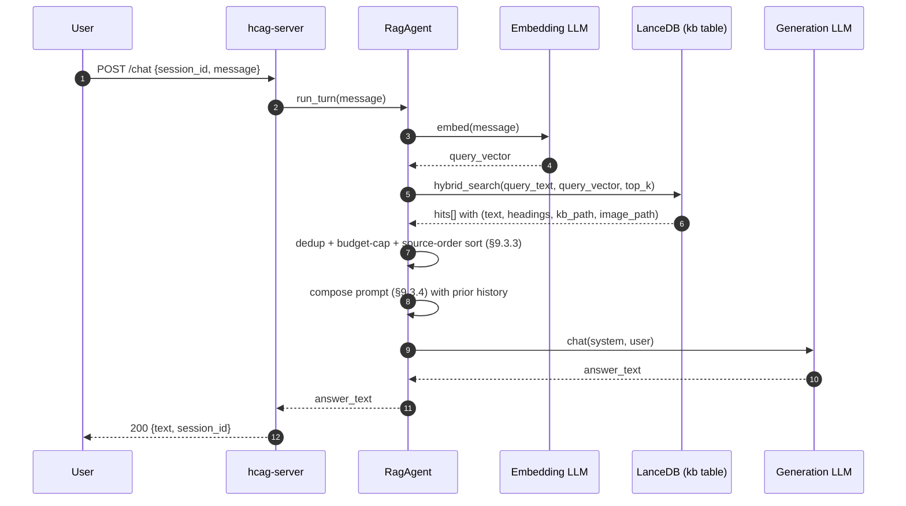

## 9.4 Comparison to HCAG

Both agents answer the same wire question and are scored on the same rubric. What differs is *how* they get to the answer. The table below is the mental model the eval-run operator should carry into every score-diff.

| Axis | HCAG (`AgentRuntime`) | RAG Chat Agent (`RagAgent`) |
|---|---|---|
| Retrieval unit | Whole folder (`compiled.md` + `assets/`) — high-context, coherent | Top-k chunks — smaller, fragmented across sources |
| Retrieval trigger | LLM decides via `check_and_load_kb` tool once per task branch (§2.3.2) | Retriever runs unconditionally, once per turn |
| Cross-turn reuse | Active packet set carried in LRU-ordered context; cache-friendly (§2.12) | Fresh retrieval per turn; prompt varies each call — cache-hostile |
| Selection signal | LLM reasoning over the catalog (semantic + structural) | Embedding similarity + BM25 (surface signal) fused by RRF |
| Multi-hop reasoning | Whole-packet + explicit-load loop supports chains of retrieval | One-shot retrieval; multi-hop requires all evidence to co-rank in a single query |
| Multimodal | Images attached as first-class content blocks at load time (§2.6) | Images seen only via their LLM-generated text description (§8.4.3) |
| Latency | Higher when a load fires; near-zero on cached branches | ~constant per turn (one embed + one hybrid search + one generation) |
| Prompt tokens per turn | Amortized down by cache hits (§2.12) — dominant cost is the packet(s) once | Full context re-sent every turn; scales with `max_context_tokens` |
| Failure mode | Wrong classification → wrong packet → wrong answer, easy to spot in logs | Wrong retrieval ranking → chunks missing key context → subtle degradation |
| KB build cost | `hcag preprocess` — single DFS pass (§3) | `rag` (§8) — usually faster; no taxonomy authoring needed |

The intended narrative when scoring both: **`simple` and `medium`** questions (§6.4.1–2) should be roughly tied — a single well-retrieved packet or a single well-retrieved chunk both suffice. **`complex` and `hard-1`** (§6.4.3–4) should favor HCAG — whole-packet load and the cross-packet loading loop both help. **`hard-2`** (§6.4.5) should strongly favor HCAG — direct image attachment beats text-of-image. A run that contradicts this is a signal worth chasing, not a bug in the eval.

## 9.5 Backend Server Integration (`hcag-server --agent`)

`hcag-server` (the FastAPI backend from `hcag/server/`, exercised by the web widget and by `eval`) chooses which agent to instantiate at startup via a single flag. The wire contract on `POST /chat` is unchanged — clients and `eval` do not know or care which agent is answering.

```
$ hcag-server serve --agent {hcag|rag} [options]
```

Precedence for the choice: `--agent` CLI flag > `HCAG_SERVER_AGENT` env var > default (`hcag`).

Per-agent options resolve to different config paths and different startup work:

| Flag | Applies to | Purpose |
|---|---|---|
| `--agent hcag` (default) | HCAG runtime | Load `agent.toml` (§2.13), instantiate `AgentRuntime`, bootstrap catalog. |
| `--agent rag` | RAG chat agent | Load `rag_agent.toml` (§9.6), open the LanceDB index (`--rag-index`, default `./local_lancedb`), instantiate `RagAgent`, run a sanity probe on the `kb` table. |
| `--agent-config <path>` | HCAG only | Path to `agent.toml`. Ignored when `--agent rag`. |
| `--rag-index <path>` | RAG only | Path to the LanceDB folder produced by `rag` (Part 8). Ignored when `--agent hcag`. |
| `--rag-config <path>` | RAG only | Path to `rag_agent.toml`. Ignored when `--agent hcag`. |

Startup is fail-fast for the selected agent only:

- With `--agent hcag`: missing `agent.toml`, missing `kb_root`, or an empty catalog is a startup error.
- With `--agent rag`: a missing `--rag-index` directory, a missing `kb` table, an empty `kb` table, or a manifest that lists an embedding model different from `[embedding].model` in `rag_agent.toml` is a startup error.

The other agent's config is not touched. Running both agents side by side requires two `hcag-server` processes on two ports — the eval harness already routes by `--backend-url` (§7.3) so this drops in cleanly.

**Session state.** Both agents keep per-`session_id` conversation history in memory (single-node dev server, per §5 of `hcag/web/README.md`). The state is agent-specific: an HCAG session carries the LRU-ordered active packet set; a RAG session carries only the raw turn history (RAG retrieval is stateless). The `session_id` namespace is not shared across the two agents — if the same id shows up under `hcag` and `rag` in separate runs, they are independent conversations. Callers that mix agents (unusual) should mint distinct ids.

### 9.5.1 Sequence diagram — HCAG agent path

Companion to the RAG-agent turn diagram in §9.3.5. When `hcag-server` is started with `--agent hcag`, the same `POST /chat` route dispatches into `AgentRuntime.run_turn` (Part 2). On the first request per `session_id` the runtime is created and bootstrapped, injecting the root `compiled.md`'s `## Sub-topics` into the system prompt; subsequent turns reuse the same runtime and its LRU-ordered active packet set. The inner tool loop (`check_and_load_kb`, packet loading, LLM re-invocation) is documented in §2.10.1–4 and elided here so the diagram stays focused on the routing.

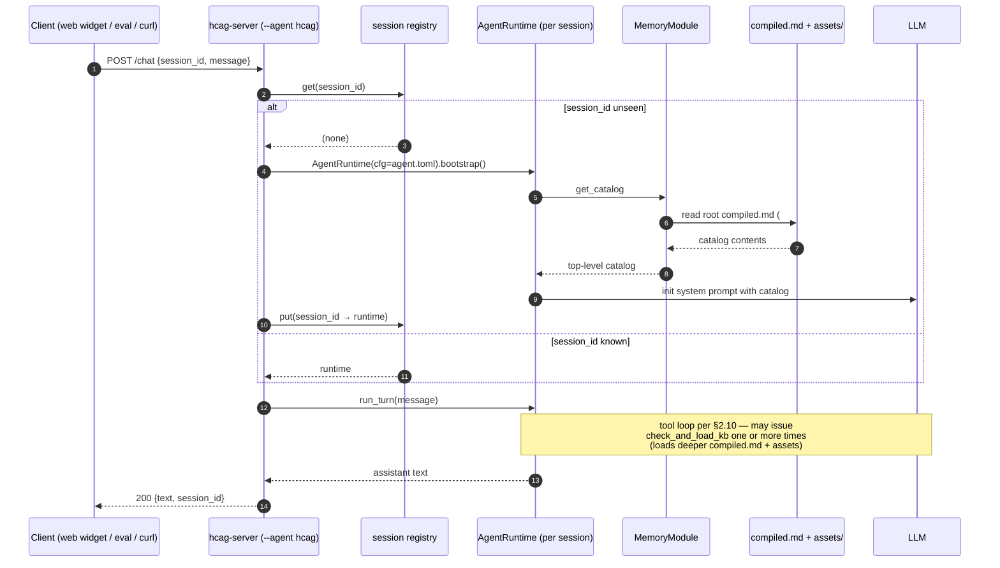

## 9.6 Configuration

`rag_agent.toml` layers on top of the settings the `rag` indexer already used, so the same file can drive both index-build and query-time in matched setups. The RAG agent reads only the sections below; unrelated `rag.toml` sections (like `[chunking]`) are ignored.

```toml
# Which LanceDB table to query (must match the one `rag` wrote — §8.7 [index]).
[index]
path  = "./local_lancedb"
table = "kb"

# Query embedding — MUST match the model the corpus was indexed with (§9.3.1).
[embedding]
provider    = "openai"
model       = "text-embedding-3-small"
api_key_env = "OPENAI_API_KEY"

# Generation LLM — the model that writes the answer.
[llm]
provider    = "anthropic"
model       = "claude-haiku-4-5-20251001"
api_key_env = "ANTHROPIC_API_KEY"
max_tokens  = 1024
temperature = 0.0

# Retrieval + prompt shaping (§9.3.2, §9.3.3).
[retrieval]
top_k               = 8       # hits requested from LanceDB
reranker            = "rrf"   # rrf | linear | none
max_context_tokens  = 6000    # sum of chunk token_estimates in the assembled prompt
merge_adjacent      = true    # collapse consecutive chunks from the same file

# Optional: override the packaged system prompt for the RAG agent.
# system_prompt_path = "prompts/rag_agent_system.md"

[log]
file_path = "./rag-agent.log"
level     = "INFO"
```

## 9.7 Failure Modes

| Condition | Behavior |
|---|---|
| `--agent rag` + `--rag-index` path missing or has no `kb` table | ERROR at startup — non-zero exit; `hcag-server` refuses to bind. |
| Embedding model in `rag_agent.toml` disagrees with `manifest` metadata | ERROR at startup — refuses to serve a mismatched query space (§9.3.1). |
| `top_k` returns 0 hits for a turn | Prompt is composed with an empty CONTEXT block; the system prompt instructs the LLM to say "insufficient information." Judge scoring per §7.5 handles the rest. |
| LanceDB read fails mid-turn (disk error, corruption) | Turn returns a `[retrieval_error] <reason>` string as the assistant message. The session survives; next turn re-attempts. |
| Embedding call fails past provider retries | Turn returns `[embedding_error] <reason>`. Same session-survives semantics. |
| Generation call fails past provider retries | Turn returns `[generation_error] <reason>`. Same session-survives semantics. |
| `max_context_tokens` set below `token_estimate` of even the top hit | Include that one hit anyway, log a `WARN` — refusing the query is worse than crowding the budget. |

`hcag-server`'s HTTP layer maps these to `500` with the error string in the JSON body, so `eval` (§7.4.3) captures them as `[backend_error]` and the judge scores them appropriately.

## 9.8 Observability

The RAG agent writes to the same JSON-lines logger the rest of the stack uses (§2.11.3), namespaced `hcag.rag.agent`:

- `INFO`: agent bootstrap (index path, table name, resolved embed + generation model IDs, top_k, max_context_tokens), per-turn summary (session_id, chunk-hit count, retained-after-cap count, prompt tokens, generation tokens, wall-clock elapsed).
- `DEBUG`: full hybrid-search result list (id, kb_path, chunk_index, rerank score) before dedup + cap, the final assembled CONTEXT block, the full prompt.
- `WARN`: zero-hit turns, dropped chunks past the budget, embedding-model manifest mismatches promoted from ERROR when `--allow-embed-mismatch` is set (an escape hatch for experiments — off by default).
- `ERROR`: startup failures (missing index / table / manifest mismatch), fatal LanceDB corruption.

If `OTEL_EXPORTER_OTLP_ENDPOINT` is set, spans (`rag_agent.turn`, `rag_agent.embed`, `rag_agent.search`, `rag_agent.generate`) are exported — symmetric with §2.11.

## 9.9 Non-Goals

- **Replacing HCAG in production.** The RAG agent exists to be a serious baseline for measuring HCAG. If a KB's workload is genuinely a fit for flat RAG (small corpus, short queries, few multi-hop questions per §1.3.3), then RAG is the right choice — but that's an operator decision made on the eval evidence, not a claim this design makes for it.
- **Tool use / dynamic reload.** The RAG agent does not expose tools to the LLM. There is no equivalent of `check_and_load_kb` (§2.3.2) — retrieval happens once, up front, with no re-issuance mid-turn. Adding tools would make it a different agent design; the point of the baseline is to be a faithful representation of *flat* RAG.
- **Query rewriting or HyDE.** Retrieval uses the raw user turn as the query. Common flat-RAG add-ons — HyDE-style hypothetical-answer expansion, LLM-based query rewriting, multi-query fanout — are deliberately omitted from the baseline so the eval comparison isolates the *architecture* (taxonomy vs. flat index), not the *tuning*.
- **Cross-agent state.** An HCAG session and a RAG session never share state. Migrating a conversation between them is out of scope; `eval` fresh-sessions per row anyway (§7.3 `--session-scope`).
- **Multimodal generation.** Images are consulted only through their §8.4.3 text description. Passing the original image bytes to the generation model at answer time is a future-work item for a "RAG-with-vision" variant; it is not what the baseline models.
