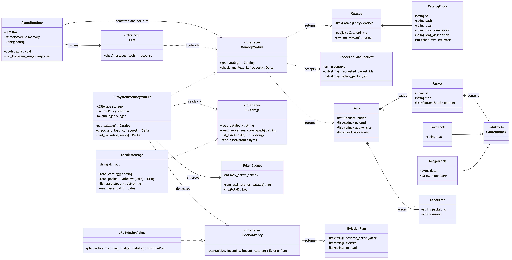
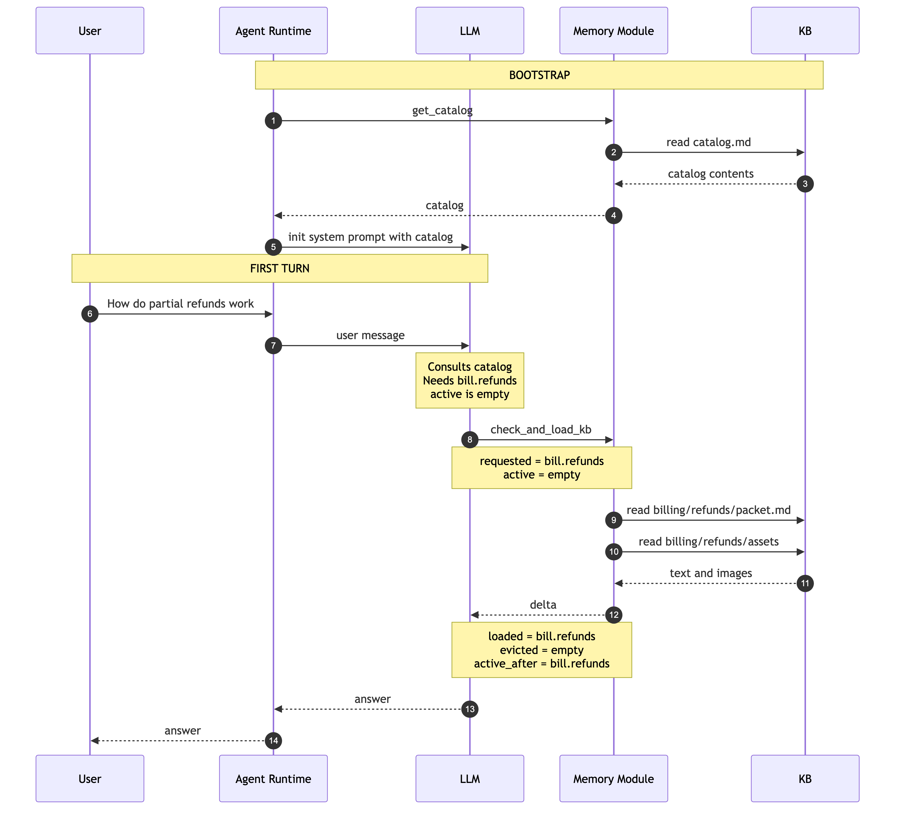

# Your AI Agent Needs a Knowledge Taxonomy — a Small Investment That Pays Rich Dividends

> HCAG (Hierarchical Context Augmented Generation) is the pattern that turns your taxonomy into strong reasoning, scalable retrieval, fast responses, and high-accuracy behavior — without the noise ceiling of flat RAG.

## The missing ingredient in most RAG agents

Most teams building knowledge-grounded AI agents reach for flat-index RAG and plateau around a **70–80% accuracy ceiling**. They tune embeddings, chunk sizes, and rerankers. They add hybrid search, HyDE, cross-encoders. Gains get marginal; cost per point of accuracy rises.

The missing ingredient usually isn't model quality or search technique — it's **structure**. A knowledge taxonomy: a hierarchy that groups documents by *domain → subdomain → topic*. That structure lets an agent decide **which branch of knowledge** the task lives in *before* it retrieves anything, then reason from complete documents inside that branch instead of scavenging chunks across the whole corpus.

Building the taxonomy is a **one-time upfront investment** — days to weeks depending on scope. The dividends compound for the life of the agent: better accuracy, lower cost, lower latency, and — importantly — behavior you can *reason about* because retrieval is deterministic instead of a similarity roll.

## HCAG — the pattern that turns a taxonomy into a working agent

A taxonomy on its own is just a tree of folders. **HCAG** is the design pattern that operationalizes it for agentic AI. An HCAG-based agent:

1. **Classifies once.** On the first turn of a task, the agent inspects the taxonomy catalog and decides which branch(es) apply.
2. **Loads whole leaf documents** — not fragments — into working memory.
3. **Reuses that active set** across every subsequent reasoning, planning, tool-use, and generation step.
4. **Reloads only when it explicitly asks** — no per-step retrieval churn, no background retriever fighting with the LLM for control.

Put together, taxonomy + HCAG gives you agents that are:

- **Strong at reasoning and planning** — because they see complete documents, not stitched-together excerpts.
- **Scalable without noise** — because 90%+ of the corpus is gated out by classification before retrieval, so a bigger KB doesn't mean more distractors.
- **Fast** — because retrieval is amortized across the whole task, not repeated on every step.
- **Cost-effective** — because the prompt prefix stays byte-stable, prompt-cache hits stack up (often 90%+ savings on repeated calls).
- **High-accuracy** — because "similar-but-wrong" retrievals from unrelated branches simply cannot happen.

## Why it works — three flat-RAG failure modes, fixed

1. **Knowledge isolation.** In flat RAG every chunk from every document competes on every query. In HCAG only the classified branch is a candidate — the other 90%+ of the corpus can't compete because it isn't in the pool. Similar-but-wrong retrievals disappear.
2. **Complex reasoning.** Multi-facet questions break flat RAG because they need several distinct retrievals and any one can miss. HCAG loads whole leaf documents, so definitions, caveats, and scope travel with the content. The model reasons over complete material instead of assembled fragments.
3. **Speed and cost.** The agent classifies the branch once and reuses the active set. Retrieval cost is paid once, not per step. Delta-only reloads keep prior tool-result blocks byte-stable in conversation history so prompt caches accumulate hits.

Full framing in [DESIGN.md §1.1–§1.2](./DESIGN.md#11-the-hcag-approach).

## The key design decisions

A few decisions carry most of the weight:

- **Packet = folder.** Each leaf folder in the KB becomes an atomic loadable unit: a `packet.md` plus an `assets/` directory of images. Retrieved as a whole — no chunking, no assembly. ([D2](./DESIGN.md#18-key-design-decisions))
- **Classify once, agent-driven reload.** The LLM classifies the branch on the first turn, then keeps that active set until *it* decides — via an explicit tool call — that current knowledge is insufficient. No per-turn re-retrieval, no similarity drift, no cache invalidation. ([D5](./DESIGN.md#18-key-design-decisions))
- **Delta-only responses.** When the agent does need more, the memory module returns only *new* packets plus the IDs of any it had to evict. Prior tool-result blocks stay byte-stable in history so the prompt cache keeps hitting. ([D6](./DESIGN.md#18-key-design-decisions))
- **Memory module is the sole KB accessor.** Neither the runtime nor the LLM ever touches the file system directly. Every catalog and packet fetch goes through one interface, so the backing store can move from local disk to S3 to a versioned service without touching the agent contract. ([D4a](./DESIGN.md#18-key-design-decisions))
- **Provider-neutral LLM.** No `anthropic`, `openai`, or `boto3` at the call site. Everything goes through **LiteLLM**, so switching between Anthropic direct and AWS Bedrock is a one-line config change. ([§2.13](./DESIGN.md#213-tech-stack))

## The reference implementation

A working Python package (3.11+) lives in the same repo. The pieces map 1:1 to the design's class diagram ([§2.9](./DESIGN.md#29-component-class-diagram)):

- `hcag/memory/` — `FileSystemMemoryModule`, `LocalFsStorage`, `LRUEvictionPolicy`, `TokenBudget`.
- `hcag/runtime/` — `AgentRuntime` (bootstrap + tool loop) and a thin `LiteLLMAdapter`.
- `hcag/cli/` — the `hcag` command with two subcommands: `preprocess` (build packets and per-level catalogs) and `aggregate` (emit the root `catalog.md`).
- `hcag/logger.py` — always-on JSON-lines file log.
- `hcag/tracing.py` — optional OTEL exporter (Langfuse, CloudWatch, Tempo, Honeycomb…).

## Try it in five minutes

```bash
# 1. Clone and install
git clone <repo-url> hcag && cd hcag
python -m venv .venv && source .venv/bin/activate
pip install -e ".[dev]"

# 2. Set your credential (Anthropic default — swap to AWS_* for Bedrock)
export ANTHROPIC_API_KEY=sk-ant-...

# 3. Point at a KB (drop .md files and images into folders that match your taxonomy)
#    Then normalize it:
hcag preprocess ./kb
hcag aggregate  ./kb

# 4. Ask the agent something — one-shot or interactive REPL
python examples/run_agent.py --config ./examples/agent.toml "How do partial refunds work?"
python examples/run_agent.py --config ./examples/agent.toml    # interactive
```

The sample config in `examples/agent.toml` is annotated with alternatives for Bedrock and Ollama; flip one section and rerun.

## When not to use it

HCAG assumes you have — or are willing to build — a good taxonomy. That upfront investment is the trade. If your KB is small and your questions are FAQ-style, flat RAG is a faster start. If your task is open-ended research where the agent should decide what to look for as it goes, agentic search is the better fit. HCAG is the sweet spot for knowledge-heavy reasoning inside a bounded branch: autonomous support over large corpora, root cause analysis, and SOP-grounded operations workflows.

Full comparison and trade-offs: [DESIGN.md §1.3](./DESIGN.md#13-when-to-use-hcag-vs-alternatives).

## Under the hood

Two diagrams tell most of the story.

### The runtime object model

The runtime is a small set of classes with clean seams. `AgentRuntime` owns the conversation; the `MemoryModule` interface is the single door to the KB; `KBStorage` and `EvictionPolicy` are the swappable extension points (local FS → S3, LRU → LFU, etc.). Data-transfer objects (`CheckAndLoadRequest`, `Delta`, `Packet`, `ContentBlock`) travel across the tool boundary between LLM and memory module.



*Rendered from [`docs/diagrams/class_diagram.mmd`](./docs/diagrams/class_diagram.mmd). Full detail in [DESIGN.md §2.9](./DESIGN.md#29-component-class-diagram).*

### Cold start + first turn

Bootstrap fetches the catalog through the memory module (never directly from disk) and injects it into the system prompt. On the first turn, the LLM inspects the catalog, calls `check_and_load_kb` with the packet IDs it needs, the memory module reads packet markdown + assets from the KB, and returns a delta. The LLM then answers from the loaded packet — and on subsequent turns, unless it explicitly requests more, it keeps reasoning against the same active set.



*Three more sequence diagrams — no-reload turn, additive load within budget, and load-with-eviction — are in [DESIGN.md §2.10](./DESIGN.md#210-sequence-diagrams).*

## More

Full design document — every decision, the full class diagram, all four sequence diagrams, the observability model, and the CLI semantics — lives in [DESIGN.md](./DESIGN.md).
