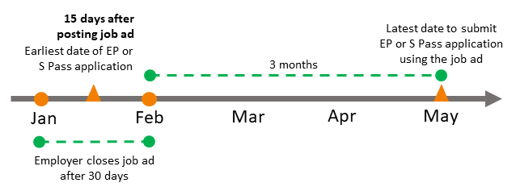

# Consider all candidates fairly before you apply for an Employment Pass

There are updates on this page. [Read more]

# Consider all candidates fairly before you apply for an Employment Pass

To promote fair employment practices and improve labour market transparency, employers submitting Employment Pass (EP) applications must first advertise the job on [MyCareersFuture](https://www.mycareersfuture.gov.sg) and consider all candidates fairly. 

## Fair Consideration Framework (FCF)

The [Fair Consideration Framework (FCF)](https://www.mom.gov.sg/employment-practices/fair-consideration-framework) sets out the requirements for all employers in Singapore to consider candidates fairly for job opportunities. Employers should not discriminate candidates based on non-job related characteristics such as age, sex, nationality or race.

All employers in Singapore are expected to adhere to the [Tripartite Guidelines on Fair Employment Practices](https://www.tal.sg/tafep/getting-started/fair/tripartite-guidelines). 

## Advertising requirements

### Accuracy of advertisement

The advertisement should clearly explain the job requirements and salary offered to attract the right candidates.

We will reject any EP applications linked to advertisements that are discriminatory or do not represent the job accurately:

- The advertisement must not contain discriminatory words or phrases - [see examples](https://www.tal.sg/tafep/employment-practices/recruitment/writing-job-advertisements) .
- The job advertised must match the occupation in the EP application.
- The employer submitting the EP application must be the same as the one in the job advertisement.
- The salary offered must be clear, specific, and consistent. Therefore the salary range advertised:
    
  - Must be visible to all candidates and cannot be hidden.
  - Cannot be too broad. The maximum salary cannot exceed two times of the minimum salary. For example, if the minimum salary is $4,500, then the maximum salary should not exceed $9,000.
  - Must contain the salary offered to the EP candidate.
- If you are using an advertisement for multiple EP applications, the total number of EP applications cannot exceed the number of vacancies in the advertisement.

### Duration of advertisement

The [MyCareersFuture](https://www.mycareersfuture.gov.sg/) job advertisement must be open for at least 14 consecutive days to allow job seekers to view and apply for the vacancy. This also applies if you repost an advertisement that has closed.

You must post a new advertisement if you change any advertisement details, including the unique entity number of the hiring organisation, occupation, salary and the number of vacancies. You must keep it open for at least another 14 consecutive days before you can submit the EP application. This is to ensure that job seekers are aware of the updated job details and have a chance to apply for it.

Job advertisements that have expired for more than 3 months or closed for more than 3 months, cannot be used for EP applications. You must advertise the vacancy again to reach out to other job seekers.

