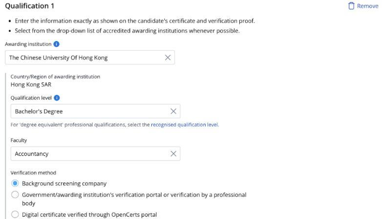
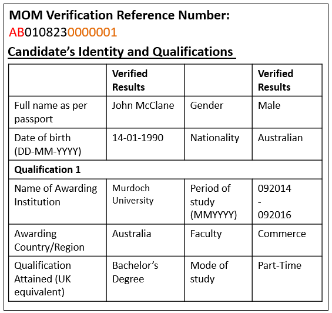
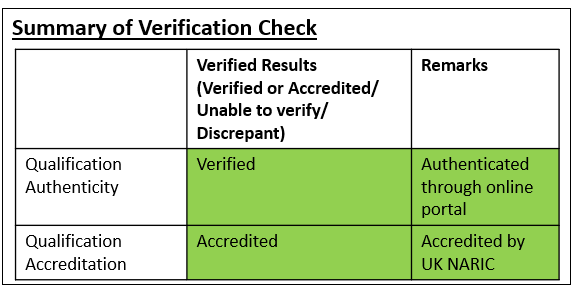
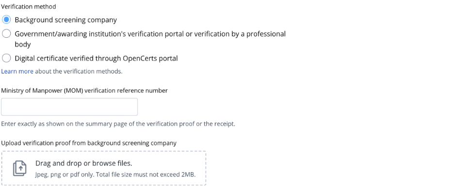
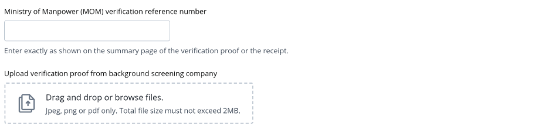

## Page 1

Guide to submit verification proof from Background Screening 
Company 
 
1. Read the guidelines 
before you submit the 
verification proof. 
 
 
 
 
 
 
 
 
 
2. If the institution name 
on your educational 
certificate or 
verification proof is not 
available in the 
dropdown menu, 
please enter the 
institution's most 
recent name where 
applicable. You may 
also choose not to 
declare the 
qualification if you are 
unable to find it on the 
list. 
 
3. Enter the qualification 
level as per the 
verification proof or 
educational certificate. 
Enter the faculty as per 
transcript if it is not 
found in the 
verification proof or 
educational certificate.   
 
  
Read this 
Select the institution when it 
appears

## Page 2

➢ Check that your 
verification proof has a 
‘MOM verification 
reference number’. If 
you do not have a 
verification number on 
your verification proof, 
contact your 
background screening 
company to update it. 
 
➢ If your verification is 
still pending after 14 
working days and your 
awarding institution is 
from the application 
form’s drop-down list 
of accredited 
institutions, you can 
submit the receipt for 
the verification service 
in lieu of the 
verification proof in 
the work pass 
application. 
Once the work pass 
application is 
approved, you can 
bring in the candidate 
and get their pass 
issued. 
You do not need to 
submit the verification 
proof to us. However, 
if the qualification is 
found to be false, the 
work pass will be 
revoked and the 
candidate must leave 
Singapore. 
 
Sample verification proof from Background Screening Company  
 
 
 
  
Find your MOM verification 
reference number here

## Page 3

4. Key in the ‘MOM 
verification reference 
number’ as stated on 
the verification proof 
or provided by the 
background screening 
company. 
 
 
 
 
5. Upload the verification 
proof from the 
background screening 
company.  
  
 
Select verification method 
Enter the MOM verification reference number provided 
Upload here

