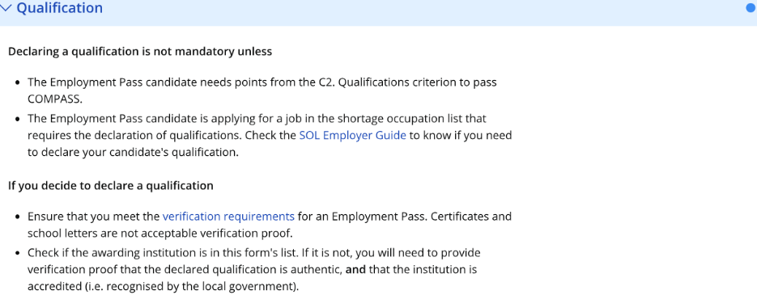
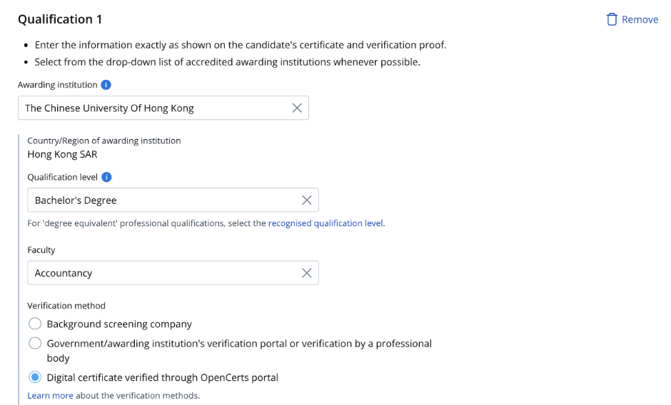
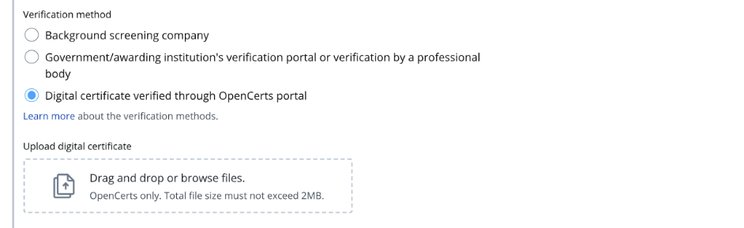
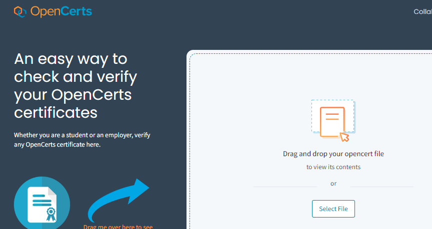
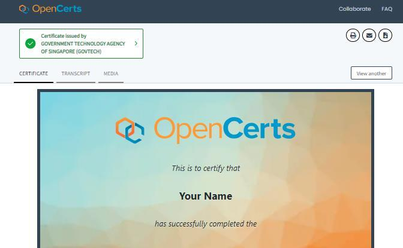

## Page 1

Guide to submit verification proof - Digital certificates verified 
through OpenCerts portal 
 
1. Read the guidelines 
before you submit the 
verification proof. 
 
 
 
 
 
 
 
 
 
2. If the institution name 
on your educational 
certificate or 
verification proof is not 
available in the 
dropdown menu, 
please enter the 
institution's most 
recent name where 
applicable. You may 
also choose not to 
declare the 
qualification if you are 
unable to find it on the 
list. 
 
3. Enter the qualification 
level as per the 
educational certificate. 
Enter the faculty as per 
transcript if it is not 
found in the 
educational certificate.   
 
  
Read this 
Select the institution when it appears

## Page 2

4. Ensure the digital 
certificate has been 
verified through 
OpenCerts portal. 
Refer to the below for 
more details how to 
verify. 
 
5. Upload the
document. 
 
How to verify digital 
certificates with 
OpenCerts 
 
a. Go to OpenCerts 
portal. 
b. Upload the 
 
document. 
c. Check that the 
 
document has 
been verified 
through the 
OpenCerts portal 
as authentic. 
 
 
 
 
Upload here 
Check that the certificate is 
verified as authentic 
Upload here 
Select verification method

