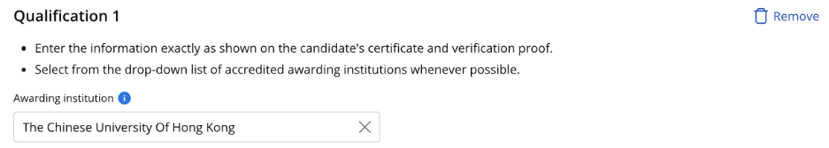
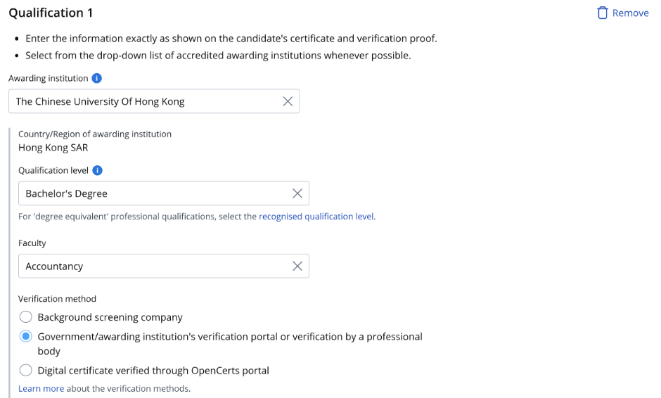
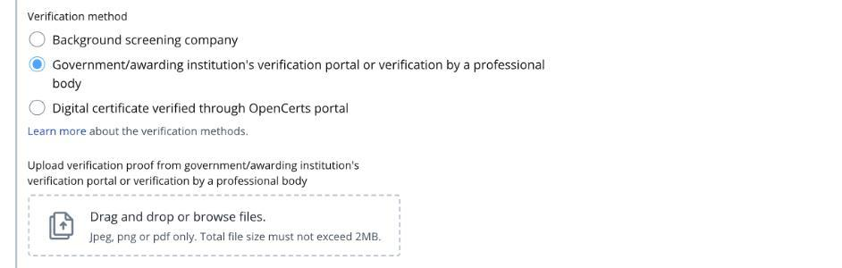
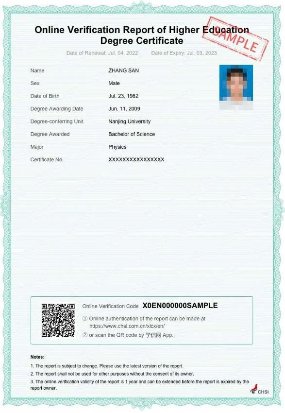
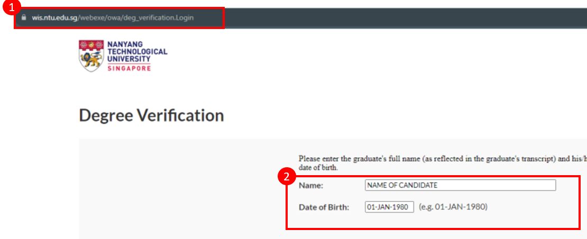
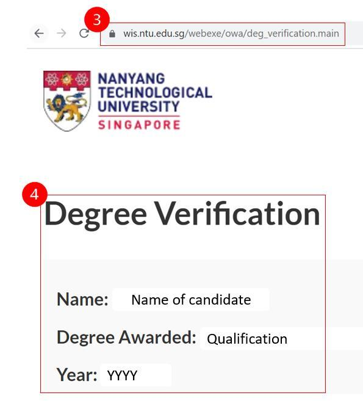

## Page 1

Guide to submit verification proof from government/awarding 
institution’s verification portal or a professional body 
 
1. Read the guidelines 
before you submit the 
verification proof. 
 
 
 
 
 
 
 
 
 
2. If the institution name 
on your educational 
certificate or 
verification proof is not 
available in the 
dropdown menu, 
please enter the 
institution's most 
recent name where 
applicable. You may 
also choose not to 
declare the 
qualification if you are 
unable to find it on the 
list. 
 
3. Enter the qualification 
level as per the 
verification proof or 
educational certificate. 
Enter the faculty as per 
transcript if it is not 
found in the 
verification proof or 
educational certificate. 
   
 
  
Read this 
Select the institution when it appears

## Page 2

4. Save screenshots of 
your verification proof 
from a government/ 
awarding institution. 
Refer to sample 
screenshots for details 
to be included in the 
screenshots. 
5. Upload screenshots 
with the required 
details into your 
application form.  
 
 
 
Example screenshot from government’s verification portal 
1. Only official English version 
of the online verification 
reports by CSSD will be 
accepted. 
2. Ensure the full page is 
displayed. 
3. The screenshot should 
include the following 
candidate’s information: 
o Full name 
o Date of birth 
o Date of graduation 
o Student number (if 
applicable) 
Sample screenshot from Center for Student Services and 
Development (CSSD) 
 
 
 
 
 
 
Select verification method 
Upload here

## Page 3

Example screenshot from awarding institution’s verification portal  
1. Verification page 
• The screenshot should 
include the following: 
✓ Visible verification portal’s 
website address 
✓ All information entered in 
the verification portal 
must be visible such as: 
• Name 
• Date of birth 
 
2. Verified page 
• The screenshot should 
include the following: 
✓ Visible verification portal’s 
website address 
✓ Final page showing that 
the candidate was 
awarded the educational 
qualification must be 
visible 
 
3. Both verification page and 
verified page screenshot 
should be uploaded 
Sample screenshot from Nanyang Technological University (NTU) 
 
 
 
 
Visible website address 
All information 
entered must be visible 
Visible website address 
Proof that candidate was 
awarded the education 
qualification

