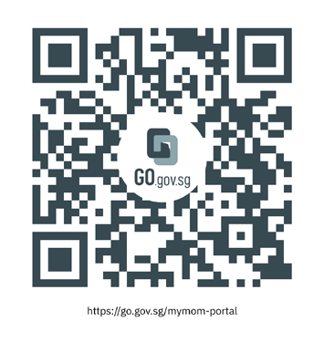
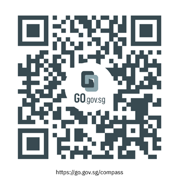

## Page 1

202040
POINTS
Recruit
Workforce Insights Tool
for Complementarity 
Assessment Framework 
(COMPASS)
C1
C2
What is the Workforce 
Insights tool? 
What is COMPASS? 
1/3
The WFI tool has benchmarking 
insights to help with your 
workforce planning and hiring. 
It lets you compare median 
salaries and non-monetary 
benefits across industries. 
The tool has been enhanced 
to help you find out your firm's 
score on these firm-related 
COMPASS criteria:  
COMPASS is a 
points-based assessment 
of Employment Pass (EP) 
applications based on
a set of individual and 
firm-related attributes. 
COMPASS will apply to new applications 
from Sep 2023 and renewals 
from Sep 2024. To qualify, 
EP candidates must:
• Meet the prevailing  
 qualifying salary 
• Score at least 40 points 
 under COMPASS 
SEP2023
• C3 – Diversity 
• C4 – Support for
 Local Employment

## Page 2

Log on to myMOM Portal 
with your Corppass account. 
How can I access the Workforce Insights tool? 
The Workforce Insights tool can 
be accessed via myMOM Portal.
(https://go.gov.sg/mymom-portal)
• COMPASS awards more points  
 when the candidate’s nationality  
 forms a small share of the firm’s  
 PMET employees. 
• No points are earned if the
 candidate's nationality currently  
 forms a significant share of its   
 PMET employees.
Find out how your firm scores on 
C3 in the “Diversity” tab. This tab 
shows you the top nationalities of 
PMETs in your firm.
Workforce
Insights
Nationalities/Citizenships of PMETs in your firm
myMOM Portal
Diversity Local PMETs Hiring Locals Retaining Locals
Nationalitiy/Citizenship
A
B
C
XX %
XX %
XX %
Share of PMETS in your firm
Workforce
Insights
Nationalities/Citizenships of PMETs in your firm
myMOM Portal
Diversity Local PMETs Hiring Locals Retaining Locals
Find out your firm’s score on the COMPASS 
firm-related attributes 
Workforce
Insights
Nationalities/Citizenships of PMETs in your firm
myMOM Portal
Diversity Local PMETs Hiring Locals Retaining Locals
Workforce
Insights
Nationalities/Citizenships of PMETs in your firm
myMOM Portal
Diversity Local PMETs Hiring Locals Retaining Locals
2/3
Step 1:
Diversity – C3
Click on Workforce Insights 
on the left menu of the portal. 
Step 2:

## Page 3

• COMPASS recognises firms that  
 create opportunities for the local  
 workforce and build complementary  
 teams of both local and foreign   
 professionals.
• Applications earn more points if  
 your firm has a relatively higher   
 share of locals among PMET   
 employees, compared to your   
 peers in the same sector. 
Find out how your firm scores on C4  
in the “Local PMETs” tab. This tab 
shows you your local PMET share 
relative to your sector peers.
Workforce
Insights
Industry benchmarking for local PMET share
myMOM Portal
Diversity Local PMETs Hiring Locals Retaining Locals
XX%
Your local PMET share How you fare within your sector
You are here
Workforce
Insights
Industry benchmarking for local PMET share
myMOM Portal
Diversity Local PMETs Hiring Locals Retaining Locals
XX%
Your local PMET share How you fare within your sector
You are here
3/3
For more information on COMPASS 
and answers to commonly asked questions, 
please visit https://go.gov.sg/compass.
Support for local 
employment – C4

