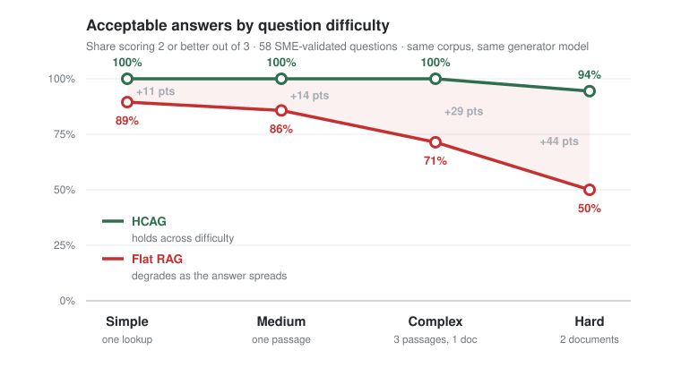
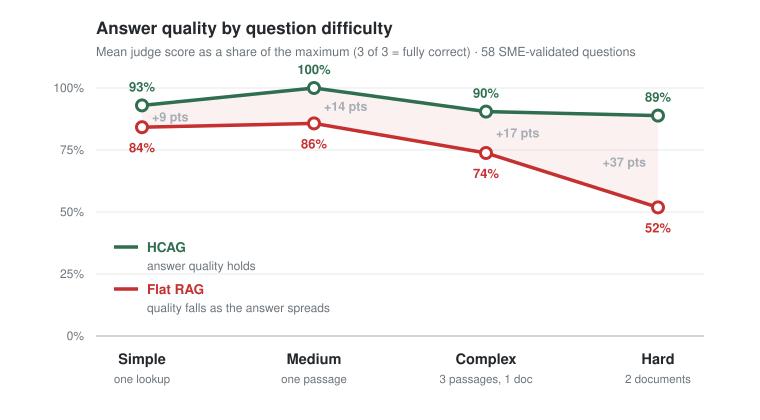

# HCAG vs flat RAG — executive summary

A hierarchical agent that loads whole document packets chosen by reasoning was tested against a
conventional flat RAG pipeline on the same corpus, with the same generator model, the same judge and
the same 58 questions. On a 0–3 scale, HCAG scores **2.76** against RAG's **2.16**, and answers
**98.3%** of questions acceptably against RAG's **72.4%**.

| | HCAG | Flat RAG |
|---|---:|---:|
| Mean score (0–3) | **2.76** | 2.16 |
| Acceptable answers (score ≥ 2) | **98.3%** | 72.4% |
| Fully correct answers (score 3) | **78%** | 47% |
| Wrong or misleading answers (score 0) | **0** | 2 |

Head to head: HCAG is higher on 24 questions, equal on 31, lower on 3.

## The pattern that matters

Performance separates progressively with how far the answer is spread across the corpus.

| Question type | What it needs | HCAG | Flat RAG | Gap |
|---|---|---:|---:|---:|
| Simple | one lookup | 100% | 89% | +11 pts |
| Medium | reasoning in one passage | 100% | 86% | +14 pts |
| Complex | three passages of one document | 100% | 71% | +29 pts |
| Hard | two different documents | 94% | 50% | +44 pts |

Read down the two columns, not across. The architecture that reasons about which documents to open
is insensitive to how scattered the answer is. The architecture that ranks passages by similarity
degrades steadily, and by the time an answer requires two documents it is wrong or incomplete half
the time.

Answer quality, scored on the same scale, shows the same shape. **HCAG holds between 89% and 100% of
a perfect answer at every level of difficulty; flat RAG falls from 84% to 52%.**

Even the narrowest gap is commercially material: on plain lookups flat RAG still misses one question
in nine.

## What the failures look like

**Flat RAG answers part of the question.** 13 of its 16 failures share one shape: one part of the
question answered correctly, another part not addressed at all. This is not a wrongness problem, it
is a coverage problem, and it is invisible to a reader who does not already know the full answer. It
appears at every difficulty level, including questions whose answer sits inside a single document.

**Two failures are worse than incomplete.** On one salary question flat RAG returned figures from
the wrong band of a table — plausible numbers a reader would act on, indistinguishable from correct
ones. On another it declined to answer material the corpus contains. In a regulated domain, the
first of those is the failure mode with real exposure attached; HCAG answered both correctly.

**Tables are the specific weak point.** Where a question turns on figures held in a table, flat RAG
routinely retrieves the prose describing the table and not the rows themselves, and answers with the
framework instead of the numbers. This is a structural consequence of chunking, not of model quality.

**HCAG is not perfect: 1 of 58.** Its single weak answer gave a general eligibility framework where
the question turned on a specialised exception. Flat RAG also failed that question.

Both user personas show the same picture: 100% and 97% for HCAG against 76% and 69% for flat RAG.

## How it was tested

- **One corpus, two retrieval designs.** A crawl of Singapore government work-pass pages, indexed by
  both systems. HCAG loads whole packets selected by reasoning over a catalog; flat RAG retrieves the
  top 8 chunks by hybrid vector and keyword search.
- **The generator is held constant.** Both sides run `claude-sonnet-4-5` at temperature 0, so the
  comparison isolates retrieval rather than model strength.
- **Questions drafted by AI, validated by a subject-matter expert.** Each question and its reference
  answer was generated from the corpus, then reviewed and corrected by an SME before use. The
  validated set is what was scored, and it ships with this report.
- **Independent scoring.** An LLM judge (`claude-opus-4-5`) scores each answer 0–3 against the
  reference and records a one-sentence justification per question, so any individual score can be
  audited.
- **Scope: textual knowledge.** A further 10 questions requiring a fact visible only inside an image
  were excluded. That question set is not yet good enough to draw conclusions from and is future work.

## Caveats

- One corpus, 58 questions, two personas. The pattern is consistent, the sample is not large.
- Reference answers come from the same corpus both systems index, so this measures retrieval and
  synthesis, not real-world regulatory correctness.
- An LLM judge is not bit-reproducible. Aggregates and the per-difficulty trend are stable; a single
  question's score should be read with its recorded justification.

## Supporting files

| File | What it is |
|---|---|
| [`benchmark-set/benchmark-persona-questions.csv`](./benchmark-set/benchmark-persona-questions.csv) | the SME-validated question set both systems were given |
| [`benchmark-set/hcag-persona-benchmark.csv`](./benchmark-set/hcag-persona-benchmark.csv) · [report](./benchmark-set/hcag-persona-benchmark.html) | HCAG answers, scores and judge reasoning |
| [`benchmark-set/rag-persona-benchmark.csv`](./benchmark-set/rag-persona-benchmark.csv) · [report](./benchmark-set/rag-persona-benchmark.html) | flat RAG answers, scores and judge reasoning |

## One line

With the same corpus and the same model on both sides, flat retrieval answers 72% of questions
acceptably and hierarchical packet loading answers 98%; the advantage grows from 11 points on simple
lookups to 44 points when an answer spans two documents.
