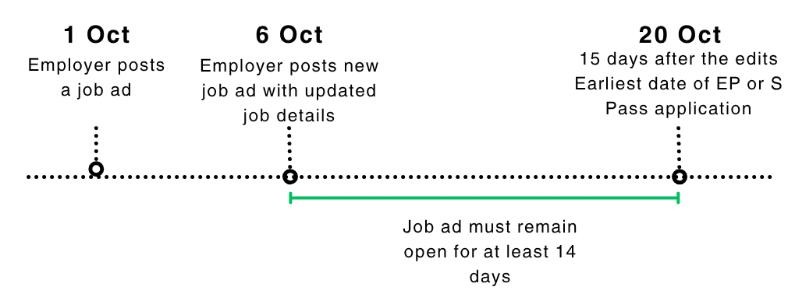

<!-- HCAG:COMPILED id=www.mom.gov.sg.passes-and-permits.employment-pass -->
---
catalog_token_estimate: 4577
children:
- www.mom.gov.sg.passes-and-permits.employment-pass.apply-for-a-pass
- www.mom.gov.sg.passes-and-permits.employment-pass.documents-required
- www.mom.gov.sg.passes-and-permits.employment-pass.eligibility
- www.mom.gov.sg.passes-and-permits.employment-pass.faq
- www.mom.gov.sg.passes-and-permits.employment-pass.key-facts
- www.mom.gov.sg.passes-and-permits.employment-pass.notify-mom-of-changes
- www.mom.gov.sg.passes-and-permits.employment-pass.renew-a-pass
- www.mom.gov.sg.passes-and-permits.employment-pass.taking-up-secondary-directorship
- www.mom.gov.sg.passes-and-permits.employment-pass.upcoming-changes-to-employment-pass-eligibility
content_token_estimate: 8294
descendants: 14
id: www.mom.gov.sg.passes-and-permits.employment-pass
image_urls:
  consider-all-candidates-fairly-fcf-edits-to-job-ad.png: https://www.mom.gov.sg/-/media/mom/documents/work-passes-and-permits/fcf-edits-to-job-ad.png
  consider-all-candidates-fairly-fcf-ep-application-date.png: https://www.mom.gov.sg/-/media/mom/documents/work-passes-and-permits/fcf-ep-application-date.png
kind: mixed
long_description: This folder is the main entry point for Singapore's Employment Pass
  (EP), which allows foreign professionals, managers, executives and technicians to
  work in Singapore at a minimum salary of $5,600/month. It directly defines the Fair
  Consideration Framework advertising requirements for EP applications — including
  MyCareersFuture ad accuracy rules, salary-range constraints (max ≤ 2× min), 14-day
  minimum posting duration, ad expiry limits, and ad-edit reposting obligations. It
  specifies family pass eligibility thresholds ($6,000/month for spouse/children,
  $12,000 for parents) and the applicable pass types (Dependant's Pass vs Long-Term
  Visit Pass). It covers the appeals process for rejected applications (3-month window,
  employer-only submission, 6-week processing). It details EP cancellation obligations
  (1-week deadline, pre-cancellation steps including tax clearance and repatriation),
  card replacement procedures and fees, the 5-year EP option for experienced tech
  professionals (salary thresholds by age, COMPASS Diversity and SOL requirements),
  a standard occupations reference list, and links to EP eServices and forms. Child
  folders hold detailed content on eligibility/COMPASS, application procedures, required
  documents, renewal, notifications, secondary directorships, and FAQs.
short_description: 'Hub for Singapore''s Employment Pass: overview, fair hiring/advertising
  rules, family passes, appeals, cancellation, card replacement, eServices, and 5-year
  tech EP.'
source_files:
- index.md
- consider-all-candidates-fairly.md
- passes-for-family.md
- appeal-against-a-rejected-application.md
- cancel-a-pass.md
- replace-a-pass-card.md
- list-of-standard-occupations.md
- experienced-tech-professionals-with-skills-in-shortage.md
- eservices-and-forms.md
source_urls:
- https://www.mom.gov.sg/passes-and-permits/employment-pass
- https://www.mom.gov.sg/passes-and-permits/employment-pass/consider-all-candidates-fairly
- https://www.mom.gov.sg/passes-and-permits/employment-pass/passes-for-family
- https://www.mom.gov.sg/passes-and-permits/employment-pass/appeal-against-a-rejected-application
- https://www.mom.gov.sg/passes-and-permits/employment-pass/cancel-a-pass
- https://www.mom.gov.sg/passes-and-permits/employment-pass/replace-a-pass-card
- https://www.mom.gov.sg/passes-and-permits/employment-pass/list-of-standard-occupations
- https://www.mom.gov.sg/passes-and-permits/employment-pass/experienced-tech-professionals-with-skills-in-shortage
- https://www.mom.gov.sg/passes-and-permits/employment-pass/eservices-and-forms
subtree_depth: 2
title: Employment Pass for foreign professionals in Singapore
token_size_estimate: 12871
---

# Employment Pass for foreign professionals in Singapore

Hub for Singapore's Employment Pass: overview, fair hiring/advertising rules, family passes, appeals, cancellation, card replacement, eServices, and 5-year tech EP.

## Sub-topics

#### Tree

- `www.mom.gov.sg.passes-and-permits.employment-pass.apply-for-a-pass` — How to apply for a Singapore Employment Pass (EP)
- `www.mom.gov.sg.passes-and-permits.employment-pass.documents-required` — Documents required for Employment Pass application
- `www.mom.gov.sg.passes-and-permits.employment-pass.eligibility` — Employment Pass eligibility: qualifying salary & COMPASS framework
  - `www.mom.gov.sg.passes-and-permits.employment-pass.eligibility.compass-c1-salary-benchmarks` — COMPASS C1 salary benchmarks by sector and age
  - `www.mom.gov.sg.passes-and-permits.employment-pass.eligibility.compass-c5-skills-bonus-shortage-occupation-list-sol` — COMPASS C5 Skills Bonus – Shortage Occupation List (SOL)
  - `www.mom.gov.sg.passes-and-permits.employment-pass.eligibility.compass-c6-strategic-economic-priorities-sep-bonus-eligible-programmes` — COMPASS C6 SEP Bonus – Eligible Programmes List
- `www.mom.gov.sg.passes-and-permits.employment-pass.faq` — Employment Pass (EP) frequently asked questions
  - `www.mom.gov.sg.passes-and-permits.employment-pass.faq.employment-pass` — Employment Pass holder FAQs and obligations
- `www.mom.gov.sg.passes-and-permits.employment-pass.key-facts` — Employment Pass (EP) overview and key facts
- `www.mom.gov.sg.passes-and-permits.employment-pass.notify-mom-of-changes` — Notify MOM of updates for Employment Pass holders
- `www.mom.gov.sg.passes-and-permits.employment-pass.renew-a-pass` — Renewing an Employment Pass (EP) — process and criteria
- `www.mom.gov.sg.passes-and-permits.employment-pass.taking-up-secondary-directorship` — Secondary directorship for Employment Pass holders
- `www.mom.gov.sg.passes-and-permits.employment-pass.upcoming-changes-to-employment-pass-eligibility` — COMPASS framework and Shortage Occupation List for Employment Pass
  - `www.mom.gov.sg.passes-and-permits.employment-pass.upcoming-changes-to-employment-pass-eligibility.complementarity-assessment-framework-compass` — COMPASS C5 Skills Bonus – Shortage Occupation List (SOL)

#### `www.mom.gov.sg.passes-and-permits.employment-pass.apply-for-a-pass`
- **path**: `apply-for-a-pass/`
- **depth**: 1
- **parent**: `www.mom.gov.sg.passes-and-permits.employment-pass`
- **kind**: leaf
- **title**: How to apply for a Singapore Employment Pass (EP)
- **short**: Step-by-step EP application process for employers, employment agents, and overseas-company sponsors, including forms and timelines.
- **long**: Covers the end-to-end procedure for applying for a Singapore Employment Pass: submitting an application via EP eService (for Singapore-registered companies) or via the sponsorship route (for overseas companies needing a local sponsor), required fees ($105), processing times (10 business days or 6 weeks for sponsorship), checking application status, and what happens upon approval (IPA letter issuance). Also includes the candidate's form (personal particulars, travel document, work experience, educational qualifications, membership details, declarations) and the sponsorship application form with instructions for candidates and local sponsors.
- **tokens**: 11604

#### `www.mom.gov.sg.passes-and-permits.employment-pass.documents-required`
- **path**: `documents-required/`
- **depth**: 1
- **parent**: `www.mom.gov.sg.passes-and-permits.employment-pass`
- **kind**: leaf
- **title**: Documents required for Employment Pass application
- **short**: Lists all documents needed for an EP application: passport biodata, ACRA profile, qualification verification proof, and occupation-specific requirements.
- **long**: This folder specifies the documents that must be prepared and uploaded when submitting a Singapore Employment Pass application. Core requirements include the candidate's passport biodata page, the company's ACRA business profile, and qualification verification proof. It provides detailed travel-document upload specifications (format, image quality, machine-readable zone visibility, name-entry rules). It lists additional document requirements for regulated occupations—healthcare professionals, lawyers, football players/coaches, and food-establishment employees—with the relevant professional bodies and contact details. It also contains step-by-step guides for submitting qualification verification proof via background screening companies, government/awarding-institution verification portals, and OpenCerts digital certificates, including a reference list of institutions offering online verification portals.
- **tokens**: 45623

#### `www.mom.gov.sg.passes-and-permits.employment-pass.eligibility`
- **path**: `eligibility/`
- **depth**: 1
- **parent**: `www.mom.gov.sg.passes-and-permits.employment-pass`
- **kind**: mixed
- **title**: Employment Pass eligibility: qualifying salary & COMPASS framework
- **short**: Defines the 2-stage EP eligibility framework — qualifying salary thresholds by age/sector and the COMPASS points-based assessment system.
- **long**: This folder is the authoritative source for Singapore Employment Pass eligibility. It defines the two-stage framework: Stage 1 sets EP qualifying salary minimums by candidate age (23–45+) for both general and financial-services sectors, with current thresholds and upcoming Jan 2027/2028 increases in full age-band tables. Stage 2 defines COMPASS, the points-based complementarity assessment requiring 40 points across six criteria — C1 Salary benchmarking, C2 Qualifications (top-tier vs other degree vs none), C3 Diversity (candidate nationality share among firm PMETs), C4 Support for Local Employment (local PMET share vs sector), C5 Skills Bonus (Shortage Occupation List), and C6 Strategic Economic Priorities bonus — specifying point thresholds, scoring rules, default scores for small firms, SEP bonus validity/renewal conditions, and redeployment restrictions for SOL-dependent passes. It also defines COMPASS exemptions (salary ≥$22,500, intra-corporate transferees, roles ≤1 month) and includes illustrative case studies. References tools (SAT, Workforce Insights) and notes that the Fair Consideration Framework job advertising requirement applies.
- **tokens**: 46971

#### `www.mom.gov.sg.passes-and-permits.employment-pass.eligibility.compass-c1-salary-benchmarks`
- **path**: `eligibility/compass-c1-salary-benchmarks/`
- **depth**: 2
- **parent**: `www.mom.gov.sg.passes-and-permits.employment-pass.eligibility`
- **kind**: leaf
- **title**: COMPASS C1 salary benchmarks by sector and age
- **short**: Defines the exact fixed-monthly-salary thresholds (65th and 90th percentile) by sector and age for scoring 10 or 20 COMPASS C1 points.
- **long**: Contains the complete C1 salary benchmark tables released by MOM (Aug 2025 and Aug 2026 editions), listing the required fixed monthly salary for 10 points (65th percentile) and 20 points (90th percentile) for every age band (≤23 through ≥45) across all COMPASS sectors—including Accommodation, Administrative & Support, Air & Sea Transport, Arts/Entertainment/Recreation, Banking, Construction, Education, F&B, Fund Management, Health & Social Services, ICT, Insurance, Land Transport & Logistics, Manufacturing, Media, Other Community/Social/Personal Services, Professional Services, Public Administration & Defence, and others. Also explains that benchmarks are derived from MOM's Comprehensive Labour Force Survey and notes that salary requirements increase progressively with candidate age from 23 to 45.
- **tokens**: 23759

#### `www.mom.gov.sg.passes-and-permits.employment-pass.eligibility.compass-c5-skills-bonus-shortage-occupation-list-sol`
- **path**: `eligibility/compass-c5-skills-bonus-shortage-occupation-list-sol/`
- **depth**: 2
- **parent**: `www.mom.gov.sg.passes-and-permits.employment-pass.eligibility`
- **kind**: leaf
- **title**: COMPASS C5 Skills Bonus – Shortage Occupation List (SOL)
- **short**: Full Shortage Occupation List for COMPASS C5 Skills Bonus: eligible job titles, job duties, additional requirements, and qualifying criteria by sector.
- **long**: This folder contains the complete Singapore Shortage Occupation List (SOL) used for the COMPASS C5 Skills Bonus and 5-year duration EP eligibility. It defines what the SOL is, how occupations are selected (strategic importance, labour shortage, local pipeline commitment), and that the list is updated annually with a comprehensive review every three years. The bulk of the content enumerates each shortage occupation organized by sector (agritech, financial services/private banking, carbon services, healthcare, infocomm technology, etc.), specifying for each role the eligible job titles, required job duties, additional requirements (qualifications, work experience, employer type, supporting agency verification), and application instructions such as matching the job title to the MyCareersFuture advertisement. This is the authoritative reference for determining whether a specific role qualifies under the SOL.
- **tokens**: 22787

#### `www.mom.gov.sg.passes-and-permits.employment-pass.eligibility.compass-c6-strategic-economic-priorities-sep-bonus-eligible-programmes`
- **path**: `eligibility/compass-c6-strategic-economic-priorities-sep-bonus-eligible-programmes/`
- **depth**: 2
- **parent**: `www.mom.gov.sg.passes-and-permits.employment-pass.eligibility`
- **kind**: leaf
- **title**: COMPASS C6 SEP Bonus – Eligible Programmes List
- **short**: Lists the specific programmes and supporting agencies whose participation qualifies an organisation for the COMPASS C6 Strategic Economic Priorities bonus.
- **long**: Defines the complete set of eligible programmes that qualify an organisation for the COMPASS C6 Strategic Economic Priorities (SEP) bonus. Covers 15 programmes across six supporting agencies: EDB (e.g. DEI, Pioneer Certificate, RISC, large manufacturers, Global Trader Programme), EnterpriseSG (Scale-Up SG, SGEP, qualifying high-growth startups), IMDA (Accreditation Digital, Spark Programme), MPA (Maritime Sector Incentive awards, Maritime Cluster Fund), STB (selected BIF grantees, Singapore Tourism Accelerator participants), and NTUC (progressive firms working with the Labour Movement via Company Training Committees or Government-supported programmes). Provides agency contact emails for queries. Relevant when determining whether a firm's programme participation satisfies the SEP bonus requirement.
- **tokens**: 1063

#### `www.mom.gov.sg.passes-and-permits.employment-pass.faq`
- **path**: `faq/`
- **depth**: 1
- **parent**: `www.mom.gov.sg.passes-and-permits.employment-pass`
- **kind**: node
- **title**: Employment Pass (EP) frequently asked questions
- **short**: FAQs covering EP-specific employer obligations, salary definitions, pass cancellation, secondary directorships, job changes, and related practical queries.
- **long**: This folder compiles frequently asked questions about Singapore's Employment Pass (EP). Topics include employer obligations such as work injury compensation insurance for manual workers, repatriation costs, and the duty to cancel passes within one week of employment ending. It explains the definition of fixed monthly salary, rules on EP holders taking secondary directorships via Letter of Consent (LOC), guidance on changing jobs while on an EP, eService account administration, qualification lookup issues in the Self-Assessment Tool, and personal matters like marrying Singaporeans/PRs or applying for PR status. It also clarifies that medical insurance obligations differ for EP holders compared to other pass types and addresses Financial Services sector classification for EP purposes.
- **tokens**: 0

#### `www.mom.gov.sg.passes-and-permits.employment-pass.faq.employment-pass`
- **path**: `faq/employment-pass/`
- **depth**: 2
- **parent**: `www.mom.gov.sg.passes-and-permits.employment-pass.faq`
- **kind**: leaf
- **title**: Employment Pass holder FAQs and obligations
- **short**: Practical Q&A for EP holders and employers on medical obligations, pass cancellation, secondary directorships, repatriation costs, salary definitions, and eService accounts.
- **long**: This folder contains a collection of frequently asked questions about Singapore's Employment Pass (EP). It covers employer medical obligations (clarifying that medical insurance is not required for EP holders, unlike WP/S Pass), work injury compensation insurance requirements for manual workers, employer duty to cancel passes within one week of employment ending, rules on EP holders taking secondary directorships via Letter of Consent (LOC) including the common corporate shareholding requirement, employer repatriation cost obligations, the definition of fixed monthly salary (basic monthly salary plus fixed monthly allowances, excluding variable components), guidance on changing jobs while on an EP, eService account administration, and what to do when a candidate's qualification cannot be found in the Self-Assessment Tool. It also addresses whether EP holders need approval to marry Singaporeans/PRs, applying for PR status, and the Financial Services sector classification for EP purposes.
- **tokens**: 3907

#### `www.mom.gov.sg.passes-and-permits.employment-pass.key-facts`
- **path**: `key-facts/`
- **depth**: 1
- **parent**: `www.mom.gov.sg.passes-and-permits.employment-pass`
- **kind**: leaf
- **title**: Employment Pass (EP) overview and key facts
- **short**: Quick-reference overview of Singapore's Employment Pass: who it is for, qualifying salary, duration, application process map, and pass features.
- **long**: This folder provides a high-level factual summary of the Singapore Employment Pass (EP). It states who the pass is for (foreign professionals, managers, executives), who can apply (employer or appointed agent), the qualifying fixed monthly salary range (from $5,600, increasing with age, higher for financial services), pass duration, renewability, that no foreign worker levy or quota applies, and that family passes may be available. It includes a step-by-step pass map outlining what to do before applying, before arrival, upon arrival, and on an ongoing basis (notify MOM of changes, renew, replace, or cancel). It also reproduces the Employment of Foreign Manpower (Work Passes) Regulations 2012, which formally establish the categories of work passes (including the EP) and set out application requirements, conditions, and schedules governing employer and employee obligations for each pass type.
- **tokens**: 36533

#### `www.mom.gov.sg.passes-and-permits.employment-pass.notify-mom-of-changes`
- **path**: `notify-mom-of-changes/`
- **depth**: 1
- **parent**: `www.mom.gov.sg.passes-and-permits.employment-pass`
- **kind**: leaf
- **title**: Notify MOM of updates for Employment Pass holders
- **short**: When and how EP holders and employers must notify MOM of changes to salary, company details, occupation, address, personal info, and more.
- **long**: This folder details the specific notification obligations for Employment Pass holders and their employers when changes occur. It covers procedures and timelines for reporting salary changes (lowering requires 1-month advance notice; raising can wait until renewal unless applying for dependant privileges), company name/financial info/address/business entity changes, occupation updates, pass holder residential address or mobile number changes (within 5 days), personal particulars updates (passport, name, nationality, etc.), post-approval changes to qualifications or work location, missing pass holder reporting (within 1 week), transfer of pass holders to related companies, and providing references for ex-pass holders. It also references a standard occupation list used when updating occupation in EP eService.
- **tokens**: 77519

#### `www.mom.gov.sg.passes-and-permits.employment-pass.renew-a-pass`
- **path**: `renew-a-pass/`
- **depth**: 1
- **parent**: `www.mom.gov.sg.passes-and-permits.employment-pass`
- **kind**: leaf
- **title**: Renewing an Employment Pass (EP) — process and criteria
- **short**: How to renew a Singapore Employment Pass, including timelines, renewal criteria, steps, costs, and the EP (Sponsorship) renewal form.
- **long**: Covers the end-to-end process for renewing a Singapore Employment Pass (EP). Specifies that renewal can be submitted up to 6 months before expiry (3 months for EP Sponsorship), costs nothing beyond the pass fee, and yields a renewed pass of up to 3 years. States renewal criteria: the candidate must earn at least the EP qualifying salary, work in a managerial/executive/specialised role for the same employer, and pass COMPASS (noting the $22,500 fixed-monthly-salary exemption, with COMPASS itself defined elsewhere). Details the how-to steps via myMOM Portal and the separate EP (Sponsorship) renewal application form, including all seven parts of that form (personal particulars, education, sponsor company details, overseas employer, and declarations). Also covers post-renewal steps: receiving the IPA letter, getting the pass issued before IPA or current pass expiry, and handling the existing card.
- **tokens**: 5585

#### `www.mom.gov.sg.passes-and-permits.employment-pass.taking-up-secondary-directorship`
- **path**: `taking-up-secondary-directorship/`
- **depth**: 1
- **parent**: `www.mom.gov.sg.passes-and-permits.employment-pass`
- **kind**: leaf
- **title**: Secondary directorship for Employment Pass holders
- **short**: Process and eligibility for appointing an EP holder from a related company to another company's Board of Directors via Letter of Consent (LOC).
- **long**: Covers the requirements and process for a company to appoint an Employment Pass (EP) holder employed by another company to its Board of Directors as a secondary directorship. Defines the eligibility criteria MOM uses to grant a Letter of Consent (LOC): the secondary employer must be related by corporate shareholding (direct or indirect) to the EP holder's primary employer, and the directorship must relate to the holder's primary employment. Illustrates indirect shareholding scenarios (holding companies, subsidiaries). Also addresses directorships in unrelated companies, which require support from a relevant sector government agency. Details employer obligations including obtaining the primary employer's consent, applying for the LOC, and registering with ACRA, along with application timeline, required documents, and validity/renewal rules.
- **tokens**: 912

#### `www.mom.gov.sg.passes-and-permits.employment-pass.upcoming-changes-to-employment-pass-eligibility`
- **path**: `upcoming-changes-to-employment-pass-eligibility/`
- **depth**: 1
- **parent**: `www.mom.gov.sg.passes-and-permits.employment-pass`
- **kind**: node
- **title**: COMPASS framework and Shortage Occupation List for Employment Pass
- **short**: Defines the COMPASS complementarity assessment framework, including the full Shortage Occupation List (SOL) with eligible occupations, sectors, and requirements.
- **long**: This branch covers the COMPASS (Complementarity Assessment Framework) component of Singapore's Employment Pass eligibility. Its primary content is the Shortage Occupation List (SOL) used for the COMPASS C5 Skills Bonus and 5-year EP duration eligibility, detailing how occupations are selected (strategic importance, labour shortage, local pipeline commitment), the full enumeration of shortage occupations organized by sector (agritech, financial services, carbon services, healthcare, infocomm technology, etc.), eligible job titles, required duties, qualification or experience requirements, supporting agencies, and application procedures such as job-title matching and documentation uploads.
- **tokens**: 0

#### `www.mom.gov.sg.passes-and-permits.employment-pass.upcoming-changes-to-employment-pass-eligibility.complementarity-assessment-framework-compass`
- **path**: `upcoming-changes-to-employment-pass-eligibility/complementarity-assessment-framework-compass/`
- **depth**: 2
- **parent**: `www.mom.gov.sg.passes-and-permits.employment-pass.upcoming-changes-to-employment-pass-eligibility`
- **kind**: leaf
- **title**: COMPASS C5 Skills Bonus – Shortage Occupation List (SOL)
- **short**: Full Shortage Occupation List for COMPASS C5 Skills Bonus: eligible job titles, job duties, additional requirements, and qualifying criteria by sector.
- **long**: This folder contains the complete Singapore Shortage Occupation List (SOL) used for the COMPASS C5 Skills Bonus and 5-year duration EP eligibility. It defines what the SOL is, how occupations are selected (strategic importance, labour shortage, local pipeline commitment), and that the list is updated annually with a comprehensive review every three years. The bulk of the content enumerates each shortage occupation organized by sector—including agritech, financial services (ultra-high/high net worth advisory), carbon services, healthcare, and infocomm technology—specifying eligible job titles, required job duties, additional qualification or experience requirements, and the supporting government agency for each role. It also details application procedures such as matching the job title to the MyCareersFuture advertisement and uploading required documentation.
- **tokens**: 7536

## Content

<!-- source: index.md -->
# Employment Pass

- 
## Key factsOverview and key facts about the pass, including who it is for, validity and pass map.
- 
## Consider all candidates fairlyYou must advertise on MyCareersFuture and consider all candidates fairly before you apply for an Employment Pass.
- 
## EligibilityIncludes EP qualifying salary (Stage 1), COMPASS (Stage 2) and the Self-Assessment Tool.
- 
## Passes for familyEligibility, which family members you can bring in and the passes available.
- 
## Documents requiredDocuments required to apply for an Employment Pass.
- 
## Apply for a passIncludes how to apply for a pass and check the application status.
- 
## Appeal against a rejected applicationWhen you should appeal, who can appeal and how to submit an appeal.
- 
## Renew a passWhen and how to renew an Employment Pass before it expires.
- 
## Cancel a passWhen and how to cancel an Employment Pass.
- 
## Replace a pass cardHow to replace a lost, damaged or stolen Employment Pass card.
- 
## Notify MOM of updatesWhen and how to notify MOM, including updating company name and address, occupation, passport details, salary and residential address.
- 
## Taking up secondary directorshipWhen and how to appoint a pass holder to your Board of Directors.
- 
## List of standard occupations for Employment PassStandard occupations for filling out the manual Employment Pass application form.
- 
## Experienced tech professionals with skills in shortageFrom September 2023, experienced tech professionals with skills in shortage may apply for a longer 5-year duration EP.

# Employment Pass

The Employment Pass allows foreign professionals, managers, executives and technicians to work in Singapore. Candidates need to earn at least $5,600 a month. Employers must also demonstrate that they have fairly considered all jobseekers.

<!-- source: consider-all-candidates-fairly.md -->
# Consider all candidates fairly before you apply for an Employment Pass

There are updates on this page. [Read more]

# Consider all candidates fairly before you apply for an Employment Pass

To promote fair employment practices and improve labour market transparency, employers submitting Employment Pass (EP) applications must first advertise the job on [MyCareersFuture](https://www.mycareersfuture.gov.sg) and consider all candidates fairly. 

## Fair Consideration Framework (FCF)

The [Fair Consideration Framework (FCF)](https://www.mom.gov.sg/employment-practices/fair-consideration-framework) sets out the requirements for all employers in Singapore to consider candidates fairly for job opportunities. Employers should not discriminate candidates based on non-job related characteristics such as age, sex, nationality or race.

All employers in Singapore are expected to adhere to the [Tripartite Guidelines on Fair Employment Practices](https://www.tal.sg/tafep/getting-started/fair/tripartite-guidelines). 

## Advertising requirements

### Accuracy of advertisement

The advertisement should clearly explain the job requirements and salary offered to attract the right candidates.

We will reject any EP applications linked to advertisements that are discriminatory or do not represent the job accurately:

- The advertisement must not contain discriminatory words or phrases - [see examples](https://www.tal.sg/tafep/employment-practices/recruitment/writing-job-advertisements) .
- The job advertised must match the occupation in the EP application.
- The employer submitting the EP application must be the same as the one in the job advertisement.
- The salary offered must be clear, specific, and consistent. Therefore the salary range advertised:
    
  - Must be visible to all candidates and cannot be hidden.
  - Cannot be too broad. The maximum salary cannot exceed two times of the minimum salary. For example, if the minimum salary is $4,500, then the maximum salary should not exceed $9,000.
  - Must contain the salary offered to the EP candidate.
- If you are using an advertisement for multiple EP applications, the total number of EP applications cannot exceed the number of vacancies in the advertisement.

### Duration of advertisement

The [MyCareersFuture](https://www.mycareersfuture.gov.sg/) job advertisement must be open for at least 14 consecutive days to allow job seekers to view and apply for the vacancy. This also applies if you repost an advertisement that has closed.

You must post a new advertisement if you change any advertisement details, including the unique entity number of the hiring organisation, occupation, salary and the number of vacancies. You must keep it open for at least another 14 consecutive days before you can submit the EP application. This is to ensure that job seekers are aware of the updated job details and have a chance to apply for it.

Job advertisements that have expired for more than 3 months or closed for more than 3 months, cannot be used for EP applications. You must advertise the vacancy again to reach out to other job seekers.

<!-- source: passes-for-family.md -->
# Passes for families of Employment Pass holders

As an Employment Pass holder, you can get certain family members to join you in Singapore if you meet the eligibility requirements.

## Who is eligible

To be eligible, you need to:

- Earn **at least $6,000** a month.
- Hold an Employment Pass.

These are the family members you can bring in and the type of pass they need:

| Family member | Pass type | 
|---|---|
| Legally married spouse | Dependant’s Pass | 
| Unmarried children under 21 years old, including those legally adopted | Dependant’s Pass | 
| Common-law spouse | Long-Term Visit Pass | 
| Unmarried handicapped children aged 21 and above | Long-Term Visit Pass | 
| Unmarried step-children under 21 years old | Long-Term Visit Pass | 
| Parents (Only for EP holders earning **at least $12,000** ) | Long-Term Visit Pass | 

## How to apply

To apply, your employer will need to submit a separate application for each family member. The application can be submitted together with the Employment Pass application or separately.

Find out more about the requirements and application process for [Dependant’s Pass](https://www.mom.gov.sg/passes-and-permits/dependants-pass) and [Long-Term Visit Pass](https://www.mom.gov.sg/passes-and-permits/long-term-visit-pass).

<!-- source: appeal-against-a-rejected-application.md -->
# Appeal against a rejected Employment Pass application

You have 3 months to appeal an unsuccessful Employment Pass application, but you should do so only if you can address the reasons for rejection.

You can check the rejection advisory in [EP eService](https://www.mom.gov.sg/eservices/services/employment-pass-eservice) to view the reasons for rejection and advice on what to do next. If you applied manually, check the rejection letter.

## When to appeal

You should only appeal if you can address the issues in your rejection advisory. There will be no change in the outcome unless there is new information in the appeal.

To help you make your decision:

- Use the [Self-Assessment Tool (SAT)](https://www.mom.gov.sg/eservices/services/employment-s-pass-self-assessment-tool) to get an idea of whether the candidate qualifies.
- Check the rejection advisory for the steps you need to take.

You need to submit your appeal **within 3 months** of getting the rejection. If you miss this time period, you will have to submit a new application.

## Who can appeal

Only the **employer or authorised third party** who submitted the application can make enquiries or appeals. We will not entertain enquiries or appeals from the candidate, or anyone else.

## Submit an appeal

*When: Within 3 months of rejection*

You can make an appeal through [EP eService](https://www.mom.gov.sg/eservices/services/employment-pass-eservice).

Include supporting documents and remarks only if they are required. Otherwise, it may result in a longer processing time.

Supporting documents and remarks are not needed if:

- The candidate can now meet the qualifying salary and COMPASS criteria.
- Outstanding issues have been addressed, including correcting inconsistencies between the application qualification information and the verification proof, meeting job advertising requirements, and resolving any IRAS tax matters.

After making your appeal, you can log in to EP eService to:

- Check the status of your appeal.
- Print the outcome letter.

If you receive an email from MOM requesting for more documents, you can submit them using this [online form](https://form.gov.sg/#!/5f8d4eadef8dab00112fd313).

## How long it takes

**85% of appeals are processed within 6 weeks**. You can always log in to [EP eService](https://www.mom.gov.sg/eservices/services/employment-pass-eservice) to check your appeal status.

<!-- source: cancel-a-pass.md -->
# Cancel an Employment Pass

You must cancel an Employment Pass (EP) if the pass holder no longer works for you.

## At a glance

| When to cancel the pass | Within 1 week after the [last day of notice](https://www.mom.gov.sg/employment-practices/termination-of-employment/termination-with-notice) . You can submit your cancellation request **up to 14 days** in advance. For example, if you want the pass to be cancelled on 15 February, you can submit the request from 1 February. You **do not**  need to cancel the pass if:  **Tip:**  You can also[request for an STVP](https://www.mom.gov.sg/eservices/services/employment-pass-eservice) for your pass holder upon cancellation, or within a day after the EP expiration date. The STVP will grant them valid stay in Singapore for up to 90 days in the meantime. | 
|---|---|
| Who can cancel | Employer or employment agent | 
| How long it takes | Cancellation is immediate, unless you are submitting an advance cancellation request. | 

**Note:**

- If the pass holder has left Singapore permanently, you must cancel the EP **within 1 week from the departure date** , unless it has expired.
- Once the pass is cancelled, all related [passes issued to family members](https://www.mom.gov.sg/passes-and-permits/employment-pass/passes-for-family) will also be cancelled. You will not be able to reinstate them.

## Before cancelling

You need to:

1. **Give your pass holder reasonable notice** on their upcoming repatriation.
2. [**Seek tax clearance**](<https://www.iras.gov.sg/taxes/individual-income-tax/employers/tax-clearance-for-foreign-spr-employees-(ir21)/getting-tax-clearance-a-step-by-step-guide>) from the Inland Revenue Authority of Singapore (IRAS) at least 1 month before the last day of employment.
3. **Settle all outstanding employment issues** that your pass holder may raise, including salary payments.
4. **Buy an air ticket with check-in luggage**  and pay for all connecting transport costs to the international port of entry in your pass holder’s home country or the region nearest to their hometown. This applies unless your pass holder agrees in writing to bear the cost instead.

Before booking the flight, please check:

- **Whether the airline has any requirements (such as health or visa) for boarding** and ensure your pass holder complies with them. Otherwise, they may not be allowed to board.
- **The home country's or region's embassy website for entry requirements** . Alternatively, you may refer to[MFA’s travel guides](https://www.mfa.gov.sg/where-are-you-travelling-to) .

## How to cancel

Log in to [EP eService](https://www.mom.gov.sg/eservices/services/employment-pass-eservice) on myMOM Portal.

For pass holders who are still in Singapore, you can **request for an STVP** to grant them a valid stay for up to 90 days from the date of application.

The pass holder and you will both receive the STVP by email. The pass holder needs to show the STVP and a valid passport to the immigration officer when leaving Singapore.

## After cancelling

Once the EP is cancelled:

- Your pass holder **cannot work** , even while waiting to leave Singapore.
- Please cut the card in half and discard it to prevent misuse.

### Consequences of overstaying

If your pass holder is still in Singapore, please ensure that they have a valid legal stay throughout. Otherwise, an **overstaying fine** will be imposed.

It is also a **criminal offence** for:

- Foreigners to remain beyond the expiry date of a visa
- Employers to employ foreigners without a valid work pass

<!-- source: replace-a-pass-card.md -->
# Replace an Employment Pass card

## At a glance

| When to replace | If your pass card is lost, stolen or damaged, you must get your employer to apply for a replacement within 1 week. **Note:**  | 
|---|---|
| Who can apply | Employer or appointed employment agent (EA). | 
| How much it costs | For a damaged card, the fee is $65.40. For a lost or stolen card, the fee is:  Fees are inclusive of GST and non-refundable. | 
| How long it takes | Immediate for most cases. Card collection: 4 working days after approval. | 

**Note:**

- Encourage your pass holder to use their digital work pass in the [SGWorkPass](https://www.mom.gov.sg/eservices/sgworkpass) app when required. This will lower their risk of losing or damaging their physical cards. Digital work passes are free and available immediately upon set up
- We may call you for an interview before we issue a new card, or if you lose your card repeatedly.
- If the lost card is found, please return it to us immediately by post: Ministry of Manpower, 18 Havelock Road, Singapore 059764.

## Apply for a replacement card

*When: Within 1 week of damage or loss*

*Processing time: Immediate for most cases*

To submit an application:

1. Log in to [EP eService](https://www.mom.gov.sg/eservices/services/employment-pass-eservice) and provide the required information.
2. Pay the replacement fees using GIRO, Visa, Mastercard or Amex. Once you submit the request, no refund is allowed.
3. If the request is approved, the pass holder and you will both receive the card replacement letter by email. It will have instructions on collecting the replacement card.

Pass holders can then proceed to collect the replacement card.

## Collect the replacement card

*When: 4 working days after approval*

The pass holder can collect the card at the [Employment Pass Services Centre (EPSC)](https://www.mom.gov.sg/contact-us/locations#Tab-EP) **4 working days** after the request is approved. You don’t need an appointment for card collection.

Bring along these documents for the visit:

- Original passport
- Card replacement letter
- The damaged card (if applicable)
- Police report (for stolen cards)
 **Note:** Overseas police reports should be translated to English.

For lost or stolen cards, the pass holder must collect the replacement card **in person**.

For replacement of damaged cards, you can authorise someone to collect the card on the pass holder's behalf. Make sure the authorised person brings these along:

- An authorisation letter from your company
- NRIC, pass card or passport for verification
- The damaged card
- Pass holder's original passport
- Card replacement letter

<!-- source: list-of-standard-occupations.md -->
# List of standard occupations for Employment Pass

You are using a version of browser which will not be supported after 27 May 2018. To continue to transact with MOM securely, please follow these steps to enable the Transport Layer Security (TLS) of your web browser, or upgrade to the latest version of your browser.

Use this list of standard occupations for filling out the Occupations field of the manual Employment Pass application form. Choose the closest match for the candidate's occupation.

We are currently updating the list of standard occupations tool.

To see the updated list of standard occupations, you can refer to the following lists:

<!-- source: experienced-tech-professionals-with-skills-in-shortage.md -->
# 5-year duration Employment Pass for experienced tech professionals with skills in shortage

    Experienced tech professionals with skills in shortage may apply for a longer 5-year duration EP. 
    

This will give greater certainty to experienced tech professionals as well as businesses hiring them, and allow Singapore to anchor tech capabilities in areas where the local pipeline is still being developed.

Eligible candidates must meet the following criteria:

- Fill specific tech occupations on the [COMPASS Shortage Occupation List (SOL)](https://www.mom.gov.sg/passes-and-permits/employment-pass/eligibility/compass-c5-skills-bonus-shortage-occupation-list-sol)
- Pass COMPASS and score at least 10 points on [Criterion 3 (Diversity)](https://www.mom.gov.sg/passes-and-permits/employment-pass/eligibility#criteria-details)
- Meet the following fixed monthly salary criteria:

| Applies to | 5-year tech EP salary criteria | 
|---|---|
|  | Earn a fixed monthly salary of **at least $10,700** (for candidates aged 36 and below. The salary required increases with age,**up to $14,270** for candidates aged 45 and above) | 
|  | Earn a fixed monthly salary of **at least $11,500** (for candidates aged 36 and below. The salary required increases with age,**up to $15,499** for candidates aged 45 and above) | 

[further verification checks](https://www.mom.gov.sg/passes-and-permits/employment-pass/upcoming-changes-to-employment-pass-eligibility/complementarity-assessment-framework-compass/compass-shortage-occupation-list#what-additional-requirements-must-my-candidate-meet-to-obtain-the-sol-bonus-points).

<!-- source: eservices-and-forms.md -->
# Employment Pass eServices and forms

## eServices

- 
[Employment Pass eService](https://www.mom.gov.sg/eservices/services/employment-pass-eservice)Estimated time to complete: 10 – 20 mins Employers or EAs can: 
  - Submit an application for EP, S Pass, Dependant’s Pass, Long-Term Visit Pass or Letter of Consent
  - Issue, renew or cancel a pass (all pass types, except Work Permit)
- 
[Make or manage appointment](https://www.mom.gov.sg/eservices/services/make-an-appointment)Estimated time to complete: 10 – 20 mins Make or manage appointment for services available at MOM Services Centre (MOMSC) or Employment Pass Services Centre (EPSC) using our new appointment system with improved navigation and enhanced security features.
- 
[Check work pass and application status](https://www.mom.gov.sg/eservices/services/check-work-pass-and-application-status)Estimated time to complete: 1 – 5 mins Employers can check the status of a work pass application or the validity of a work pass. Work Permit holders can also check their salary information. No log in is required.
- 
[Employment / S Pass Self-Assessment Tool (SAT)](https://www.mom.gov.sg/eservices/services/employment-s-pass-self-assessment-tool)Estimated time to complete: 10 – 20 mins Employers can get a preliminary indication of whether a candidate is likely to get an Employment Pass or S Pass.
- 
[Enquire about Employment Pass, S Pass or other passes matters](https://form.gov.sg/655313bd9520f10012b4cd8a)Estimated time to complete: 10 – 20 mins Persons or organisations can enquire on Employment Pass, S Pass or other passes matters.
- 
[Appeal to refund overstaying fines (For business employers or employment agents)](https://go.gov.sg/refund-os)Estimated time to complete: 5 mins Business employers or EAs can appeal to refund overstaying fines for their pass holders.
- 
[Apply secondary directorship for Employment Pass holder](https://go.gov.sg/apply-secondary-directorship)Estimated time to complete: 10 mins Employers can appoint an Employment Pass holder from another company to be on their company's board of directors.
- 
[Cancel Employment Pass (Sponsorship)](https://go.gov.sg/cancel-sponsor-ep)Sponsors can cancel the Employment Pass (Sponsorship) for holders who have already left Singapore.
- 
[Extend notification letter validity, card registration period or change collection date for Employment Pass holders](https://go.gov.sg/change-date-epsc)Estimated time to complete: 5 mins Persons or organisations can extend notification letter validity, card registration period or change collection date for Employment Pass holder.
- 
[myMOM Portal](https://www.mom.gov.sg/eservices/services/mymom-portal)Estimated time to complete: 10 – 20 mins Business employers can centrally view and access eServices, workforce information and perform transactions with one login.
- 
[Request for approval to transfer work pass holders due to business restructuring](https://go.gov.sg/cobe-request)Estimated time to complete: 10 mins Employers or their representative can request for approval to transfer work pass holders due to business restructuring.
- 
[Request for more time to get the pass issued/renewed or send pass holder home](https://go.gov.sg/extend-stay)Estimated time to complete: 5 mins Persons or organisations can request for more time to get the pass issued, renewed, or send their pass holder home.
- 
[Request to amend application details after pass is approved (For EP, S Pass and TEP)](https://go.gov.sg/amend-emp)Estimated time to complete: 5 mins Employers or EAs can request to amend application details after the pass is approved for: 
  - Employment Pass (including Sponsorship)
  - S Pass
  - Training Employment Pass
- 
[Request to amend occupation of Employment Pass or S Pass holder](https://form.gov.sg/5d8b04900c67f000120d2a1f)Estimated time to complete: 5 mins Employers or EAs can request to amend the occupation of their Employment Pass or S Pass holder.
- 
[SGWorkPass - Mobile app](https://www.mom.gov.sg/eservices/sgworkpass)Estimated time to complete: 2 mins Persons can use SGWorkPass as their digital work pass to support their employment in Singapore.
- 
[Submit proof that your work pass holder is undergoing tuberculosis treatment](https://go.gov.sg/submit-tb-doc)Estimated time to complete: 5 mins Persons or organisations can submit proof that their work pass holder is undergoing tuberculosis treatment.
- 
[Submit requested documents for your work pass application/appeal](https://form.gov.sg/#!/5f8d4eadef8dab00112fd313)Estimated time to complete: 5 mins Employers or their representative can submit documents requested for their application/appeal for: 
  - Employment Pass (including Sponsorship)
  - S Pass
  - Training Employment Pass
  - Dependant's Pass
  - Long-Term Visit Pass
- 
[Foreign Worker Tenant Enquiry Service (FWTES)](https://www.mom.gov.sg/eservices/services/tes)Estimated time to complete: 10 – 15 mins Employers can check the number of migrant workers staying in an HDB flat or private residential premises (PRP). Home owners can remove migrant workers who have left their HDB flat or PRP.
- 
[Update salary details of Employment Pass or S Pass holders](https://form.gov.sg/5d35353090637c0012915e26)Estimated time to complete: 10 mins Employers or their representative can update salary details of their Employment Pass or S Pass holders.
- 
[Work Pass Account Registration (WPAR)](https://www.mom.gov.sg/eservices/services/work-pass-account-registration-wpar)Estimated time to complete: 10 – 20 mins Business employers can register for online accounts, including Work Permit Online, Employment Pass Online and declare your business activity.
- 
[Submit Employment Pass Sponsorship application](https://go.gov.sg/submit-ep-sponsorship)Estimated time to complete: 5 mins Sponsors can submit the application form for Employment Pass Sponsorship.
- 
[Update pass holder personal particulars](https://go.gov.sg/update-passholder-particulars)Estimated time to complete: 10 mins Pass holders (excluding Work Permit holders) or their representative can submit a request to update their particulars.
- 
[Register or manage Employment Pass (EP) eService and Work Permit (WP) Online account](https://go.gov.sg/wpd-manage-online-acct)Estimated time to complete: 10 mins Business employers can use this form to change their administrator when there is no current active administrator, or to add a new administrator if a previous request was rejected on myMOM Portal or WP Online. Employment agencies can use this form to register or reinstate their EP eService and WP Online accounts, or to change their administrator when there is no current active administrator.
