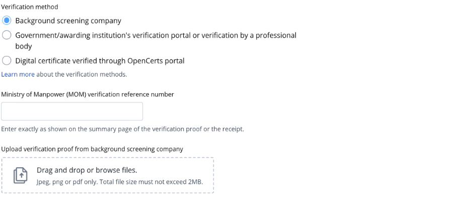

## Page 1

# **Guide to submit verification proof from Background Screening Company** 

<!-- Start of picture text -->
1. Read the guidelines before you submit the verification proof. Read this 2. If the institution name on your educational certificate or verification proof is not available in the dropdown menu, please enter the institution's most Select the institution when it recent name where applicable. You may  appears also choose not to declare the qualification if you are unable to find it on the list. 3. Enter the qualification level as per the verification proof or educational certificate. Enter the faculty as per transcript if it is not found in the verification proof or educational certificate. <!-- End of picture text -->

## Page 2

- ➢ Check that your <u>Sample verification proof from Background Screening Company</u> verification proof has a Find your MOM verification 

- ‘MOM verification reference number here 

- reference number’. If you do not have a verification number on your verification proof, contact your background screening company to update it **.** 

- ➢ If your verification is still pending **after 14 working days** and your awarding institution is **from** the application form’s **drop-down list** of accredited institutions, you can submit the **receipt for the verification service** in lieu of the verification proof in the work pass application. Once the work pass application is approved, you can bring in the candidate and get their pass issued. You do not need to submit the verification proof to us. However, if the qualification is found to be false, the work pass will be revoked and the candidate must leave Singapore.

## Page 3

<!-- Start of picture text -->
4. Key in the ‘MOM verification reference  Select verification method number’ as stated on the verification proof or provided by the background screening Enter the MOM verification reference number provided company. 5. Upload the verification proof from the background screening company. Upload here <!-- End of picture text -->

