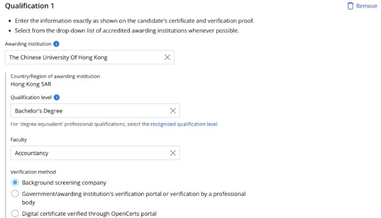
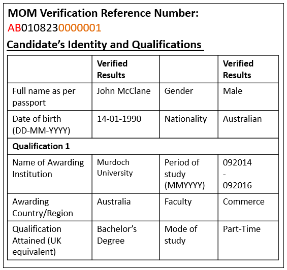
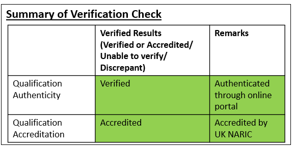
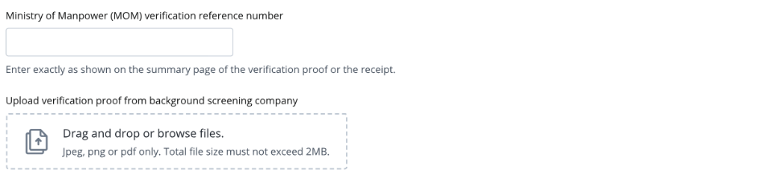
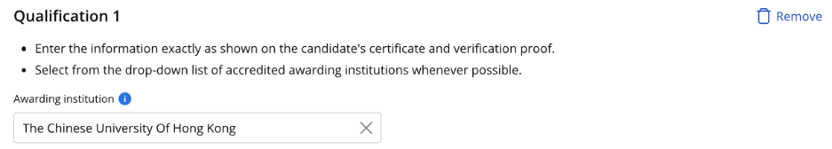
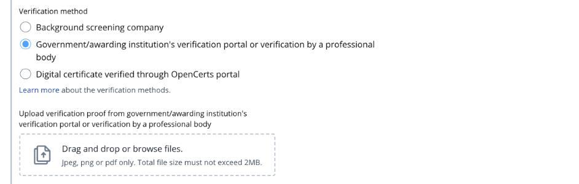
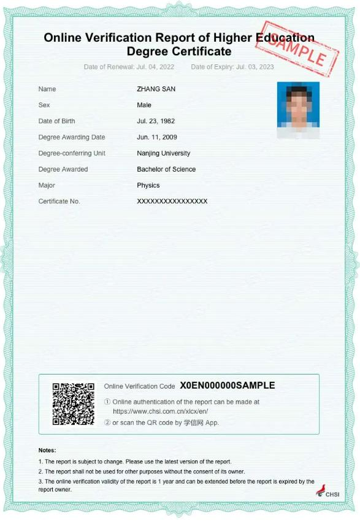
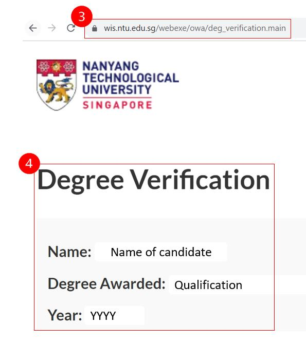
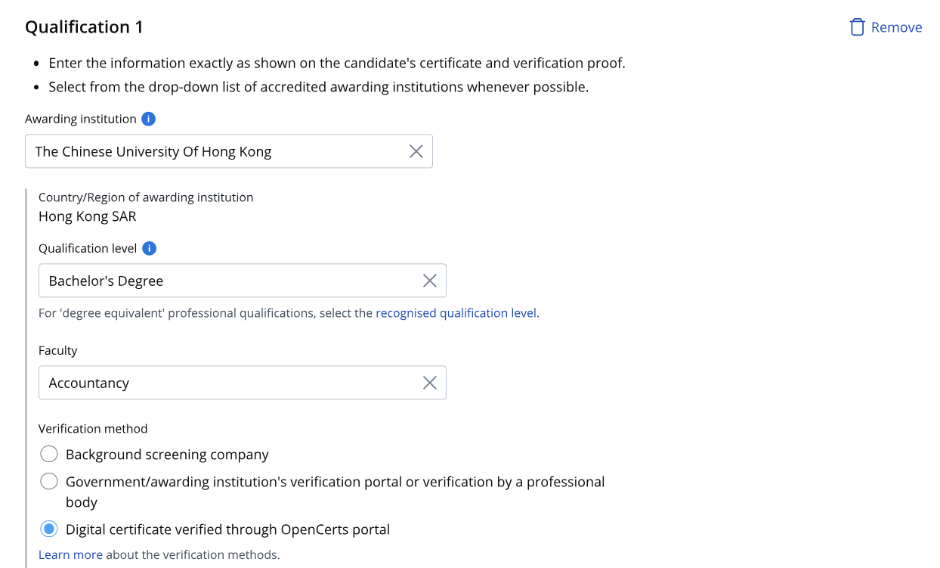
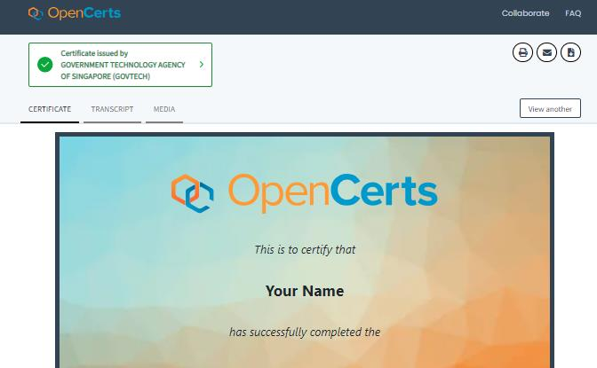

<!-- HCAG:COMPILED id=www.mom.gov.sg.passes-and-permits.employment-pass.documents-required -->
---
catalog_token_estimate: 0
children: []
content_token_estimate: 45623
descendants: 0
id: www.mom.gov.sg.passes-and-permits.employment-pass.documents-required
image_urls:
  bsc-guide-Image10.png: https://www.mom.gov.sg/-/media/mom/documents/work-passes-and-permits/compass/bsc-guide.pdf
  bsc-guide-Image11.png: https://www.mom.gov.sg/-/media/mom/documents/work-passes-and-permits/compass/bsc-guide.pdf
  bsc-guide-Image16.png: https://www.mom.gov.sg/-/media/mom/documents/work-passes-and-permits/compass/bsc-guide.pdf
  bsc-guide-Image17.png: https://www.mom.gov.sg/-/media/mom/documents/work-passes-and-permits/compass/bsc-guide.pdf
  bsc-guide-Image178.png: https://www.mom.gov.sg/-/media/mom/documents/work-passes-and-permits/compass/bsc-guide.pdf
  bsc-guide-Image179.png: https://www.mom.gov.sg/-/media/mom/documents/work-passes-and-permits/compass/bsc-guide.pdf
  bsc-guide-Image180.jpeg: https://www.mom.gov.sg/-/media/mom/documents/work-passes-and-permits/compass/bsc-guide.pdf
  opencerts-portal-guide-Image155.png: https://www.mom.gov.sg/-/media/mom/documents/work-passes-and-permits/compass/opencerts-portal-guide.pdf
  opencerts-portal-guide-Image156.png: https://www.mom.gov.sg/-/media/mom/documents/work-passes-and-permits/compass/opencerts-portal-guide.pdf
  opencerts-portal-guide-Image157.png: https://www.mom.gov.sg/-/media/mom/documents/work-passes-and-permits/compass/opencerts-portal-guide.pdf
  opencerts-portal-guide-Image4.png: https://www.mom.gov.sg/-/media/mom/documents/work-passes-and-permits/compass/opencerts-portal-guide.pdf
  opencerts-portal-guide-Image5.png: https://www.mom.gov.sg/-/media/mom/documents/work-passes-and-permits/compass/opencerts-portal-guide.pdf
  opencerts-portal-guide-Image6.jpeg: https://www.mom.gov.sg/-/media/mom/documents/work-passes-and-permits/compass/opencerts-portal-guide.pdf
  travel-doc-requirements-v1-Image218.jpeg: https://www.mom.gov.sg/-/media/mom/documents/work-passes-and-permits/travel-doc-requirements-v1.pdf
  travel-doc-requirements-v1-Image23.jpeg: https://www.mom.gov.sg/-/media/mom/documents/work-passes-and-permits/travel-doc-requirements-v1.pdf
  travel-doc-requirements-v1-Image25.jpeg: https://www.mom.gov.sg/-/media/mom/documents/work-passes-and-permits/travel-doc-requirements-v1.pdf
  travel-doc-requirements-v1-Image31.jpeg: https://www.mom.gov.sg/-/media/mom/documents/work-passes-and-permits/travel-doc-requirements-v1.pdf
  travel-doc-requirements-v1-Image32.png: https://www.mom.gov.sg/-/media/mom/documents/work-passes-and-permits/travel-doc-requirements-v1.pdf
  travel-doc-requirements-v1-Image4.jpeg: https://www.mom.gov.sg/-/media/mom/documents/work-passes-and-permits/travel-doc-requirements-v1.pdf
  travel-doc-requirements-v1-Image6.jpeg: https://www.mom.gov.sg/-/media/mom/documents/work-passes-and-permits/travel-doc-requirements-v1.pdf
  verification-portal-guide-Image265.png: https://www.mom.gov.sg/-/media/mom/documents/work-passes-and-permits/compass/verification-portal-guide.pdf
  verification-portal-guide-Image266.png: https://www.mom.gov.sg/-/media/mom/documents/work-passes-and-permits/compass/verification-portal-guide.pdf
  verification-portal-guide-Image267.png: https://www.mom.gov.sg/-/media/mom/documents/work-passes-and-permits/compass/verification-portal-guide.pdf
  verification-portal-guide-Image28.png: https://www.mom.gov.sg/-/media/mom/documents/work-passes-and-permits/compass/verification-portal-guide.pdf
  verification-portal-guide-Image29.jpeg: https://www.mom.gov.sg/-/media/mom/documents/work-passes-and-permits/compass/verification-portal-guide.pdf
  verification-portal-guide-Image6.jpeg: https://www.mom.gov.sg/-/media/mom/documents/work-passes-and-permits/compass/verification-portal-guide.pdf
  verification-portal-guide-Image7.jpeg: https://www.mom.gov.sg/-/media/mom/documents/work-passes-and-permits/compass/verification-portal-guide.pdf
kind: leaf
long_description: This folder details the specific documents needed when submitting
  a Singapore Employment Pass application. Core requirements include the candidate's
  passport biodata page (with detailed upload/image quality rules), the company's
  ACRA business profile, and qualification verification proof. It specifies additional
  documentation for regulated professions (doctors, nurses, dentists, lawyers, pharmacists,
  football players/coaches, etc.) with the relevant professional bodies and contact
  details. Food establishment employees must provide SFA foodshop licence proof. It
  also provides step-by-step guides for submitting verification proof via background
  screening companies, government/awarding institution portals, and OpenCerts, and
  lists institutions worldwide that offer online verification portals.
short_description: 'Lists required documents for EP applications: passport, ACRA profile,
  qualification verification, and extra docs for regulated professions and food establishments.'
source_files:
- index.md
- travel-doc-requirements-v1.md
- bsc-guide.md
- verification-portal-guide.md
- list-of-verification-portals.md
- opencerts-portal-guide.md
source_urls:
- https://www.mom.gov.sg/passes-and-permits/employment-pass/documents-required
- https://www.mom.gov.sg/-/media/mom/documents/work-passes-and-permits/travel-doc-requirements-v1.pdf
- https://www.mom.gov.sg/-/media/mom/documents/work-passes-and-permits/compass/bsc-guide.pdf
- https://www.mom.gov.sg/-/media/mom/documents/work-passes-and-permits/compass/verification-portal-guide.pdf
- https://www.mom.gov.sg/-/media/mom/documents/work-passes-and-permits/compass/list-of-verification-portals.pdf
- https://www.mom.gov.sg/-/media/mom/documents/work-passes-and-permits/compass/opencerts-portal-guide.pdf
subtree_depth: 0
title: Documents Required for Employment Pass Application
token_size_estimate: 45623
---

# Documents Required for Employment Pass Application

Lists required documents for EP applications: passport, ACRA profile, qualification verification, and extra docs for regulated professions and food establishments.

## Content

<!-- source: index.md -->
# Documents required for Employment Pass

There are updates on this page. [Read more]

# Documents required for Employment Pass

Find out which documents you need to prepare before submitting an Employment Pass application.

## Documents required

- Personal particulars page of candidate’s passport. [Learn more](https://www.mom.gov.sg/-/media/mom/documents/work-passes-and-permits/travel-doc-requirements-v1.pdf) about the upload requirements.
 
If the candidate’s name on the passport differs from that on their other documents, please also upload an explanation letter and supporting documents (e.g. deed poll).
- Company’s latest business profile or instant information registered with ACRA.
- Verification proof for candidate's qualifications (if applicable)
- Additional documents are required for:

## Healthcare professionals, lawyers, football players or coachesShow

You need supporting documents from the respective professional bodies:

| Occupation | Professional body | For enquiries | 
|---|---|---|
| Dentist | Singapore Dental Council | [SDC@spb.gov.sg](mailto:SDC@spb.gov.sg) | 
| Diagnostic radiographer | Allied Health Professions Council | [AHPC@spb.gov.sg](mailto:AHPC@spb.gov.sg) | 
| Doctor | Singapore Medical Council | [SMC@spb.gov.sg](mailto:SMC@spb.gov.sg) | 
| Emergency medical technician | Unit for Prehospital Emergency Care | [PAO_enquiry@upec.sg](mailto:PAO_enquiry@upec.sg) | 
| Football player or coach | Sport Singapore | [Enquiry form](https://form.gov.sg/660a08adb384a2cbaa8cfa36) | 
| Lawyer | Legal Services Regulatory Authority | [https://eservices.mlaw.gov.sg/enquiry](https://eservices.mlaw.gov.sg/enquiry/) | 
| Nurse | Singapore Nursing Board | [SNB@spb.gov.sg](mailto:SNB@spb.gov.sg) | 
| Occupational therapist | Allied Health Professions Council | [AHPC@spb.gov.sg](mailto:AHPC@spb.gov.sg) | 
| Paramedic | Unit for Prehospital Emergency Care | [PAO_enquiry@upec.sg](mailto:PAO_enquiry@upec.sg) | 
| Pharmacist | Singapore Pharmacy Council | [SPC@spb.gov.sg](mailto:SPC@spb.gov.sg) | 
| Physiotherapist | Allied Health Professions Council | [AHPC@spb.gov.sg](mailto:AHPC@spb.gov.sg) | 
| Radiation therapist | Allied Health Professions Council | [AHPC@spb.gov.sg](mailto:AHPC@spb.gov.sg) | 
| Speech therapist | Allied Health Professions Council | [AHPC@spb.gov.sg](mailto:AHPC@spb.gov.sg) | 
| TCM practitioner | Traditional Chinese Medicine Practitioners Board | [TCMPB@spb.gov.sg](mailto:TCMPB@spb.gov.sg) | 

## Employees in a food establishmentShow

A copy of the online page that can be accessed when you scan the QR code on the foodshop licence issued by Singapore Food Agency (SFA). The page should indicate your foodshop license validity period.

If you have a new establishment and don't have the licence yet, you can submit a copy of the **“Application for Foodshop Licence”** letter issued to you by SFA.

<!-- source: travel-doc-requirements-v1.md -->
## Page 1

_Last updated: 26 August 2026_ 

# Travel document requirements 

## **Things to note** 

- Upload only the **latest copy** of the travel document. 

- We **only** need the biodata page of your travel document. Provide the Amendments/Observation pages **only if** they show changes to the biodata page details. 

- Save each page as a single image file. Acceptable file formats are jpg, png and pdf. 

- Ensure the image is in landscape format and the right way up. 

- To avoid delays in the processing of your application, please ensure you have met all these requirements. 

## **How to prepare your document for upload** 

1. Provide a large, close-up colour copy of the biodata page. The **image and text must be clear.** The photograph must clearly show all facial features (eyes, ears, mouth, nose, chin). 

_Last updated: 26 August 2026_ 

Page 1 of 4

## Page 2

_Last updated: 26 August 2026_ 

2. The page should have an even exposure with **no reflections** , as reflections can block parts of the text. 

**Tip** : Position the travel document at a slight angle or hold it up vertically to reduce glare and reflections. **Do not** use your camera’s flash. 

3. Ensure all **label text** (e.g. Date of Issue, Place of Birth) is clear. 

_Last updated: 26 August 2026_ 

Page 2 of 4

## Page 3

_Last updated: 26 August 2026_ 

4. Ensure the whole page, including the entire “Machine Readable Zone”, is visible. It **must not** be cut off, blocked, or covered by a watermark. 

<!-- Start of picture text -->
Watermark <!-- End of picture text -->

5. Enter the full name in the **same order as it appears** on the travel document. For accented characters (e.g. Ä, É, Ö, Ø, Ü), refer to the “Machine Readable Zone” for its conversion (e.g. Ø should be entered as OE). 

_Last updated: 26 August 2026_ 

Page 3 of 4

## Page 4

_Last updated: 26 August 2026_ 

6. Only provide the Amendments/Observation pages **if they show changes to any details** (e.g. name, expiry date). If there are no changes, you do not need to upload this page. 

7. If there are changes to the passport details, select the checkbox in the eService application form and upload an image of the Amendments/Observation page. A screenshot of the checkbox is shown below for your reference. 

_Last updated: 26 August 2026_ 

Page 4 of 4

<!-- source: bsc-guide.md -->
## Page 1

# **Guide to submit verification proof from Background Screening Company** 

<!-- Start of picture text -->
1. Read the guidelines before you submit the verification proof. Read this 2. If the institution name on your educational certificate or verification proof is not available in the dropdown menu, please enter the institution's most Select the institution when it recent name where applicable. You may  appears also choose not to declare the qualification if you are unable to find it on the list. 3. Enter the qualification level as per the verification proof or educational certificate. Enter the faculty as per transcript if it is not found in the verification proof or educational certificate. <!-- End of picture text -->

## Page 2

- ➢ Check that your <u>Sample verification proof from Background Screening Company</u> verification proof has a Find your MOM verification 

- ‘MOM verification reference number here 

- reference number’. If you do not have a verification number on your verification proof, contact your background screening company to update it **.** 

- ➢ If your verification is still pending **after 14 working days** and your awarding institution is **from** the application form’s **drop-down list** of accredited institutions, you can submit the **receipt for the verification service** in lieu of the verification proof in the work pass application. Once the work pass application is approved, you can bring in the candidate and get their pass issued. You do not need to submit the verification proof to us. However, if the qualification is found to be false, the work pass will be revoked and the candidate must leave Singapore.

## Page 3

<!-- Start of picture text -->
4. Key in the ‘MOM verification reference  Select verification method number’ as stated on the verification proof or provided by the background screening Enter the MOM verification reference number provided company. 5. Upload the verification proof from the background screening company. Upload here <!-- End of picture text -->

<!-- source: verification-portal-guide.md -->
## Page 1

# **Guide to submit verification proof from government/awarding institution’s verification portal or a professional body** 

<!-- Start of picture text -->
1. Read the guidelines before you submit the verification proof. Read this 2. If the institution name on your educational certificate or verification proof is not available in the dropdown menu, please enter the institution's most recent name where Select the institution when it appears applicable. You may also choose not to declare the qualification if you are unable to find it on the list. 3. Enter the qualification level as per the verification proof or educational certificate. Enter the faculty as per transcript if it is not found in the verification proof or educational certificate. <!-- End of picture text -->

## Page 2

4. Save screenshots of your verification proof from a government/ awarding institution. Refer to sample Select verification method 

screenshots for details to be included in the screenshots. 

5. Upload screenshots Upload here 

with the required details into your application form. 

## **Example screenshot from government’s verification portal** 

1. Only **official English version** Sample screenshot from Center for Student Services and of the online verification Development (CSSD) reports by CSSD will be accepted. 

2. Ensure the full page is displayed. 

3. The screenshot should include the following candidate’s information: `o` Full name `o` Date of birth `o` Date of graduation `o` Student number (if applicable)

## Page 3

## **Example screenshot from awarding institution’s verification portal** 

<!-- Start of picture text -->
1. Verification page  Sample screenshot from Nanyang Technological University (NTU) • The screenshot should Visible website address include the following: ✓ Visible  verification portal’s website  address ✓ All information  entered in the verification portal must be  visible  such as: All information • Name entered must be visible • Date of birth 2. Verified page  Visible website address • The screenshot should include the following: ✓ Visible  verification portal’s website address ✓ Final page showing that the candidate was awarded  the educational Proof that candidate was qualification must be  awarded the education visible qualification 3. Both  verification page and verified page screenshot should be uploaded <!-- End of picture text -->

<!-- source: list-of-verification-portals.md -->
## Page 1

Please note that this list of government agencies and awarding institutions that offer online verification portals is not exhaustive. While we strive to provide useful resources, we are not responsible for the content of external websites. For the most current information, please consult the official websites of the relevant organisations. 

|**Government Portals**|**Country** **(if relevant)**|
|---|---|
|Allied Health Professions Council||
|Center For Student Services and Development (CSSD)|China|
|Optometrists and Opticians Board||
|Singapore Dental Council||
|Singapore Medical Council||
|Singapore Pharmacy Council||
|Traditional Chinese Medicine Practitioners Board||

|**Awarding Institution Portals**|**Country**|
|---|---|
|Asia Pacific University of Technology and Innovation|Malaysia|
|Association of Chartered Certified Accountants (ACCA) - ACCA Student Certificate -ACCA Membership|United Kingdom|
|Assumption University|Thailand|
|Auckland University of Technology|New Zealand|
|Berkeley College, New York|United States|
|Bond University|Australia|
|Boston University|United States|
|Brown University|United States|
|Carnegie Mellon University|United States|
|Charles Sturt University|Australia|
|Curtin University|Australia|
|Dai Hoc Quoc Gia Thanh Pho Ho Chi Minh - Truong Dai Hoc Khoa Hoc Tu Nhien (Vietnam National University, Ho Chi Minh City - University of Science)|Vietnam|
|Dai Hoc Quoc Gia Tp. Ho Chi Minh - Truong Dai Hoc Cong Nghe Thong Tin (Vietnam National University, Ho Chi Minh City - University Of Information Technology)|Vietnam|
|Deakin University|Australia|
|Die Universitat St. Gallen (The University of St. Gallen)|Switzerland|
|Ecole Polytechnique Federale De Lausanne (EPFL)(Swiss Federal Institute of Technology Lausanne)|Switzerland|
|Edith Cowan University|Australia|
| Eidgenossische Technische Hochschule Zurich (ETH Zurich) (Swiss Federal Institute of Technology Zurich)|Switzerland|
|Emory University|United States|
|Erasmus Universiteit Rotterdam (Erasmus University Rotterdam)|Netherlands|
|European University of Bangladesh|Bangladesh|
| Georg-August-Universitat Gottingen (University of Gottingen)| Germany|
| Griffith University| Australia|
|Harvard University|United States|
|Indian Institute of Technology Bombay|India|
|Indiana University, Bloomington|United States|

1 of 4 

Last updated on 20 Nov 2025

## Page 2

|**Awarding Institution Portals**|**Country**|
|---|---|
|Information Systems Audit and Control Association (ISACA)|United States|
| Inha University|Korea, South|
|Institut Teknologi Bandung|Indonesia|
|Institute of Singapore Chartered Accountants (ISCA) |Singapore|
|International Information System Security Certification Consortium,||
| Inc. (ISC)2|United States|
|Johns Hopkins University|United States|
|Katholieke Universiteit Leuven (KU Leuven)|Belgium|
|King Mongkut'S Institute of Technology Ladkrabang|Thailand|
|King Saud University|Saudi Arabia|
|La Trobe University|Australia|
|Lehigh University|United States|
|Loyola Marymount University|United States|
|Macquarie University|Australia|
|Mapua Institute of Technology|Philippines|
|Massachusetts Institute of Technology|United States|
|Massey University|New Zealand|
|Miami University|United States|
|Michigan State University|United States|
|Mindanao State University-Iligan Institute of Technology|Philippines|
|Monash University|Australia|
|Murdoch University|Australia|
|Nanyang Technological University (NTU)|Singapore|
|National Institute of Education (NIE)|Singapore|
| National Institute of Technology Rourkela| India|
|National University of Ireland, University College Dublin|Ireland|
|New York University|United States|
|North Carolina State University|United States|
|North South University (NSU)|Bangladesh|
|Northeastern University|United States|
|Northwestern University|United States|
|Open University Malaysia (OUM)|Malaysia|
|Pace University|United States|
|Panjab University|India|
|Politeknik Kuching Sarawak|Malaysia|
|Prifysgol Cymru (University of Wales)|United Kingdom|
|Primeasia University (PAU)|Bangladesh|
|Purdue University, West Lafayette|United States|
|Queensland University of Technology (QUT)|Australia|
|Rice University -CeCredential Validation||
| -Validity Registry|United States|
|Rutgers, The State University of New Jersey|United States|
|Segi University|Malaysia|
|Singapore Institute of Technology (SIT)|Singapore|
| Singapore University of Technology and Design (SUTD)| Singapore|
| Singapore Workforce Skills Qualifications (WSQ)| Singapore|
|SRM Institute of Science and Technology|India|
|Stanford University|United States|
| Stevens Institute of Technology|United States|
|Swinburne University of Technology|Australia|
|Sylhet International University (SIU)|Bangladesh|

2 of 4 

Last updated on 20 Nov 2025

## Page 3

|**Awarding Institution Portals**|**Country**|
|---|---|
|Teachers College of Columbia University|United States|
| The Australian National University|Australia|
| The Chartered Institute of Management Accountants of The United||
|Kingdom (CIMA)|United Kingdom|
| The City and Guilds of London Institute| United Kingdom|
|The George Washington University|United States|
|The Institute of Chartered Accountants In England and Wales ||
|(ICAEW) |United Kingdom |
|The New School-Parsons School of Design|United States|
|The Pennsylvania State University|United States|
|The University of Alabama|United States|
|The University of Melbourne|Australia|
|The University of New South Wales (UNSW Sydney)|Australia|
|The University of Queensland|Australia|
|The University of South Australia|Australia|
|The University of Sydney|Australia|
|The University of Texas at Austin|United States|
|Tunku Abdul Rahman University of Management and Technology|Malaysia|
|Universidad Carlos III De Madrid|Spain|
|Universidade Da Cidade De Macau (City University Of Macau)|China|
|Universidade De Ciencia E Tecnologia De Macau (Macau||
|University Of Science And Technology)|China|
|Universidade De Coimbra (University of Coimbra)|Portugal|
|Universidade De Macau (University Of Macau)|China|
|Universitas Bina Nusantara (UBINUS) (BINUS University)|Indonesia|
|Universitat Ramon Llull (Ramon Llull University)|Spain|
|Universiti Malaya (The University of Malaya)|Malaysia|
|Universiti Malaysia Pahang (UMP)|Malaysia|
|Universiti Malaysia Perlis (UNIMAP)|Malaysia|
|Universiti Malaysia Sabah (UMS) |Malaysia |
|Universiti Malaysia Terengganu (UMT)|Malaysia|
| Universiti Multimedia (MMU) (Multimedia University (MMU))| Malaysia|
|Universiti Putra Malaysia (UPM)|Malaysia|
|Universiti Sains Malaysia (USM)|Malaysia|
|Universiti Teknologi Malaysia (UTM)|Malaysia|
|Universiti Teknologi Mara (UITM)|Malaysia|
|Universiti Tunku Abdul Rahman (UTAR)|Malaysia|
|University of Auckland|New Zealand|
|University of California, Berkeley|United States|
| University of California, Los Angeles|United States|
|University of California, Santa Barbara|United States|
|University of Canterbury|New Zealand|
|University of Chicago|United States|
|University of Colorado Boulder|United States|
| University of Delaware|United States|
| University of Iowa|United States|
| University of North Carolina At Chapel Hill|United States|
|University of Otago |New Zealand |
|University of Pennsylvania|United States|
| University of San Francisco|United States|
|University of Santo Tomas|Philippines|
|University of Southern California|United States|

3 of 4 

Last updated on 20 Nov 2025

## Page 4

|**Awarding Institution Portals**|**Country**|
|---|---|
|University of Tasmania|Australia|
|University of Technology Sydney|Australia|
|University of Washington|United States|
|University of Wisconsin-Madison|United States|
|University of Wollongong (UOW) Malaysia KDU University College|Malaysia|
|Vanderbilt University|United States|
|Victoria University of Wellington|New Zealand|
|Washington University in St. Louis|United States|
|Western Sydney University|Australia|
|Yale University|United States|

4 of 4 

Last updated on 20 Nov 2025

<!-- source: opencerts-portal-guide.md -->
## Page 1

# **Guide to submit verification proof - Digital certificates verified through OpenCerts portal** 

<!-- Start of picture text -->
1. Read the guidelines before you submit the verification proof. Read this 2. If the institution name on your educational certificate or verification proof is not available in the dropdown menu, please enter the institution's most recent name where Select the institution when it appears applicable. You may also choose not to declare the qualification if you are unable to find it on the list. 3. Enter the qualification level as per the educational certificate. Enter the faculty as per transcript if it is not found in the educational certificate. <!-- End of picture text -->

## Page 2

<!-- Start of picture text -->
4. Ensure the digital certificate has been verified through OpenCerts portal. Refer to the below for Select verification method more details how to verify. Upload here 5. Upload the document. How to verify digital certificates with OpenCerts a. Go to OpenCerts portal. b. Upload the Upload here document. c. Check that the document has been  verified through the OpenCerts portal as authentic. Check that the certificate is verified as authentic <!-- End of picture text -->

