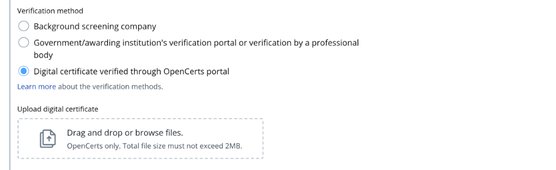
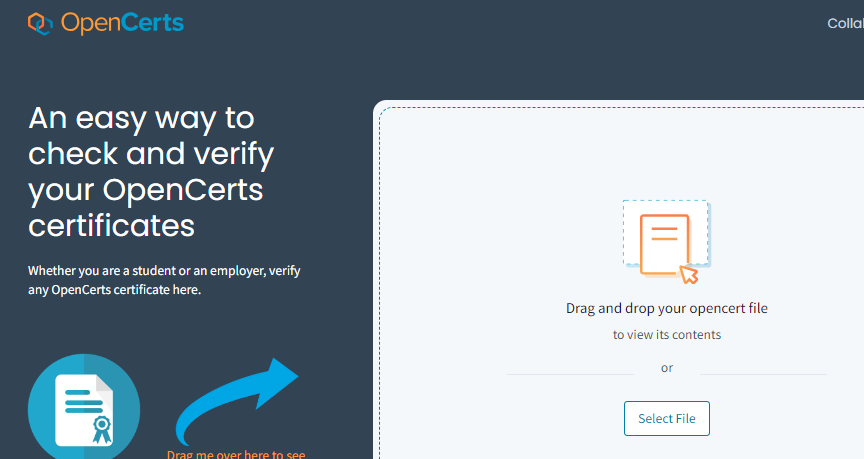

## Page 1

# **Guide to submit verification proof - Digital certificates verified through OpenCerts portal** 

<!-- Start of picture text -->
1. Read the guidelines before you submit the verification proof. Read this 2. If the institution name on your educational certificate or verification proof is not available in the dropdown menu, please enter the institution's most recent name where Select the institution when it appears applicable. You may also choose not to declare the qualification if you are unable to find it on the list. 3. Enter the qualification level as per the educational certificate. Enter the faculty as per transcript if it is not found in the educational certificate. <!-- End of picture text -->

## Page 2

<!-- Start of picture text -->
4. Ensure the digital certificate has been verified through OpenCerts portal. Refer to the below for Select verification method more details how to verify. Upload here 5. Upload the document. How to verify digital certificates with OpenCerts a. Go to OpenCerts portal. b. Upload the Upload here document. c. Check that the document has been  verified through the OpenCerts portal as authentic. Check that the certificate is verified as authentic <!-- End of picture text -->

