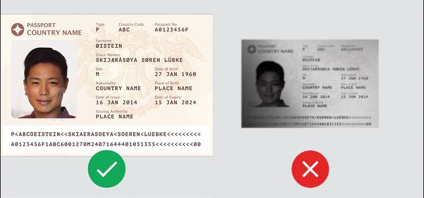
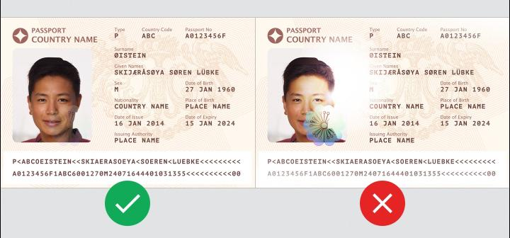
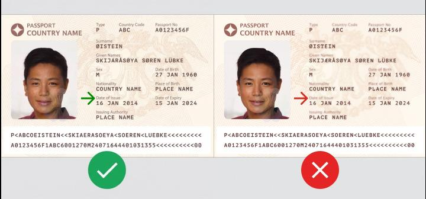
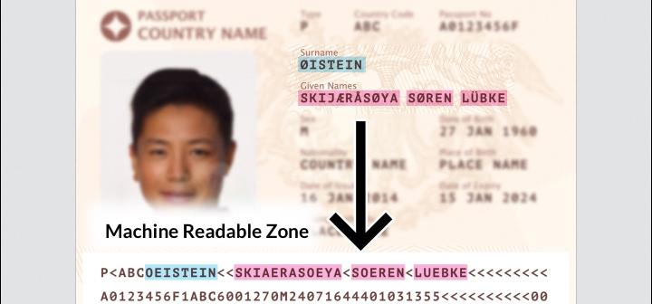

## Page 1

_Last updated: 26 August 2026_ 

# Travel document requirements 

## **Things to note** 

- Upload only the **latest copy** of the travel document. 

- We **only** need the biodata page of your travel document. Provide the Amendments/Observation pages **only if** they show changes to the biodata page details. 

- Save each page as a single image file. Acceptable file formats are jpg, png and pdf. 

- Ensure the image is in landscape format and the right way up. 

- To avoid delays in the processing of your application, please ensure you have met all these requirements. 

## **How to prepare your document for upload** 

1. Provide a large, close-up colour copy of the biodata page. The **image and text must be clear.** The photograph must clearly show all facial features (eyes, ears, mouth, nose, chin). 

_Last updated: 26 August 2026_ 

Page 1 of 4

## Page 2

_Last updated: 26 August 2026_ 

2. The page should have an even exposure with **no reflections** , as reflections can block parts of the text. 

**Tip** : Position the travel document at a slight angle or hold it up vertically to reduce glare and reflections. **Do not** use your camera’s flash. 

3. Ensure all **label text** (e.g. Date of Issue, Place of Birth) is clear. 

_Last updated: 26 August 2026_ 

Page 2 of 4

## Page 3

_Last updated: 26 August 2026_ 

4. Ensure the whole page, including the entire “Machine Readable Zone”, is visible. It **must not** be cut off, blocked, or covered by a watermark. 

<!-- Start of picture text -->
Watermark <!-- End of picture text -->

5. Enter the full name in the **same order as it appears** on the travel document. For accented characters (e.g. Ä, É, Ö, Ø, Ü), refer to the “Machine Readable Zone” for its conversion (e.g. Ø should be entered as OE). 

_Last updated: 26 August 2026_ 

Page 3 of 4

## Page 4

_Last updated: 26 August 2026_ 

6. Only provide the Amendments/Observation pages **if they show changes to any details** (e.g. name, expiry date). If there are no changes, you do not need to upload this page. 

7. If there are changes to the passport details, select the checkbox in the eService application form and upload an image of the Amendments/Observation page. A screenshot of the checkbox is shown below for your reference. 

_Last updated: 26 August 2026_ 

Page 4 of 4

