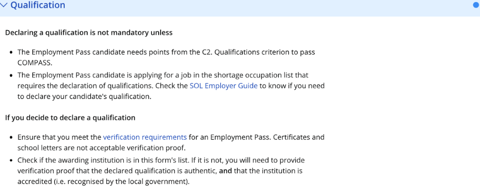
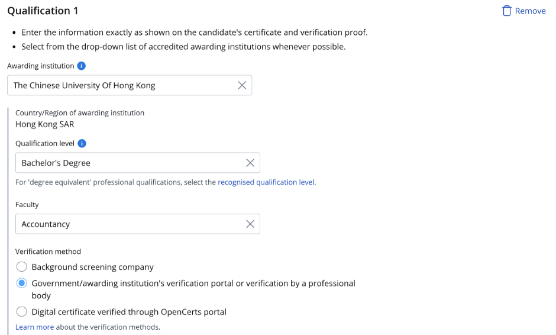
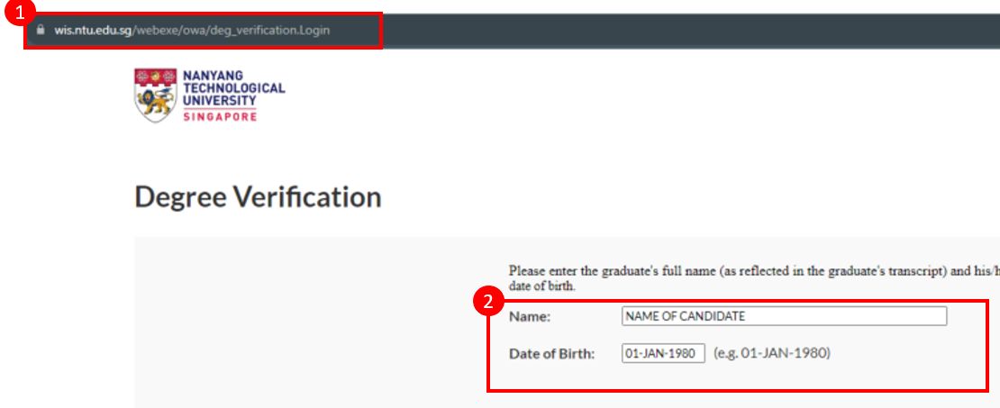

## Page 1

# **Guide to submit verification proof from government/awarding institution’s verification portal or a professional body** 

<!-- Start of picture text -->
1. Read the guidelines before you submit the verification proof. Read this 2. If the institution name on your educational certificate or verification proof is not available in the dropdown menu, please enter the institution's most recent name where Select the institution when it appears applicable. You may also choose not to declare the qualification if you are unable to find it on the list. 3. Enter the qualification level as per the verification proof or educational certificate. Enter the faculty as per transcript if it is not found in the verification proof or educational certificate. <!-- End of picture text -->

## Page 2

4. Save screenshots of your verification proof from a government/ awarding institution. Refer to sample Select verification method 

screenshots for details to be included in the screenshots. 

5. Upload screenshots Upload here 

with the required details into your application form. 

## **Example screenshot from government’s verification portal** 

1. Only **official English version** Sample screenshot from Center for Student Services and of the online verification Development (CSSD) reports by CSSD will be accepted. 

2. Ensure the full page is displayed. 

3. The screenshot should include the following candidate’s information: `o` Full name `o` Date of birth `o` Date of graduation `o` Student number (if applicable)

## Page 3

## **Example screenshot from awarding institution’s verification portal** 

<!-- Start of picture text -->
1. Verification page  Sample screenshot from Nanyang Technological University (NTU) • The screenshot should Visible website address include the following: ✓ Visible  verification portal’s website  address ✓ All information  entered in the verification portal must be  visible  such as: All information • Name entered must be visible • Date of birth 2. Verified page  Visible website address • The screenshot should include the following: ✓ Visible  verification portal’s website address ✓ Final page showing that the candidate was awarded  the educational Proof that candidate was qualification must be  awarded the education visible qualification 3. Both  verification page and verified page screenshot should be uploaded <!-- End of picture text -->

