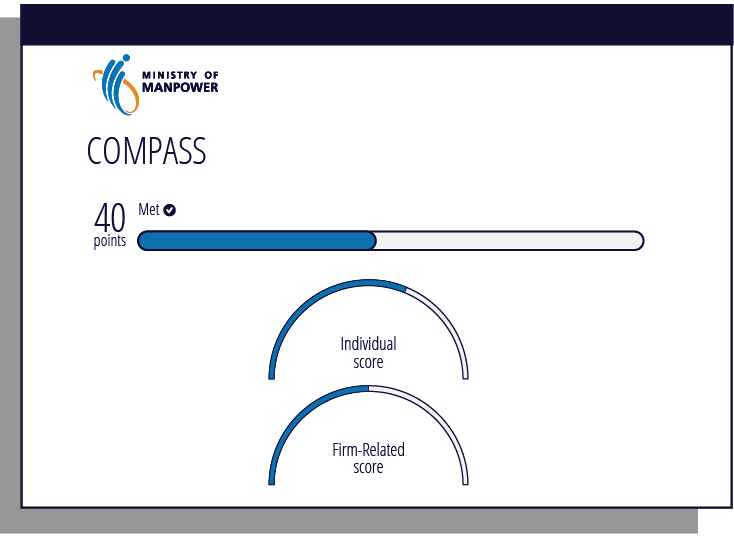
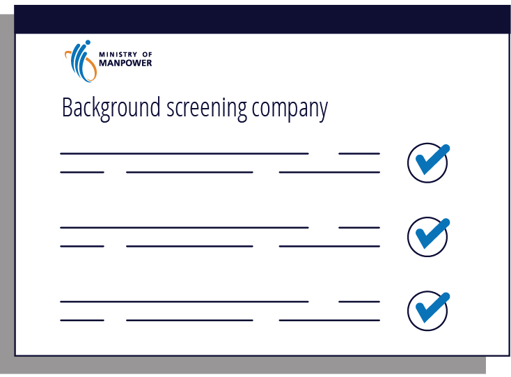

## Page 1

### **NAVIGATING WITH** _COMPASS_ 

**A QUICK GUIDE ON SINGAPORE’S EMPLOYMENT PASS CRITERIA** 

Updated as at 1 Aug 2023 

1

## Page 2

##### **COMPASS** is a transparent system to help you access talent from around the world 

From **1 Sep 2023** , Employment Pass (EP) candidates must pass a two-stage eligibility framework. 

Stage 1 – Meet the EP Qualifying Salary 

Stage 2 – Pass COMPASS 

COMPASS will apply to EP renewals for passes **expiring from 1 Sep 2024** . 

###### **Complementarity Assessment Framework (COMPASS)** 

<!-- Start of picture text -->
Individual Attributes Firm-Related Attributes C1 C3 Salary Diversity C2 C4 Qualifications Support for Local Employment C5 C6 Skills Bonus Strategic Economic Shortage  Priorities Bonus Occupation List <!-- End of picture text -->

33 

2

## Page 3

## **ALL the resources you need on COMPASS** 

###### **3 Workforce Insights Tool** 

Use this tool to find out where your organisation stands on the firm-related attributes. 

###### **1 COMPASS Webpage** 

Use our website to understand what the requirements are. 

<u>https://go.gov.sg/compass</u> 

<u>https://go.gov.sg/compass-wfi-infographic</u> 

###### **4 Self-Assessment Tool** 

Use this tool for an indication of whether an application meets the requirements. 

###### **2 Verification of Qualifications Webpage** 

Use our website to understand what you need to prepare for the verification of qualifications. 

<u>http://go.gov.sg/employment-pass-verification-proof-requirements</u> 

<u>https://go.gov.sg/mom-workpass-sat/</u> 

###### **5 This COMPASS Guide** 

Use this guide for tips on submitting an EP application. 

4 

**5**

## Page 4

# **C1 COMPASS** 

**Individual attribute SALARY** 

**Q:** 

**Is the C1 – Salary criterion the same as the EP qualifying salary?** 

No, the C1 – Salary criterion under COMPASS is different from the EP qualifying salary. 

The EP qualifying salary is the minimum bar that candidates need to pass to obtain an EP. 

Under the C1 – Salary criterion, the candidate’s salary will also be benchmarked against the salaries of local Professionals, Managers, Executives and Technicians (PMETs) **in the same sector as your organisation.** 

If the candidate’s salary scores points under C1, but does not meet the EP qualifying salary, the application will likely be rejected. 

# **C2 COMPASS** 

**Individual attribute QUALIFICATION** 

**Are qualifications a must, to qualify for an EP?** 

**Q:** 

No.  These are not compulsory. You can choose to provide a candidate’s qualifications if the application needs the points from C2 – Qualifications to meet COMPASS requirements. 

If your candidate is applying for a job in the Shortage Occupation List under C5 – Skills Bonus, you may also need to provide the relevant educational or professional certificates. 

Plan and allow time to prepare the required documents to submit. 

77 

6

## Page 5

# **C2 COMPASS** 

**Individual attribute QUALIFICATION** 

###### **Do I need to provide verification proof for qualifications in an EP application?** 

#### **Q:** 

It is **mandatory** to obtain verification proof for the qualifications provided in an EP application. 

It takes time to obtain verification documents from background screening companies, so plan and allow time for this. It usually takes about 1–2 weeks, but you should check with the background screening company to find out what information or documents they will need. 

# **C2 COMPASS** 

###### **Individual attribute QUALIFICATION** 

<!-- Start of picture text -->
Employment / S Pass Self-Assessment Tool (SAT) > Purpose > Position details > Personal particulars Background screening company > Work experience > Education qualifications <!-- End of picture text -->

Once a candidate’s qualification has been verified, there is no need to get it verified again at renewal, or when there is a change of employer. If a candidate’s qualifications need to be verified, you will be prompted when filling in the EP application form. 

8 

9 9

## Page 6

# **C2 COMPASS** 

**Individual attribute QUALIFICATION** 

**Q:** 

**What do I do if the educational institution is not listed on the application form?** 

If you enter the name of an institution that is not on the list, you will need to provide verification proof that the declared qualification is authentic, **and** that the institution is accredited (i.e. recognised by the local government.) 

You can obtain this verification proof from background screening companies listed on MOM’s website. 

So, when you fill in the awarding institution field, it is important you select the institution based on exactly what is stated on the candidate’s certificate. Be careful of names of institutions that may look alike. A missing word may make a difference. 

Remember to check for typos in your application. 

# **C3 C4 COMPASS** 

###### **Firm-related attribute Firm-related attribute DIVERSITY SUPPORT FOR LOCAL EMPLOYMENT** 

**Q:** 

**Where can I check my organisation’s score on the COMPASS firm-level attributes?** 

You should use the **Workforce Insights tool (WFI)** to estimate how many points an EP application will score under the firm-related attributes of COMPASS. This way, you will be able to plan in advance and make better hiring decisions to diversify and improve your local workforce over time. 

Remember that your organisation’s **C3** and **C4** scores are based on an average of past 3 months of available data. Do plan ahead as strengthening your organisation’s workforce will take time! 

Ensure that your organisation’s sector is correctly classified. Incorrect classification could result in processing delays or rejections when COMPASS is implemented. 

Do note that Permanent residents (PRs) are counted as part of the local workforce under C4. Under C3, the nationalities/citizenships of PRs are based on their passports. 

10 

**11**

## Page 7

# **C5 BONUS** 

**Bonus criteria** 

###### **SKILLS BONUS** 

**If my candidate is performing a job on the Shortage Occupation List (SOL), what do I Q: need to take note of?** 

If an application needs the bonus points under C5 – Skills Bonus to pass COMPASS, you will have to show that your candidate is qualified to perform the job description and duties of the shortage occupation. The requirements for each occupation on the SOL are on MOM’s website. 

# **C6 BONUS** 

**Bonus criteria** 

**STRATEGIC ECONOMIC PRIORITIES BONUS** 

**How do I find out more about the programmes under the C6 – SEP bonus?** 

**Q:** 

The list of eligible programmes is on MOM’s website and these are run by supporting sector agencies. You may approach your sector agencies on the qualifying criteria for the various programmes. 

Once approved, the EP holder must only work in the shortage occupation or else it becomes an offence! 

12 

**13**

## Page 8

###### **With the introduction of COMPASS, is the Self-Assessment Tool (SAT) still relevant?** 

Yes! MOM’s Self-Assessment Tool (SAT) will be enhanced to include not only the EP qualifying salary, but also whether an application or renewal request meets the COMPASS criteria. This will help you to predict whether your application or renewal request will be successful. 

###### **Why can’t the SAT check everything before an application or renewal request is submitted?** 

The SAT gives you an indicative outcome so you can plan. Some of the final checks can only be done after you submit the application or renewal request. 

Simply log in to the SAT with your Employment Pass eService account. Then, all you need to do is enter the details of your candidate and their job. The SAT will then tell you whether the candidate can qualify for an EP. 

Your organisation’s data privacy for COMPASS C3 and C4 scores is important. To protect it, EP eService logins are required to access the enhanced SAT. 

###### **If the SAT says no, the application will likely be rejected.** 

If the SAT says yes, the application or renewal will likely be approved. An application or renewal will be rejected if it fails to meet verification or other checks, or when there are adverse records. 

The SAT assessment results will be downloadable as a PDF so you can easily share it with relevant parties. 

<!-- Start of picture text -->
Work pass criteria EP qualifying salary COMPASS <!-- End of picture text -->

Make use of the available tools (WFI and SAT) and get familiar with the EP framework. 

14 

**15**
