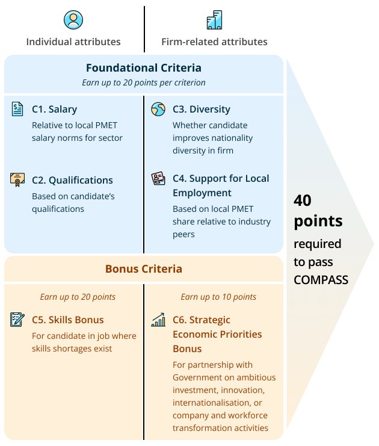
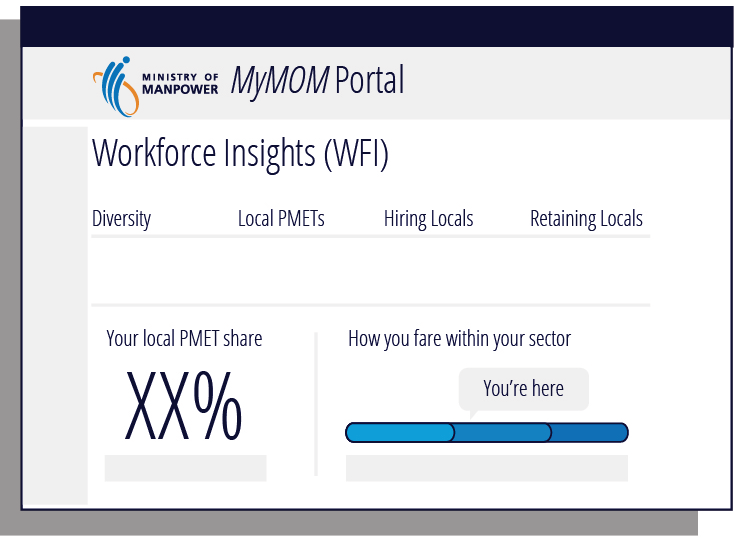
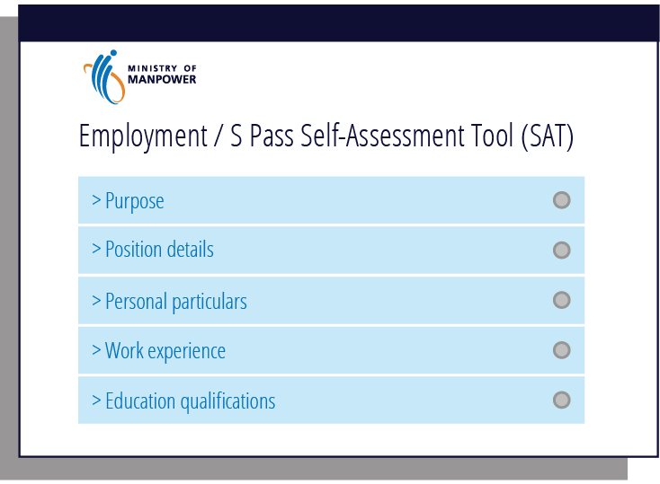

<!-- HCAG:COMPILED id=www.mom.gov.sg.passes-and-permits.employment-pass.eligibility -->
---
catalog_token_estimate: 1113
children:
- www.mom.gov.sg.passes-and-permits.employment-pass.eligibility.compass-c1-salary-benchmarks
- www.mom.gov.sg.passes-and-permits.employment-pass.eligibility.compass-c5-skills-bonus-shortage-occupation-list-sol
- www.mom.gov.sg.passes-and-permits.employment-pass.eligibility.compass-c6-strategic-economic-priorities-sep-bonus-eligible-programmes
content_token_estimate: 46971
descendants: 3
id: www.mom.gov.sg.passes-and-permits.employment-pass.eligibility
image_urls:
  compass-booklet-Image279.png: https://www.mom.gov.sg/-/media/mom/documents/work-passes-and-permits/compass/compass-booklet.pdf
  compass-booklet-Image281.png: https://www.mom.gov.sg/-/media/mom/documents/work-passes-and-permits/compass/compass-booklet.pdf
  compass-booklet-Image283.png: https://www.mom.gov.sg/-/media/mom/documents/work-passes-and-permits/compass/compass-booklet.pdf
  compass-booklet-Image285.png: https://www.mom.gov.sg/-/media/mom/documents/work-passes-and-permits/compass/compass-booklet.pdf
  compass-booklet-Image287.png: https://www.mom.gov.sg/-/media/mom/documents/work-passes-and-permits/compass/compass-booklet.pdf
  compass-booklet-Image289.png: https://www.mom.gov.sg/-/media/mom/documents/work-passes-and-permits/compass/compass-booklet.pdf
  compass-booklet-Image291.png: https://www.mom.gov.sg/-/media/mom/documents/work-passes-and-permits/compass/compass-booklet.pdf
  compass-booklet-Image293.png: https://www.mom.gov.sg/-/media/mom/documents/work-passes-and-permits/compass/compass-booklet.pdf
  compass-c2-list-of-degree-equivalent-qualifications-Image2418.png: https://www.mom.gov.sg/-/media/mom/documents/work-passes-and-permits/compass/compass-c2-list-of-degree-equivalent-qualifications.pdf
  compass-c2-list-of-top-tier-institutions-Image1509.png: https://www.mom.gov.sg/-/media/mom/documents/work-passes-and-permits/compass/compass-c2-list-of-top-tier-institutions.pdf
  index-compass.png: https://www.mom.gov.sg/-/media/mom/documents/work-passes-and-permits/compass/compass.png
  mom-compass-infographic-final-Image133.jpeg: https://www.mom.gov.sg/-/media/mom/documents/work-passes-and-permits/compass/mom-compass-infographic-final.pdf
  mom-compass-infographic-final-Image48.jpeg: https://www.mom.gov.sg/-/media/mom/documents/work-passes-and-permits/compass/mom-compass-infographic-final.pdf
  mom-compass-infographic-final-Image50.png: https://www.mom.gov.sg/-/media/mom/documents/work-passes-and-permits/compass/mom-compass-infographic-final.pdf
  mom-compass-infographic-final-Image77.jpeg: https://www.mom.gov.sg/-/media/mom/documents/work-passes-and-permits/compass/mom-compass-infographic-final.pdf
  mom-compass-infographic-final-Image79.png: https://www.mom.gov.sg/-/media/mom/documents/work-passes-and-permits/compass/mom-compass-infographic-final.pdf
  mom-compass-infographic-final-Image82.jpeg: https://www.mom.gov.sg/-/media/mom/documents/work-passes-and-permits/compass/mom-compass-infographic-final.pdf
kind: mixed
long_description: 'This folder details Singapore''s Employment Pass eligibility requirements.
  Stage 1 requires meeting the EP qualifying salary (benchmarked to top 1/3 of local
  PMET salaries by age), with full salary tables by age for all sectors and financial
  services, including current thresholds and upcoming Jan 2027 increases. Stage 2
  requires passing COMPASS (40 points) across six criteria: C1 Salary benchmarking,
  C2 Qualifications (top-tier vs other degrees), C3 Diversity (candidate nationality
  share among firm PMETs), C4 Support for Local Employment (local PMET share vs sector),
  C5 Skills Bonus (Shortage Occupation List), and C6 Strategic Economic Priorities
  bonus. It specifies COMPASS exemptions (salary ≥$22,500, intra-corporate transferees,
  roles ≤1 month), SEP bonus validity/renewal rules, scoring examples, and references
  to tools like SAT and Workforce Insights.'
short_description: 'Defines the 2-stage EP eligibility framework: qualifying salary
  thresholds by age/sector and the 40-point COMPASS points-based assessment.'
source_files:
- index.md
- compass-c2-list-of-top-tier-institutions.md
- compass-c2-list-of-degree-equivalent-qualifications.md
- compass-booklet.md
- mom-compass-infographic-final.md
source_urls:
- https://www.mom.gov.sg/passes-and-permits/employment-pass/eligibility
- https://www.mom.gov.sg/-/media/mom/documents/work-passes-and-permits/compass/compass-c2-list-of-top-tier-institutions.pdf
- https://www.mom.gov.sg/-/media/mom/documents/work-passes-and-permits/compass/compass-c2-list-of-degree-equivalent-qualifications.pdf
- https://www.mom.gov.sg/-/media/mom/documents/work-passes-and-permits/compass/compass-booklet.pdf
- https://www.mom.gov.sg/-/media/mom/documents/work-passes-and-permits/compass/mom-compass-infographic-final.pdf
subtree_depth: 1
title: Employment Pass Eligibility & COMPASS Framework
token_size_estimate: 48084
---

# Employment Pass Eligibility & COMPASS Framework

Defines the 2-stage EP eligibility framework: qualifying salary thresholds by age/sector and the 40-point COMPASS points-based assessment.

## Sub-topics

#### Tree

- `www.mom.gov.sg.passes-and-permits.employment-pass.eligibility.compass-c1-salary-benchmarks` — COMPASS C1 Salary Benchmarks by Sector
- `www.mom.gov.sg.passes-and-permits.employment-pass.eligibility.compass-c5-skills-bonus-shortage-occupation-list-sol` — COMPASS C5 Skills Bonus – Shortage Occupation List (SOL)
- `www.mom.gov.sg.passes-and-permits.employment-pass.eligibility.compass-c6-strategic-economic-priorities-sep-bonus-eligible-programmes` — COMPASS C6 SEP Bonus – Eligible Programmes

#### `www.mom.gov.sg.passes-and-permits.employment-pass.eligibility.compass-c1-salary-benchmarks`
- **path**: `compass-c1-salary-benchmarks/`
- **depth**: 1
- **parent**: `www.mom.gov.sg.passes-and-permits.employment-pass.eligibility`
- **kind**: leaf
- **title**: COMPASS C1 Salary Benchmarks by Sector
- **short**: Sector-specific salary benchmarks (65th & 90th percentile) by age for COMPASS C1 scoring, with rules on EP qualifying salary and exemptions.
- **long**: This folder contains the COMPASS C1 salary criteria details: a candidate's fixed monthly salary must meet or exceed the 65th percentile of local PMET salaries in the employer's sector to earn 10 points, or the 90th percentile for 20 points. Benchmarks are derived from MOM's annual Comprehensive Labour Force Survey, updated yearly, and increase progressively with candidate age (from ≤23 to ≥45). Full benchmark tables are provided for sectors including Accommodation, Administrative & Support, Air & Sea Transport, Arts/Entertainment/Recreation, Banking, Construction, Education, F&B, Fund Management, Health & Social Services, ICT, Insurance, Land Transport & Logistics, Manufacturing, Media, Other Community Services, Professional Services, and Public Administration. Key rules: candidates below the EP qualifying salary are ineligible regardless of C1 points; those earning ≥$22,500 fixed monthly salary are exempt from COMPASS entirely.
- **tokens**: 23759

#### `www.mom.gov.sg.passes-and-permits.employment-pass.eligibility.compass-c5-skills-bonus-shortage-occupation-list-sol`
- **path**: `compass-c5-skills-bonus-shortage-occupation-list-sol/`
- **depth**: 1
- **parent**: `www.mom.gov.sg.passes-and-permits.employment-pass.eligibility`
- **kind**: leaf
- **title**: COMPASS C5 Skills Bonus – Shortage Occupation List (SOL)
- **short**: Lists all SOL occupations eligible for COMPASS C5 Skills Bonus points or 5-year EP, with job duties, additional requirements, and application guidance.
- **long**: This folder defines Singapore's Shortage Occupation List (SOL) used for the COMPASS C5 Skills Bonus and 5-year duration Employment Pass. It explains what the SOL is, how occupations are selected (strategic importance, labour shortage degree, local pipeline commitment), and that the SOL is updated annually with a comprehensive review every 3 years. It enumerates specific eligible occupations across sectors—including agritech (alternative protein food application scientist, novel food biotechnologist), financial services (investment advisor, relationship manager, wealth planner for ultra-high/high net worth clients), carbon services (carbon programme/project managers, carbon traders, carbon auditors), and healthcare (clinical psychologist, diagnostic radiographer, medical social worker, occupational therapist)—detailing exact job duties, required qualifications or minimum 3 years' work experience, supporting agencies, and application procedures such as matching job titles in EP forms with MyCareersFuture advertisements.
- **tokens**: 22787

#### `www.mom.gov.sg.passes-and-permits.employment-pass.eligibility.compass-c6-strategic-economic-priorities-sep-bonus-eligible-programmes`
- **path**: `compass-c6-strategic-economic-priorities-sep-bonus-eligible-programmes/`
- **depth**: 1
- **parent**: `www.mom.gov.sg.passes-and-permits.employment-pass.eligibility`
- **kind**: leaf
- **title**: COMPASS C6 SEP Bonus – Eligible Programmes
- **short**: Lists the specific programmes and supporting agencies whose participation qualifies an organisation for the COMPASS C6 Strategic Economic Priorities bonus.
- **long**: This folder enumerates the 15 eligible programmes/categories that qualify a firm for the COMPASS C6 Strategic Economic Priorities (SEP) bonus. Participation in at least one programme is required. Programmes span six supporting agencies: EDB (e.g., DEI, Pioneer Certificate, RISC, large manufacturers, GTP), EnterpriseSG (Scale-Up SG, SGEP, qualifying high-growth startups), IMDA (Accreditation Digital, Spark Programme), MPA (Maritime Sector Incentive awards, MCF-BD), STB (selected BIF grantees, STA participants), and NTUC (progressive firms working with Labour Movement via CTCs or Government-supported programmes). Contact emails for each agency are provided.
- **tokens**: 1063

## Content

<!-- source: index.md -->
# Eligibility for Employment Pass

There are updates on this page. [Read more]

# Eligibility for Employment Pass

Employment Pass (EP) candidates need to pass the points-based COMPASS in addition to meeting the EP qualifying salary.

## Who is eligible

To qualify for **EP applications**, candidates will need to pass a 2-stage eligibility framework:

| Stage 1 | Earn at least the [EP qualifying salary](#ep-qualifying-salary) , which is benchmarked to the top 1/3 of[local](https://www.mom.gov.sg/faq/compass/how-does-compass-calculate-my-organisation-local-pmet-share-relative-to-my-organisation-sector#local-pmet)[PMET](https://www.mom.gov.sg/faq/compass/how-are-pmets-counted-under-the-diversity-and-support-for-local-employment-criteria-for-compass) salaries by age. | 
|---|---|
| Stage 2 | Unless [exempted](#exemptions-from-compass) , pass the points-based[Complementarity Assessment Framework (COMPASS)](#compass) . **Note:**  Candidates who do not meet stage 1 will not be eligible for an EP, regardless of the points they would have scored under COMPASS. | 

- Employers and employment agents can use the enhanced [Self-Assessment Tool (SAT)](https://www.mom.gov.sg/eservices/services/employment-s-pass-self-assessment-tool) to check a candidate’s eligibility before they apply.
- Employers must continue to meet the [Fair Consideration Framework (FCF)](https://www.mom.gov.sg/passes-and-permits/employment-pass/consider-all-candidates-fairly) job advertising requirement before submitting new EP applications.

## EP qualifying salary (Stage 1)

The following EP qualifying salary requirements apply to new applications and renewals:

| Sector | Current minimum qualifying salary | Minimum qualifying salary for new applications from 1 Jan 2027, and for renewal of passes expiring from 1 Jan 2028 | 
|---|---|---|
| All (except financial services) | $5,600 (increases progressively with age from age 23, up to $10,700 at age 45 and above) | $6,000 (increases progressively with age from age 23, up to $11,500 at age 45 and above) | 
| [Financial services](https://www.mom.gov.sg/faq/employment-pass/how-do-i-know-if-my-company-is-considered-part-of-the-financial-services-sector) | $6,200 (increases progressively with age from age 23, up to $11,800 at age 45 and above) | $6,600 (increases progressively with age from age 23, up to $12,700 at age 45 and above) | 

#### Select your sector to view the EP qualifying salary by age:

| Age | EP qualifying salary for new applications before 1 Jan 2027 and renewals expiring before 1 Jan 2028 | EP qualifying salary for new applications from 1 Jan 2027 and renewals expiring from 1 Jan 2028 | 
|---|---|---|
| 23 or below | $5,600 | $6,000 | 
| 24 | $5,832 | $6,250 | 
| 25 | $6,064 | $6,500 | 
| 26 | $6,295 | $6,750 | 
| 27 | $6,527 | $7,000 | 
| 28 | $6,759 | $7,250 | 
| 29 | $6,991 | $7,500 | 
| 30 | $7,223 | $7,750 | 
| 31 | $7,455 | $8,000 | 
| 32 | $7,686 | $8,250 | 
| 33 | $7,918 | $8,500 | 
| 34 | $8,150 | $8,750 | 
| 35 | $8,382 | $9,000 | 
| 36 | $8,614 | $9,250 | 
| 37 | $8,845 | $9,500 | 
| 38 | $9,077 | $9,750 | 
| 39 | $9,309 | $10,000 | 
| 40 | $9,541 | $10,250 | 
| 41 | $9,773 | $10,500 | 
| 42 | $10,005 | $10,750 | 
| 43 | $10,236 | $11,000 | 
| 44 | $10,468 | $11,250 | 
| 45 or above | $10,700 | $11,500 | 

| Age | EP qualifying salary for new applications before 1 Jan 2027 and renewals expiring before 1 Jan 2028 | EP qualifying salary for new applications from 1 Jan 2027 and renewals expiring from 1 Jan 2028 | 
|---|---|---|
| 23 or below | $6,200 | $6,600 | 
| 24 | $6,455 | $6,877 | 
| 25 | $6,709 | $7,155 | 
| 26 | $6,964 | $7,432 | 
| 27 | $7,218 | $7,709 | 
| 28 | $7,473 | $7,986 | 
| 29 | $7,727 | $8,264 | 
| 30 | $7,982 | $8,541 | 
| 31 | $8,236 | $8,818 | 
| 32 | $8,491 | $9,095 | 
| 33 | $8,745 | $9,373 | 
| 34 | $9,000 | $9,650 | 
| 35 | $9,255 | $9,927 | 
| 36 | $9,509 | $10,205 | 
| 37 | $9,764 | $10,482 | 
| 38 | $10,018 | $10,759 | 
| 39 | $10,273 | $11,036 | 
| 40 | $10,527 | $11,314 | 
| 41 | $10,782 | $11,591 | 
| 42 | $11,036 | $11,868 | 
| 43 | $11,291 | $12,145 | 
| 44 | $11,545 | $12,423 | 
| 45 or above | $11,800 | $12,700 | 

[Tech@SG Programme](https://www.mom.gov.sg/faq/entrepass/what-is-the-techsg-programme).

## COMPASS (Stage 2)

COMPASS is a transparent points-based system that gives businesses greater clarity and certainty for manpower planning. It enables employers to select high-quality foreign professionals, while improving workforce diversity and building a strong local core.

### How to pass COMPASS

Your application needs to **earn 40 points** to pass COMPASS.

## Criteria details

## C1. SalaryShow

This criterion benchmarks your candidate’s salary against the [local](https://www.mom.gov.sg/faq/compass/how-does-compass-calculate-my-organisation-local-pmet-share-relative-to-my-organisation-sector#local-pmet) [PMET](https://www.mom.gov.sg/faq/compass/how-are-pmets-counted-under-the-diversity-and-support-for-local-employment-criteria-for-compass) salaries in your sector.

It is different from the [EP qualifying salary](#ep-qualifying-salary), which is the minimum bar that candidates need to pass to obtain an EP.

Candidates who do not meet the EP qualifying salary will not be eligible for an EP, regardless of the points they would have scored under the C1 salary benchmark.

### How to earn points

| Candidate's fixed monthly salary compared to [salary benchmarks by sector](https://www.mom.gov.sg/passes-and-permits/employment-pass/eligibility/compass-c1-salary-benchmarks) | Points | 
|---|---|
| 90 th percentile and above | 20 | 
| 65 th to less than 90th percentile | 10 | 
| Below 65 th percentile | 0 | 

## C2. QualificationsShow

This criterion awards points to candidates based on their qualifications.

### How to earn points

| Candidate’s qualifications | Points | 
|---|---|
| [Degree-equivalent qualifications](https://www.mom.gov.sg/-/media/mom/documents/work-passes-and-permits/compass/compass-c2-list-of-top-tier-institutions.pdf) from the following institutions:  | 20 | 
| **Other degree-equivalent qualifications** :  | 10 | 
| **No degree-equivalent qualifications:**  Candidates without degree-equivalent qualifications can still **pass COMPASS** by earning a total score of at least 40 points from other criteria. | 0 | 

### Verification proof requirements

If you need points from this criterion, you have to submit [verification proof](https://www.mom.gov.sg/passes-and-permits/employment-pass/documents-required#changes-to-verification-requirement) together with your candidate’s qualifications in your EP application.

Otherwise, you do not need to submit your candidate’s qualifications and verification proof.

## C3. DiversityShow

This criterion awards more points to applications where the candidate’s nationality forms a small share of the firm’s PMET employees. A diverse mix of nationalities enriches firms with new ideas and networks, and contributes to a more inclusive and resilient workforce.

### How to earn points

If your organisation employs:

- **Fewer than 25 [PMETs](https://www.mom.gov.sg/faq/compass/how-are-pmets-counted-under-the-diversity-and-support-for-local-employment-criteria-for-compass)** , your application will score 10 points by default.
- **At least 25 PMETs** , your points will depend on the share of your candidate’s nationality among your organisation’s PMETs.

[Workforce Insights tool](https://www.mom.gov.sg/eservices/services/mymom-portal)on

*myMOM*Portal to check the share of nationalities among your organisation’s PMETs.

| [Share of candidate’s nationality](https://www.mom.gov.sg/faq/compass/how-does-compass-calculate-my-candidate-nationality-or-citizenship-share-among-my-organisation-pmets) among organisation’s PMETs | Points | 
|---|---|
| Less than 5% | 20 | 
| 5% to less than 25% | 10 | 
| 25% or more | 0 | 

The **nationality of your organisation’s employees** (including Permanent Residents) is based on the nationality indicated on their passport in the Singapore Government’s records.

**Related questions:**

- [How are PMETs counted under the Diversity (C3) and Support for Local Employment (C4) criteria for COMPASS?](https://www.mom.gov.sg/faq/compass/how-are-pmets-counted-under-the-diversity-and-support-for-local-employment-criteria-for-compass)
- [How is my candidate's nationality or citizenship share among an organisation’s PMETs calculated under COMPASS?](https://www.mom.gov.sg/faq/compass/how-does-compass-calculate-my-candidate-nationality-or-citizenship-share-among-my-organisation-pmets)
- [How often will my organisation’s COMPASS workforce profile be updated?](https://www.mom.gov.sg/faq/compass/how-often-will-my-organisation-compass-workforce-profile-be-updated)

[View all COMPASS-related questions](https://www.mom.gov.sg/faq/compass)

## C4. Support for local employmentShow

This criterion recognises organisations that create opportunities for the local workforce and build complementary teams comprising both local and foreign professionals.

### How to earn points

If your organisation employs:

- **Fewer than 25 [PMETs](https://www.mom.gov.sg/faq/compass/how-are-pmets-counted-under-the-diversity-and-support-for-local-employment-criteria-for-compass)** , your application will score 10 points by default.
- **At least 25 PMETs** , your points will depend on your organisation’s local PMET share relative to its sector.

You can use the [Workforce Insights tool](https://www.mom.gov.sg/eservices/services/mymom-portal) on *myMOM* Portal to check your organisation’s [sector classification](https://www.mom.gov.sg/faq/compass/how-do-i-check-and-update-my-organisation-sector-classification) and local PMET share relative to its sector.

| Organisation's [local PMET share](https://www.mom.gov.sg/faq/compass/how-does-compass-calculate-my-organisation-local-pmet-share-relative-to-my-organisation-sector#local-pmet) relative to its sector | Points | 
|---|---|
| 50 th percentile and above | 20 | 
| 20 th to less than 50th percentile | 10 | 
| Below 20 th percentile | 0 | 

If your organisation’s local PMET share is at least 70% (pegged to the 20th percentile of organisations economy-wide), your application will score **at least 10 points.**

This is regardless of where your organisation stands within its sector. In this way, we do not disadvantage organisations in sectors which have a relatively high share of local PMET employees.

**Related questions:**

- [How are PMETs counted under the Diversity (C3) and Support for Local Employment (C4) criteria for COMPASS?](https://www.mom.gov.sg/faq/compass/how-are-pmets-counted-under-the-diversity-and-support-for-local-employment-criteria-for-compass)
- [How is my candidate's nationality or citizenship share among an organisation’s PMETs calculated under COMPASS?](https://www.mom.gov.sg/faq/compass/how-does-compass-calculate-my-candidate-nationality-or-citizenship-share-among-my-organisation-pmets)
- [How does COMPASS calculate my organisation’s local PMET share relative to my organisation’s sector?](https://www.mom.gov.sg/faq/compass/how-does-compass-calculate-my-organisation-local-pmet-share-relative-to-my-organisation-sector)
- [How often will my organisation’s COMPASS workforce profile be updated?](https://www.mom.gov.sg/faq/compass/how-often-will-my-organisation-compass-workforce-profile-be-updated)

[View all COMPASS-related questions](https://www.mom.gov.sg/faq/compass)

## C5. Skills bonus (Shortage Occupation List)Show

This bonus recognises jobs that require highly specialised skills, which are in shortage in the local workforce. The SOL is determined by a robust evaluation process that takes into account industry needs and local workforce development efforts.

### How to earn points

| Skills bonus | Points | 
|---|---|
|  | 20 | 
|  | 10 | 

You can use the [Workforce Insights tool](https://www.mom.gov.sg/eservices/services/mymom-portal) on *myMOM* Portal to check the share of your candidate's nationality among your organisation's PMETs.

### To obtain the C5. Skills bonus:

1. Your candidate needs to perform the job duties listed for the specific shortage occupation.
2. You need to select one of the eligible job titles in your EP application.
3. Your candidate needs to meet checks on additional job requirements if they fall into either of these categories:
    
  - They need the SOL bonus points to pass COMPASS.
  - They are applying for a [5-year duration EP](https://www.mom.gov.sg/passes-and-permits/employment-pass/experienced-tech-professionals-with-skills-in-shortage) for a specific tech occupation on the SOL.

Refer to the [SOL Employer Guide](https://www.mom.gov.sg/passes-and-permits/employment-pass/eligibility/compass-c5-skills-bonus-shortage-occupation-list-sol#sol-employer-guide) to understand the additional requirements for EP candidates who require the SOL bonus points to pass COMPASS.

We will check the candidate’s job duties, past work experience and qualifications or industry accreditation for the declared occupation.

### Redeployment to another occupation

Candidates who needed SOL bonus points to pass COMPASS or obtain a longer duration EP can only be employed in the specific shortage occupation. This will be clearly stated in the in-principle approval (IPA) letter’s “Important” note.

If they need to be redeployed to a different job, we will need to reassess if the candidate qualifies for an EP in the new job. You should [notify MOM](https://www.mom.gov.sg/passes-and-permits/employment-pass/notify-mom-of-changes#change-in-pass-holders-occupation) first, and we will then advise you on the next steps.

Candidates who did not need SOL bonus points to pass COMPASS are not subjected to this restriction, but will still need to [notify MOM](https://www.mom.gov.sg/passes-and-permits/employment-pass/notify-mom-of-changes#change-in-pass-holders-occupation).

## C6. Strategic Economic Priorities bonusShow

This bonus recognises organisations that are either:

- Undertaking ambitious investment, innovation and internationalisation activities in partnership with economic agencies
- Endorsed by National Trades Union Congress (NTUC) as strong partners on company and workforce transformation activities

Singapore seeks to anchor and grow firms that can contribute to the innovative capacity of our economy, enhance our global linkages, and strengthen our economic competitiveness. Such firms should also have the scale or potential to provide good jobs for locals.

### How to earn points

| Strategic Economic Priorities (SEP) bonus | Points | 
|---|---|
| Participate or meet the criteria for at least one of the [eligible programmes](https://www.mom.gov.sg/passes-and-permits/employment-pass/eligibility/compass-c6-strategic-economic-priorities-sep-bonus-eligible-programmes) | 10 | 

	The award of the SEP bonus will be at the discretion of the supporting agencies running the relevant programme. MOM will notify your organisation if it has been awarded the SEP bonus and the points will be reflected in the [Self-Assessment Tool (SAT)](https://www.mom.gov.sg/eservices/services/employment-s-pass-self-assessment-tool). You may approach the relevant supporting agency if you have any queries.

### Validity of SEP bonus points

The bonus points will apply for up to 3 years, or for the duration of your organisation's participation in an eligible programme, whichever is shorter.

### Renewal eligibility for SEP bonus points

At the end of the validity period, your supporting agency will reassess whether to continue supporting your organisation for the SEP bonus for a further duration. This renewal will be subject to your organisation’s continued participation in an **eligible programme** and meeting **both of the following criteria:**

- Earn at least 10 points for [C3. Diversity](#c3-diversity) for each of the 3 months before renewal
- Earn at least 10 points for  [C4. Support for local employment](#c4-support-for-local-employment) for each of the 3 months before renewal

These criteria ensure that organisations eligible for the SEP bonus points make efforts to diversify and improve their workforce profile.

## Exemptions from COMPASS

Candidates are exempted from COMPASS if they meet **any** of these conditions:

- Have a [fixed monthly salary](https://www.mom.gov.sg/faq/employment-pass/what-is-a-fixed-monthly-salary) of at least $22,500 (similar to the prevailing[Fair Consideration Framework (FCF)](https://www.mom.gov.sg/passes-and-permits/employment-pass/consider-all-candidates-fairly) job advertising exemption from 1 September 2023)
- Are applying as an [overseas intra-corporate transferee](https://www.mom.gov.sg/faq/fair-consideration-framework/can-a-job-be-exempted-from-the-advertising-requirement-if-it-will-be-filled-by-an-intra-corporate-transferee-ict)
- Are filling the role for 1 month or less

## COMPASS tools and resources

## COMPASS guidebookShow

The [COMPASS guidebook](https://www.mom.gov.sg/-/media/mom/documents/work-passes-and-permits/compass/compass-booklet.pdf) provides:

- An overview on the EP eligibility framework
- Tips on navigating the EP framework and submitting an application

## Workforce Insights toolShow

You can use the [Workforce Insights tool](https://www.mom.gov.sg/eservices/services/mymom-portal) on *myMOM* Portal to:

- Check your organisation's workforce profile and industry benchmarks for salary and non-monetary benefits based on MOM survey data
- Find out your organisation’s scores in the following COMPASS criteria:
- Get benchmarking insights for workforce planning and hiring decisions
- Get resources for better human capital practices

[Workforce Insights tool infographic](https://www.mom.gov.sg/-/media/mom/documents/work-passes-and-permits/compass/mom-compass-infographic-final.pdf)explains how to access and use the tool in more detail.

## Self-Assessment Tool (SAT)Show

Employers and employment agents can use the enhanced [Self-Assessment Tool (SAT)](https://www.mom.gov.sg/eservices/services/employment-s-pass-self-assessment-tool) to check a candidate's eligibility before applying.

Learn more about [how to use the SAT](https://www.mom.gov.sg/eservices/services/employment-s-pass-self-assessment-tool#what-is-this-self-assessment-tool-used-for).

## COMPASS case studies

Here are some examples of how EP applications may be scored on COMPASS:

## Example A-1: Meets all 4 foundational criteriaShow

**Scenario:**

- The organisation is a marketing consultancy in the professional services sector.
- **Firm-related attributes:** The organisation has a local PMET share at the 40th percentile of their sector. The candidate’s nationality currently forms 15% of the organisation’s PMET employees.
- **Candidate attributes:** The candidate is a business manager and holds a bachelor’s degree from a foreign university (not in the top-tier list). The candidate's salary is at the 70th percentile compared to local PMET salaries in this sector.

**Outcome:** The application meets expectations on all four foundational criteria and scores 40 points. Most applications will fall into this category.

The table explains the points scored for each criterion.

| Criteria | Explanation | Points | 
|---|---|---|
| Salary | Candidate’s fixed monthly salary is within **the 65th to less than 90th percentile** compared to local PMET salaries for sector by age | 10 | 
| Qualifications | Candidate holds a **degree-equivalent qualification** (not top-tier) | 10 | 
| Diversity | Share of candidate’s nationality among organisation’s PMETs is within **5% to less than 25%** | 10 | 
| Support for local employment | Organisation’s local PMET share relative to its sector is within the **20th to less than 50th percentile**  | 10 | 
| **Total** | - | **40 (Pass)** | 

## Example A-2: Meets all 4 foundational criteria (small firm)Show

**Scenario:**

- The organisation is a small medical technology start-up in the biomedical sciences sector.
- **Firm-related attributes:** The organisation has a small PMET employment of 15.
- **Candidate attributes:** The candidate is an Operations Manager and holds a bachelor’s degree from a foreign university (not in the top-tier list). The candidate’s salary is at the 70th percentile compared to local PMET salaries in this sector.

**Outcome:** The application meets expectations on all four foundational criteria and scores 40 points. Most applications will fall into this category.

The table explains the points scored for each criterion.

| Criteria | Explanation | Points | 
|---|---|---|
| Salary | Candidate’s fixed monthly salary is within **the 65th to less than 90th percentile** compared to local PMET salaries for sector by age | 10 | 
| Qualifications | Candidate holds a **degree-equivalent qualification** (not top-tier) | 10 | 
| Diversity | Organisation has **fewer than 25 PMET employees** | 10 (Default) | 
| Support for local employment | Organisation has **fewer than 25 PMET employees** | 10 (Default) | 
| **Total** | - | **40 (Pass)** | 

## Example B: Weak on one foundational criterion but exceeds expectations on another foundational criterionShow

**Scenario:**

- The organisation is a commercial bank in the financial services sector.
- **Firm-related attributes:** The organisation has a local PMET share at the 40th percentile of its sector. The candidate comes from a less represented nationality in the organisation, which currently forms 3% of the organisation’s PMET employees.
- **Candidate attributes:** The candidate is a management associate and holds a bachelor’s degree from a foreign university (not in top-tier list). The candidate's salary is at the 60th percentile compared to local PMET salaries in the sector.

**Outcome:** The candidate does not meet expectations on the *salary criterion*, but his nationality improves the *diversity* of the organisation. His application still scores 40 points and passes.

The table explains the points scored for each criterion.

| Criteria | Explanation | Points | 
|---|---|---|
| Salary | Candidate’s fixed monthly salary is **less than the 65th percentile** compared to local PMET salaries for sector by age | 0 | 
| Qualifications | Candidate holds a **degree-equivalent qualification** (not top-tier) | 10 | 
| Diversity | Share of candidate’s nationality among organisation’s PMETs **is less than 5%** | 20 | 
| Support for local employment | Organisation’s local PMET share relative to its sector is within the **20th to less than 50th percentile** | 10 | 
| **Total** | - | **40 (Pass)** | 

## Example C: Weak on one or two foundational criterion but earns sufficient points on bonus criterionShow

**Scenario:**

- The organisation is a software firm in the Infocomm technology sector.
- **Firm-related attributes:** The organisation has a local PMET share at the 10th percentile of its sector. The candidate’s nationality currently forms 35% of the organisation’s PMET employees.
- **Candidate attributes:** The candidate’s job is on the[shortage occupation list](https://www.mom.gov.sg/passes-and-permits/employment-pass/eligibility/compass-c5-skills-bonus-shortage-occupation-list-sol) and the candidate holds a master’s degree from a foreign university (not in the top-tier list). The candidate’s salary is at the 95th percentile compared to local PMET salaries in the sector.

**Outcome:** The application does not meet expectations on firm-level criteria, but the candidate is of a higher calibre and fills a shortage occupation. His application doesn't earn enough points on foundational criteria but with the SOL bonus points, the application scores 40 points.

The table explains the points scored for each criterion.

| Criteria | Explanation | Points | 
|---|---|---|
| Salary | Candidate’s fixed monthly salary is **at or above the 90th percentile** compared to local PMET salaries for sector by age | 20 | 
| Qualifications | Candidate holds a **degree-equivalent qualification** (not top-tier) | 10 | 
| Diversity | Share of candidate’s nationality among organisation’s PMETs is **25% or more** | 0 | 
| Support for local employment | Organisation’s local PMET share relative to its sector is within the **below the 20th percentile** | 0 | 
| Skills bonus | Candidate’s job is on the **Shortage Occupation List**(awarded 10 points instead of 20 as the share of candidate’s nationality among organisation’s PMETs is 1/3 or more) | +10 | 
| **Total** | - | **40 (Pass)** |

<!-- source: compass-c2-list-of-top-tier-institutions.md -->
## Page 1

# **<u>List of institutions awarded 20 points under COMPASS Criterion 2 (Qualifications)</u>** 

_Released in November 2025 (applicable to new and renewal applications from 1 January 2026)_ 

EP candidates will earn 20 points on COMPASS Criterion 2 for bachelor’s degree and above qualifications earned from the following eligible institutions. 

- For Group A institutions, 20 points are awarded for degrees from all faculties 

- For Group B institutions, 20 points are awarded only for degrees from specific faculties 

If your candidate has a qualification from one of these institutions, please select the relevant institution name and faculty under “Qualification” and “Faculty” respectively in the drop-down menu of the EP application form. 

# **Group A institutions: 20 points for all faculties** 

|**Institution name**|**Country/region**|
|---|---|
|Boston University|United States of America|
|Brown University|United States of America|
|California Institute of Technology|United States of America|
|Carnegie Mellon University|United States of America|
|Chulalongkorn University|Thailand|
|City University of Hong Kong|HongKong|
|Columbia University|United States of America|
|Cornell University|United States of America|
|Dai Hoc Duy Tan (Duy Tan University)|Vietnam|
|Duke University|United States of America|
|Ecole Polytechnique Federale De Lausanne (EPFL)(Swiss Federal Institute Of Technology Lausanne)|Switzerland|
|Eidgenossische Technische Hochschule Zurich (ETH Zurich) (Swiss Federal Institute Of Technology Zurich)|Switzerland|
|Freie Universitat Berlin|Germany|
|Fudan University|China|
|Harvard University|United States of America|
|Hong Kong University of Science and Technology (HKUST)|Hong Kong|
|Imperial College of Science, Technology and Medicine (Imperial College London)|United Kingdom|
|Indian Institute of Technology Bombay|India|
|Indian Institute of Technology Delhi|India|
|Institut Polytechnique de Paris (Polytechnic Institute of Paris)|France|

1

## Page 2

- Institut Mines-Telecom - Ecole Nationale Superieure Des Telecommunications (Telecom Paris) (Telecom Paristech) 

- Institut Mines-Telecom - Telecom SudParis 

- Ecole Polytechnique 

|•Groupe des Ecoles Nationales d'Economie et Statistique - Ecole Nationale de la Statistique et de l'Administration Economique (ENSAE)||
|---|---|
|•Ecole Nationale Superieure De Techniques Avancees (ENSTA Paris)||
|Johns Hopkins University|United States of America|
|Karlsruher Institut Fur Technologie (Karlsruhe Institute of Technology)|Germany|
|Katholieke Universiteit Leuven (KU Leuven)|Belgium|
|Keio University|Japan|
|King Fahd University of Petroleum and Minerals|Saudi Arabia|
|King's College London|United Kingdom|
|Korea Advanced Institute of Science and Technology (KAIST)|South Korea|
|Korea University|South Korea|
|Kungliga Tekniska Hogskolan (KTH Royal Institute Of Technology)|Sweden|
|Kyoto University|Japan|
|Lasalle College of the Arts|Singapore|
|_Note: for degree programmes offered by the_ _institution, including those awarded/conferred by_ _an overseas partner university, please select_ _“Lasalle College of the Arts” under “Name of_ _Awarding Institution” in the EP application form._||
|Leland Stanford Junior University (Stanford University)|United States of America|
|Lomonosov Moscow State University|Russia|
|Ludwig-Maximilians-Universitat Munchen|Germany|
|Lunds Universitet (Lund University)|Sweden|
|Massachusetts Institute of Technology|United States of America|
|McGill University|Canada|
|Monash University|Australia|
|Nanyang Academy Of Fine Arts (NAFA)|Singapore|
|_Note: for degree programmes offered by the_ _institution, including those awarded/conferred by_ _an overseas partner university, please select_ _“Nanyang Academy of Fine Arts (NAFA)” under_ _“Name of Awarding Institution” in the EP_ _application form._||
|Nanyang Technological University (NTU)|Singapore|

2

## Page 3

|•National Institute of Education (NIE)||
|---|---|
|•Technical University of Munich (TUM) And Nanyang Technological University (NTU)||
|National Cheng Kung University|Taiwan|
|National Taiwan University|Taiwan|
|National Tsing Hua University|Taiwan|
|National University Of Singapore (NUS)|Singapore|
|•Yale NUS College of The National University of Singapore •Duke-NUS Medical School||
|New York University|United States of America|
|Northwestern University|United States of America|
|Osaka University|Japan|
|Peking University|China|
|Pohang University of Science and Technology (POSTECH)|South Korea|
|Politecnico Di Milano|Italy|
|Pontificia Universidad Catolica De Chile (Pontifical Catholic University Of Chile or PUC)|Chile|
|Princeton University|United States of America|
|Purdue University, West Lafayette|United States of America|
|•Purdue University, North Central •Purdue University, Calumet •Purdue University, Fort Wayne •Purdue University, Northwest||
|Ruprecht-Karls-Universitat Heidelberg (Heidelberg University)|Germany|
|Rheinisch-Westfalische Technische Hochschule Aachen (RWTH Aachen University)|Germany|
|Seoul National University|South Korea|
|Shanghai Jiao Tong University|China|
|Singapore Institute Of Technology (SIT)|Singapore|
|_Note: for degree programmes offered by the_ _university, including those awarded/conferred by_ _an overseas partner university, please select_ _“Singapore Institute of Technology (SIT)” under_ _“Name of Awarding Institution” in the EP_ _application form._||
|Singapore Management University (SMU)|Singapore|
|Singapore University Of Social Sciences (SUSS)|Singapore|
|Singapore University Of Technology And Design (SUTD)|Singapore|
|Sorbonne Universite (Sorbonne University)|France|
|Technische Universitat Munchen (Technical University of Munich)|Germany|

3

## Page 4

|Technische Universiteit Delft (Delft University of|Netherlands|
|---|---|
|Technology)||
|The Australian National University|Australia|
|The Chinese University of Hong Kong|HongKong|
|The Hong Kong Polytechnic University|HongKong|
|The London School of Economics and Political Science (LSE)|United Kingdom|
|The Pennsylvania State University|United States of America|
|The University of Adelaide|Australia|
|The University of Edinburgh|United Kingdom|
|The University of Hong Kong|HongKong|
|The University of Leeds|United Kingdom|
|The University of Manchester|United Kingdom|
|The University of Melbourne|Australia|
|The University of New South Wales (UNSW Sydney)|Australia|
|The University of Queensland|Australia|
|The University of Sheffield|United Kingdom|
|The University of Sydney|Australia|
|The University of Texas at Austin|United States of America|
|The University of Tokyo|Japan|
|The University of Warwick|United Kingdom|
|The University of Western Australia|Australia|
|Tohoku University|Japan|
|Tokyo Institute of Technology|Japan|
|Trinity College Dublin, the University of Dublin|Ireland|
|Tsinghua University|China|
|Universidad de Buenos Aires (University of Buenos Aires)|Argentina|
|Universidad Nacional Autonoma De Mexico (National Autonomous University of Mexico)|Mexico|
|Universidade De Sao Paulo (University of Sao Paulo)(USP)|Brazil|
|Universitas Indonesia (University of Indonesia)|Indonesia|
|Universitat Zurich (University of Zurich)|Switzerland|
|Universite De Recherche Paris Sciences & Lettres - PSL Research University (Universite Paris Sciences Et Lettres - Universite PSL) •Chimie Paristech •Ecole Nationale Des Chartes •Ecole Normale Superieure (ENS) •Ecole Pratique Des Hautes Etudes (EPHE) •Espci Paris, Institut Curie •Ecole Nationale Superieure Des Mines De Paris (Mines Paristech) •Observatoire De Paris|France|

4

## Page 5

|•Conservatoire National Superieur D'Art||
|---|---|
|Dramatique •Universite Paris-Dauphine (PSL Research University) (Universite Paris IX)||
|Universite Paris-Saclay|France|
|•Instituts Universitaires Technologiques De Cachan||
|•Instituts Universitaires Technologiques D'Orsay||
|•Instituts Universitaires Technologiques De Sceaux •Polytech Paris-Saclay •Centralesupelec - Ecole Centrale Des Arts Et Manufactures •Institut National Des Sciences Et Industries Du Vivant Et De L'Environnement (Agroparistech)||
|•Ecole Normale Superieure Paris-Saclay (ENS Paris-Saclay)||
|•Ecole Superieure D'Optique (Supoptique or Institut D'Optique Graduate School)||
|Universiteit van Amsterdam (University of|Netherlands|
|Amsterdam)||
|Universiti Brunei Darussalam|Brunei|
|Universiti Kebangsaan Malaysia (UKM) (National University Of Malaysia)|Malaysia|
|Universiti Malaya (The University of Malaya)|Malaysia|
| Universiti Putra Malaysia (UPM)|Malaysia|
|Universiti Sains Malaysia (USM)|Malaysia|
|Universiti Teknologi Malaysia (UTM)|Malaysia|
|University College London (UCL)|United Kingdom|
|Universityof Alberta|Canada|
|University of Auckland|New Zealand|
|University of Birmingham|United Kingdom|
|University of Bristol|United Kingdom|
|University of British Columbia|Canada|
|University of California, Berkeley|United States of America|
|University of California, Los Angeles|United States of America|
|University of California, San Diego|United States of America|
| University of Cambridge|United Kingdom|
| University of Chicago|United States of America|
| Kobenhavns Universitet (University of|Denmark|
| Copenhagen)||
| University of Durham (Durham University)|United Kingdom|
|University of Glasgow|United Kingdom|
|University of Illinois, Urbana-Champaign|United States of America|
|University of Michigan, Ann Arbor|United States of America|

5

## Page 6

|University of Nottingham|United Kingdom|
|---|---|
|University of Oxford|United Kingdom|
|University of Pennsylvania|United States of America|
|University of Southampton|United Kingdom|
|University of Technology Sydney|Australia|
|University of the Arts Singapore (UAS)|Singapore|
|University of the Philippines •University of The Philippines - Open University|Philippines|
|•University of The Philippines Baguio •University of The Philippines Cebu •University of The Philippines Diliman (UPD) •University of The Philippines Los Banos (UPLB)||
|•University of The Philippines Manila •University of The Philippines Mindanao •University of The Philippines Visayas||
|University of Toronto|Canada|
|University of Washington|United States of America|
|Uppsala Universitet|Sweden|
|Waseda University|Japan|
|Yale University|United States of America|
|Yonsei University|South Korea|
|Zhejiang University|China|

# **Group B institutions: 20 points for specific faculties only** 

|**Institution name**|**Country/** **region**|**Faculty**|**Supporting** **Sector** **Agency(s)**|
|---|---|---|---|
|Ecole Des Hautes Etudes Commerciales (HEC Paris)|France|•Business Administration _(for MBAs –_|Economic Development Board (EDB)|
|ESSEC Business School|France|_master’s_||
|Iese Business School|Spain|_degrees)_||
|Indian Institute of Management Ahmedabad|India|||
|Indian Institute of Management Bangalore|India|||
|Indian Institute of Management Calcutta|India|||
|Instituto De Empresa (IE Business School)|Spain|||
|International Institute for Management Development (IMD)|Switzerland|||

6

## Page 7

|University of London, London Business School|United Kingdom|||
|---|---|---|---|
|INSEAD (Institut Europeen|France|For Master’s degree and above:| Economic Development|
|D'Administration Des Affaires)||•Business Administration •Management •Finance •Change|Board (EDB)|
|Die Universitat St. Gallen (The University of St. Gallen)|Switzerland|•Accounting •Finance •Economics •Business|Economic Development Board (EDB)|
|Universidad de Barcelona|Spain|•Economics •Environmental Sciences •Biomedical Sciences|Economic Development Board (EDB)|
|Aalto-Yliopisto (Aalto University)|Finland|•Design|Economic Development Board (EDB)|
|Sciences Po|France|•Politics and International Studies|Economic Development Board (EDB)|
|Ecole Hoteliere De Lausanne (EHL Hospitality Business School)|Switzerland|•Culinary Skills •Hospitality Management •Hotel Management •Pastry & Baking •Tourism Management •Tourism Studies|Singapore Tourism Board (STB)|
|Rhode Island School of Design|United States of America|•Furniture Design|Enterprise Singapore (ESG)|
|University of the Arts, London|United Kingdom|•Fashion Studies|Enterprise Singapore (ESG)|
|University of North Carolina at Chapel Hill|United States of America|•Pharmacy (DPhil only)|Ministry of Health (MOH)|

7

## Page 8

|Wageningen University & Research|Netherlands|•Food Science and Technology •Aquaculture and Marine Resource Management •Plant Biotechnology •Plant Breeding •Resilient Farming and Food Systems|Enterprise Singapore (ESG)|
|---|---|---|---|
|University of California, Davis|United States|•Food Science and Technology •Agriculture and Environmental Technology •Animal Biology •Animal Science •Animal Science and Management •Biotechnology •Clinical Nutrition •Entomology •Global Disease Biology •International Agriculture Development •Plant Sciences •Sustainable Agriculture and Food Systems|Enterprise Singapore (ESG)|
|Royal Veterinary College (of University of London)|United Kingdom|•Veterinary Medicine|Singapore Tourism Board (STB)|
|Aarhus Universitet (Aarhus University)|Denmark|•Computer Science •Biological Sciences|Economic Development Board (EDB)|
|Universidad De Bologna|Italy|•Computer Science •Engineering|Economic Development Board (EDB)|

8

## Page 9

|Universitat Autonoma De Barcelona|Spain|•Computer Science •Environmental Engineering •Advanced Biotechnology|Economic Development Board (EDB)|
|---|---|---|---|
|Dai Hoc Quoc Gia Thanh Pho Ho Chi Minh (Vietnam National University, Ho Chi Minh Ci|Vietnam|•Computer Science •Information Technology |•Infocomm Media Authority (IMDA)|
|ty) Dai Hoc Quoc Gia Ha Noi (Vietnam National University, Hanoi) Indian Institute of Science, Bangalore|Vietnam India|•Programming & Systems Analysis •Science (Computer Studies)|•Monetary Authority of Singapore (MAS)|
|Indian Institute of Technology Guwahati|India|||
|Indian Institute of Technology Kanpur|India|||
|Indian Institute of Technology Kharagpur|India|||
|Indian Institute of Technology Madras|India|||
|Indian Institute of Technology Roorkee|India|||
|Institut Teknologi Bandung|Indonesia||Economic Development Board(EDB)|
|Universitas Gadjah Mada (Gadjah Mada University)|Indonesia||•Infocomm Media Authority (IMDA) •Monetary Authority of Singapore (MAS)|
|National Taiwan Ocean University|Taiwan|•Ocean Engineering and Technology|Enterprise Singapore (ESG)|
|Tufts University|United States| •Offshore Wind Energy Engineering|Enterprise Singapore (ESG)|
|Norwegian University of Science and Technology|Norway|•Marine Technology|Enterprise Singapore(ESG)|

9

## Page 10

|Harbin Engineering University|China|•Naval Architecture •Ocean Engineering|Enterprise Singapore (ESG)|
|---|---|---|---|
|University of Strathclyde|United Kingdom|•Naval Architecture •Marine Engineering •Offshore Wind Energy|Enterprise Singapore (ESG)|
|University of Newcastle Upon Tyne (Newcastle University)|United Kingdom|•Naval Architecture •Marine Engineering •Maritime Engineering|Enterprise Singapore (ESG)|
|Shanghai Maritime University Dalian Maritime University|China|•Logistics Engineering •Ocean Science and Engineering •Maritime Law|Ministry of Transport (MOT)|

10

<!-- source: compass-c2-list-of-degree-equivalent-qualifications.md -->
## Page 1

# **<u>Professional qualifications recognised as ‘degree-equivalent’ and awarded 10 points under COMPASS C2 (Qualifications)</u>** 

_Released in November 2025 (applicable to new and renewal applications from 1 January 2026)_ 

Employment Pass (EP) candidates will earn 10 points on COMPASS C2 (Qualifications) if they have these professional qualifications from the following institutions. When applying for the EP, you will need to submit verification proof confirming that the qualifications are authentic. 

||||**Select the rele** **and fac** |**vant qualification level** **ulty listed below** ||
|---|---|---|---|---|---|
|**No.**|**Awarding institution**|**Acceptable** **professional** **qualification**|**Recognised** **qualification** **level**|**Faculty**|**Supporting** **sector agency**|
|1.|Any degree equivalent to a Leve Qualifications Framework (EQF German Qualifications Framew|l 6 in the European ) and/or Level 6 of the ork (GQF)|-|-|-|
|2.|Foreign Universities that partner with Private Education Institutions (PEIs)|Degree equivalent qualifications|-|-|Ministry of Education (MOE)|
|3.|Association of Chartered Certified Accountants (ACCA)|ACCA Chartered Certified Accountant|Post-Graduate Diploma|Accountancy|Accounting and Corporate Regulatory Authority (ACRA)|
|4.|Auckland University of Technology _(Formerly known as Auckland_ _Institute of Technology)_|Diploma in Physiotherapy|Post-Secondary Diploma|Physiotherapy|Ministry of Health (MOH)|

1

## Page 2

||||**Select the rele** **and fac**|**vant qualification level** **ulty listed below**||
|---|---|---|---|---|---|
|**No.**|**Awarding institution**|**Acceptable** **professional** **qualification**|**Recognised** **qualification** **level**|**Faculty**|**Supporting** **sector agency**|
|5.|Berjaya University College|Diploma in Heritage Cuisine|Post-Secondary Diploma|Heritage Cuisine|Singapore Tourism Board (STB)|
|6.||Diploma in Culinary Arts|Post Secondary Diploma|Culinary Arts|Singapore Tourism Board (STB)|
|7.||Diploma in Patisserie|Post Secondary Diploma|Patisserie|Singapore Tourism Board (STB)|
|8.|Blue Mountains International Hotel Management School|Associate Degree of Business (International Hotel & Resort Management)|Associate Degree|International Hotel and Resort Management|Enterprise Singapore (ESG)|
|9.|Board of Architects (BOA)|Registered Architect|Post-Secondary Diploma|Architecture|Building and Construction Authority (BCA)|
|10.|BuildingSmart Singapore|DDM Accreditation Tier 1 - Chief Digital Officer (CDO)|Post-Secondary Diploma|Digital Delivery Management|Building and Construction Authority (BCA)|
|11.||DDM Accreditation Tier 2 - Lead Digital Delivery|Post-Secondary Diploma|Digital Delivery Management|Building and Construction Authority (BCA)|
|12.|Canadian Institute of Actuaries|Fellow of the Canadian Institute of Actuaries (FCIA)|Post-Secondary Diploma|Actuarial Science|Monetary Authority Singapore (MAS)|

2

## Page 3

||||**Select the rele** **and fac**|**vant qualification level** **ulty listed below**||
|---|---|---|---|---|---|
|**No.**|**Awarding institution**|**Acceptable** **professional** **qualification**|**Recognised** **qualification** **level**|**Faculty**|**Supporting** **sector agency**|
|13.|Casualty Actuarial Society|Fellow of the Casualty Actuarial Society (FCAS)|Post-Secondary Diploma|Actuarial Science|Monetary Authority Singapore (MAS)|
|14.|Chartered Accountants Australia and New Zealand (CA ANZ) _(Formerly known as New_ _Zealand Institute Of Chartered_ _Accountants (NZICA), The_ _Institute Of Chartered_ _Accountants Of New Zealand_ _(ICANZ), The Institute Of_ _Chartered Accountants In_ _Australia)_|Chartered Accountants Program|Post-Graduate Diploma|Accountancy|Accounting and Corporate Regulatory Authority (ACRA)|
|15.|Chartered Accountants Ireland (CAI)|Chartered Accountancy Programme|Post-Graduate Diploma|Accountancy|Accounting and Corporate Regulatory Authority (ACRA)|
|16.|Chartered Institute of Management Accountants of the United Kingdom (CIMA)|Chartered Global Management Accountant (CGMA)|Post-Graduate Diploma|Accountancy|Accounting and Corporate Regulatory Authority (ACRA)|

3

## Page 4

||||**Select the rele** **and fac**|**vant qualification level** **ulty listed below**||
|---|---|---|---|---|---|
|**No.**|**Awarding institution**|**Acceptable** **professional** **qualification**|**Recognised** **qualification** **level**|**Faculty**|**Supporting** **sector agency**|
|17.|City University London|Post-Graduate Diploma in Speech and Language Therapy|Post-Graduate Diploma|Speech and Language Therapy|Ministry of Health (MOH)|
|18.|Court of Master Sommeliers|Master Sommelier|Post-Secondary Diploma|Master Sommelier|Enterprise Singapore (ESG)|
|19.|CPA Australia _(Formerly known as Australian_ _Society of Certified Practising_ _Accountants)_|CPA Programme|Post-Graduate Diploma|Accountancy|Accounting and Corporate Regulatory Authority (ACRA)|
|20.|CREST|CREST Certified Infrastructure Tester|Post-Secondary Diploma|Cyber Security|Infocomm and Media Development Authority (IMDA)|
|21.||CREST Certified Web Applications Tester|Post-Secondary Diploma|Cyber Security|Infocomm and Media Development Authority (IMDA)|
|22.|Curtin University|Associateship Occupational Therapy|Associate Degree|Occupational Therapy|Ministry of Health (MOH)|
|23.|_(Formerly known as Western_ _Australian Institute of_ _Technology)_|Associateship in Physiotherapy|Associate Degree|Physiotherapy|Ministry of Health (MOH)|
|24.|EC-Council|EC-Council Certified Chief Information Security Officer (CCISO)|Post-Secondary Diploma|Cyber Security|Infocomm and Media|

4

## Page 5

||||**Select the rele** **and fac**|**vant qualification level** **ulty listed below**||
|---|---|---|---|---|---|
|**No.**|**Awarding institution**|**Acceptable** **professional** **qualification**|**Recognised** **qualification** **level**|**Faculty**|**Supporting** **sector agency**|
||||||Development Authority (IMDA)|
|25.||EC-Council Licensed Penetration Tester Master (LPT Master)|Post-Secondary Diploma|Cyber Security|Infocomm and Media Development Authority (IMDA)|
|26.|Engineering Council (UK)|Chartered Engineer|Post-Secondary Diploma|Engineering|Building and Construction Authority (BCA)|
|27.|Engineers Australia|Chartered Engineer|Post-Secondary Diploma|Engineering|Building and Construction Authority (BCA)|
|28.|Federal Aviation Administration (FAA)|FAA DAR-F & DAR-T (Designated Airworthiness Representative)|Post-Secondary Diploma|Aerospace|Economic Development Board (EDB)|
|29.||FAA DER (Designated Engineering Representative)|Post-Secondary Diploma|Aerospace|Economic Development Board (EDB)|
|30.|Information Systems Audit and Control Association (ISACA)|Certified Information Security Manager (CISM)|Post-Secondary Diploma|Cyber Security|Infocomm and Media Development Authority (IMDA)|
|31.||Certified Information Systems Auditor (CISA)|Post-Secondary Diploma|Cyber Security|Infocomm and Media Development Authority (IMDA)|

5

## Page 6

||||**Select the rele** **and fac**|**vant qualification level** **ulty listed below**||
|---|---|---|---|---|---|
|**No.**|**Awarding institution**|**Acceptable** **professional** **qualification**|**Recognised** **qualification** **level**|**Faculty**|**Supporting** **sector agency**|
|32.|Institute of Faculty of Actuaries|Fellow of the Institute of Faculty and Actuaries|Post-Secondary Diploma|Actuarial Science|Monetary Authority Singapore (MAS)|
|33.|Institute of Chartered Accountants of India|Chartered Accountancy Course|Post-Graduate Diploma|Accountancy|Accounting and Corporate Regulatory Authority (ACRA)|
|34.|Institute of Chartered Shipbrokers|The Professional Qualifying Examinations (PQEs)|Post-Secondary Diploma|Marine|Maritime and Port Authority of Singapore (MPA)|
|35.|Institute of Cost Accountants of India (The Institute of Cost and Works Accountants of India)|CMA Course|Post-Graduate Diploma|Accountancy|Accounting and Corporate Regulatory Authority (ACRA)|
|36.|Institute of Singapore Chartered Accountant (ISCA) _(Formerly known as the_ _Institute of Certified Public_ _Accountants of Singapore_ _(ICPAS))_|Singapore Chartered Accountant Qualification (SCAQ)|Post-Graduate Diploma|Accountancy|Accounting and Corporate Regulatory Authority (ACRA)|
|37.|Institute Of Technical Education (ITE)-Paul Bocuse|Technical Diploma in Culinary Arts|Post-Secondary Diploma|Culinary Arts|Enterprise Singapore (ESG)|

6

## Page 7

||||**Select the rele** **and fac**|**vant qualification level** **ulty listed below**||
|---|---|---|---|---|---|
|**No.**|**Awarding institution**|**Acceptable** **professional** **qualification**|**Recognised** **qualification** **level**|**Faculty**|**Supporting** **sector agency**|
|38.|Institution of Engineers Singapore - Association of Consulting Engineers Singapore Joint Accreditation Committee (IES-ACES JAC)|Resident Engineer|Post-Secondary Diploma|Engineering|Building and Construction Authority (BCA)|
|39.|Institution of Engineers Singapore|Chartered Engineer|Post-Secondary Diploma|Engineering|Building and Construction Authority (BCA)|
|40.|International Information System Security Certification Consortium, Inc. (Isc)2|Certified Cloud Security Professional (CCSP)|Post-Secondary Diploma|Cyber Security|Infocomm and Media Development Authority (IMDA)|
|41.||Certified Information Systems Security Professional (CISSP)|Post-Secondary Diploma|Cyber Security|Infocomm and Media Development Authority (IMDA)|
|42.|Le Cordon Bleu Art Culinaire Et Gestion Hoteliere (Le|Master of Applied Hospitality Management|Master’s degree|Hospitality Management|Enterprise Singapore (ESG)|
|43.|Cordon Bleu Australia)|Advanced Diploma in Hospitality Management|Post-Secondary Diploma|Hospitality Management|Enterprise Singapore (ESG)|
|44.|La Trobe University _(Formerly known as Lincoln_ _Institute of Health Sciences)_|Diploma in Physiotherapy|Post-Secondary Diploma|Physiotherapy|Ministry of Health (MOH)|
|45.|LaSalle College of the Arts|Diploma in Interior Design|Post-Secondary Diploma|Interior Design|Enterprise Singapore (ESG)|

7

## Page 8

||||**Select the rele** **and fac**|**vant qualification level** **ulty listed below**||
|---|---|---|---|---|---|
|**No.**|**Awarding institution**|**Acceptable** **professional** **qualification**|**Recognised** **qualification** **level**|**Faculty**|**Supporting** **sector agency**|
|46.|MPA andother maritime administrations|Certificates of Competency (CoC)|Post-Secondary Diploma|Marine|Maritime and Port Authority of Singapore (MPA)|
|47.|Nanyang Polytechnic (NYP)|Diploma in Nursing|Post-Secondary Diploma|Nursing|Ministry of Health (MOH)|
|48.||Diploma in Food and Beverage Business|Post-Secondary Diploma|Food and Beverage Business|Singapore Tourism Board (STB)|
|49.|National Kaohsiung University Of Hospitality And Tourism|Associate Degree of Culinary Arts|Associate Degree|Culinary Arts|Enterprise Singapore (ESG)|
|50.|Ngee Ann Polytechnic (NP)|Diploma in Health Sciences (Nursing)|Post-Secondary Diploma|Nursing|Ministry of Health (MOH)|
|51.|Otago Polytechnic|Diploma of Physiotherapy|Post-Secondary Diploma|Physiotherapy|Ministry of Health (MOH)|
|52.|Parkway College of Nursing and Allied Health|Diploma in Nursing|Post-Secondary Diploma|Nursing|Ministry of Health (MOH)|
|53.|Professional Engineering Board (PEB)|Professional Engineer|Post-Secondary Diploma|Engineering|Building and Construction Authority (BCA)|
|54.|Republic Polytechnic|Diploma in Restaurant and Culinary Management|Post-Secondary Diploma|Restaurant and Culinary Management|Singapore Tourism Board (STB)|
|55. 56.|Respective Civil Aviation Authorities|Commercial Pilot License Multi-Crew Pilot License|Post-Secondary Diploma|Aviation|•Ministry of Transport|

8

## Page 9

||||**Select the rele** **and fac**|**vant qualification level** **ulty listed below**||
|---|---|---|---|---|---|
|**No.**|**Awarding institution**|**Acceptable** **professional** **qualification**|**Recognised** **qualification** **level**|**Faculty**|**Supporting** **sector agency**|
|57.||Airline Transport Pilot License|||•Civil Aviation Authority of Singapore (CAAS)|
|58.|Royal Institute of British Architects|Chartered Architect (RIBA)|Post-Secondary Diploma|Architecture|Building and Construction Authority (BCA)|
|59.|Royal Melbourne Institute of Technology (RMIT University)|Certificate III in Carpentry|Post-Secondary Diploma|Carpentry|Enterprise Singapore (ESG)|
|60.|Royal Society of Ulster Architects|Chartered Architect (RSUA)|Post-Secondary Diploma|Architecture|Building and Construction Authority (BCA)|
|61.|Singapore Institute of Surveyors and Valuers (SISV)|Accreditated Professional Quantity Surveyor (APQS) Tier 1|Post-Secondary Diploma|Quantity Surveyor|Building and Construction Authority (BCA)|
|62.||Accreditated Professional Quantity Surveyor (APQS) Tier 2| Post-Secondary Diploma|Quantity Surveyor|Building and Construction Authority (BCA)|
|63.|Singapore International Facility Management Association|Certified Facilities Management Expert (CFME) Accreditation Scheme Tier 1|Post-Secondary Diploma|Facility Management|Building and Construction Authority (BCA)|
|64.||Certified Facilities Management Expert (CFME) Accreditation Scheme Tier 2|Post-Secondary Diploma|Facility Management|Building and Construction Authority (BCA)|

9

## Page 10

||||**Select the rele** **and fac**|**vant qualification level** **ulty listed below**||
|---|---|---|---|---|---|
|**No.**|**Awarding institution**|**Acceptable** **professional** **qualification**|**Recognised** **qualification** **level**|**Faculty**|**Supporting** **sector agency**|
|65.||Certified Facilities Management Expert (CFME) Accreditation Scheme Tier 3|Post-Secondary Diploma|Facility Management|Building and Construction Authority (BCA)|
|66.|Society of Project Managers Singapore|Accreditation of Project Managers Scheme (APM) Tier 1 - Professional Project Director|Post-Secondary Diploma|Project Management|Building and Construction Authority (BCA)|
|67.||Accreditation of Project Managers Scheme (APM) Tier 2 - Professional Project Manager|Post-Secondary Diploma|Project Management|Building and Construction Authority (BCA)|
|68.||Accreditation of Project Managers Scheme (APM) Tier 3 - Certified Project Manager|Post-Secondary Diploma|Project Management|Building and Construction Authority (BCA)|
|69.|Societies of Actuaries (SOA)|Fellow of the Society of Actuaries (FSA)|Post-Secondary Diploma|Actuarial Science|Monetary Authority of Singapore (MAS)|
|70.|State University of New York, Fashion Institute of Technology|Advertising And Marketing Communications Associate in Applied Science (AAS) degree|Associate Degree|Business and Technology|Enterprise Singapore (ESG)|

10

## Page 11

||||**Select the rel** **and fac**|**evant qualification level** **ulty listed below**||
|---|---|---|---|---|---|
|**No.**|**Awarding institution**|**Acceptable** **professional** **qualification**|**Recognised** **qualification** **level**|**Faculty**|**Supporting** **sector agency**|
|71.||Communication Design Foundation AAS|Associate Degree|Arts and Design|Enterprise Singapore (ESG)|
|72.||Fashion Business Management AAS|Associate Degree|Business and Technology|Enterprise Singapore (ESG)|
|73.||Film And Media AAS|Associate Degree|Liberal Arts and Sciences|Enterprise Singapore (ESG)|
|74.||Fine Arts AAS|Associate Degree|Arts and Design|Enterprise Singapore (ESG)|
|75.||Fashion Design AAS|Associate Degree|Arts and Design|Enterprise Singapore (ESG)|
|76.||Illustration AAS|Associate Degree|Arts and Design|Enterprise Singapore (ESG)|
|77.|State University of New York, Fashion Institute of|Interior Design AAS|Associate Degree|Arts and Design|Enterprise Singapore (ESG)|
|78.|Technology|Jewelry Design AAS|Associate Degree|Arts and Design|Enterprise Singapore (ESG)|
|79.||Menswear AAS|Associate Degree|Arts and Design|Enterprise Singapore (ESG)|
|80.||Photography And Related Media AAS|Associate Degree|Arts and Design|Enterprise Singapore (ESG)|
|81.||Production Management: Fashion And Related Industries AAS|Associate Degree|Business and Technology|Enterprise Singapore (ESG)|
|82.||Textile/Surface Design AAS|Associate Degree|Arts and Design|Enterprise Singapore (ESG)|

11

## Page 12

||||**Select the rele** **and fac**|**vant qualification level** **ulty listed below**||
|---|---|---|---|---|---|
|**No.**|**Awarding institution**|**Acceptable** **professional** **qualification**|**Recognised** **qualification** **level**|**Faculty**|**Supporting** **sector agency**|
|83.|Taylor’s University|Diploma in Culinary Arts|Post-Secondary Diploma|Culinary Arts|Singapore Tourism Board (STB)|
|84.|Temasek Polytechnic|Diploma in Culinary and Catering Management|Post-Secondary Diploma|Culinary and Catering Management|Singapore Tourism Board (STB)|
|85.|The Canadian Institute of Chartered Accountants (CICA)|Chartered Professional Accountant (CPA) certification program|Post-Graduate Diploma|Accountancy|Accounting and Corporate Regulatory Authority (ACRA)|
|86.|The Culinary Institute of America|Degree in Applied Food Studies|Bachelor degree|Culinary Arts|Enterprise Singapore (ESG)|
|87.||Degree in Baking and Pastry Arts|Bachelor degree|Culinary Arts|Enterprise Singapore (ESG)|
|88.||Degree in Culinary Arts|Bachelor degree|Culinary Arts|Enterprise Singapore (ESG)|
|89.||Degree in Culinary Science|Bachelor degree|Culinary Arts|Enterprise Singapore (ESG)|
|90.||Degree in Food Business Leadership|Bachelor degree|Business and Hospitality Management|Enterprise Singapore (ESG)|
|91.||Degree in Food Business Management|Bachelor degree|Business and Hospitality Management|Enterprise Singapore (ESG)|
|92.||Degree in Hospitality Management|Bachelor degree|Business and Hospitality Management|Enterprise Singapore (ESG)|

12

## Page 13

||||**Select the rele** **and fac**|**vant qualification level** **ulty listed below**||
|---|---|---|---|---|---|
|**No.**|**Awarding institution**|**Acceptable** **professional** **qualification**|**Recognised** **qualification** **level**|**Faculty**|**Supporting** **sector agency**|
|93.|The Institute of Actuaries of Australia (Actuaries Institute)|Fellow of the Actuaries Institute Australia (FIAA)|Post-Secondary Diploma|Actuarial Science|Monetary Authority Singapore (MAS)|
|94.|The Institute of Chartered Accountants in England and Wales (ICAEW)|Chartered Accountant|Post-Graduate Diploma|Accountancy|Accounting and Corporate Regulatory Authority (ACRA)|
|95.|The Institute of Chartered Accountants of Scotland (ICAS)|Chartered Accountant|Post-Graduate Diploma|Accountancy|Accounting and Corporate Regulatory Authority (ACRA)|
|96.|The Institution of Structural Engineers (UK)|Chartered Engineer|Post-Secondary Diploma|Engineering|Building and Construction Authority (BCA)|
|97.|The Royal Institute of Chartered Surveyors (RICS)|Chartered Quantity Surveyor|Post-Secondary Diploma|Quantity Surveyor|Building and Construction Authority (BCA)|
|98.|The Singapore Contractors Association Limited (SCAL)|Accredited Construction Professional A (ACP A)|Post-Secondary Diploma|Construction Management|Building and Construction Authority (BCA)|
|99.||Accredited Construction Professional A-Star (ACP A-Star)|Post-Secondary Diploma|Construction Management|Building and Construction Authority (BCA)|

13

## Page 14

||||**Select the rele** **and fac**|**vant qualification level** **ulty listed below**||
|---|---|---|---|---|---|
|**No.**|**Awarding institution**|**Acceptable** **professional** **qualification**|**Recognised** **qualification** **level**|**Faculty**|**Supporting** **sector agency**|
|100.||Accredited Construction Professional B (ACP B)|Post-Secondary Diploma|Construction Management|Building and Construction Authority (BCA)|
|101.||Accredited Construction Professional C (ACP C)|Post-Secondary Diploma|Construction Management|Building and Construction Authority (BCA)|
|102.|The University of South Australia|Diploma in Technology in Physiotherapy|Post-Secondary Diploma|Physiotherapy|Ministry of Health (MOH)|
||_(Formerly known as South_ _Australian Institute of_ _Technology)_|||||
|103.|The University of Sydney _(Formerly known as_|Diploma in Applied Science and Occupational Therapy|Post-Secondary Diploma|Occupational Therapy|Ministry of Health (MOH)|
|104.|_Cumberland College of Health_ _Sciences)_|Diploma in Occupational Therapy|Post-Secondary Diploma|Occupational Therapy|Ministry of Health (MOH)|
|105.||Graduate Diploma in Occupational Therapy|Post-Secondary Diploma|Occupational Therapy|Ministry of Health (MOH)|
|106.||Diploma in Physiotherapy|Post-Secondary Diploma|Physiotherapy|Ministry of Health (MOH)|
|107.||Diploma in Applied Science Physiotherapy|Post-Secondary Diploma|Physiotherapy|Ministry of Health (MOH)|
|108.||Graduate Diploma in Physiotherapy|Post-Secondary Diploma|Allied Health|Ministry of Health (MOH)|

14

## Page 15

||||**Select the rele** **and fac** |**vant qualification level** **ulty listed below** ||
|---|---|---|---|---|---|
|**No.**|**Awarding institution**|**Acceptable** **professional** **qualification**|**Recognised** **qualification** **level**|**Faculty**|**Supporting** **sector agency**|
|109.|Trinity College Dublin, The University of Dublin _(Formerly known as St_ _Joseph's College of_ _Occupational Therapy)_|Diploma of the College of Occupational Therapists|Post-Secondary Diploma|Occupational Therapy|Ministry of Health (MOH)|
|110.|UCSI University|Diploma in Culinary Arts|Post-Secondary Diploma|Culinary Arts|Singapore Tourism Board (STB)|
|111.|University of Wollongong (UOW) Malaysia KDU|Diploma in Professional Chef Training|Post-Secondary Diploma|Culinary Arts|Enterprise Singapore (ESG)|
|112.|University College|Diploma in Culinary Arts|Post-Secondary Diploma|Culinary Arts|Enterprise Singapore (ESG)|
|113.|Wellington Institute of Technology, WelTec _(Formerly known as Central_ _Institute of Technology)_|Diploma of Occupational Therapy|Post-Secondary Diploma|Occupational Therapy|Ministry of Health (MOH)|

15

<!-- source: compass-booklet.md -->
## Page 1

### **NAVIGATING WITH** _COMPASS_ 

**A QUICK GUIDE ON SINGAPORE’S EMPLOYMENT PASS CRITERIA** 

Updated as at 1 Aug 2023 

1

## Page 2

##### **COMPASS** is a transparent system to help you access talent from around the world 

From **1 Sep 2023** , Employment Pass (EP) candidates must pass a two-stage eligibility framework. 

Stage 1 – Meet the EP Qualifying Salary 

Stage 2 – Pass COMPASS 

COMPASS will apply to EP renewals for passes **expiring from 1 Sep 2024** . 

###### **Complementarity Assessment Framework (COMPASS)** 

<!-- Start of picture text -->
Individual Attributes Firm-Related Attributes C1 C3 Salary Diversity C2 C4 Qualifications Support for Local Employment C5 C6 Skills Bonus Strategic Economic Shortage  Priorities Bonus Occupation List <!-- End of picture text -->

33 

2

## Page 3

## **ALL the resources you need on COMPASS** 

###### **3 Workforce Insights Tool** 

Use this tool to find out where your organisation stands on the firm-related attributes. 

###### **1 COMPASS Webpage** 

Use our website to understand what the requirements are. 

<u>https://go.gov.sg/compass</u> 

<u>https://go.gov.sg/compass-wfi-infographic</u> 

###### **4 Self-Assessment Tool** 

Use this tool for an indication of whether an application meets the requirements. 

###### **2 Verification of Qualifications Webpage** 

Use our website to understand what you need to prepare for the verification of qualifications. 

<u>http://go.gov.sg/employment-pass-verification-proof-requirements</u> 

<u>https://go.gov.sg/mom-workpass-sat/</u> 

###### **5 This COMPASS Guide** 

Use this guide for tips on submitting an EP application. 

4 

**5**

## Page 4

# **C1 COMPASS** 

**Individual attribute SALARY** 

**Q:** 

**Is the C1 – Salary criterion the same as the EP qualifying salary?** 

No, the C1 – Salary criterion under COMPASS is different from the EP qualifying salary. 

The EP qualifying salary is the minimum bar that candidates need to pass to obtain an EP. 

Under the C1 – Salary criterion, the candidate’s salary will also be benchmarked against the salaries of local Professionals, Managers, Executives and Technicians (PMETs) **in the same sector as your organisation.** 

If the candidate’s salary scores points under C1, but does not meet the EP qualifying salary, the application will likely be rejected. 

# **C2 COMPASS** 

**Individual attribute QUALIFICATION** 

**Are qualifications a must, to qualify for an EP?** 

**Q:** 

No.  These are not compulsory. You can choose to provide a candidate’s qualifications if the application needs the points from C2 – Qualifications to meet COMPASS requirements. 

If your candidate is applying for a job in the Shortage Occupation List under C5 – Skills Bonus, you may also need to provide the relevant educational or professional certificates. 

Plan and allow time to prepare the required documents to submit. 

77 

6

## Page 5

# **C2 COMPASS** 

**Individual attribute QUALIFICATION** 

###### **Do I need to provide verification proof for qualifications in an EP application?** 

#### **Q:** 

It is **mandatory** to obtain verification proof for the qualifications provided in an EP application. 

It takes time to obtain verification documents from background screening companies, so plan and allow time for this. It usually takes about 1–2 weeks, but you should check with the background screening company to find out what information or documents they will need. 

# **C2 COMPASS** 

###### **Individual attribute QUALIFICATION** 

<!-- Start of picture text -->
Employment / S Pass Self-Assessment Tool (SAT) > Purpose > Position details > Personal particulars Background screening company > Work experience > Education qualifications <!-- End of picture text -->

Once a candidate’s qualification has been verified, there is no need to get it verified again at renewal, or when there is a change of employer. If a candidate’s qualifications need to be verified, you will be prompted when filling in the EP application form. 

8 

9 9

## Page 6

# **C2 COMPASS** 

**Individual attribute QUALIFICATION** 

**Q:** 

**What do I do if the educational institution is not listed on the application form?** 

If you enter the name of an institution that is not on the list, you will need to provide verification proof that the declared qualification is authentic, **and** that the institution is accredited (i.e. recognised by the local government.) 

You can obtain this verification proof from background screening companies listed on MOM’s website. 

So, when you fill in the awarding institution field, it is important you select the institution based on exactly what is stated on the candidate’s certificate. Be careful of names of institutions that may look alike. A missing word may make a difference. 

Remember to check for typos in your application. 

# **C3 C4 COMPASS** 

###### **Firm-related attribute Firm-related attribute DIVERSITY SUPPORT FOR LOCAL EMPLOYMENT** 

**Q:** 

**Where can I check my organisation’s score on the COMPASS firm-level attributes?** 

You should use the **Workforce Insights tool (WFI)** to estimate how many points an EP application will score under the firm-related attributes of COMPASS. This way, you will be able to plan in advance and make better hiring decisions to diversify and improve your local workforce over time. 

Remember that your organisation’s **C3** and **C4** scores are based on an average of past 3 months of available data. Do plan ahead as strengthening your organisation’s workforce will take time! 

Ensure that your organisation’s sector is correctly classified. Incorrect classification could result in processing delays or rejections when COMPASS is implemented. 

Do note that Permanent residents (PRs) are counted as part of the local workforce under C4. Under C3, the nationalities/citizenships of PRs are based on their passports. 

10 

**11**

## Page 7

# **C5 BONUS** 

**Bonus criteria** 

###### **SKILLS BONUS** 

**If my candidate is performing a job on the Shortage Occupation List (SOL), what do I Q: need to take note of?** 

If an application needs the bonus points under C5 – Skills Bonus to pass COMPASS, you will have to show that your candidate is qualified to perform the job description and duties of the shortage occupation. The requirements for each occupation on the SOL are on MOM’s website. 

# **C6 BONUS** 

**Bonus criteria** 

**STRATEGIC ECONOMIC PRIORITIES BONUS** 

**How do I find out more about the programmes under the C6 – SEP bonus?** 

**Q:** 

The list of eligible programmes is on MOM’s website and these are run by supporting sector agencies. You may approach your sector agencies on the qualifying criteria for the various programmes. 

Once approved, the EP holder must only work in the shortage occupation or else it becomes an offence! 

12 

**13**

## Page 8

###### **With the introduction of COMPASS, is the Self-Assessment Tool (SAT) still relevant?** 

Yes! MOM’s Self-Assessment Tool (SAT) will be enhanced to include not only the EP qualifying salary, but also whether an application or renewal request meets the COMPASS criteria. This will help you to predict whether your application or renewal request will be successful. 

###### **Why can’t the SAT check everything before an application or renewal request is submitted?** 

The SAT gives you an indicative outcome so you can plan. Some of the final checks can only be done after you submit the application or renewal request. 

Simply log in to the SAT with your Employment Pass eService account. Then, all you need to do is enter the details of your candidate and their job. The SAT will then tell you whether the candidate can qualify for an EP. 

Your organisation’s data privacy for COMPASS C3 and C4 scores is important. To protect it, EP eService logins are required to access the enhanced SAT. 

###### **If the SAT says no, the application will likely be rejected.** 

If the SAT says yes, the application or renewal will likely be approved. An application or renewal will be rejected if it fails to meet verification or other checks, or when there are adverse records. 

The SAT assessment results will be downloadable as a PDF so you can easily share it with relevant parties. 

<!-- Start of picture text -->
Work pass criteria EP qualifying salary COMPASS <!-- End of picture text -->

Make use of the available tools (WFI and SAT) and get familiar with the EP framework. 

14 

**15**

<!-- source: mom-compass-infographic-final.md -->
## Page 1

# **Workforce Insights Tool** _for_ **Complementarity Assessment Framework (COMPASS)** 

**Recruit** 

40 20 20 POINTS 

**C1** 

**C2** 

## **What is COMPASS?** 

**COMPASS** is a points-based assessment of Employment Pass (EP) applications based on a set of individual and firm-related attributes. 

## **What is the Workforce Insights tool?** 

The WFI tool has benchmarking insights to help with your workforce planning and hiring. It lets you compare median salaries and non-monetary benefits across industries. 

**COMPASS** will apply to new applications from Sep 2023 and renewals from Sep 2024. To qualify, EP candidates must: 

**SEP2023** 

- **Meet the prevailing** 

- **qualifying salary** 

- **Score at least 40 points** 

- **under COMPASS** 

The tool has been enhanced to help you find out your firm's score on these firm-related **COMPASS** criteria: 

- **C3** – **Diversity** 

- • **C4** – **Support for Local Employment** 

1/3

## Page 2

## **How can I access the Workforce Insights tool?** 

The **Workforce Insights** tool can be accessed via **myMOM Portal** . **(https://go.gov.sg/mymom-portal)** 

### **Step 1:** 

<!-- Start of picture text -->
myMOM  Portal Diversity Local PMETs Hiring Locals Retaining Locals Nationalities/Citizenships of PMETs in your firm Workforce WorkforceInsights Insights <!-- End of picture text -->

Log on to **myMOM Portal** with your Corppass account. 

### **Step 2:** 

Click on **Workforce Insights** on the left menu of the portal. 

## **Find out your firm’s score on the COMPASS firm-related attributes** 

<!-- Start of picture text -->
Diversity – C3 myMOM  Portal • COMPASS  when the candidate’s nationality  forms a small share of the firm’s Diversity Local PMETs Hiring Locals Retaining Locals  PMET employees. Diversity L •  No points are earned if the National ities/Citizenships of PMETs in your firm  candidate's nationality currently Workforce Insights Nationalit  forms a significant share of its  PMET employees. Nationalitiy/Citizenship Share of PMETS in your firm Find out how your firm scores on A XX % C3 in the  “Diversity” B XX % shows you the top nationalities of C XX % PMETs in your firm. <!-- End of picture text -->

- **COMPASS** awards more points 

- when the candidate’s nationality forms a small share of the firm’s PMET employees. 

- No points are earned if the 

- candidate's nationality currently forms a significant share of its PMET employees. 

Find out how your firm scores on C3 in the **“Diversity”** tab. This tab shows you the top nationalities of PMETs in your firm. 

2/3

## Page 3

<!-- Start of picture text -->
Support for local myMOM  Portal employment – C4 • COMPASS  recognises firms that  create opportunities for the local Diversity LocaLocal PMETsMETs Hiring Locals Retaining Locals  workforce and build complementary  rkforce and build complementary  teams of both local and foreign Industry benchmarking for local PMET share benchma  professionals. Workforce Insights •  Applications earn more points if  you r firm has a relatively higher Your local PMET share How you fare within your sector  share of locals among PMET  employees, compared to your You are here  peers in the same sector. XX% Find out how your firm scores on C4 in the  “Local PMETs”  tab. This tab shows you your local PMET share relative to your sector peers. <!-- End of picture text -->

- **COMPASS** recognises firms that 

- create opportunities for the local <u>workforce and build complementary  rkforce and build complementary</u> teams of both local and foreign professionals. 

- Applications earn more points if 

- ~~you~~ r firm has a relatively higher share of locals among PMET employees, compared to your peers in the same sector. 

Find out how your firm scores on C4 in the **“Local PMETs”** tab. This tab shows you your local PMET share relative to your sector peers. 

For more information on **COMPASS** and answers to commonly asked questions, please visit **https://go.gov.sg/compass** . 

3/3

