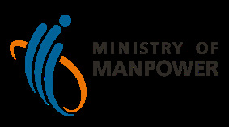

## Page 1

# **Workforce Insights Tool** _for_ **Complementarity Assessment Framework (COMPASS)** 

**Recruit** 

40 20 20 POINTS 

**C1** 

**C2** 

## **What is COMPASS?** 

**COMPASS** is a points-based assessment of Employment Pass (EP) applications based on a set of individual and firm-related attributes. 

## **What is the Workforce Insights tool?** 

The WFI tool has benchmarking insights to help with your workforce planning and hiring. It lets you compare median salaries and non-monetary benefits across industries. 

**COMPASS** will apply to new applications from Sep 2023 and renewals from Sep 2024. To qualify, EP candidates must: 

**SEP2023** 

- **Meet the prevailing** 

- **qualifying salary** 

- **Score at least 40 points** 

- **under COMPASS** 

The tool has been enhanced to help you find out your firm's score on these firm-related **COMPASS** criteria: 

- **C3** – **Diversity** 

- • **C4** – **Support for Local Employment** 

1/3

## Page 2

## **How can I access the Workforce Insights tool?** 

The **Workforce Insights** tool can be accessed via **myMOM Portal** . **(https://go.gov.sg/mymom-portal)** 

### **Step 1:** 

<!-- Start of picture text -->
myMOM  Portal Diversity Local PMETs Hiring Locals Retaining Locals Nationalities/Citizenships of PMETs in your firm Workforce WorkforceInsights Insights <!-- End of picture text -->

Log on to **myMOM Portal** with your Corppass account. 

### **Step 2:** 

Click on **Workforce Insights** on the left menu of the portal. 

## **Find out your firm’s score on the COMPASS firm-related attributes** 

<!-- Start of picture text -->
Diversity – C3 myMOM  Portal • COMPASS  when the candidate’s nationality  forms a small share of the firm’s Diversity Local PMETs Hiring Locals Retaining Locals  PMET employees. Diversity L •  No points are earned if the National ities/Citizenships of PMETs in your firm  candidate's nationality currently Workforce Insights Nationalit  forms a significant share of its  PMET employees. Nationalitiy/Citizenship Share of PMETS in your firm Find out how your firm scores on A XX % C3 in the  “Diversity” B XX % shows you the top nationalities of C XX % PMETs in your firm. <!-- End of picture text -->

- **COMPASS** awards more points 

- when the candidate’s nationality forms a small share of the firm’s PMET employees. 

- No points are earned if the 

- candidate's nationality currently forms a significant share of its PMET employees. 

Find out how your firm scores on C3 in the **“Diversity”** tab. This tab shows you the top nationalities of PMETs in your firm. 

2/3

## Page 3

<!-- Start of picture text -->
Support for local myMOM  Portal employment – C4 • COMPASS  recognises firms that  create opportunities for the local Diversity LocaLocal PMETsMETs Hiring Locals Retaining Locals  workforce and build complementary  rkforce and build complementary  teams of both local and foreign Industry benchmarking for local PMET share benchma  professionals. Workforce Insights •  Applications earn more points if  you r firm has a relatively higher Your local PMET share How you fare within your sector  share of locals among PMET  employees, compared to your You are here  peers in the same sector. XX% Find out how your firm scores on C4 in the  “Local PMETs”  tab. This tab shows you your local PMET share relative to your sector peers. <!-- End of picture text -->

- **COMPASS** recognises firms that 

- create opportunities for the local <u>workforce and build complementary  rkforce and build complementary</u> teams of both local and foreign professionals. 

- Applications earn more points if 

- ~~you~~ r firm has a relatively higher share of locals among PMET employees, compared to your peers in the same sector. 

Find out how your firm scores on C4 in the **“Local PMETs”** tab. This tab shows you your local PMET share relative to your sector peers. 

For more information on **COMPASS** and answers to commonly asked questions, please visit **https://go.gov.sg/compass** . 

3/3

