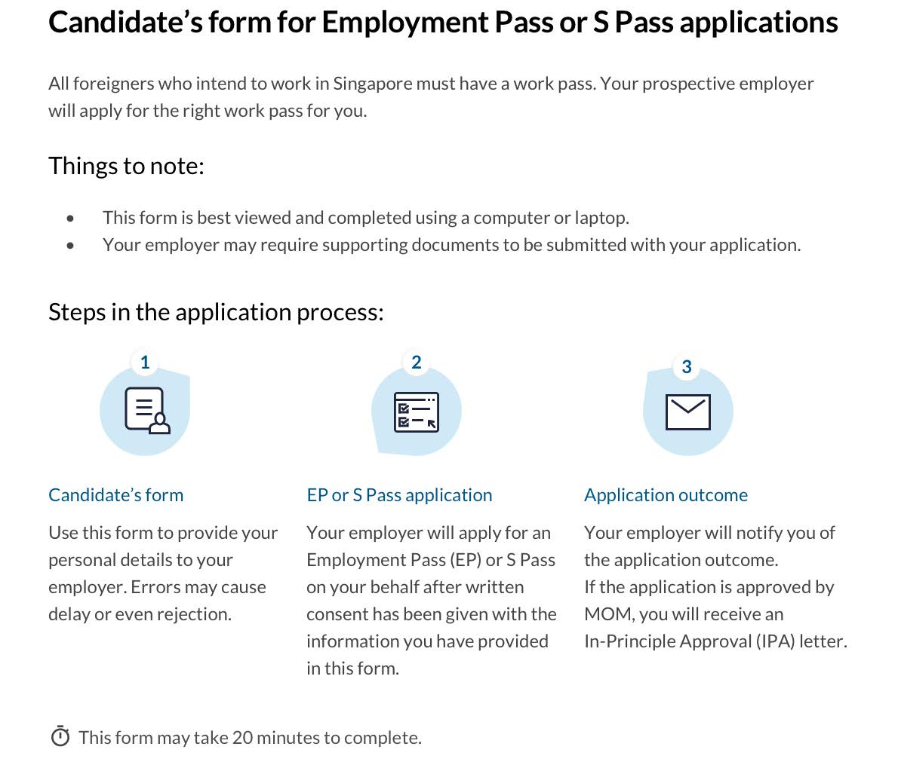

<!-- HCAG:COMPILED id=www.mom.gov.sg.passes-and-permits.s-pass.apply-for-a-pass -->
---
children:
- www.mom.gov.sg.passes-and-permits.s-pass.apply-for-a-pass.cultural-orientation-programme
content_token_estimate: 8880
descendants: 1
id: www.mom.gov.sg.passes-and-permits.s-pass.apply-for-a-pass
image_urls: {}
kind: mixed
long_description: 'Provides the end-to-end procedural guide for applying for a Singapore
  S Pass. Covers pre-application steps (written consent, candidate form completion,
  business activity declaration, CPF account requirement, passport validity of at
  least 7 months, MyCareersFuture advertising requirement), online submission via
  EP eService with the $105 fee, processing time of 10 business days, handling of
  additional document requests, and checking application status. Details post-approval
  steps: printing the IPA letter (valid 60 days for single entry), insurance requirements,
  pass issuance ($100 fee) including required documents and information (passport,
  medical insurance, Primary Care Plan, work injury compensation insurance, housing,
  STVP details), fingerprint and photo registration within 1 week, SGWorkPass digital
  pass setup, card delivery within 5 working days, and card collection procedures
  including failed-delivery handling. Also contains the full candidate form template
  collecting personal particulars, travel document details, work experience, educational
  qualifications, professional memberships, and candidate declarations/consent.'
source_files:
- index.md
- ep-and-s-pass-candidate-form.md
- ep-and-s-pass-candidate-form-2.md
source_urls:
- ''
- ''
- ''
subtree_depth: 1
title: 'S Pass application process: how to apply, issue, and collect the card'
token_size_estimate: 8880
---

# S Pass application process: how to apply, issue, and collect the card

<!-- HCAG:CONTENT BEGIN -->
## Content

<!-- source: index.md -->
# Apply for an S Pass

PH pay, COMPASS, Primary Care Plan, myMOM Portal, paying salary, annual leave

2026-08-28-11:50:58

# 
        Apply for an S Pass
    

You can apply for an S Pass online as an employer or appointed employment agent.

 
 
## How to apply

 

- See the [pass map](https://www.mom.gov.sg/passes-and-permits/s-pass/key-facts#pass-map) for an overview of what you need to do before, during and after you apply for an S Pass.
- You are required to advertise your job opening on MyCareersFuture and [consider all candidates fairly](https://www.mom.gov.sg/passes-and-permits/s-pass/consider-all-candidates-fairly) before applying.
- If you have never applied for an S Pass, you need to [declare your business activity](https://www.mom.gov.sg/eservices/services/declare-your-business-activity) .
- Your company must have an account with the [Central Provident Fund Board](https://www.cpf.gov.sg/) for calculating your S Pass quota.
- The candidate's **passport** must be valid for at least 7 months. The S Pass duration granted will only be up to 1 month before the expiry date of the passport.
- Apply for [family passes](https://www.mom.gov.sg/passes-and-permits/s-pass/eligibility#passes-for-family-members) after the main pass is approved. Although you can apply for family passes at the same time as the S Pass, you will lose the application fees for each family pass if the S Pass application gets rejected.

 

 
You can submit an application using [EP eService](https://www.mom.gov.sg/eservices/services/employment-pass-eservice).

***Processing time:** Processed or given an update within 10 business days.*

### **How to apply**

*Candidates do not need to be in Singapore when you apply.*

1. [Get a written consent to apply for S Pass](https://www.mom.gov.sg/faq/work-pass-general/why-must-i-get-a-foreigners-written-consent-before-applying-for-a-work-pass-for-them) from the candidate.
2. Complete the [candidate’s form](https://www.mom.gov.sg/-/media/mom/documents/work-passes-and-permits/ep-and-s-pass-candidate-form.pdf) . It contains information you’ll need for the application and can be sent to the candidate to fill in.
3. [Submit the S Pass application](https://www.mom.gov.sg/eservices/services/employment-pass-eservice) and upload the required documents. Select the option to be considered for both the EP and the S Pass.
 Ensure that your organisation’s  [turnover information](https://www.mom.gov.sg/passes-and-permits/s-pass/notify-mom-of-changes#change-in-companys-name-or-financial-information) for the past 3 years has been updated before submitting the application.
4. Pay the $105 fee by GIRO, Visa, Mastercard or Amex.

### **How to check your application status**

You may [check your application status online](https://www.mom.gov.sg/eservices/services/employment-pass-eservice) after **10 business days**. 

If your application is still pending after 10 business days, please check your email for our request of additional documents.

If additional information or documents are required:

- Your processing time may take longer than 10 working days.
- You will need to [submit the documents](https://www.mom.gov.sg/eservices/services/employment-pass-eservice) . Click on ‘Work Passes’ on the left menu > Choose the application record > Select ‘Submit documents’. Alternatively, select ‘View details’ to see the action required from you.
- Otherwise, our email will inform you to submit them using our [online form](https://form.gov.sg/#!/5f8d4eadef8dab00112fd313) .

### **If the pass is approved**

1. [Print the in-principle approval (IPA) letter](https://www.mom.gov.sg/eservices/services/employment-pass-eservice)
2. Send the pass holder's copy of the IPA to the candidate.
    The IPA:   - **Is a pre-approved single-entry visa for the candidate to enter Singapore** . It gives the candidate**60 days** to enter Singapore and get their pass issued.
  - **States whether the candidate needs to go for a****medical examination** after their arrival in Singapore.

  
You need to complete these steps to prepare for your candidate's arrival in Singapore.

You should only bring in candidates when the pass is approved, as we will not be able to extend their visit pass.

### Before candidate's arrival

Ensure that they comply with the [latest travel requirements](https://www.ica.gov.sg/enter-transit-depart/entering-singapore). 

Buy the required insurance for them. You need to:

 
*When: Within 60 days of in-principle approval*

*Processing time: Immediate*

The candidate must be in Singapore when you carry out these steps to get the pass issued: 

1. Log in to [EP eService](https://www.mom.gov.sg/eservices/services/employment-pass-eservice) and provide the[required information and documents](#what-you-ll-need) .
2. Pay the $100 fee for each pass issued using GIRO, Visa, Mastercard or Amex. 
3. Once the pass is issued, the candidate and you will both receive the notification letter by email. The notification letter is valid for **1 month** from the date of issue and:

- Allows the candidate to start work and travel in and out of Singapore while waiting for the pass card.
- States if the candidate needs to have their fingerprints and photo taken for the card registration.

### What you'll need

You will need the following information to get the pass issued: 

- Candidate's passport details
- Candidate’s Singapore contact details
- Candidate’s [medical insurance](https://www.mom.gov.sg/passes-and-permits/s-pass/medical-insurance) details
- Candidate's completed medical examination form. If certified fit to work, buy the [Primary Care Plan](https://www.mom.gov.sg/primary-care-plan) for those who are required to have it.
- Candidate’s [work injury compensation insurance](https://www.mom.gov.sg/workplace-safety-and-health/work-injury-compensation/work-injury-compensation-insurance) details
- Candidate's current Short-Term Visit Pass (STVP) or immigration pass details
- Candidate's Singapore residential address, which must meet the [housing requirements](https://www.mom.gov.sg/passes-and-permits/work-permit-for-foreign-worker/housing/various-types-of-housing) for you to get the pass issued.
- Singapore residential or office address to receive the candidate’s card
- Details of up to 3 authorised recipients to receive the card (their mobile numbers and NRIC number / FIN / passport number) 

You may also need to upload PDF copies of these documents:

- Candidate’s passport page showing the date of arrival in Singapore 
- Completed medical examination form or medical declaration form
- Completed declaration form (attached to the candidate's in-principle approval letter). The employer’s declaration of the form should be signed by an authorised human resource personnel, or an employee holding at least a managerial position.

If you need more time to get the pass issued as your candidates are waiting for their medical results, you can extend their STVP. 

[Submit this request](https://www.mom.gov.sg/extend-stay) **7 to 14 days before the STVP expires**
 and upload the doctor's memo stating the medical results collection date.

**Example:** If the STVP expires on 17 February, you can only submit the request from 4 to 10 February. **Overstaying fines** may be incurred for late request.

 
 
## (If required) Register fingerprints and photo

Show

*When: Within 1 week after the pass is issued*

**Check the notification letter** for whether the candidate needs to register fingerprints and photo.

If required, the candidate needs to complete registration **within 1 week** after the pass is issued.

For registration, you must [make an appointment](https://www.mom.gov.sg/eservices/services/make-an-appointment) for the candidate to visit [MOM Services Centre – Hall C](https://www.mom.gov.sg/contact-us/locations). 

For the appointment, the candidate should bring:

- Original passport
- Appointment letter
- Notification letter
- Their mobile phone (with local mobile number) with both Singpass and [SGWorkPass](https://www.mom.gov.sg/eservices/sgworkpass) apps downloaded

During registration, we will capture the candidate’s fingerprints, take their photo and register them for a Singpass account. We will also help the candiate set up the Singpass and SGWorkPass app on their mobile phone. 

 
 

*When: On the day of card registration*

After they are registered for a Singpass account, inform the candidate to:

1. Download [SGWorkPass](https://www.mom.gov.sg/eservices/sgworkpass) (if they have not done so yet)
2. Log into the app with their Singpass
3. View their digital work pass and employment information

SGWorkPass app allows them easy and secure access to their digital work pass. They can check their status, expiry date and procure services earlier, without having to wait for delivery of their physical work pass cards.

If the candidate is not required to report to MOMSC for card registration, please inform them to set up their digital work pass.

  
*When: Within 5 working days after registration or document verification* 

We will deliver the card to the given address within **5 working days** after the candidate registers and gets document verified. If the candidate does not have to register, we will deliver the card within 5 working days after checking the documents.

Inform your candidate to set up their 

[SGWorkPass](https://www.mom.gov.sg/eservices/sgworkpass)
 app to view their digital work pass and employment information.

The authorised recipients will get an SMS or email with the delivery details at least 1 working day before the delivery.

When collecting the card, you will need to show these documents for identification:

| Person receiving the card | Required documents | 
|---|---|
| Candidate | Passport or digital work pass | 
| Authorised person | NRIC, FIN or passport | 

 If you do not receive the card within 5 working days, [check if you have uploaded the correct documents](https://www.mom.gov.sg/faq/work-pass-general/ive-registered-for-my-card-but-mom-has-not-yet-contacted-me-about-the-card-delivery-date-what-should-i-do).

Your employer or employment agent can also [check the card delivery](https://www.mom.gov.sg/eservices/services/employment-pass-eservice) details. 

### If card delivery fails

After 2 unsuccessful deliveries, the pass holder or an authorised person can collect the card at
[MOM Services Centre – Hall C](https://www.mom.gov.sg/contact-us/locations) after **3 working days.** They do not need an appointment.

Bring along these documents for the card collection:

- Candidate’s original passport or digital work pass
- Notification letter

If you authorise someone to collect it on your behalf, make sure they bring these along:

- An authorised letter from the employer
- NRIC or passport for verification
- Candidate's original passport
- Notification letter

<!-- source: ep-and-s-pass-candidate-form.md -->
## Page 1

## Page 2

# **Candidate’s form for Employment Pass or S Pass applications** 

Please complete this form and send it to your prospective employer for your Employment Pass or S Pass application. Your prospective employer will need to apply for an Employment Pass or S Pass on your behalf before you can start work in Singapore. Please have your latest travel document and educational certificates ready to fill in this form. 

## **Your particulars** 

#### **Have you ever studied, worked or stayed long-term (not as a tourist) in Singapore before?** 

Yes, I am currently working/studying/staying in Singapore 

Yes, I have worked/studied/stayed in Singapore in the past 

No 

No, but I have a Foreign Identification Number (FIN) issued by Singapore 

**What is your FIN or Work Permit number?** 

If you have both FIN and Work Permit number, please provide us with your FIN. 

> FIN 

Work Permit number 

I can’t remember both 

**Are you a partner, sole proprietor or director of any Singapore-registered company?** 

Yes 

No 

### **Travel document details** 

Tell us your latest travel document information 

Full name (as in travel document) Alias (as in travel document, if any) Date of birth (dd-mmm-yyyy) Sex Female Male Nationality/Citizenship - Enter text in proper case - Select drop-down icon then type to search Bangladeshi identity card number 

Old Malaysian identity card number 

New Malaysian identity card number 

Malaysian identity card colour 

Pink 

Blue 

2 

Clear page 

Save

## Page 3

**Candidate form for Employment Pass or S Pass applications** 

#### Travel document type 

Travel document number 

Travel document issue date (DD-MMM-YYYY) 

Travel document expiry date (DD-MMM-YYYY) Country/Region of birth <mark>- Enter text in proper case -</mark> Select drop-down icon then type to search State/Province of birth <mark>TrengganuNorthern Ireland</mark> Country/Region of origin <mark>- Enter text in proper case -</mark> Select drop-down icon then type to search State/Province of origin 

Race 

Religion 

Marital status 

Is spouse a Singaporean Citizen, Permanent Resident, EP, S Pass or WP holder? 

Yes 

No 

Spouse full name (as in travel document) 

Spouse ID type 

NRIC 

FIN 

### **Contact details** 

Email 

Singapore mobile number (optional) 

3 

Clear page 

Save

## Page 4

**Candidate form for Employment Pass or S Pass applications** 

<!-- Start of picture text -->
Work experience Total working experience years months Relevant working experience related to the occupation that will be  years months declared in the work pass application Are you currently working? Yes No Work experience 1 Provide your most recent work experience Name of company Country of employment - Enter text in proper case - Select drop-down icon then type to search Occupation  - Enter text in proper case - Select drop-down icon then type to search Period of employment (DD-MMM-YYYY) From: To: Last drawn fixed monthly salary (SGD) What is  fixed monthly salary ? <!-- End of picture text -->

<!-- Start of picture text -->
Work experience 2 Provide your second most recent work experience Name of company Country of employment - Enter text in proper case - Select drop-down icon then type to search Occupation - Enter text in proper case - Select drop-down icon then type to search Period of employment (DD-MMM-YYYY) From: To: Last drawn fixed monthly salary (SGD) What is  fixed monthly salary ? <!-- End of picture text -->

4 

Clear page 

Save

## Page 5

**Candidate form for Employment Pass or S Pass applications** 

## **Educational qualifications** 

Include up to 2 qualifications that were awarded to you: 

- Search for the name of your awarding institution and qualification on our lists on the Self Assessment Tool. Enter the details as it appears on our lists on the Self Assessment Tool. 

- If your awarding institution cannot be found on our list, enter its name exactly as it appears on the educational certificate and your employer must upload a verification proof of the qualification to confirm it is genuine and from an accredited institution. 

- Your application will be rejected if any of the qualifications are doubtful or from an institution that is not accredited or recognised by its country’s educational authorities. 

#### **Qualification 1** 

Awarding institution For the latest list <u>of awarding institutions, please</u> refer to <u>the Self-Assessment Tool.</u> Country of awarding institution <mark>- Enter text in proper case -</mark> Select drop-down icon then type to search 

#### Qualification 

For the latest list of qualifications, <u>please refer to the Self-Assessment Tool.</u> Faculty Mode of study Period of study (DD-MMM-YYYY) From: To: 

Did you attend classes on campus? 

Yes No 

Is the campus located in the country of awarding institution? Yes No 

Is this the main campus? (Only applicable if you selected Yes for the above question) Yes No 

#### **Qualification 2** 

Awarding institution For the latest list <u>of awarding institutions, please</u> refer to <u>the Self-Assessment Tool.</u> Country of awarding institution <mark>- Enter text in proper case -</mark> Select drop-down icon then type to search 

<!-- Start of picture text -->
Qualification <!-- End of picture text -->

For the latest list of qualifications, please refer to the Self-Assessment Tool. 

Faculty Mode of study Period of study (DD-MMM-YYYY) From: To: 

5 

Save Clear page

## Page 6

**Candidate form for Employment Pass or S Pass applications** 

Did you attend classes on campus? 

Yes 

No 

Is the campus located in the country of awarding institution? 

Yes No 

Is this the main campus? (Only applicable if you selected Yes for the above question) 

Yes No 

## **Membership or professional details** 

You may add up to 2 societies or organisations membership details that you are a part of from the past 5 years to date. 

#### **Society or organisation 1** 

Society or organisation 

Are you currently a member? 

Yes No 

#### Position held 

Period held (DD-MMM-YYYY) From: To: 

#### **Society or organisation 2** 

#### Society or organisation 

Are you currently a member? 

Yes No 

#### Position held 

|Period held(DD-MMM-YYYY)|From: To:|
|---|---|

6 

Clear page 

Save

## Page 7

**Candidate form for Employment Pass or S Pass applications** 

## **Your declarations** 

#### **Have you ever:** 

|a)|Been refused entry into or deported from any country?|Yes|No|
|---|---|---|---|
|b)|Been convicted in a court of law in any country?|Yes|No|
|c)|Been prohibited from entering Singapore?|Yes|No|
|d)|Entered Singapore using a passport issued by a different country?|Yes|No|
|e)|Entered Singapore using a different name?|Yes|No|
|f)|Been a Singapore Citizen or Singapore Permanent Resident?|Yes|No|

## **Confirmation** 

- I wish to confirm that: • All data entered in this application form is accurate. 

   - I give consent to my prospective employer to apply for an Employment / S Pass for me. My prospective employer can produce this consent when requested by the authority. 

   - I give consent to the Government of Singapore to obtain from and verify the information with any person, organisation, or any other source for assessing the application. 

Save Clear page 

7

<!-- source: ep-and-s-pass-candidate-form-2.md -->
## Page 1

## Page 2

# **Candidate’s form for Employment Pass or S Pass applications** 

Please complete this form and send it to your prospective employer for your Employment Pass or S Pass application. Your prospective employer will need to apply for an Employment Pass or S Pass on your behalf before you can start work in Singapore. Please have your latest travel document and educational certificates ready to fill in this form. 

## **Your particulars** 

#### **Have you ever studied, worked or stayed long-term (not as a tourist) in Singapore before?** 

Yes, I am currently working/studying/staying in Singapore 

Yes, I have worked/studied/stayed in Singapore in the past 

No 

No, but I have a Foreign Identification Number (FIN) issued by Singapore 

**What is your FIN or Work Permit number?** 

If you have both FIN and Work Permit number, please provide us with your FIN. 

> FIN 

Work Permit number 

I can’t remember both 

**Are you a partner, sole proprietor or director of any Singapore-registered company?** 

Yes 

No 

### **Travel document details** 

Tell us your latest travel document information 

Full name (as in travel document) Alias (as in travel document, if any) Date of birth (dd-mmm-yyyy) Sex Female Male Nationality/Citizenship - Enter text in proper case - Select drop-down icon then type to search Bangladeshi identity card number 

Old Malaysian identity card number 

New Malaysian identity card number 

Malaysian identity card colour 

Pink 

Blue 

2 

Clear page 

Save

## Page 3

**Candidate form for Employment Pass or S Pass applications** 

#### Travel document type 

Travel document number 

Travel document issue date (DD-MMM-YYYY) 

Travel document expiry date (DD-MMM-YYYY) Country/Region of birth <mark>- Enter text in proper case -</mark> Select drop-down icon then type to search State/Province of birth <mark>TrengganuNorthern Ireland</mark> Country/Region of origin <mark>- Enter text in proper case -</mark> Select drop-down icon then type to search State/Province of origin 

Race 

Religion 

Marital status 

Is spouse a Singaporean Citizen, Permanent Resident, EP, S Pass or WP holder? 

Yes 

No 

Spouse full name (as in travel document) 

Spouse ID type 

NRIC 

FIN 

### **Contact details** 

Email 

Singapore mobile number (optional) 

3 

Clear page 

Save

## Page 4

**Candidate form for Employment Pass or S Pass applications** 

<!-- Start of picture text -->
Work experience Total working experience years months Relevant working experience related to the occupation that will be  years months declared in the work pass application Are you currently working? Yes No Work experience 1 Provide your most recent work experience Name of company Country of employment - Enter text in proper case - Select drop-down icon then type to search Occupation  - Enter text in proper case - Select drop-down icon then type to search Period of employment (DD-MMM-YYYY) From: To: Last drawn fixed monthly salary (SGD) What is  fixed monthly salary ? <!-- End of picture text -->

<!-- Start of picture text -->
Work experience 2 Provide your second most recent work experience Name of company Country of employment - Enter text in proper case - Select drop-down icon then type to search Occupation - Enter text in proper case - Select drop-down icon then type to search Period of employment (DD-MMM-YYYY) From: To: Last drawn fixed monthly salary (SGD) What is  fixed monthly salary ? <!-- End of picture text -->

4 

Clear page 

Save

## Page 5

**Candidate form for Employment Pass or S Pass applications** 

## **Educational qualifications** 

Include up to 2 qualifications that were awarded to you: 

- Search for the name of your awarding institution and qualification on our lists on the Self Assessment Tool. Enter the details as it appears on our lists on the Self Assessment Tool. 

- If your awarding institution cannot be found on our list, enter its name exactly as it appears on the educational certificate and your employer must upload a verification proof of the qualification to confirm it is genuine and from an accredited institution. 

- Your application will be rejected if any of the qualifications are doubtful or from an institution that is not accredited or recognised by its country’s educational authorities. 

#### **Qualification 1** 

Awarding institution For the latest list <u>of awarding institutions, please</u> refer to <u>the Self-Assessment Tool.</u> Country of awarding institution <mark>- Enter text in proper case -</mark> Select drop-down icon then type to search 

#### Qualification 

For the latest list of qualifications, <u>please refer to the Self-Assessment Tool.</u> Faculty Mode of study Period of study (DD-MMM-YYYY) From: To: 

Did you attend classes on campus? 

Yes No 

Is the campus located in the country of awarding institution? Yes No 

Is this the main campus? (Only applicable if you selected Yes for the above question) Yes No 

#### **Qualification 2** 

Awarding institution For the latest list <u>of awarding institutions, please</u> refer to <u>the Self-Assessment Tool.</u> Country of awarding institution <mark>- Enter text in proper case -</mark> Select drop-down icon then type to search 

<!-- Start of picture text -->
Qualification <!-- End of picture text -->

For the latest list of qualifications, please refer to the Self-Assessment Tool. 

Faculty Mode of study Period of study (DD-MMM-YYYY) From: To: 

5 

Save Clear page

## Page 6

**Candidate form for Employment Pass or S Pass applications** 

Did you attend classes on campus? 

Yes 

No 

Is the campus located in the country of awarding institution? 

Yes No 

Is this the main campus? (Only applicable if you selected Yes for the above question) 

Yes No 

## **Membership or professional details** 

You may add up to 2 societies or organisations membership details that you are a part of from the past 5 years to date. 

#### **Society or organisation 1** 

Society or organisation 

Are you currently a member? 

Yes No 

#### Position held 

Period held (DD-MMM-YYYY) From: To: 

#### **Society or organisation 2** 

#### Society or organisation 

Are you currently a member? 

Yes No 

#### Position held 

|Period held(DD-MMM-YYYY)|From: To:|
|---|---|

6 

Clear page 

Save

## Page 7

**Candidate form for Employment Pass or S Pass applications** 

## **Your declarations** 

#### **Have you ever:** 

|a)|Been refused entry into or deported from any country?|Yes|No|
|---|---|---|---|
|b)|Been convicted in a court of law in any country?|Yes|No|
|c)|Been prohibited from entering Singapore?|Yes|No|
|d)|Entered Singapore using a passport issued by a different country?|Yes|No|
|e)|Entered Singapore using a different name?|Yes|No|
|f)|Been a Singapore Citizen or Singapore Permanent Resident?|Yes|No|

## **Confirmation** 

- I wish to confirm that: • All data entered in this application form is accurate. 

   - I give consent to my prospective employer to apply for an Employment / S Pass for me. My prospective employer can produce this consent when requested by the authority. 

   - I give consent to the Government of Singapore to obtain from and verify the information with any person, organisation, or any other source for assessing the application. 

Save Clear page 

7

<!-- HCAG:CONTENT END -->
