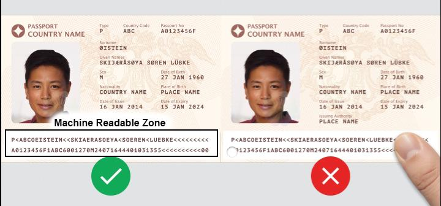
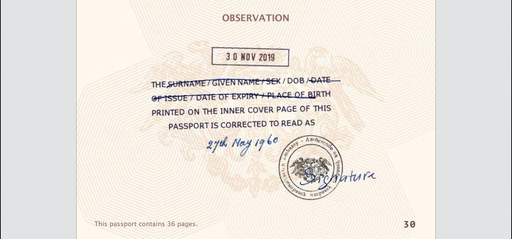

<!-- HCAG:COMPILED id=www.mom.gov.sg.passes-and-permits.s-pass.documents-required -->
---
children: []
content_token_estimate: 23115
descendants: 0
id: www.mom.gov.sg.passes-and-permits.s-pass.documents-required
image_urls: {}
kind: leaf
long_description: 'Lists the specific documents that must be uploaded when submitting
  a Singapore S Pass application: candidate''s passport biodata page, ACRA business
  profile, and an explanation letter if the passport name differs from other documents.
  Defines additional document requirements for specific occupations — healthcare professionals
  (dentists, doctors, nurses, pharmacists, physiotherapists, radiographers, occupational/speech
  therapists, TCM practitioners, paramedics/EMTs), lawyers, and football players/coaches
  — identifying the professional body and contact for each. Specifies that food-establishment
  employers must provide a copy of their SFA foodshop licence page or the ''Application
  for Foodshop Licence'' letter. Also contains detailed travel-document upload requirements:
  acceptable file formats (jpg, png, pdf), image quality rules (landscape orientation,
  no reflections, no flash, full Machine Readable Zone visible, no watermarks), how
  to handle accented characters using the MRZ, and when Amendments/Observation pages
  must be included.'
source_files:
- index.md
- travel-doc-requirements-v1.md
- travel-doc-requirements-v1-2.md
source_urls:
- ''
- ''
- ''
subtree_depth: 0
title: S Pass application – required documents and passport upload rules
token_size_estimate: 23115
---

# S Pass application – required documents and passport upload rules

<!-- HCAG:CONTENT BEGIN -->
## Content

<!-- source: index.md -->
# Documents required for S Pass

You need to upload documents (e.g. candidate’s passport page showing personal particulars) when submitting an S Pass application.

## Documents required

- Personal particulars page of candidate’s passport. [Learn more](https://www.mom.gov.sg/-/media/mom/documents/work-passes-and-permits/travel-doc-requirements-v1.pdf) about the upload requirements.
 
If the candidate’s name on the passport differs from that on their other documents, please also upload an explanation letter and supporting documents (e.g. deed poll).
- Company’s latest business profile or instant information registered with ACRA.
- Additional documents are required for:

## Healthcare professionals, lawyers, football players or coachesShow

You need supporting documents from the respective professional bodies:

| Occupation | Professional body | For enquiries | 
|---|---|---|
| Dentist | Singapore Dental Council | [SDC@spb.gov.sg](mailto:SDC@spb.gov.sg) | 
| Diagnostic radiographer | Allied Health Professions Council | [AHPC@spb.gov.sg](mailto:AHPC@spb.gov.sg) | 
| Doctor | Singapore Medical Council | [SMC@spb.gov.sg](mailto:SMC@spb.gov.sg) | 
| Emergency medical technician | Unit for Prehospital Emergency Care | [PAO_enquiry@upec.sg](mailto:PAO_enquiry@upec.sg) | 
| Football player or coach | Sport Singapore | [Enquiry form](https://form.gov.sg/660a08adb384a2cbaa8cfa36) | 
| Lawyer | Legal Services Regulatory Authority | [https://eservices.mlaw.gov.sg/enquiry](https://eservices.mlaw.gov.sg/enquiry/) | 
| Nurse | Singapore Nursing Board | [SNB@spb.gov.sg](mailto:SNB@spb.gov.sg) | 
| Occupational therapist | Allied Health Professions Council | [AHPC@spb.gov.sg](mailto:AHPC@spb.gov.sg) | 
| Paramedic | Unit for Prehospital Emergency Care | [PAO_enquiry@upec.sg](mailto:PAO_enquiry@upec.sg) | 
| Pharmacist | Singapore Pharmacy Council | [SPC@spb.gov.sg](mailto:SPC@spb.gov.sg) | 
| Physiotherapist | Allied Health Professions Council | [AHPC@spb.gov.sg](mailto:AHPC@spb.gov.sg) | 
| Radiation therapist | Allied Health Professions Council | [AHPC@spb.gov.sg](mailto:AHPC@spb.gov.sg) | 
| Speech therapist | Allied Health Professions Council | [AHPC@spb.gov.sg](mailto:AHPC@spb.gov.sg) | 
| TCM practitioner | Traditional Chinese Medicine Practitioners Board | [TCMPB@spb.gov.sg](mailto:TCMPB@spb.gov.sg) | 

## Employees in a food establishmentShow

A copy of the online page that can be accessed when you scan the QR code on the foodshop licence issued by Singapore Food Agency (SFA). The page should indicate your foodshop license validity period.

If you have a new establishment and don’t have the licence yet, you can submit a copy of the **“Application for Foodshop Licence”** letter issued to you by SFA.

<!-- source: travel-doc-requirements-v1.md -->
## Page 1

_Last updated: 26 August 2026_ 

# Travel document requirements 

## **Things to note** 

- Upload only the **latest copy** of the travel document. 

- We **only** need the biodata page of your travel document. Provide the Amendments/Observation pages **only if** they show changes to the biodata page details. 

- Save each page as a single image file. Acceptable file formats are jpg, png and pdf. 

- Ensure the image is in landscape format and the right way up. 

- To avoid delays in the processing of your application, please ensure you have met all these requirements. 

## **How to prepare your document for upload** 

1. Provide a large, close-up colour copy of the biodata page. The **image and text must be clear.** The photograph must clearly show all facial features (eyes, ears, mouth, nose, chin). 

_Last updated: 26 August 2026_ 

Page 1 of 4

## Page 2

_Last updated: 26 August 2026_ 

2. The page should have an even exposure with **no reflections** , as reflections can block parts of the text. 

**Tip** : Position the travel document at a slight angle or hold it up vertically to reduce glare and reflections. **Do not** use your camera’s flash. 

3. Ensure all **label text** (e.g. Date of Issue, Place of Birth) is clear. 

_Last updated: 26 August 2026_ 

Page 2 of 4

## Page 3

_Last updated: 26 August 2026_ 

4. Ensure the whole page, including the entire “Machine Readable Zone”, is visible. It **must not** be cut off, blocked, or covered by a watermark. 

<!-- Start of picture text -->
Watermark <!-- End of picture text -->

5. Enter the full name in the **same order as it appears** on the travel document. For accented characters (e.g. Ä, É, Ö, Ø, Ü), refer to the “Machine Readable Zone” for its conversion (e.g. Ø should be entered as OE). 

_Last updated: 26 August 2026_ 

Page 3 of 4

## Page 4

_Last updated: 26 August 2026_ 

6. Only provide the Amendments/Observation pages **if they show changes to any details** (e.g. name, expiry date). If there are no changes, you do not need to upload this page. 

7. If there are changes to the passport details, select the checkbox in the eService application form and upload an image of the Amendments/Observation page. A screenshot of the checkbox is shown below for your reference. 

_Last updated: 26 August 2026_ 

Page 4 of 4

<!-- source: travel-doc-requirements-v1-2.md -->
## Page 1

_Last updated: 26 August 2026_ 

# Travel document requirements 

## **Things to note** 

- Upload only the **latest copy** of the travel document. 

- We **only** need the biodata page of your travel document. Provide the Amendments/Observation pages **only if** they show changes to the biodata page details. 

- Save each page as a single image file. Acceptable file formats are jpg, png and pdf. 

- Ensure the image is in landscape format and the right way up. 

- To avoid delays in the processing of your application, please ensure you have met all these requirements. 

## **How to prepare your document for upload** 

1. Provide a large, close-up colour copy of the biodata page. The **image and text must be clear.** The photograph must clearly show all facial features (eyes, ears, mouth, nose, chin). 

_Last updated: 26 August 2026_ 

Page 1 of 4

## Page 2

_Last updated: 26 August 2026_ 

2. The page should have an even exposure with **no reflections** , as reflections can block parts of the text. 

**Tip** : Position the travel document at a slight angle or hold it up vertically to reduce glare and reflections. **Do not** use your camera’s flash. 

3. Ensure all **label text** (e.g. Date of Issue, Place of Birth) is clear. 

_Last updated: 26 August 2026_ 

Page 2 of 4

## Page 3

_Last updated: 26 August 2026_ 

4. Ensure the whole page, including the entire “Machine Readable Zone”, is visible. It **must not** be cut off, blocked, or covered by a watermark. 

<!-- Start of picture text -->
Watermark <!-- End of picture text -->

5. Enter the full name in the **same order as it appears** on the travel document. For accented characters (e.g. Ä, É, Ö, Ø, Ü), refer to the “Machine Readable Zone” for its conversion (e.g. Ø should be entered as OE). 

_Last updated: 26 August 2026_ 

Page 3 of 4

## Page 4

_Last updated: 26 August 2026_ 

6. Only provide the Amendments/Observation pages **if they show changes to any details** (e.g. name, expiry date). If there are no changes, you do not need to upload this page. 

7. If there are changes to the passport details, select the checkbox in the eService application form and upload an image of the Amendments/Observation page. A screenshot of the checkbox is shown below for your reference. 

_Last updated: 26 August 2026_ 

Page 4 of 4

<!-- HCAG:CONTENT END -->
