## Page 1

Guidelines for employers of Work Permit and S Pass holders 

# **HOW TO CALCULATE YOUR QUOTA AND LEVY BILL**

## Page 2

Guidelines for employers of Work Permit (WP) and S Pass holders **How to calculate your quota and levy bill** Updated 1 July 2026 

**___________________________________________________** 

## **About this booklet** 

This booklet helps you estimate your levy bill and understand how your quota is 

calculated. 

Quotas and levies are applied to all Work Permit (WP) and S Pass holders to encourage employers to hire local employees and explore manpower-lean solutions. 

## **Contents** 

|1. How we count your local employees to determine the quota .................................... 3|
|---|
|2. Quota and levy rates ................................................................................................. 5|
|3. 6 steps to calculating your quota and levy bill ........................................................... 6|
|Step 1: Calculate the maximum no. of migrant workers (MW) you can hire..……6|
|Step 2: Calculate your total workforce………………………………………………..8|
|Step 3: Calculate the number of S Pass holders you can hire….…………...........9|
|Step 4: Calculate the number of PRC and/or Non-Traditional Sources (NTS) Occupation List (NTS-OL) WP holders you can hire………………….………10|
|Step 5: Calculate the number of MWs under each levy tier………………………11|
|Step 6: Calculate your levy bill………………………………...………………….....12|
|4. How changes in your business operations can affect your quota…………………....13|

2

## Page 3

Guidelines for employers of Work Permit (WP) and S Pass holders **How to calculate your quota and levy bill** Updated 1 July 2026 

**___________________________________________________** 

#### **How we count your local employees to determine the quota** 

We use your company’s Central Provident Fund (CPF) account to count your local employees and calculate your Work Permit (WP) and S Pass quota. Please declare their salaries and CPF contributions accurately, and on time. 

**Local employees** refer to Singaporean and Permanent Resident (PR) staff employed by your company under a contract of service, including the company’s director. The following local employees are not counted when calculating your quota: 

- Business owners of sole proprietorships or partnerships. 

- <u>Platform workers</u> 

We allow local employees to count towards the foreign worker quota of up to two companies. If you have multiple CPF accounts in your company, you should not contribute CPF and declare salary for the same employee under the different accounts to get more quota. 

The local qualifying salary (LQS) determines the number of local employees who are counted toward your firm’s WP and S Pass quota entitlement. 

A Singaporean or Permanent Resident employee employed under a **<u>contract of service</u>** , including the company’s director, is considered as: 

- 1 local employee if they earn **at least $1,800 per month.** 

- 0.5 local employee if they earn **at least $900 to below $1,800 per month.** 

To cater for any fluctuation in the number of local employees, we take the average of three months’ data (salaries and CPF contributions) declared to CPF. The months we use to calculate the average depend on when you declared this CPF data. If you declared the data by the 14th of the same month, it will be included in next month’s quota calculation. For example, if you declared your employees’ July CPF data: 

- By 14 July, your quota for August will be based on the average of CPF data in May, June and July. 

3

## Page 4

Guidelines for employers of Work Permit (WP) and S Pass holders **How to calculate your quota and levy bill** Updated 1 July 2026 

**___________________________________________________** 

- After 14 July, your quota for August will be based on the average of CPF data in April, May and June. 

The number of local employees will be updated every Saturday and you can check the quota balance on the next working day. Any late or non-payment of CPF contributions and salaries declaration will affect your quota and may cause your workers to be allocated higher levy tiers. We may not consider late CPF contributions and salaries declaration in our calculations, even if you pay off the arrears and any late interests or fines due. 

##### **Online quota calculator** 

To calculate your WP and S Pass quota, you can use our online quota calculator. 

##### **Important** 

Once you have exceeded your quota entitlement, new applications and renewals for WP and S Pass may be rejected. You may also need to cancel the WP and S Pass of your excess workers. 

4

## Page 5

Guidelines for employers of Work Permit (WP) and S Pass holders **How to calculate your quota and levy bill** Updated 1 July 2026 

**___________________________________________________** 

#### **Quota and levy rates** 

The number of WP and S Pass holders a company can hire is limited by a quota and subject to levy. The levy rates vary across sectors and are tiered (e.g. by a firm’s dependency on foreign workers or Work Permit holder’s nationality). The table below outlines the quota, levy rates and tiers for the various sectors. 

||**S Pass**||
|---|---|---|
|**Sector**|**Percentage**|**Levy rate**|
|**Construction,** **Manufacturing, Marine** **shipyard, Process** Quota: 15%|≤15%|$650|
|**Services** Quota: 10%|≤10%||

||**Wo**|**rk Permit**||
|---|---|---|---|
|**Sector**|**Other Tiering**|**Percentage**|**Levy rate** **(Higher-skilled / Basic-** **skilled)**|
||Tier 1|≤25%|$250 / $370|
|**Manufacturing** Quota: 60%|Tier 2|>25%─50%|$350 / $470|
||Tier 3|>50%─60%|$550 / $650|
||Tier 1|≤10%|$300 / $450|
|**Services** Quota: 35%|Tier 2|>10%─25%|$400 / $600|
||Tier 3|>25%─35%|$600 / $800|
||Malaysians, NAS, PRC||$300 / $700|
|**Construction** Quota: 83.3%|NTS|≤83.3%|$500 / $900|
||Off-site||$250 / $370|

5

## Page 6

Guidelines for employers of Work Permit (WP) and S Pass holders **How to calculate your quota and levy bill** Updated 1 July 2026 

### **___________________________________________________** 

|**Process** Quota: 83.3%|Malaysia, NAS, PRC NTS|≤83.3%|$200 / $450 $300 / $650|
|---|---|---|---|
|**Marine shipyard** Quota: 75%|-|≤75%|$300 / $500|

#### **6 steps to calculating your quota and levy bill** 

##### **Step 1: Calculate the maximum no. of migrant workers (MWs) you can hire** 

The number of local employees (LQS count) is based on the average of three months’ <u>declared salaries and CPF contributions. This determines the maximum number of</u> migrant workers (WP and S Pass holders) you can hire: 

|**Sector**|**Quota**|**Max no. of MWs =** 𝑳𝑸𝑺 𝒄𝒐𝒖𝒏𝒕 ×𝑸𝒖𝒐𝒕𝒂 (𝟏𝟎𝟎% − 𝑸𝒖𝒐𝒕𝒂)|
|---|---|---|
|**Construction**|83.3%|LQS count x 5|
|**Process**|83.3%|LQS count x 5|
|**Marine shipyard**|75%|LQS count x 3|
|**Manufacturing**|60%|LQS count x 1.5|
|**Services**|35%|LQS count x 0.538462|
|**Note:** Round the figures do obtained is 4.5, your|wn to the neare max no. of MW|st whole number. E.g. if the figure you have s is 4.|

6

## Page 7

Guidelines for employers of Work Permit (WP) and S Pass holders **How to calculate your quota and levy bill** Updated 1 July 2026 

### **___________________________________________________** 

###### **<u>Illustration:</u>** 

Mr Tan runs a factory, licensed by SFA, producing nonya kueh. 

His workforce consists of 25 LQS count and 8 Malaysian WP holders in his factory. Out of the 8 WP holders, 6 are classified as higher-skilled and the other 2 as basic-skilled. 

He is thinking of expanding his factory, but is unsure how many more migrant workers he can hire. 

Mr Tan’s factory is in the manufacturing sector, so his quota is 60%. **<u>Step 1:</u>** Max no. of MWs = 25 LQS count x 1.5 = **37 MWs** 

So Mr Tan can hire 29 more migrant workers. 

###### **Important** 

When the number of local employees earning at least the LQS for full-time local employee drops, the LQS count will drop, and the number of WP and S Pass holders a company can hire drops as well. 

7

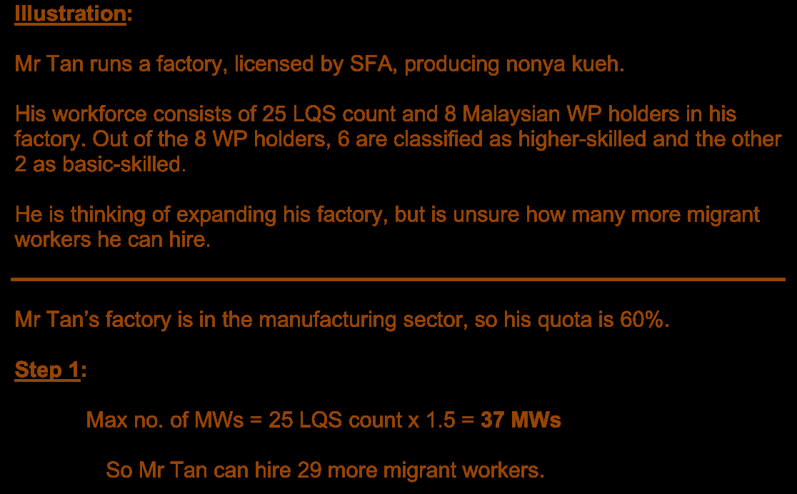

## Page 8

Guidelines for employers of Work Permit (WP) and S Pass holders **How to calculate your quota and levy bill** Updated 1 July 2026 

**___________________________________________________** 

##### **Step 2: Calculate your total workforce** 

Your total workforce = LQS count (based on the average of three months’ declared <u>salaries and CPF contributions) + WP holders + S Pass holders</u> 

**Do not** include Employment Pass (EP) holders in the total workforce calculation. 

**<u>Illustration:</u>** 

In addition to his 25 LQS count and 8 WP holders, Mr Tan now receives approval for 6 additional WP holders from Malaysia. He intends to bring in the 6 newly approved workers, i.e. in-principle approval (IPA) holders on 1 Mar 2022 to complete the issuance of the work permits. 

**<u>Step 2:</u>** 

His total workforce = 25 LQS count + 8 WP holders = **33** 

_The 6 IPA holders who have not had their work permits issued are not counted in the total workforce._ 

8

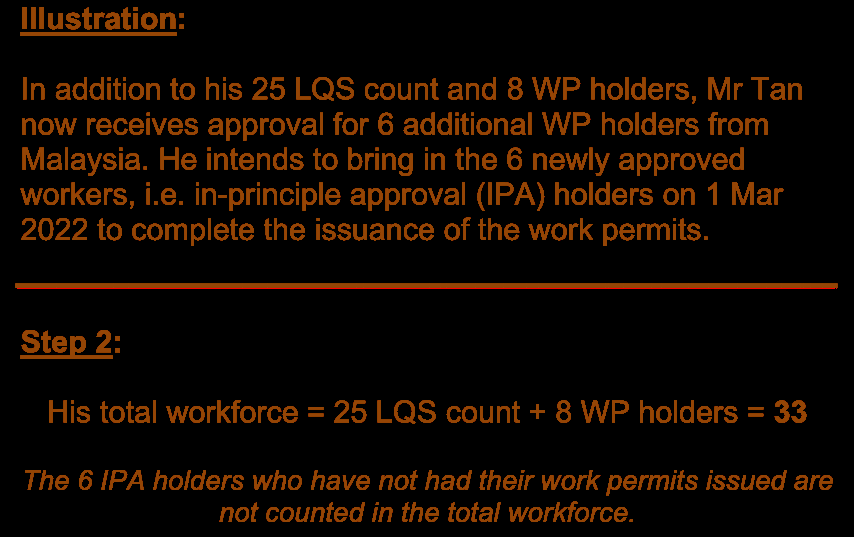

## Page 9

Guidelines for employers of Work Permit (WP) and S Pass holders **How to calculate your quota and levy bill** Updated 1 July 2026 

**___________________________________________________** 

##### **Step 3: Calculate the number of S Pass holders you can hire** 

The S Pass quota is 10% for the services sector, and 15% for the other sectors. This refers to the percentage of your total workforce that can be S Pass holders, and is counted within your total quota for migrant workers (max no. of MWs). 

**Note:** Round the S Pass quota figure down to the nearest whole number. 

**<u>Illustration:</u>** 

Mr Tan is thinking of hiring supervisors on S Pass to manage his operations. How many S Pass holders can he hire? 

**<u>Step 3:</u>** 

a) **10 Feb 2022** – Before he has issued the work permits for the 6 newly approved Malaysian workers. 

Mr Tan’s total workforce = 25 LQS + 8 WP holders* = **33** 

S Pass quota = 15% x (total workforce [33] + 1) = **5 S Passes** (rounded down 

to the nearest whole no.) 

_*The 6 IPA holders who have not had their work permits issued are not counted in the total workforce._ 

At this point, Mr Tan has sufficient quota to hire 5 S Pass workers. 

b) **10 Mar 2022** – After he has issued the work permits to the 6 Malaysian workers. 

Mr Tan’s total workforce = 25 LQS + 14 WP holders# = **39** S Pass quota = 15% x (total workforce [39] + 1) = **6 S Passes** 

_#The 6 IPA holders have been counted into the total workforce after their work permits are issued._ 

After the issuance of the work permits for his 6 approved Malaysian workers, Mr Tan has sufficient quota to hire 6 S Pass workers. 

Construction, Process, Manufacturing and Marine shipyard sectors: **<u>Why do we add 1?</u>** S Pass quota = 15% x (total workforce + 1) We add 1 to take into account the prospective Services sector: candidate. S Pass quota = 10% x (total workforce + 1) 

9

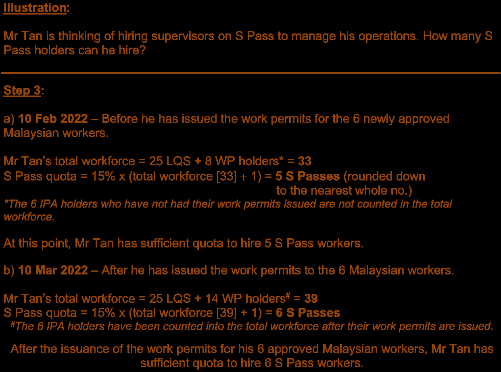

## Page 10

Guidelines for employers of Work Permit (WP) and S Pass holders **How to calculate your quota and levy bill** Updated 1 July 2026 

**___________________________________________________** 

**For manufacturing and services sectors only** 

##### **Step 4: Calculate the number of PRC and/or Non-Traditional Sources (NTS) Occupation List (NTS-OL) WP holders you can hire** 

For the manufacturing and services sectors, the WP quota for workers from the 

People’s Republic of China (PRC) and Non-Traditional Sources (NTS) are as follows: 

|**Quota**|**Manufacturing sector**|**Services sector**|
|---|---|---|
|**PRC**|25% x (total workforce + 1)|8% x (total workforce + 1)|
|**NTS-OL**|8% x (total work|force + 1)|

**Note:** Round the PRC or NTS quota figure down to the nearest whole number. 

**<u>Illustration:</u>** 

Mr Tan hired all 6 S Pass holders and now plans to hire some PRC and/or NTS workers as he finds it difficult to recruit Malaysians. How many PRC and/or NTS WP holders can he hire? 

###### **<u>Step 4:</u>** 

**PRC quota** for manufacturing sector = 25% x (total workforce [45] + 1) = **11** (rounded down to the nearest whole no.) 

**NTS quota** for manufacturing sector = 8% x (total workforce [45] + 1) **= 3** (rounded down to the nearest whole no.) 

10

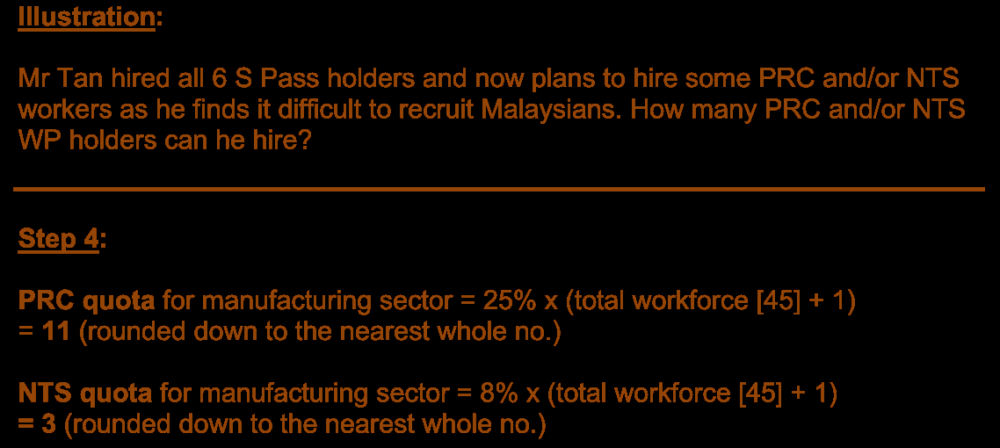

## Page 11

Guidelines for employers of Work Permit (WP) and S Pass holders **How to calculate your quota and levy bill** Updated 1 July 2026 

**___________________________________________________** 

###### **For manufacturing and services sectors only** 

##### **Step 5: Calculate the number of MWs under each levy tier** 

Use this table to calculate the number of MWs under each levy tier. Remember to round the figures down to the nearest whole numbers. There are no levy tiers for the construction, process and marine shipyard sectors. 

|**Levy tiers**|**Manufacturing sector**|**Services sector**|
|---|---|---|
|**Tier 1**|T1= 25% x total workforce|T1= 10% x total workforce|
|**Tier 2**|T2= (50% x total workforce) – T1|T2= (25% x total workforce) – T1|
|**Tier 3**|T3= No. of MWs – T1– T2|T3= No. of MWs – T1– T2|

We assign your MWs in the various tiers based on this order: 

**1****st** **:** S Pass holders 

**2****nd** **:** Higher-skilled WP holders 

**3****rd** **:** Basic-skilled WP holders 

**<u>Illustration:</u>** 

In the end, Mr Tan managed to hire another 6 S Passes, 11 PRC basic-skilled WP holders. At this stage, Mr Tan’s total workforce of 56 employees consists of: 

✓ 25 LQS count ✓ 6 S Passes ✓ 8 Malaysian higher-skilled WP holders ✓ 6 Malaysian basic-skilled WP holders 

✓ 11 PRC basic-skilled WP holders 

Mr Tan now wants to calculate the number of MWs under each levy tier to work out his levy bill for the month. 

**<u>Step 5:</u>** T1 =  25% x 56 = 14 T2= (50% x 56) – 14 = 14 T3 =  31 MWs – 14 – 14 = 3 

11

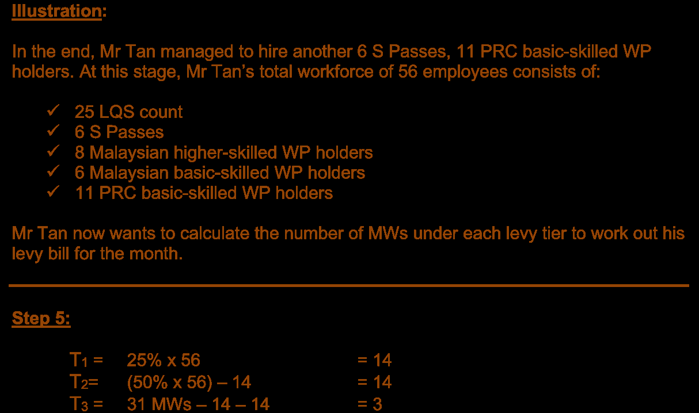

## Page 12

Guidelines for employers of Work Permit (WP) and S Pass holders **How to calculate your quota and levy bill** Updated 1 July 2026 

**___________________________________________________** 

##### **Step 6: Calculate your levy bill** 

Multiply the number of workers in each tier by the levy rate: 

|**Levy tier**|**Levy bill**|**for each tier**|**Total levy bill**|
|---|---|---|---|
|**Tier 1**|T1x|= Levy for Tier 1|Total levy bill =|
||Tier 1 levy rate||Levy for Tier 1 +|
|**Tier 2**|T2x Tier 2 levy rate|= Levy for Tier 2|Levy for Tier 2 + Levy for Tier 3|
|**Tier 3**|T3x Tier 3 levy rate|= Levy for Tier 3||

These illustrations assume that all your migrant workers are employed for a full month. Your actual levy bill takes into account any migrant workers who are employed for less than a month (new workers or those who left). You will only be charged levy for the days they were employed. 

**<u>Step 6:</u>** T1 = 14 =      6 S Pass              +      8 Malaysian higher-skilled WPs = $5,900 ($650 X 6)                                      ($250 X 8) T2 = 14 =      6 Malaysian basic-skilled WPs + 8 PRC basic-skilled WPs = $6,580 ($470 X 6)                                    ($470 X 8) T3 = 3 =        3 PRC basic-skilled WP = $1,950 ($650 X 3) **Mr Tan’s total levy bill for the month = $5,900 + $6,580 + $1,950 = $14,430** 

12

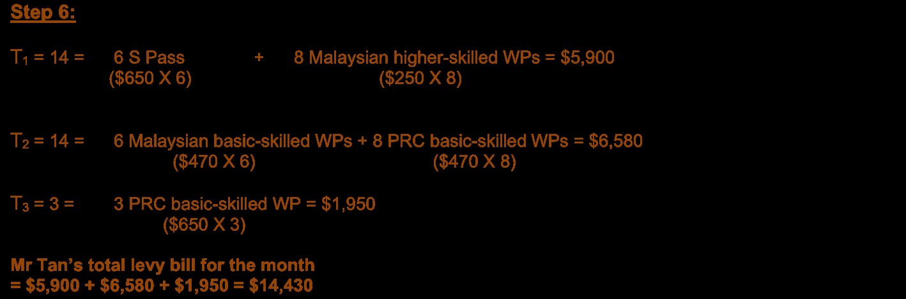

## Page 13

Guidelines for employers of Work Permit (WP) and S Pass holders **How to calculate your quota and levy bill** Updated 1 July 2026 

**___________________________________________________** 

#### **How changes in your business operations can affect your quota** 

Due to the popularity of his nonya kueh, Mr Tan plans to open a café. He wants to move 5 of his local employees and some of his migrant workers to run his new café. How will this affect his quota? 

###### **<u>Step 1: Calculate max no. of MWs</u>** 

Mr Tan’s new café will be classified under the services sector. He will not be able to use his manufacturing quota and needs to apply for a 2nd CPF account. 

For his café: Max no. of MWs     = 5 LQS count x 0.538462 = **<u>3 MWs</u>** For his factory: Max no. of MWs = 20 LQS count x 1.5 = **<u>30 MWs</u>** 

By transferring 5 of his local factory employees to the café, instead of the previous entitlement of 37 MWs, he will now only be able to employ 30 MWs in his factory. 

Mr Tan decides to proceed with his plan. He transfers 5 local employees and 3 Malaysian WP holders from the factory to the café. He also hired an additional 2 locals who met the LQS for his café. The remaining 20 local employees and 28 migrant workers continue to work in the factory. 

###### **<u>Step 2: Calculate the total workforce</u>** 

For his café:   Total workforce = 7 LQS count + 3 WPs = **10** (at max quota of 3 MWs) 

For his factory:  Total workforce = 20 LQS count + 6 S Pass + 22 WPs = **48** (below max quota of 30 MWs) 

###### **Important:** 

Even though Mr Tan owns the café and factory, he **cannot combine** the total workforce of both businesses to calculate his quota. This is because the café and factory belong to different sectors with different quotas. 

13

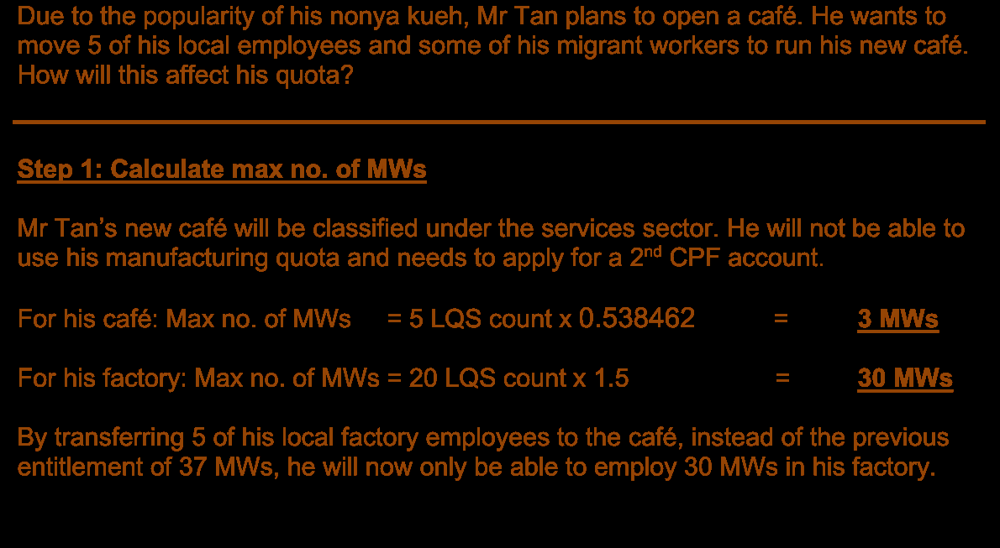

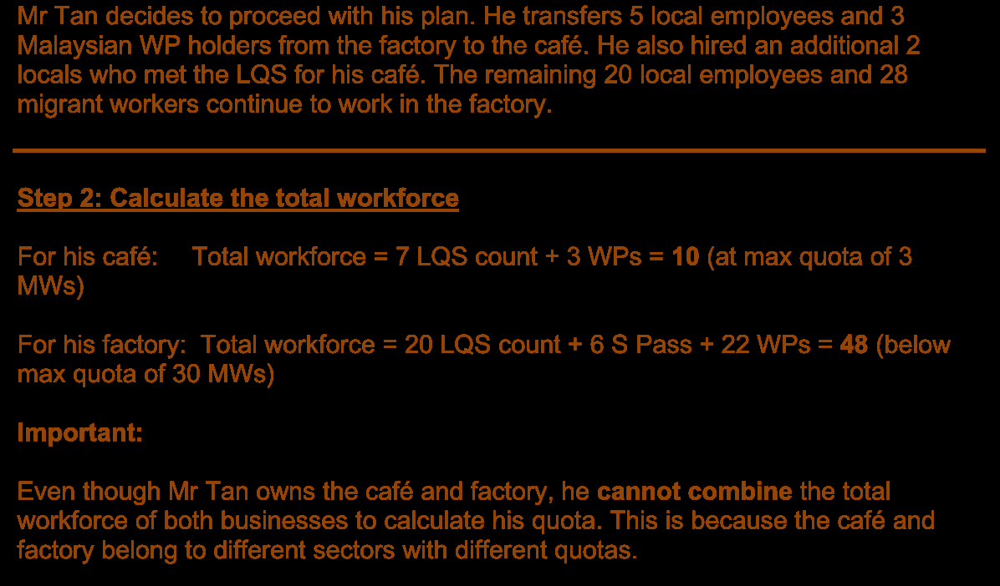

## Page 14

Guidelines for employers of Work Permit (WP) and S Pass holders **How to calculate your quota and levy bill** Updated 1 July 2026 

**___________________________________________________** 

With the transfers, Mr Tan wants to find out whether his factory has the quota to continue employing his 6 S Pass supervisors and the 11 PRC WP holders. 

**<u>Step 3: Calculate S Pass quota</u>** For his café:     S Pass quota = 0 

For his factory: S Pass quota = 15% X (total workforce [48]) = **7 S Passes** 

Mr Tan still has the S Pass quota to continue employing his S pass holders in his factory. Mr Tan cannot hire an S Pass holder for his cafe as he has already reached the maximum quota of 3 migrant workers. 

**<u>Step 4: Calculate PRC quota</u>** For his café:     PRC quota = 0 

For his factory: PRC quota = 25% x (total workforce [48]) = **12 PRC WPs** 

Mr Tan still has the PRC quota to continue employing his 11 PRC WP holders in his factory. However, he cannot hire a PRC WP holder for his café, as he does not have the PRC quota and has already reached the maximum quota of 3 migrant workers. 

Workforce for his **café:** ✓ 7 LQS count ✓ 3 Malaysian higher-skilled WP holders Total workforce = 10 

**<u>Step 5: Calculate the no. of MWs under each tier</u>** 

T1 = 10% x total workforce [10]                 = 1 T2 = (25% x total workforce [10]) – T1 [0]  = 1 T3 = No. of MWs [3] – T1 [0] – T2 [2]          = 1 

**<u>Step 6: Calculate levy bill</u>** 

T1 = 1 = 1 Malaysian higher-skilled WP = $300 T2 = 1 = 1 Malaysian higher-skilled WP = $400 T3 = 1 = 1 Malaysian higher-skilled WP = $600 

**Café’s levy bill for the month = $300 + $400 + $600 = $1,300** 

14

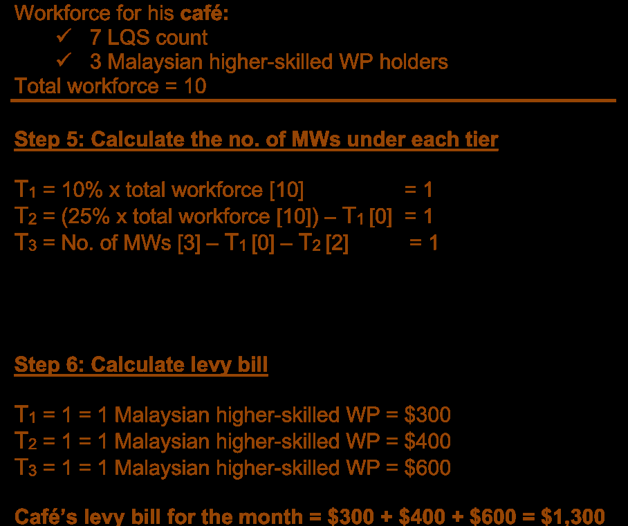

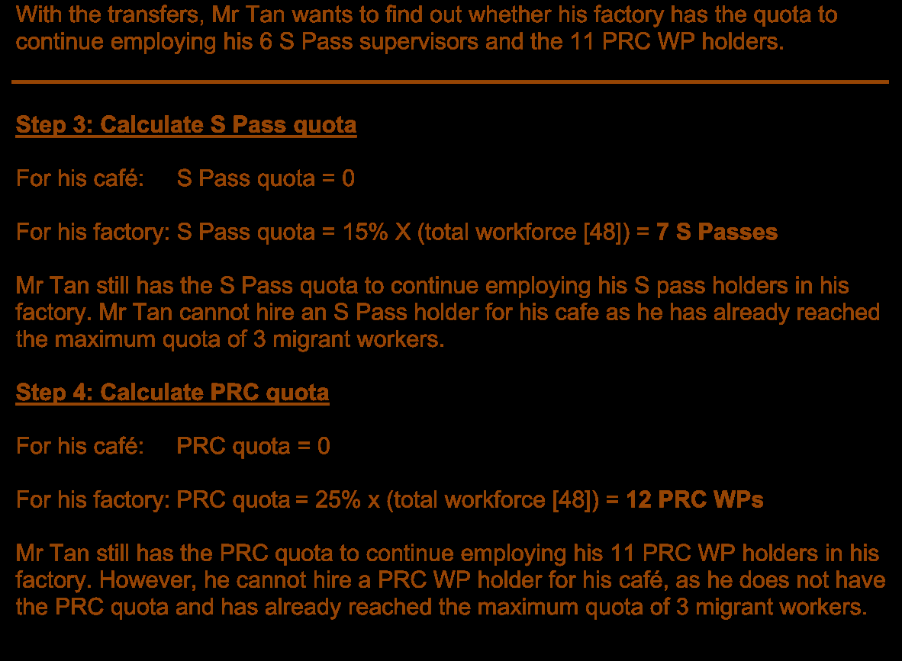

## Page 15

Guidelines for employers of Work Permit (WP) and S Pass holders **How to calculate your quota and levy bill** Updated 1 July 2026 

### **___________________________________________________** 

- Workforce for his **factory** : ✓ 20 LQS count ✓ 6 S Passes ✓ 5 Malaysian higher-skilled WP holders ✓ 6 Malaysian basic-skilled WP holders ✓ 11 PRC basic-skilled WP holders 

- Total workforce = 48 

**<u>Step 5: Calculate the no. of MWs under each tier</u>** 

T1 = 25% x total workforce [48] = 12 T2 = (50% x total workforce [48]) – T1 [12] = 12 T3 = No. of MWs [28] – T1 [12] – T2 [12]  = 4 

**<u>Steps 6: Calculate levy bill</u>** 

T1 = 12 =   6 S Passes + 5 Malaysian higher-skilled WP + 1 Malaysian basic-skilled WP ($650 X 6)              ($250 x 5) ($370) = $5,520 T2 = 12 = 4 Malaysian basic-skilled WPs + 8 PRC basic-skilled WPs ($350 x 4) ($470 x 8) = $5,160 T3 = 4 = 4 PRC basic-skilled WPs ($650 X 4) = $2,600 **Factory’s levy bill for the month = $5,520 + $5,160 + $2,600 = $13,280** 

Total levy bill for Mr Tan’s café and factory = $1,300 + $13,280= **<u>$14,580</u>** 

15

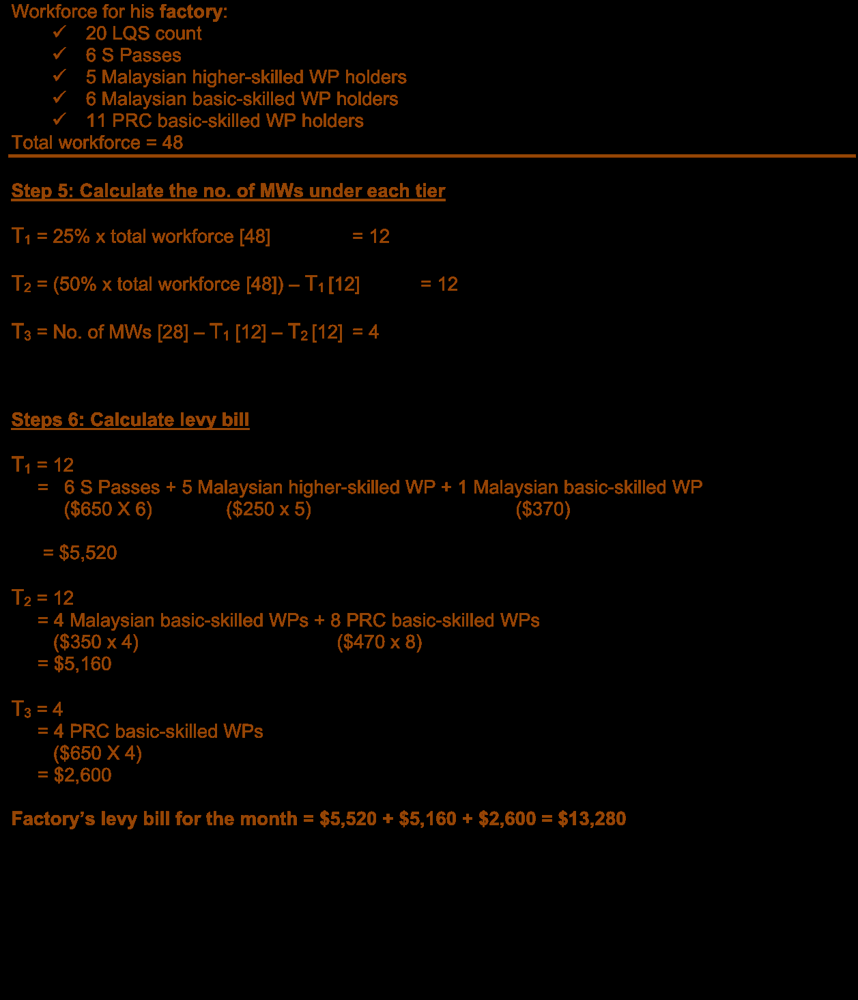

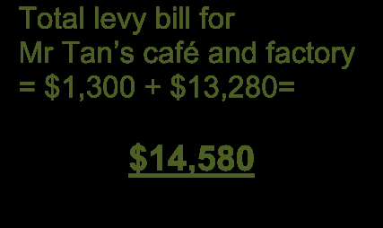

