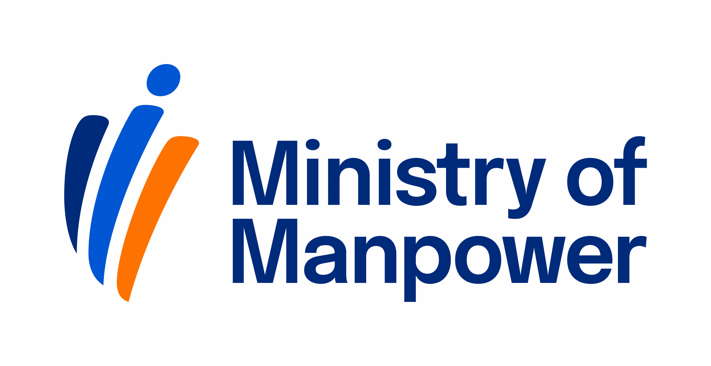

<!-- HCAG:COMPILED id=www.mom.gov.sg.passes-and-permits.work-permit-for-foreign-domestic-worker.apply-for-work-permit -->
---
children: []
content_token_estimate: 27576
descendants: 0
id: www.mom.gov.sg.passes-and-permits.work-permit-for-foreign-domestic-worker.apply-for-work-permit
image_urls: {}
kind: leaf
long_description: 'Provides the end-to-end application process for an MDW Work Permit
  in Singapore: who can apply (employer, sponsor, or employment agency), the two submission
  channels (FDW eService via Singpass with ~1-week processing, or online application
  form with ~3-week processing), required information, the $35 application and $35
  issuance fees, and what to do after in-principle approval (IPA) is received. Covers
  pre-arrival steps (security bond, insurance, SIP registration for first-time helpers),
  post-arrival steps (SIP within 7 days, medical exam within 14 days), Work Permit
  issuance and card delivery procedures, fingerprint/photo registration at MOM Services
  Centre, SGWorkPass digital pass setup, and card collection after failed delivery.
  Also includes detailed FAQs on the 2-step authorisation process for employment agencies
  using the FDW eService (effective 1 Jul 2021), covering how agencies request employer
  authorisation via Singpass, the 7-day response window, 14-day transaction completion
  deadlines, transfer consent procedures, and transitional rules for pre-1 Jul 2021
  applications.'
source_files:
- index.md
- faq-2fa.md
- ea-infographic.md
- fdw-appln-form.md
- ea-infographic-2.md
- faq-2fa-2.md
- fdw-appln-form-2.md
source_urls:
- ''
- ''
- ''
- ''
- ''
- ''
- ''
subtree_depth: 0
title: How to apply for a Work Permit for a migrant domestic worker (MDW)
token_size_estimate: 27576
---

# How to apply for a Work Permit for a migrant domestic worker (MDW)

<!-- HCAG:CONTENT BEGIN -->
## Content

<!-- source: index.md -->
# Apply for a Work Permit for migrant domestic worker (MDW)

PH pay, COMPASS, Primary Care Plan, myMOM Portal, paying salary, annual leave

# 
        Apply for a Work Permit for migrant domestic worker (MDW)
    

You can apply for a Work Permit for an MDW either on your own or through an [employment agency](https://www.mom.gov.sg/employment-agencies). You also need to take certain steps to prepare for your MDW's arrival.

 
 
**Already know the process?** [Log in to apply online](https://www.mom.gov.sg/eservices/services/work-permit-transactions-for-domestic-helpers-and-confinement-nannies).

## At a glance

| Who can apply | Employer, sponsor or authorised employment agent (EA). | 
|---|---|
| How much it costs |  When you submit the application: When you get the pass issued: | 
| How long it takes |  FDW eService: within 1 week, unless more information is required. Application form: within 3 weeks for most cases. | 
| Related eServices | [more eServices and forms](https://www.mom.gov.sg/passes-and-permits/work-permit-for-foreign-domestic-worker/eservices-and-forms) | 

**Note:**

- Check with the helper's embassy on whether there are additional requirements for her to leave her country/region (e.g. visa or overseas government letter).
- If you are hiring a **second helper** , you need to meet[the criteria](https://www.mom.gov.sg/passes-and-permits/work-permit-for-foreign-domestic-worker/eligibility-and-requirements/employer-requirements#hiring-a-second-FDW) .
- If you are hiring a **transfer helper** , find out[what you need to do](https://www.mom.gov.sg/passes-and-permits/work-permit-for-foreign-domestic-worker/transfer-to-a-new-employer) .
- If you are married, you and your spouse can combine your incomes when applying for a Work Permit.
- Low-income employers or senior citizens living alone may be able to [apply under a special scheme](https://www.mom.gov.sg/passes-and-permits/work-permit-for-foreign-domestic-worker/apply-under-a-special-scheme) or[using personal savings](https://www.mom.gov.sg/faq/work-permit-for-fdw/can-i-employ-an-fdw-if-i-dont-have-any-income) .
- You can consider [part-time help with household chores](https://www.mom.gov.sg/faq/work-permit-for-foreign-worker/what-is-household-services-scheme) as an alternative to hiring a helper.
- If there are children in your household below 7 years old who are not fully vaccinated against measles, you must ensure that your helper has [immunity against measles](https://www.mom.gov.sg/newsroom/press-releases/2025/0610-mandatory-measles-immunity-requirement-MDWs) .
- **Additional step for employment agencies:** Please get the employer’s authorisation using our[FDW eService](https://www.mom.gov.sg/eservices/services/work-permit-transactions-for-domestic-helpers-and-confinement-nannies)**before you can perform any transactions for them** . For more details, you can refer to[our FAQs](https://www.mom.gov.sg/-/media/mom/documents/work-passes-and-permits/faq-2fa.pdf) and[infographic](https://www.mom.gov.sg/-/media/mom/documents/work-passes-and-permits/ea-infographic.pdf) .

## How to apply

Employers with Singpass and employment agencies can apply using the [FDW eService](https://www.mom.gov.sg/eservices/services/work-permit-transactions-for-domestic-helpers-and-confinement-nannies) for a faster outcome.

Otherwise, you can submit an application form online.

### Submit using the FDW eService

*Processing time: within 1 week. Some cases will take more time.*

You will need this information for applying:

- Helper’s passport details
- Your and your family members’ personal particulars
- Your income information

To submit an application:

1. [Get a written consent from the helper](https://www.mom.gov.sg/faq/work-pass-general/why-must-i-get-a-foreigners-written-consent-before-applying-for-a-work-pass-for-them) to apply for a Work Permit.
2. [Log in to fill up the application](https://www.mom.gov.sg/eservices/services/work-permit-transactions-for-domestic-helpers-and-confinement-nannies) .
3. Pay $35 for each application. You can pay by Visa, Mastercard or PayNow.
4. [Log in to check the status of your application](https://www.mom.gov.sg/eservices/services/work-permit-transactions-for-domestic-helpers-and-confinement-nannies) after 1 week.

It takes about **1 week** to process the application. It may take longer if additional information is required. We will email you the application outcome.

This option is 

**only** for employers who cannot log in to our 

[FDW eService](https://www.mom.gov.sg/eservices/services/work-permit-transactions-for-domestic-helpers-and-confinement-nannies)
 to submit a Work Permit application as they 

**do not have a Singpass**
.

Employment agents are **not allowed** to use this option and must use our [FDW eService](https://www.mom.gov.sg/eservices/services/work-permit-transactions-for-domestic-helpers-and-confinement-nannies) to submit all applications.

 
*Processing time: within 3 weeks. Some cases will take more time.*

To submit:

1. [Get a written consent from the helper](https://www.mom.gov.sg/faq/work-pass-general/why-must-i-get-a-foreigners-written-consent-before-applying-for-a-work-pass-for-them)  to apply for a Work Permit.
2. Download the [Work Permit application form (for online submission)](https://www.mom.gov.sg/-/media/mom/documents/services-forms/passes/fdw-appln-form.pdf) .
3. Complete the application form in soft copy. Do not print the form.
4. Submit the following application documents and pay the **$35 application fee** by[PayNow](https://www.abs.org.sg/consumer-banking/pay-now) , Visa, Mastercard or Amex using[our online form](https://go.gov.sg/submit-fdw-form) .
   - Completed application form
  - Supporting documents listed in the application form

It takes around **3 weeks** to process the application. It may take longer if additional information is required. We will email you the application outcome.

  
**If your application is approved**

We will email the in-principle approval (IPA) letter and declaration forms for you and your helper to sign.

Send your helper her copy of the IPA. She needs it to enter Singapore. If she needs more time to arrive, use our [FDW eService](https://www.mom.gov.sg/eservices/services/work-permit-transactions-for-domestic-helpers-and-confinement-nannies) to extend her IPA validity. 

Make sure the helper's IPA particulars match her passport details. If you made an error (e.g. helper's name is incorrect), you need to 

[correct the error](https://www.mom.gov.sg/faq/work-pass-general/what-should-i-do-if-there-is-an-error-in-my-worker-passport-details-in-the-ipa)
. Otherwise, the helper will be denied entry into Singapore.

 
You need to complete these steps to prepare for your helper’s arrival in Singapore. 

### Before your helper arrives

| **Role** | **Responsibilities** | 
|---|---|
| Employer | Buy a [security bond](https://www.mom.gov.sg/passes-and-permits/work-permit-for-foreign-domestic-worker/eligibility-and-requirements/security-bond) for a non-Malaysian helper:Please ensure your bank or insurer sends us the security bond details. It takes up to **3 working days** . If your bank or insurer asks for your helper’s Foreign Identification Number (FIN), you can find it on her in-principle approval letter. For new helpers, the FIN will be assigned within 3 working days after the Work Permit application is approved. The security bond must also **take effect when she arrives** . Otherwise, the immigration officer will**not** allow her to enter. We are unable to change the security bond effective date to allow her to enter Singapore, and you will have to send her home immediately. Buy [medical and personal accident insurance](https://www.mom.gov.sg/passes-and-permits/work-permit-for-foreign-domestic-worker/eligibility-and-requirements/insurance-requirements) for her. (Only for [first-time helpers](https://www.mom.gov.sg/passes-and-permits/work-permit-for-foreign-domestic-worker/eligibility-and-requirements/fdw-eligibility#criteria-for-first-time-helpers) ) Register her for the[Settling-In Programme (SIP)](https://www.mom.gov.sg/passes-and-permits/work-permit-for-foreign-domestic-worker/eligibility-and-requirements/settling-in-programme-sip) . | 
| Helper | Print the in-principle approval (IPA) letter. She will need to show the IPA letter to the immigration officer upon arrival. Ensure that she complies with the [latest travel requirements](https://www.ica.gov.sg/enter-transit-depart/entering-singapore) . | 

### After your helper arrives

You need to:

1. (Only for [first-time helpers](https://www.mom.gov.sg/passes-and-permits/work-permit-for-foreign-domestic-worker/eligibility-and-requirements/fdw-eligibility#criteria-for-first-time-helpers) ) Send her for the SIP**within 7 days** , excluding Sunday and public holidays.
2. (For all helpers) Send her for a [medical examination](https://www.mom.gov.sg/passes-and-permits/work-permit-for-foreign-domestic-worker/eligibility-and-requirements/medical-examination) **within 14 days** .

 
*When: Within 2 weeks from helper's arrival* 

*Processing time: Immediate*

To get the Work Permit issued:

1. [Log in to make the request](https://www.mom.gov.sg/eservices/services/work-permit-transactions-for-domestic-helpers-and-confinement-nannies) .
2. Provide a home or office address where the card will be delivered.
3. Nominate **up to 3 authorised recipients** to receive the card, and provide their NRIC, FIN or passport number, mobile numbers and email address.
4. Pay $35 by Visa, Mastercard or PayNow for each Work Permit issued.
5. After the Work Permit is issued, **print the Temporary Work Permit** .

During issuance, you can apply for your helper to get a 

[POSB account](https://www.posb.com.sg/personal/deposits/for-foreigners/posb-payroll-account)
 to receive salary.

The Temporary Work Permit:

- Is **valid for 1 month** from the date of issue.[Request to extend the validity](https://go.gov.sg/change-date-wpcr) if you have a change of travel plans.
- Must be given to your helper. It allows her to work, stay, and travel in and out of Singapore while waiting for the Work Permit card.
- States if your helper needs to register her fingerprints and photo at [MOM Services Centre](https://www.mom.gov.sg/contact-us/locations) .

 
## (If required) Register fingerprints and photo

Show

*When: Within 1 week after pass is issued (if required)*

Check the Temporary Work Permit for whether your helper needs to register her fingerprints and photo at [MOM Services Centre – Hall C](https://www.mom.gov.sg/contact-us/locations). If it is required, your helper needs to register **within 1 week** of issuing the Work Permit.

You must [make an appointment](https://www.mom.gov.sg/eservices/services/make-an-appointment) for your helper to register. It is optional for you to accompany your helper for the appointment.

For the appointment, your helper should bring:

- Original passport
- Appointment letter
- Temporary Work Permit
- Her mobile phone (with local mobile number) with both Singpass and [SGWorkPass](https://www.mom.gov.sg/eservices/sgworkpass) apps downloaded

During registration, we will capture the her fingerprints, take her photo and register her for a Singpass account. We will also help the her set up the Singpass and SGWorkPass app on her mobile phone. 

 
 

*When: On the day of card registration*

After she is registered for a Singpass account, inform your helper to:

1. Download [SGWorkPass](https://www.mom.gov.sg/eservices/sgworkpass) (if they have not done so yet)
2. Log into the app with their Singpass
3. View their digital work pass and employment information

SGWorkPass app allows her easy and secure access to her digital work pass. She can check her status, expiry date and procure services earlier, without having to wait for delivery of her physical work pass card.

If your helper is not required to report to MOMSC for card registration, please guide them to set up their digital work pass.

 

 
*When: Within 5 working days after registration or document verification*

We will deliver the Work Permit card to the given address within **5 working days** after your helper registers and has her documents verified. If your helper does not need to register, we will deliver the card within 5 working days after verifying her documents.

Guide your helper to set up her 

[SGWorkPass](https://www.mom.gov.sg/eservices/sgworkpass)
 app to view her digital work pass and employment information.

The authorised recipients will get an SMS or email with the delivery details at least 1 working day before delivery.

When collecting the card, you will need to show these documents for identification:

| Person receiving the card | Required documents | 
|---|---|
| Helper | Passport or digital work pass | 
| Authorised person | NRIC, FIN or passport | 

 If you do not receive the card within 5 working days, [check if you have uploaded the correct documents](https://www.mom.gov.sg/faq/work-pass-general/ive-registered-for-my-card-but-mom-has-not-yet-contacted-me-about-the-card-delivery-date-what-should-i-do).

You can also check your card delivery status using [WP Online](https://www.mom.gov.sg/eservices/services/wp-online-for-employers-of-fdws).

### If card delivery fails

After two unsuccessful card delivery attempts, you’ll have to collect the card at the service desk of [MOM Services Centre – Hall C](https://www.mom.gov.sg/contact-us/locations).

You can collect it **3 working days** after the second attempted delivery. You don't need an appointment for collection. You can also authorise a representative or employment agent to collect the card on your behalf.

Bring along these documents for card collection:

- Helper's original passport or digital work pass
- Temporary Work Permit

If you authorise someone to collect it on your behalf, make sure they bring these along:

- An authorisation letter from the employer
- NRIC or passport for verification
- Helper's original passport
- Temporary Work Permit

<!-- source: faq-2fa.md -->
## Page 1

# **FAQs on 2‐Step Authorisation Process for FDW eService** 

- **Q1 Why is there a change in the authorisation process?** A1 We have tightened the process to give both employers and employment agencies a better user experience, deter unauthorised transactions and safeguard employers’ personal particulars. This new process also removes the need for employment agencies to keep the hard copy authorisation forms. 

- **Q2 When the new authorisation process is implemented, can I still use the hard copy authorisation form?** 

- A2 No, for any FDW eService transactions performed **from 1 Jul 2021** , the employer must log in to our FDW eService to authorise your agency **before you can proceed with the transaction** . This also applies to employers who had signed the hard copy authorisation forms previously. You are **only allowed** to use the hard copy authorisation form if the employer cannot log in for the authorisation (e.g. is medically incapacitated, imprisoned or has passed away). You will be asked to provide a reason why the employer cannot log in. Depending on the reason given, we may ask for the signed authorisation form for verification. If required, we will email both the employer and you to request for the authorisation form. Either the employer or you can email us the form. We will need to verify the form submitted, which may take **up to 14 days** , before you can proceed with the transaction. 

- **Q3 How do I request for the employer’s authorisation?** A3 Complete these steps to get the employer’s authorisation: 1. Log in to our FDW eService. 2. Search for the employer using their NRIC number/FIN and Date of Birth. 3. Select the type of transaction you will be performing for the employer (e.g. apply for a Work Permit). 

- 4. Choose one of these options for the employer to log in for the authorisation:  If the employer is physically present with you, select the option for them to log in directly to the FDW eService after you click Continue. They can then log in using the link or QR code generated on your computer screen for the authorisation immediately. 

- Alternatively, select the authorisation email option and enter the employer’s email address. The login link will be sent to the employer. 

The employer must respond to the authorisation request **within 7 days** . Otherwise, the request will lapse and you will need to send a new one. 

Once the employer has responded, you will be notified by email. You can also use your agency’s dashboard to view the list of outstanding and approved authorisation requests. 

**Note:** Employers must have a Singpass to log in for the authorisation. Please ask your clients to <u>register for a Singpass, if they do not have one,</u> **at least 7 days before** transacting for them.

## Page 2

If the employer has difficulties with the Singpass registration, you can help them with it. Alternatively, for employers whose helpers are approved under the Sponsorship Scheme, the sponsors can also log in to authorise your agency on the employers’ behalf. 

|**Q4**|**Once the employer has logged in to authorise** **transaction?**|**my agency, how long will I have to complete the**|
|---|---|---|
|A4|In general, you must complete transactions**wi** will lapse and you will need to request for it ag|**thin 14 days**. Otherwise, the employer’s authorisation ain.|
||However, for certain transactions you can still date will be specified in the respective transac|perform them beyond the 14‐day period. The exact due tion emails sent.|
||**Transactions you must complete within 14** **days from authorisation**|**Transactions you can perform beyond the 14‐day** **period**|
|| Apply for a Work Permit  Renew a Work Permit  Cancel a Work Permit  Extend Special Pass  Reinstate a Work Permit  Amend particulars for employer or helper| Appeal for rejected application  Request for or extend confinement nanny’s Temporary Permit  Request for a handover  Extend the In‐Principle Approval validity  Issue a Work Permit  Upload supporting documents requested|

**Q5 A helper approached my agency to transfer her to another employer. Her current employer is not my client. What are the steps I need to take? How long do I have to find her a new employer?** 

- **Q5 From 1 Jul 2021** , you need to complete these steps: 

   1. Notify the current employer of the helper’s intention to be transferred. 

   2. Get the current employer’s agreement on the transfer and email address. 

   3. Inform the current employer that MOM will send them an email to log in to the FDW eService with Singpass to confirm their consent for the transfer. 

   4. Use our FDW eService to request MOM to send the email to the current employer. 

Once the current employer has logged in to confirm their consent, you will be notified by email. You can then proceed to find the helper a new employer as long as the current employer does not withdraw the consent. 

|**Q6**|**I applied for a Work Permit before 1 Jul 2021** **employer need to log in to authorise my age**|**, but am getting it issued from 1 Jul 2021. Does the** **ncy before I can proceed with the issuance?**|
|---|---|---|
|A6|If you performed a transaction before 1 Jul 20 2021, the employer does not need to log in to|21, and are doing a**follow‐up**transaction from 1 Jul authorise your agency.|
||**Transaction performed before 1 Jul 2021**|**You can proceed with any of these follow‐up** **transactions from 1 Jul 2021 using the employer’s** **signed authorisation form obtained earlier on**|
||Applied for a Work Permit| Appeal for rejected application  Request for or extend confinement nanny’s TemporaryPermit|

## Page 3

||| Request for a handover  Extend the In‐Principle Approval validity  Issue a Work Permit|
|---|---|---|
||Issued a Work Permit|Upload supporting documents requested|
||Renewed a Work Permit||
||Amended particulars for employer or helper||
||However, for**any new FDW eService transacti** in to our FDW eService to authorise your agenc also applies to employers who had signed the h|**ons performed from 1 Jul 2021**, the employer must log y**before you can proceed with the transaction**. This ard copy authorisation forms previously.|
|**Q7**|**I’m an agent of ABC Employment Agency. The** **perform transactions. Can I get my colleague t**|**employer has already authorised my agency to** **o transact for the employer?**|
|A7|Yes, you can as long as your colleague is author employer’s authorisation is given to the emplo to a particular individual.|ised by your agency to perform the transactions. The yment agency to perform the transactions. It is not tied|
|**Q8**|**I’m an agent and previously requested for the** **ABC Employment Agency. Can I still transact f**|**employer’s authorisation to transact when I was with** **or the same employer under my new agency?**|
|A8|No, you cannot transact for the employer as th Only EA personnel of that agency can perform|e authorisation was given to ABC Employment Agency. the transactions.|

<!-- source: ea-infographic.md -->
## Page 1

# **Better Security for You** 

<!-- Start of picture text -->
FDW eService <!-- End of picture text -->

**From 1 July 2021** , employers will be better protected when transacting with MOM through third party employment agencies (EAs). Employers who have engaged an EA to apply, renew or cancel an FDW work permit will first need to log in to MOM's <u>FDW e-service</u> to authorise their EAs before their EAs can make any transaction. MOM will no longer accept hard copy authorisation forms. 

Steps for EA and employer to complete the authorisation process: 

**<mark>[ Employment agent ]</mark>** Employer’s NRIC or FIN Date of Birth Log in to FDW eService and search for the **STEP 1** employer using their NRIC number/FIN and Date of Birth. 

## **<mark>[ Employment agent ]</mark>** 

<!-- Start of picture text -->
Transaction Type (Check all that applies) Apply and issue Work Permit Amend particulars Extend Special Pass Transfer helper <!-- End of picture text -->

Select the type of transaction you will be **STEP 2** performing for the employer. 

## **<mark>[ Employment agent ]</mark>** 

<!-- Start of picture text -->
Employer will log in with Singpass to give authorisation By using the FDW eService. By responding to the email that MOM will send to the employer's email address below: Continue Choose one of the options for the employer STEP 3 to log in for the authorisation. <!-- End of picture text -->

## **<mark>[ Employer ]</mark>** 

Requests from employment agencies I do not authorise any of the employment agencies to view my details and perform the transaction. I authorise any of the employment agencies to view my details and perform the transaction. If your EA has told MOM that you will **STEP 4** respond via email, you will receive an email. Please login to approve or reject **within 7 days** . If there is no response, your EA will not be able to transact for you. 

### IMPORTANT: 

- Employers must have a Singpass to log in for the authorisation. Please register for a Singpass, if you do not have one. If you need help with this, you can approach your family member or agent. 

- Alternatively, for employers whose helpers are approved under the Sponsorship Scheme, their sponsors can also log in to authorise the EA to transact on their behalf.

<!-- source: fdw-appln-form.md -->
## Page 1

Updated on 15 Jun 2026 

. is related to the Employer. is a male. 

Employer has been diagnosed with Alzheimer, Dementia or Schizophrenia. 

Web https://www.mom.gov.sg Contact us https://www.mom.gov.sg/contact 

Page 1 of 1

## Page 2

This form may take 15 minutes to fill in 

Download and fill in the application form in soft copy 

Upload the completed application, supporting documents and pay the application fee using our online form. You can pay by PayNow, Visa, Mastercard or Amex. See Page 18. 

You will need documents in PDF or JPG format for **Step 2.** 

Non-English documents must be accompanied by an English translation. The translation can be done by a translation service provi ~~d~~ er 

- Documents to prove the income of the Employer and Spouse (if any) (e.g. IRAS Notice of Assessments (NOAs), CPF statements or overseas income tax statements). Alternatively, the Employer can give consent to allow us to verify the income directly with IRAS on Page . 

- Personal particulars page of the ’s passport. If there are any amendments to the particulars (e.g. name or expiry date), please include the pages confirming them. 

If you are applying under the Sponsorship or Joint Income scheme, you also need to upload these documents: 

|Additional |
|---|
|documents |
|required|

Web https://www.mom.gov.sg Contact us https://www.mom.gov.sg/contact 

Page 2 of 1

## Page 3

The Employer’s income is one of the main ways we assess applications. Employers with low or no income can apply under the special scheme if they, their Sponsors and Joint applicants are all Singapore citizens or Singapore permanent residents. 

Child Parent Sibling 

Web https://www.mom.gov.sg Contact us https://www.mom.gov.sg/contact 

Page 3 of 1

## Page 4

|Fill in the forminsoft copy|
|---|
|**This form is only for employers who are unable to submit an online application as they do not have** **a Singpass.**|
|**If you are an employment agent, do not proceed with this application. Please submit the** **application using our FDW eService (www.mom.gov.sg/fdw-eservices) with your employment** **agency’s account.**|
|**Declaration of employer’s intent:** **If there is a child below 7 years old in my household who is not fully vaccinated against** **measles, I will ensure that my helper meets the measles immunity requirement.** **I confirm that I am applying to be the employer of the helper in this application. I am not an** **employment agent, and am not making this application through an employment agency.** **I confirm that I understand that the information provided in the application form is true and** **correct, and that the Ministry of Manpower may commence enforcement action against me if I** **have falsely declared any information in this application.**|
|Webhttps://www.mom.gov.sg Contact ushttps://www.mom.gov.sg/contact Page4 of 1|

## Page 5

<!-- Start of picture text -->
Fill in the form in soft copy Type of helper you are applying for: About the helper Name (as on passport): Work Permit number  (if any): FIN (if any): IT'S WORTH KNOWING If the helper has worked or is working in Singapore, please enter her FIN. Passport number:  Passport expiry date: Sex: Current immigration pass type: Date of birth: Nationality/Citizenship: <!-- End of picture text -->

Web https://www.mom.gov.sg Contact us https://www.mom.gov.sg/contact 

Page of 1

## Page 6

|**About the helper** **Country/Region of birth:**|
|---|
|**Religion:** **Ethnic group:**|
|**Does the helper have at least 8 years of formal education? Highest educational level:**|
|(rounded to the nearest dollar): **Monthly salary (S$)**|
|(You must provide the helper at least 1 rest day per month, which cannot be compensated with pay. Assuming 4 weeks in a month, please state the number of rest days where the helper will have the day off.) **Number of rest days per month:**|
|**Expected job scope** (Check all that applies) Note: The employer and helper can mutually agree to change her job scope during the employment. You do not need to inform MOM of this.|
|Webhttps://www.mom.gov.sg Contact ushttps://www.mom.gov.sg/contact Page of 1 **Marital status:**|

## Page 7

<!-- Start of picture text -->
About the Employer Name (as on NRIC or passport): Sex: Date of birth: NRIC number  (if any): FIN  (if any): Passport number:  Passport expiry date: Housing type: Nationality/Citizenship: Residential status: <!-- End of picture text -->

Web https://www.mom.gov.sg Contact us https://www.mom.gov.sg/contact 

Page of 1

## Page 8

<!-- Start of picture text -->
About the Employer Marital status: If the Employer is married, please fill in the marriage and Spouse’s details below: Was the marriage registered in Singapore? Spouse’s name (as on NRIC or passport): Spouse’s sex: Spouse’s date of birth: Spouse’s NRIC number  (if any): Spouse’s FIN  (if any): Passport number:           Passport expiry date: Spouse’s nationality/citizenship: Spouse’s residential status: <!-- End of picture text -->

Web https://www.mom.gov.sg 

Contact us https://www.mom.gov.sg/contact 

Page of 1

## Page 9

**Work Permit application for a** 

# **PART A** 

# **Employer’s contact details** 

**Singapore mobile number:** **~~Email address (for us to send the a~~ pplication outcome):** 

## **Residential address:** 

**Postal code:** 

**For us to assess the Employer’s eligibility for levy concession, please list all the people who are staying in the Employer’s house, excluding the Employer and Spouse. If the Employer is eligible, the concession will take effect automatically.** 

<!-- Start of picture text -->
Date of Name  (as on NRIC or ID type ID number birth Relationship passport) <!-- End of picture text -->

**Ministry of Manpower Work Pass Division** Web https://www.mom.gov.sg Contact us https://www.mom.gov.sg/contact 

Page of

## Page 10

# **Income details:** 

**Please answer either question 1, 2 or 3 to tell us the Employer’s income.** 

**If the Employer is applying under the Sponsorship or Joint Income scheme, please leave this section blank.** 

<!-- Start of picture text -->
1. Employer’s monthly income (S$) <!-- End of picture text -->

(rounded to the nearest dollar): 

**2. Spouse’s monthly income (S$)** 

(rounded to the nearest dollar): 

**3. Combined monthly incomes of Employer and Spouse (S$)** (rounded to the nearest dollar): 

**Has either the Employer or Spouse worked in Singapore for the last 2 years?** 

**Employer’s Singapore tax reference number (e.g. NRIC no./FIN):** 

**Spouse’s Singapore tax reference number (e.g. NRIC no./FIN):** 

Web https://www.mom.gov.sg Contact us https://www.mom.gov.sg/contact 

Page of 1

## Page 11

# **Income details of Sponsor(s)** 

**If the Employer has:** 

**Do not include the Employer’s income.** 

**1. Sponsor’s monthly income (S$)** 

(rounded to the nearest dollar): 

**2. Sponsors’ combined monthly incomes (S$)** (rounded to the nearest dollar): 

**Has either Sponsor 1 or Sponsor 2 (if applicable) worked in Singapore for the last 2 years?** 

**Sponsor 1’s Singapore tax reference number (e.g. NRIC no./FIN):** 

**Sp** **~~<mark>o</mark> n~~** **~~<mark>so</mark> r 2~~ ’** **~~<mark>s S</mark> in~~** **~~<mark>gapo</mark> r~~** **~~<mark>e ta</mark> x r~~** **~~<mark>e</mark> f~~** **~~<mark>e</mark> r~~** **~~<mark>e</mark> n~~** **~~<mark>ce</mark> n~~** **~~<mark>u</mark> m~~** **~~<mark>be</mark> r~~** **~~<mark>(e</mark> .~~** **~~<mark>g</mark> . NRI~~** **~~<mark>C</mark> n~~** **~~<mark>o</mark> ./FIN~~** **~~<mark>)</mark> :~~** 

Web https://www.mom.gov.sg Contact us https://www.mom.gov.sg/contact 

Page 1 of 1

## Page 12

<!-- Start of picture text -->
About Sponsor 1 Relationship with Employer: Name (as on NRIC or passport): Sex: Date of birth: NRIC number: Nationality/Citizenship: Residential status: Singapore mobile number: Email address: Residential address: Postal code: Marital status: <!-- End of picture text -->

Web https://www.mom.gov.sg Contact us https://www.mom.gov.sg/contact 

Page 1 of 1

## Page 13

# **About Sponsor 1** 

<!-- Start of picture text -->
If Sponsor 1 is married, please enter the marriage and Spouse’s details below: Was the marriage registered in Singapore? Spouse’s name (as on NRIC or passport): Spouse’s sex: Spouse’s date of birth Spouse’s NRIC number (if any): Spouse’s FIN Spouse’s passport number:    Spouse’s passport expiry date Spouse’s nationality/citizenship: Spouse’s residential status: <!-- End of picture text -->

<!-- Start of picture text -->
About Sponsor 2 (if any) Relationship with Employer: <!-- End of picture text -->

**Name** (as on NRIC or passport): 

<!-- Start of picture text -->
Sex: <!-- End of picture text -->

Web https://www.mom.gov.sg 

Contact us https://www.mom.gov.sg/contact 

Page 1 of 1

## Page 14

# **About Sponsor 2 (if any)** 

<!-- Start of picture text -->
Date of birth: NRIC number: Nationality/Citizenship: Residential status: Singapore mobile number: Email address: Residential address: Postal code: Marital status: If Sponsor 2 is married, please enter the marriage and Spouse’s details below: Was the marriage registered in Singapore? Spouse’s name  (as on NRIC or passport): Spouse’s sex: Spouse’s date of birth: Spouse’s NRIC number  (if any): Spouse’s FIN  (if any): <!-- End of picture text -->

Web https://www.mom.gov.sg Contact us https://www.mom.gov.sg/contact 

Page 1 of 1

## Page 15

<!-- Start of picture text -->
About Sponsor 2 (if any) Spouse’s passport number: Spouse’s passport expiry date: Spouse’s nationality/citizenship Spouse’s residential status: <!-- End of picture text -->

Web https://www.mom.gov.sg Contact us https://www.mom.gov.sg/contact 

Page 1 of 1

## Page 16

**Joint applicant’s income details Combined monthly incomes of Employer and Joint applicant (S$)** (rounded to the nearest dollar): 

**Have both the Employer and Joint applicant worked in Singapore for the last 2 years?** 

**Em** **<u><mark>p</mark> lo</u>** **<u><mark>y</mark> er’s Sin</u>** **<u><mark>g</mark> a</u>** **<u><mark>p</mark> ore tax reference number (e.</u>** **<u><mark>g</mark> . NRIC no./FIN):</u> Joint applicant’s Singapore tax reference number (e.g. NRIC no./FIN):** 

# **About the Joint applicant** 

**Relationship with Employer:** 

**Name** (as on NRIC or passport): **Sex: Date of birth: NRIC number: Nationality/Citizenship:** 

Web https://www.mom.gov.sg Contact us https://www.mom.gov.sg/contact 

Page 1 of 1

## Page 17

<!-- Start of picture text -->
About the Joint applicant Residential status: Residential address: Postal code: Marital status: If the Joint applicant is married, please enter the marriage and Spouse’s details below: Was the marriage registered in Singapore? Spouse’s name (as on NRIC or passport): Spouse’s sex: Spouse’s date of birth: Spouse’s NRIC number  (if any): Spouse’s FIN (if any): Spouse’s passport number: Spouse’s passport expiry date: Spouse’s nationality/citizenship Spouse’s residential status: <!-- End of picture text -->

Web https://www.mom.gov.sg Contact us https://www.mom.gov.sg/contact 

Page 1 of 1

## Page 18

Upload the following documents and pay the application fee at go.gov.sg/submitfdw-form. You can pay by PayNow, Visa, Mastercard or Amex. 

Personal particulars page of the helper's passport 

Web https://www.mom.gov.sg Contact us https://www.mom.gov.sg/contact 

Page 1 of 1

<!-- source: ea-infographic-2.md -->
## Page 1

# **Better Security for You** 

<!-- Start of picture text -->
FDW eService <!-- End of picture text -->

**From 1 July 2021** , employers will be better protected when transacting with MOM through third party employment agencies (EAs). Employers who have engaged an EA to apply, renew or cancel an FDW work permit will first need to log in to MOM's <u>FDW e-service</u> to authorise their EAs before their EAs can make any transaction. MOM will no longer accept hard copy authorisation forms. 

Steps for EA and employer to complete the authorisation process: 

**<mark>[ Employment agent ]</mark>** Employer’s NRIC or FIN Date of Birth Log in to FDW eService and search for the **STEP 1** employer using their NRIC number/FIN and Date of Birth. 

## **<mark>[ Employment agent ]</mark>** 

<!-- Start of picture text -->
Transaction Type (Check all that applies) Apply and issue Work Permit Amend particulars Extend Special Pass Transfer helper <!-- End of picture text -->

Select the type of transaction you will be **STEP 2** performing for the employer. 

## **<mark>[ Employment agent ]</mark>** 

<!-- Start of picture text -->
Employer will log in with Singpass to give authorisation By using the FDW eService. By responding to the email that MOM will send to the employer's email address below: Continue Choose one of the options for the employer STEP 3 to log in for the authorisation. <!-- End of picture text -->

## **<mark>[ Employer ]</mark>** 

Requests from employment agencies I do not authorise any of the employment agencies to view my details and perform the transaction. I authorise any of the employment agencies to view my details and perform the transaction. If your EA has told MOM that you will **STEP 4** respond via email, you will receive an email. Please login to approve or reject **within 7 days** . If there is no response, your EA will not be able to transact for you. 

### IMPORTANT: 

- Employers must have a Singpass to log in for the authorisation. Please register for a Singpass, if you do not have one. If you need help with this, you can approach your family member or agent. 

- Alternatively, for employers whose helpers are approved under the Sponsorship Scheme, their sponsors can also log in to authorise the EA to transact on their behalf.

<!-- source: faq-2fa-2.md -->
## Page 1

# **FAQs on 2‐Step Authorisation Process for FDW eService** 

- **Q1 Why is there a change in the authorisation process?** A1 We have tightened the process to give both employers and employment agencies a better user experience, deter unauthorised transactions and safeguard employers’ personal particulars. This new process also removes the need for employment agencies to keep the hard copy authorisation forms. 

- **Q2 When the new authorisation process is implemented, can I still use the hard copy authorisation form?** 

- A2 No, for any FDW eService transactions performed **from 1 Jul 2021** , the employer must log in to our FDW eService to authorise your agency **before you can proceed with the transaction** . This also applies to employers who had signed the hard copy authorisation forms previously. You are **only allowed** to use the hard copy authorisation form if the employer cannot log in for the authorisation (e.g. is medically incapacitated, imprisoned or has passed away). You will be asked to provide a reason why the employer cannot log in. Depending on the reason given, we may ask for the signed authorisation form for verification. If required, we will email both the employer and you to request for the authorisation form. Either the employer or you can email us the form. We will need to verify the form submitted, which may take **up to 14 days** , before you can proceed with the transaction. 

- **Q3 How do I request for the employer’s authorisation?** A3 Complete these steps to get the employer’s authorisation: 1. Log in to our FDW eService. 2. Search for the employer using their NRIC number/FIN and Date of Birth. 3. Select the type of transaction you will be performing for the employer (e.g. apply for a Work Permit). 

- 4. Choose one of these options for the employer to log in for the authorisation:  If the employer is physically present with you, select the option for them to log in directly to the FDW eService after you click Continue. They can then log in using the link or QR code generated on your computer screen for the authorisation immediately. 

- Alternatively, select the authorisation email option and enter the employer’s email address. The login link will be sent to the employer. 

The employer must respond to the authorisation request **within 7 days** . Otherwise, the request will lapse and you will need to send a new one. 

Once the employer has responded, you will be notified by email. You can also use your agency’s dashboard to view the list of outstanding and approved authorisation requests. 

**Note:** Employers must have a Singpass to log in for the authorisation. Please ask your clients to <u>register for a Singpass, if they do not have one,</u> **at least 7 days before** transacting for them.

## Page 2

If the employer has difficulties with the Singpass registration, you can help them with it. Alternatively, for employers whose helpers are approved under the Sponsorship Scheme, the sponsors can also log in to authorise your agency on the employers’ behalf. 

|**Q4**|**Once the employer has logged in to authorise** **transaction?**|**my agency, how long will I have to complete the**|
|---|---|---|
|A4|In general, you must complete transactions**wi** will lapse and you will need to request for it ag|**thin 14 days**. Otherwise, the employer’s authorisation ain.|
||However, for certain transactions you can still date will be specified in the respective transac|perform them beyond the 14‐day period. The exact due tion emails sent.|
||**Transactions you must complete within 14** **days from authorisation**|**Transactions you can perform beyond the 14‐day** **period**|
|| Apply for a Work Permit  Renew a Work Permit  Cancel a Work Permit  Extend Special Pass  Reinstate a Work Permit  Amend particulars for employer or helper| Appeal for rejected application  Request for or extend confinement nanny’s Temporary Permit  Request for a handover  Extend the In‐Principle Approval validity  Issue a Work Permit  Upload supporting documents requested|

**Q5 A helper approached my agency to transfer her to another employer. Her current employer is not my client. What are the steps I need to take? How long do I have to find her a new employer?** 

- **Q5 From 1 Jul 2021** , you need to complete these steps: 

   1. Notify the current employer of the helper’s intention to be transferred. 

   2. Get the current employer’s agreement on the transfer and email address. 

   3. Inform the current employer that MOM will send them an email to log in to the FDW eService with Singpass to confirm their consent for the transfer. 

   4. Use our FDW eService to request MOM to send the email to the current employer. 

Once the current employer has logged in to confirm their consent, you will be notified by email. You can then proceed to find the helper a new employer as long as the current employer does not withdraw the consent. 

|**Q6**|**I applied for a Work Permit before 1 Jul 2021** **employer need to log in to authorise my age**|**, but am getting it issued from 1 Jul 2021. Does the** **ncy before I can proceed with the issuance?**|
|---|---|---|
|A6|If you performed a transaction before 1 Jul 20 2021, the employer does not need to log in to|21, and are doing a**follow‐up**transaction from 1 Jul authorise your agency.|
||**Transaction performed before 1 Jul 2021**|**You can proceed with any of these follow‐up** **transactions from 1 Jul 2021 using the employer’s** **signed authorisation form obtained earlier on**|
||Applied for a Work Permit| Appeal for rejected application  Request for or extend confinement nanny’s TemporaryPermit|

## Page 3

||| Request for a handover  Extend the In‐Principle Approval validity  Issue a Work Permit|
|---|---|---|
||Issued a Work Permit|Upload supporting documents requested|
||Renewed a Work Permit||
||Amended particulars for employer or helper||
||However, for**any new FDW eService transacti** in to our FDW eService to authorise your agenc also applies to employers who had signed the h|**ons performed from 1 Jul 2021**, the employer must log y**before you can proceed with the transaction**. This ard copy authorisation forms previously.|
|**Q7**|**I’m an agent of ABC Employment Agency. The** **perform transactions. Can I get my colleague t**|**employer has already authorised my agency to** **o transact for the employer?**|
|A7|Yes, you can as long as your colleague is author employer’s authorisation is given to the emplo to a particular individual.|ised by your agency to perform the transactions. The yment agency to perform the transactions. It is not tied|
|**Q8**|**I’m an agent and previously requested for the** **ABC Employment Agency. Can I still transact f**|**employer’s authorisation to transact when I was with** **or the same employer under my new agency?**|
|A8|No, you cannot transact for the employer as th Only EA personnel of that agency can perform|e authorisation was given to ABC Employment Agency. the transactions.|

<!-- source: fdw-appln-form-2.md -->
## Page 1

Updated on 15 Jun 2026 

. is related to the Employer. is a male. 

Employer has been diagnosed with Alzheimer, Dementia or Schizophrenia. 

Web https://www.mom.gov.sg Contact us https://www.mom.gov.sg/contact 

Page 1 of 1

## Page 2

This form may take 15 minutes to fill in 

Download and fill in the application form in soft copy 

Upload the completed application, supporting documents and pay the application fee using our online form. You can pay by PayNow, Visa, Mastercard or Amex. See Page 18. 

You will need documents in PDF or JPG format for **Step 2.** 

Non-English documents must be accompanied by an English translation. The translation can be done by a translation service provi ~~d~~ er 

- Documents to prove the income of the Employer and Spouse (if any) (e.g. IRAS Notice of Assessments (NOAs), CPF statements or overseas income tax statements). Alternatively, the Employer can give consent to allow us to verify the income directly with IRAS on Page . 

- Personal particulars page of the ’s passport. If there are any amendments to the particulars (e.g. name or expiry date), please include the pages confirming them. 

If you are applying under the Sponsorship or Joint Income scheme, you also need to upload these documents: 

|Additional |
|---|
|documents |
|required|

Web https://www.mom.gov.sg Contact us https://www.mom.gov.sg/contact 

Page 2 of 1

## Page 3

The Employer’s income is one of the main ways we assess applications. Employers with low or no income can apply under the special scheme if they, their Sponsors and Joint applicants are all Singapore citizens or Singapore permanent residents. 

Child Parent Sibling 

Web https://www.mom.gov.sg Contact us https://www.mom.gov.sg/contact 

Page 3 of 1

## Page 4

|Fill in the forminsoft copy|
|---|
|**This form is only for employers who are unable to submit an online application as they do not have** **a Singpass.**|
|**If you are an employment agent, do not proceed with this application. Please submit the** **application using our FDW eService (www.mom.gov.sg/fdw-eservices) with your employment** **agency’s account.**|
|**Declaration of employer’s intent:** **If there is a child below 7 years old in my household who is not fully vaccinated against** **measles, I will ensure that my helper meets the measles immunity requirement.** **I confirm that I am applying to be the employer of the helper in this application. I am not an** **employment agent, and am not making this application through an employment agency.** **I confirm that I understand that the information provided in the application form is true and** **correct, and that the Ministry of Manpower may commence enforcement action against me if I** **have falsely declared any information in this application.**|
|Webhttps://www.mom.gov.sg Contact ushttps://www.mom.gov.sg/contact Page4 of 1|

## Page 5

<!-- Start of picture text -->
Fill in the form in soft copy Type of helper you are applying for: About the helper Name (as on passport): Work Permit number  (if any): FIN (if any): IT'S WORTH KNOWING If the helper has worked or is working in Singapore, please enter her FIN. Passport number:  Passport expiry date: Sex: Current immigration pass type: Date of birth: Nationality/Citizenship: <!-- End of picture text -->

Web https://www.mom.gov.sg Contact us https://www.mom.gov.sg/contact 

Page of 1

## Page 6

|**About the helper** **Country/Region of birth:**|
|---|
|**Religion:** **Ethnic group:**|
|**Does the helper have at least 8 years of formal education? Highest educational level:**|
|(rounded to the nearest dollar): **Monthly salary (S$)**|
|(You must provide the helper at least 1 rest day per month, which cannot be compensated with pay. Assuming 4 weeks in a month, please state the number of rest days where the helper will have the day off.) **Number of rest days per month:**|
|**Expected job scope** (Check all that applies) Note: The employer and helper can mutually agree to change her job scope during the employment. You do not need to inform MOM of this.|
|Webhttps://www.mom.gov.sg Contact ushttps://www.mom.gov.sg/contact Page of 1 **Marital status:**|

## Page 7

<!-- Start of picture text -->
About the Employer Name (as on NRIC or passport): Sex: Date of birth: NRIC number  (if any): FIN  (if any): Passport number:  Passport expiry date: Housing type: Nationality/Citizenship: Residential status: <!-- End of picture text -->

Web https://www.mom.gov.sg Contact us https://www.mom.gov.sg/contact 

Page of 1

## Page 8

<!-- Start of picture text -->
About the Employer Marital status: If the Employer is married, please fill in the marriage and Spouse’s details below: Was the marriage registered in Singapore? Spouse’s name (as on NRIC or passport): Spouse’s sex: Spouse’s date of birth: Spouse’s NRIC number  (if any): Spouse’s FIN  (if any): Passport number:           Passport expiry date: Spouse’s nationality/citizenship: Spouse’s residential status: <!-- End of picture text -->

Web https://www.mom.gov.sg 

Contact us https://www.mom.gov.sg/contact 

Page of 1

## Page 9

**Work Permit application for a** 

# **PART A** 

# **Employer’s contact details** 

**Singapore mobile number:** **~~Email address (for us to send the a~~ pplication outcome):** 

## **Residential address:** 

**Postal code:** 

**For us to assess the Employer’s eligibility for levy concession, please list all the people who are staying in the Employer’s house, excluding the Employer and Spouse. If the Employer is eligible, the concession will take effect automatically.** 

<!-- Start of picture text -->
Date of Name  (as on NRIC or ID type ID number birth Relationship passport) <!-- End of picture text -->

**Ministry of Manpower Work Pass Division** Web https://www.mom.gov.sg Contact us https://www.mom.gov.sg/contact 

Page of

## Page 10

# **Income details:** 

**Please answer either question 1, 2 or 3 to tell us the Employer’s income.** 

**If the Employer is applying under the Sponsorship or Joint Income scheme, please leave this section blank.** 

<!-- Start of picture text -->
1. Employer’s monthly income (S$) <!-- End of picture text -->

(rounded to the nearest dollar): 

**2. Spouse’s monthly income (S$)** 

(rounded to the nearest dollar): 

**3. Combined monthly incomes of Employer and Spouse (S$)** (rounded to the nearest dollar): 

**Has either the Employer or Spouse worked in Singapore for the last 2 years?** 

**Employer’s Singapore tax reference number (e.g. NRIC no./FIN):** 

**Spouse’s Singapore tax reference number (e.g. NRIC no./FIN):** 

Web https://www.mom.gov.sg Contact us https://www.mom.gov.sg/contact 

Page of 1

## Page 11

# **Income details of Sponsor(s)** 

**If the Employer has:** 

**Do not include the Employer’s income.** 

**1. Sponsor’s monthly income (S$)** 

(rounded to the nearest dollar): 

**2. Sponsors’ combined monthly incomes (S$)** (rounded to the nearest dollar): 

**Has either Sponsor 1 or Sponsor 2 (if applicable) worked in Singapore for the last 2 years?** 

**Sponsor 1’s Singapore tax reference number (e.g. NRIC no./FIN):** 

**Sp** **~~<mark>o</mark> n~~** **~~<mark>so</mark> r 2~~ ’** **~~<mark>s S</mark> in~~** **~~<mark>gapo</mark> r~~** **~~<mark>e ta</mark> x r~~** **~~<mark>e</mark> f~~** **~~<mark>e</mark> r~~** **~~<mark>e</mark> n~~** **~~<mark>ce</mark> n~~** **~~<mark>u</mark> m~~** **~~<mark>be</mark> r~~** **~~<mark>(e</mark> .~~** **~~<mark>g</mark> . NRI~~** **~~<mark>C</mark> n~~** **~~<mark>o</mark> ./FIN~~** **~~<mark>)</mark> :~~** 

Web https://www.mom.gov.sg Contact us https://www.mom.gov.sg/contact 

Page 1 of 1

## Page 12

<!-- Start of picture text -->
About Sponsor 1 Relationship with Employer: Name (as on NRIC or passport): Sex: Date of birth: NRIC number: Nationality/Citizenship: Residential status: Singapore mobile number: Email address: Residential address: Postal code: Marital status: <!-- End of picture text -->

Web https://www.mom.gov.sg Contact us https://www.mom.gov.sg/contact 

Page 1 of 1

## Page 13

# **About Sponsor 1** 

<!-- Start of picture text -->
If Sponsor 1 is married, please enter the marriage and Spouse’s details below: Was the marriage registered in Singapore? Spouse’s name (as on NRIC or passport): Spouse’s sex: Spouse’s date of birth Spouse’s NRIC number (if any): Spouse’s FIN Spouse’s passport number:    Spouse’s passport expiry date Spouse’s nationality/citizenship: Spouse’s residential status: <!-- End of picture text -->

<!-- Start of picture text -->
About Sponsor 2 (if any) Relationship with Employer: <!-- End of picture text -->

**Name** (as on NRIC or passport): 

<!-- Start of picture text -->
Sex: <!-- End of picture text -->

Web https://www.mom.gov.sg 

Contact us https://www.mom.gov.sg/contact 

Page 1 of 1

## Page 14

# **About Sponsor 2 (if any)** 

<!-- Start of picture text -->
Date of birth: NRIC number: Nationality/Citizenship: Residential status: Singapore mobile number: Email address: Residential address: Postal code: Marital status: If Sponsor 2 is married, please enter the marriage and Spouse’s details below: Was the marriage registered in Singapore? Spouse’s name  (as on NRIC or passport): Spouse’s sex: Spouse’s date of birth: Spouse’s NRIC number  (if any): Spouse’s FIN  (if any): <!-- End of picture text -->

Web https://www.mom.gov.sg Contact us https://www.mom.gov.sg/contact 

Page 1 of 1

## Page 15

<!-- Start of picture text -->
About Sponsor 2 (if any) Spouse’s passport number: Spouse’s passport expiry date: Spouse’s nationality/citizenship Spouse’s residential status: <!-- End of picture text -->

Web https://www.mom.gov.sg Contact us https://www.mom.gov.sg/contact 

Page 1 of 1

## Page 16

**Joint applicant’s income details Combined monthly incomes of Employer and Joint applicant (S$)** (rounded to the nearest dollar): 

**Have both the Employer and Joint applicant worked in Singapore for the last 2 years?** 

**Em** **<u><mark>p</mark> lo</u>** **<u><mark>y</mark> er’s Sin</u>** **<u><mark>g</mark> a</u>** **<u><mark>p</mark> ore tax reference number (e.</u>** **<u><mark>g</mark> . NRIC no./FIN):</u> Joint applicant’s Singapore tax reference number (e.g. NRIC no./FIN):** 

# **About the Joint applicant** 

**Relationship with Employer:** 

**Name** (as on NRIC or passport): **Sex: Date of birth: NRIC number: Nationality/Citizenship:** 

Web https://www.mom.gov.sg Contact us https://www.mom.gov.sg/contact 

Page 1 of 1

## Page 17

<!-- Start of picture text -->
About the Joint applicant Residential status: Residential address: Postal code: Marital status: If the Joint applicant is married, please enter the marriage and Spouse’s details below: Was the marriage registered in Singapore? Spouse’s name (as on NRIC or passport): Spouse’s sex: Spouse’s date of birth: Spouse’s NRIC number  (if any): Spouse’s FIN (if any): Spouse’s passport number: Spouse’s passport expiry date: Spouse’s nationality/citizenship Spouse’s residential status: <!-- End of picture text -->

Web https://www.mom.gov.sg Contact us https://www.mom.gov.sg/contact 

Page 1 of 1

## Page 18

Upload the following documents and pay the application fee at go.gov.sg/submitfdw-form. You can pay by PayNow, Visa, Mastercard or Amex. 

Personal particulars page of the helper's passport 

Web https://www.mom.gov.sg Contact us https://www.mom.gov.sg/contact 

Page 1 of 1

<!-- HCAG:CONTENT END -->
