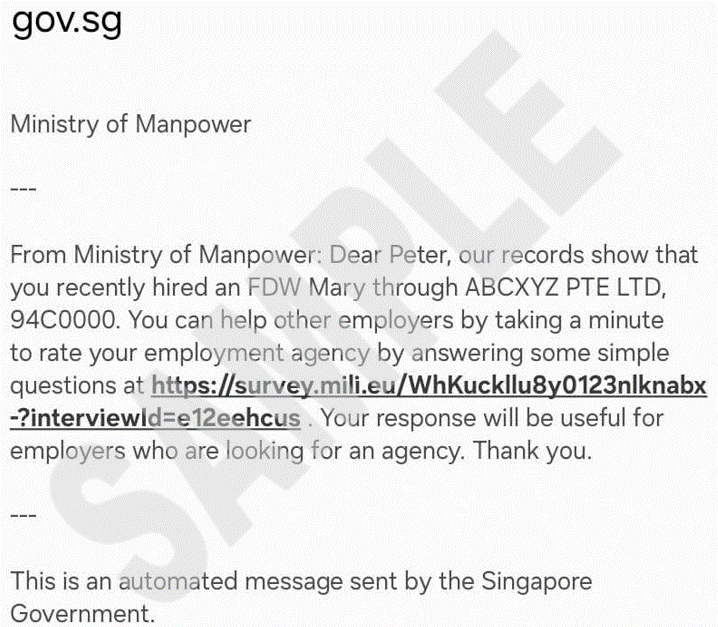
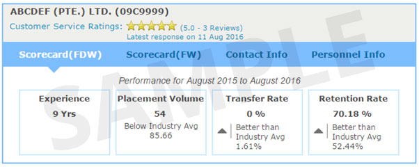

<!-- HCAG:COMPILED id=www.mom.gov.sg.passes-and-permits.work-permit-for-foreign-domestic-worker.customer-ratings -->
---
children: []
content_token_estimate: 3482
descendants: 0
id: www.mom.gov.sg.passes-and-permits.work-permit-for-foreign-domestic-worker.customer-ratings
image_urls: {}
kind: leaf
long_description: Explains how MOM's customer-rating system for FDW-placing employment
  agencies works. Covers the SMS survey process sent to employers roughly 3 months
  after FDW deployment, lists the five survey questions asked, describes the star-rating
  scale (max five stars, minimum 3 reviews before display), and states that ratings
  appear in the EA Directory. Relevant when employers or prospective employers want
  to understand how EA ratings are collected, what the survey asks, or where to view
  ratings.
source_files:
- index.md
source_urls:
- ''
subtree_depth: 0
title: Customer ratings for FDW-placing employment agencies
token_size_estimate: 3482
---

# Customer ratings for FDW-placing employment agencies

<!-- HCAG:CONTENT BEGIN -->
## Content

<!-- source: index.md -->
# Customer ratings for FDW-placing employment agencies

Customer ratings for employment agencies shows you the EA’s ratings before you engage their services in hiring an FDW.

## At a glance

| Related eService | [Employment agencies and personnel search (EA directory)](https://www.mom.gov.sg/eservices/services/employment-agencies-and-personnel-search) | 
|---|---|

## How ratings work

After your FDW is deployed to your household for about 3 months, you will receive an SMS to take part in a survey to rate the services of your EA.

A reminder SMS will be sent if we do not receive a response from you within a week.

The short survey consists of questions regarding the overall service of the EA that you engaged.

| # | Questions | 
|---|---|
| 1 | How well did your EA explain the application process, fees, service contract and the FDW employment contract to you? | 
| 2 | How helpful was your EA when you needed advice or help? | 
| 3 | How able was your EA in finding an FDW that meets your need? | 
| 4 | Would you recommend the EA to your friends? | 
| 5 | Did you use the [EA Directory](https://www.mom.gov.sg/eservices/services/employment-agencies-and-personnel-search) when deciding on the EA to engage? | 

Your rating is important to us as it will encourage EAs to provide good before- and after-service to you and other prospective FDW employers. Using these ratings, prospective FDW employers can check and compare the competency and service level of an EA before engaging them.

## Where to see ratings

The ratings will be displayed in the [employment agencies and personnel search (EA directory)](https://www.mom.gov.sg/eservices/services/employment-agencies-and-personnel-search).

In each FDW-placing EA’s profile page, the ratings will be represented by the number of stars. The maximum score is five stars. There needs to be a minimum of 3 reviews before the ratings will be displayed. See sample below.

<!-- HCAG:CONTENT END -->
