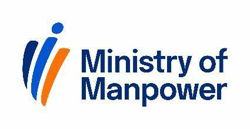
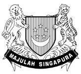

## Page 1

Consent form for family member to act on behalf of employer of domestic helper(s) 

Updated on 1 April 2026 

Upload the completed form in our FDW eService (go.gov.sg/fdw-eservice) for us to process your request. If approved, the family member can perform these transactions related to your helper(s): 

Please make sure that all the fields are filled. Incomplete forms will be rejected. 

<!-- Start of picture text -->
*NRIC/FIN +65 (e.g. S1234567A / G1234567A) <!-- End of picture text -->

Signature/Date 

<!-- Start of picture text -->
*NRIC/FIN +65 (e.g. S1111111A / G1111111A) Relationship to employer  Spouse  Sibling or their spouse  Child or their spouse (You must be related in one of these ways)  Grandchild or their spouse  Niece or Nephew, or their spouse <!-- End of picture text -->

* **Note** : We use full NRIC number or FIN to identify people accurately. If you have any queries about this, please contact us at go.gov.sg/ mom-other-feedback _._

