## Page 1

# **User guide for family member to act on behalf of the migrant domestic worker's employer** 

## **Introduction** 

To better assist employers of migrant domestic workers (MDWs) who require assistance with work pass transactions, family member can now act on their behalf. If the request is approved, the family member can perform these transactions in our FDW eService: 

- Renew a pass 

- Extend a pass validity (short-term) 

- Levy transactions including: 

- -Check and pay levy 

- -Apply for Giro to pay levy 

- -Apply for waivers and refunds 

- -Pay levy penalties 

Family members who can submit this request to act on behalf include: 

- Spouse 

- Sibling or their spouse 

- Child or their spouse 

- Grandchild or their spouse 

- Niece/nephew or their spouse 

For more details on the eligibility, please visit our MOM website. 

User guide for family member to act on behalf of the migrant domestic worker's employer 

1

## Page 2

### **How to apply to act on behalf of the employer?** 

#### **Step 1: Download a copy of the** **<u>consent form</u>** 

- The form will need to be completed by the family member and employer. 

- Save a copy of the completed consent form in your internet device. 

#### **Step 2: Appointed family member will need to log in to** **<u>FDW eService</u> using their Singpass** 

User guide for family member to act on behalf of the migrant domestic worker's employer 

2

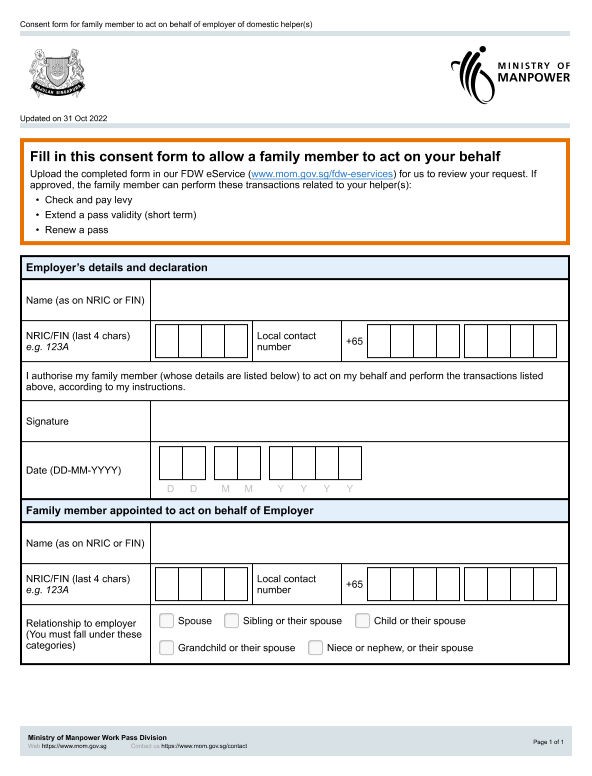

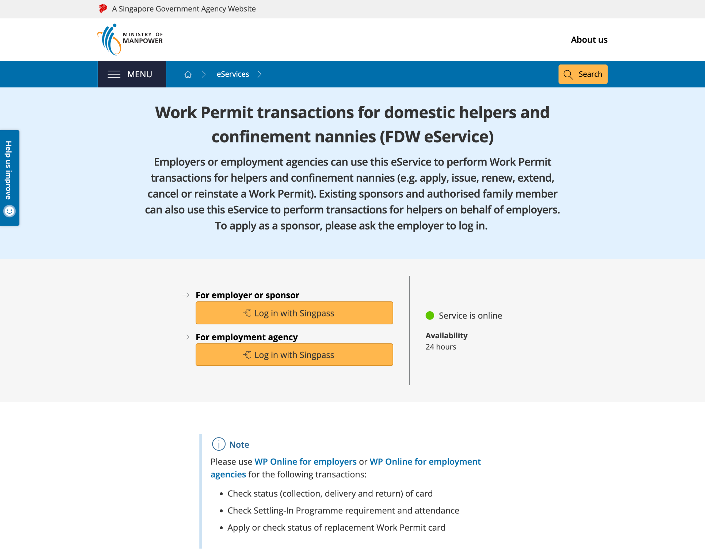

## Page 3

#### **Step 3: Click the 'Act on behalf' tab on the navigation bar** 

Click the ‘Request to act on behalf’ link to start your submission. 

#### **Step 4: Review the eligibility requirements and documents required for the submission** 

- Click 'Continue' to go to the next step. 

#### **Step 5: Enter required details for the employer whom you are requesting to act on behalf** 

- Enter the employer's details. 

- Click 'Continue’ to go to the next step. 

User guide for family member to act on behalf of the migrant domestic worker's employer 

3

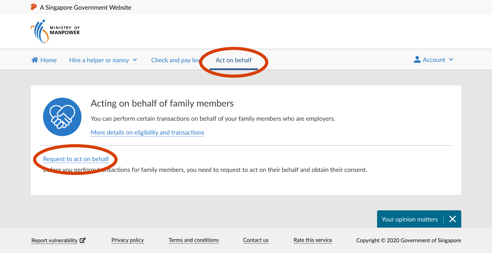

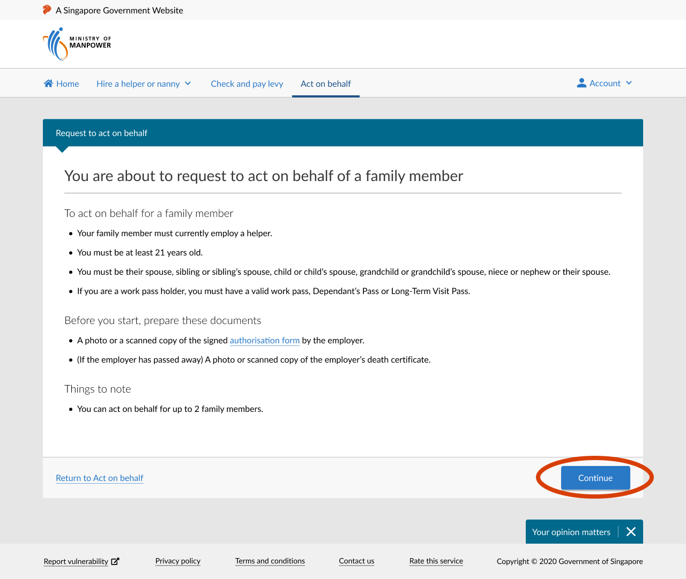

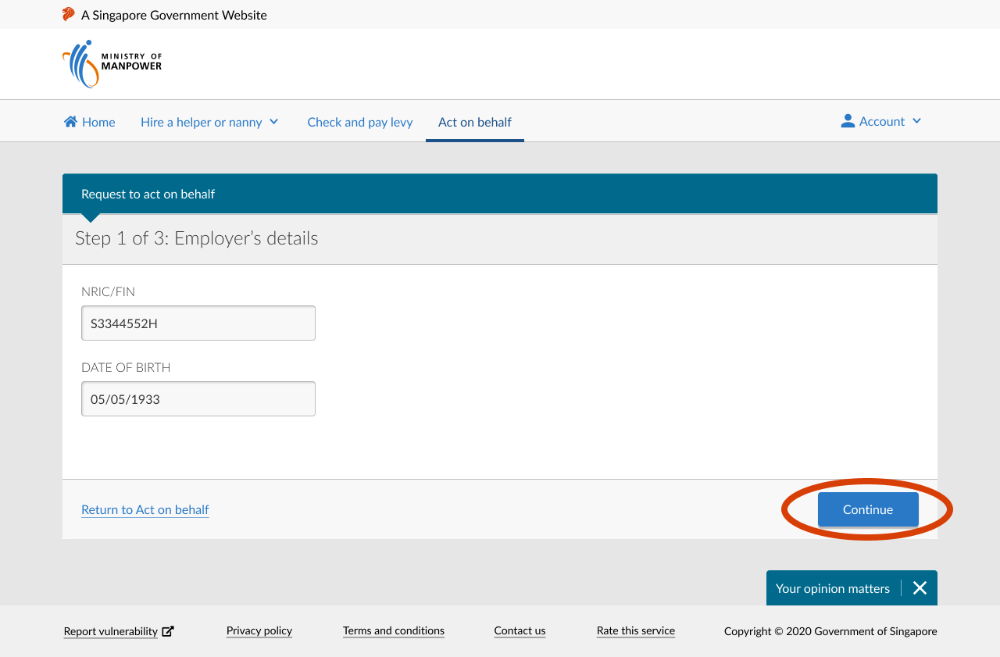

## Page 4

#### **Step 6: Enter your details and upload a copy of the completed consent form** 

- Enter the details required. 

- Click ‘Choose file’ to upload a copy of the completed consent form. 

- Click ‘Continue' to go to the next step. 

#### **Step 7: Review the information you have entered and submit your request** 

- Click ‘Edit’ if you need to amend the information entered earlier. 

- Read the declaration clauses. If you agree, check the box beside ‘I declare that’. 

- Click ‘Submit’. 

User guide for family member to act on behalf of the migrant domestic worker's employer 

4

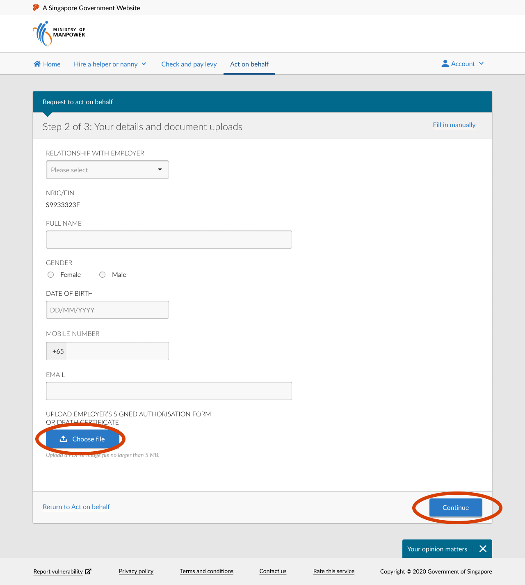

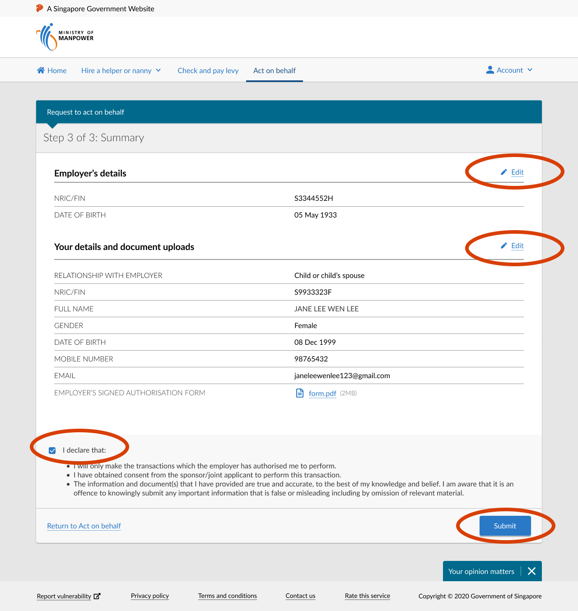

## Page 5

#### **Step 8: Acknowledgment of successful submission** 

- To keep a record of the submission, click ‘Download summary and acknowledgment pages’. 

- An email acknowledgment of the submission will be sent to you and the employer. 

#### **Step 9: Check the status of your request** 

- We will email the outcome to you and the employer within 3 days. We will also send the outcome letter to the employer. 

- Alternatively, you can also log in to FDW eService and click on the ‘Act on behalf’ tab. 

User guide for family member to act on behalf of the migrant domestic worker's employer 

5

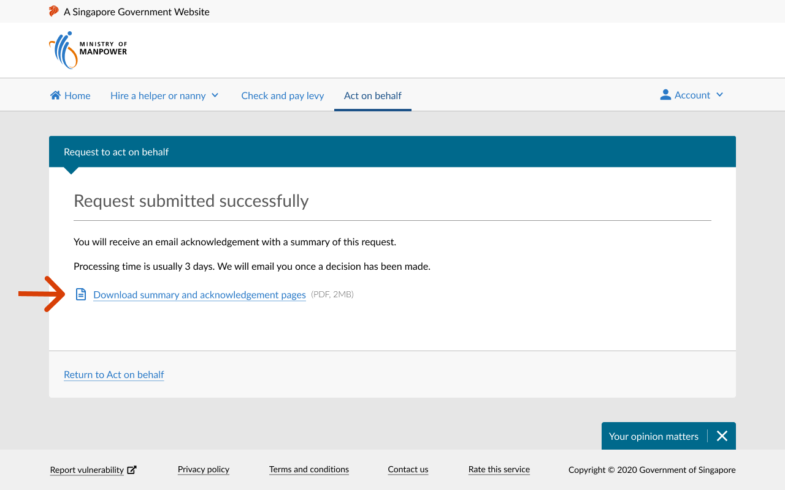

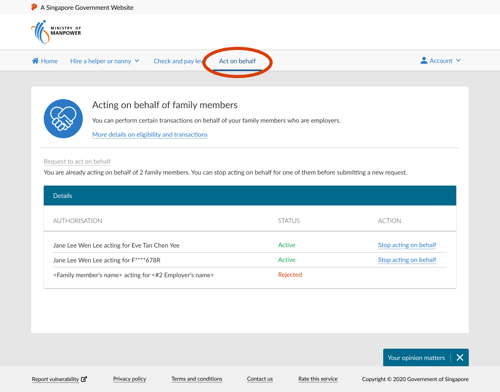

## Page 6

### **How to request to stop acting on behalf of the employer?** 

**Step 1: The current approved family member will need to log in to** **<u>FDW eService using their Singpass</u>** 

#### **Step 2: Click on the ‘Act on behalf’ tab on the navigation bar** 

The tab can be found along the navigation bar. 

#### **Step 3: Click on the link to stop acting on employer's behalf** 

The page will contain information on employer(s) whom you are currently acting on behalf of. 

- Click on the ‘Stop acting on behalf’ link for the relevant employer. 

Please ensure that you have informed the employer before doing so. 

User guide for family member to act on behalf of the migrant domestic worker's employer 

6

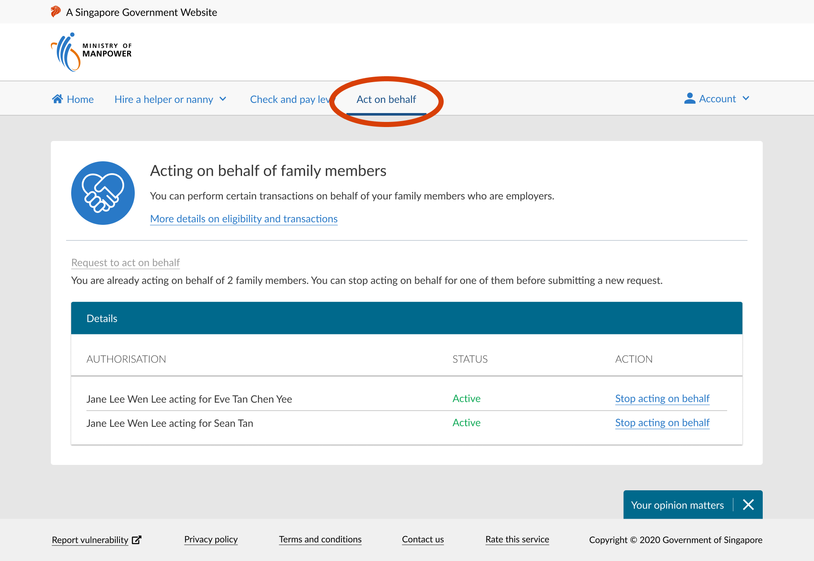

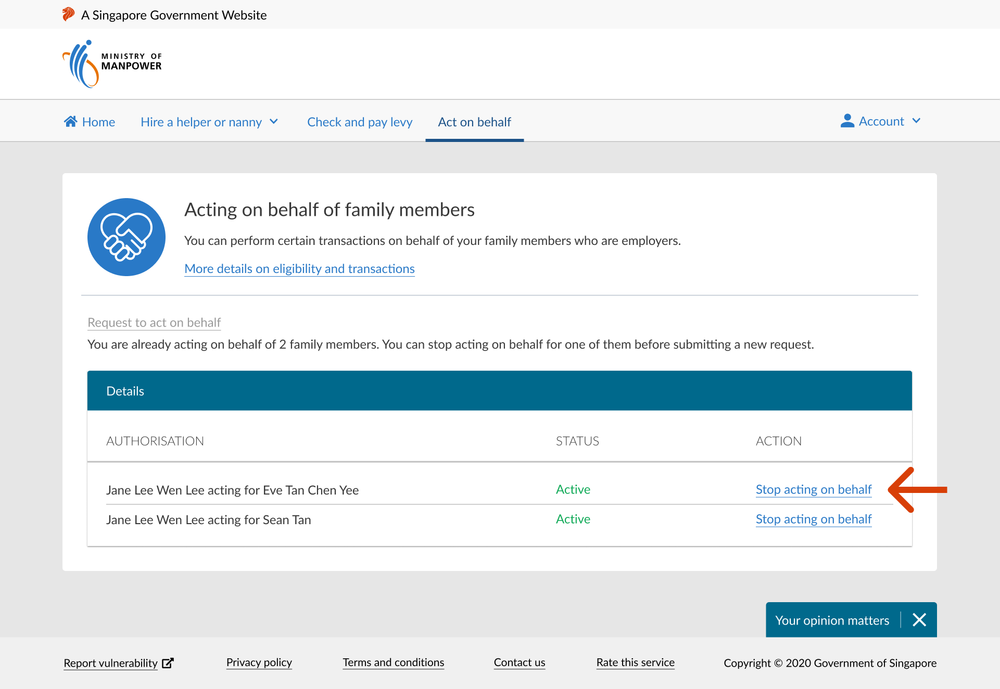

## Page 7

#### **Step 4: Confirm your request** 

Click on ‘Confirm’. 

#### **Step 5: Acknowledgment of successful submission** 

An email acknowledgement of the submission will be sent to the employer and you. 

The request to stop acting on behalf will take effect immediately. We will email and post the outcome to the employer and you. 

User guide for family member to act on behalf of the migrant domestic worker's employer 

7

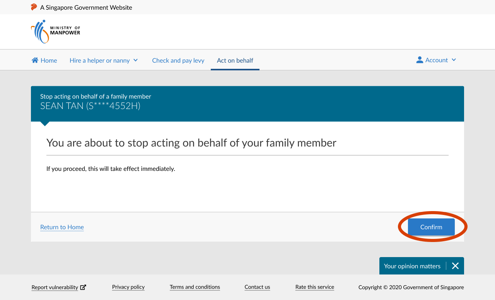

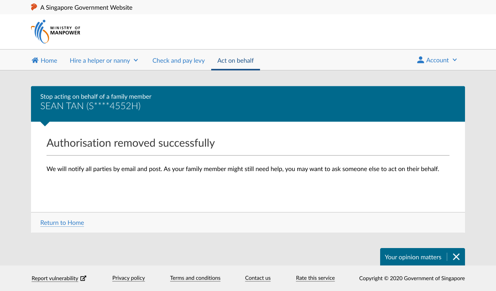
