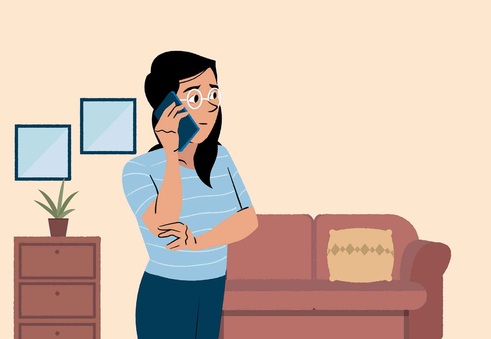
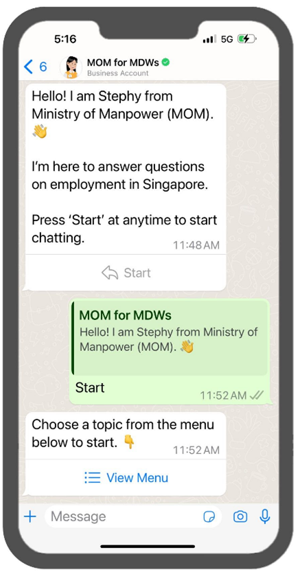
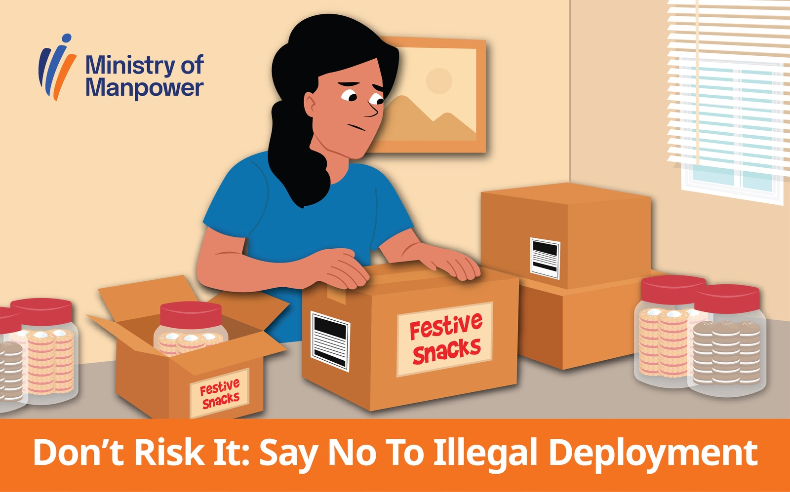

# Resources for employers of migrant domestic workers (MDWs)

## Helplines for employers

*Reading time: 2 mins*

Struggling with communication or facing overwhelming issues with your MDW? Or do you feel that mediation could help you work through an issue? You are not alone. Reach out for support and a listening ear by contacting these helplines.

| For | Organisation | Contact | 
|---|---|---|
| Employment related advice and assistance | Centre for Domestic Employees (CDE) | [1800 225 5233](<tel:1800 225 5233>) | 
| Dispute resolution and mediation | Association of Employment Agencies (Singapore) - AEA(S) | [6836 2618](<tel:6836 2618>) | 

## WhatsApp channel for MDWs

*Reading time: 2 mins*

Help your MDW adapt to life in Singapore by having her subscribe to our WhatsApp channel. It will send her useful messages about working and living in Singapore, including how to avoid scams and unlicensed moneylenders. A WhatsApp infobot is also available 24/7 for her to self-help and seek answers to employment or well-being questions.

 

**How your MDW can sign up**

1. Subscribe to the [MOM MDW WhatsApp channel](https://go.gov.sg/subscription) .
2. If your sign-up is successful, you will receive an acknowledgment message.

For more information, please refer to our [FAQs](https://file.go.gov.sg/whatsapp-faqs.pdf).

The use of WhatsApp is governed by these [Terms of Use](https://file.go.gov.sg/whatsapp-termsofuse.pdf) and [Privacy Statement](https://file.go.gov.sg/whatsapp-privacystatement.pdf).

## Rest-day activities for your MDW

*Reading time: 4 mins*

As an MDW’s employer, you play a crucial role in supporting her well-being. This includes letting her spend her rest day meaningfully in safe spaces, so that she can recharge and form networks of support outside the household.

Check out these meaningful activities organised by our Non-government Organisations (NGOs). Advise your MDW to sign up for these to recharge and refresh during her rest day.

**Free sight-seeing excursions**

Your MDW can experience complimentary sight-seeing excursions with the [Association of Employment Agencies (Singapore) Fun Club](https://aeas.org.sg/aeas-fun-club/). The club makes monthly trips to various attractions in Singapore where your MDW can enjoy games and snacks, and forge friendships with fellow MDWs.

**Finance management classes**

Help your MDW gain the knowledge it takes to save up and avoid traps like borrowing from unlicensed moneylenders. Encourage her to sign up for money management courses at [Aidha](https://aidha.org/) to learn how to budget her finances.

**Fun-filled activities**

Let your MDW enjoy a fun-filled day with the Centre for Domestic Employees (CDE). She can participate in recreational activities or learn new skills such as handicrafts, dance, and more.

[Follow CDE on Facebook](https://www.facebook.com/cde.singapore/)to find out more.

## Guidebooks for you

We’ve gathered a list of handy guides that can help you have a pleasant employment journey with your MDW. Topics range from safety to mental well-being and beyond.

### **Work safety for your MDW**

- [Be a responsible MDW employer](https://www.mom.gov.sg/-/media/mom/documents/publications/guides/be-a-responsible-employer_ver2.pdf) – Do's and don'ts to help your MDW work safely at home.

### Enhancing your MDW's mental well-being

### **Employment matters for hiring an MDW**

Besides the [employer’s guide for migrant domestic workers](https://www.mom.gov.sg/passes-and-permits/work-permit-for-foreign-domestic-worker/employers-guide), you may refer to the following resources:

- [Inform your helper against illegal employment.](https://www.mom.gov.sg/-/media/mom/documents/publications/mdw-employer-inform-your-helper-against-illegal-employment.pdf)
- [Your guide to employing a MDW](https://www.mom.gov.sg/-/media/mom/documents/publications/guides/your-guide-to-employing-a-mdw.pdf) – This guide spells out your roles and responsibilities as an MDW employer and provides advice on MDW employment issues.
- [Checklist on hiring a migrant domestic worker.](https://www.mom.gov.sg/-/media/mom/documents/publications/guides/checklist-hiring-mdw-english.pdf)
- [Preparing for your migrant domestic worker's rest days.](https://www.mom.gov.sg/-/media/mom/documents/publications/guides/migrant-domestic-worker-rest-day-guide.pdf)

## Guidebooks for your MDW

To help your MDW better adjust to life in Singapore, empower her with these handy guidebooks that provide practical tips for enhancing her mental and financial well-being. They could boost her motivation and satisfaction, helping her contribute her best to your household.

**My self-care journal**

Teach your MDW to take care of herself. Let her follow the story of Mimik, an MDW in Singapore, as she overcomes work challenges, learns to manage stress, and builds a good relationship with her employer. The journal includes fun colouring worksheets and activities that let your helper express herself!

**Guide on salary and financial matters**

Do you know if your helper is saving up for rainy days, or if she’s in urgent need of money? Use this money management guide to teach your helper how to save up and aim to achieve financial security with easy-to-follow steps and helpful advice. It will also help her avoid unwanted scenarios like borrowing from unlicensed moneylenders, or resorting to a side job illegally.

## Monthly newsletter for employers

Our newsletters cover a wide range of topics relevant to employers of MDWs.

Download the latest issue:

**Read our past issues:**
