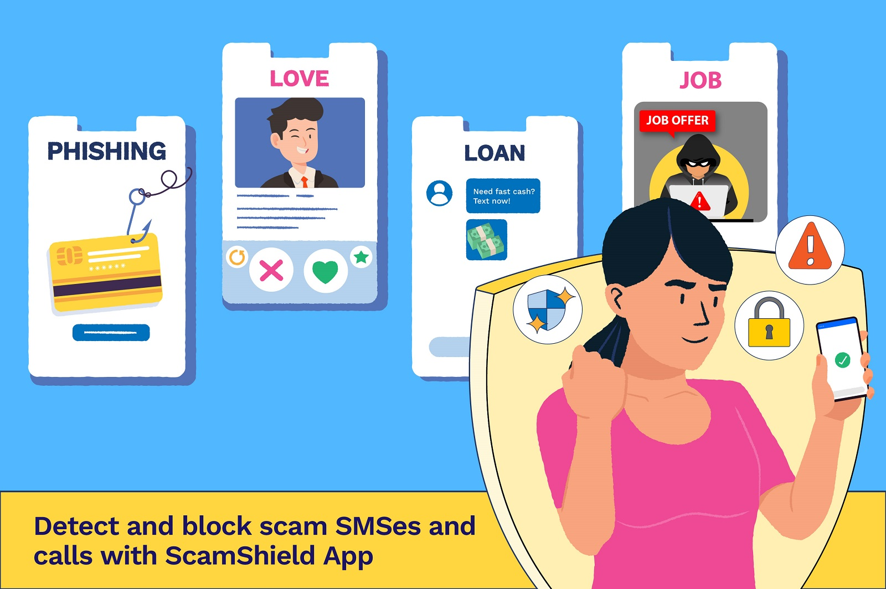
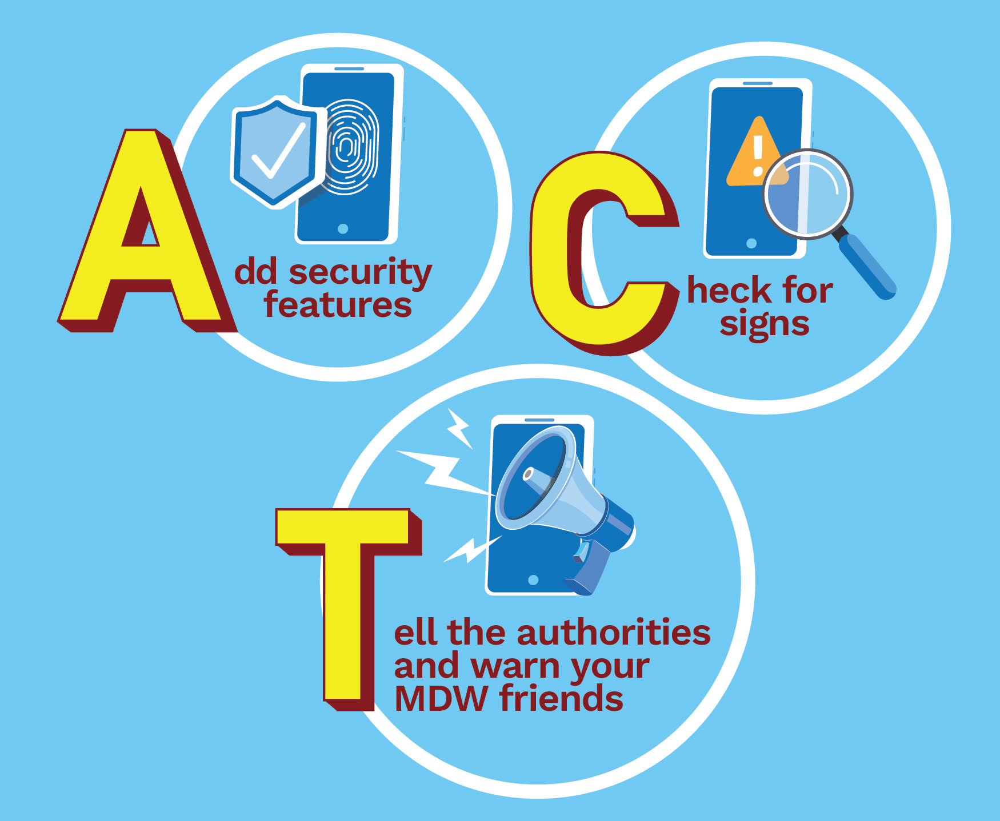

<!-- HCAG:COMPILED id=www.mom.gov.sg.passes-and-permits.work-permit-for-foreign-domestic-worker.publications-and-resources.staying-safe-from-scams -->
---
children: []
content_token_estimate: 5046
descendants: 0
id: www.mom.gov.sg.passes-and-permits.work-permit-for-foreign-domestic-worker.publications-and-resources.staying-safe-from-scams
image_urls: {}
kind: leaf
long_description: Provides practical guidance for Migrant Domestic Workers (MDWs)
  in Singapore on recognising and avoiding scams. Defines the ACT framework (Add ScamShield
  app, Check for scam signs, Tell authorities). Describes specific scam types targeting
  MDWs — phishing, internet love scams, job scams, and loan scams — with detailed
  real-life stories illustrating how each works and concrete warning signs. Covers
  immediate steps to take if scammed, including contacting the bank, filing a police
  report at a Neighbourhood Police Centre, and reaching the MOM helpline for MDWs.
source_files:
- index.md
source_urls:
- ''
subtree_depth: 0
title: Scam awareness and prevention for Migrant Domestic Workers
token_size_estimate: 5046
---

# Scam awareness and prevention for Migrant Domestic Workers

<!-- HCAG:CONTENT BEGIN -->
## Content

<!-- source: index.md -->
# Staying safe from scams

Scams can happen to anyone, including Migrant Domestic Workers (MDWs). Learn how MDWs can recognise and avoid scams, while safeguarding their well-being and hard-earned money.

### Stop and check if it’s a scam

A scam is designed to trick you into giving away your money or personal details by offering an attractive deal or false information.

- **A** dd security features such as downloading the[ScamShield app](https://play.google.com/store/apps/details?id=sg.gov.scamshield) to block scams and report scams
- **C** heck for scam signs with official sources
- **T** ell the authorities and warn your MDW friends
- If you are unsure whether it is a scam, call the ScamShield helpline (1799)

Watch the video on how to ACT against scams.

## Types of scams

### What is a phishing scam?

If you receive a message from an unknown person asking you to click on an unknown link to provide your personal details, be careful! It could be a phishing scam to steal your personal information and money. Avoid clicking on any links or sharing your personal information.

Watch the video to find out how to protect yourself against phishing scams.

### What is an internet love scam?

If you meet someone who confesses his love in a short time, then suddenly needs help and asks you for money, it is likely a scam. Don't send money to him.

Watch the video to find out how you can protect yourself against internet love scams.

### What is a job scam?

As an MDW, you can only work for your official employer. If you receive job offers that promise high pay for easy work or ask for upfront payment before starting a job, they are likely a scam! Don’t fall for it and risk losing your hard-earned money! 

Watch the video to find out how to protect yourself against job scams.

### Other scams

To find out more about other types of scams, such as e-commerce scams and Government Officials Impersonation scams, visit ScamShield Website at [ScamShield.gov.sg](https://www.scamshield.gov.sg/).

## Real stories

Feeling lost after falling victim to scams? You're not alone. Watch these real stories of MDWs as they share their experiences and how they sought help.

### Migrant domestic workers, watch out for these scams!

You may have heard that scams in Singapore are on the rise, and that many Singaporeans have fallen prey. But did you know you could be a target? That's right, scammers are targeting MDWs too!

Read on to discover scams commonly encountered by MDWs and find out what you can do to avoid falling for them.

### Internet love scams

It is natural for us to want to help the people we care for and internet love scammers know this. They will first worm their way into their target's hearts, befriending them and gaining their trust before they carry out the scam.

They may tell a tale about falling on hard times and needing a loan. They may ask you to invest money, promising high returns with low risk. Or they may ask for help to transfer funds using your bank account. These funds are often linked to money laundering, which is a criminal offence.

Wati, a 43-year-old Indonesian MDW, learned this the hard way.

She met Adam online. He was handsome and charming, and although he claimed to be from the U.S, they found time every day to chat over calls in her time zone. Soon, he was telling her he loved her and couldn't wait to introduce her to his family. He even promised he would bring her to the U.S. and marry her.

One day, he asked her for help. He needed to transfer money for work but had trouble using an American bank. He said he would transfer $30,000 into her account, and asked if she could transfer the same amount to his business account.

She trusted him, so she gave him her banking details, allowing him to log in to her account.

When she next logged in, she discovered that all her savings were gone! That's when she realised that she had been scammed.

To make matters worse, she also received a call from the Singapore Police Force informing her that her account was frozen as it was involved in money laundering. She was asked to go to the police station to assist in investigations.

**Be wary of people you meet online. Do not send money to people you have never met. Never allow others to use your bank account to conduct transactions.**

Learn more about ways to protect yourself against [internet love scams](https://www.scamshield.gov.sg/i-want-protection-from-scams/learn-to-recognise-scams/internet-love-scams/).

### Phishing scams

Phishing scams are where scammers pretend to be someone they are not, like a bank officer or government official, to try to get your personal details and money.

They hook you by telling you that you need to take action on something urgent. For example, they may claim that there is trouble with your bank account.

They bait you to click on a link to visit a fake website or download a fake mobile app. These look convincing but are designed to get control of your confidential information, devices and bank accounts. Once the scammers have control, they can steal your hard-earned money.

That's what happened to Elena, an MDW from the Philippines.

She received an SMS stating that her online banking password had expired and that she should update it immediately.

Not wanting to lose access to her bank account, she tapped on the link in the SMS, which brought her to what looked like her bank's website. She logged in with her username and password, and keyed in her One-time Password (OTP) when she received it on her phone.

Unknown to her, this was a phishing website where scammers stole her login details and used them to access her bank account.

In a matter of minutes, Elena received another SMS - this time from her actual bank - informing her that she had just transferred $500 to someone named Alvin.

Her account was drained of almost all her savings.

*Do not click on links in unsolicited text messages and emails. If you need to access your bank account, use the official app or type in your bank's web address into your web browser to ensure that you are navigating to the official website.* 

Learn more about ways to protect yourself against [phishing scams](https://www.scamshield.gov.sg/i-want-protection-from-scams/learn-to-recognise-scams/phishing-scams/).

### Loan scams

Loan scammers claim to be licensed money lenders offering legal loan services. You may encounter them through unwanted phone calls or text messages, or through online advertisements.

They promise instant loan approvals but will request that you transfer fees before they pay out the money. When you've transferred the fees, they either disappear entirely, or use the personal information you've provided to harass you for further payments.

Cherry, a Filipino MDW, wanted to borrow money to help with her mother's hospital expenses. She found a Facebook post advertising fuss-free loans, so she reached out. they agreed to give her a $2,000 loan, but told her that she needed to pay an upfront $200 admin fee first.

After she paid the $200, they started to extort her for weekly payments. They threatened that, if she did not pay, they would throw paint on her employer's front door and post on social media so everyone could see that she owed money.

**Licensed money lenders are not allowed to advertise in Singapore. Ignore unwanted loan advs. Block and report the number of the caller or sender.**

Learn how to identify and avoid [loan scams](https://www.scamshield.gov.sg/i-want-protection-from-scams/learn-to-recognise-scams/loan-scams/).

Remember, scammers can target anyone, including MDWs. to avoid falling prey, stay alert and ACT against scams.

## Scam prevention steps

 

Here are 3 steps to protect yourself against scams.

**1. Add the [ScamShield app](https://play.google.com/store/apps/details?id=sg.gov.scamshield) to block incoming calls from scammers and detect scam SMSes.**

**2. Check for scam signs.**

If you are unsure, say no, hang up or delete the call or message. You can also call the **ScamShield helpline at 1799** to check if it is a scam.

**3. Tell authorities and friends.**

If you encounter scams, report to the authorities and warn your fellow MDWs so that they can avoid being scammed.

Report scam calls and messages you received via the [ScamShield app](https://play.google.com/store/apps/details?id=sg.gov.scamshield).

## What to do if you've been scammed?

If you have lost money or personal details to a scammer, here's what you can do immediately and protect yourself from further loss.

- Contact your bank to report the scam. Ask them to stop any transactions.
- Warn others and report the scam. You can prevent others from falling victims by filing a police report at the nearest [Neighborhood Police Centre](https://www.police.gov.sg/Contact-Us) .
- Get help to recover. If you need someone to talk to, reach out to friends or contact MOM helpline for MDWs at [1800-339-5505](tel:1800-339-5505) (Mon – Fri, 8.30am to 5.30pm). Note that airtime charges apply for mobile calls to 1800 service lines.

<!-- HCAG:CONTENT END -->
