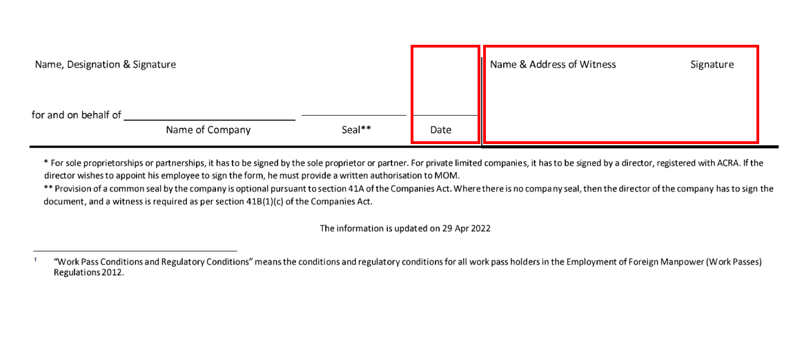
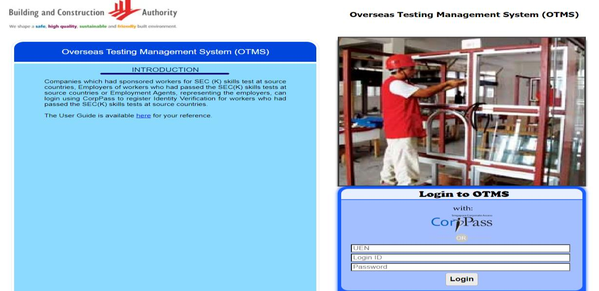
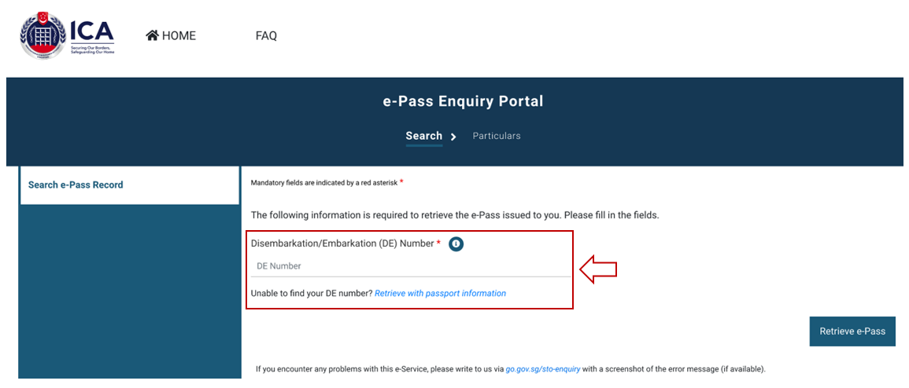
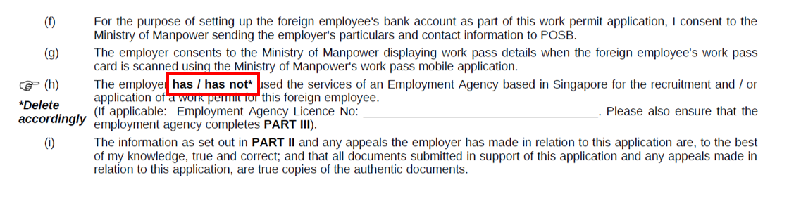
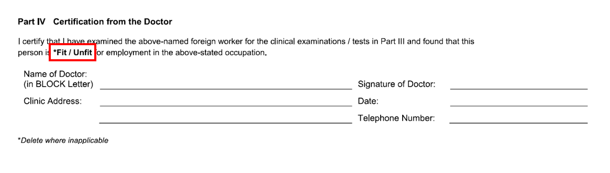

<!-- HCAG:COMPILED id=www.mom.gov.sg.passes-and-permits.work-permit-for-foreign-worker.apply-for-work-permit -->
---
children: []
content_token_estimate: 44064
descendants: 0
id: www.mom.gov.sg.passes-and-permits.work-permit-for-foreign-worker.apply-for-work-permit
image_urls: {}
kind: leaf
long_description: 'Provides the complete end-to-end procedure for employers or employment
  agents to apply for and obtain a Work Permit in Singapore. Covers each sequential
  step: submitting the application (online login, $35 fee, IPA letter), preparing
  for workers'' arrival (medical exam timing, security bond form), getting the permit
  issued (timelines for Malaysian vs non-Malaysian vs employer-change scenarios, required
  documents and information), registering fingerprints and photo at MOM Services Centre,
  setting up the digital work pass via SGWorkPass app, and receiving the physical
  card (delivery timeline, failed-delivery collection process). Also includes the
  GIRO application form for paying work pass administrative fees and the Security
  Bond form text (SGD $5,000 per worker) specifying employer obligations under the
  Employment of Foreign Manpower Act regarding upkeep, repatriation, accommodation,
  compliance with work pass conditions, and forfeiture terms. Notes that Work Permit
  duration is usually 2 years but may be shorter based on passport validity or security
  bond duration, and that non-Malaysian workers cannot be in Singapore during the
  application.'
source_files:
- index.md
- wpol_giro_form.md
- company_sb_form.md
- guide-on-common-errors-when-getting-your-pass-issued.md
- company_sb_form-2.md
- guide-on-common-errors-when-getting-your-pass-issued-2.md
- wpol_giro_form-2.md
source_urls:
- ''
- ''
- ''
- ''
- ''
- ''
- ''
subtree_depth: 0
title: How to Apply for a Work Permit (Step-by-Step Process)
token_size_estimate: 44064
---

# How to Apply for a Work Permit (Step-by-Step Process)

<!-- HCAG:CONTENT BEGIN -->
## Content

<!-- source: index.md -->
# Apply for a Work Permit

You can apply for a Work Permit online as an employer or appointed employment agent.

## How to apply

| Step | Who does this | How long it takes | 
|---|---|---|
| [Submit an application](#submit-an-application) | Employer or employment agent (EA) | **Within 1 week** for most cases | 
| [Prepare for workers' arrival](#prepare-for-workers-arrival) | Employer or EA | Not applicable | 
| [Get the permit issued](#get-the-permit-issued) | Employer or EA | Immediate processing | 
| [(If required) Register fingerprints and photo](#if-required-register-fingerprints-and-photo) | Worker | Not applicable | 
| [Set up digital work pass](#set-up-digital-work-pass) | Worker | Same day as card registration | 
| [Receive the card](#receive-the-card) | Employer or authorised recipients | Receive within 5 working days after fingerprint and photo registration, or document verification | 

**See** [pass map](https://www.mom.gov.sg/passes-and-permits/work-permit-for-foreign-worker/key-facts#pass-map) for overview of what you need to do before, during and after you apply for a Work Permit

**Note:**

- If you have never applied for a Work Permit, you need to [declare your business activity](https://www.mom.gov.sg/eservices/services/declare-your-business-activity) .
- Non-Malaysian workers cannot be in Singapore during the Work Permit application.
- The duration of the Work Permit is **usually 2 years** , but it may be shorter depending on:
  - **Validity of the worker’s passport:** Validity will be 1 month before the passport expires
  - **Duration of the security bond:** Validity will be 2 months before the security bond expires

## Submit an applicationShow

*Processing time: within 1 week. Some cases will take more time.*

To submit an application:

1. [Get a written consent to apply for Work Permit](https://www.mom.gov.sg/faq/work-pass-general/why-must-i-get-a-foreigners-written-consent-before-applying-for-a-work-pass-for-them) from the worker.
2. [Log in](https://www.mom.gov.sg/eservices/services/work-permit-transactions-for-workers-employed-by-businesses) to fill out the application.
3. Pay $35 for each application. You can pay by [GIRO](https://www.mom.gov.sg/-/media/mom/documents/services-forms/passes/wpol_giro_form.pdf) , Visa or Mastercard.
4. [Check the application status](https://www.mom.gov.sg/eservices/services/work-permit-transactions-for-workers-employed-by-businesses) after 1 week. It may take longer if additional information is required.
5. If the application is approved, log in to [*myMOM* Portal](https://www.mom.gov.sg/eservices/services/work-permit-transactions-for-workers-employed-by-businesses) > Work Passes > Quick Menu > View details to print the following:
  - [In-principle approval (IPA) letter](https://www.mom.gov.sg/passes-and-permits/work-permit-for-foreign-worker/sector-specific-rules/in-principle-approval)
  - Work Permit application form

[correct the error](https://www.mom.gov.sg/faq/work-pass-general/what-should-i-do-if-there-is-an-error-in-my-worker-passport-details-in-the-ipa). Otherwise, the worker will be denied entry into Singapore.

## Prepare for workers' arrivalShow

### Before workers' arrival

| **Role** | **Responsibilities** | 
|---|---|
| Employer |  | 
| Worker |  | 

### Upon worker's arrival

1. Within **2 weeks** of arrival, send them for[medical examination](https://www.mom.gov.sg/passes-and-permits/work-permit-for-foreign-worker/sector-specific-rules/medical-examination) by either a:
  - Singapore-registered doctor
Or
  - MOM-appointed Anchor Operators for workers eligible for the [Primary Care Plan](https://www.mom.gov.sg/primary-care-plan) .
 You may also need to send them for the [Settling-in Programme](https://www.mom.gov.sg/passes-and-permits/work-permit-for-foreign-worker/sector-specific-rules/settling-in-programme) , if applicable.
2. Singapore-registered doctor
3. 
Print and complete the [Security Bond form](https://www.mom.gov.sg/-/media/mom/documents/services-forms/passes/company_sb_form.pdf) .
  - For sole proprietorships and partnerships, the form should be signed by the sole proprietor or partner.
  - For private limited companies, it should be signed by a director who is registered with ACRA. If the director wishes to appoint an employee to sign the form, he must provide a written authorisation to MOM.

[Onboard centre](https://www.mom.gov.sg/passes-and-permits/work-permit-for-foreign-worker/sector-specific-rules/onboard-centre)for up to 3 days.

## Get the permit issuedShow

*Processing time: Immediate*

You need to get the Work Permit issued within this timeframe:

| If the worker is | Get the Work Permit issued | If you can’t get the Work Permit issued on time e.g. medical examination results or new passport is not ready | 
|---|---|---|
| **A newly-arrived Malaysian** |  | Log in to [WP Online](https://www.mom.gov.sg/eservices/services/wp-online-for-businesses-and-employment-agencies) to extend the IPA expiry date. You need to do this before the due date stated on the IPA letter. | 
| **A newly-arrived non-Malaysian** |  | Log in to [WP Online](https://www.mom.gov.sg/eservices/services/wp-online-for-businesses-and-employment-agencies) to request for a Special Pass. The IPA will be automatically extended. | 
| **Changing to a new employer** |  | Log in to [WP Online](https://www.mom.gov.sg/eservices/services/wp-online-for-businesses-and-employment-agencies) to extend the IPA expiry date. You need to do this before the due date stated on the IPA letter. | 

The worker must be in Singapore when you carry out these steps to get the pass issued:

1. Log in to [Work Permit eService on *myMOM* Portal](https://go.gov.sg/wp-eservice) and provide the[required information and documents](#what-you-ll-need) .
2. Pay $35 for each Work Permit issued. You can pay by GIRO, Visa or Mastercard.
3. Once the Work Permit is issued, you will receive the notification letter by email. Print the letter and give it to the worker. The notification letter is valid for 1 month from the date of issue and:

- Allows the worker to start work and travel in and out of Singapore while waiting for the Work Permit card.
- States if registration of fingerprints and photo is required.

[request to extend the validity of the notification letter.](https://go.gov.sg/change-date-wpcr)

### What you'll need

You will need the following information to get the pass issued:

- Worker’s passport details
- Worker’s Singapore contact details
- Worker’s Singapore residential address, which must meet the housing requirements
- Singapore residential or office address to receive the candidate’s card
- Details of up to 3 authorised recipients to receive the card (their mobile number and NRIC number, FIN or passport number)

- Worker’s travel document
- Worker’s immigration document (e.g., Electronic Visit Pass or Special Pass)
- Signed and completed Work Permit declaration form. The employer’s declaration of the form should be signed by an authorised human resource personnel, or an employee holding at least a managerial position.
- Completed Security Bond form (if required)
- Educational qualifications (if required)

- Make sure you [print the IPA letter and the Work Permit application form](https://www.mom.gov.sg/passes-and-permits/work-permit-for-foreign-worker/apply-for-work-permit#submit-an-application) before you get the pass issued.
- [For new workers in the construction sector who passed their SEC(K) test overseas]

Before you get the pass issued, you must [make an appointment](http://www.bca.gov.sg/orv/) with BCA to get your worker’s identity verified and IPA endorsed within 4 months of the SEC(K) test.

**Note**: If you are using BCA's self-help kiosk, you will receive a BCA endorsement letter.

For any queries, please [contact BCA](https://www2.bca.gov.sg/feedback/).

- For us to verify your documents successfully, please check that the documents uploaded are correct and complete. For more details, please refer to our [guide on common errors](https://www.mom.gov.sg/-/media/mom/documents/services-forms/passes/guide-on-common-errors-when-getting-your-pass-issued.pdf) .

## (If required) Register fingerprints and photoShow

*When: Within 1 week after pass is issued* 

Check the notification letter for whether the worker needs to register fingerprints and photo.

If required, the worker needs to complete registration **within 1 week** after the Work Permit is issued.

For registration, you must [make an appointment](https://www.mom.gov.sg/eservices/services/make-an-appointment) for the worker to visit [MOM Services Centre – Hall C](https://www.mom.gov.sg/contact-us/locations).

For the appointment, the worker should bring:

- Original passport
- Appointment letter
- Notification letter
- Their mobile phone (with local number) with both Singpass and [SGWorkPass](https://www.mom.gov.sg/eservices/sgworkpass) apps downloaded

During registration, we will capture the worker’s fingerprints, take their photo and register them for a Singpass account. We will also help the worker set up the Singpass and [SGWorkPass](https://www.mom.gov.sg/eservices/sgworkpass) app on their mobile phone. 

[MOM's Onboard centre](https://www.mom.gov.sg/passes-and-permits/work-permit-for-foreign-worker/sector-specific-rules/onboard-centre).

## Set up digital work passShow

*When: On the day of card registration*

After they are registered for a Singpass account, inform the pass holder to:

1. Download [SGWorkPass](https://www.mom.gov.sg/eservices/sgworkpass) (if they have not done so yet)
2. Log into the app with their Singpass
3. View their digital work pass and employment information

SGWorkPass app allows them easy and secure access to their digital work pass. They can check their status, expiry date and procure services earlier, without having to wait for delivery of their physical work pass cards.

## Receive the cardShow

*When: Within 5 working days after registration or document verification*

We will deliver the Work Permit card to the given address within **5 working days** after the worker registers and gets documents verified. For workers who do not need to register, we will deliver the card within 5 working days after verifying their documents.

[SGWorkPass](https://www.mom.gov.sg/eservices/sgworkpass)app to view their digital work pass and employment information.

The authorised recipients will get an SMS or email with the delivery details at least 1 working day before delivery.

When collecting the card, you will need to show these documents for identification:

| Person receiving the card | Required documents | 
|---|---|
| Worker | Passport or digital work pass | 
| Authorised person | NRIC, FIN or passport | 

 If you do not receive the card within 5 working days, [check if you have uploaded the correct documents](https://www.mom.gov.sg/faq/work-pass-general/ive-registered-for-my-card-but-mom-has-not-yet-contacted-me-about-the-card-delivery-date-what-should-i-do).

You can also [check the card delivery](https://www.mom.gov.sg/eservices/services/wp-online-for-businesses-and-employment-agencies) details in WP Online.

### If card delivery fails

After 2 unsuccessful deliveries, you or an authorised person can collect the card at the service desk of [MOM Services Centre – Hall C](https://www.mom.gov.sg/contact-us/locations) after **3 working days**. You do not need an appointment for collection.

Bring along these documents for card collection:

- Worker’s original passport or digital work pass
- Notification letter

If you authorise someone to collect it on your behalf, make sure they bring these along:

- An authorisation letter from the employer
- NRIC or passport for verification
- Worker’s original passport
- Notification letter

<!-- source: wpol_giro_form.md -->
## Page 1

For official use 

**INTERBANK GIRO APPLICATION FORM (Only for payment of work pass administrative fees)** 

**To avoid being rejected by your Bank, please take note of the following when filling in this form:** 

- Complete all fields in Part 1. Incomplete forms will not be processed. 

- Ensure the details (e.g. Signature(s), Name of Bank Account, Bank Account Number) are correct. 

- Do not use correction fluid or tape. The Bank Account Holder must sign next to any changes made. 

**Mail the original completed form to: Admin Fee & E-Payment Management, Work Pass Division, Ministry of Manpower, 18 Havelock Road, Singapore 059764.** We will inform you of the GIRO application outcome by email in 4 weeks’ time. But it may take longer if your Bank needs more time to process the application. 

**PART 1: FOR APPLICANT’S COMPLETION (Complete all fields marked with** • **)** 

- Please tick √ the account(s) <u>you wish to apply for GIRO and indicate your Entity’s number in the corresponding column.</u> 

<!-- Start of picture text -->
For business employers For employment agencies  EP eService  EP eService Unique Entity No.: Unique Entity No.:  WP Online  WP Online / Work permit transactions for domestic helpers and confinement nannies eService CPF Submission No.: EA Licence No.: Name of Entity: Contact Person: Mobile No.:  Email Address: Name of Billing Organisation:  Ministry of Manpower (MOM), Work Pass Division/AG <!-- End of picture text -->

- (a) I/We hereby instruct the Bank to process MOM’s instruction to debit my/our account. 

- (b) The Bank is entitled to reject MOM’s debit instruction if my/our account does not have sufficient funds and charge me/us a fee for this. The Bank may also at its discretion allow the debit even if this results in an overdraft on the account and impose charges accordingly. 

- (c) This authorisation will remain in force until terminated by the Bank’s written notice sent to my/our address last known to the Bank or upon the Bank’s receipt of my/our revocation through MOM. 

<!-- Start of picture text -->
•  Name of Bank:  •  My/Our Signature(s)/Thumbprint as in Bank’s records: •  Name of Account as shown on your Entity’s Bank statement: •  My/Our Bank Account No.:  •  Date: Bank  Branch  Account No. to be debited <!-- End of picture text -->

# **PART 2: FOR MOM’S COMPLETION** 

<!-- Start of picture text -->
SWIFT BIC  MOM’s Account No.  WP Online Customer Reference No. DBSSSGSGXX <!-- End of picture text -->

<!-- Start of picture text -->
EP eService Customer Reference No. EA Customer Reference No. <!-- End of picture text -->

# **PART 3: FOR BANK’S COMPLETION** 

# To: MOM 

This application is rejected (please tick √) due to the following reason(s): 

-  Signature/Thumbprint differs from Bank’s records 

-  Wrong account number/name# 

   -  Amendment not signed by Bank Account Holder 

   -  Others: 

-  Signature/Thumbprint is incomplete/unclear# 

- _#Please strike off accordingly._

<!-- source: company_sb_form.md -->
## Page 1

# **To Be Signed Once Only** 

## **Work Pass Division** 

18 Havelock Road Singapore 059764 www.mom.gov.sg 

### **Security Bond Form for Work Permit Holders employed by Companies Employment of Foreign Manpower Act (Chapter 91A) Employment of Foreign Manpower (Work Passes) Regulations (Regulation 12)** 

I/We ________________________________________________________________(Company’s Name) ____________________(Company’s       Unique      Entity Number) of (or having our registered office at)______________________________________________________________________________(Company’s Address) acknowledge myself/ourselves bound to pay the Government of the Republic of Singapore the sum of SGD$5000 per work pass holder, or such sums as may be specified by the Controller from time to time (“the Obligation”). 

#### PURPOSE 

I/We wish to apply for the issue of Work Passes for the persons whose particulars appear in **the Letter(s) of Guarantee** (“the said persons”); 

#### STATUTORY AUTHORITY 

The Controller of Work Passes is agreeable to the issuing of Work Passes to the said persons on the following conditions to be observed by me/us in respect of the said persons, namely:- 

- i. That during their stay in Singapore, I/we shall be responsible for the prompt payment of salary, be responsible for and bear the costs of their upkeep and maintenance, including medical treatment, and give them reasonable notice of and bear the full cost of their repatriation, ensuring that all outstanding salaries or monies due to them have been paid before their repatriation; 

- ii. That I/we shall provide acceptable accommodation for them; 

- iii. That, if any of them should die while in Singapore, I/we shall be responsible for the cost of burial or cremation or the return of the body to the country of nationality; 

- iv. That I/we shall produce to the Controller of Work Passes any person whose Work Pass has been cancelled or whose Visit Pass/Special Pass has expired or who is required to report to the Controller at such times as I/we may be required to do so; 

- v. That I/we shall employ them in accordance with the Work Pass Conditions and Regulatory Conditions applicable to them; 

- vi. That I/we shall take reasonable steps to ensure that they comply with the Work Pass Conditions and Regulatory Conditions1 applicable to them, and such steps shall include (a) reporting to the Controller of Work Passes if I/we know they are not complying and (b) informing them of the Work Pass Conditions and Regulatory Conditions applicable to them; and 

- vii. That upon completion or termination of employment or resignation from employment of any of them, or the cancellation or revocation of their Work Passes, I/we shall inform the Controller of Work Passes in writing within seven days of such completion or termination of employment or resignation from employment and, subject to giving them reasonable notice, I/we shall immediately or within such period that may be specified by the Controller of Work Passes repatriate them. 

And regulation 12 of the Employment of Foreign Manpower (Work Passes) Regulations provides that the Controller of Work Passes may require a bond to ensure compliance of the above conditions. 

**I/We acknowledge that the Controller of Work Passes may from time to time amend or remove the above conditions or introduce new conditions to be observed by me/us in respect of the said persons. Any amendment or removal of existing conditions or introduction of new conditions and its effective date will be made available to me/us by the Controller of Work Passes via electronic communications or website [at** **<u>www.mom.gov.sg]. I/We am/are solely</u> responsible in keeping abreast of such amendment, removal, or introduction of conditions.** 

NOW THE OBLIGATION above will be in force as long as the Letter of Guarantee is valid. 

Should I/we breach any of the above conditions in respect of any of the said persons, then the Obligation shall be in full force and effect and the amount in respect of that person as indicated in the Letter of Guarantee shall be forfeited partially or in whole by the Government of the Republic of Singapore. A partial forfeiture shall not extinguish the Government of the Republic of Singapore’s right to forfeit the remainder for the same breach or a different breach. 

|Signed, sealed and delivered by*:|In the presence of:||
|---|---|---|
|Name, Designation & Signature|Name, Address & of Witness|Signature|
|for and on behalf of _________________________|_______________   _____________||
|Name of Company|Seal**                     Date||

* For sole proprietorships or partnerships, it has to be signed by the sole proprietor or partner. For private limited companies, it has to be signed by a director, registered with ACRA. If the director wishes to appoint his employee to sign the form, he must provide a written authorisation to MOM. 

** Provision of a common seal by the company is optional pursuant to section 41A of the Companies Act. Where there is no company seal, then the director of the company has to sign the document, and a witness is required as per section 41B(1)(c) of the Companies Act. 

The information is updated on 29 Apr 2022 

1      “Work Pass Conditions and Regulatory Conditions” means the conditions and regulatory conditions for all work pass holders in the Employment of Foreign Manpower (Work Passes) Regulations 2012.

<!-- source: guide-on-common-errors-when-getting-your-pass-issued.md -->
## Page 1

**Guide on common errors when getting your pass issued** 

<!-- Start of picture text -->
Work Permit application form Part I (A) Declaration by foreign employee Make sure that your employee deletes one of the options in point (b) accordingly. Part II Particulars of company or employer Make sure that one of the options in point (h) is deleted accordingly. Make sure the Name of Authorised Representative is filled in. <!-- End of picture text -->

## Page 2

**Security bond form** Make sure you are using the latest form updated on 29 Apr 2022. Make sure that the Date, Name & Address of Witness and Signature are filled in.

## Page 3

<!-- Start of picture text -->
Medical examination form Part I Personal Particulars of Foreign Worker Make sure the Occupation is filled in. Part IV Certification from the Doctor Make sure the medical doctor deletes either ‘Fit’ or ‘Unfit’ accordingly. In-principle approval (IPA) letter with BCA’s endorsement Make sure that you submit the IPA letter with BCA’s endorsement by following the steps below. 1. Make an appointment with BCA to verify your worker’s identity at https://otms.bca.gov.sg/ 2. Log in with your Corppass and select the available appointment slot. <!-- End of picture text -->

## Page 4

3. Once your worker’s identity has been verified, upload a copy of the IPA letter with the endorsement from BCA. 

**Note** : From 13 Mar 2023, you may also upload a copy of the BCA endorsement letter printed from the BCA kiosk machine. 

# **Travel document page with ICA’s ‘Frequent Traveller’ endorsement** 

Submit your worker’s Electronic Visit Pass (e-Pass) issued by ICA. You can retrieve this by following the steps below. 

1. Go to ICA’s e-Pass Enquiry Portal: <u>https://eservices.ica.gov.sg/sgarrivalcard/epassenquiry</u> 

2. Enter the DE number to retrieve the e-Pass. The DE number can be found on the SG Arrival Card (SGAC) that your worker is required to submit upon arrival in Singapore. 

Updated on 28 August 2023

<!-- source: company_sb_form-2.md -->
## Page 1

# **To Be Signed Once Only** 

## **Work Pass Division** 

18 Havelock Road Singapore 059764 www.mom.gov.sg 

### **Security Bond Form for Work Permit Holders employed by Companies Employment of Foreign Manpower Act (Chapter 91A) Employment of Foreign Manpower (Work Passes) Regulations (Regulation 12)** 

I/We ________________________________________________________________(Company’s Name) ____________________(Company’s       Unique      Entity Number) of (or having our registered office at)______________________________________________________________________________(Company’s Address) acknowledge myself/ourselves bound to pay the Government of the Republic of Singapore the sum of SGD$5000 per work pass holder, or such sums as may be specified by the Controller from time to time (“the Obligation”). 

#### PURPOSE 

I/We wish to apply for the issue of Work Passes for the persons whose particulars appear in **the Letter(s) of Guarantee** (“the said persons”); 

#### STATUTORY AUTHORITY 

The Controller of Work Passes is agreeable to the issuing of Work Passes to the said persons on the following conditions to be observed by me/us in respect of the said persons, namely:- 

- i. That during their stay in Singapore, I/we shall be responsible for the prompt payment of salary, be responsible for and bear the costs of their upkeep and maintenance, including medical treatment, and give them reasonable notice of and bear the full cost of their repatriation, ensuring that all outstanding salaries or monies due to them have been paid before their repatriation; 

- ii. That I/we shall provide acceptable accommodation for them; 

- iii. That, if any of them should die while in Singapore, I/we shall be responsible for the cost of burial or cremation or the return of the body to the country of nationality; 

- iv. That I/we shall produce to the Controller of Work Passes any person whose Work Pass has been cancelled or whose Visit Pass/Special Pass has expired or who is required to report to the Controller at such times as I/we may be required to do so; 

- v. That I/we shall employ them in accordance with the Work Pass Conditions and Regulatory Conditions applicable to them; 

- vi. That I/we shall take reasonable steps to ensure that they comply with the Work Pass Conditions and Regulatory Conditions1 applicable to them, and such steps shall include (a) reporting to the Controller of Work Passes if I/we know they are not complying and (b) informing them of the Work Pass Conditions and Regulatory Conditions applicable to them; and 

- vii. That upon completion or termination of employment or resignation from employment of any of them, or the cancellation or revocation of their Work Passes, I/we shall inform the Controller of Work Passes in writing within seven days of such completion or termination of employment or resignation from employment and, subject to giving them reasonable notice, I/we shall immediately or within such period that may be specified by the Controller of Work Passes repatriate them. 

And regulation 12 of the Employment of Foreign Manpower (Work Passes) Regulations provides that the Controller of Work Passes may require a bond to ensure compliance of the above conditions. 

**I/We acknowledge that the Controller of Work Passes may from time to time amend or remove the above conditions or introduce new conditions to be observed by me/us in respect of the said persons. Any amendment or removal of existing conditions or introduction of new conditions and its effective date will be made available to me/us by the Controller of Work Passes via electronic communications or website [at** **<u>www.mom.gov.sg]. I/We am/are solely</u> responsible in keeping abreast of such amendment, removal, or introduction of conditions.** 

NOW THE OBLIGATION above will be in force as long as the Letter of Guarantee is valid. 

Should I/we breach any of the above conditions in respect of any of the said persons, then the Obligation shall be in full force and effect and the amount in respect of that person as indicated in the Letter of Guarantee shall be forfeited partially or in whole by the Government of the Republic of Singapore. A partial forfeiture shall not extinguish the Government of the Republic of Singapore’s right to forfeit the remainder for the same breach or a different breach. 

|Signed, sealed and delivered by*:|In the presence of:||
|---|---|---|
|Name, Designation & Signature|Name, Address & of Witness|Signature|
|for and on behalf of _________________________|_______________   _____________||
|Name of Company|Seal**                     Date||

* For sole proprietorships or partnerships, it has to be signed by the sole proprietor or partner. For private limited companies, it has to be signed by a director, registered with ACRA. If the director wishes to appoint his employee to sign the form, he must provide a written authorisation to MOM. 

** Provision of a common seal by the company is optional pursuant to section 41A of the Companies Act. Where there is no company seal, then the director of the company has to sign the document, and a witness is required as per section 41B(1)(c) of the Companies Act. 

The information is updated on 29 Apr 2022 

1      “Work Pass Conditions and Regulatory Conditions” means the conditions and regulatory conditions for all work pass holders in the Employment of Foreign Manpower (Work Passes) Regulations 2012.

<!-- source: guide-on-common-errors-when-getting-your-pass-issued-2.md -->
## Page 1

**Guide on common errors when getting your pass issued** 

<!-- Start of picture text -->
Work Permit application form Part I (A) Declaration by foreign employee Make sure that your employee deletes one of the options in point (b) accordingly. Part II Particulars of company or employer Make sure that one of the options in point (h) is deleted accordingly. Make sure the Name of Authorised Representative is filled in. <!-- End of picture text -->

## Page 2

**Security bond form** Make sure you are using the latest form updated on 29 Apr 2022. Make sure that the Date, Name & Address of Witness and Signature are filled in.

## Page 3

<!-- Start of picture text -->
Medical examination form Part I Personal Particulars of Foreign Worker Make sure the Occupation is filled in. Part IV Certification from the Doctor Make sure the medical doctor deletes either ‘Fit’ or ‘Unfit’ accordingly. In-principle approval (IPA) letter with BCA’s endorsement Make sure that you submit the IPA letter with BCA’s endorsement by following the steps below. 1. Make an appointment with BCA to verify your worker’s identity at https://otms.bca.gov.sg/ 2. Log in with your Corppass and select the available appointment slot. <!-- End of picture text -->

## Page 4

3. Once your worker’s identity has been verified, upload a copy of the IPA letter with the endorsement from BCA. 

**Note** : From 13 Mar 2023, you may also upload a copy of the BCA endorsement letter printed from the BCA kiosk machine. 

# **Travel document page with ICA’s ‘Frequent Traveller’ endorsement** 

Submit your worker’s Electronic Visit Pass (e-Pass) issued by ICA. You can retrieve this by following the steps below. 

1. Go to ICA’s e-Pass Enquiry Portal: <u>https://eservices.ica.gov.sg/sgarrivalcard/epassenquiry</u> 

2. Enter the DE number to retrieve the e-Pass. The DE number can be found on the SG Arrival Card (SGAC) that your worker is required to submit upon arrival in Singapore. 

Updated on 28 August 2023

<!-- source: wpol_giro_form-2.md -->
## Page 1

For official use 

**INTERBANK GIRO APPLICATION FORM (Only for payment of work pass administrative fees)** 

**To avoid being rejected by your Bank, please take note of the following when filling in this form:** 

- Complete all fields in Part 1. Incomplete forms will not be processed. 

- Ensure the details (e.g. Signature(s), Name of Bank Account, Bank Account Number) are correct. 

- Do not use correction fluid or tape. The Bank Account Holder must sign next to any changes made. 

**Mail the original completed form to: Admin Fee & E-Payment Management, Work Pass Division, Ministry of Manpower, 18 Havelock Road, Singapore 059764.** We will inform you of the GIRO application outcome by email in 4 weeks’ time. But it may take longer if your Bank needs more time to process the application. 

**PART 1: FOR APPLICANT’S COMPLETION (Complete all fields marked with** • **)** 

- Please tick √ the account(s) <u>you wish to apply for GIRO and indicate your Entity’s number in the corresponding column.</u> 

<!-- Start of picture text -->
For business employers For employment agencies  EP eService  EP eService Unique Entity No.: Unique Entity No.:  WP Online  WP Online / Work permit transactions for domestic helpers and confinement nannies eService CPF Submission No.: EA Licence No.: Name of Entity: Contact Person: Mobile No.:  Email Address: Name of Billing Organisation:  Ministry of Manpower (MOM), Work Pass Division/AG <!-- End of picture text -->

- (a) I/We hereby instruct the Bank to process MOM’s instruction to debit my/our account. 

- (b) The Bank is entitled to reject MOM’s debit instruction if my/our account does not have sufficient funds and charge me/us a fee for this. The Bank may also at its discretion allow the debit even if this results in an overdraft on the account and impose charges accordingly. 

- (c) This authorisation will remain in force until terminated by the Bank’s written notice sent to my/our address last known to the Bank or upon the Bank’s receipt of my/our revocation through MOM. 

<!-- Start of picture text -->
•  Name of Bank:  •  My/Our Signature(s)/Thumbprint as in Bank’s records: •  Name of Account as shown on your Entity’s Bank statement: •  My/Our Bank Account No.:  •  Date: Bank  Branch  Account No. to be debited <!-- End of picture text -->

# **PART 2: FOR MOM’S COMPLETION** 

<!-- Start of picture text -->
SWIFT BIC  MOM’s Account No.  WP Online Customer Reference No. DBSSSGSGXX <!-- End of picture text -->

<!-- Start of picture text -->
EP eService Customer Reference No. EA Customer Reference No. <!-- End of picture text -->

# **PART 3: FOR BANK’S COMPLETION** 

# To: MOM 

This application is rejected (please tick √) due to the following reason(s): 

-  Signature/Thumbprint differs from Bank’s records 

-  Wrong account number/name# 

   -  Amendment not signed by Bank Account Holder 

   -  Others: 

-  Signature/Thumbprint is incomplete/unclear# 

- _#Please strike off accordingly._

<!-- HCAG:CONTENT END -->
