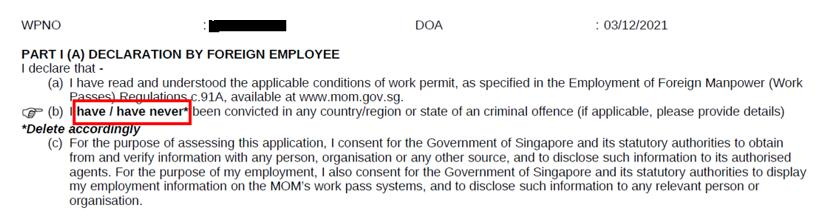
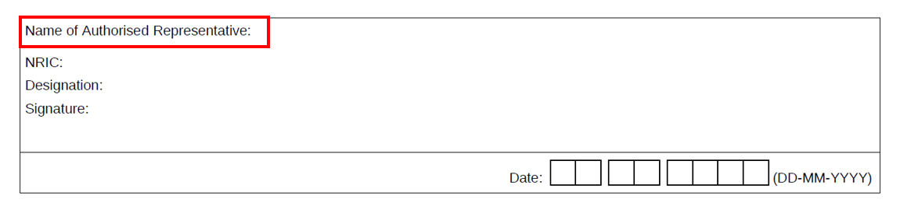
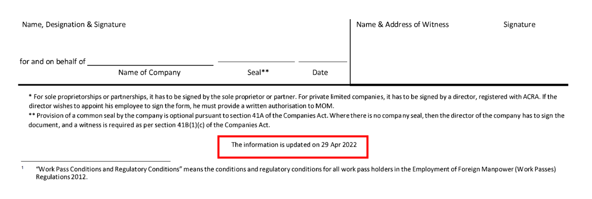
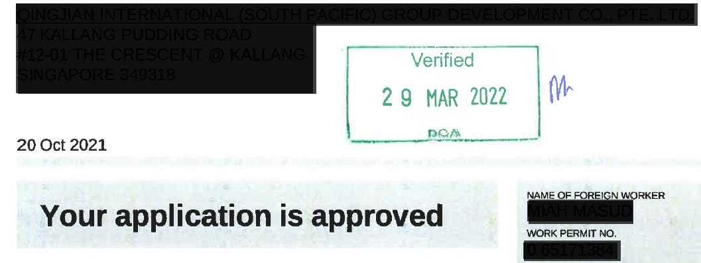
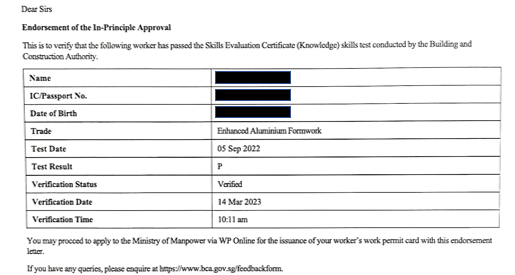

## Page 1

**Guide on common errors when getting your pass issued** 

<!-- Start of picture text -->
Work Permit application form Part I (A) Declaration by foreign employee Make sure that your employee deletes one of the options in point (b) accordingly. Part II Particulars of company or employer Make sure that one of the options in point (h) is deleted accordingly. Make sure the Name of Authorised Representative is filled in. <!-- End of picture text -->

## Page 2

**Security bond form** Make sure you are using the latest form updated on 29 Apr 2022. Make sure that the Date, Name & Address of Witness and Signature are filled in.

## Page 3

<!-- Start of picture text -->
Medical examination form Part I Personal Particulars of Foreign Worker Make sure the Occupation is filled in. Part IV Certification from the Doctor Make sure the medical doctor deletes either ‘Fit’ or ‘Unfit’ accordingly. In-principle approval (IPA) letter with BCA’s endorsement Make sure that you submit the IPA letter with BCA’s endorsement by following the steps below. 1. Make an appointment with BCA to verify your worker’s identity at https://otms.bca.gov.sg/ 2. Log in with your Corppass and select the available appointment slot. <!-- End of picture text -->

## Page 4

3. Once your worker’s identity has been verified, upload a copy of the IPA letter with the endorsement from BCA. 

**Note** : From 13 Mar 2023, you may also upload a copy of the BCA endorsement letter printed from the BCA kiosk machine. 

# **Travel document page with ICA’s ‘Frequent Traveller’ endorsement** 

Submit your worker’s Electronic Visit Pass (e-Pass) issued by ICA. You can retrieve this by following the steps below. 

1. Go to ICA’s e-Pass Enquiry Portal: <u>https://eservices.ica.gov.sg/sgarrivalcard/epassenquiry</u> 

2. Enter the DE number to retrieve the e-Pass. The DE number can be found on the SG Arrival Card (SGAC) that your worker is required to submit upon arrival in Singapore. 

Updated on 28 August 2023

