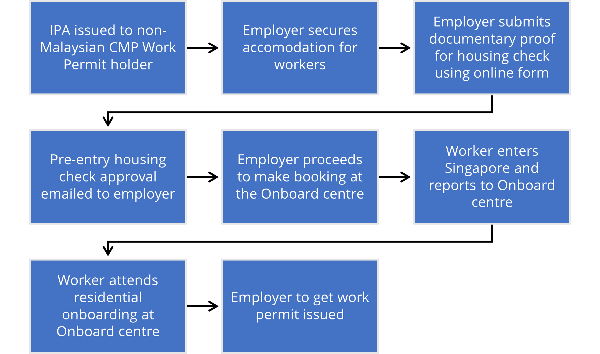

# Pre-entry housing check for Construction, Marine shipyard and Process (CMP) sector Work Permit holders

Due to the increased number of Work Permit holders entering into Singapore, more migrant workers are being housed in non-dormitory accommodation as dormitories approach full occupancy.

To moderate the demand for non-dormitory accommodation and ensure acceptable living conditions for workers, MOM will require proof of [acceptable accommodation](https://www.mom.gov.sg/passes-and-permits/work-permit-for-foreign-worker/housing/various-types-of-housing) before workers are allowed to enter Singapore starting from 19 September 2023.

## Who does it apply to

The requirement will apply to new Work Permit holders who meet all of the following:

- Are non-Malaysian
- Hold an in-principal approval (IPA)
- Working in the Construction, Marine shipyard or Process (CMP) sector
- Entering Singapore from 19 September 2023 onwards

## What must employers do

Employers must follow the [submission requirements](#submission-requirements) for pre-entry housing check before they can bring their workers in. Otherwise, they may have their work pass privileges suspended.

Employers are encouraged to contribute to bed supply by building their own accommodation such as Construction Temporary Quarters (CTQs), Temporary Occupation Licence Quarters, and Factory Converted Dormitories (FCDs) to house their workers. This will also expedite approval for these workers as the verification process for employer-run accommodation will be quicker.

## Submission requirements

Employers need to:

1. Ensure in-principal approval for the worker is issued.
2. Submit an [online form](https://form.gov.sg/64bf8796f8b1ef0011d1fdc7) for pre-entry housing check. There is no application fee.
 You’ll need to provide proof of accommodation, such as**any of the following** :
  - Tenancy or rental agreements
  - Contracts with accommodation providers
  - Email correspondences confirming bed reservations and tenancy end date
  - Dormitory FEDA / Provisional licence and nominal roll (for self-owned dormitory)
The accommodation arrangements should cover the worker for most of the duration of their Work Permit.
3. Wait for MOM's approval. Once the necessary checks are done, you'll receive an outcome via email.

After receiving the pre-entry housing check approval, employers can proceed to book a slot for their workers at the [Onboard centre](https://www.mom.gov.sg/passes-and-permits/work-permit-for-foreign-worker/sector-specific-rules/onboard-centre).

### Pre-entry housing check process

## Processing time

The processing time depends on the type of accommodation secured.

| For | Receive outcome | 
|---|---|
| Purpose-Built Dormitories (PBDs) | Within 7 working days | 
| Construction Temporary Quarters (CTQs) | Within 7 working days | 
| Temporary Occupation Licence Quarters (TOLQs) | Within 7 working days | 
| Factory Converted Dormitories (FCDs) | Within 7 working days | 
| Other accommodation | 42 working days or more | 

 For more information, read the  [FAQs](https://www.mom.gov.sg/-/media/mom/documents/foreign-manpower/housing/faqs-pre-entry-housing-check-for-cmp-work-permit-holders.pdf) on pre-entry housing check.
