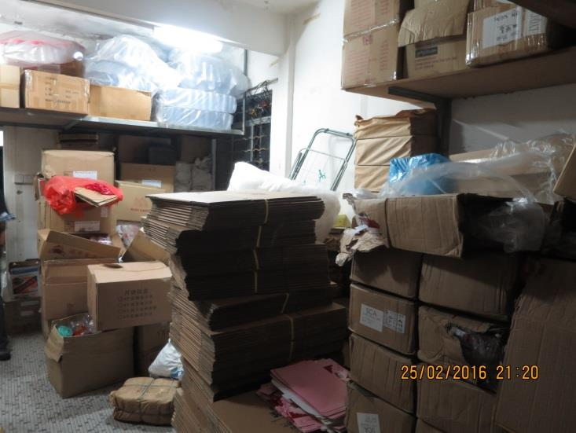
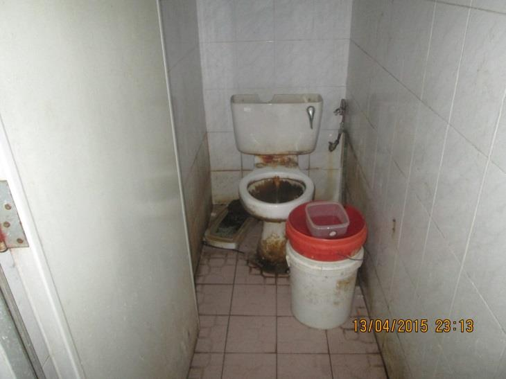
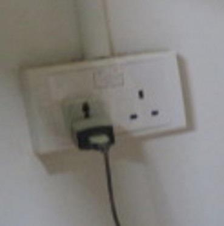
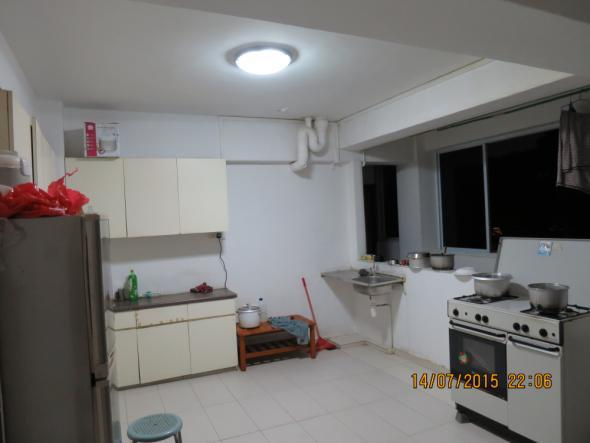
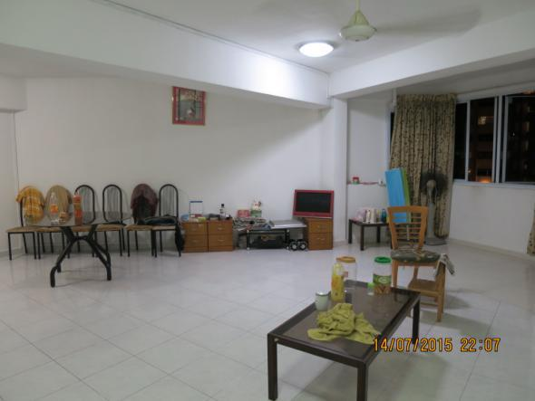

## Page 1

# **Checklist for employers of foreign workers Staying at Private Residential Units** 

_Employers are advised to use this list to check and ensure that private residential units they wish to house their workers at meet the requirements.  Employers are also advised conduct regular onsite checks after the workers moved into the units. Where shortcomings are detected (see Annex for pictorial examples), employers should work with your workers and/or property owners to have the shortcomings rectified as soon as possible.  If this is not feasible, employers should consider moving the workers to other approved housing._ 

|**No**|**Compliance Items**|**Met?**|
|---|---|---|
|1|There must not be more than 6 occupants stayingat theprivate residential unit||
||**Fire Safety**||
|2|No more than 2 Liquefied Petroleum Gas tanks in a unit||
|3|The fire exits and escape routes are free of obstruction.||
|4|The electrical sockets orpowerpoints in the unit are not overloaded.||
||**General Housekeeping**||
|5|There are proper rubbish disposal areas which are well maintained.||
|6|The sanitaryand bathingfacilities are well maintained.||
|7|Kitchens are well-maintained and there is nopest infestation (eg. cockroaches, flies or rodents).||
|8|There is no stagnant water in the unit toprevent mosquito breeding.||
|9|The unit and the rooms are properly ventilated.||

## **<u>Updating residential addresses of foreign workers with MOM</u>** 

It is a legal requirement for employers to update their foreign workers’ residential addresses with MOM through the Online Foreign Workers Address Service (OFWAS), within 5 days of the workers moving to a new address. 

## **<u>Additional information</u>** 

<!-- Start of picture text -->
Housing Requirements for FW  Updating the residential addresses of  Work Pass Conditions FW Link to Housing Requirements Link to OFWAS Link to Work Pass Conditions <!-- End of picture text -->

## Page 2

## **<u>Annex A</u>** 

## **Examples of poorly maintained workers’ housing** 

<!-- Start of picture text -->
Fire hazard materials and obstruction of exit <!-- End of picture text -->

Poorly maintained sanitary facilities 

Overloaded electrical power point 

<!-- Start of picture text -->
Overcrowding <!-- End of picture text -->

<!-- Start of picture text -->
Pest infestation <!-- End of picture text -->

<!-- Start of picture text -->
Poor housekeeping <!-- End of picture text -->

## Page 3

## **<u>Annex B</u>** 

## **Examples of well-maintained workers’ housing** 

<!-- Start of picture text -->
Unobstructed walkway and exit Ample living space Well-maintained sanitary facilities Well-maintained kitchen Correct use of power point Good Housekeeping <!-- End of picture text -->

