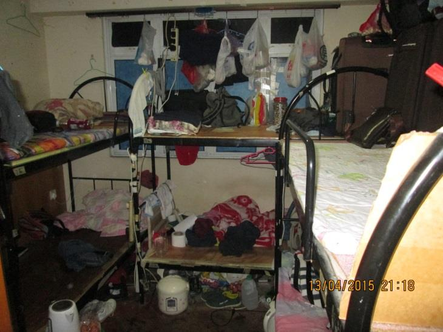
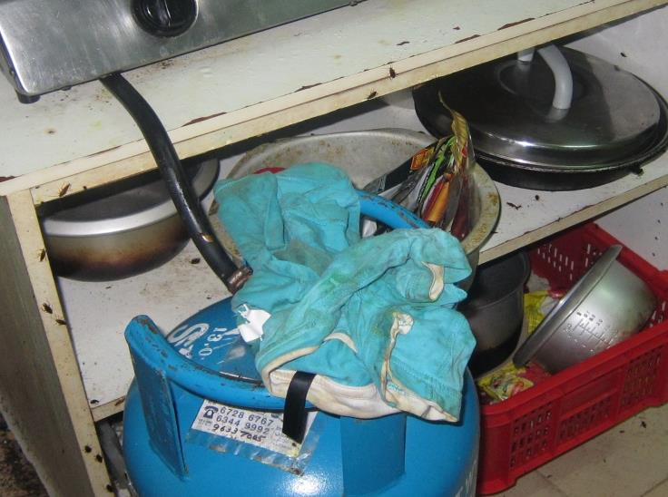
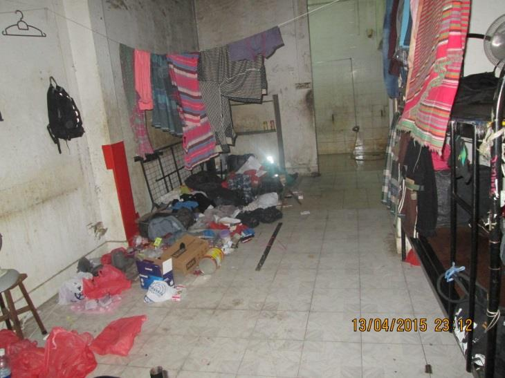
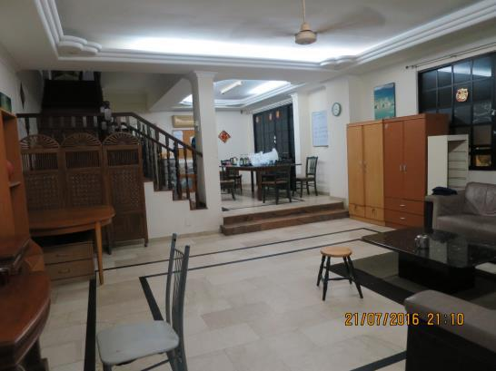
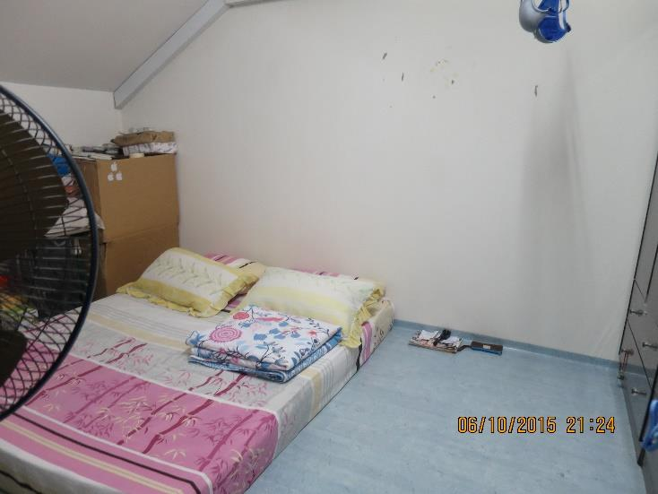
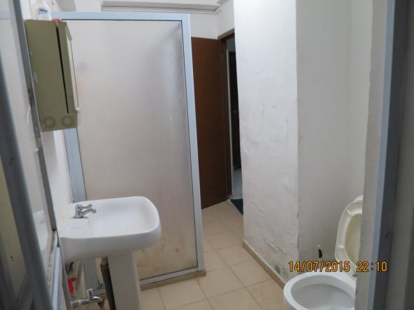

<!-- HCAG:COMPILED id=www.mom.gov.sg.passes-and-permits.work-permit-for-foreign-worker.housing.various-types-of-housing -->
---
children: []
content_token_estimate: 39563
descendants: 0
id: www.mom.gov.sg.passes-and-permits.work-permit-for-foreign-worker.housing.various-types-of-housing
image_urls: {}
kind: leaf
long_description: Defines the specific housing types employers may use for foreign
  employees in Singapore — Purpose-Built Dormitories (PBDs), Factory-Converted Dormitories
  (FCDs), Construction Temporary Quarters (standalone), Temporary Occupation Licence
  Quarters (TOLQ), Workers' Quarters at Farms (WQFs), HDB flats, and Private Residential
  Premises (PRPs) — and states the rules for each. For HDB flats it specifies maximum
  occupants by flat type (e.g. 4 for 1-/2-room, 6 for 3-room and above, with a temporary
  raise to 8 for 4-room+), bedroom subletting limits, tenant registration requirements,
  and which foreign employee categories may rent. For PRPs it defines the 6-unrelated-persons
  occupancy cap (temporarily raisable to 8 for units ≥90 sqm), explains how family
  units and domestic helpers are counted, and details the address-update and homeowner
  declaration process via FWTES/OFWAS. Includes a compliance checklist for private
  residential units covering fire safety, housekeeping, ventilation, pest control,
  and overcrowding, with pictorial examples of good and poor maintenance. Recommends
  tenancy agreements, regular inspections, and employee feedback channels across housing
  types, and warns about rental scams.
source_files:
- index.md
- checklist-prp.md
- checklist-prp-2.md
source_urls:
- ''
- ''
- ''
subtree_depth: 0
title: Housing types for foreign employees – requirements and rules
token_size_estimate: 39563
---

# Housing types for foreign employees – requirements and rules

<!-- HCAG:CONTENT BEGIN -->
## Content

<!-- source: index.md -->
# Various types of housing and their specific requirements

There are updates on this page. [Read more]

# Various types of housing and their specific requirements

There are various types of housing that your foreign employees can live in, each with its own set of requirements. Employers must carry out due diligence to ensure these requirements are met. Employers who fail to do so may be prosecuted, and disallowed to hire foreign employees.

## Purpose-Built Dormitories (PBDs)Show

| What are PBDs | PBDs are specially designed and built with features to meet the needs of foreign employees:  | 
|---|---|

We **highly recommend** you to:

- Sign a written tenancy agreement with the dormitory operator.
- Provide ways for employees to highlight problems with the housing to the dormitory operator, and work with the dormitory operator to rectify them.

## Factory-Converted Dormitories (FCDs)Show

| What are FCDs | Industrial or warehouse developments which have been partially converted to dormitories. | 
|---|---|
| Types of FCDs allowed |  | 

## Construction Temporary Quarters (CTQ): Standalone Temporary QuartersShow

| What are Standalone Temporary Quarters | Any structure used for housing employees within a construction site that will eventually be demolished or removed. | 
|---|---|
| Allowed to house | Construction sector foreign employees working at that particular construction project | 

## Temporary Occupation Licence quarters (TOLQ)Show

| What are TOL quarters | TOLs are temporary occupation licences issued by a government agency (or their managing agents) owning the land. They allow employers to establish temporary quarters on a plot of land that's typically near a construction site to support a specific project. TOLQ can be:  | 
|---|---|
| Allowed to house | Construction sector foreign employees working at that particular construction project | 

## Workers' Quarters at Farms (WQFs)Show

| What are WQFs | Living quarters for workers working and residing on farm premises. | 
|---|---|
| Allowed to house | Workers employed by the farm owner | 

## HDB flatsShow

| What are HDB flats | Public housing flats managed by the Housing and Development Board (HDB), which may be rented out as a whole flat or by rooms, subject to HDB's approval. | 
|---|---|
| Allowed to house | The following foreign employees are allowed to rent HDB flats:  | 

### The number of bedrooms that flat owners can rent out and the maximum number of tenants and occupants allowed in each flat depends on the flat type as shown below.

#### Whole flat

| Flat type | Max number of occupants | 
|---|---|
| 1-room or 2-room | 4 | 
| 3-room | 6 | 
| 4-room or bigger | 6 | 

[raise the occupancy cap](https://www.hdb.gov.sg/hdb-pulse/news/2026/extension-of-temporary-relaxation-of-occupancy-cap-for-rental-of-hdb-flats-and-private-residential)from 6 to 8 occupants for

**4-room or bigger HDB flats**.

#### Bedrooms

| Flat type | Max number of bedrooms | 
|---|---|
| 1-room or 2-room | Not allowed | 
| 3-room | 1 | 
| 4-room or bigger | 2 | 

**Note:** Flats rented from HDB cannot be sublet.

For more info, refer to the [HDB website](https://www.hdb.gov.sg/eservices/renting-a-flat/public-rental-scheme/).

### What you need to do

Before you can register your employee's address using [OFWAS](https://www.mom.gov.sg/eservices/services/ofwas) or [EP eService](https://www.mom.gov.sg/eservices/services/employment-pass-eservice), you must:

- Ensure that the HDB flat owner registers your employees as tenants with HDB before they move in. Your employees can use HDB's eService to check if the flat owner has registered them as tenants of the flat.

We **highly recommend** you to:

- Sign a written tenancy agreement with the flat owner.
- If your employees rent the place themselves, encourage them to sign a written tenancy agreement with the flat owner.
- Get a copy of the HDB rental approval letter from the flat owner.
- Conduct regular checks on the state of the HDB flat. Use the [checklist for HDB](https://www.mom.gov.sg/-/media/mom/documents/foreign-manpower/housing/checklist-hdb) as a guide.
- Educate your employees on the expected level of housing standards.
- Provide ways for employees to highlight problems with the housing, and make arrangements with the flat owner to rectify them.

If video recording devices are installed in the unit, you must inform your employees of the devices and where they are placed. You should further ensure that they are not installed in areas that will compromise their privacy or modesty, such as bathrooms and sleeping areas.

[rental scams](https://www.cea.gov.sg/consumers/rental-scams). If you are engaging a property agent, check his or her mobile number with

[CEA's Public Registry](https://eservices.cea.gov.sg/aceas/public-register/)to verify the identity of your property agent. Scammers are putting up fake property listings online and impersonating property agents to scam victims into making payment to secure an appointment to view or rent properties.

## Private residential premises (PRPs)Show

| What are PRPs | Private properties such as condominiums, landed residential properties, terrace houses, semi-detached houses, bungalows, residential units in shop houses, etc. | 
|---|---|
| **Allowed to house** | All foreign employees | 

[Foreign Worker Tenant Enquiry Service (FWTES)](https://www.mom.gov.sg/eservices/services/tes)to complete a one-time declaration process.

All types of private residential property are subjected to an occupancy cap of  **6 unrelated persons per property**.

- Unrelated persons refer to anyone who is not part of the same family unit.
- Domestic helpers are considered part of the same family unit.
- The occupancy cap also applies to tenants who sublet the property.

For example, a family of six with domestic helpers are considered part of the same family unit and will not be subjected to the occupancy cap.

However, A family of four who stays and rent out part of the property will be subjected to the occupancy cap. They are allowed to accommodate a maximum of two additional unrelated persons on the property.

[raise the occupancy cap](https://www.hdb.gov.sg/hdb-pulse/news/2026/extension-of-temporary-relaxation-of-occupancy-cap-for-rental-of-hdb-flats-and-private-residential)from 6 to 8 occupants, per

**PRP 90sm or bigger**subject to URA's approvals. Please note that it may take up to 5 working days for the higher occupancy load to be reflected at the correct address in MOM's records.

### What you need

If you're unable to update your employee's address in [OFWAS](https://www.mom.gov.sg/eservices/services/ofwas) or [EP eService](https://www.mom.gov.sg/eservices/services/employment-pass-eservice), you must:

1. Ask the homeowner to check and remove the work pass holders who are not staying at their premises using [Foreign Worker Tenant Enquiry Service (FWTES)](https://www.mom.gov.sg/eservices/services/tes) .
2. After the homeowner has removed the work pass holders, you can update your employee's address in [OFWAS](https://www.mom.gov.sg/eservices/services/ofwas) or[EP eService](https://www.mom.gov.sg/eservices/services/employment-pass-eservice) .

We **highly recommend** you to:

- Sign a written tenancy agreement with the homeowner.
- If your employees rent the place themselves, encourage them to sign a written tenancy agreement with the homeowner.
- Conduct regular checks on the state of the PRP, to ensure no overcrowding and that the living conditions are satisfactory. Use the [checklist for PRP](https://www.mom.gov.sg/-/media/mom/documents/foreign-manpower/housing/checklist-prp.pdf) as a guide. The latest approved use of the premises can be verified on[URA Space](https://eservice.ura.gov.sg/maps/##) .
- Educate your employees on the expected level of housing standards.
- Provide ways for employees to highlight problems with their housing, and make arrangements with the homeowner to rectify them.

If video recording devices are installed in the unit, you must inform your employees of the devices and where they are placed. You should further ensure that they are not installed in areas that will compromise their privacy or modesty, such as bathrooms and sleeping areas.

[rental scams](https://www.cea.gov.sg/consumers/rental-scams). If you are engaging a property agent, check his or her mobile number with

[CEA's Public Registry](https://eservices.cea.gov.sg/aceas/public-register/)to verify the identity of your property agent. Scammers are putting up fake property listings online and impersonating property agents to scam victims into making payment to secure an appointment to view or rent properties.

<!-- source: checklist-prp.md -->
## Page 1

# **Checklist for employers of foreign workers Staying at Private Residential Units** 

_Employers are advised to use this list to check and ensure that private residential units they wish to house their workers at meet the requirements.  Employers are also advised conduct regular onsite checks after the workers moved into the units. Where shortcomings are detected (see Annex for pictorial examples), employers should work with your workers and/or property owners to have the shortcomings rectified as soon as possible.  If this is not feasible, employers should consider moving the workers to other approved housing._ 

|**No**|**Compliance Items**|**Met?**|
|---|---|---|
|1|There must not be more than 6 occupants stayingat theprivate residential unit||
||**Fire Safety**||
|2|No more than 2 Liquefied Petroleum Gas tanks in a unit||
|3|The fire exits and escape routes are free of obstruction.||
|4|The electrical sockets orpowerpoints in the unit are not overloaded.||
||**General Housekeeping**||
|5|There are proper rubbish disposal areas which are well maintained.||
|6|The sanitaryand bathingfacilities are well maintained.||
|7|Kitchens are well-maintained and there is nopest infestation (eg. cockroaches, flies or rodents).||
|8|There is no stagnant water in the unit toprevent mosquito breeding.||
|9|The unit and the rooms are properly ventilated.||

## **<u>Updating residential addresses of foreign workers with MOM</u>** 

It is a legal requirement for employers to update their foreign workers’ residential addresses with MOM through the Online Foreign Workers Address Service (OFWAS), within 5 days of the workers moving to a new address. 

## **<u>Additional information</u>** 

<!-- Start of picture text -->
Housing Requirements for FW  Updating the residential addresses of  Work Pass Conditions FW Link to Housing Requirements Link to OFWAS Link to Work Pass Conditions <!-- End of picture text -->

## Page 2

## **<u>Annex A</u>** 

## **Examples of poorly maintained workers’ housing** 

<!-- Start of picture text -->
Fire hazard materials and obstruction of exit <!-- End of picture text -->

Poorly maintained sanitary facilities 

Overloaded electrical power point 

<!-- Start of picture text -->
Overcrowding <!-- End of picture text -->

<!-- Start of picture text -->
Pest infestation <!-- End of picture text -->

<!-- Start of picture text -->
Poor housekeeping <!-- End of picture text -->

## Page 3

## **<u>Annex B</u>** 

## **Examples of well-maintained workers’ housing** 

<!-- Start of picture text -->
Unobstructed walkway and exit Ample living space Well-maintained sanitary facilities Well-maintained kitchen Correct use of power point Good Housekeeping <!-- End of picture text -->

<!-- source: checklist-prp-2.md -->
## Page 1

# **Checklist for employers of foreign workers Staying at Private Residential Units** 

_Employers are advised to use this list to check and ensure that private residential units they wish to house their workers at meet the requirements.  Employers are also advised conduct regular onsite checks after the workers moved into the units. Where shortcomings are detected (see Annex for pictorial examples), employers should work with your workers and/or property owners to have the shortcomings rectified as soon as possible.  If this is not feasible, employers should consider moving the workers to other approved housing._ 

|**No**|**Compliance Items**|**Met?**|
|---|---|---|
|1|There must not be more than 6 occupants stayingat theprivate residential unit||
||**Fire Safety**||
|2|No more than 2 Liquefied Petroleum Gas tanks in a unit||
|3|The fire exits and escape routes are free of obstruction.||
|4|The electrical sockets orpowerpoints in the unit are not overloaded.||
||**General Housekeeping**||
|5|There are proper rubbish disposal areas which are well maintained.||
|6|The sanitaryand bathingfacilities are well maintained.||
|7|Kitchens are well-maintained and there is nopest infestation (eg. cockroaches, flies or rodents).||
|8|There is no stagnant water in the unit toprevent mosquito breeding.||
|9|The unit and the rooms are properly ventilated.||

## **<u>Updating residential addresses of foreign workers with MOM</u>** 

It is a legal requirement for employers to update their foreign workers’ residential addresses with MOM through the Online Foreign Workers Address Service (OFWAS), within 5 days of the workers moving to a new address. 

## **<u>Additional information</u>** 

<!-- Start of picture text -->
Housing Requirements for FW  Updating the residential addresses of  Work Pass Conditions FW Link to Housing Requirements Link to OFWAS Link to Work Pass Conditions <!-- End of picture text -->

## Page 2

## **<u>Annex A</u>** 

## **Examples of poorly maintained workers’ housing** 

<!-- Start of picture text -->
Fire hazard materials and obstruction of exit <!-- End of picture text -->

Poorly maintained sanitary facilities 

Overloaded electrical power point 

<!-- Start of picture text -->
Overcrowding <!-- End of picture text -->

<!-- Start of picture text -->
Pest infestation <!-- End of picture text -->

<!-- Start of picture text -->
Poor housekeeping <!-- End of picture text -->

## Page 3

## **<u>Annex B</u>** 

## **Examples of well-maintained workers’ housing** 

<!-- Start of picture text -->
Unobstructed walkway and exit Ample living space Well-maintained sanitary facilities Well-maintained kitchen Correct use of power point Good Housekeeping <!-- End of picture text -->

<!-- HCAG:CONTENT END -->
