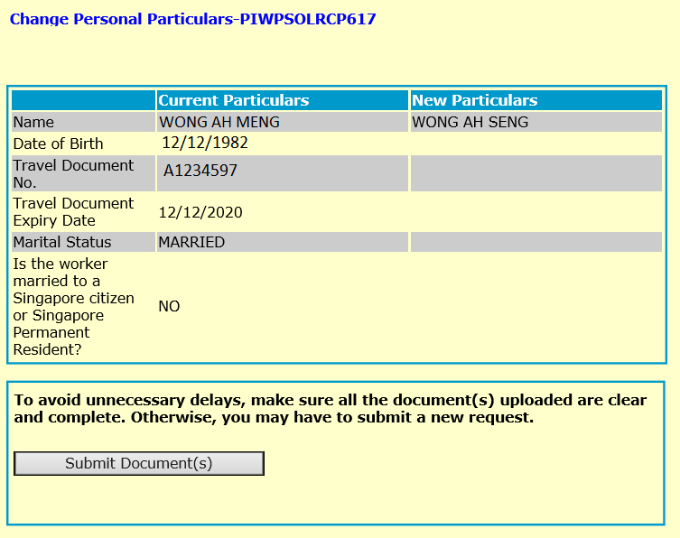
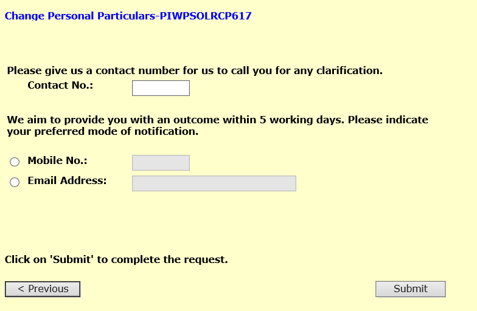
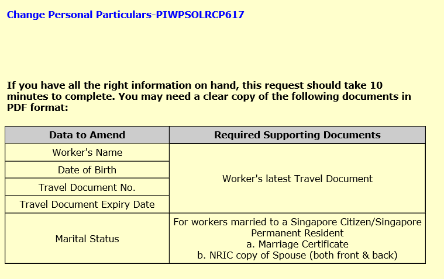
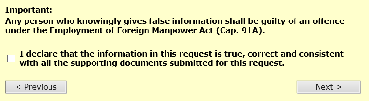
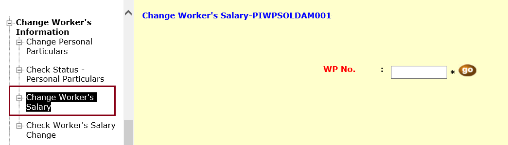
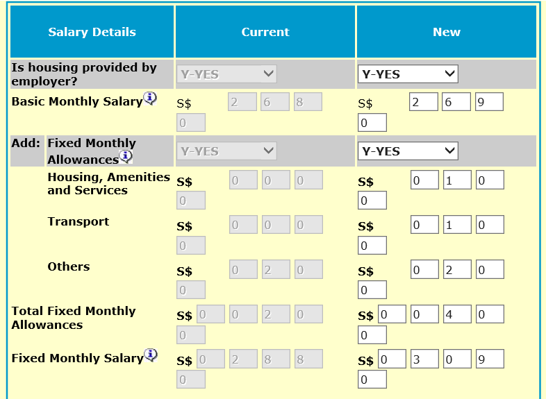
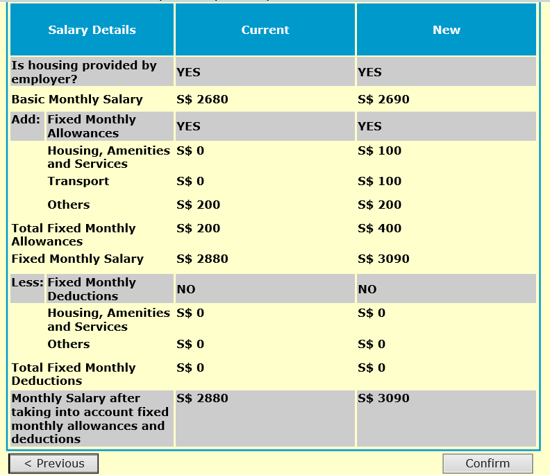

<!-- HCAG:COMPILED id=www.mom.gov.sg.passes-and-permits.work-permit-for-foreign-worker.notify-mom-of-changes -->
---
children: []
content_token_estimate: 43138
descendants: 0
id: www.mom.gov.sg.passes-and-permits.work-permit-for-foreign-worker.notify-mom-of-changes
image_urls: {}
kind: leaf
long_description: 'Covers the employer obligations to notify MOM when changes occur
  during a Work Permit holder''s employment. Defines specific notification requirements
  and deadlines: updating worker''s residential address or mobile number within 5
  days via OFWAS, reporting a missing worker within 1 week (with $2,500 security bond
  forfeiture for non-Malaysians if not found within 1 month of cancellation), cancelling
  the Work Permit within 1 week of a worker''s death, and notifying MOM of pregnancy.
  Details the procedures for changing a worker''s occupation, personal particulars
  (name, DOB, passport, marital status), and salary via WP Online (including step-by-step
  guides), transferring a Work Permit holder to a related company (with distinct processes
  for Malaysian vs non-Malaysian workers and a pre-approval requirement when fewer
  than 20 days remain on the permit), handling business entity changes that alter
  the CPF submission number, updating company name/contact details through CPF Board,
  providing a referee reference for an ex-worker (valid for 2 years), and employer
  obligations upon a worker''s death including bearing cremation/repatriation costs
  and paying outstanding salaries.'
source_files:
- index.md
- user-guide-update-foreign-workers-particulars.md
- user-guide-update-foreign-workers-salary.md
- user-guide-update-foreign-workers-particulars-2.md
- user-guide-update-foreign-workers-salary-2.md
source_urls:
- ''
- ''
- ''
- ''
- ''
subtree_depth: 0
title: Notify MOM of updates for Work Permit holders
token_size_estimate: 43138
---

# Notify MOM of updates for Work Permit holders

<!-- HCAG:CONTENT BEGIN -->
## Content

<!-- source: index.md -->
# Notify MOM of updates: Work Permit

If you employ Work Permit holders, you need to notify MOM of changes during their employment, including updates to company name and address, worker's occupation, passport details, and residential address.

You will need to notify us in these situations:

## Change in business entityShow

You need to inform us if your company is undergoing the following changes that result in a change in the CPF submission number:

- Changing to another type of business entity (e.g. from a sole proprietorship to private limited company), where at least one of the directors, partners or sole proprietors will move to the new entity.
- Undergoing full merger, acquisition or amalgamation of entities.
- Renewing a business registration with a different Accounting and Corporate Regulatory Authority (ACRA) number while keeping the company name.

For these above scenarios, find out [how to transfer your workers to the new company](https://www.mom.gov.sg/faq/work-pass-general/how-do-i-transfer-my-companys-work-pass-holders-if-it-is-undergoing-business-restructuring). 

## If a worker is transferred to a related companyShow

[changing your business entity](#change-in-business-entity)instead.

A Work Permit holder can be transferred to a related company (e.g. subsidiary or parent company). You can get this done by following the steps below.

### For non-Malaysian Work Permit holders

1. You can only transfer workers within the same business sector and you must have the consent of the existing employer. You can proceed to [apply](https://www.mom.gov.sg/eservices/services/work-permit-transactions-for-workers-employed-by-businesses) if the worker’s Work Permit is expiring in more than 20 days, subject to Work Permit criteria. For transfers within 20 days before the Work Permit expiry, you need to[submit a request for pre-approval](https://form.gov.sg/#!/619f539c86c04d0012217f08) first.
2. If your pre-approval request is granted, you can proceed to [apply](https://www.mom.gov.sg/eservices/services/work-permit-transactions-for-workers-employed-by-businesses) for a Work Permit. The application will need to meet all the criteria for hiring a worker in your business sector (e.g. quota).
3. The existing Work Permit will be automatically cancelled once the related company gets the new Work Permit issued.

### For Malaysian Work Permit holders

1. Get the related company to [apply for a new Work Permit](https://www.mom.gov.sg/eservices/services/work-permit-transactions-for-workers-employed-by-businesses) for the employee. Ensure that the company has sufficient quota.
2. [Cancel the existing Work Permit](https://www.mom.gov.sg/passes-and-permits/work-permit-for-foreign-worker/cancel-a-work-permit) when the employment ends. Cancellation must be done before the new employer requests to issue the new Work Permit.

## Change in company's name or contact detailsShow

If your company changes its name or contact details (e.g. address, phone number or email address), you must [update the Central Provident Fund (CPF) Board](https://www.cpf.gov.sg/employer/making-cpf-contributions/updating-employer-s-particulars). 

The CPF Board will then inform us of these changes. This will ensure that you continue to receive important messages and correspondences from us.

**Note:** If your company is also changing its business entity (i.e. leading to a change in its CPF submission number or ACRA number), please refer to the above section on [change in business entity](#change-in-business-entity) instead.

## Change in worker's address or mobile numberShow

You need to update us **within 5 days** if your worker's residential address or mobile number changes. Otherwise the worker may be penalised.

**How to update**

1. (For address updates) Ensure that the new address meets the relevant [housing requirements](https://www.mom.gov.sg/passes-and-permits/work-permit-for-foreign-worker/housing/various-types-of-housing) .
2. Use the [Online Foreign Worker Address Service (OFWAS)](https://www.mom.gov.sg/eservices/services/ofwas) to update the address or mobile number.

## Change in worker's occupationShow

You need to submit a request to us if you want to change the occupation of a Work Permit holder.

You can inform MOM through [WP Online](https://www.mom.gov.sg/eservices/services/wp-online-for-businesses-and-employment-agencies).

[requirements](https://www.mom.gov.sg/passes-and-permits/work-permit-for-foreign-worker/sector-specific-rules/non-traditional-sources-occupation-list#ntsol)that apply to the specific occupation.

## Change in worker's personal particularsShow

You need to inform us of changes in your worker's personal particulars (e.g. passport details).

Please do so by using [WP Online](https://www.mom.gov.sg/eservices/services/wp-online-for-businesses-and-employment-agencies) to update the following details for your worker: 

- Name
- Date of birth
- Marital status
- Passport number or expiry date

[updating using WP Online](https://www.mom.gov.sg/-/media/mom/documents/services-forms/passes/step-by-step-guide/user-guide-update-foreign-workers-particulars.pdf).

For other details, please submit a [request to update the worker’s particulars](https://www.mom.gov.sg/update-wp-details) and upload the relevant supporting documents (e.g. worker’s passport personal particulars page).

**4 working days after**you have received our email that their details have been updated.

## Change in worker's salaryShow

Before you can change your worker's salary, you must:

1. Get the worker's written consent.
2. Inform us of the worker's new salary using [WP Online](https://www.mom.gov.sg/eservices/services/wp-online-for-businesses-and-employment-agencies) .

[how to update your worker's salary](https://www.mom.gov.sg/-/media/mom/documents/services-forms/passes/step-by-step-guide/user-guide-update-foreign-workers-salary.pdf).

However, you are not allowed to amend the salary if the Work Permit is not yet issued.

[meet the minimum Fixed Monthly Salary](https://www.mom.gov.sg/passes-and-permits/work-permit-for-foreign-worker/sector-specific-rules/non-traditional-sources-occupation-list#requirements)under the NTS OL.

## Provide a reference for your workerShow

You can [submit a request](https://go.gov.sg/mom-referee-request) to be a referee for your ex-work pass holder after you have cancelled the work pass.

Upon receiving your request, we will:

- Inform the prospective employer or employment agent who is applying for a work pass for the worker that you have offered to provide a personal reference check.
- Release your contact details so that they can contact you to find out more about the worker’s conduct, character, or work performance, if they wish to do so.

The prospective employer or employment agent may also speak to the foreigner directly before deciding if they want to proceed to apply for the work pass.

This request will be valid for 2 years, but you can submit a request to withdraw at any time.

We are also unable to act based on non-employment related feedback from landlords, housing agents etc. They can choose to either seek legal advice, file a police report, or settle the matter directly with the foreigner.

## If a worker is pregnantShow

You need to [notify MOM](https://go.gov.sg/inform-wp-pregnancy).

If the worker is married, include this additional information:

| If the worker's spouse is | Include this information | 
|---|---|
| Singapore citizen or PR |  | 
| EP or S Pass holder |  | 

## If a worker goes missingShow

You must do these **within 1 week** of knowing that your worker is missing:

1. File a missing person police report.
2. [Cancel the Work Permit](https://www.mom.gov.sg/passes-and-permits/work-permit-for-foreign-worker/cancel-a-work-permit) .

### For a non-Malaysian worker

If the worker is not found within **1 month** from the date the Work Permit was cancelled, $2,500 (half of the $5,000 security bond) will be forfeited to cover the repatriation and other related costs.

## Death of a worker in SingaporeShow

If your worker passes away in Singapore, you need to:

1. [Cancel the Work Permit](https://www.mom.gov.sg/passes-and-permits/work-permit-for-foreign-worker/cancel-a-work-permit)**within 1 week** from the worker's passing. Upload a copy of the following documents when cancelling:
  - **Death certificate**
  - **Airway bill** if the ashes or body has been sent back to the home country or region.
 OR
 **Cremation certificate** if the body has been cremated in Singapore.
2. Bear the costs of cremation or the return of the body to the country or region of origin.
3. Bear the costs of returning the worker's belongings to their families.
4. Pay any outstanding salaries or payments to the worker's estate, e.g. the worker's next of kin or appointed trustee.

<!-- source: user-guide-update-foreign-workers-particulars.md -->
## Page 1

**<u>How to update your worker’s particulars using WP Online</u>** 

## **Step 1:** 

Prepare a clear copy of the supporting documents in PDF format as you may need to upload them to submit your request: 

<!-- Start of picture text -->
Worker’s particulars you wish to update  Supporting documents Name  Personal particulars page of the worker’s latest passport Date of birth Passport number Passport expiry date Marital status  If the worker is married to a Singapore citizen or permanent resident:  Marriage certificate  Spouse’s NRIC (front and back) <!-- End of picture text -->

## **Step 2:** 

Log in to WP Online. Click ‘Change Worker’s Information’ > ‘Change Personal Particulars’ on the left menu. 

## **Step 3:** 

Enter the Work Permit number and click ‘go’ to proceed. 

Last updated on 31 May 2019 

1

## Page 2

**<u>How to update your worker’s particulars using WP Online</u>** 

## **Step 4:** 

Enter the worker’s new particulars under the category you wish to update. Click ‘Next’ to continue. 

Last updated on 31 May 2019 

2

## Page 3

**<u>How to update your worker’s particulars using WP Online</u>** 

## **Step 5:** 

Ensure the worker’s particulars are correct. Click ‘Submit Document(s)’ to upload the supporting documents. Once you have done so, click the declaration checkbox and ‘Next’ button to continue. 

Note: The ‘Submit Document(s)’ button will be disabled if you are not required to submit any supporting documents. 

Last updated on 31 May 2019 

3

## Page 4

# **<u>How to update your worker’s particulars using WP Online</u>** 

<!-- Start of picture text -->
Step 6: <!-- End of picture text -->

<!-- Start of picture text -->
Enter your contact number and select your preferred mode of notification. Click ‘Submit’ to complete your request. <!-- End of picture text -->

Last updated on 31 May 2019 

4

<!-- source: user-guide-update-foreign-workers-salary.md -->
## Page 1

**<u>How to update your worker’s salary using WP Online</u>** 

# **Step 1:** 

Get your worker’s written consent on the salary changes. 

**Step 2:** Log in to WP Online. Click ‘Change Worker’s Information’ > ‘Change Worker’s Salary’ on the left menu. 

# **Step 3:** 

Enter the Work Permit number and click ‘go’ to proceed. 

Last updated on 31 May 2019 

1

## Page 2

**<u>How to update your worker’s salary using WP Online</u>** 

# **Step 4:** 

Enter the worker’s new salary details. Click the declaration checkbox and ‘Submit’ button to proceed. 

Last updated on 31 May 2019 

2

## Page 3

**<u>How to update your worker’s salary using WP Online</u>** 

# **Step 5:** 

You will be shown a warning message. After you have read it, click the checkbox in the warning message. Click the declaration checkbox and ‘Submit’ button again to continue. 

Last updated on 31 May 2019 

3

## Page 4

**<u>How to update your worker’s salary using WP Online</u>** 

**Step 6:** 

Ensure the worker’s new salary details are correct. Click ‘Confirm’ to submit your request. 

Last updated on 31 May 2019 

4

<!-- source: user-guide-update-foreign-workers-particulars-2.md -->
## Page 1

**<u>How to update your worker’s particulars using WP Online</u>** 

## **Step 1:** 

Prepare a clear copy of the supporting documents in PDF format as you may need to upload them to submit your request: 

<!-- Start of picture text -->
Worker’s particulars you wish to update  Supporting documents Name  Personal particulars page of the worker’s latest passport Date of birth Passport number Passport expiry date Marital status  If the worker is married to a Singapore citizen or permanent resident:  Marriage certificate  Spouse’s NRIC (front and back) <!-- End of picture text -->

## **Step 2:** 

Log in to WP Online. Click ‘Change Worker’s Information’ > ‘Change Personal Particulars’ on the left menu. 

## **Step 3:** 

Enter the Work Permit number and click ‘go’ to proceed. 

Last updated on 31 May 2019 

1

## Page 2

**<u>How to update your worker’s particulars using WP Online</u>** 

## **Step 4:** 

Enter the worker’s new particulars under the category you wish to update. Click ‘Next’ to continue. 

Last updated on 31 May 2019 

2

## Page 3

**<u>How to update your worker’s particulars using WP Online</u>** 

## **Step 5:** 

Ensure the worker’s particulars are correct. Click ‘Submit Document(s)’ to upload the supporting documents. Once you have done so, click the declaration checkbox and ‘Next’ button to continue. 

Note: The ‘Submit Document(s)’ button will be disabled if you are not required to submit any supporting documents. 

Last updated on 31 May 2019 

3

## Page 4

# **<u>How to update your worker’s particulars using WP Online</u>** 

<!-- Start of picture text -->
Step 6: <!-- End of picture text -->

<!-- Start of picture text -->
Enter your contact number and select your preferred mode of notification. Click ‘Submit’ to complete your request. <!-- End of picture text -->

Last updated on 31 May 2019 

4

<!-- source: user-guide-update-foreign-workers-salary-2.md -->
## Page 1

**<u>How to update your worker’s salary using WP Online</u>** 

# **Step 1:** 

Get your worker’s written consent on the salary changes. 

**Step 2:** Log in to WP Online. Click ‘Change Worker’s Information’ > ‘Change Worker’s Salary’ on the left menu. 

# **Step 3:** 

Enter the Work Permit number and click ‘go’ to proceed. 

Last updated on 31 May 2019 

1

## Page 2

**<u>How to update your worker’s salary using WP Online</u>** 

# **Step 4:** 

Enter the worker’s new salary details. Click the declaration checkbox and ‘Submit’ button to proceed. 

Last updated on 31 May 2019 

2

## Page 3

**<u>How to update your worker’s salary using WP Online</u>** 

# **Step 5:** 

You will be shown a warning message. After you have read it, click the checkbox in the warning message. Click the declaration checkbox and ‘Submit’ button again to continue. 

Last updated on 31 May 2019 

3

## Page 4

**<u>How to update your worker’s salary using WP Online</u>** 

**Step 6:** 

Ensure the worker’s new salary details are correct. Click ‘Confirm’ to submit your request. 

Last updated on 31 May 2019 

4

<!-- HCAG:CONTENT END -->
