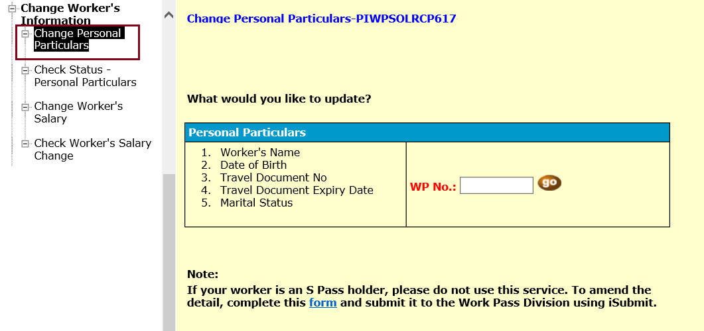
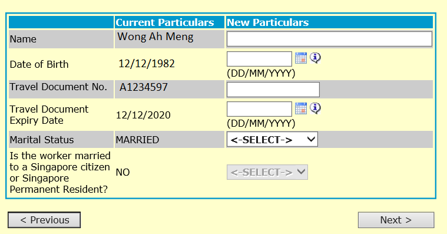

## Page 1

**<u>How to update your worker’s particulars using WP Online</u>** 

## **Step 1:** 

Prepare a clear copy of the supporting documents in PDF format as you may need to upload them to submit your request: 

<!-- Start of picture text -->
Worker’s particulars you wish to update  Supporting documents Name  Personal particulars page of the worker’s latest passport Date of birth Passport number Passport expiry date Marital status  If the worker is married to a Singapore citizen or permanent resident:  Marriage certificate  Spouse’s NRIC (front and back) <!-- End of picture text -->

## **Step 2:** 

Log in to WP Online. Click ‘Change Worker’s Information’ > ‘Change Personal Particulars’ on the left menu. 

## **Step 3:** 

Enter the Work Permit number and click ‘go’ to proceed. 

Last updated on 31 May 2019 

1

## Page 2

**<u>How to update your worker’s particulars using WP Online</u>** 

## **Step 4:** 

Enter the worker’s new particulars under the category you wish to update. Click ‘Next’ to continue. 

Last updated on 31 May 2019 

2

## Page 3

**<u>How to update your worker’s particulars using WP Online</u>** 

## **Step 5:** 

Ensure the worker’s particulars are correct. Click ‘Submit Document(s)’ to upload the supporting documents. Once you have done so, click the declaration checkbox and ‘Next’ button to continue. 

Note: The ‘Submit Document(s)’ button will be disabled if you are not required to submit any supporting documents. 

Last updated on 31 May 2019 

3

## Page 4

# **<u>How to update your worker’s particulars using WP Online</u>** 

<!-- Start of picture text -->
Step 6: <!-- End of picture text -->

<!-- Start of picture text -->
Enter your contact number and select your preferred mode of notification. Click ‘Submit’ to complete your request. <!-- End of picture text -->

Last updated on 31 May 2019 

4

