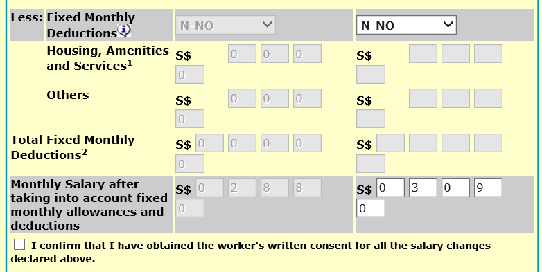
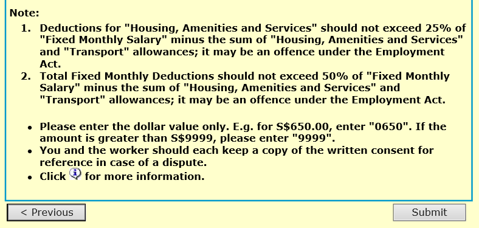
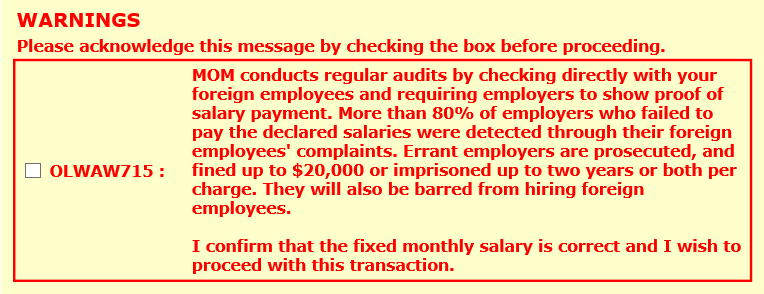
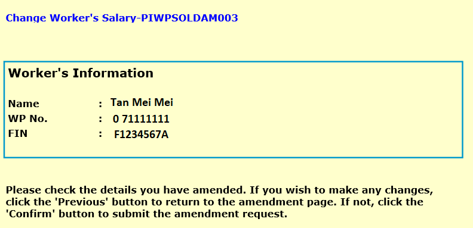

## Page 1

**<u>How to update your worker’s salary using WP Online</u>** 

# **Step 1:** 

Get your worker’s written consent on the salary changes. 

**Step 2:** Log in to WP Online. Click ‘Change Worker’s Information’ > ‘Change Worker’s Salary’ on the left menu. 

# **Step 3:** 

Enter the Work Permit number and click ‘go’ to proceed. 

Last updated on 31 May 2019 

1

## Page 2

**<u>How to update your worker’s salary using WP Online</u>** 

# **Step 4:** 

Enter the worker’s new salary details. Click the declaration checkbox and ‘Submit’ button to proceed. 

Last updated on 31 May 2019 

2

## Page 3

**<u>How to update your worker’s salary using WP Online</u>** 

# **Step 5:** 

You will be shown a warning message. After you have read it, click the checkbox in the warning message. Click the declaration checkbox and ‘Submit’ button again to continue. 

Last updated on 31 May 2019 

3

## Page 4

**<u>How to update your worker’s salary using WP Online</u>** 

**Step 6:** 

Ensure the worker’s new salary details are correct. Click ‘Confirm’ to submit your request. 

Last updated on 31 May 2019 

4

