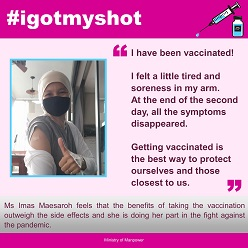
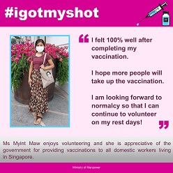
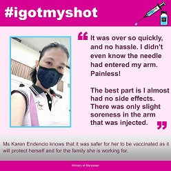
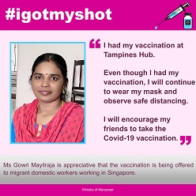

<!-- HCAG:COMPILED id=www.mom.gov.sg.passes-and-permits.work-permit-for-foreign-worker.recreation-well-being-and-other-resources-for-migrant-workers.educational-resources-on-covid-19-vaccination -->
---
children: []
content_token_estimate: 6755
descendants: 0
id: www.mom.gov.sg.passes-and-permits.work-permit-for-foreign-worker.recreation-well-being-and-other-resources-for-migrant-workers.educational-resources-on-covid-19-vaccination
image_urls: {}
kind: leaf
long_description: Provides educational and outreach materials about COVID-19 vaccination
  aimed at work pass holders in Singapore, including migrant domestic workers. Contains
  downloadable posters, multilingual testimonial graphics (#igotmyshot in English
  paired with Bahasa Indonesia, Burmese, Tagalog, and Tamil), and references to doctor
  Q&A videos. Lists a specific medical centre (Onboard@Sengkang West) with address,
  walk-in hours, and vaccine type available for Work Permit and S Pass workers in
  CMP sectors or staying in dormitories, and notes that all pass holders can approach
  any vaccination location for vaccination or additional doses.
source_files:
- index.md
source_urls:
- ''
subtree_depth: 0
title: COVID-19 vaccination educational resources for work pass holders
token_size_estimate: 6755
---

# COVID-19 vaccination educational resources for work pass holders

<!-- HCAG:CONTENT BEGIN -->
## Content

<!-- source: index.md -->
# Educational resources on COVID-19 vaccination for work pass holders

## Get Vaccinated, Get Protected

Download [“Get Vaccinated, Get Protected”](https://www.mom.gov.sg/-/media/mom/documents/covid-19/get-vaccinated-get-protected.pdf) to find out why COVID-19 vaccination is important, and why you should get vaccinated.

## Ask a doctor about the COVID-19 vaccine

Watch doctors address some common questions about the COVID-19 vaccine.

## What is it like to get vaccinated?

Check out what our migrant worker friends have to say about their vaccination experience.

### What our migrant domestic workers say

Our migrant domestic workers share their experience on their COVID-19 vaccinations.

[English and Bahasa Indonesia](https://www.mom.gov.sg/-/media/mom/documents/covid-19/vaccine-info/igotmyshot-english-and-bahasa-indonesia.jpg)

[English and Burmese](https://www.mom.gov.sg/-/media/mom/documents/covid-19/vaccine-info/igotmyshot-english-and-burmese.jpg)

[English and Tagalog](https://www.mom.gov.sg/-/media/mom/documents/covid-19/vaccine-info/igotmyshot-english-and-tagalog.jpg)

[English and Tamil](https://www.mom.gov.sg/-/media/mom/documents/covid-19/vaccine-info/igotmyshot-english-and-tamil.jpg)

## Resources for work pass holders

Find out about getting your vaccination and additional dose.

## What COVID-19 vaccines can I take?Show

You may refer to the [list of vaccines available under the National Vaccination Programme](https://www.moh.gov.sg/covid-19/vaccination).

## Why and how to get the COVID-19 vaccinationShow

Download the posters to find out why you should go for the vaccination, and how you can register for it.

All pass holders can approach any vaccination location to receive their vaccination or additional dose.

Work Permit and S Pass workers working in CMP sectors or staying in dormitories can also contact any of the following medical centres to book an appointment for vaccination or an additional dose.

| Medical centre | Address and booking details | Vaccine type | 
|---|---|---|
| Onboard@Sengkang West | 20A Seletar West Road 1 Singapore 798991  [See location](https://go.gov.sg/vaccinationatonboardskw) Walk-in: 9.00am – 4.00pm | Moderna/Spikevax Monovalent (XBB 1.5)  | 

## Why get your additional dose of COVID-19 vaccinationShow

[publications and resources for migrant domestic workers](https://www.mom.gov.sg/passes-and-permits/work-permit-for-foreign-domestic-worker/publications-and-resources).

### COVID-19 vaccination - Did you know?

Check out the answers to common questions on COVID-19 vaccination.

<!-- HCAG:CONTENT END -->
