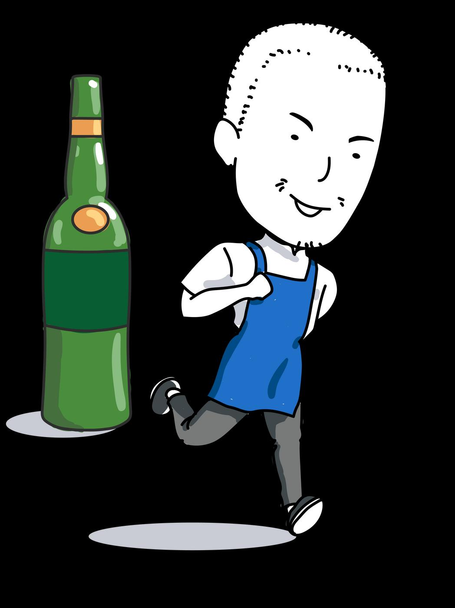

## Page 1

<!-- Start of picture text -->
থাকার স্বাস্থ্যবান তনয়মাবেী মদ্যপানআসক্তি মদ্যপানীয়রমানদ্ন্ডটাকী? <!-- End of picture text -->

- অতধেকগ্লাস (১০০নিনি) ওয়াইনএ১৫শতাাংশিদ্ োতক। 

   - একশট (৩০নিনি) স্পিনরট এ৪০শতাাংশিদ্োতক। 

- এককযানননয়নিতনিয়ার যেইটাতত৪যেতক৫শতাাংশ িদ্যপানীয়োকতি। 

*এককযাননিয়ার৮শতাাংশিদ্এরপনরিান হতেদ্ুইটাপানীয়রসিান। 

<!-- Start of picture text -->
? <!-- End of picture text -->

**একবাররঅতিতরিপানকরাকারকবরে?** ২টটরযিনশপানীয়গ্রহণকরা 

**অতনয়তিিমদ্যপানকারকবরে?** 

- একিাতর৫িাএরঅনধকিদ্যপানীয়পানকরা। 

- একিাতরঅনতনরক্তিদ্যপানযরাক, উচ্চরক্তচাপ, দ্ূর্েটনা, িৃতযযএিাংেকৃতযরাগএরঝুনকিানিতয়যদ্য়।

## Page 2

# **ননশারেক্ষণঃ** 

- হুশহারাতনারজনযিদ্যপানকরা। 

- িদ্যপাননাকরতিঅনিরতা, র্ািাতনািািনিিনিভািহতি। 

- পানকরারপনরিাণকিাততনাপারা। 

- যিনশযিনশপানকরারইোঅনুভিকরাএিাংিদ্এরযনশা যেতকযিরহওয়ারকষ্টিৃদ্ধিপাওয়া। 

- কাজএিাংসর্ম্েকপ্রভানিতহয়। 

# **দ্াতয়রেরসারথকীভারবপানকররবনঃ** 

- ডাক্তারএরকাছযেতকআতগপরীক্ষাকনরতয়ননততহতিযেপানকরা োতরনানক, আরওেনদ্আপতনঔষুতধরউপরোতকন। 

- • পানকরারসিয়এিাংতারআতগনকছযযেতয়ননন। 

- আতেধীতরপানকরুন। 

- িদ্যপানকরারসিয়গানিচািাতিনািাযকানযিনশনিাদ্ধজননসও না। 

- িদ্যপানএরসীিারিতধযপানকরুন। (নিয়ারএরদ্ুইকযান) 

- • িদ্যপানযকনািিানশেুন। 

# **সাহায্যতননয্তদ্য্তদ্আপরনমরনর কররননয্মদ্যপানআপনার দদ্ননতদ্নজীবনএবংকারজর সমসযাসৃষ্টিকররে।** 

- Migrant Workers’ Centre - 6536 2692 

- HealthServe - 3129 5000 

## **Proudly presented by:** 

সূত্র _:_ 

_1. “Why is binge drinking bad for you”. HealthHub. March 2022._ 

_2. “Responsible drinking. Know your alcohol limit”. HealthHub. March 2022._

