<!-- HCAG:COMPILED id=www.mom.gov.sg.passes-and-permits.work-permit-for-foreign-worker.recreation-well-being-and-other-resources-for-migrant-workers.health-well-being-resources-for-mws -->
---
children: []
content_token_estimate: 1089278
descendants: 0
id: www.mom.gov.sg.passes-and-permits.work-permit-for-foreign-worker.recreation-well-being-and-other-resources-for-migrant-workers.health-well-being-resources-for-mws
image_urls: {}
kind: leaf
long_description: A hub page listing health and well-being topics for migrant workers,
  organized under healthy living (nutrition, physical activity, alcohol use, tobacco
  use), chronic diseases (diabetes, high cholesterol, hypertension), mental health
  (tips for workers, employer/dormitory operator guides), oral health, infectious
  diseases (chickenpox, COVID-19, dengue, monkeypox, STIs, tuberculosis), and disease
  prevention/hygiene. The page itself provides brief introductory descriptions of
  each category but links out to separate resources for detail. It also directly contains
  a multilingual infographic on balanced diet and the 7 major nutrients (carbohydrates,
  proteins, fats, vitamins, minerals, fibre, water), available in English, Bahasa
  Indonesia, Bengali, Mandarin, Tamil, Thai, and Vietnamese.
source_files:
- index.md
- 7-major-nutrients-bahasa.md
- 7-major-nutrients-bengali.md
- 7-major-nutrients-english.md
- 7-major-nutrients-mandarin.md
- 7-major-nutrients-tamil.md
- 7-major-nutrients-thai.md
- 7-major-nutrients-vietnamese.md
- alcohol-use-bahasa.md
- alcohol-use-bengali.md
- alcohol-use-english.md
- alcohol-use-mandarin.md
- alcohol-use-tamil.md
- alcohol-use-thai.md
- alcohol-use-vietnamese.md
- debunking-myths-about-nutrition-bahasa.md
- debunking-myths-about-nutrition-bengali.md
- debunking-myths-about-nutrition-english.md
- debunking-myths-about-nutrition-mandarin.md
- debunking-myths-about-nutrition-tamil.md
- debunking-myths-about-nutrition-thai.md
- debunking-myths-about-nutrition-vietnamese.md
- drinking-8-cups-of-water-bahasa.md
- drinking-8-cups-of-water-bengali.md
- drinking-8-cups-of-water-english.md
- drinking-8-cups-of-water-mandarin.md
- drinking-8-cups-of-water-tamil.md
- drinking-8-cups-of-water-thai.md
- drinking-8-cups-of-water-vietnamese.md
- healthy-snacks-bahasa.md
- healthy-snacks-bengali.md
- healthy-snacks-english.md
- healthy-snacks-mandarin.md
- healthy-snacks-tamil.md
- healthy-snacks-thai.md
- healthy-snacks-vietnamese.md
- hidden-sugar-bombshells-bahasa.md
- hidden-sugar-bombshells-bengali.md
- hidden-sugar-bombshells-english.md
- hidden-sugar-bombshells-mandarin.md
- hidden-sugar-bombshells-tamil.md
- hidden-sugar-bombshells-thai.md
- hidden-sugar-bombshells-vietnamese.md
- how-to-deal-with-personal-problems-bengali.md
- how-to-deal-with-personal-problems-burmese.md
- how-to-deal-with-personal-problems-mandarin.md
- how-to-deal-with-personal-problems.md
- how-to-handle-issues-at-work-bengali.md
- how-to-handle-issues-at-work-burmese.md
- how-to-handle-issues-at-work-mandarin.md
- how-to-handle-issues-at-work-tamil.md
- how-to-handle-issues-at-work-thai.md
- how-to-handle-issues-at-work-vietnamese.md
- how-to-handle-issues-at-work.md
- physical-activity-bahasa.md
- physical-activity-bengali.md
- physical-activity-english.md
- physical-activity-mandarin.md
- physical-activity-tamil.md
- physical-activity-thai.md
- physical-activity-vietnamese.md
- support-and-care-for-your-friends-bengali.md
- support-and-care-for-your-friends-chinese.md
- support-and-care-for-your-friends-english.md
- support-and-care-for-your-friends-tamil.md
- tips-for-a-healthier-you-diabetes-bahasa.md
- tips-for-a-healthier-you-diabetes-bengali.md
- tips-for-a-healthier-you-diabetes-mandarin.md
- tips-for-a-healthier-you-diabetes-tamil.md
- tips-for-a-healthier-you-diabetes-thai.md
- tips-for-a-healthier-you-diabetes-vietnamese.md
- tips-for-a-healthier-you-diabetes.md
- tips-for-a-healthier-you-high-blood-pressure-bahasa.md
- tips-for-a-healthier-you-high-blood-pressure-bengali.md
- tips-for-a-healthier-you-high-blood-pressure-mandarin.md
- tips-for-a-healthier-you-high-blood-pressure-tamil.md
- tips-for-a-healthier-you-high-blood-pressure-thai.md
- tips-for-a-healthier-you-high-blood-pressure-vietnamese.md
- tips-for-a-healthier-you-high-blood-pressure.md
- tips-for-a-healthier-you-high-cholesterol-bahasa.md
- tips-for-a-healthier-you-high-cholesterol-bengali.md
- tips-for-a-healthier-you-high-cholesterol-mandarin.md
- tips-for-a-healthier-you-high-cholesterol-tamil.md
- tips-for-a-healthier-you-high-cholesterol-thai.md
- tips-for-a-healthier-you-high-cholesterol-vietnamese.md
- tips-for-a-healthier-you-high-cholesterol.md
- tobacco-use-bahasa.md
- tobacco-use-bengali.md
- tobacco-use-english.md
- tobacco-use-mandarin.md
- tobacco-use-tamil.md
- tobacco-use-thai.md
- tobacco-use-vietnamese.md
source_urls:
- ''
- ''
- ''
- ''
- ''
- ''
- ''
- ''
- ''
- ''
- ''
- ''
- ''
- ''
- ''
- ''
- ''
- ''
- ''
- ''
- ''
- ''
- ''
- ''
- ''
- ''
- ''
- ''
- ''
- ''
- ''
- ''
- ''
- ''
- ''
- ''
- ''
- ''
- ''
- ''
- ''
- ''
- ''
- ''
- ''
- ''
- ''
- ''
- ''
- ''
- ''
- ''
- ''
- ''
- ''
- ''
- ''
- ''
- ''
- ''
- ''
- ''
- ''
- ''
- ''
- ''
- ''
- ''
- ''
- ''
- ''
- ''
- ''
- ''
- ''
- ''
- ''
- ''
- ''
- ''
- ''
- ''
- ''
- ''
- ''
- ''
- ''
- ''
- ''
- ''
- ''
- ''
- ''
subtree_depth: 0
title: Health and well-being resources for migrant workers
token_size_estimate: 1089278
---

# Health and well-being resources for migrant workers

<!-- HCAG:CONTENT BEGIN -->
## Content

<!-- source: index.md -->
# Health and well-being resources for migrant workers

Living a healthy lifestyle can help reduce the risk of chronic diseases and other health conditions. Having good personal hygiene keeps you healthy and stops the spread of infections. By taking care of your overall health, you will also feel more energised and productive.

Explore disease prevention and health tips on the following topics.

## Topics

## Healthy living

Besides keeping yourself free from diseases, you should also look after your physical and mental health. This means eating a balanced diet, getting regular exercise, avoiding tobacco and getting enough rest.

## NutritionShow

A healthy diet replenishes the body's nutritional needs and supports tissue repair leading to overall well-being. Good nutrition is also key to good mental and physical health. Long-term poor nutrition may lead to costly diseases, including strokes, heart diseases and some cancers.

Find out how to include healthy options in your daily meals with these tips:

### Debunking myths about nutrition

### Drink 8 cups of water

### Eat healthy, live happy

### Healthy snacks

### 8 hidden sugar bombshells in your diet

### Healthy cooking – Chicken Biryani

### Healthy cooking – Assam Fish Curry

## Physical activityShow

Regular physical activity enhances your mental well-being by releasing ‘feel-good hormones’ such as endorphins. Exercise also helps to burn calories, get rid of excess body fat and control your body weight. It reduces the risks of chronic diseases and its complications such as heart attacks and stroke.

Find out more on how you and your friends can stay healthy through physical activities:

### Physical activity

### Home workouts for you and your friends

## Alcohol useShow

Long-term alcohol use and misuse can have serious health risks such as liver disease, cancers and stomach ulcers. Alcohol when consumed in excess will also impair judgment and lead to riskier actions. In its most severe form, alcohol addiction is a chronic disorder where you may not have control over your alcohol intake.

Find out more on alcohol addiction and how you and your friends can seek help:

### Alcohol use

## Tobacco useShow

All forms of tobacco are harmful and addictive. There is no safe tobacco product. Cigarette smoking exposes your body to very harmful chemicals that can cause cancer. Long-term exposure to tobacco smoke puts you at a higher risk for cancer, stroke, heart and lung disease, and airway infections that can affect your quality of life.

Find out more on how you can quit smoking safely:

### Tobacco use

## Chronic diseases

Chronic diseases such as high cholesterol, Diabetes and Hypertension (high blood pressure) can be prevented and well managed with a good diet and lifestyle. Poorly controlled chronic diseases may affect your quality of life and increase your risks of complications and need for more medical treatments.

Find out how you can be in control of your chronic condition with these tips:

## DiabetesShow

### Diabetes

## High cholesterolShow

### High cholesterol

## HypertensionShow

### Hypertension

## Mental health

Mental health is important for everyone. It impacts our thoughts, behaviours and emotions. Being emotionally healthy promotes productivity at work, helps you interact well with your friends and allows you to adapt to changes in your life and cope with challenges.

## Tips and resources for workersShow

### Support and care for your friends

### How to handle issues at work

### How to deal with personal problems

### How to cope with living in a new country

### Self-care tips migrant workers

### Light up your life guide

### Staying well and informed on mental health

### Wellness in mind and body

### Videos on counselling helplines available for migrant workers

### World suicide prevention day

### Available channels for migrant workers to seek help

## Guide for employers and dormitory operatorsShow

### Psychological first aid guide for employers and dormitory operators

Read this [Psychological First Aid Guide](https://www.mom.gov.sg/-/media/mom/documents/publications/health-well-being-resources/mental-health/employers-and-dormitories-guide-to-provide-mental-health-support-for-workers.pdf) to learn how to:

- Recognise signs of distress in your workers
- Support your workers through simple measures like the setting up a buddy system.

## Oral health

Good oral hygiene keeps your teeth free from decay and prevents infection in the mouth. Untreated or undiagnosed oral diseases may increase the risk of adverse health conditions such as heart inflammation, heart disease or severe gum problems. Regular dental visits can help you to identify oral problems earlier and save on dental cost.

See quick tips on easy oral care:

## Oral careShow

### Dental care tips

## Infectious diseases

Infectious diseases are caused by micro-organisms such as bacteria, viruses, fungi or parasites that are passed directly or indirectly, such as through mosquitoes, from one person to another. Some examples include common cold, Influenza, Coronaviruses and Dengue.

A weak immune system, unhygienic practices or travel to endemic areas can increase your risk of getting an infectious disease. Good personal hygiene and living habits can protect you from getting infected or seriously ill.

## ChickenpoxShow

Chickenpox is a viral infection that causes rashes with small, itchy blisters on the skin of the whole body. Symptoms may include fever, headache and body ache, which is then followed by the characteristic rash. It can spread easily from one person to another through droplet transmission often via direct contact.

Persons who have not had the infection or vaccination against chickenpox are more likely to be infected. While Chickenpox is harmless to most people, it can lead to complications in people with weaker immune systems. Seek medical attention if you have these symptoms and get vaccinated to protect yourself from Chickenpox

## COVID-19Show

COVID-19 is an infectious disease caused by the SARS-CoV-2 virus. Most people who are vaccinated and are infected with the virus will experience mild to moderate respiratory illness and self-recover. However, COVID-19 can result in severe disease in those who are not vaccinated. Protect yourself and others from infection by keeping updated on your vaccinations and maintain good personal hygiene practices as such washing your hands frequently.

Protect yourself and others from infection by:

- Staying up to date on your [COVID-19 vaccinations](https://www.mom.gov.sg/passes-and-permits/work-permit-for-foreign-worker/recreation-well-being-and-other-resources-for-migrant-workers/educational-resources-on-covid-19-vaccination)
- Maintaining [good personal hygiene practices](#good-hygiene-practices)

### How you can reduce the spread of COVID-19?

### Dr Ashif explains what is COVID-19

### Foreign workers talk about COVID-19

## DengueShow

Dengue fever is a tropical disease caused by a virus that is carried by the Aedes mosquito. The virus can cause fever, headaches, rashes and pain throughout the body. In rare cases, Dengue fever can lead to more serious medical complications and even death.

To prevent the spread of Dengue, it is important to stop the breeding of mosquitoes at your residence such as dormitories and at worksites.

You can take simple steps to protect yourself and your friends from dengue:

- Protect yourself against mosquito bites. Apply a mosquito repellent to exposed skin or clothing. Wear light-coloured clothing or long sleeves and pants for maximum coverage.
- Spray insecticide in dark corners around the room.
- Prevent mosquito breeding at worksite or dormitories. Do not let water stagnate in any containers.

### Stop Dengue at our Dormitories

## MonkeypoxShow

Monkeypox is a viral disease that is caused by the monkeypox virus. Monkeypox is generally a self-recovering illness that presents with fever and rash. However, serious complications or death can occur in some individuals. Good hygiene habits can protect you and your friends from getting infected with the virus.

As the vast majority of current cases are spread through sexual encounters, avoiding high risk sexual activities (e.g. multiple partners) will protect yourself from being infected or further disease transmission.

See the infographic to find out more on [Monkeypox symptoms and prevention tips](https://www.mom.gov.sg/-/media/mom/documents/publications/health-well-being-resources/infectious-diseases/monkeypox-infographic.pdf).

## Sexually Transmitted Infections (STIs)Show

Sexually Transmitted Infections (STIs) are passed from one person to another through sexual contact. These infections may spread via vaginal, anal or oral sex. While some people may not show any symptoms of being infected, you should look out for the following symptoms:

- Sores or bumps on genitals, near your mouth or rectal area
- Painful or burning feeling during urination
- Discharge from the penis
- Swollen lymph nodes near your genitals
- Rashes on hands, feet and rectal area

You should see a doctor immediately and seek treatment if:

- You have symptoms of a STI.
- You are sexually active and think you may have been exposed to STIs through your partner.

There may be serious health risks involved with STIs so it is important to protect yourself through safe sex practices.

If you are infected and need to talk to someone about how you feel, call the following helpline:

**HealthServe’s helpline:** [3129 5000](tel:31295000)

## TuberculosisShow

Tuberculosis (TB) is a bacterial infection that mainly affects the lungs. It is treatable and hence is important for TB patients to complete their medications as directed.

You can get infected if you inhale small droplets from the cough or sneeze of an infected person. Generally, after 2 weeks of medication, the TB patient will no longer be infectious.

Look out for the following symptoms of TB:

- Coughing blood
- Fever
- Chest pain
- Chills
- Prolonged cough
- Tiredness
- Night sweats
- Weight loss

You should see a doctor immediately if you have the above symptoms. If infected, you must complete the whole course of medication to be cured.

Here are some TB prevention tips that you can share with your friends:

- Practice good hygiene habits such as frequent hand washing with soap and not sharing food and drinks
- Go for a medical check-up at any Medical Centre for Migrant Workers (MCMWs) if you suspect any TB symptoms
- Adopt healthier lifestyle practices to make your immune system strong

## Preventing the spread of diseases

Effective infection prevention and control (IPC) practices reduce the risk of infection transmission between you and your friends. This includes good hygiene practices to prevent the spread of infectious diseases such as [COVID-19](#covid-19), influenza and gastrointestinal infections. Keeping your hands clean is an important step you can take to avoid falling sick. 

Learn how to keep you and your friends safe:

### The coolest hand wash guide

Check out this fun video and learn the 8 steps to washing your hands properly.

### Tips to keep your dorm pest-free

### When taking public transport

### When at eating places

The Antigen Rapid Test (ART) is a fast and easy swab test that you can use to test if you have been infected with the COVID-19 virus.

### How to use the ART kit

Watch this step-by-step video on how to use your ART kit. The test takes less than 20 minutes, and is safe and easy to do.

<!-- source: 7-major-nutrients-bahasa.md -->
## Page 1

# Tips untuk membuat  Anda yang Lebih Sehat 

**Makan sehat, hidup bahagia!** 

**Kita harus mengonsumsi makanan seimbang yang mengandung 7 nutrisi utama ini:** 

**1. Karbohidrat** adalah bahan bakar utama bagi tubuh Anda dan penting untuk pekerjaan yang dilakukan secara fisik. Karbohidrat ditemukan dalam nasi, biji-bijian atau sayuran. 

**2. Protein** memelihara otot, tulang, organ, kulit, dan kuku Anda tetap sehat. Protein ditemukan dalam daging, telur atau kacang-kacangan. 

**3. Lemak** menyerap vitamin dan membantu melindungi organ. Lemak ditemukan dalam kacang-kacangan atau produk susu. 

**4. Vitamin** seperti A, C, D dan E, sangat penting untuk sistem kekebalan dan saraf. Vitamin ditemukan dalam buah-buahan dan sayuran. 

**5. Minerals** are important for bones, immunity and nerve function. They are found in leafy green vegetables or legumes. 

**6. Serat** membantu sistem pencernaan kita. Serat ditemukan dalam buah-buahan, sayuran, dan biji-bijian. 

**7. Air** membersihkan tubuh kita dari racun. Kita tidak hanya bisa minum air putih, tetapi kita juga bisa mengonsumsinya di dalam sayuran berdaun hijau atau buah-buahan yang mengandung berair.

<!-- source: 7-major-nutrients-bengali.md -->
## Page 1

**স্বাস্থ্য্ান থাোর চনেমা্লী স্বাস্থ্যেরখা্ারখান, সুদখ্ াাঁিুন! আমাদেরদেএেটিসুষমখােযগ্রহণেরাউচিতযেটিদতরদেদেএই ৭টিপ্রধানপুচি:** 

**1. োদ্বাহাইদেট** আপনারশরীরররজনযপ্রধানজ্বালানীএবংশারীররকশ্ **র** ের জনযগুরুত্বপূর্ণ। এগুরলচাল, শস্যবাশাকস্বরজরেপাওযাযায। 

**2. যপ্রাটিন** আপনারপপশী, হাড়, অঙ্গ, ত্বকএবংনখস্ুস্থরারখ। এগুরলোংস্, রিেবাবাদারেপাওযাযায। 

**3. িচ্ব** রিটারেনপশাষর্কররএবংঅঙ্গপ্রেঙ্গরক্ষাকররেস্াহাযযকরর। এগুরল বাদােবাদুগ্ধজােদ্ **র** বযপাওযাযায। 

- জনয 

- **4. চিটাচমন** পযেনA, C, D এবংE, অনাক্রেযোেন্ত্রএবংস্নাযুেরন্ত্ অপররহাযণ। এগুরলফলএবংস্বরজরেপাওযাযায। 

**5. খচনজ** হাড়, অনাক্রেযোএবংস্নাযুরকাযণকাররোরজনযগুরুত্বপূর্ণ। এগুরলা স্বুজশাকস্বরজবাবীজএপাওযাযায। 

**6. ফাই্ার** আোরদরপররপাকেন্ত্ **র** কস্াহাযযকরর। এগুরলফল, শাকস্বরজএবং শরস্যপাওযাযায। 

**7. জল** আোরদরশরীররররবষাক্তপদার্ণপররষ্কারকরর। আেরাজলপানকররে পারর, আবারস্বুজশাকস্বরজবাজলযুক্তফরলরপর্রকওজলগ্রহর্কররে পারর।

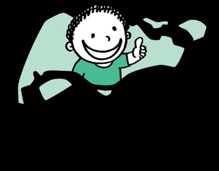

<!-- source: 7-major-nutrients-english.md -->
## Page 1

# **Eat healthy, live happy!** 

**We should intake a balanced diet of foods with these 7 major nutrients:** 

**1. Carbohydrates** are the main fuel for your body and are important for physical labour. They are found in rice, grains or vegetables. 

**2. Proteins** keep your muscles, bones, organs, skin and nails healthy. They are found in meat, eggs or nuts. 

**3. Fats** absorb vitamins and help protect organs. They are found in nuts or dairy products. 

**4. Vitamins** such as A, C, D and E, are essential for the immune and nervous systems. They are found in fruits and vegetables. 

**5. Minerals** are important for bones, immunity and nerve function. They are found in leafy green vegetables or legumes. 

**6. Fibres** help our digestive system. They are found in fruits, vegetables, and grains. 

**7. Water** cleanses our body of toxins. Not only can we drink water, but we can also consume it within leafy green vegetables or watery fruits

<!-- source: 7-major-nutrients-mandarin.md -->
## Page 1

# **让您活得更 加健康的小贴士** 

## **吃得健康，活得开心！** 

**我们应该摄取具有以下7 种主要营养素的均衡饮食：** 

**1. 碳水化合物** 是身体的主要燃料，对体力劳动很重要。它们存在 于大米、谷物或蔬菜中。 

**2. 蛋白质** 使您的肌肉、骨骼、器官、皮肤和指甲保持健康。它们 存在于肉类、鸡蛋或坚果中。 

**3. 脂肪** 吸收维生素，有助于保护器官。它们存在于坚果或乳制品 中。 

**4. 维生素** ，如A、C、D 和E，对免疫和神经系统至关重要。它们 存在于水果和蔬菜中。 

**5. 矿物质** 对骨骼、免疫和神经功能很重要。它们存在于绿叶蔬菜 或豆类中。 

**6. 纤维** 帮助我们的消化系统。它们存在于水果、蔬菜和谷物中。 

**7. 水** 可以净化我们体内的毒素。我们不仅可以喝水，还可以在绿 叶蔬菜或含水水果中摄取水。

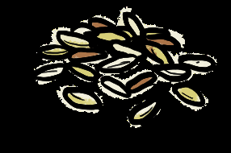

<!-- source: 7-major-nutrients-tamil.md -->
## Page 1

**நீங்கள் ஆவரொக்கியமொக இருக்க உதேிக்குறிப்புகள் ஆவரொக்கியமொகசொப் ிடுங்கள், மகிழ்ச்சியொகேொழுங்கள்! இந்த7 முக்கியசத்துக்கள்ககொண்டசமச்சீரொன உணவுகளைநொம்உட்ககொள்ைவேண்டும்:** 

**1. கொர்வ ொளைட்வரட்டுகள்** உங்கள்உடலுக்குமுக்கியஎரிப ொரு மற்றும் உடல்உழைப்புக்குமுக்கியமொனழை. அழைஅரிசி, தொனியங்கள்அல்லது கொய்கறிகளில்கொணப் டுகின்றன. 

**2. புரதங்கள்** உங்கள்தழசகள், எலும்புகள், உறுப்புகள், ததொல்மற்றும் நகங்கழளஆத ொக்கியமொகழைத்திருளக்கின்றன. அழைஇழறச்சி, 

   - முட்ழடஅல்லதுபகொட்ழடகளில்கொணப் டுகின்றன. 

**3. ககொழுப்புகள்** ழைட்டமின்கழளஉறிஞ்சிஉறுப்புகழளப் ொதுகொக்க உதவுகின்றன. அழைபகொட்ழடகள்அல்லது ொல்ப ொருளட்களில் 

   - கொணப் டுகின்றன. 

**4. ளேட்டமின்கள்** ஏ, சி, டிமற்றும்ஈ, தநொபயதிர்ப்புமற்றும்ந ம்பு மண்டலங்களுக்குஅைசியம். அழை ைங்கள்மற்றும்கொய்கறிகளில் கொணப் டுகின்றன. 

5. எலும்புகள், தநொய்எதிர்ப்புசக்திமற்றும்ந ம்புபசயல் ொட்டிற்கு **தொதுக்கள்** முக்கியம். அழைஇழல ச்ழசகொய்கறிகள்அல்லது ருளப்பு ைழககளில்கொணப் டுகின்றன. 

**6. நொர்ச்சத்து** நமதுபசரிமொனஅழமப்புக்குஉதவுகிறது. அழை ைங்கள், 

   - கொய்கறிகள்மற்றும்தொனியங்களில்கொணப் டுகின்றன. 

**7. தண்ணீர்** நம்உடலில்உள்ளநச்சுக்கழளசுத்தப் டுத்துகிறது. நொம் தண்ணீழ மட்டும்குடிக்கமுடியொது, ஆனொல்இழல ச்ழசகொய்கறிகள் 

   - அல்லதுநீர் ைங்கள்உள்ளஅழதஉட்பகொள்ளலொம்.

<!-- source: 7-major-nutrients-thai.md -->
## Page 1

# **ข้อแนะน าเพื่อให้ สุขภาพคุณดีขึ้น** 

**กินเพื่อสุขภาพดี ใช้ชีวิตให้มีความสุข! เราควรรับประทานอาหารที่มีความสมดุล และ ประกอบด้วยสารอาหารหลัก 7 อย่างเหล่านี้:** 

**1. คาร์โบไฮเดรต** เป็นแหล่งพลังงานหลักส าหรับร่างกายของเรา และมี ความส าคัญต่อการใช้แรงงาน พบได้ในข้าว ธัญพืช หรือผัก 

**2. โปรตีน** ช่วยท าให้กล้ามเนื้อ กระดูก อวัยวะ ผิวหนังและเล็บแข็งแรง พบได้ในเนื้อ ไข่ หรือถั่ว 

**3. ไขมัน** ช่วยดูดซับวิตามินและปกป้องอวัยวะต่างๆพบได้ในถั่วหรือ ผลิตภัณฑ์จากนม 

**4. วิตามิน** เช่น A, C, D และ E มีความจ าเป็นส าหรับระบบภูมิคุ้มกันและ ระบบประสาท พบได้ในผักและผลไม้ 

**5. แร่ธาตุ** มีความส าคัญต่อกระดูก ภูมิคุ้มกัน และการท างานของ เส้นประสาท พบได้ในผักใบเขียวหรือพืชตระกูลถั่ว 

**6. ไฟเบอร์** ช่วยระบบย่อยอาหารของเรา พบได้ในผัก ผลไม้ และธัญพืช 

**7. น ้า** ช าระสารพิษจากร่างกาย เราสามารถดื่มน ้าได้โดยตรง และรับจาก การทานผักใบเขียว หรือผลไม้ที่มีปริมาณน ้าสูง

<!-- source: 7-major-nutrients-vietnamese.md -->
## Page 1

# Mẹo giúp b **ạ** n kh **ỏ** e m **ạ** nh h **ơ** n 

## **Ăn uống lành mạnh, sống vui vẻ!** 

**Chúng ta nên áp dụng một chếđộăn uống cân bằng với 7 chất dinh dưỡng chính sau:** 

**1. Chất bột đường** là nhiên liệu chính cho cơ thểbạn và rất quan trọng cho quá trình lao động thểchất. Chúng được tìm thấy trong gạo, ngũ cốc hoặc rau quả. 

**2. Chất đạm** giữcho cơ, xương, cơ quan nội tạng, da và móng của bạn khỏe mạnh. Chúng được tìm thấy trong thịt, trứng hoặc các loại hạt. 

**3. Chất béo** hấp thụvitamin và giúp bảo vệcác cơ quan nội tạng. Chúng được tìm thấy trong các loại hạt hoặc các sản phẩm từsữa. 

4. Các **vitamin** như A, C, D và E, rất cần thiết cho hệthống miễn dịch và thần kinh. Chúng được tìm thấy trong trái cây và rau quả. 

**5. Khoáng chất** rất quan trọng cho xương, hệmiễn dịch và chức năng thần kinh. Chúng được tìm thấy trong các loại rau xanh hoặc các loại rau, quảvà cây họ đậu. 

**6. Chất xơ** giúp ích cho hệtiêu hóa của chúng ta.  Chúng được tìm thấy trong trái cây, rau và ngũ cốc. 

**7. Nước** làm sạch các chất độc trong cơ thểcủa chúng ta. Chúng ta không chỉcó thểuống nước mà còn có thểhấp thụnó từcác loại rau xanh hoặc trái cây nhiều nước.

<!-- source: alcohol-use-bahasa.md -->
## Page 1

# Tips untuk membuat Anda yang Lebih Sehat 

## Kecanduan Alkohol 

### **Apa itu minuman standar?** 

- Sekaleng* (330ml) bir • Setengah gelas (100ml) biasa dengan kandungan anggur dengan alkohol sekitar 4% hingga kandungan alkohol 15% 5%. 

   - Satu gelas (30ml) minuman beralkohol dengan kandungan alkohol 40% 

- _Satu kaleng bir dengan kandungan alkohol 8% = 2 minuman standar_ 

### **Berapa banyak alkohol yang terlalu banyak?** 

**Tidak lebih dari 2 minuman standar per hari.** 

### **Apa itu pesta minuman keras?** 

- Mengkonsumsi 5 atau lebih minuman beralkohol dalam sekaligus 

- Pesta minuman keras meningkatkan risiko stroke, penyakit hati, tekanan darah tinggi, kecelakaan dan kematian

## Page 2

### **Tanda-tanda Ketergantungan:** 

- Merasa perlu minum alkohol untuk "naik". 

- Akan merasa cemas, berkeringat dan mual jika tidak minum alkohol. 

- Tidak dapat mengurangi jumlah yang Anda minum. 

- Merasa perlu minum lebih banyak alkohol dan sulit pulih dari efek alkohol. 

- Mempengaruhi pekerjaan dan hubungan. 

### **BAGAIMANA minum secara bertanggung jawab:** 

- Cek dengan dokter Anda jika Anda dapat minum, terutama jika Anda sedang dalam pengobatan. 

- Makan sebelum dan selama sesi minum. 

- Minum perlahan. 

- JANGAN minum sambil mengemudi atau mengoperasikan peralatan dan mesin. 

- Tetap dalam batas alkohol (yaitu 2 kaleng bir) 

- Mampu “mengatakan TIDAK” untuk minum.. 

**Dapatkan bantuan jika Anda mengetahui bahwa alkohol telah menyebabkan masalah dalam pekerjaan dan kehidupan seharihari Anda.** 

- Migrant Workers’ Centre - 6536 2692 

- HealthServe - 3129 5000 

#### **Proudly presented by:** 

_Sources:_ 

_1. “Why is binge drinking bad for you”. HealthHub. Maret 2022._ 

_2. “Responsible drinking. Know your alcohol limit”. HealthHub. Maret 2022._

<!-- source: alcohol-use-bengali.md -->
## Page 1

<!-- Start of picture text -->
থাকার স্বাস্থ্যবান তনয়মাবেী মদ্যপানআসক্তি মদ্যপানীয়রমানদ্ন্ডটাকী? <!-- End of picture text -->

- অতধেকগ্লাস (১০০নিনি) ওয়াইনএ১৫শতাাংশিদ্ োতক। 

   - একশট (৩০নিনি) স্পিনরট এ৪০শতাাংশিদ্োতক। 

- এককযানননয়নিতনিয়ার যেইটাতত৪যেতক৫শতাাংশ িদ্যপানীয়োকতি। 

*এককযাননিয়ার৮শতাাংশিদ্এরপনরিান হতেদ্ুইটাপানীয়রসিান। 

<!-- Start of picture text -->
? <!-- End of picture text -->

**একবাররঅতিতরিপানকরাকারকবরে?** ২টটরযিনশপানীয়গ্রহণকরা 

**অতনয়তিিমদ্যপানকারকবরে?** 

- একিাতর৫িাএরঅনধকিদ্যপানীয়পানকরা। 

- একিাতরঅনতনরক্তিদ্যপানযরাক, উচ্চরক্তচাপ, দ্ূর্েটনা, িৃতযযএিাংেকৃতযরাগএরঝুনকিানিতয়যদ্য়।

## Page 2

# **ননশারেক্ষণঃ** 

- হুশহারাতনারজনযিদ্যপানকরা। 

- িদ্যপাননাকরতিঅনিরতা, র্ািাতনািািনিিনিভািহতি। 

- পানকরারপনরিাণকিাততনাপারা। 

- যিনশযিনশপানকরারইোঅনুভিকরাএিাংিদ্এরযনশা যেতকযিরহওয়ারকষ্টিৃদ্ধিপাওয়া। 

- কাজএিাংসর্ম্েকপ্রভানিতহয়। 

# **দ্াতয়রেরসারথকীভারবপানকররবনঃ** 

- ডাক্তারএরকাছযেতকআতগপরীক্ষাকনরতয়ননততহতিযেপানকরা োতরনানক, আরওেনদ্আপতনঔষুতধরউপরোতকন। 

- • পানকরারসিয়এিাংতারআতগনকছযযেতয়ননন। 

- আতেধীতরপানকরুন। 

- িদ্যপানকরারসিয়গানিচািাতিনািাযকানযিনশনিাদ্ধজননসও না। 

- িদ্যপানএরসীিারিতধযপানকরুন। (নিয়ারএরদ্ুইকযান) 

- • িদ্যপানযকনািিানশেুন। 

# **সাহায্যতননয্তদ্য্তদ্আপরনমরনর কররননয্মদ্যপানআপনার দদ্ননতদ্নজীবনএবংকারজর সমসযাসৃষ্টিকররে।** 

- Migrant Workers’ Centre - 6536 2692 

- HealthServe - 3129 5000 

## **Proudly presented by:** 

সূত্র _:_ 

_1. “Why is binge drinking bad for you”. HealthHub. March 2022._ 

_2. “Responsible drinking. Know your alcohol limit”. HealthHub. March 2022._

<!-- source: alcohol-use-english.md -->
## Page 1

# Alcohol Addiction 

**What is a standard drink?** 

- A can* (330ml) of regular • Half glass (100ml) of beer with 4-5% alcohol wine with 15% alcohol content content 

- A shot (30ml) of spirits with 40% alcohol content 

_*A can of beer with 8% alcohol content = 2 standard drinks_ 

**How much alcohol is too much? No more than 2** standard drinks per day for men. 

### **What is binge drinking?** 

- Consuming **5 or more** alcoholic drinks at a time 

- Binge drinking **increases the risk** of stroke, liver diseases, high blood pressure, accidents and death

## Page 2

## **Signs of Addiction** 

- **Feel the need to drink alcohol** to "get high”. 

- Will feel **anxious, sweating and nausea** if you didn’t drink alcohol. 

- **Unable to cut down** on the amount you drink. 

- Feel the need to drink more alcohol and has **difficulties recovering from alcohol effect** . 

- **Affecting work and relationships** . 

## **How to drink responsibly?** 

- **Check with your doctor** if you can drink​, especially if you are on medications. 

- **Eat before and during** a drinking session **​** . 

- Drink slowly. 

- **Do NOT drink and drive** or operate equipment and machines. 

- Stay within the alcohol limit (i.e. 2 cans of beer) 

- Be able to **“say NO”** to drinking. 

**Get help if you find that alcohol has caused problems in your work and daily life.** 

- Migrant Workers’ Centre - 6536 2692 

- HealthServe - 3129 5000 

#### **Proudly presented by:** 

_Sources:_ 

_1. “Why is binge drinking bad for you”. HealthHub. March 2022._ 

_2. “Responsible drinking. Know your alcohol limit”. HealthHub. March 2022._

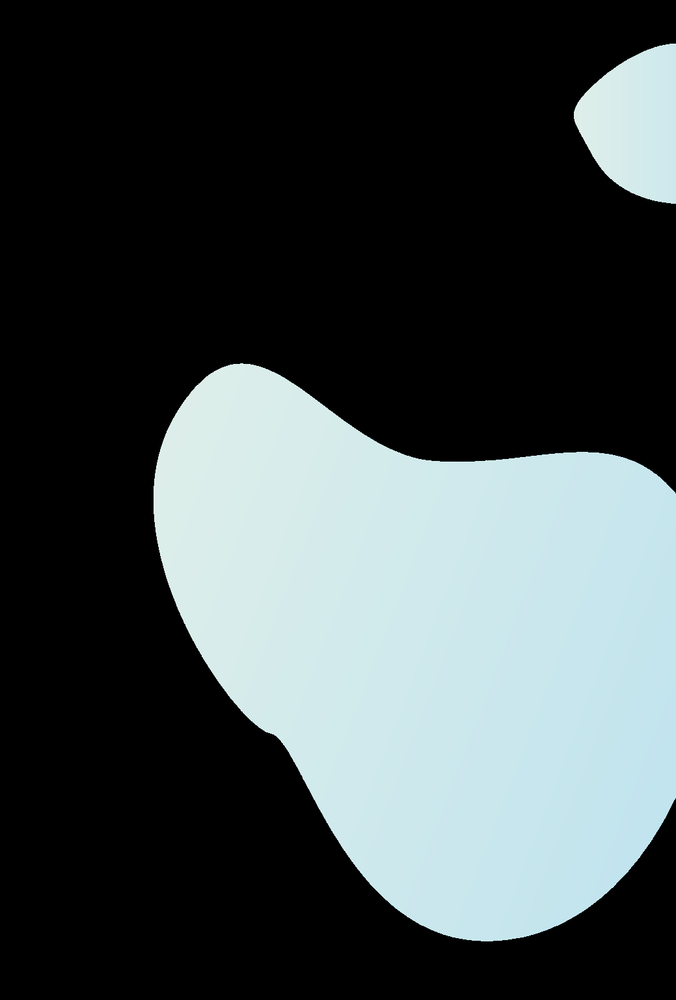

<!-- source: alcohol-use-mandarin.md -->
## Page 1

## 让您活得更加 健康的小贴士 

# 喝酒导致酒精成瘾 什么是标准酒类饮品？ 

- 一罐 * （ 330 毫升）普通啤 酒，酒精含量约为 4% 至 5% 。 

- 半杯（ 100 毫升）的葡萄 酒，酒精含量为 15% 

   - 一杯（ 30 毫升）的烈 酒，酒精含量为 40% 

- 一罐酒精含量达 _8%_ 的啤酒 _= 2_ 杯标准酒 

- 类饮品 

#### 多少酒精才算过量？ 

每天饮用不超过 **2** 杯标准酒类饮品。 

什么是酗酒？ 

- 一次饮用 5 杯或更多杯酒精饮品 

- 酗酒会增加和提高中风、肝病、高血压、意外事 故和死亡的风险

## Page 2

### 上瘾的迹象： 

- 觉得必需先喝酒，才可以使自己“兴奋起来”。 

- 如果您没喝酒，就会感到焦虑、出汗和恶心。 

- 无法减少饮酒量。 

- 感觉上需要喝更多酒，并且难以摆脱酒瘾。 

- 影响工作表现和搞砸人际关系。 

### 如何做个负责任的饮酒者？ 

- 记得请教医生您可不可以喝酒，尤其是您在服药期间。 

- • 饮酒之前和饮酒之时，必须进食。 

- 喝酒的速度要慢。 

- 开车、操作设备和机器之前，千万不要喝酒。 

- 不可超越酒精限度（即 2 罐啤酒） 

- 要懂得拒绝喝酒，要懂得说“不”。 

如果您发现酒精已经对您的 工作和日常生活，造成难题 而感到困扰，请向他人求助。 

- 外籍劳工中心 - 6536 2692 

- 康侍 - 3129 5000 

##### **Proudly presented by:** 

资料来源： 

_1._ 《为什么酗酒对你有害》。保健中心。 _2022_ 年 _3_ 月。 

_2._ 《做个负责任的饮者，了解自己的酒精限度》。保健中心。 _2022_ 年 _3_ 月。

<!-- source: alcohol-use-tamil.md -->
## Page 1

**நீங் ள் ஆக ாக் ியமா இருக் உதவிக்குறிப்பு ள்** 

**மது கபாதத மதுபானம் அருந்த நிர்மாணித்திருக்கும் அளவுக ால் என்ன?** 

   - 40% ஆல்கஹால் கலந்திருக்கும் ஒரு ஷாட் (30 மில்லி). 

- சுமார் 4% முதல் 5% ஆல்கஹால் கலந்திருக்கும் ஒரு வழக்கமான பீர் டின்* (330மிலி). 

- 15% ஆல்கஹால் கலந்திருக்கும் அரை கிளாஸ் (100 மில்லி) ஒயின் 

- *8% ஆல்கஹால் கலந்திருக்கும் ஒரு பீர் டின்* = 2 அளவு மதுபானம் 

**எந்த அளவிற்கு மதுபானம் அருந்தினால், அந்த அளவு அதி மானது என்று பபாருள்படும்?** நிர்மாணித்திருக்கும் அளவுககால் காட்டிலும் ஒரு நாரளக்கு 2 அளவுக்கு கமல் மதுபானம் அருந்தாமல் இருத்தல் 

**அளவுக்கு அதி மா  மது அருந்துதல் என்றால் என்ன?** 

- ஒகை கநைத்தில் 5 அல்லது அதற்கு கமற்பட்ட மதுபானங்கரள அருந்துவது 

- அளவுக்கு அதிகமாக மது அருந்துவது பக்கவாதம், கல்லீைல் கநாய்கள், உயர் இைத்த அழுத்தம், விபத்துகள் மற்றும் உயிரிழப்பிற்கான அபாயத்ரத அதிகரிக்கும்

## Page 2

# **மதுகபாததக்கு அடிதமயானதற் ான அறிகுறி ள்:** 

- "பைவசமரடய" மதுபானம் அருந்த கவண்டும் என்ற உணர்வு ஏற்படுதல். 

- நீங்கள்மதுபானம் அருந்தாவிட்டால் பதற்றம், வியர்ரவ மற்றும் குமட்டல் கபான்ற உணர்வுகள் ஏற்படுதல். 

- நீங்கள் குடிக்கும் அளரவக் குரறக்க இயலாரம. 

- இன்னும் அதிகமாக மது அருந்த கவண்டிய உணர்வுஏற்படுதல் 

- மற்றும் மதுபானம் அருந்துவதால் உண்டாகும் 

- விரளவுகளிலிருந்து மீண்டு வை சிைமப்படுதல். 

- கவரல மற்றும் உறவுகரளப் பாதித்தல். 

**பபாறுப்புணர்ச்சியுடன் எப்படி மது அருந்துவது:** 

   - நீங்கள் மதுபானம் அருந்தலாமா என்பரத உங்கள் மருத்துவரிடம் விசாரிக்கவும், அதிலும் குறிப்பாக நீங்கள் மருந்து சாப்பிட்டு வந்தால். 

   - மதுபானம் அருந்தும் முன்னும், அருந்தும் கபாதும் உணவு சாப்பிடவும். 

   - மமதுவாக மதுபானம் அருந்தவும். 

   - மது அருந்திவிட்டு வாகனம் ஓட்ட கவண்டாம் அல்லது உபகைணங்கள் மற்றும் இயந்திைங்கரள இயக்க கவண்டாம். 

   - • வைம்புக்கு உட்பட்டு மதுபானம் அருந்தவும் (அதாவது 2 டின்கள் பீர்) 

   - குடிப்பழக்கத்திற்கு "கவண்டாம்” என்று மசால்ல பழகிக்மகாள்ளவும். 

- **உங் ள் கவதைக்கும் அன்றாட வாழ்க்த க்கும் மதுபானம் பி ச்சதன தள ஏற்படுத்தியிருந்தால் உதவி நாடவும்.** 

- குடிமபயர்ந்த ஊழியர்கள் நிரலயம் - 6536 2692 

- மஹல்த்மசர்வ் - 3129 5000 

## **Proudly presented by:** 

ஆதாைங்கள்: _1. "_ அதிகமாக மது அருந்துவது ஏன் உங்களுக்குத் தீரமரய விரளவிக்கும்". மஹல்த்ஹப். மார்ச் _2022. 2. “_ மபாறுப்புணர்ச்சியுடன் மது அருந்துதல். வைம்புக்கு உட்பட்டு மது அருந்துவரத அறிந்து மகாள்ளவும். மஹல்த்ஹப். மார்ச் _2022._

<!-- source: alcohol-use-thai.md -->
## Page 1

# **ข้อแนะน าเพื่อให้ น สุขภาพคุณดีขึ้** 

**การติดแอลกอฮอล์ อะไรคือมาตรฐานเครื่องดื่มแอลกอฮอล์** 

   - ไวน์ครึ่งแก้ว (100 มล.) ที่มีปริมาณแอลกอฮอล์ 15% 

- เบียร์ธรรมดากระป๋อง* (ขนาด 330 มล.) มีปริมาณแอลกอฮอล์ ประมาณ 4% ถึง 5% 

   - สุรา 1 ช็อต (30 มล.) ที่มี ปริมาณแอลกอฮอล์40% 

- *เบียร์หนึ่งกระป๋องที่มีปริมาณแอลกอฮอล์ 8% เท่ากับ 2 เครื่องดื่มมาตรฐาน 

## **ปริมาณแอลกอฮอล์ที่ถือว่ามากเกินไป คือเท่าไหร่** 

ไม่เกิน 2 เครื่องดื่มมาตรฐานต่อวัน 

## **การดื่มสุราโดยไม่อั้นคืออะไร** 

- การดื่มเครื่องดื่มแอลกอฮอล์ตั้งแต่ 5 เครื่องขึ้นไปในรวด เดียว 

- การดื่มสุรารวดเดียวจะเพิ่มความเสี่ยงโรคหลอดเลือด สมอง โรคตับ ความดันโลหิตสูง อุบัติเหตุ และเสียชีวิต

## Page 2

## **ลักษณะอาการติดเหล้า** 

- รู้สึกอยากดื่มแอลกอฮอล์เพื่อให้ตัวเมา 

- จะรู้สึกกระวนกระวาย อาการเหงื่อออกและคลื่นไส้ถ้าไม่ได้ แอลกอฮอล์ 

- ไม่สามารถลดปริมาณการดื่มได้ 

- มีความรู้สึกว่าต้องดื่มแอลกอฮอล์ให้มากขึ้นและมีปัญหาในการฟื้น ตัวจากฤทธิ์ของแอลกอฮอล์ 

- ส่งผลกระทบต่อการท างานและความสัมพันธ์ 

## **วิธีดื่มอย่างมีความรับผิดชอบ** 

- ตรวจดูกับแพทย์ว่าดื่มแอลกอฮอล์ได้ไหม โดยเฉพาะอย่างยิ่งหาก คุณก าลังรับยาอยู่ 

- กินก่อนและระหว่างช่วงการดื่ม 

- ดื่มช้า ๆ 

- ห้ามดื่มตอนขับหรือใช้อุปกรณ์และเครื่องจักร 

- อยู่ในขีดจ ากัดแอลกอฮอล์ (คือ เบียร์ 2 กระป๋อง) 

- กล้าปฏิเสธต่อค าชวนให้ดื่ม 

**หาความช่วยเหลือหากประกฎว่า แอลกอฮอล์ท าให้เกิดปัญหาในการ ท างานและชีวิตประจ าวันของคุณ** 

- ศูนย์แรงงานข้ามชาติ - 6536 2692 

- เฮลท์เซอร์ฟ - 3129 5000 

### **Proudly presented by:** 

แหล่งความรู้ 

_1_ . “ท าไมการดื่มสุรารวด ๆ ถึงไม่ดี” _HealthHub._ ฉบับ มีนาคม ค.ศ. _2022._ 

_2._ “การดื่มอย่างมีความรับผิดชอบ รู้ขีดจ ากัดแอลกอฮอล์” _HealthHub._ ฉบับ มีนาคม ค.ศ. _2022._

<!-- source: alcohol-use-vietnamese.md -->
## Page 1

# Mẹo giúp bạn khỏe mạnh hơn Nghiện Rượu 

**1 phần uống tiêu chuẩn là gì?** 

   - Một ly (30ml) rượu mạnh có nồng độcồn 40% 

- Một lon * (330ml) bia • Nửa ly (100ml) rượu có thông thường có nồng độ nồng độ cồn 15% cồn khoảng 4% đến 5%. 

- _Một lon bia với độcồn 8% = 2 phần uống tiêu chuẩn_ 

## **Bao nhiêu rượu là quá nhiều?** 

**Không quá 2 phần uống tiêu chuẩn mỗi ngày.** 

## **Uống rượu quá mức là gì?** 

- Uống 5 phần uống có cồn trở lên cùng một lúc 

- Uống rượu quá mức làm tăng nguy cơ đột quỵ, các bệnh về gan, huyết áp cao, tai nạn và tử vong

## Page 2

## **Dấu hiệu nghiện:** 

- Cảm thấy cần phải uống rượu để "lên đỉnh". 

- Sẽ cảm thấy lo lắng, đổ mồ hôi và buồn nôn nếu bạn không uống rượu. 

- Không thể cắt giảm số lượng bạn uống. 

- Cảm thấy cần phải uống nhiều rượu hơn và khó phục hồi sau khi bị tác dụng của rượu. 

- Ảnh hưởng đến công việc và các mối quan hệ. 

**LÀM THẾ NÀO đểuống có trách nhiệm:** 

- Kiểm tra với bác sĩ nếu bạn có thể uống, đặc biệt là nếu bạn đang sử dụng thuốc. 

- Ăn trước và trong khi uống rượu. 

- Uống chậm. 

- KHÔNG uống rượu và lái xe hoặc vận hành thiết bị và máy móc. 

- Duy trì giới hạn cồn (ví dụ: 2 lon bia) 

- Có thể “nói KHÔNG” với việc uống rượu. 

**Tìm sự giúp đỡ nếu bạn thấy rằng rượu gây ra các vấn đề trong công việc và cuộc sống hàng ngày của bạn.** 

- Trung tâm Người lao động Nhập cư - 6536 2692 

- HealthServe - 3129 5000 

### **Proudly presented by:** 

_Nguồn:_ 

_1. “Tại sao uống rượu bia nhiều lại có hại cho bạn”.  HealthHub.  Tháng 3 năm 2022._ 

_2. “Uống có trách nhiệm. Biết tửu lượng của bạn ”.  HealthHub.  Tháng 3 năm 2022._

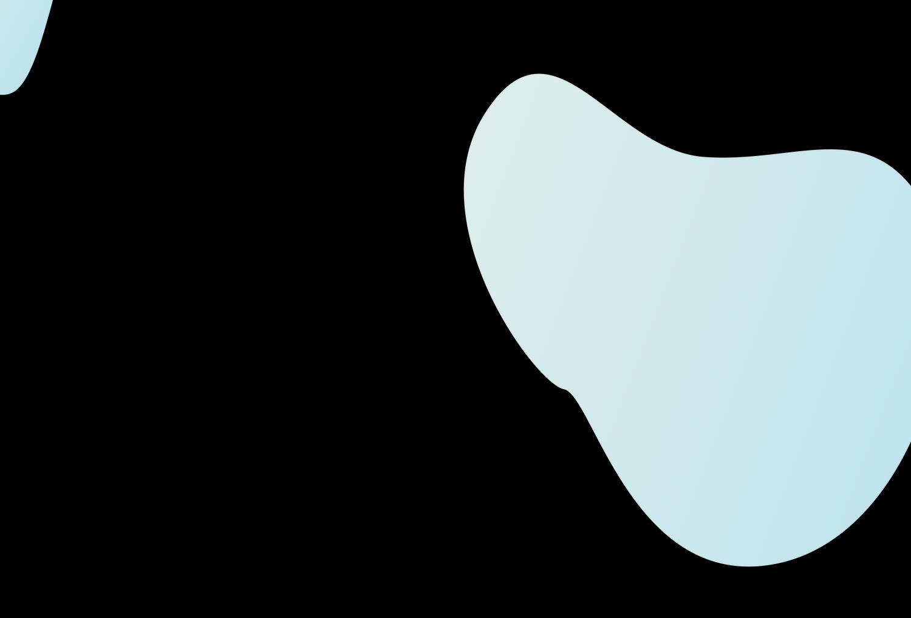

<!-- source: debunking-myths-about-nutrition-bahasa.md -->
## Page 1

# Tips untuk membuat  Anda yang Lebih Sehat 

## Mitos 

## **Membongkar Mitos Umum tentang Nutrisi** 

## Fakta 

**Mitos:** Semua makanan yang digoreng tidak baik untuk kesehatan 

**Mitos:** Makan makanan berat di malam hari akan menyebabkan kenaikan berat badan 

**Mitos:** Minuman berenergi membantu saya fokus dan memberi energi ekstra 

**Mitos:** Saya bisa makan lebih banyak karena saya melakukan banyak pekerjaan manual 

**Mitos:** Saya bisa minum jus buah daripada buah segar 

**Fakta:** Semua makanan harus dimakan dalam jumlah sedang. Anda tidak boleh makan makanan yang digoreng setiap hari atau berkali-kali dalam seminggu. 

**Fakta:** Lebih penting untuk mengetahui jumlah total dan jenis makanan yang dimakan dalam sehari. Makanan yang seimbang harus memiliki setengah piring sayuran, dengan seperempat piring nasi/mie dan daging. Sebaiknya juga menggunakan lebih sedikit minyak, gula, garam atau bumbu dalam makanan. 

**Fakta:** Anda mungkin mendapatkan dorongan energi untuk waktu yang singkat tetapi dapat meningkatkan detak jantung atau tekanan darah dan membuat Anda merasa lebih haus. **Jangan** minum lebih dari 3 kaleng minuman energi per hari. Jika Anda selalu merasa lelah, tidur yang cukup, berolahraga secara teratur dan makan makanan yang sehat. 

**Fakta:** Sebaiknya Anda tidak makan nasi putih/mie lebih banyak karena Anda lebih banyak bekerja. Makanan tersebut mengandung banyak karbohidrat yang dapat meningkatkan kadar gula darah Anda. Sebagai gantinya, makan lebih banyak sayuran dan buah-buahan segar dan pilih nasi/mie/tepung biji-bijian utuh sebagai gantinya. 

**Fakta:** Jus buah sebenarnya mengandung tambahan gula dan Anda harus membatasi hingga 1 cangkir jus buah per hari. Lebih baik makan lebih banyak buah segar yang akan memberi Anda lebih banyak vitamin, mineral, dan serat makanan. 

Sumber: 

1. 10 Nutrition and Healthy Eating Myths. HealthHub. December 2021. 

2. “Debunking Food Myths: Energy Drinks”. _My Alvernia Magazine: Issue 24_ . Mount Alvernia Hospital. 

3. “Fruit Juice vs Whole Fruits. Which is Healthier?”, HealthXchange. SingHealth.

<!-- source: debunking-myths-about-nutrition-bengali.md -->
## Page 1

# **স্বাস্থ্য্ান থাোর চনেমা্লী** 

**প্রিচলত ধারণা** 

**পুচি চনদে চেেু প্রিচলত ধারণা সতয েথা এ্ং তার ্েদল চে েরা উচিত** 

**প্রিচলত ধারণা:** স্কল িুব পেরল িাজা খাদয স্বারস্থযর জনয ক্ষরেকর। 

**প্রিচলত ধারণা:** স্ন্ধ্যার রদরক িারর খাওযা পখরল ওজন বৃরি পারব। 

**প্রিচলত ধারণা:** এনারজণ পানীয েরনারযাগ রদরয কাজ কররে স্াহাযয করর এবং অরেররক্ত শরক্ত পদয। 

**প্রিচলত ধারণা:** আরে পবরশ পখরে পাররবা কারর্ আরে পবরশ শারীররক পররশ্রে করর। 

**প্রিচলত ধারণা:** েরোজা ফরলর পররবরেণ আরে পযারকট এর জুস্ পখরে পাররবা। 

**সতয েথাাঃ** স্কল খাদযই পরররেে খাওযা উরচে। িুব পেরল িাজা খাদয প্ **র** েযকরদন বা স্প্তারহ অরনকবার খাওযা উরচে না। 

**সতয েথাাঃ** প্ **র** েরদন রক রক খারি এবং করোটুকু খারি এইটা স্ম্পরকণ অবরহে র্াকাটা পবরশ জরুরী। একটি িারলা স্ুষে খারদযরে অরধণক বাটিস্বরজর স্ারর্ এক চেুর্ণাংশ করর িাে/নিুলস্ এবং োংস্ র্াকা উরচে। খাদয গুরলাপে কে পেল, রচরন, লবর্ এবং েস্লা র্াকা উরচে। 

**সতয েথাাঃ** েুরে অল্প স্েরযর জনয শরক্ত বৃরি অনুখব কররে পাররা রকন্তু এইটা পোোর হৃদ রক্রযা অর্বা রক্ত চাপ বৃরি কররব এবং পোোরক েৃষ্ণােণ করর েুলরব। রদরন ৩ কযান এর পবরশ এনারজণ পানীয পান করা যারবনা। যরদ েুরে স্ব স্েয দূবণল অনুিব কররা োহরল পযণাপ্ত র্ুোও, প্ **র** েযকরদন বযাযাে কররা এবং স্ুষে খাদয আহার কররা। 

**সতয েথাাঃ** েুরে পবরশ কাজ কররা বরলই পোোর পবরশ স্াদা িাে/নুিুলস্ খাওযা যারবনা। এইস্ব খারদয অরনক শকণরা র্ারক পযটা পোোর ররক্তরচরনর পররোন বারড়রয রদরব। পররবরেণ, পবরশ করর শাক স্বরজ এবং ফলেুল এবংপুররা শষয িাে/নুিুলস্ বা আটা জােীয রজরনস্ পখরে হরব। 

**সতয েথাাঃ** পযারকট জােীয জুস্ এ অরেররক্ত রচরন র্ারক এবং প্ **র** েরদন এক কারপর পবরশ খাওযা যারব না পবরশ করর ফল খাওযা িারলা পযটাপোোরক রিটারেন রেরনরালস্ এবং আাঁশ রদরব। 

1. 10 Nutrition and Healthy Eating Myths. HealthHub. December 2021. 

2. “Debunking Food Myths: Energy Drinks”. _My Alvernia Magazine: Issue 24_ . Mount Alvernia Hospital. 

3. “Fruit Juice vs Whole Fruits. Which is Healthier?”, HealthXchange. SingHealth. 

স্ূত্রঃ

<!-- source: debunking-myths-about-nutrition-english.md -->
## Page 1

# Myth 

# **Debunking Common** Fact **Myths About Nutrition** 

**Myth:** All deep-fried food is bad for my health 

**Fact:** All food should be eaten in moderation. You should not eat deepfried food daily or many times in a week. 

**Myth:** Eating a heavy meal in the evening will cause weight gain 

**Fact:** It is more important to be aware of the total amount and types of food eaten in a day. A well-balanced meal should have half a plate of vegetables, with a quarter plate of rice/noodles and meat. Should also use less oil, sugar, salt or seasonings in the foods. 

**Myth:** Energy drinks help me focus and give extra energy 

**Fact:** You may get an energy boost for a short time but it may increase your heart rate or blood pressure and make you feel thirstier. Do **not** drink more than 3 cans of energy drinks per day. If you always feel tired, get enough sleep, exercise regularly and eat a healthy diet. 

**Myth:** I can eat more because I do a lot of manual work 

**Fact:** You should **not** eat more white rice/noodles because you work more. They contain a lot of carbohydrates that can increase your blood sugar level. Instead, eat more fresh vegetables and fruits and choose wholegrain rice/noodles/flour instead. 

**Myth:** I can drink fruit juice instead of fresh fruits 

**Fact:** Fruit juices actually contain added sugar and you should limit to 1 cup of fruit juice per day. It is better to eat more fresh fruits that will give you more vitamins, minerals and dietary fibre. 

Sources: 

> 1. 10 Nutrition and Healthy Eating Myths. HealthHub. December 2021. 

> 2. “Debunking Food Myths: Energy Drinks”. _My Alvernia Magazine: Issue 24_ . Mount Alvernia Hospital. 

> 3. “Fruit Juice vs Whole Fruits. Which is Healthier?”, HealthXchange. SingHealth.

<!-- source: debunking-myths-about-nutrition-mandarin.md -->
## Page 1

# **让您活得更 加健康的小贴士** 

**误区** 

## **揭露真相：关于“营养”的误区** 

<!-- Start of picture text -->
事实 <!-- End of picture text -->

**误区一：** 所有油炸食品， 都对我的健康有害。 

**事实：** 无论吃什么食物，都要有节制，适可而止。您不应天天吃油 炸食物，或是一个星期吃许多次油炸食品。 

**误区二：** 晚上吃得太多， 会导致体重增加。 

**事实：** 更重要的一点是，您必须了解自己一整天所吃的食物总量和 类别。一顿均衡的饭菜，应该有半盘的蔬菜、四分之一盘的米饭/ 面条和肉类。食物中也应该含少油、少糖、少盐和少调味料。 

**误区三：** 能量饮料能让我 集中注意力和给我提供额 外精力 

**事实：** 您可能会在短时间内增加精力，可是另一方面，这也可能增 加您的心率和血压，使您感到更加口渴。每天 **不可以** 喝超过3罐的 能量饮料。如果您总是感到疲倦，请确保自己有充足的睡眠、定期 锻炼身体和注重健康饮食。 

**误区四：** 因为我从事很多 体力工作，因此，我可以 吃更多食物。 

**事实：** 您 **不应该** 因为工作量比较大，而食用更多白米饭和面条。米 饭和面条含有大量的碳水化合物，会增加体内血糖的水平。相反地， 您应该多吃新鲜的蔬菜和水果，选择全麦大米、面条和面粉。 

**误区五：** 我可以用喝果汁 代替吃新鲜水果 

**事实：** 实际上，果汁含有添加糖，您应该限制自己，每天只喝1杯 的果汁，最好是多吃新鲜的水果，以便摄取更多的维生素、矿物质 和食物纤维。 

资料来源： 

1.《10个营养和健康饮食误区》。保健中心。2021年12月。 

> 2.《揭露食物误区：能量饮料》。《我的安微尼亚》杂志：第24期。安微尼亚山医院。 

3.《果汁与全水果，哪个较健康？》。健康交换HealthXchange。新保健SingHealth。

<!-- source: debunking-myths-about-nutrition-tamil.md -->
## Page 1

# **நீங்கள் ஆவரொக்கியமொக இருக்க உதேிக்குறிப்புகள்** 

## **ஊட்டச்சத்து ற்றிய க ொதுேொன க ொய்யொனத் தகேல்களை ேிலக்குதல்** 

**உண்ளமத் தகேல்** 

**க ொய்த் தகேல்** 

**க ொய்த்தகேல்:** நிழறய எண்பணயில்ப ொரித்பதடுத்த எல்லொ உணவுகளும்என் ஆத ொக்கியத்திற்குக்தகடு ைிழளைிக்கும் 

**உண்ளமத் தகேல்:** எல்லொ உணழையும் அளதைொடுசொப் ிட தைண்டும். எண்பணயில்ப ொரித்தஉணழைத்தினமும் அல்லது ைொ த்தில்  லமுழற சொப் ிடக்கூடொது. 

**க ொய்த்தகேல்:** மொழலயில் அதிகமொன உணழைச் சொப் ிட்டொல் உடல் எழட அதிகரிக்கும் 

**உண்ளமத் தகேல்:** ஒருள நொள் முழுைதும் உண்ணும் உணைின்பமொத்த அளவு மற்றும் உணவு ைழககள் குறித்த ைிைிப்புணர்வு முக்கியமொகும். நல்ல சமச்சீ ொன உணைில்அழ த்தட்டு கொய்கறிகள், கொல் தட்டு சொதம்/நூடல்ஸ்மற்றும் இழறச்சி இருளக்க தைண்டும். உணவுகளில்குழறந்த அளவு எண்பணய், சர்க்கழ , உப்பு அல்லது மசொலொப்ப ொருளட்கழளக்குழறைொகப்  யன் டுத்த தைண்டும். 

**க ொய்த்தகேல்:** ஆற்றல் தருளம்  ொனங்கள்நொன் கைனம் பசலுத்துைதற்குஉதவுகிறது மற்றும் கூடுதலொன ஆற்றழல அளிக்கிறது 

**உண்ளமத் தகேல்:** நீங்கள் குறுகிய கொலத்திற்குஆற்றல் ப ற்றதொகஉண லொம். ஆனொல் அது உங்கள் இதயத் துடிப்பு அல்லது இ த்தஅழுத்தத்ழதஅதிகரித்து தமலும் தொகத்ழதஉண்டொக்கலொம். ஒருள நொழளக்கு 3 டின்களுக்குதமல் ஆற்றல் ொனங்கழளக்குடிக்க தைண்டொம். நீங்கள் எப்த ொதும் தசொர்ைழடந்தொல், த ொதுமொன அளவு தூங்கவும், தைறொமல் உடற் யிற்சி பசய்யவும் மற்றும் 

ஆத ொக்கியமொன உணழை உண்ணவும். 

**க ொய்த்தகேல்:** ப ொய்த் தகைல்: நொன் உடழல உழைத்து அதிக தைழல பசய்ைதொல் அதிகமொக சொப் ிடலொம் 

**உண்ளமத் தகேல்:** நீங்கள் அதிகம் உழைக்கும்கொ ணத்தொல் அதிகமொன பைள்ழளச்தசொறு/நூடல்ஸ்இைற்ழற அதிகம் சொப் ிடக் **கூடொது** . அைற்றில் மொவுச்சத்து நிழறய இருளப் தொல் அழை உங்கள் இ த்தசர்க்கழ  அளழை அதிகரிக்கும். அதற்குப் திலொக, அதிக  ச்ழச கொய்கறிகள்மற்றும்  ைங்கழளச் சொப் ிடுங்கள்மற்றும் முழுத் தொனியங்கள்/ நூடல்ஸ்/ மொழைத்ததர்வு பசய்யவும். 

**க ொய்த்தகேல்:** நொன்  ச்ழச ைங்களுக்குப் திலொகப் ைச்சொறுகுடிக்கலொம் 

**உண்ளமத் தகேல்:** உண்ழமயில் ைச்சொறுகளில்தசர்க்கப் ட்டசர்க்கழ உள்ளது. ஒருள நொழளக்கு நீங்கள் 1 குைழள  ைச்சொறுகுடிப் துத ொதுமொனது. அதிக ழைட்டமின்சத்து, தொது ப ொருளட்கள் மற்றும் நொர்ச்சத்துகழளைைங்கும் ச்ழச  ைங்கழளஅதிகம் சொப் ிடுைது நன்று. 

ஆதொ ங்கள்: 1. 10 ஊட்டச்சத்துமற்றும்ஆத ொக்கியமொனஉணவுகுறித்தப ொய்த் 

தகைல்கள். பெல்த்ெப். டிசம் ர்2021. 2. "உணவுகுறித்தப ொய்த்தகைல்கழளநீக்குதல்: ஆற்றல் ொனங்கள்". எனதுஅல்தைர்னியொஇதழ்: பைளியீடு24. மவுண்ட் 

அல்தைர்னியொமருளத்துைமழன. 

3. “ ைச்சொறு, முழுப் ைங்கள். இைற்றில்எதுஆத ொக்கியமொனது?”, பெல்த்எக்ஸ்தசஞ்ச். சிங்பெல்த்.

<!-- source: debunking-myths-about-nutrition-thai.md -->
## Page 1

# **ข้อแนะน าเพื่อให้ สุขภาพคุณดีขึ้น** 

**ความเชื่อที่ผิด** 

**การเปิดเผยความเชื่อผิดๆ เกี่ยวกับโภชนาการ** 

**ข้อเท็จจริง** 

**ความเชื่อที่ผิด-** ของทอดทุก อย่างไม่ดีต่อสุขภาพของฉัน 

**ข้อเท็จจริง-** ควรรับประทานอาหารทุกอย่างในปริมาณที่พอเหมาะ ไม่ควรกิน อาหารทอดทุกวันหรือหลายครั้งในหน้่งสัปดาห์ 

**ความเชื่อที่ผิด-** ทานอาหาร หนักมื้อเย็นท าให้น ้าหนักข **้** น 

**ข้อเท็จจริง-** สิ่งส าคัญคือต้องค าน้งถ้งจ านวนและประเภทอาหารที่รับประทานใน หน้่งวัน มื้ออาหารที่สมดุลควรมีผักคร้่งจานกับมีข้าว/ก๋วยเตี๋ยวและเนื้อสัตว์หน้่งใน สี่ของจาน และควรใช้น ้ามัน น ้าตาล เกลือ หรือเครื่องปรุงในอาหารให้น้อยลง 

**ความเชื่อที่ผิด-** เครื่องดื่มชู ก าลังช่วยให้มีสมาธิและให้ พลังงานเพิ่มขน **้** 

**ข้อเท็จจริง-** จริงอยู่ อาจได้รับพลังงานเพิ่มข **้** น แต่เพียงในช่วงเวลาสั้นๆ ซ้่งอาจ ท าให้อัตราการเต้นของหัวใจหรือความดันโลหิตเพิ่มข **้** น และท าให้คุณรู้ส้ก กระหายน ้ามากขน ห้ามรับเครื่องดื่มชูก าลังมากกว่า 3 กระป๋องต่อวัน หากคุณรู้ส้ก **้** เหนื่อยล้าอยู่เสมอ ให้นอนหลับพักผ่อนให้เพียงพอ ออกก าลังกายอย่างสม ่าเสมอ และรับประทานอาหารที่มีประโยชน์ 

**ความเชื่อที่ผิด-** กินเยอะขน **้** ได้เพราะท างานใช้แรงมาก 

**ข้อเท็จจริง-** คุณไม่ควรกินข้าวสวย/ก๋วยเตี๋ยวเพราะคุณได้ท างานมากข **้** น ซ้่ง อาหารพวกนี้มีคาร์โบไฮเดรตจ านวนมากที่สามารถเพิ่มระดับน ้าตาลในเลือดของ คุณได้ ให้กินผักและผลไม้สดให้มากข **้** นแทน และเลือกกินข้าว/บะหมี่/แป้งที่เป็น ข้าวกล้องแทน 

**ความเชื่อที่ผิด-** กินน ้าผลไม้ แทนผลไม้สดก็ได้ 

**ข้อเท็จจริง-** จริง ๆ แล้ว น ้าผลไม้มีส่วนผสมของน ้าตาล และคุณควรจ ากัดดื่มน ้า ผลไม้เป็น 1 ถ้วยต่อวัน เป็นการดีกว่าที่จะกินผลไม้สดมากขนซ้่งจะท าให้คุณได้รับ **้** วิตามิน แร่ธาตุ และใยอาหารมากข **้** น 

> 1. ต านานโภชนาการและการกินเพื่อสุขภาพ 10 เรื่อง HealthHub. ธันวาคม ค.ศ. 2021. 

แหล่งความรู้ 

2. “การเปิดโปงต านานอาหาร เครื่องดื่มชูก าลัง”. My Alvernia Magazine: Issue 24. Mount Alvernia Hospital. 

3. ” น ้าผลไม้กับผลไม้ทั้งผล แบบไหนดีต่อสุขภาพ” HealthXchange. SingHealth.

<!-- source: debunking-myths-about-nutrition-vietnamese.md -->
## Page 1

# Mẹo giúp b **ạ** n kh **ỏ** e m **ạ** nh h **ơ** n 

L **ầ** m t **ưở** ng 

**Tìm hiểu những lầm tưởng phổ biến về dinh dưỡng** 

Th **ự** c t **ế** 

**Lầm tưởng:** Tất cả thức ăn chiên ngập dầu đều có hại cho sức khỏe của tôi 

**Thực tế:** Tất cả thực phẩm nên được ăn vừa phải. Bạn không nên ăn đồ chiên rán hàng ngày hoặc nhiều lần trong tuần. 

**Lầm tưởng:** Ăn nhiều vào buổi tối sẽ gây tăng cân 

**Thực tế:** Điều quan trọng hơn là phải nhận thức được tổng lượng và loại thực phẩm ăn trong một ngày.  Một bữa ăn cân đối nên có một nửa đĩa rau, một phần tư đĩa cơm / mì và thịt.  Cũng nên sử dụng ít dầu, đường, muối hoặc gia vị trong thức ăn. 

**Lầm tưởng:** Nước tăng lực giúp tôi tập trung và cung cấp thêm năng lượng. 

**Thực tế:** Bạn có thể được tăng cường năng lượng trong một thời gian ngắn nhưng nó có thể làm tăng nhịp tim hoặc huyết áp và khiến bạn cảm thấy khát hơn. **Không** uống quá 3 lon nước tăng lực mỗi ngày. Nếu bạn luôn cảm thấy mệt mỏi, hãy ngủ đủ giấc, tập thể dục thường xuyên và ăn uống lành mạnh. 

**Lầm tưởng:** Tôi có thể ăn nhiều hơn vì tôi làm nhiều công việc tay chân. 

**Thực tế:** Bạn **không** nên ăn nhiều cơm trắng vì bạn làm việc nhiều hơn. Chúng chứa nhiều chất carbohydrat có thể làm tăng lượng đường trong máu của bạn. Thay vào đó, hãy ăn nhiều rau và trái cây tươi hơn và chọn gạo nguyên hạt/ mì / bột ngũ cốc để thay thế. 

**Lầm tưởng:** Tôi có thể uống nước hoa quả thay vì hoa quả tươi. 

**Thực tế:** Nước hoa quả thực ra chứa thêm đường và bạn nên hạn chế chỉ uống 1 cốc nước hoa quả mỗi ngày.  Tốt hơn hết bạn nên ăn nhiều hoa quả tươi sẽ cung cấp nhiều vitamin, khoáng chất và chất xơ. 

Nguồn: 

> 1. 10 lầm tưởng vềdinh dưỡng và ăn uống lành mạnh.  HealthHub. Tháng 12 năm 2021. 2. “Phá vỡnhững lầm tưởng vềthực phẩm: Thức uống năng lượng”.  Tạp chí Alvernia của tôi: Số24. Bệnh viện Mount Alvernia. 

3. “Nước ép trái cây và trái cây.  Cái nào lành mạnh hơn? ”, HealthXchange.  SingHealth.

<!-- source: drinking-8-cups-of-water-bahasa.md -->
## Page 1

# Tips untuk membuat  Anda yang Lebih Sehat 

**Tahukah Anda berapa gelas air yang harus Anda minum dalam sehari?** 

**Berikut petunjuknya: ini adalah jumlah warna dalam pelangi, ditambah 1.** 

Meminum air adalah lebih dari sekadar memuaskan dahaga Anda! Air sangat penting bagi tubuh Anda untuk berfungsi dengan baik. 

Jawaban: 8 gelas 

Sumber: 

1. “The Best Refreshment”. HealthHub. December 2021.

<!-- source: drinking-8-cups-of-water-bengali.md -->
## Page 1

# **স্বাস্থ্য্ান থাোর চনেমা্লী** 

**আপচন চে জাদনন চেদন আপনার েতটুকু পাচন পান েরা উচিত?** 

**রংধনুর রংএর সংখযার সাদথ এে যোগ েরদত হদ্।** পারন পান পকবল আপনার েৃষ্ণায পেটায না! এটি আপনার শরীরর স্ঠিক কাযণকাররো কররে স্হাযো করর। উত্তরআটগ্লাস্। 

স্ূত্রঃ 

1. “The Best Refreshment”. HealthHub. December 2021.

<!-- source: drinking-8-cups-of-water-english.md -->
## Page 1

**Do you know how many cups of water you should drink in a day?** 

**Here's a hint: it's the number of colours in a rainbow, plus 1.** 

Drinking water does more than just quench your thirst! It's essential for your body to function properly. 

# Ans: 8 cups 

Source: 

1. “The Best Refreshment”. HealthHub. December 2021.

<!-- source: drinking-8-cups-of-water-mandarin.md -->
## Page 1

# **让您活得更 加健康的小贴士 您是否晓得，每天应该喝多少杯水？ 这是一个提示：它是彩虹中的颜色数加1。** 喝水不仅仅是解渴，它对您身体的正常运作也至关重要。 

## 答案：8杯 

资料来源： 

1.《最好的茶点》。保健中心 HealthHub。2021年12月。

<!-- source: drinking-8-cups-of-water-tamil.md -->
## Page 1

# **நீங்கள் ஆவரொக்கியமொக இருக்க உதேிக்குறிப்புகள்** 

**ஒரு நொளைக்கு எவ்ேைவு தண்ணீர் குடிக்க வேண்டும் என்று கதரியுமொ? இங்வக ஒரு குறிப்பு உள்ைது: இது ஒரு ேொனேில் நிறங்கைின்எண்ணிக்ளக,  ிைஸ்1.** 

தண்ணீர் குடிப் துஉங்கள் தொகத்ழதத்தணிப் ழதைிட அதிகம்! உங்கள் உடல் சரியொக பசயல் ட இது அைசியம். 

## தில்: 8 குைழளகள் 

ஆதொ ம்: 

1. "சிறந்த புத்துணர்ச்சி". பெல்த்ெப். டிசம் ர் 2021.

<!-- source: drinking-8-cups-of-water-thai.md -->
## Page 1

# **ข้อแนะน าเพื่อให้ สุขภาพคุณดีขึ้น** 

**คุณทราบหรือไม่ว่าในแต่ละวัน คุณควรดื่มน ้า ปริมาณเท่าไร ?** 

**ค าแนะน า:คือจ านวนสีของรุ้ง บวก 1** 

การดื่มน ้า ไม่เพียงแค่ดับกระหาย แต่ยังช่วยให้ร่างกายท างานได้ดีข **้** น 

Ans: 8 cups 

Source: 

1. “The Best Refreshment”. HealthHub. December 2021.

<!-- source: drinking-8-cups-of-water-vietnamese.md -->
## Page 1

# Mẹo giúp b **ạ** n kh **ỏ** e m **ạ** nh h **ơ** n 

**Bạn có biết mình nên uống bao nhiêu ly nước mỗi ngày không?** 

**Đây là một gợi ý: đó là sốmàu của cầu vồng, cộng với 1.** Uống nước không chỉlàm dịu cơn khát của bạn! Đây là điều cần thiết để cơ thểbạn hoạt động bình thường. 

## Trảlời: 8 ly 

Nguồn: 

1. “Giải khát tốt nhất”.  HealthHub. Tháng 12 năm 2021.

<!-- source: healthy-snacks-bahasa.md -->
## Page 1

Tips untuk membuat  Anda yang Lebih Sehat 

**Merasa lapar setelah makan siang?** 

**Makan kacang yang tawar atau yoghurt daripada camilan olahan.** Makanan-makanan tersebut jauh lebih baik untuk tubuh Anda dalam jangka panjang dan memberi Anda energi lebih lama.

## Page 2

Tips untuk membuat  Anda yang Lebih Sehat 

**Cobalah camilan sehat ini!** 

Apakah Anda menginginkan sesuatu untuk dikunyah di antara waktu makan? 

Hindari camilan manis Anda dan ganti dengan beberapa buah segar, seperti pisang atau sebungkus nangka. -Ia jauh lebih sehat!

<!-- source: healthy-snacks-bengali.md -->
## Page 1

**স্বাস্থ্য্ান থাোর চনেমা্লী** 

**েুপুদররখা্াদররপরক্ষুধালাগদে? প্রচিোজাতস্ন্যােদসরপচর্দতবল্ণচ্হীন্ াোম্ ােইখান।** দীর্ণরেযারদএগুরলআপনারশরীরররজনযঅরনকিালএবংএগুরল আপনারকদীর্ণস্েরযরজনযশরক্তপদয।

## Page 2

**স্বাস্থ্য্ান থাোর চনেমা্লী** 

**৫ ডলাদররএইস্বাস্থ্যেরজলখা্ারযখদেযেখুন!** আপরনরকখাবারররোঝখারনরকছুপখরেচান? রকছুোজাফলপযেনএকটিকলাবাএকপযারকটকাাঁঠারলরজনয আপনাররচরনযুক্তখাবারএরড়রযযান। এগুরলারদাে৫ িলারররকে এবংঅরনকস্বাস্থযকর।

<!-- source: healthy-snacks-english.md -->
## Page 1

# **Feeling hungry after lunch?** 

**Eat unsalted nuts or yoghurt instead of processed snacks.** They are much better for your body in the long run and they give you energy for longer.

## Page 2

**Try these healthy $5 snacks!** 

Do you crave something to munch on in between meals? 

Skip your sugary snack for some fresh fruits, such as a banana or a packet of jackfruit. They cost less than $5 and are much healthier!

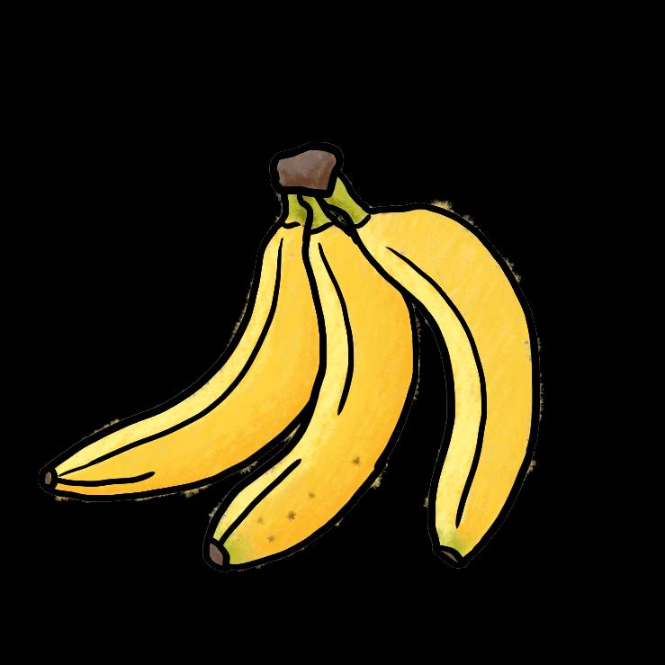

<!-- source: healthy-snacks-mandarin.md -->
## Page 1

**让您活得更 加健康的小贴士 午饭后还感觉饿吗？ 请吃无盐坚果或酸奶，而不是加工零食。** 往长期来看，它们对您的身体更好，并且它们为 您提供更长时间的能量。

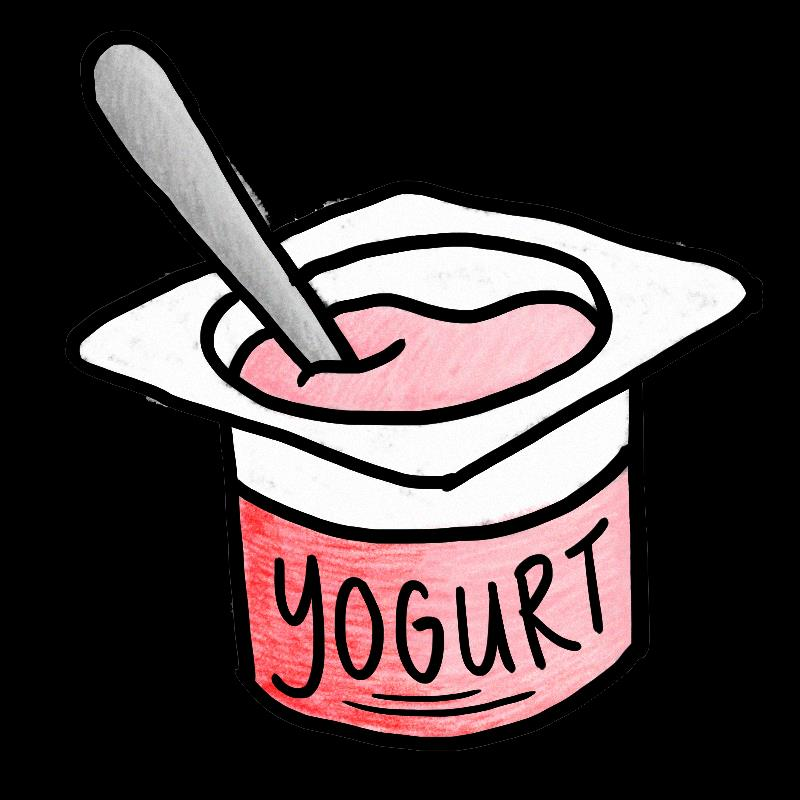

## Page 2

# **让您活得更 加健康的小贴士** 

**试试这些5 元的健康零食吧！** 你想在两餐之间吃点东西吗？ 

不要吃含糖零食，吃一些新鲜水果，例如香蕉或一包菠萝蜜。 它们的成本不到5 元，而且更健康。

<!-- source: healthy-snacks-tamil.md -->
## Page 1

# **நீங்கள் ஆவரொக்கியமொக இருக்க உதேிக்குறிப்புகள்** 

**மதியஉணவுக்குப் ிறகு சிக்கிறதொ? தப் டுத்தப் ட்டதின் ண்டங்களுக்குப் திலொக உப் ில்லொதககொட்ளடகள்அல்லதுதயிர்சொப் ிடுங்கள்.** அழைநீண்டகொலத்திற்குஉங்கள்உடலுக்குமிகவும்நல்லது, தமலும்அழைநீண்டகொலத்திற்குஆற்றழலத்தருளகின்றன.

## Page 2

**நீங்கள் ஆவரொக்கியமொக இருக்க உதேிக்குறிப்புகள் இந்தஆவரொக்கியமொன$5 சிற்றுண்டிகளைமுயற்சிக்கவும்!** உணவுக்குஇடையில்ஏதாவதுசாப்பிைஆடசப்படுகிறீர்காா? வாடைப்பைம்அல்லதுபலாப்பைம்பபான்றசிலபுதியபைங்கு **க** கு உங்கா்சர்க்கடரசிற்றுண்டிடயத்தவிர்க்கவும். அவற்றின்விடல $5க்கும்குடறவானதுமற்றும்மிகவும்ஆபராக்கியமானது.

<!-- source: healthy-snacks-thai.md -->
## Page 1

**ข้อแนะน าเพื่อให้ สุขภาพคุณดีขึ้น** 

**รู้สึกหิวหลังมื้อเที่ยง? ลองหันมารับประทานถั่วไม่ใส่เกลือ หรือโยเกิร์ต แทนที่ขนมขบเคี้ยว** ของกินพวกนี้จะดีกว่าส าหรับสุขภาพในระยะยาว และให้พลังงาน กับร่างกายได้นานขน **้**

## Page 2

**ข้อแนะน าเพื่อให้ สุขภาพคุณดีขึ้น** 

**ลองของว่างเพื่อสุขภาพราคา $ 5!** 

คุณมีความต้องการของว่างระหว่างมื้ออาหารหรือไม่? 

ลองงดขนมที่มีรสหวาน รับประทานผลไม้สด เช่น กล้วยหรือขนุนหน้่งห่อ ผลไม้ เหล่านั้นมีค่าใช้จ่ายน้อยกว่า $ 5 และมีคุณค่าทางสารอาหารที่ดีกว่ามาก

<!-- source: healthy-snacks-vietnamese.md -->
## Page 1

# Mẹo giúp b **ạ** n kh **ỏ** e m **ạ** nh h **ơ** n 

**Cảm thấy đói sau bữa ăn trưa?** 

**Ăn các loại hạt không muối hoặc sữa chua thay vì đồăn vặt đã qua chếbiến.** Chúng tốt hơn nhiều cho cơ thểcủa bạn vềlâu dài và chúng cung cấp cho bạn năng lượng lâu hơn.

## Page 2

# Mẹo giúp b **ạ** n kh **ỏ** e m **ạ** nh h **ơ** n 

**Hãy thửnhững món ăn nhẹlành mạnh này!** 

Bạn có thèm thứgì đó đểnhấm nháp giữa các bữa ăn không? 

Bỏqua  những món ăn vặt có đường và thay thếchúng bằng một sốloại trái cây tươi, chẳng hạn như chuối hoặc một gói mít.  Chúng có giá dưới 5 đô la và tốt cho sức khỏe hơn nhiều!

<!-- source: hidden-sugar-bombshells-bahasa.md -->
## Page 1

# Tips untuk membuat  Anda yang Lebih Sehat 

**7 Gula Tersembunyi asalah Bom dalam Diet Anda** 

Berikut adalah beberapa makanan populer dan kandungan gulanya yang tersembunyi! 

**Minuman Energi** (473ml) 51g gula = 10 sdt 

**Kopi** 

20g gula = 4 sdt 

**Milk Rusk** 

23g gula = kira-kira 5 sdt 

**1 Nastar** 

6,2 g gula = kira-kira 1 sdt 

**Gulab jammun** (per 100g) 52g gula = 10 sdt 

**3 biskuit tawar** 

22g gula = kira-kira 5 sdt 

**1 Ladoo** 

13g gula = 2,5 sdt 

**Konsumsi gula harian Anda tidak boleh lebih dari 10 sdt (berdasarkan asupan 2000 kalori harian). Dalam skenario berikut, apa yang dapat Anda hindari atau ubah agar tetap dalam batas 10 sdt per hari?** 

**Skenario 1:** 2 potong Roti Prata + 2 paket teh + 1 porsi kue susu = 14 sdt gula **Skenario 2:** 1 Biryani Ayam + 1 cangkir milo + 1 porsi biskuit tawar = 11 sdt gula **Skenario 3:** 1 Mi Goreng + 1 kaleng minuman 100 plus + 1 ladoo = 10,5 sdt gula **Skenario 4:** 1 Mi Wanton + 1 susu kacang kedelai + 1 babi asam manis = 12 sdt gula 

Sumber: 

1. “10 Hidden Sugar Bombshells in Your Diet”. HealthHub. December 2021. 

> 2. “Hawker Food and its Hidden Sugar”. Minmed Group Pte Ltd. April 2020. 

3. “Eating at the foodcourt” Tips to make healthier choices”. HealthXchange. SingHealth.

<!-- source: hidden-sugar-bombshells-bengali.md -->
## Page 1

<!-- Start of picture text -->
স্বাস্থ্য্ান থাোর চনেমা্লী <!-- End of picture text -->

**সাতটিআেচিেচ্িেলুোচেতচিচনআদেযতামারখাদেয|** এই খারন রকছু জনরপ্রয খাদয আরছ োরদর লুকারযে রচরনর পররোর্ স্হঃ 

**এনাচজব চেংে** (৪৭৩রেরল) **েচপ (েড়ঢ়র) যটাি চ্ষ্কুট** ৫১ গ্রাে রচরন = ১০ চা চােচ ২০ গ্রাে রচরন = ৪চা চােচ ২৩ গ্রাে রচরন = প্রায ৫ চা চােচ 

**এেটা আনারদসর যেে** ৬.২ গ্রাে রচরন = প্রায ১চা চােচ 

**গুলা্ জামুন** (প্ **র** ে ১০০ গ্রাে) ৫২ গ্রাে রচরন = ১০ চা চােচ 

**৩টা যেন চ্ষ্কুট ১টা লাড্ডু** ২২ গ্রাে রচরন = প্রায ৫চা চােচ ১৩ গ্রাে রচরন= ২.৫ চা চােচ 

**যতামার প্রদতযেচেন েশ িা িামদির য্চশ চিচন গ্রহণ েরা উচিত  না (েুই হাজার েযাদলাচরর সমপচরমান)। চনদির চেেু পচরচস্থ্চতদত তুচম চে খা্া ্া যোনটা যরদখ যোনটা খাা্া েচে তুচম ১০ িা িামি সমপচরমান চিচনর সীমার মদধয থােদত িাও।** 

**পচরচস্থ্চত ১:** ২ টুকররা রুটি পররাটা + ২ পযারকট  চা + ১ টা পটাস্ট রবষ্কুট= ১৪ চা চােচ রচরন। **পচরচস্থ্চত ২:** ১ টা পোরগ পপালাও + ১ কাপ োইরলা+ ১ টা রবষ্কুট= ১১ চা চােচ রচরন। **পচরচস্থ্চত ৩:** ১টা রে পগাররঙ্গ+ এক কযান ১০০ প্লাস্+ ১টা লাড্ডু= ১০.৫ চা চােচ রচরন। **পচরচস্থ্চত ৪:** ১ টা ওযানটন নুিলস্ + একটা স্যা রবন দুধ + ১ টা টক রেরি শুযর= ১২ চাচােচ রচরন। 

Sources: 

> 1. “10 Hidden Sugar Bombshells in Your Diet”. HealthHub. December 2021. 

> 2. “Hawker Food and its Hidden Sugar”. Minmed Group Pte Ltd. April 2020. 

> 3. “Eating at the foodcourt” Tips to make healthier choices”. HealthXchange. SingHealth.

<!-- source: hidden-sugar-bombshells-english.md -->
## Page 1

**8 hidden sugar bombshells in your diet** 

Here are some popular foods and their hidden sugar content! 

**Energy Drink** (473ml) 51g of sugar = 10 tsps 

**Kopi** 

20g of sugar = 4 tsps 

**Milk Rusk** 

23g of sugar = approx 5 tsps 

**1 Pineapple tart** 6.2g of sugar = approx 1 tsp 

**1 slice of Bak Kwa** 32g of sugar = approx 6 tsps 

**Gulab jammun** (per 100g) 52g of sugar = 10 tsps 

**3 Plain biscuits** 

22g of sugar = approx 5 tsps 

**1 Ladoo** 

13g of sugar = 2.5 tsps 

**Your daily sugar consumption should not be more than 10 tsps (based on a daily 2000-calorie intake). In the following scenarios, what can you skip or switch out to keep within the daily 10-tsps limit?** 

**Scenario 1:** 2 pieces of Roti Prata + 2 packets of tea + 1 serving of milk rusk = 14 tsps of sugar **Scenario 2:** 1 Chicken Biryani + 1 cup of milo + 1 serving of plain biscuits = 11 tsps of sugar **Scenario 3:** 1 Mee Goreng + 1 can of 100 plus + 1 ladoo = 10.5 tsps of sugar **Scenario 4:** 1 Wanton noodles + 1 soya bean milk + 1 tua huay = 15 tsps of sugar 

Sources: 

1. “10 Hidden Sugar Bombshells in Your Diet”. HealthHub. December 2021. 

> 2. “Hawker Food and its Hidden Sugar”. Minmed Group Pte Ltd. April 2020. 

> 3. “Eating at the foodcourt” Tips to make healthier choices”. HealthXchange. SingHealth.

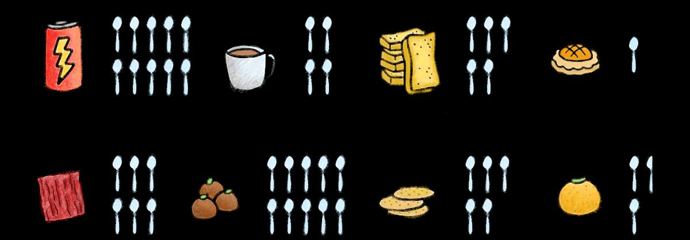

<!-- source: hidden-sugar-bombshells-mandarin.md -->
## Page 1

# **让您活得更 加健康的小贴士** 

**隐藏在饮食中的7个糖炸弹** 以下是一些受欢迎的饮食和隐藏其中的糖分！ 

**能量饮料** (473毫升) **咖啡 2 个红豆包** 含51克糖= 约10 茶匙 含20 克糖= 约4 茶匙 含13 克糖= 约2.5 茶匙 

**1 个凤梨挞** 含6.2 克糖= 约1 茶匙 

**虾饼** （每56克） **3 块原味饼干** 含12.1 克糖= 约2.4 茶匙 含22 克糖= 约5 茶匙 

**1 包菊花茶** 含20克糖= 约4.5 茶匙 

**您每日的糖摄入量，不应超过10茶匙（根据每日2000卡路里的摄入量计算）。根据 以下方案，您要如何采取避开或替换的方式，将每日摄入的糖分，限制在10茶匙内？ 方案1：** 1 碗鱼丸面+ 2 包茶+ 2 个红豆包= 24.5 茶匙糖。 **方案2：** 1 盘烤鸡饭+ 1 杯咖啡+ 1 份原味饼干= 12 茶匙糖 **方案3：** 1 碗米暹+ 1 罐100 plus饮料+ 1 条猪肠粉= 20.5 茶匙糖 **方案4：** 1 碗云吞面+ 1 杯豆浆+ 1 份咕噜肉= 12茶匙糖 

资料来源： 

- 1.《饮食中隐藏的10个糖炸弹》。保健中心。2021年12 月。 

- 2.《小贩美食和隐藏糖分》。Minmed集团。2020年4月。 

- 3.《在食阁用餐，如何做出更健康选择》。健康交换。新保健。 

4. Nutritionix 食物数据库。

<!-- source: hidden-sugar-bombshells-tamil.md -->
## Page 1

# **நீங்கள் ஆவரொக்கியமொக இருக்க உதேிக்குறிப்புகள்** 

**உங்கள் உணேில்மளறந்திருக்கும் சர்க்களர சம் ந்தப் ட்ட அதிர்ச்சி தரும் 7 தகேல்கள்** சில  ி  லமொன உணவு ைழககளில் மழறந்திருளக்கும் சர்க்கழ  இததொ! 

**ஆற்றல்பானம்** (473 மிலி) 51 கிராம்சர்க்கடர = 10 பதக்கரண்டி 

**காப்பி** 20 கிராம்சர்க்கடர = 4 பதக்கரண்டி 

**பால்ரஸ்க்** 23 கிராம்சர்க்கடர = பதாராயமாக 5 பதக்கரண்டி 

**1 அன்னாசிப்பழடாட் எனப்படும்இனிப்பு தின்பண்டவரக** 6.2 கிராம்சர்க்கடர = பதாராயமாக 1 டீஸ்பூன் 

**குலாப்ஜாமுன்** (100 கிராமில்) 52 கிராம்சர்க்கடர = 10 பதக்கரண்டி 

**3 சாோரணபிஸ்கட்** 22 கிராம்சர்க்கடர = பதாராயமாக 5 பதக்கரண்டி 

- **1 லட்டு** 

- 13 கிராம்சர்க்கடர = 

- 2.5 பதக்கரண்டி 

**நீங்கள்தினமும் 10 தேக்கரண்டிக்குதமல்சர்க்கரரசாப்பிடக்கூடாது (தினமும் 2000 கதலாரிஉட்ககாள்ளும்அடிப்பரடயில்கணக்கிடப்பட்டுள்ளது). பின்வரும் சூழ்நிரலகளில்சர்க்கரரஉட்ககாள்வரேே்தினமும் 10 தேக்கரண்டிஎனும்வரம்பிற்குள் ரவே்திருக்கஎவற்ரறநீங்கள்ேவிர்க்கலாம்அல்லதுமாற்றலாம்? சூழ்நிரல 1:** 2 ரராை்டிபிராை்ைாதுண்டுகா் + 2 பாக்ரகை்பதநீர் + 1 பால்ரஸ்க் = 14 பதக்கரண்டிசர்க்கடர **சூழ்நிரல 2:** 1 பகாழிபிரியாணி + 1 குவடாடமபலா + 1 சாதாரணபிஸ்கை் = 11 பதக்கரண்டிசர்க்கடர **சூழ்நிரல 3:** 1 நூைல்ஸ் + 1 டின் 100 ப்லாஸ்பானம் + 1 லை்டு = 10.5 பதக்கரண்டிசர்க்கடர **சூழ்நிரல 4:** 1 வாண்தான்நூைல்ஸ் + 1 பசாயாபீன்பால் + 1 இனிப்பு, புாிப்புபன்றிஇடறச்சி = 12 பதக்கரண்டிசர்க்கடர 

## **:** 

ஆதொ ங்கள்: 

1. "உங்கள் உணைில்மழறந்திருளக்கும் சர்க்கழ   ற்றிய அதிர்ச்சிதருளம் 10 

தகைல்கள்". பெல்த்ெப். டிசம் ர் 2021. 

2. "உணைங்கொடிநிழலயஉணைில்மழறந்திருளக்கும் சர்க்கழ ". மின்பமட் 

குழுமம்  ிழ பைட்லிமிடட். ஏப் ல் 2020. 3. "உணவு நிழலயகளில்சொப் ிடுதல்" ஆத ொக்கியமொன உணவு ததர்வுகழளச் பசய்ைதற்கொன உதைிக்குறிப்புகள்". பெல்த்எக்ஸ்தசஞ்ச். சிங்பெல்த்.

<!-- source: hidden-sugar-bombshells-thai.md -->
## Page 1

# **ข้อแนะน าเพื่อให้ สุขภาพคุณดีขึ้น** 

**ความรู้ที่น่าตกใจ ปริมาณน ้าตาลที่ซ่อนอยู่ในอาหาร 7 อย่าง** ขอดูอาหารยอดนิยมบางอย่างและปริมาณน ้าตาลที่ซ่อนอยู่ เช่น 

**เครื่องดื่มชูก าลัง** (473มล) น ้าตาล 51กรัม = 10 ช้อนชา 

## **กาแฟ** 

น ้าตาล 20 กรัม = 4 ช้อนชา 

## **นมรัสค์** 

น ้าตาล 23 กรัม = ประมาณ 5 ช้อนชา 

**ทาร์ตสับปะรด 1 ชิ้น** น ้าตาล 6.2 กรัม = ประมาณ 1 ช้อนชา 

**กุลับจัมมุ** (ต่อ 100 กรัม) น ้าตาล 52กรัม = 10 ช้อนชา 

**บิสกิตธรรมดา 3 ชิ้น** น ้าตาล 22 กรัม = ประมาณ 5 ช้อนชา 

**1 ลาดู** น ้าตาล 13 กรัม = 2.5 ช้อนช 

**การบริโภคน ้าตาลในแต่ละวันไม่ควรเกิน 10 ช้อนชา (มันขึ้นอยู่กับปริมาณแคลอรี่ 2,000 ต่อ วัน) ในสถานการณ์ต่อไปนี้ คุณสามารถข้ามหรือเปลี่ยนสิ่งใดเพื่อให้อยู่ภายในขีดจ ากัด 10 ช้อนชาต่อวัน** 

**สถานการณ์ที่ 1:** โรตีพราตา 2 ชิ้น + ชา 2 ซอง + นมรัสค์1 ที่ = น ้าตาล 14 ช้อนชา **สถานการณ์ที่ 2:** ข้าวหมกไก่  1 จาน + ไมโล1 ถ้วย + บิสกิตธรรมดา 1 ที่ = น ้าตาล 11 ช้อนชา **สถานการณ์ที่ 3:** หมี่โกเรง 1 จาน + 100 พลัส 1 กระป๋อง + ลาดู 1 อัน = น ้าตาล 10.5 ช้อนชา **สถานการณ์ที่ 4:** บะหมี่เกี๊ยว 1 ชาม+ นมถั่วเหลือง 1 ที่ + หมูเปรี้ยวหวาน 1 ที่ = น ้าตาล 12 ช้อนชา 

**:** 

แหล่งความรู้ 

1. “ข้อมูลที่น่าตกใจ10 ข้อ น ้าตาลที่ซ่อนอยู่ในอาหารของคุณ” HealthHub. ฉบับ ธันวาคม ค.ศ. 2021. 

2. “อาหารตลาดนัดกับน ้าตาลที่ซ่อนอยู่” Minmed Group Pte Ltd. ฉบับ เมษายน ค.ศ. 2020. 

3. “การกินที่ศูนย์อาหาร” ข้อแนะน าในการเลือกเพื่อสุขภาพที่ดี” HealthXchange. SingHealth

<!-- source: hidden-sugar-bombshells-vietnamese.md -->
## Page 1

# Mẹo giúp b **ạ** n kh **ỏ** e m **ạ** nh h **ơ** n 

**7 quả bom Đường ăn ẩn trong Chế độ Ăn uống của bạn** Dưới đây là một số loại thực phẩm phổ biến và hàm lượng đường tiềm ẩn của chúng! 

**Nước tăng lực** (473ml) 51g đường = 10 thìa cà phê đường 

## **Cà phê đường** 

20g đường = 4 thìa cà phê đường 

**Bánh milk rusk** 23g đường = khoảng 5 thìa cà phê đường 

**1 Bánh dứa** 

6,2g đường = khoảng 1 thìa cà phê đường 

**3 cái bánh quy** 22g đường = khoảng 5 thìa cà phê đường 

**Gulab jammun** (100g) 52g đường = 10 thìa cà phê đường 

## **1 Ladoo** 

13g đường = 2,5 thìa cà phê đường 

<!-- Start of picture text -->
đường <!-- End of picture text -->

**Lượng đường tiêu thụ hàng ngày của bạn không được nhiều hơn 10 thìa cà phê đường (dựa trên mức thu  vào 2000 calo hàng ngày). Trong các tình huống sau đây, bạn có thể bỏ qua hoặc chuyển đổi gì để giữ trong giới hạn 10 thìa cà phê đường hàng ngày?** 

**Tình huống 1:** 2 miếng bánh Roti Prata + 2 bịch trà + 1 phần bánh milk rusk = 14 thìa cà phê đường **Tình huống 2:** 1 phần gà Biryani + 1 cốc milo + 1 khẩu phần bánh quy thường = 11 thìa cà phê đường đường **Tình huống 3:** 1 mì Goreng + 1 lon 100 plus + 1 viên ladoo = 10,5 thìa cà phê đường **Tình huống 4:** 1 mì Wanton + 1 sữa đậu nành + 1 thịt lợn chua ngọt = 12 thìa cà phê đường 

Nguồn: 

### **Proudly presented by:** 

> 1. “10 quảbom đường ẩn trong chếđộăn uống của bạn”.  HealthHub.  Tháng 12 năm 2021. 

> 2. "Thức ăn Hawker và Đường ẩn của nó".  Công ty Minmed Group. Tháng 4 năm 2020. 

> 3. “Ăn tại khu ăn uống” Mẹo đểcó những lựa chọn lành mạnh hơn ”. HealthXchange.  SingHealth.

<!-- source: how-to-deal-with-personal-problems-bengali.md -->
## Page 1

<!-- Start of picture text -->
উইন, েতামােক েদেখ মেন হে� মানিসক চােপ আেছা। আিম েতামার কথা েশানার জন� আিছ। অথবা ত�িম িক একজন FAST অিফসােরর সােথ কথা বলেত চাও? <!-- End of picture text -->

<!-- Start of picture text -->
ভাই, আমােক এই মােস টাকা পাঠােত হেব িকন্ত�... চ�াট করার সময়, FAST অিফসার জানত েপেরেছন েয েরিমট�াে�র জন� উইেনর সাহােয�র �েয়াজন। এই অ�াপ�ট... ব�বহার করা সহজ... েকানও লুকােনা িফ েনই। <!-- End of picture text -->

## Page 2

<!-- Start of picture text -->
FAST অিফসার উইেনর মনখারােপর সমেয় সাহায� করার জন� একজন ACE নােস�র ব�ব�া কেরেছন। হ�ােলা উইন, েকমন আেছা? <!-- End of picture text -->

<!-- Start of picture text -->
মেন রাখেবন আপনার আেবগেক ব�� কের রাখেবন না। সমথ�েনর জন� আপনার চারপােশর েলােকেদর সােথ েযাগােযাগ করেতই পােরন। <!-- End of picture text -->

<!-- Start of picture text -->
নাস� উইনেক মানিসক চাপ েমাকােবলা করার দ�তা এবং েকাথায় সহায়তা েপেত হেব তা েশখান। HealthServe-এর কাউে�লরেদর সােথ কথা বলার েচ�া ক�ন অথবা আপিন যিদ অসু� েবাধ কেরন, তাহেল িনকট� িচিকৎসা েকে� যান। <!-- End of picture text -->

## Page 3

আপনার বন্ধু, �মেমট, সুপারভাইজার বা FAST অিফসারেদর সােথ 

যিদ আপিন যিদ মনখারাপ েবাধ কেরন: HealthServe (24-ঘ�া) 3129 5000 

আপনার যিদ কােজর সােথ স�িক�ত েকানও পরামেশ�র �েয়াজন হয়: অিভবাসী �িমক েক� (24-ঘ�া) 6536 2692

<!-- source: how-to-deal-with-personal-problems-burmese.md -->
## Page 1

<!-- Start of picture text -->
Win မင်း�ကည့်ရတာ စိတ်ဖိစီးေနသလိ�ပဲ။ ငါ နားေထာင်ေပးမယ်ေလ။ ဒါမ�မဟ�တ် FAST ဝန်ထမ်းများနဲ့ စကားေြပာ�ကည့်ချင်ပါသလား။ <!-- End of picture text -->

<!-- Start of picture text -->
အစ်ကိ�၊ က�န်ေတာ် ဒီလမ�ာ အိမ်ြပန်ပိ�့ေပးဖိ�့ ပိ�က်ဆံလိ�ေနတာ ဒါေပမယ့်… စကားစြမည်ေြပာေနစဉ် FAST ဝန်ထမ်းက Win ေငွလ�ဲရာတွင် အက�အညီလိ�အပ်ေ�ကာင်း သိလိ�က်ရတယ်။ ဤအက်ပ်သည် ... အသံ�းြပ�ရလွယ်က � ပီး ... ေဖာ်ြပမထားေသာ အခေ�ကးေငွလည်း မ��ိဘ�း။ <!-- End of picture text -->

## Page 2

<!-- Start of picture text -->
FAST ဝန်ထမ်းသည် Win ၏  သ�နာြပ�ဆရာမက Win ရဲ့စိတ်ဖိစီးမ�ကိ� ကျေနေသာစိတ်ကိ�က�ညီရန် ACE  ရင်ဆိ�င်ေြဖ��င်း�ိ�င်ေသာ စွမ်းရည်��င့် သ�နာြပ�တစ်ဦးကိ�လည်း  ပံ့ပိ�းက�ညီရမည့်ေနရာများကိ�လည်း ထားေပးခဲ့သည်။  သင်�ကားေပးပါသည်။ HealthServe မ� အတိ�င်ပင်ခံများ��င့် မဂင်္လာပါ Win ဘယ်လိ�ေနလဲ။ စကားေြပာ�ကည့်ပါ သိ�့မဟ�တ် သင်ေနမေကာင်းပါက အနီးဆံ�း��ိ ေဆး ဘက်ဆိ�င်ရာဌာနသိ�့ သွားေရာက်ပါ။ ခံစားချက်ေတွကိ� ဖံ�းဖိမေနဖိ�့ကိ� မေမ့ပါ��င့်။ သင့်ပတ်ဝန်းကျင်��ိလ�များထံ ဆက်သွယ်အက�အညီေတာင်းခံရန် အဆင်ေြပပါတယ်။ <!-- End of picture text -->

## Page 3

<!-- Start of picture text -->
သင့်သ�ငယ်ချင်းများ၊ အခန်းေဖာ်များ၊ �ကီး�ကပ်ေရးမ�းများ သိ�့မဟ�တ် FAST ဝန်ထမ်းများ��င့် သင် စိတ်ဓာတ်ကျေနသည်ဟ� ခံစားေနရလ�င် HealthServe (24-နာရီပတ်လံ�း) 3129 5000 အလ�ပ်��င့်ပတ်သက်ေသာ အ�ကံဉာဏ်များ လိ�အပ်ပါက ေ� � ေြပာင်းအလ�ပ်သမားများစင်တာ (24-နာရီပတ်လံ�း) 6536 2692 <!-- End of picture text -->

<!-- source: how-to-deal-with-personal-problems-mandarin.md -->
## Page 1

<!-- Start of picture text -->
阿云，你看起来很紧张。 我在听着。还是你想试 着跟 FAST人员谈谈？ <!-- End of picture text -->

<!-- Start of picture text -->
兄弟，这个月我需要 寄钱回家，但是…… <!-- End of picture text -->

<!-- Start of picture text -->
聊天时︐FAST人员得知阿 云在汇款方面需要帮助︒ 这个应用程序...容易使用... 没有隐藏费用。 <!-- End of picture text -->

## Page 2

<!-- Start of picture text -->
FAST人员还让一位 护士还教导阿云一些压力 ACE 护士来帮助情绪低落 应对技巧︐以及在哪里可以 的阿云︒ 获得支持与援助︒ 嗨，阿云， 试着跟康侍的辅导员谈谈， 你感觉如何？ 或者如果你觉得不舒服， 可以前往最近的医疗中心。 记得，别压抑你的情绪。 鼓起勇气，向外求助， 周遭的人会给你支持。 向外求助︒ <!-- End of picture text -->

## Page 3

找你的朋友︑室友︑主管或 FAST人员谈谈︒ 

如果你情绪低落︐请拨打︓ 康侍 HealthServe（24小时） 3129 5000 

如果你需要与工作相关的建议︐ 请拨打︓ 客工中心（24 小时） 6536 2692

<!-- source: how-to-deal-with-personal-problems.md -->
## Page 1

Brother, I need to send money back home this month but... 

Win, you look stressed. I am here to listen. Or do you want to try speaking to a FAST officer? 

While chatting, the FAST officer learns Win needs help with remittance. 

This app... easy to use... no hidden fees.

## Page 2

The FAST officer also gets an ACE nurse to help with Win's low mood. Hi Win, how are you feeling? 

Remember not to bottle up your emotions. It is okay to reach out to the people around you for support. 

The nurse also teaches Win stress coping skills and where to get support. 

Try talking to counsellors from HealthServe or if you feel unwell, visit the nearest medical centre. 

<!-- Start of picture text -->
It is OKAY to reach out. <!-- End of picture text -->

## Page 3

# 

your friends, roommates, supervisors or FAST officers. 

If you feel down: HealthServe (24-hour) 3129 5000 

If you need work-related advice: Migrant Workers' Centre (24-hour) 6536 2692

<!-- source: how-to-handle-issues-at-work-bengali.md -->
## Page 1

<!-- Start of picture text -->
আিম বুঝেত পারিছ, ওেয়ন েক। <!-- End of picture text -->

<!-- Start of picture text -->
ভাই, আিম কােজর জায়গায় মািনেয় িনেত পারিছ না। আিম মানিসক চাপ অনুভব করিছ। FAST অিফসার ওেয়ন েক-এর সমস�ার িবষেয় সাহােয�র ��াব েদন। ওেয়ন েক, ত�িম �ঠক আেছা? ত�িম অিভবাসী �িমক েকে� কল করেত পােরা বা েতামার েকানও সমস�া থাকেল আমার সােথ কথা বলেত পােরা।। <!-- End of picture text -->

## Page 2

<!-- Start of picture text -->
FAST অিফসার ওেয়ন েক-েক  ওেয়ন েক তার সময় কােজর �ত�াশা স�েক� তার  পিরচালনা করেত এবং বেসর সােথ কথা বলেত  আেলাচনার পের আরও ভাল উৎসািহত কেরন। কাজ করেত স�ম হেয়েছ। েতামার েচাট েয পুেরাপুির েসের েতামােক এখন অেনক ওেঠিন তা আমােক জানােনার খুিশ লাগেছ ভাই। জন� ধন�বাদ, ওেয়ন েক। আিম েতামার কােজর চােপর ে�ে� ভারসাম� িনেয় আসার েচ�া করব। েকানও সমস�ায় পড়েল আমােদর কথা বলা উিচত। আমােদর উে�গ�িল ভাগ কের েনওয়া হল আমােদর ভাল েবাধ করার জন� �েয়াজনীয় সমথ�ন পাওয়ার �থম পদে�প। <!-- End of picture text -->

## Page 3

আপনার বন্ধু, �মেমট, সুপারভাইজার বা FAST অিফসারেদর সােথ 

যিদ আপিন যিদ মনখারাপ েবাধ কেরন: HealthServe (24-ঘ�া) 3129 5000 

আপনার যিদ কােজর সােথ স�িক�ত েকানও পরামেশ�র �েয়াজন হয়: অিভবাসী �িমক েক� (24-ঘ�া) 6536 2692

<!-- source: how-to-handle-issues-at-work-burmese.md -->
## Page 1

<!-- Start of picture text -->
ငါနားလည်တယ် Wen Ke <!-- End of picture text -->

<!-- Start of picture text -->
အစ်ကိ�၊ က�န်ေတာ် အလ�ပ်မ�ာ အဆင်မေြပဘ�း။ က�န်ေတာ်အတွက် စိတ်ဖိစီးမ�များေနတယ်။ FAST ဝန်ထမ်းမ�ာ Wen Ke ၏ြပဿနာများအတွက် အက�အညီေပး�ိ�င်ပါသည်။ Wen Ke အဆင်ေြပရဲ့လား ြပဿနာတစ်စံ�တစ်ရာ��ိပါက ေ� � ေြပာင်းအလ�ပ်သမားများစင်တာသိ�့ ဖ�န်းေခါ်ဆိ � ိ�င်သည် သိ�့မဟ�တ် က��်�ပ်��င့် ေဆွးေ�ွး�ိ�င်ပါသည်။ <!-- End of picture text -->

## Page 2

<!-- Start of picture text -->
FAST ဝန်ထမ်းသည် အလ�ပ်ေမ�ာ်လင့်ချက်များ��င့် Wen Ke သည် ေဆွးေ�ွး�ပီးေနာက် ပတ်သက်၍ Wen Ke အား သ�၏ အချိန်��င့် အလ�ပ်များကိ� ၎င်း၏သ�ေဌးအား ေြပာဆိ � ကည့်ရန် ပိ�မိ�ေကာင်းမွန်စွာ စီမံခန့်ခွဲ�ိ�င်ခဲ့သည်။ အားေပးသည်။ မင်းရဲ့ မကျက်ေသးတဲ့ ဒါဏ်ရာ အစ်ကိ� �ကည့်ရတာ အခ� အေ�ကာင်း သိခွင့်ေပးလိ�့ ပိ�ေပျာ်ေနပံ�ရတယ် ေကျးဇ�းတင်ပါတယ် Wen Ke မင်းရဲ့ အလ�ပ်ဝန်ကိ� ည �ိ ေပးပါမယ်။ ြပဿနာတစ်ခ�ခ� �ကံ�လာတဲ့အခါ စကားထ�တ်ေဖာ်ေြပာသင့်တယ်။ က��်�ပ်တိ�့၏စိ�းရိမ်ပ�ပန်မ�များကိ� မ�ေဝြခင်းသည် က��်�ပ်တိ�့ပိ�ေကာင်းစွာ ခံစားရရန် လိ�အပ်ေသာအက�အညီများရ��ိရန် ပထမဆံ�းေြခလ�မ်းြဖစ်သည်။ <!-- End of picture text -->

## Page 3

<!-- Start of picture text -->
သင့်သ�ငယ်ချင်းများ၊ အခန်းေဖာ်များ၊ �ကီး�ကပ်ေရးမ�းများ သိ�့မဟ�တ် FAST ဝန်ထမ်းများ��င့် သင် စိတ်ဓာတ်ကျေနသည်ဟ� ခံစားေနရလ�င် HealthServe (24-နာရီပတ်လံ�း) 3129 5000 အလ�ပ်��င့်ပတ်သက်ေသာ အ�ကံဉာဏ်များ လိ�အပ်ပါက ေ� � ေြပာင်းအလ�ပ်သမားများစင်တာ (24-နာရီပတ်လံ�း) 6536 2692 <!-- End of picture text -->

<!-- source: how-to-handle-issues-at-work-mandarin.md -->
## Page 1

<!-- Start of picture text -->
我了解，文克。 <!-- End of picture text -->

<!-- Start of picture text -->
兄弟，我工作上 应付不来，压力很大。 针对文克的问题︐ FAST人员予以协助︒ 文克，你还好吗？如果你有 任何问题，可以致电客工中 心或跟我谈谈。 <!-- End of picture text -->

## Page 2

<!-- Start of picture text -->
FAST人员还鼓励文克跟他 的老板谈谈工作期望︒ 讨论过后︐文克已能够更好 地管理自己的时间和工作︒ 文克，谢谢你让我 知道你的伤还没有 完全复原。我会调 兄弟，你现在 整你的工作量。 看起来更快乐了。 遇到任何问题时， 我们都应该说出来。 与人分享我们的忧虑是 取得支持与帮助的第一步， 向外求助︒ 这样我们才会心情舒畅。 <!-- End of picture text -->

## Page 3

找你的朋友︑室友︑主管或 FAST人员谈谈︒ 

如果你情绪低落︐请拨打︓ 康侍 HealthServe（24小时） 3129 5000 

如果你需要与工作相关的建议︐ 请拨打︓ 客工中心（24 小时） 6536 2692

<!-- source: how-to-handle-issues-at-work-tamil.md -->
## Page 1

<!-- Start of picture text -->
எனக்கு புரிகிறது, ெவன் ெக. <!-- End of picture text -->

<!-- Start of picture text -->
ேதாழேர, என்னால் ேவைலையச் சமாளிக்க முடியாது. நான் மன அழுத்தத்துடன் உள்ேளன். <!-- End of picture text -->

_FAST_ அதிகாரி ெவன் ெகயின் பிரச்சைனகளுக்கு உதவி ெசய்கிறார். 

ெவன் ெக, நலமா? நீங்கள் ெவளிநாட்டு ஊழியர்கள் நிைலயத்ைதத் ெதாடர்பு ெகாள்ளலாம் அல்லது உங்களுக்கு ஏேதனும் பிரச்சைனகள் இருந்தால் என்னிடம் ேபசலாம்.

## Page 2

<!-- Start of picture text -->
FAST  அதிகாரி ெவன்  ெவன் ெகயால் ெகைய தனது  கலந்துைரயாடலுக்குப் பிறகு முதலாளியிடம் ேவைல  தனது ேநரத்ைத நிர்வகித்து, எதிர்பார்ப்புகைளப் பற்றி  சிறப்பாக பணியாற்ற ேபச ஊக்குவிக்கிறார்.  முடிகிறது. உங்கள் காயம் முழுைமயாக நீங்கள் இப்ேபாது குணமைடயவில்ைல மகிழ்ச்சியாகத் என்பைத எனக்கு ெதரிகிறீர்கள் ேதாழேர. ெதரிவித்ததற்கு நன்றி, ெவன் ெக. உங்கள் பணிச்சுைமைய நான் சரிெசய்கிேறன். <!-- End of picture text -->

<!-- Start of picture text -->
எதாவது பிரச்சிைன வரும்ேபாது நாம் ேபச ேவண்டும். நம் கவைலகைளப் பகிர்ந்துெகாள்வது, நாம் நன்றாக உணரத் ேதைவயான ஆதரைவப் ெபறுவதற்கான முதல் படியாகும். <!-- End of picture text -->

## Page 3

# 

உங்கள் நண்பர்கள், அைற ேதாழர்கள், ேமற்பார்ைவயாளர்கள் அல்லது _FAST_ அதிகாரிகளுடன் நீங்கள் ேசார்வாக உணர்ந்தால்: ெஹல்த்சர்வ் ( _24-_ மணிேநரம்) 3129 5000 உங்களுக்கு ேவைல ெதாடர்பான ஆேலாசைன ேதைவப்பட்டால்: ெவளிநாட்டு ஊழியர்கள் நிைலயம் ( _24-_ மணிேநரம்) 6536 2692

<!-- source: how-to-handle-issues-at-work-thai.md -->
## Page 1

<!-- Start of picture text -->
ผมเข้าใจนายนะเหวินเค่อ <!-- End of picture text -->

<!-- Start of picture text -->
ผมทํางานไม่ได้เลย ผมเครียดมาก <!-- End of picture text -->

เจ้าหน้าที� FAST เข้ามาช่วย แก้ไขปัญหาของเหวินเค่อ 

เหวินเค่อ คุณเป็นยังไงบ้าง ถ้ามีปัญหา คุณโทรหาศูนย์บริการคนงานชาวต่าง ชาติหรือพูดคุยกับฉันได้นะครับ

## Page 2

<!-- Start of picture text -->
เจ้าหน้าที� FAST ยังแนะนําให้เหวิน เค่อพูดคุยกับนายจ้างเกี�ยวกับความคาด เหวินเค่อสามารถจัดการเวลาและ หวังในการทํางาน ทํางานได้ดีขึ�นหลังจากพูดคุยกัน ขอบคุณที�บอกกับผมว่าคุณยังไม่หายจาก การบาดเจ็บนะเหวินเค่อ ผมจะปรับ นายดูมีความสุขขึ�นนะ เปลี�ยนงานให้คุณ เราควรพูดออกมาเมื�อเผชิญกับปัญหา การพูดระบายความเครียดออกมาเป็นขั�นแรกใน การขอความช่วยเหลือที�จะทําให้เรารู้สึกดีขึ�น <!-- End of picture text -->

## Page 3

# 

เพื�อน เพื�อนร่วมห้อง หัวหน้างาน หรือเจ้าหน้าที� FAST 

# 

ถ้าคุณรู้สึกหดหู่: 

HealthServe (ให้บริการ �� ชม.) 3129 5000 

ถ้าคุณต้องการคําปรึกษาเกี�ยวกับเรื�องงาน: ศูนย์บริการคนงานชาวต่างชาติ (ให้บริการ �� ชม.) 6536 2692

<!-- source: how-to-handle-issues-at-work-vietnamese.md -->
## Page 1

<!-- Start of picture text -->
Mình hiểu mà, Wen Ke. <!-- End of picture text -->

<!-- Start of picture text -->
Cậu à, mình không xử lý nổi công việc. Mình căng thẳng quá. Chuyên viên FAST đề nghị giúp Wen Ke xử lý vấn đề. Wen Ke, anh ổn chứ? Anh có thể gọi Trung tâm Lao động Nhập cư hoặc nói chuyện với tôi nếu gặp vấn đề gì. <!-- End of picture text -->

## Page 2

Chuyên viên FAST cũng động viên Wen Ke trao đổi với sếp về mong muốn của anh trong công việc. 

- Cảm ơn anh đã cho tôi biết vết thương của anh còn 

- chưa lành hẳn, Wen Ke à. Để tôi điều chỉnh khối 

- lượng công việc cho anh. 

<!-- Start of picture text -->
Chúng ta nên lên tiếng khi gặp bất kỳ vấn đề gì. Chia sẻ nỗi âu lo là bước đầu tiên giúp bạn tìm kiếm sự hỗ trợ để tâm trạng tích cực hơn. <!-- End of picture text -->

<!-- Start of picture text -->
Sau buổi trao đổi đó, Wen Ke có thể quản lý thời gian và làm việc tốt hơn nhiều. Trông cậu phấn khởi hẳn lên. <!-- End of picture text -->

## Page 3

<!-- Start of picture text -->
Hãy tâm sự với <!-- End of picture text -->

bạn bè, bạn cùng phòng, sếp hoặc chuyên viên FAST của bạn. 

Nếu tâm trạng không ổn: HealthServe (24 giờ) **3129 5000** 

Nếu bạn cần tìm lời khuyên cho công việc: Trung tâm Lao động Nhập cư (24 giờ) **6536 2692**

<!-- source: how-to-handle-issues-at-work.md -->
## Page 1

<!-- Start of picture text -->
at How to handle issues work <!-- End of picture text -->

<!-- Start of picture text -->
Brother, I cannot cope at work. I am stressed. <!-- End of picture text -->

<!-- Start of picture text -->
I understand, Wen Ke. <!-- End of picture text -->

<!-- Start of picture text -->
The FAST officer offers help with Wen Ke’s problems. <!-- End of picture text -->

Wen Ke, are you ok? You can call the Migrant Workers' Centre or talk to me if you have any issues.

## Page 2

<!-- Start of picture text -->
The FAST officer also encourages Wen Ke to speak to his boss about work expectations. <!-- End of picture text -->

<!-- Start of picture text -->
Wen Ke is able to manage his time and work better after the discussion. You look happier now, brother. It is OKAY to reach out. <!-- End of picture text -->

<!-- Start of picture text -->
Thanks for letting me know your injury has not fully healed, Wen Ke. I will adjust your workload. <!-- End of picture text -->

<!-- Start of picture text -->
We should speak up when we face any problems. Sharing our worries is the first step to getting the support we need to feel better. <!-- End of picture text -->

## Page 3

# 

your friends, roommates, supervisors or FAST officers. 

If you feel down: HealthServe (24-hour) 3129 5000 

If you need work-related advice: Migrant Workers' Centre (24-hour) 6536 2692

<!-- source: physical-activity-bahasa.md -->
## Page 1

# Tips untuk membuat  Anda yang Lebih Sehat 

**Apakah berat badan Anda sehat?** Hitung **Berat** (kg) = **BMI Tinggi** X **Tinggi** (m) Anda 

**Tinggi** X **Tinggi** (m) 

**Kelebihan berat badan* mengakibatkan masalah kesehatan termasuk:** 

Tekanan darah tinggi • Diabetes • Penyakit jantung koroner 

• Kanker jenis tertentu • Gangguan tulang dan sendi 

(*BMI di zona oranye dan merah) 

**Bagaimana cara membaca BMI Anda?** 

## **Apa alasan Anda TIDAK berolahraga?** 

- **Alasan 1: Saya terlalu lelah.** 

### **Kisaran BMI** 

18.5 - 22.9 = Risiko Rendah 23 - 27.4 = Risiko Sedang 27.5 ke atas = Berisiko Tinggi 

<!-- Start of picture text -->
Berat (kg) BMI 110 27.5 100 90 23 80 70 18.5 60 50 40 1.4 1.5 1.6 1.7 1.8 1.9 Tinggi (m) <!-- End of picture text -->

**Tip:** Bagi latihan Anda menjadi 3 kali selama 10 menit setiap kali. 

- **Alasan 2: Saya terlalu malas.** 

**Tip:** Dapatkan teman atau kolega untuk membantu Anda tetap termotivasi. 

- **Alasan 3: Saya terlalu sibuk.** 

**Tip:** Rencanakan kegiatan di luar ruangan dengan temanteman Anda. Misalnya, bermain kriket atau sepak bola dengan teman-teman Anda. 

## **Cara mulai berolahraga:** 

- Berolahragalah 3 sampai 4 kali seminggu. 

- Fokus pada latihan yang berbeda untuk memperkuat bagian tubuh yang berbeda seperti memanjat tangga atau joging untuk kesehatan jantung. 

- Perlahan-lahan tingkatkan intensitas dan durasi aktivitas Anda saat tingkat kebugaran Anda meningkat. 

- Setelah berolahraga, lakukan pendinginan dengan melakukan peregangan lembut. ✔ ⨯ 

- Saat mengangkat beban, jaga agar punggung tetap lurus untuk mencegah cedera punggung. 

## **_Ingat, setiap usaha berarti!_** 

Sumber: 

1. “What is a Healthy Weight?”. Healthhub. March 2022. 

2. “How to Get Up and Go”. Healthhub. December 2021.

<!-- source: physical-activity-bengali.md -->
## Page 1

<!-- Start of picture text -->
স্বাস্থ্যোে থাকার তেেমােলী <!-- End of picture text -->

**তিামার ওজে কী স্বাস্থ্যকর?** 

ত োমোর **ওজে** (তকহি) **তে.এম.আই** = হিসোব কর **উচ্চিা** X **উচ্চিা** (হমটোর) 

**অতিতরক্ত ওজে স্বানস্থ্যর জেয ক্ষতির কারণ হনেেঃ** উচ্চ রক্ত চোপ • বহু মুত্রবযোহি (ডোইরবটিস) • হৃদহপরের িমহন িহন  বযোহি • হকছু কযোন্স্যোর। • িোড় এবং িরড়ো িহন  বযোহি (*হব.এম.আই. কমলো ও লোল িোয়গোয় পড়রল) 

**তিামার তে.এম.আই টা তকভানে যাোই করনে?** 

## **BMI Ranges:** 

১৮.৫-২২.৯= কম ঝুহক ২৩-২৭.৪= মোঝোহর ঝুহক ২৭.৫ এবং  োর উপরর = উচ্চ ঝুহক। 

## ওিন (তকহি) হব.এম.আই 

<!-- Start of picture text -->
110 27.5 100 90 23 80 70 18.5 60 50 40 1.4 1.5 1.6 1.7 1.8 1.9 উচ্চ ো (হমটোর) <!-- End of picture text -->

# **তিামার েযাোম ো করার কারণ কী?** 

- **প্রথম কারণেঃ আতম প্রেন্ড পতরশ্রান্ত উপনদশেঃ** হ ন ভোরগ ভোগ করর বযোয়ম করর  িরব, প্ **র** যকবোর ১০ হমহনট করর। 

- **তিিীে কারণেঃ আতম অতিতরক্ত অলস। উপনদশেঃ** একটো বন্ধু বো কোরির সঙ্গী তিোগোড় কররো তে ত োমোরক উৎসোি হদরব। 

- **িৃিীে কারণেঃ আতম অতিতরক্ত েযস্ত। উপনদশেঃ** বোইরর তকোন কোেযকলোপ পহরকল্পনো কররো ত োমোর বন্ধুরদর সোর । তেমন, বন্ধুরদর সোরে ফুটবল বো হিরকট তেরলো। 

# **তকভানে েযাোম করা শুরু করোেঃ** 

- সপ্তোরি ৩ তেরক ৪ বোর বযোয়োম করবো। 

- ● হবহভন্ন িররনর বযোয়োম করবো তেমন, হসিঁহড় হদরয় উঠবো, িোটো িোটি করো তেগুরলো ত োমোর হৃদহপরের িনয ভোরলো  এবং শরীররর হবহভন্ন অংশ শহক্তশোলী িয়। 

- ত োমোর শোরীরীক উপেুক্তটোর উন্নহ র সোরে সোরে ত োমোর কমযক্ষম োর সময় এবং পহরমোন বোড়োবো। 

- বযোয়োম করোর পর পর, িোল্কো িো  পো নোহড়রয়, ঠোেো িও। 

- ওিন উঠোরনোর সময় তপছন হদকটো তসোিো রোের  িরব ✔ ⨯ 

- েো ত  করর হপরছ তকোন আঘো  নো িয়। 

# **মনে রাখনে, প্রতিটি প্রনেষ্টার প্রতিদাে রনেনে** 

1. “What is a Healthy Weight?”. Healthhub. March 2022. 

2. “How to Get Up and Go”. Healthhub. December 2021. 

সূত্র:

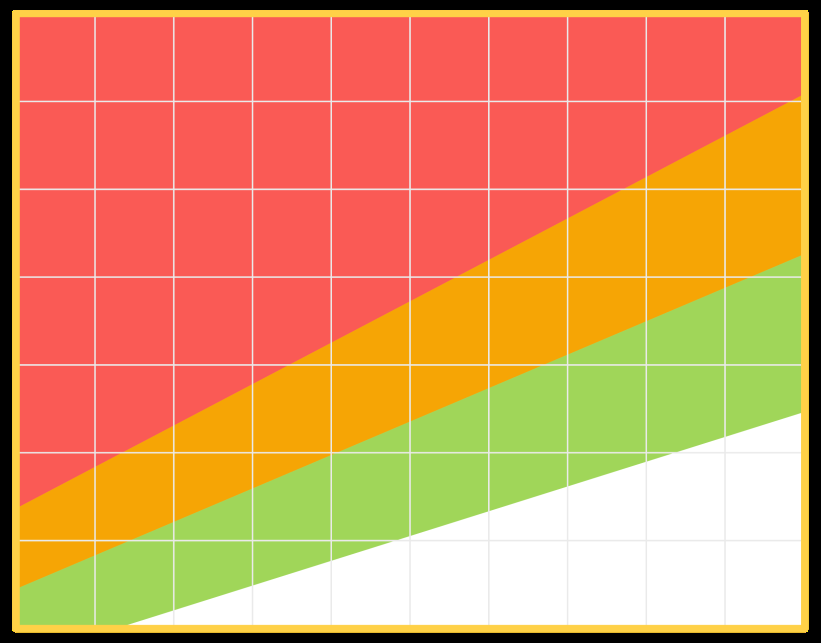

<!-- source: physical-activity-english.md -->
## Page 1

**Is your weight healthy?** 

Calculate your **Weight** (kg) = **BMI Height** X **Height** (m) 

**Being overweight* results in health problems including:** 

High blood pressure • Diabetes • Coronary heart disease 

• Certain cancer • Bone and joint disorders 

(*BMIs in orange and red zones) 

# **How to read your BMI?** 

## **BMI Ranges:** 

18.5 - 22.9 = Low Risk 

23 - 27.4 = Moderate Risk 

27.5+ = High Risk 

<!-- Start of picture text -->
Weight (kg) BMI 110 27.5 100 90 23 80 70 18.5 60 50 40 1.4 1.5 1.6 1.7 1.8 1.9 Height (m) <!-- End of picture text -->

   - **What’s your reason for NOT exercising?** 

- **Reason 1: I’m too tired. Tip** : Break your exercises into 3 times for 10 minutes each time. 

- **Reason 2: I’m too lazy. Tip** : Get a friend or colleague to help you stay motivated. 

- **Reason 3: I’m too busy. Tip** : Plan an outdoor activity with your friends. For example, play cricket or football with your friends 

# **How to start exercising:** 

- Exercise 3 to 4 times a week. 

- Focus on different exercises to strengthen different parts of the body such as stairclimbing or jogging for heart health. 

- Slowly increase the intensity and duration of your activity as your fitness level improves. 

- After exercising, cool down by performing gentle stretches. ✔ ⨯ 

- When lifting weights, keep your back straight to prevent back injury. 

# **_Remember, every effort counts!_** 

Sources: 

1. “What is a Healthy Weight?”. Healthhub. March 2022. 

2. “How to Get Up and Go”. Healthhub. December 2021.

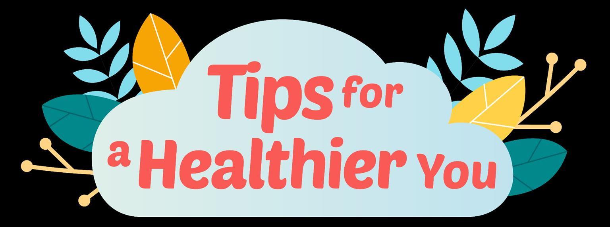

<!-- source: physical-activity-mandarin.md -->
## Page 1

# **让您活得更 加健康的小贴士** 

## **你的体重符合健康标准吗？** 

计算身体质量指数 **体重** (公斤) = **身高** X **身高** (公尺) **BMI** 

**身体超重*会导致各种健康问题，包括：** 高血压• 糖尿病• 冠心病• 某些癌症• 骨关节疾病 （*橙色和红色区域的身体质量指数BMI） 

## **如何阅读您的身体质量指数？** 

**BMI范围：** 

18.5 - 22.9 = 低风险 23 - 27.4   = 中等风险 27.5 及以上= 高风险 

## **你不做运动的原因是什么？** 

- **原因一：我太累了。 提示：** 将您的运动时间分成3段，每段10分钟。 

- **原因2：我太懒了。** 

- **提示：** 请一位朋友或同事帮助你，激励你要保持活 力。 

- **原因3：我太忙了。** 

#### 重量（公斤） 身体质量指数 

<!-- Start of picture text -->
110 27.5 100 90 23 80 70 18.5 60 50 40 1.4 1.5 1.6 1.7 1.8 1.9 高度（公尺） <!-- End of picture text -->

- **提示：** 跟朋友一起计划从事各种户外活动，例如， 一起打乒乓或踢足球。 

## **如何开始锻炼自己：** 

- 每星期运动3到4次。 

- 专注于不同性质的锻炼，加强身体的不同部位，例 如爬楼梯或慢跑，以保持心脏健康。 

- 随着健康水平获得改善，慢慢增加运动的强度和持 续运动的时长。 

- 运动后，进行轻柔的伸展运动，使体温下降。 

- 举重时，保持背部挺直，防止背 ✔ ⨯ 部受伤。 

### **请记住：每一次的锻炼都很重要，必须坚持到底！** 

资料来源： 

- 1.《什么是健康的体重？》。保健中心。2022年3月。 

2.《如何起身和走动》。保健中心。2021年12月。

<!-- source: physical-activity-tamil.md -->
## Page 1

<!-- Start of picture text -->
நீங்கள் ஆர ொக்கியமொக இருக்க உதவிக்குறிப்புகள் <!-- End of picture text -->

**உங்கள் எனை ஆர ொக்கியமொைதொ?** 

**எனை** (கில ோ) உங்கள் = **பிஎம்ஐ உய ம்** X **உய ம்** (மீ) 

**உைல் எனை அதிகமொக இருந்தொல்* பின்வருவை உள்பை, உைல்நலப்பி ச்சினைகள் ஏற்பைலொம்:** உயர் இரத்தஅழுத்தம் • சர்க்கறர ல ோய் • இதய ல ோய் • சி  வறகயோன புற்றுல ோய் • எலும்பு மற்றும்மூட்டு லகோளோறுகள் 

(*பிஎம்ஐஆரஞ்சு மற்றும் சிவப்பு  ிைங்களில்உள்ளது) 

**உங்கள் பிஎம்ஐஎப்படி படிப்பது?** 

**பிஎம்ஐவ ம்புகள்** 

18.5 - 22.9 = குறைந்த அபோயம் 23 - 27.4 = மிதமோன அபோயம் 27.5+ = அதிக அபோயம் 

<!-- Start of picture text -->
எறை (கில ோ) பிஎம்ஐ 110 27.5 100 90 23 80 70 18.5 60 50 40 1.4 1.5 1.6 1.7 1.8 1.9 உயரம் (மீ) <!-- End of picture text -->

# **:** 

- **நீங்கள் உைற்பயிற்சி கசய்யொததற்குஎன்ைகொ ணம்?** ● **கொ ணம் 1:** எனக்கு மிகவும் லசோர்வோக இருக்கிைது. **உதவிக்குறிப்பு:** 3 லவறளகள்உைற்பயிற்சி சசய்யவும். ஒவ்சவோரு முறையும் 10  ிமிைங்களுக்குச்சசய்யவும். 

- ● **கொ ணம் 2:** எனக்கு மிகவும் லசோம்ப ோக இருக்கிைது. **உதவிக்குறிப்பு:** உங்கறள உற்சோகப்படுத்துவதற்குஒரு ண்பர் அல் து சக ஊழியரின்உதவிறய  ோைவும். 

- ● **கொ ணம் 3:** எனக்கு  ிறைய லவற  இருக்கிைது. **உதவிக்குறிப்பு:** உங்கள்  ண்பர்களுைன்சவளிப்புை ைவடிக்றகறயத்திட்ைமிைவும். உதோரணமோக, உங்கள் ண்பர்களுைன்கிரிக்சகட் அல் து கோற்பந்து விறளயோைவும். 

- **உைற்பயிற்சினயஎவ்வொறு கதொைங்குவது:** 

- ● வோரத்திற்கு 3 முதல் 4 முறை வறர உைற்பயிற்சி சசய்யவும். 

- உை ின் சவவ்லவறு போகங்கறளவலுப்படுத்த பல்லவறு பயிற்சிகளில்கவனம் சசலுத்தவும், அதோவது, இதயம் ஆலரோக்கியமோக இருக்க படிக்கட்டு ஏறுதல் அல் து சமதுலவோட்ைபயிற்சி சசய்யவும். 

- ● உங்கள் உைலுறுதி ிற  லமம்படும் லபோது, **​** உங்கள் பயிற்சிகறளத்தீவிரப்படுத்திபயிற்சி சசய்யும் 

- ல ரத்றதயும்சமதுவோக அதிகரிக்கவும். 

- ● உைற்பயிற்சிக்குப்பிைகு, உைற க்குளிரறவக்க, சமன்றமயோன  ீட்டி  ிமிர்த்தும்பயிற்சிகறளச் ✔ ⨯ 

- சசய்யவும். 

- ● எறை தூக்கும்லபோது, முதுகில்கோயம் ஏற்பைோமல்இருக்க உங்கள் முதுறக ல ரோக றவக்கவும். 

**நினைவில் ககொள்ளுங்கள், ஒவ்கவொரு முயற்சியும் முக்கியமொைது!** 

ஆதாரங்கள்: 

1. "ஆரராக்கியமானஎடைஎன்றால்என்ன?". ஹெல்த்ெப். மார்ச் 2022. 2. "எப்படிஎழுந்துஹசல்வது". ஹெல்த்ெப். டிசம்பர் 2021.

<!-- source: physical-activity-thai.md -->
## Page 1

# **ข้อแนะน ำเพื่อให้ สุขภำพคุณดีขึ้น** 

## **น ้ำหนักของคุณถูกพลำนำมัยหรือเปล่ำ** 

**น ้ำหนัก** (กก.) 

ค านวณ **น ้ำหนัก** (กก.) = **BMI ควำมสูง** คูณ **ควำมสูง** (ม.) 

**กำรมีน ้ำหนักเกิน* ส่งผลให้เกิดปัญหำสุขภำพ ได้แก่:** ความดันโลหิตสูง• เบาหวาน• โรคหลอดเลือดหัวใจ• มะเร็งบางชนิด • ความผิดปกติของกระดูกและข้อ (*BMI ในโซนสีส้มและสีแดง) 

## **วิธีกำรอ่ำนค่ำดัชนีมวลกำยของคุณ** 

### **ช่วงค่ำดัชนีมวลกำย** 

18.5 - 22.9 = ความเสี่ยงต ่า 23 - 27.4 = ความเสี่ยงปานกลาง 27.5 ขึ้นไป = ความเสี่ยงสูง 

- 23 - 27.4 = ความเสี่ยงปานกลาง 

#### น ้าหนัก (กก.) ค่าดัชนีมวลกาย 

<!-- Start of picture text -->
110 27.5 100 90 23 80 70 18.5 60 50 40 1.4 1.5 1.6 1.7 1.8 1.9 ความสูง (ม.) <!-- End of picture text -->

## **เหตุผลอะไรที่คุณไม่ ออกก ำลังกำย** 

- **เหตุผลที่ 1: ผมรู้สึกเหนื่อยมำก ข้อแนะน ำ:** การออกก าลังกายแบ่งออกเป็น 3 ช่วง ช่วงละ 10 นาที 

- **เหตุผลที่ 2: ผมรู้สึกขี้เกียจ ข้อแนะน ำ:** หาเพื่อนหรือเพื่อนร่วมงานเพื่อช่วยให้คุณมีแรง บันดาลใจ 

- **เหตุผลที่ 3: ผมยุ่งมำก ข้อแนะน ำ:** ตั้งเป้ากับเพื่อนเพื่อร่วมกิจกรรมกลางแจ้งกัน เช่น เล่นคริกเก็ตหรือฟุตบอลกัน 

## **วิธีในกำรเริ่มออกก ำลังกำย** 

- ให้ออกก าลังกาย 3 ถึง 4 ครั้งต่อสัปดาห์ 

- พยายามออกก าลังกายใช้แบบต่าง ๆ เพื่อเสริมสร้างส่วนต่างๆ ของร่างกาย เช่น การขึ้นบันไดหรือการวิ่งเหยาะ ๆ เพื่อสุขภาพ หัวใจ 

- ค่อย ๆ เพิ่มความเข้มข้นและระยะเวลาของกิจกรรมเมื่อระดับความ ฟิตของคุณดีขึ้น 

- หลังจากออกก าลังกายแล้ว ให้คลายร้อนด้วยการยืดเส้นยืดสาย อย่างเบา ๆ ✔ ⨯ 

- เมื่อยกน ้าหนัก ให้หลังตรงเพื่อป้องกันการ บาดเจ็บที่ตัวข้างหลัง 

## **จงจ ำไว้ ทุกควำมพยำยำมมีค่ำ** 

แหล่งความรู้ 1. “น ้าหนักที่ดีต่อสุขภาพคืออะไร” Healthhub. ฉบับ มีนาคม ค.ศ. 2022. 2. “วิธีการลุกขึ้นและไป”.Healthhub. ฉบับ ธันวาคม ค.ศ. 2021

<!-- source: physical-activity-vietnamese.md -->
## Page 1

# Mẹo giúp b **ạ** n kh **ỏ** e m **ạ** nh h **ơ** n 

**Cân nặng của bạn có khỏe không?** Tính chỉsố **Cân nặng** (kg) = **BMI Chiều cao** X **Chiều cao** (m) của bạn 

**Thừa cân * dẫn đến các vấn đềsức khỏe bao gồm:** Huyết áp cao • Bệnh tiểu đường • Bệnh tim mạch vành • Một sốbệnh ung thư • Rối loạn xương khớp (* ChỉsốBMI ởvùng màu cam và màu đỏ) 

**Làm thếnào đểđọc chỉsốBMI của bạn?** 

### **Phạm vi BMI** 

18,5 - 22,9 = Nguy cơ thấp 

- 23 - 27,4 = Nguy cơ vừa phải 27,5 trởlên = Nguy cơ cao 

<!-- Start of picture text -->
Trọng lượng (kg) BMI 110 27.5 100 90 23 80 70 18.5 60 50 40 1.4 1.5 1.6 1.7 1.8 1.9 Chiều cao (m) <!-- End of picture text -->

**Lý do bạn KHÔNG tập thểdục là gì?** 

- **Lý do 1: Tôi quá mệt mỏi. Mẹo:** Chia nhỏbài tập thểdục của bạn thành 3 lần, mỗi lần 10 phút. 

- **Lý do 2: Tôi quá lười biếng. Mẹo:** Nhờbạn bè hoặc đồng nghiệp giúp bạn duy trì động lực. 

- **Lý do 3: Tôi quá bận rộn. Mẹo:** Lên kếhoạch cho một hoạt động ngoài trời với bạn bè của bạn.  Ví dụ: chơi bóng chày hoặc bóng đá với bạn bè của bạn 

## **Cách bắt đầu tập thểdục:** 

- Tập thểdục 3 đến 4 lần một tuần. 

- Tập trung vào các bài tập khác nhau đểtăng cường các bộphận khác nhau của cơ thểnhư cầu thang hoặc chạy bộcho sức khỏe tim mạch. 

- Từtừtăng cường độvà thời gian hoạt động của bạn khi mức độtập thểdục của bạn được cải thiện. 

- Sau khi tập thểdục, làm mát bằng cách thực hiện các động tác kéo dài nhẹnhàng. ✔ ⨯ 

- Khi nâng vật nặng, giữlưng thẳng đểtránh chấn thương lưng. 

**_Hãy nhớrằng, mọi nỗlực đều có giá trị!_** 

Nguồn: 

1. "Cân nặng khỏe mạnh là gì?" Healthhub. Tháng 3 năm 2022. 

2. "Làm thếnào đểđứng dậy và đi". Healthhub. Tháng 12 năm 2021.

<!-- source: support-and-care-for-your-friends-bengali.md -->
## Page 1

**সেেব শ্রমিকদের জন্যআরও সবমি েহায়তা করুন্ যারা** 

# **েহায়তা** এবং **যত্ন** আপনার **বন্ধুদের** জনয 

অসুস্থ ববাধ করছেন বকাছনা বকাম্পাননবা ডছমে নতুন নসঙ্গাপুছর নতুন (2 বেছরর কম) 

**সযেব লক্ষণ সেদে বুঝদবন্ সয সকাদন্া একজদন্র োহাদযযর প্রদয়াজন্ হদতপাদর** 

বেছে মছন হয় বে ে **ু** নেত বা মাননসক চাছপ আছেন 

একা একা বাইছর থাছকন স্বাভানবছকর বচছয় নভন্নভাছব আচরণ কছেন 

প্রায়ই কাছজ অনুপনস্থত থাছকন 

**-- আপমন্ কীভাদব োহাযয করদত পাদরন্ --** সতকেতামূলক লক্ষণগুছলার প্রনত **ন্জর রােুন্ শুন্ুন্** এবং সহায়তা করুন আরও সাহাছেযর জনয তাছের **মলঙ্ক** করুন: 

FWMOMCare অযাছপর মাধযছম MOM-এর সাছথ কথা বলুন 

বহলথসাভে (HealthServe): 3129 5000 (কাউছেনলং এবং স্বাস্থয সংক্রান্ত পরামর্ে) অনভবাসী শ্রনমকছের বকন্দ্র(Migrant Workers’ Centre): 6536 2692 (কমেসংস্থান সংক্রান্ত নবষয়) 

" We Care!" WhatsApp নিকার বযবহার কছর তাছের জানান বে, আপনন তাছের কথা ভাছবন

<!-- source: support-and-care-for-your-friends-chinese.md -->
## Page 1

## 为有以下情况的员工 提供更多支持 

# 支持 与 关怀 您的 朋友 

感觉不适 刚加入公司或入 住宿舍 刚来新加坡 （不到两年) 

可能需要帮助的迹象 

看起来忧郁或压力大 独自待在外面 行为与平时不同 经常缺勤 

------ 如何提供帮助 -----留意 警示征兆 倾听 并给予支持 

引导 他们获得更多帮助： 

通过 FWMOMCare 应用与人力部 （MOM）联系 

康侍（HealthServe）：3129 5000 （心理和健康咨询） 

外籍劳工中心（MWC）：6536 2692 （就业问题） 

使用 “We Care!” WhatsApp 贴纸， 让他们知道您 关心他们

<!-- source: support-and-care-for-your-friends-english.md -->
## Page 1

<!-- source: support-and-care-for-your-friends-tamil.md -->
## Page 1

**த ொழிலொளர்களுக்குக் கூடு ல் ஆ ரவைக் கொட்டு** 

# **ஆ ரவு** மற்றும் **கைனிப்பு** உங்கள் **நண்பர்க ளுக்கொக** 

உடல்நிலை சரியில்லை ஒரு நிறுவனம் அல்ைது தங்குமிடத்திற்குப் புதியவர் சிங்கப்பூருக்குப் புதியவர் (2 வருடங்களுக்கும் குலைவானது) 

**ஒருைருக்கு உ ைி த வைப்படலொம் என்ப ற்கொன அறிகுறிகள்** 

சசாகமாகசவா அல்ைது மன அழுத்தமாகசவா ததரிவது 

தனியாக தவளியில் இருப்பது 

வழக்கத்திைிருந்து வித்தியாசமாகச் தசயல்படுதல் 

அடிக்கடி சவலையில் காணாமல் சபாவது 

**----- நீங்கள் எப்படி உ ைலொம் -----** எச்சரிக்லக அைிகுைிகலளக் **கைனியுங்கள் தகட்டு** ஆதரவு காட்டுங்கள் அவர்களுக்கு சமலும் உதவ **இவைக்கவும்** FWMOMCare ஆப் மூைம் MOM உடன் சபசுங்கள். 

- தெல்த்சர்வ்: 3129 5000 (ஆசைாசலன மற்றும் சுகாதார ஆசைாசலன) 

புைம்தபயர்ந்த ததாழிைாளர் லமயம்: 6536 2692 (சவலைவாய்ப்பு விஷயங்கள்) 

- நீங்கள் அக்கலை தகாண்டுள்ளீர்கள் என்பலத அவர்களுக்குத் ததரிவிக்க “நாங்கள் அக்கலை தகாள்கிசைாம்!” என்ை புைனம் ஸ்டிக்கர்கலளப் பயன்படுத்துங்கள்.

<!-- source: tips-for-a-healthier-you-diabetes-bahasa.md -->
## Page 1

# Tips untuk membuat  Anda yang Lebih Sehat 

## **Apa itu Diabetes?** 

Diabetes adalah kondisi medis kronis yang **memengaruhi kemampuan tubuh Anda untuk memecah gula** . Ini berarti banyak gula yang tersisa dalam darah Anda. 

Jika tidak diobati, Diabetes dapat menyebabkan kerusakan pada pembuluh darah, yang dapat menyebabkan serangan jantung, stroke, dan masalah dengan ginjal, mata, kaki, dan saraf.

## Page 2

# Tips untuk membuat  Anda yang Lebih Sehat 

**Bagaimana saya tahu jika saya menderita Diabetes?** Gejala umum Diabetes termasuk: 

**kencing berlebihan** 

<!-- Start of picture text -->
kelelahan <!-- End of picture text -->

**haus** 

**pusing** 

**penurunan berat badan yang tidak dapat dijelaskan** 

**rasa lapar yang berlebihan** 

Jika Anda memiliki diabetes atau menduga bahwa Anda memilikinya, silakan kunjungi dokter. Kunjungi klinik medis, terutama jika majikan Anda telah mendaftarkan Anda dengan Rencana Perawatan Primer. Temukan pusat kesehatan . terdekat dan lokasinya **<u>di sini</u>**

## Page 3

# Tips untuk membuat  Anda yang Lebih Sehat 

## **Cegah Diabetes!** 

Ikuti langkah-langkah sederhana ini untuk mengurangi resiko terkena Diabetes! 

Pilihlah makanan yang lebih sehat. 

Minum air putih daripada minuman manis. 

Berhenti atau kurangi alkohol dan merokok. 

Lakukan olahraga seperti Makan makanan berserat tinggi berjalan, joging, atau seperti kacang dal, havermut atau memanjat tangga. kacang-kacangan, kacang almond, biskuit gandum atau yogurt tawar. 

Sumber: 

1. “Let’s beat Diabetes”. HealthHub.

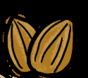

<!-- source: tips-for-a-healthier-you-diabetes-bengali.md -->
## Page 1

**স্বাস্থ্যবান থাকার ননয়মাবলী** 

## **ডায়ারবটিসনক?** 

এটিএকটিদীর্ঘস্থাযীশারীররকঅবস্থাযা **আপনারশরীররউপনস্থ্তনিননরকভেরেভেলার ক্ষমতারকপ্রোনবতকরর।** এরমানে, আপোর রনেপ্রচুররচরেথানকযায। 

যরদরচরকত্সাোকরাহয, তনবডাযানবটিস রেোলীগুরলরক্ষরতকনর, যাহার্ঘ অযার্াক, স্ট্রাকএবংরকডরে, স্ট্চাখ, পাএবংস্নাযুর সমসযাকরনতপানর।

## Page 2

# **স্বাস্থ্যবান থাকার ননয়মাবলী** 

**আমার ডায়ারবটিস আরে নকনা আনম নকোরব জানব?** ডাযানবটিনসর সাধারণ লক্ষণগুরলর হনে: 

**অতযনিক প্রস্রাব** 

**তৃষ্ণা** 

**বযাখ্যাহীন ওজনকমা** 

<!-- Start of picture text -->
ক্লানি <!-- End of picture text -->

<!-- Start of picture text -->
মাথা ভ ারা <!-- End of picture text -->

<!-- Start of picture text -->
অতযনিক ক্ষুিা <!-- End of picture text -->

যরদ স্ট্তামার ডাইনবটিস থানক বা সনেহ কনরা স্ট্যআনে, তাহনল ডাোর স্ট্দখাও। স্ট্মরডনকল এ যাও, আরও যাও যরদ স্ট্তামার চাকরর দাতা স্ট্তামানক প্রাথরমক পররচযঘা পররকল্পোনত ভরতঘ কররনয থানক। স্ট্তামার সবনচনয কানের স্ট্মরডনকল স্ট্সন্টার এবং তার ঠিকাো এখানে স্ট্দনখা|

## Page 3

**স্বাস্থ্যবান থাকার ননয়মাবলী** 

**ডায়ারবটিসপ্রনতররািকরুন!** 

ডাযানবটিসহওযারঝুুঁরককমানতএইসহজপদনক্ষপগুরলঅেুসরণকরুে! 

স্বাস্থযকরখাবারখাে। 

রচরেযুেপােীনযরপররবনতঘ পারেপােকরুে। 

অযালনকাহলএবংধূমপাে স্ট্েন়ে রদেবাকরমনযরদে। 

বযাযামকরনতহনবস্ট্যমে হার্া, হাল্কাস্ট্দৌ়োনোবা রসুঁর়ে রদনযউঠা। 

শষ্যআআুঁশজাতীযখাবার স্ট্খনতহনবস্ট্যমে, মূনেরডাল, বাদাম, েনমররবস্কুর্বাদই। 

সূত্র: 

1. “Let’s beat Diabetes”. HealthHub.

<!-- source: tips-for-a-healthier-you-diabetes-mandarin.md -->
## Page 1

# **让您活得更 加健康的小贴士** 

## **什么是糖尿病？** 

这是一种慢性疾病。 **它会影响您的 身体分解糖分的能力** 。这意味着您 的血液中会残留大量的糖分。 

如果不及时治疗，糖尿病会导致血 管损伤，从而导致心脏病发作、中 风以及肾脏、眼睛、足部和神经出 现问题。

## Page 2

**让您活得更 加健康的小贴士 如何知道我是否患有糖尿病？** 糖尿病的常见症状包括： 

**排尿过多** 

<!-- Start of picture text -->
疲惫 <!-- End of picture text -->

**口渴** 

<!-- Start of picture text -->
头晕 <!-- End of picture text -->

**不明原因的 体重减轻** 

<!-- Start of picture text -->
过度饥饿 <!-- End of picture text -->

如果您患有糖尿病或者怀疑自己患有糖尿病，请 去看医生，尤其是您的雇主已经为您注册加入初 级医疗计划之后，就应该去诊疗所就医。若欲查 找离您最近的医疗中心及其位置，请点击 **<u>此处</u>** 。

## Page 3

# **让您活得更 加健康的小贴士** 

## **如何预防糖尿病！** 

按照这些简单的步骤来降低患糖尿病的风险吧！ 

做出更健康的食物选择。 

喝水而不是含糖饮料。 

戒烟或减少饮酒和吸烟。 

锻炼自己，进行诸如步行、 慢跑和爬楼梯等运动。 

吃高纤维食物，如：全麦 食品、燕麦、豆类、杏仁、 小麦饼干和原味酸奶。 

1.《大家一起战胜糖尿病》。保健中心。 

资料来源：

<!-- source: tips-for-a-healthier-you-diabetes-tamil.md -->
## Page 1

# **நீங்கள் ஆர ோக்கியமோக இருக்க உதவிக்குறிப்புகள்** 

## **சர்க்கர ரநோய் என்றோல்என்ை?** 

இதுஒருநாள்பட்டமருத்துவநிலை, **இதுசர்க்கர ரயஉரைக்கும் உங்கள்உைலின்திறரை போதிக்கிறது** . இதன்பபாருள்உங்க இரத்தத்தில்நிலையசர்க்களலரஉள்ளது. 

நீரிழிவுநநாய்க்கு சிகளிச்லசயளிக்களப்படாவிட்டால், இரத்த நாளங்க க்குநசதம்ஏற்படுகளிைது, இது மாரலடப்பு, பக்களவாதம்மற்றும் சிறுநீரகளங்க , களண்க , பாதங்க மற்றும்நரம்புக ில்பிரச்சிலைக ஏற்படைாம்.

## Page 2

# **நீங்கள் ஆர ோக்கியமோக இருக்க உதவிக்குறிப்புகள்** 

**எைக்கு சர்க்கர  ரநோய் இருக்கிறதோஎன்பரத எப்படி அறிவது?** நீரிழிவு நநாயின்பபாதுவாை அைிகுைிக பின்வருமாறு: 

**அதிகப்படியோை சிறுநீர் கழித்தல்** 

<!-- Start of picture text -->
ச ார்வு <!-- End of picture text -->

**தோகம்** 

**தலை ்சுற்றை்** 

**விவரிக்கமுடியாத எலைஇழப்பு** 

**அதிகப்படியான பசி** 

உங்க க்கு நீரிழிவு நநாய் இருந்தால் அல்ைது இருக்களிைபதன்றுசந்நதகளப்பட்டால், மருத்துவலர நாடவும். குைிப்பாகள உங்க முதைாளி உங்களலள அடிப்பலட பராமரிப்புத்திட்டத்தில் நசர்த்திருந்தால் மருந்தகளத்திற்குச்பசல்ைவும். உங்க அருகளிலுள்ள மருத்துவ நிலையங்களலளயும்அவற்ைின் முகளவரிகளலளயும் <u>இங்நக</u> பார்க்களைாம். 

**:**

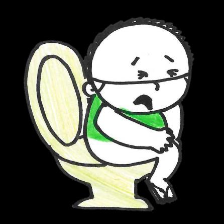

## Page 3

**நீங்கள் ஆர ோக்கியமோக இருக்க உதவிக்குறிப்புகள்** 

**நீரிழிவுரநோரயத்தடுக்க!** நீரிழிவுநநாயின்அபாயத்லதக்குலைக்களஇந்தஎளியவழிமுலைகளலளப்பின்பற்ைவும்! 

ஆநராக்களியமாைஉணவுத் . நதர்வுகளலளச்பசய்யுங்க 

சர்க்களலரபாைங்க க்கு பதிைாகளதண்ணீர் குடிக்களவும். 

மதுமற்றும்புலகளப்பழக்களத்லத லகளவிடவும்அல்ைது குலைக்களவும். 

நலடப்பயிற்சி, பமதுநவாட்டம்அல்ைது படிக்களட்டுஏறுதல்நபான்ை பயிற்சிகளலளச்பசய்யவும். 

பச்லசப்பயிர்ஓட்ஸ்அல்ைது அவலர, பாதாம், நகளாதுலம பிஸ்களட்அல்ைதுசாதாரணத்தயிர் நபான்ைநார்ச்சத்துநிலைந்த உணவுகளலளச்சாப்பிடவும். 

ஆதாரம்: 

1. "நீரிழிவைவைல்வைாம்". வெல்த்ெப்.

<!-- source: tips-for-a-healthier-you-diabetes-thai.md -->
## Page 1

# **ข้อแนะน ำเพื่อให้ สุขภำพคุณดีขึ้น** 

## **เบำหวำนคืออะไร?** 

**เป็นภำวะทำงกำรแพทย์เรื้อรังที่ส่งผลต่อ ควำมสำมำรถในกำรย่อยสลำยน ้ำตำลของ ร่ำงกำย** ซึ่งหมายความว่าน ้าตาลจ านวนมากที่ เหลืออยู่ในเลือดของคุณ 

หากไม่ได้รับการรักษา โรคเบาหวานจะท าให้ หลอดเลือดเสียหาย ซึ่งอาจน าไปสู่อาการหัวใจ วาย โรคหลอดเลือดสมอง และปัญหาเกี่ยวกับ ไต ดวงตา เท้า และเส้นประสาท

## Page 2

**ข้อแนะน ำเพื่อให้ สุขภำพคุณดีขึ้น** 

**จะรู้ได้อย่ำงไรว่ำเป็นเบำหวำน?** อาการทั่วไปของโรคเบาหวาน ได้แก่ : 

**ปัสสำวะมำกเกินไป** 

**อ่อนเพลีย** 

**ควำมกระหำยน ้ำ** 

**อำกำรวิงเวียนศีรษะ** 

**น ้ำหนักลดโดยไม่ ทรำบสำเหตุ** 

**ควำมหิวมำกเกินไป** 

หากคุณเป็นเบาหวานหรือสงสัยว่าเป็นเบาหวาน โปรด ไปพบแพทย์ ไปที่คลินิกการแพทย์ โดยเฉพาะอย่างยิ่ง หากนายจ้างได้ท าแผนประกันการดูแลเบื้องต้นให้คุณ หาศูนย์การแพทย์ที่ใกล้ที่สุดและที่ตั้งของมัน **<u>ทนี่</u>**

## Page 3

# **ข้อแนะน ำเพื่อให้ สุขภำพคุณดีขึ้น** 

**ป้องกันเบำหวำน!** 

ท าตามขั้นตอนง่าย ๆ เหล่านี้เพื่อลดความเสี่ยงในการเป็นโรคเบาหวาน! 

เลือกอาหารที่ดีต่อสุขภาพ 

ดื่มน ้าเปล่าแทนเครื่องดื่มที่ มีน ้าตาล 

เลิกหรือลดแอลกอฮอล์และ การสูบบุหรี่ 

ออกก าลังกาย เช่น เดิน วิ่ง เหยาะๆ ปีนบันได 

กินอาหารที่มีเส้นใยสูง เช่น ข้าว โอ๊ตหรือถั่ว อัลมอนด์บิสกิตข้าว สาลีหรือโยเกิร์ตธรรมดา 

1. “มาเอาชนะเบาหวานกันเถอะ” HealthHub 

แหล่งความรู้

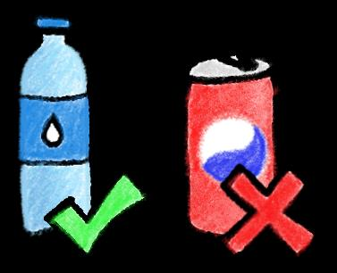

<!-- source: tips-for-a-healthier-you-diabetes-vietnamese.md -->
## Page 1

# Mẹo giúp b **ạ** n kh **ỏ** e m **ạ** nh h **ơ** n 

## **Bệnh tiểu đường là gì?** 

Đây là một tình trạng bệnh mãn tính ảnh hưởng đến khảnăng phân hủy đường của cơ thểbạn. Điều này có nghĩa là có rất nhiều đường đọng lại trong máu của bạn. 

Nếu không được điều trị, bệnh tiểu đường gây tổn thương các mạch máu, có thểdẫn đến đau tim, đột quỵvà các vấn đềvềthận, mắt, bàn chân và dây thần kinh.

## Page 2

# Mẹo giúp b **ạ** n kh **ỏ** e m **ạ** nh h **ơ** n 

**Làm thếnào đểbiết tôi có bịbệnh tiểu đường hay không?** Các triệu chứng phổbiến của bệnh tiểu đường bao gồm: 

**đi tiểu nhiều** 

**khát nước** 

**giảm cân không giải thích được** 

<!-- Start of picture text -->
kiệt sức <!-- End of picture text -->

**chóng mặt** 

<!-- Start of picture text -->
đói quá mức <!-- End of picture text -->

Nếu bạn mắc bệnh tiểu đường hoặc nghi ngờ mình mắc bệnh, hãy đến gặp bác sĩ. Hãy đến phòng khám y tế, đặc biệt nếu chủ lao động của bạn đã ghi danh cho bạn với Kế hoạch Chăm sóc Ban đầu. Tìm các trung tâm y tế gần . nhất của bạn và địa điểm của họ **<u>tại đây</u>**

## Page 3

# Mẹo giúp b **ạ** n kh **ỏ** e m **ạ** nh h **ơ** n 

**Ngăn ngừa bệnh tiểu đường!** 

Hãy làm theo các bước đơn giản sau đểgiảm nguy cơ mắc bệnh tiểu đường! 

Lựa chọn thực phẩm lành mạnh hơn. 

Uống nước thay vì đồ uống có đường. 

Bỏhoặc cắt giảm rượu và thuốc lá. 

Thực hiện các bài tập thể dục như đi bộ, chạy bộhoặc leo cầu thang. 

Ăn thực phẩm giàu chất xơ như yến mạch moong dal hoặc đậu, hạnh nhân, bánh quy lúa mì hoặc sữa chua nguyên chất. 

Nguồn: 

1. “Hãy đánh bại bệnh tiểu đường”.  HealthHub.

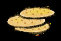

<!-- source: tips-for-a-healthier-you-diabetes.md -->
## Page 1

# **What is diabetes?** 

It’s a chronic medical condition that **affects your body's ability to break down sugar** . This means a lot of sugar is left in your blood. 

If left untreated, diabetes causes damage to blood vessels, which can lead to heart attack, stroke, and problems with the kidneys, eyes, feet and nerves.

## Page 2

**How do I know if I have diabetes?** Common symptoms of diabetes include: 

**Excessive Urination** 

**Thirst** 

**Unexplained Weight Loss** 

<!-- Start of picture text -->
Exhaustion <!-- End of picture text -->

**Dizziness** 

**Excessive Hunger** 

If you have diabetes or suspect that you do, please see a doctor. Visit the medical clinic, especially if your employer has enrolled you with the Primary Care Plan. Find your nearest medical centers and their locations <u>here.</u>

## Page 3

# **Prevent Diabetes!** 

Follow these simple steps to reduce your risk of getting diabetes! 

Make healthier food choices. 

Drink water instead of sugary beverages. 

Quit or cut down on alcohol and smoking. 

Do exercises like walking, jogging, or stair climbing. 

Eat high-fibre foods like moong dal oats or beans, almonds, wheat biscuits or plain yogurt. 

Source: 

1. “Let’s beat Diabetes”. HealthHub.

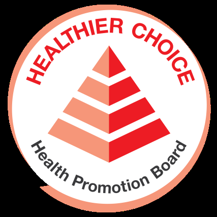

<!-- source: tips-for-a-healthier-you-high-blood-pressure-bahasa.md -->
## Page 1

# Tips untuk membuat  Anda yang Lebih Sehat 

**Apa itu tekanan darah tinggi?** 

Tekanan darah tinggi terjadi ketika jantung Anda secara paksa memompa lebih banyak darah karena penyumbatan di pembuluh darah Anda. 

Jika tidak diobati, dapat menyebabkan serangan jantung atau stroke.

## Page 2

# Tips untuk membuat  Anda yang Lebih Sehat 

## **Tanda dan Gejala Hipertensi** 

Pingsan 

<!-- Start of picture text -->
Pusing <!-- End of picture text -->

<!-- Start of picture text -->
Detak jantung yang tidak teratur Kelelahan <!-- End of picture text -->

Detak jantung yang tidak teratur 

<!-- Start of picture text -->
Muntah Mual <!-- End of picture text -->

## **Ketahui nomor Anda!** 

**120** ➞ **Tekanan darah** 120 **sistolik** 80 **80** ➞ **Tekanan darah diastolik** < 120 < 80 120–129 < 80 130–139 or 80–89 140 + 90 + 180 + &/or 120 + 

## **3 Cara Menjaga Tekanan Darah yang Sehat** 

1. Periksa tingkat tekanan darah Anda 

2. Ubah ke gaya hidup yang lebih sehat 

3. “C” (Temui) dokter Anda untuk pemeriksaan rutin 

Sumber: 

1. “Hypertension” HealthHub. Juni 2021. 

2. “High Blood Pressure: Healthy Eating Guide”. Desember 2021. 

3. “Understanding Blood Pressure Readings”. Desember 2018.

## Page 3

# Tips untuk membuat  Anda yang Lebih Sehat 

## **Mencegah tekanan darah tinggi!** 

Ikuti langkah-langkah sederhana ini untuk mengurangi risiko terkena tekanan darah tinggi! 

Tidur yang cukup. 

Berolah-raga! Berat badan yang sehat mengurangi risiko. 

Berhenti atau kurangi alkohol dan merokok. 

Mengendalikan stres. Anda dapat berbicara dengan orang lain tentang masalah Anda, melakukan aktivitas santai, dan melakukan latihan pernapasan. 

Pelihara pola makan yang sehat. Cobalah untuk membatasi asupan lemak hewani, daging merah, dan santan.

<!-- source: tips-for-a-healthier-you-high-blood-pressure-bengali.md -->
## Page 1

**স্বাস্থ্যবান থাকার ননয়মাবলী** 

**হাইব্লাডপ্রেসারনক?** হাইব্লাডপ্রেসারঘটেযখন আপনাররক্তনালীটেবাধারকারটে আপনারহৃদয়প্র ারপূববকআরও রক্তপাম্পকটর। 

যদদদিদকত্সানাকরাহয়েটব াটকর এটিহােব অ্যাোকবাপ্ কারেহটেপাটর।

## Page 2

# **স্বাস্থ্যবান থাকার ননয়মাবলী** 

## **উচ্চরক্তচাপেরইনিতএবং লক্ষণঃ** 

<!-- Start of picture text -->
প্রবেঁহুসহটয়যাওয়া িাথাঘুরাটনা <!-- End of picture text -->

অ্দনয়দিে হৃদস্পন্দন দূববলো বদি বদিবদিভাব 

## **সংখ্যাগুপলাপ্রেপনরাপখ্া!** 

**120** ➞ **উেপরররক্তচাে** 120 80 **80** ➞ **ননপচররক্তচাে** < 120 < 80 120–129 < 80 130–139 or 80–89 140 + 90 + 180 + &/or 120 + 

## **স্বাস্থ্যকররক্তচােবোয়রাখ্ার নতনটিউোয়ঃ** 

1. রক্তিাপপরীক্ষাকরা 

2. স্বাস্থ্যসম্মে ীবটনপদরবেবনকরা। 

3. দনয়দিেডাক্তারপ্রদখাটয়স্বাস্থ্যপরীক্ষাকরা। 

সূত্র: 

1. “Hypertension” HealthHub. June 2021. 

2. “High Blood Pressure: Healthy Eating Guide”. December 2021. 

3. “Understanding Blood Pressure Readings”. December 2018.

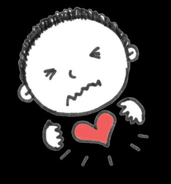

## Page 3

**স্বাস্থ্যবান থাকার ননয়মাবলী** 

**উচ্চরক্তচােেনতপরাধকরুন!** 

উচ্চরক্তিাপহওয়ারঝুেঁদককিাটেএইসহ পদটক্ষপগুদলঅ্নুসরেকরুন! 

বযায়ািকরুন! শরীটরর একটিস্বাস্থ্যকরও নঝুেঁদক কিায়। 

িদএবংধূিপানকরাপ্রেট়ে দদনবাকদিটয়দদন। 

ভালকটরঘুিান। 

স্বাস্থ্যকরডাটয়েপ্রিটনিলুন। পশুর িদবব, িাংসএবংনারটকলদুধ খাওয়াসীদিেকরারপ্রিষ্টাকরুন। 

িানদসকিাপসািলান। আপদনআপনারসিসযা সম্পটকবঅ্নযটদরসাটথকথাবলটেপাটরন, আরািদায়কআটলািনায়দনযুক্তহটেপাটরনএবং শ্বাস-েশ্বাটসরবযায়ািকরটেপাটরন।

<!-- source: tips-for-a-healthier-you-high-blood-pressure-mandarin.md -->
## Page 1

# **让您活得更 加健康的小贴士** 

**什么是高血压？** 

当您的心脏由于血管阻塞而强行泵 出更多血液时，就会发生高血压。 若不及时治疗，这将可能会导致心 脏病发作或中风。

## Page 2

# **让您活得更 加健康的小贴士** 

## **高血压的体征和症状** 

## **关注这些数字！** 

<!-- Start of picture text -->
昏厥 <!-- End of picture text -->

<!-- Start of picture text -->
头晕 <!-- End of picture text -->

<!-- Start of picture text -->
心律不齐 疲劳 呕吐 恶心 <!-- End of picture text -->

<!-- Start of picture text -->
心律不齐 疲劳 <!-- End of picture text -->

**120** ➞ **收缩压** 120 80 **80** ➞ **舒张压** < 120 < 80 120–129 < 80 130–139 or 80–89 140 + 90 + 180 + &/or 120 + 

## **保持血压健康的3种方法** 

1. 检查血压水平 

2. 改变生活方式，更加注意健康 

3. 去看医生，定期检查身体 

资料来源： 

- 1.《高血压》。保健中心。2021 年6 月。 

- 2.《高血压：健康饮食指南》。2021年12月。 

- 3.《了解血压读数》。2018年12月。

## Page 3

# **让您活得更 加健康的小贴士** 

## **预防高血压！** 

请按照这些简单的步骤来降低患高血压的风险！ 

锻炼身体！健康的体重可 以降低高血压风险。 

戒烟或减少饮酒和吸烟。 

良好的睡眠习惯。 

按照健康的饮食。尽量限制动物 脂肪、红肉和椰奶的摄入量。 

管理压力。您可以与他人谈谈您面对的 问题，参与放松活动，并进行呼吸练习。

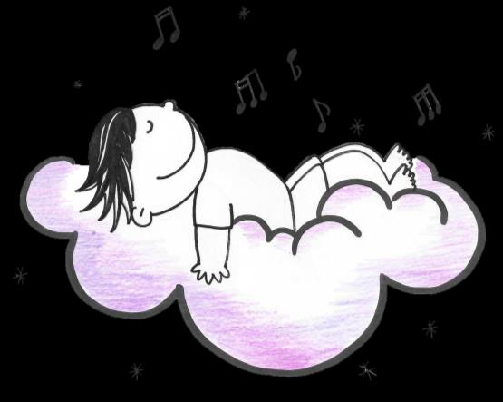

<!-- source: tips-for-a-healthier-you-high-blood-pressure-tamil.md -->
## Page 1

# **நீங்கள் ஆர ோக்கியமோக இருக்க உதவிக்குறிப்புகள்** 

**உயர்இ த்தஅழுத்தம் என்றோல்என்ன?** 

உங்கள்இரத்தநாளங்களில்ஏற்படும் அடைப்புகளின்காரணமாகஉங்கள்இதயம் அதிகஇரத்தத்டதஅழுத்தமாகபம்ப் செய்யும்பபாதுஉயர்இரத்தஅழுத்தம் ஏற்படுகிறது. 

- ெிகிச்டெயளிக்கப்பைாவிட்ைால், மாரடைப்பு அல்லதுபக்கவாதம்ஏற்பைலாம்.

## Page 2

# **நீங்கள் ஆர ோக்கியமோக இருக்க உதவிக்குறிப்புகள்** 

**உயர்இ த்தஅழுத்தம் ரநோய்க்கோனஅறிகுறிகள்** 

மயக்கம் 

தடலசுற்றுதல் 

ெீரற்றஇதயத் துடிப்பு 

பொர்வு 

வாந்தி குமட்ைல் 

### **உங்கள்எண்களை அறிந்துககோள்ைவும்!** 

**120** ➞ **சிஸ்டாலிக்** 120 **இரத்த** 80 **80** ➞ **டயஸ்டாலிக் அழுத்தம் இரத்தஅழுத்தம்** < 120 < 80 120–129 < 80 130–139 or 80–89 140 + 90 + 180 + &/or 120 + 

**ஆர ோக்கியமோனஇ த்த அழுத்தத்திற்கு3 வழிகள்** 

1. உங்கள்இரத்தஅழுத்தஅளடவ பொதிக்கவும் 

2. ஆபராக்கியமானவாழ்க்டகமுடறக்கு மாறுதல் 

3. "C” (பார்க்கவும்) வழக்கமான பரிபொதடனக்குஉங்கள்மருத்துவடர நாைவும் 

ஆதாரங்கள்: 

1. "உயர்இரத்தஅழுத்தம்" ஹெல்த்ெப்ஜூன் 2021. 

2. "உயர்இரத்தஅழுத்தம்: ஆரராக்கியமானஉணவுஉண்ண வழிகாட்டி". டிசம்பர் 2021. 

3. "இரத்தஅழுத்தஅளவீடுகளளப்புரிந்துஹகாள்வது". டிசம்பர் 2018.

## Page 3

**நீங்கள் ஆர ோக்கியமோக இருக்க உதவிக்குறிப்புகள்** 

## **உயர்இ த்தஅழுத்தத்ளதத்தடுக்க!** 

உயர்இரத்தஅழுத்தம்ஏற்படும்அபாயத்ளதக்குளறக்கஇந்தஎளியவழிமுளறகளளப்பின்பற்றவும்! 

நன்றாகதூங்குங்கள் 

உைற்பயிற்ெி! ஆபராக்கியமானஉைல்எடை ஆபத்டதகுடறக்கிறது. 

மதுமற்றும் புடகப்பழக்கத்டதடகவிைவும் அல்லதுகுடறக்கவும். 

மனஅழுத்தத்டதநிர்வகிக்கவும். உங்கள் பிரச்ெடனகடளப்பற்றிமற்றவர்களிைம் பபெலாம், ஓய்சவடுக்கும்செயல்களில் ஈடுபைலாம், மூச்சுப்பயிற்ெிசெய்யலாம். 

ஆபராக்கியமானஉணடவ கடைபிடிக்கவும். விலங்குசகாழுப்புகள், ெிவப்புஇடறச்ெிமற்றும்பதங்காய்பால் ஆகியவற்டறகுடறக்கமுயற்ெிக்கவும்.

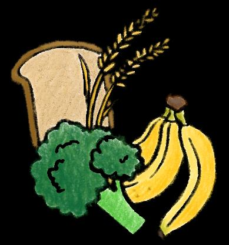

<!-- source: tips-for-a-healthier-you-high-blood-pressure-thai.md -->
## Page 1

**ข้อแนะน ำเพื่อให้ สุขภำพคุณดีขึ้น** 

**ควำมดันโลหิตสูงคืออะไร?** 

ความดันโลหิตสูงเกิดขึ้นเมื่อหัวใจของคุณ สูบฉีดเลือดมากขึ้นเนื่องจากการอุดตันใน หลอดเลือด 

หากไม่ได้รับการรักษา อาจท าให้หัวใจวาย หรือเป็นโรคหลอดเลือดสมองได้

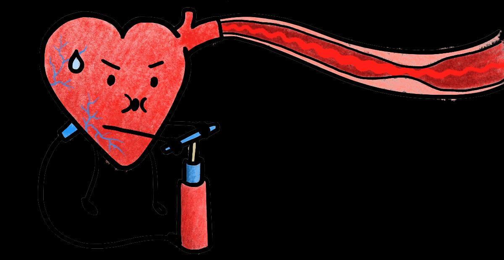

## Page 2

# **ข้อแนะน ำเพื่อให้ สุขภำพคุณดีขึ้น** 

## **อำกำรและอำกำรแสดงของ ควำมดันโลหิตสูง** 

อาการเป็นลม 

อาการวิงเวียนศีรษะ 

<!-- Start of picture text -->
หัวใจเต้นผิดปกติ ความเหนื่อยล้า <!-- End of picture text -->

ความเหนื่อยล้า 

<!-- Start of picture text -->
อาเจียน คลื่นไส้ <!-- End of picture text -->

## **จงรู้ตัวเลขของคุณเถอะ** 

**120** ➞ **ควำมดันโลหิต** 120 **ซิสโตลิก** 80 **80** ➞ **ควำมดันโลหิต ไดแอสโตลิก** < 120 < 80 120–129 < 80 130–139 or 80–89 140 + 90 + 180 + &/or 120 + 

## **มี 3 วิธีรักษำสุขภำพควำมดัน โลหิต** 

1. ตรวจสอบระดับความดันโลหิต 

2. เปลี่ยนวิถีชีวิตให้มีสุขภาพดีขึ้น 

3. “C” (พบ) แพทย์เพื่อตรวจสุขภาพเป็นประจ า 

แหล่งความรู้ 

1. “ความดันโลหิตสูง” HealthHub. ฉบับ มิถุนายน ค.ศ2021. 

2. “ความดันโลหิตสูง: คู่มือการกินเพื่อสุขภาพ” ฉบับ ธันวาคม ค.ศ2021. 

- 3“ท าความเข้าใจการอ่านค่าความดันโลหิต” ฉบับ ธันวาคม ค.ศ2018.

## Page 3

**ข้อแนะน ำเพื่อให้ สุขภำพคุณดีขึ้น** 

**วิธีป้องกันควำมดันโลหิตสูง!** 

ท าตามขั้นตอนง่าย ๆ เหล่านี้เพื่อลดความเสี่ยงในการเป็นความดันโลหิตสูง! 

ออกก าลังกาย! น ้าหนักตัวที่ เหมาะสมช่วยลดความเสี่ยง 

นอนหลับให้เพียงพอ 

เลิกหรือลดแอลกอฮอล์และ การสูบบุหรี่ 

รับประทานอาหารที่มีประโยชน์ พยายามจ ากัดการบริโภคไขมันสัตว์ เนื้อแดง และกะทิ 

จัดการความเครียด คุณสามารถพูดคุย กับคนอื่นเกี่ยวกับปัญหาของคุณ ท า กิจกรรมที่ผ่อนคลาย และฝึกการหายใจ

<!-- source: tips-for-a-healthier-you-high-blood-pressure-vietnamese.md -->
## Page 1

# Mẹo giúp b **ạ** n kh **ỏ** e m **ạ** nh h **ơ** n 

**Cao huyết áp là gì?** 

Cao huyết áp xảy ra khi tim bạn phải bơm nhiều máu hơn do tắc nghẽn mạch máu. 

Nếu không được điều trị, nó có thểgây đau tim hoặc đột quỵ.

## Page 2

# Mẹo giúp b **ạ** n kh **ỏ** e m **ạ** nh h **ơ** n 

## **Dấu hiệu và Triệu chứng Cao huyết áp** 

<!-- Start of picture text -->
Ngất xỉu <!-- End of picture text -->

<!-- Start of picture text -->
Chóng mặt <!-- End of picture text -->

<!-- Start of picture text -->
Nhịp tim không đều Mệt mỏi <!-- End of picture text -->

<!-- Start of picture text -->
Nôn mửa Buồn nôn <!-- End of picture text -->

## **Biết các con sốcủa bạn!** 

**120** ➞ **Huyết áp** 120 **tâm thu** 80 **80** ➞ **Huyết áp tâm trương** < 120 < 80 120–129 < 80 130–139 or 80–89 140 + 90 + 180 + &/or 120 + 

## **3 cách đểgiữhuyết áp khỏe mạnh** 

1. Kiểm tra mức huyết áp của bạn 

2. Thay đổi lối sống lành mạnh hơn 

3. “C” (Gặp) bác sĩ của bạn đểkiểm tra sức khỏe thường xuyên 

Nguồn: 

1. "Cao huyết áp" HealthHub. Tháng 6 năm 2021. 

2. “Huyết áp cao: Hướng dẫn Ăn uống Lành mạnh”.  Tháng 12 năm 2021. 

3. “Hiểu các ChỉsốvềHuyết áp”.  Tháng 12 năm 2018.

## Page 3

# Mẹo giúp b **ạ** n kh **ỏ** e m **ạ** nh h **ơ** n 

**Ngăn ngừa cao huyết áp!** 

Hãy làm theo các bước đơn giản sau đểgiảm nguy cơ mắc bệnh cao huyết áp! 

Tập thểdục!  Trọng lượng cơ thểkhỏe mạnh làm giảm nguy cơ mắc bệnh. 

Bỏhoặc cắt giảm rượu và thuốc lá. 

Ngủngon. 

Quản lý sựcăng thẳng.  Bạn có thểnói chuyện với người khác vềvấn đềcủa mình, tham gia vào các hoạt động thư giãn và thực hiện các bài tập hít thở. 

Hãy tuân theo một chếđộăn uống lành mạnh.  Cốgắng hạn chếăn mỡđộng vật, thịt đỏvà nước cốt dừa.

<!-- source: tips-for-a-healthier-you-high-blood-pressure.md -->
## Page 1

**What is high blood pressure?** 

High blood pressure happens when your heart forcefully pumps more blood because of blockages in your blood vessels. 

If left untreated, it may cause heart attack or stroke.

## Page 2

# **Hypertension Signs and Symptoms** 

<!-- Start of picture text -->
Fainting <!-- End of picture text -->

<!-- Start of picture text -->
Dizziness Irregular Heartbeat Fatigue Vomiting Nausea <!-- End of picture text -->

# **Know your numbers!** 

|**120** ➞**Systolic**||120|
|---|---|---|
|80||**80** ➞**Diastolic**|
|< 120||< 80|
|120–129||< 80|
|130–139|or|80–89|
|140 +||90 +|
|180 +|&/or|120 +|

# **3 Ways to Keep a Healthy Blood Pressure** 

1. Check your blood pressure level 

2. Change to a healthier lifestyle 

3. “C” your doctor for regular check-ups 

Sources: 

1. “Hypertension” HealthHub. June 2021. 

2. “High Blood Pressure: Healthy Eating Guide”. December 2021. 

3. “Understanding Blood Pressure Readings”. December 2018.

## Page 3

# **Prevent high blood pressure!** 

Follow these simple steps to reduce your risk of getting high blood pressure! 

Sleep well. 

Quit or cut down on alcohol and smoking. 

Exercise! A healthy body weight reduces the risk. 

Stick to a healthy diet. Try to limit your intake of animal fats, red meat, and coconut milk. 

Manage stress. You can talk to others about your problems, engage in relaxing activities, and do breathing exercises.

<!-- source: tips-for-a-healthier-you-high-cholesterol-bahasa.md -->
## Page 1

Tips untuk membuat  Anda yang Lebih Sehat 

**Apa itu kolesterol tinggi?** 

Kolesterol adalah zat seperti lemak dalam darah Anda. Terlalu banyak kolesterol dapat meningkatkan risiko serangan jantung atau stroke.

## Page 2

# Tips untuk membuat  Anda yang Lebih Sehat 

**Bagaimana saya tahu jika saya memiliki kolesterol tinggi?** 

Tidak ada gejala. 

Kebanyakan orang mengetahuinya dari tes darah. 

Adalah penting agar Anda memeriksakan kadar kolesterol Anda dengan dokter Anda. Kunjungi klinik medis, terutama jika majikan Anda telah mendaftarkan Anda dengan Rencana Perawatan Primer. Temukan pusat kesehatan terdekat dan lokasinya **<u>di sini</u>** .

## Page 3

# Tips untuk membuat  Anda yang Lebih Sehat 

## **Mencegah Kolesterol Tinggi!** 

Ikuti langkah-langkah sederhana ini untuk mengurangi risiko terkena kolesterol tinggi! 

Tetap aktif! Berolahraga seperti sepak bola, bulu tangkis, atau kriket. 

Lakukan diet seimbang. 

Mengurangi makanan asin. 

Gunakan yoghurt rendah lemak/susu rendah lemak dalam memasak dan hindari santan. 

Makan lebih sedikit daging berlemak (daging kambing) dan singkirkan lemak yang terlihat dari daging sebelum dimasak atau dimakan. 

Sumber: 

1. “Healthy Eating for Lowering Cholesterol”. HealthHub. Desember 2021. 

2. “Hyperlipidemia”. HealthHub. Februari 2022.

<!-- source: tips-for-a-healthier-you-high-cholesterol-bengali.md -->
## Page 1

**স্বাস্থ্যবান থাকার ননয়মাবলী** 

**উচ্চককালললেরলকী?** ক োলেলেরেহলেরলেচর্বিজোতীয় র্জর্িস। উচ্চক োলেলেরেহোর্ি এ্যোর্ো বো করো এ্রশন্ োবোর্িলয়কেয়।

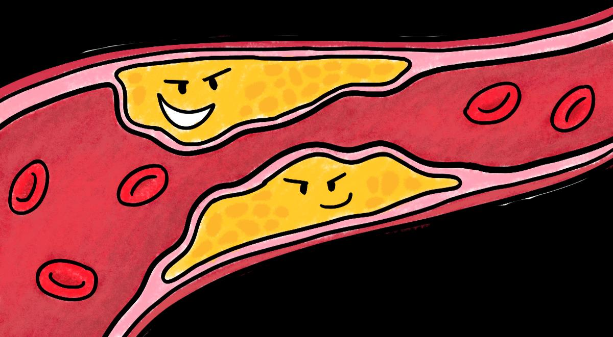

## Page 2

**স্বাস্থ্যবান থাকার ননয়মাবলী** 

**আমারউচ্চককালললেরলআলেনকনা, তাআনমকীভালবজানব?** 

এ্টিরক োিউপসর্িকিই। কবর্শরভোর্মোিুষ রেপরীক্ষো লরকজলিকেলেি। 

েীর্িলময়োলের্চর্ ৎসোিো রলেবুল বযথো, হোর্ি অ্যোর্ো বোকরো হলতপোলর। 

<!-- Start of picture text -->
্খোলি <!-- End of picture text -->

ডোেোর এ্র  োছ কথল  ক োলেেরে এ্র পর্রমোণ র্ো পরীক্ষো  লর কিওয়োর্ো খুবই জরুরী। র্ির্ি  এ্ যোও আরও যর্ে কতোমোর চো র্র েোতো কতোমোল প্রোথর্ম  পর্রচযিো পর্র ল্পিোলত ভর্তি র্রলয় থোল । কতোমোর সবলচলয়  োলছর কমর্ডল ে কসন্টোর এ্বং কেলখো| তোর ঠি োিো <u>এ্খোলি</u>

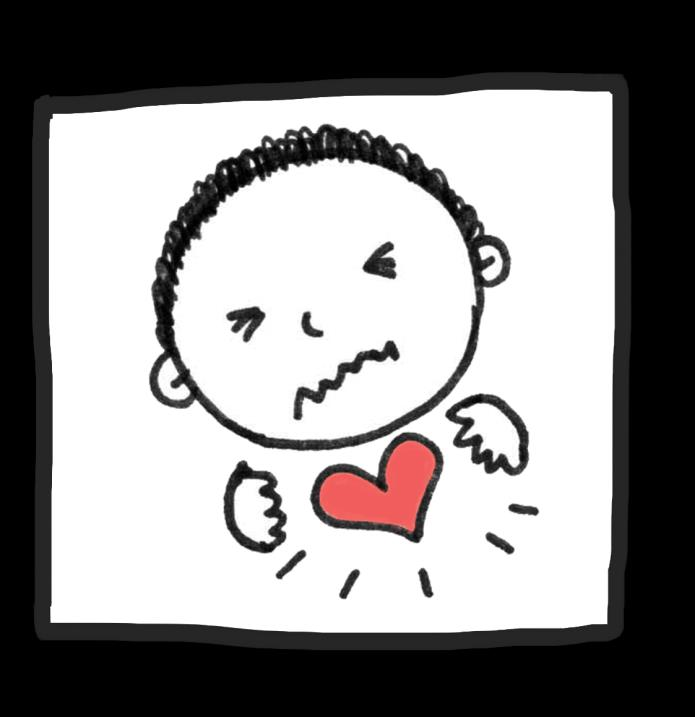

## Page 3

**স্বাস্থ্যবান থাকার ননয়মাবলী** 

**উচ্চককালললেরলপ্রনতলরাধকরুন!** 

উচ্চক োলেলেরেহওয়োরঝুুঁর্  মোলতএ্ইসহজপেলক্ষপগুর্েঅ্িুসরণ রুি! 

স্বর্িয়থো লতহলব। র্িল র্, েুর্বেএ্রমতকখেোকখেলত হলব। 

সুষমখোেযখোলবি। 

েবণযুেখোবোর ম খোলবি। 

রোোন্নোকত মচর্বিযুেেুধবো েইবযবহোর রলতহলবএ্বং িোর্রল লেরেুধবযবহোর রো কথল র্বরতথো লতহলব। 

চর্বিজোতীয়খোেয মকখলতহলব এ্বংরোন্নো রোরসময়বো খোওয়োরসময়মোংসকথল চর্বি বোের্েলয়র্েলতহলব। 

সূত্র: 

1. “Healthy Eating for Lowering Cholesterol”. HealthHub. December 2021. 

2. “Hyperlipidemia”. HealthHub. February 2022.

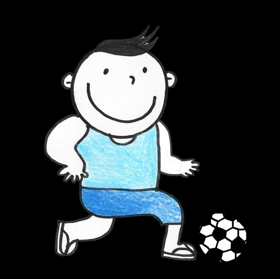

<!-- source: tips-for-a-healthier-you-high-cholesterol-mandarin.md -->
## Page 1

# **让您活得更 加健康的小贴士** 

**什么是高胆固醇？** 

胆固醇是血液中一种类似脂肪的物 质，血中含有过多的胆固醇，会增 加心脏病发作或中风的风险。

## Page 2

# **让您活得更 加健康的小贴士** 

## **我怎么知道我是否有高胆固醇？** 

没有任何症状。大多数人通过验血发现。 如果长期不治疗，可能会导致胸痛、心 脏病发作或中风。 

请医生为您检查胆固醇水平，这个做法 十分重要，尤其是您的雇主已经为您注 册加入初级医疗计划之后，就应该去诊 疗所做检查。若欲查找离您最近的医疗 中心及其位置，请点击 **<u>此处</u>** 。

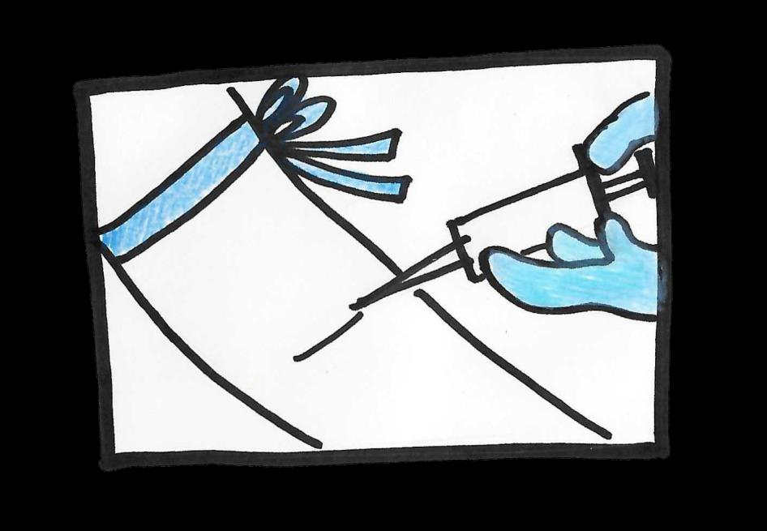

## Page 3

# **让您活得更 加健康的小贴士** 

### **预防高胆固醇！** 

按照这些简单的步骤来降低患高胆固醇的风险！ 

少吃咸的食物。 

保持活跃，参加足球、 羽毛球或板球等运动。 

均衡饮食。 

烹调食物时，使用低脂酸奶 或低脂牛奶，避免使用椰奶。 

少吃肥肉（羊肉，牛肉），烹调 或进食肉类之前，如果看到肉中 有脂肪，请把肥肉去除。 

资料来源： 

- 1.《降低胆固醇的健康饮食》。保健中心。2021 年12月。 

- 2.《血脂过高症》。保健中心。2022年2月。

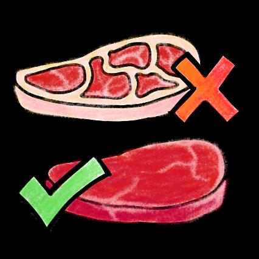

<!-- source: tips-for-a-healthier-you-high-cholesterol-tamil.md -->
## Page 1

# **நீங்கள் ஆர ோக்கியமோக இருக்க உதவிக்குறிப்புகள்** 

**அதிகககோலஸ்ட் ோல்என்றோல்என்ன?** க ொலஸ்ட்ரொல்என்பதுஉங் ள்இரத்தத்தில்உள்ள க ொழுப்புபபொன்றகபொருள். அதி ப்படியொன க ொலஸ்ட்ரொல்மொரடைப்புஅல்லதுபக் வொதம்ஏற்படும் அபொயத்டதஅதி ரிக்கும்.

## Page 2

# **நீங்கள் ஆர ோக்கியமோக இருக்க உதவிக்குறிப்புகள் எனக்குஅதிகககோலஸ்ட் ோல்இருந்தோல் எனக்குஎப்படிகதரியும்?** 

அறிகுறி ள்எதுவும்இல்டல. கபரும்பொலொனமக் ள் இரத்தபரிப ொதடனமூலம் ண்டுபிடிக் ிறொர்க ள். 

நீண்ை ொலத்திற்கு ி ிச்ட யளிக் ப்பைொவிட்ைொல், அதுமொர்கபுவலி, மொரடைப்புஅல்லதுபக் வொதம் ஏற்பைலொம். 

<!-- Start of picture text -->
்ரக <!-- End of picture text -->

உங் ள்மருத்துவரிைம்க ன்றுஉங் ள்இரத்தக் க ொழுப்புஅளடவபரிப ொதிப்பதுமுக் ியமொகும். குறிப்பொ உங் ள்முதலொளிஉங் டளஅடிப்படை பரொமரிப்புத்திட்ைத்தில்ப ர்கத்திருந்தொல், மருந்த த்திற்குச்க ல்லவும். உங் ள்அரு ிலுள்ள மருத்துவநிடலயங் டளயும்அவற்றின் மு வரி டளயும் **<u>இங்ரக</u>** பொர் **க** லொம்.

## Page 3

# **நீங்கள் ஆர ோக்கியமோக இருக்க உதவிக்குறிப்புகள்** 

**அதிகககோலஸ்ட் ோல்தடுக்கவும்!** அதி க ொலஸ்ட்ரொல்ஆபத்டதகுடறக் இந்தஎளியவழிமுடற டளபின்பற்றவும்! 

ரிவி ிதஉணவு உண்ணுங் ள். 

உப்புகுடறந்த உணவு டள உண்ணுங் ள். 

சுறுசுறுப்பொ இருக் வும்!  ொற்பந்து, பூப்பந்துஅல்லது ிரிக்க ட்பபொன்ற விடளயொட்டு ளில்ஈடுபைவும். 

டமயலில்குடறவொன க ொழுப்புள்ளதயிர்க/குடறவொன க ொழுப்புள்ளபொடலப் பயன்படுத்தவும். பதங் ொய் பொடலத்தவிர் **க** வும் 

குடறந்தக ொழுப்புள்ளஇடறச் ிவட  டளச் (ஆட்டிடறச் ி)  ொப்பிைவும்மற்றும் டமப்பதற்குஅல்லது ொப்பிடுவதற்குமுன் இடறச் ியிலிருக்கும் ண்ணுக்குப்புலப்படும் க ொழுப்பு டளஅ ற்றவும். 

ஆதொரங் ள்: 

1. "இரத்தக்க ொழுப்டபக்குடறப்பதற்குஆபரொக் ியமொன உணடவஉண்ணுதல்". கெல்த்ெப். டி ம்பர்க2021. 2. "டெப்பர்கலிபிகைமியொ". கெல்த்ெப். பிப்ரவரி2022.

<!-- source: tips-for-a-healthier-you-high-cholesterol-thai.md -->
## Page 1

**ข้อแนะน ำเพื่อให้ สุขภำพคุณดีขึ้น** 

**คอเลสเตอรอลสูงคืออะไร?** 

คอเลสเตอรอลเป็นสารคล้ายไขมันในเลือดของคุณ มี คอเลสเตอรอลมากเกินไปอาจเพิ่มความเสี่ยงต่ออาการ หัวใจวายหรือโรคหลอดเลือดสมองได้

## Page 2

# **ข้อแนะน ำเพื่อให้ สุขภำพคุณดีขึ้น** 

**ฉันจะรู้ได้อย่ำงไรว่ำฉันมีคอเลสเตอรอลสูง?** 

ไม่มีอาการ คนส่วนใหญ่ทราบจากการตรวจเลือด 

หากไม่ได้รับการรักษาในระยะยาว อาจท าให้เกิด อาการเจ็บหน้าอก หัวใจวาย หรือโรคหลอดเลือด สมองได้ 

การตรวจสอบระดับคอเลสเตอรอลกับแพทย์เป็น สิ่งส าคัญ ไปที่คลินิกการแพทย์ โดยเฉพาะอย่าง ยิ่งหากนายจ้างได้ท าแผนประกันการดูแลเบื้องต้น ให้คุณ หาศูนย์การแพทย์ที่ใกล้ที่สุดและที่ตั้งของ มัน **<u>ทนี่</u>**

## Page 3

# **ข้อแนะน ำเพื่อให้ สุขภำพคุณดีขึ้น** 

**ป้องกันคอเลสเตอรอลสูง!** 

ท าตามขั้นตอนง่าย ๆ เหล่านี้เพื่อลดความเสี่ยงของการเกิดคอเลสเตอรอลสูง! 

รับประทานอาหารที่สมดุล ครบ 5 หมู่ 

ลดอาหารรสเค็มให้น้อยลง 

ท าตัวแอคทีฟ เล่นกีฬา เช่น ฟุตบอล แบดมินตัน หรือคริกเก็ต 

ใช้โยเกิร์ตไขมันต ่า/นมไขมันต ่า ในการปรุงอาหารและหลีกเลี่ยง กับการใช้กะทิ 

กินเนื้อสัตว์ที่มีไขมันน้อย (เนื้อแกะ) และขจัดไขมันที่มองเห็นได้ออกจาก เนื้อสัตว์ก่อนปรุงอาหารหรือรับประทาน 

แหล่งความรู้ 

> 1. “การกินเพื่อสุขภาพลดคอเลสเตอรอล”.HealthHub. ฉบับ ธันวาคม ค.ศ2021. 

2. “ภาวะไขมันในเลือดสูง” HealthHub. ฉบับ กุมภาพันธ์ ค.ศ2022.

<!-- source: tips-for-a-healthier-you-high-cholesterol-vietnamese.md -->
## Page 1

Mẹo giúp b **ạ** n kh **ỏ** e m **ạ** nh h **ơ** n 

**Cao Cholesterol là gì?** 

Cholesterol là một chất giống như chất béo trong máu của bạn.  Quá nhiều cholesterol có thểlàm tăng nguy cơ đau tim hoặc đột quỵ.

## Page 2

# Mẹo giúp b **ạ** n kh **ỏ** e m **ạ** nh h **ơ** n 

**Làm thếnào đểbiết liệu tôi có bịcholesterol cao hay không?** 

Không có triệu chứng gì. 

Hầu hết mọi người phát hiện ra từxét nghiệm máu. 

Điều quan trọng là bạn phải kiểm tra mức cholesterol của mình với bác sĩ.  Hãy đến phòng khám y tế, đặc biệt nếu chủlao động của bạn đã ghi danh cho bạn với Chương trình Chăm sóc Ban đầu. Tìm các trung tâm y tếgần nhất của bạn và địa điểm của họ **<u>tại đây</u>** .

## Page 3

# Mẹo giúp b **ạ** n kh **ỏ** e m **ạ** nh h **ơ** n 

**Ngăn ngừa Cholesterol cao!** 

Hãy làm theo các bước đơn giản sau đểgiảm nguy cơ bịcholesterol cao! 

Có chếđộăn uống cân bằng. 

Tiếp tục hoạt động!  Chơi các môn thểthao như bóng đá, cầu lông hoặc bóng chày. 

Ăn ít thức ăn mặn. 

Ăn ít thịt mỡ(thịt cừu) và loại bỏ chất béo có thểnhìn thấy khỏi thịt trước khi nấu hoặc ăn. 

Sửdụng sữa chua ít béo / sữa ít béo trong nấu ăn và tránh dùng nước cốt dừa 

Nguồn: 

1. “Ăn uống lành mạnh đểgiảm Cholesterol”. HealthHub.  Tháng 12 năm 2021. 

2. “Tăng lipid máu”.  HealthHub. Tháng 2 năm 2022.

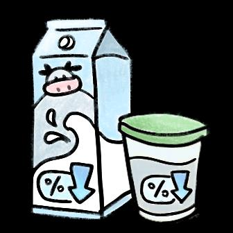

<!-- source: tips-for-a-healthier-you-high-cholesterol.md -->
## Page 1

**What is high cholesterol?** 

Cholesterol is a fat-like substance in your blood. Too much cholesterol can increase your risk of heart attack or stroke.

## Page 2

**How do I know if I have high cholesterol?** 

There are **no symptoms** . Most people find out from a **blood test** . 

If untreated in the long run, it can cause chest pain, heart attack or stroke. 

It is important that you check your cholesterol levels with your doctor. Visit the medical clinic, especially if your employer has enrolled you with the Primary Care Plan. Find your nearest medical centres and their locations **<u>here</u>** .

## Page 3

# **Prevent High Cholesterol!** 

Follow these simple steps to reduce your risk of getting high cholesterol! 

Stay active! Play sports like soccer, badminton, or cricket. 

Eat less salty foods. 

Have a balanced diet. 

Use low fat yoghurt/low fat milk in cooking and avoid coconut milk 

Eat less fatty meats (mutton) and remove visible fats from meats before cooking or eating. 

Sources: 

1. “Healthy Eating for Lowering Cholesterol”. HealthHub. December 2021. 

2. “Hyperlipidemia”. HealthHub. February 2022.

<!-- source: tobacco-use-bahasa.md -->
## Page 1

# Tips untuk membuat Anda yang Lebih Sehat 

## Merokok Tembakau 

**Apa itu merokok tembakau:** 

   - Rokok gulung atau rokok 

   - buatan sendiri **Mengapa merokok itu buruk?** 

- Merokok 

Merokok tembakau meningkatkan risiko: 

- Kanker 

- Penyakit jantung 

- Stroke 

- Diabetes 

- Gagal ginjal 

### **HAL YANG BAIK ketika Anda BERHENTI:** 

- **Setelah 72 jam:** Anda dapat bernapas lebih mudah dan merasakan peningkatan energi 

- **Setelah 3 bulan:** Sirkulasi darah membaik. Fungsi paru-paru yang lebih baik 

- **Setelah 9 bulan:** Batuk berkurang. Kesulitan bernafas yang lebih ringan 

- **Setelah 1 tahun:** Risiko penyakit jantung dan stroke berkurang 50%

## Page 2

### **BAGAIMANA CARANYA Berhenti:** 

- Tuliskan alasan berhenti untuk memotivasi diri sendiri. 

- Pilih metode berhenti seperti mengurangi kuantitas dari waktu ke waktu atau meminta teman untuk menghentikan Anda saat Anda menyalakan rokok. 

- • Tetapkan hari untuk mulai berhenti merokok dan tetap bebas rokok. 

- Tetapkan tujuan kecil dan hadiahi diri Anda sendiri ketika Anda mencapai tujuan Anda untuk tetap bebas rokok (yaitu 1 minggu/1 bulan/3 bulan/6 bulan dll bebas rokok) 

- • Beri tahu orang yang Anda cintai sehingga mereka dapat mendorong Anda di sepanjang jalan. 

**CARA Mengatasinya: 4 ‘D’:** 

Penundaan menyalakan rokok. Alihkan perhatian Anda. Latihan pernapasan dalam. Minum air. 

Proudly presented by: 

_Sumber:_ 

_1. “The Harms of Smoking and Benefits of Quitting”. HealthHub. Desember 2021._ 

_2. “Say Hello to 4Ds and Bye to Nicotine Withdrawal Symptoms”. HealthHub. Maret 2022._

<!-- source: tobacco-use-bengali.md -->
## Page 1

<!-- Start of picture text -->
থাকার স্বাস্থ্যবান রনয়মাবেী <!-- End of picture text -->

# **ধূমপান** 

**ধুমপানকাককবকে?** 

- - 

- সিগারেটখাওয়ারে 

- তামােোগরেভরেরোলেোরে 

## **ধূমপানককনখারাপ?** 

- তামােধূমপানঝুসেবাসিরয়রেয়ঃ 

- েযান্সােএে 

- হৃেরোগএে 

- ররােএে 

- ডাইরবটটিএে 

- সেডসনরেইলএে 

## **পররত্যাগকরারপকররউপকার:** 

৭২ঘন্টাপেঃিহরেশ্বািরনওয়াযায়এবংশক্তিবৃক্তিঅনুভবহয়। সতনমািপেঃেিপ্রবারহেউন্নসতহয়।শ্বািযন্ত্রভারলাোেেরে। ৯মািপেঃোাঁসশেরমযায়এবংশ্বািসনরতেষ্টেমহয়। ১বছেপেঃহৃেোতীয়রোগবাররােএেঝুাঁসে৫০ভাগপযযন্তেরমযায়।

## Page 2

## **কীভাকবপররত্যাগকরকবাোঃ** 

- সনরেরেউৎিাহরেওয়ােেনযপসেতযাগেোেোেণগুরলারলরখা। 

- • পসেতযাগেোেএেটাসনয়মরবেেরোরযমনিমরয়েিারেিারে খাওয়াটােসমরয়রেওয়াবাএেেনবন্ধুরেবরলারতামারেখাওয়াে িময়োমারত। 

- পসেতযাগেোেএেটাসেেসনধযােণেরোএবংধূমপানমুিহও। 

- • রছাটরছাটলক্ষ্যস্থীেেেবাএবংসনরেরেপুরুষেৃতেেবাযখনতুসম ধূমপানমুিোোেলক্ষ্যঅেযনেেবা। 

- রতামােসপ্রয়েনরেেোনাবাযারতেরেতাোরতামারেঅনুপ্রাসনত েেরতপারে। 

## **কীভাকবপারবাচারটিউপায়োঃ** 

রেসেেরেজ্বালাও অনযসেরেমনটারেিোও ঘনঘনশ্বািরনওয়ােবযায়ামগুরলােরো রবসশরবসশপাসনপানেরো। 

Proudly presented by: 

### িূত্র _:_ 

_1. “The Harms of Smoking and Benefits of Quitting”. HealthHub. December 2021._ 

_2. “Say Hello to 4Ds and Bye to Nicotine Withdrawal Symptoms”. HealthHub. March 2022._

<!-- source: tobacco-use-english.md -->
## Page 1

# Tobacco smoking 

**What is tobacco smoking?** 

- Cigarette smoking 

- Roll-your-own Cigarettes 

### **Why is smoking bad?** 

Smoking **increases your risk** of: 

- Cancer 

- Heart disease 

- Stroke 

- Diabetes 

- Kidney failure 

### **The GOOD when you QUIT** 

- **After 72 hours:** You can breathe easier and feel an increase in energy 

- **After 3 months** : Blood circulation improves and better lung functions 

- **After 9 months:** Lesser coughing and lesser difficulty in breathing 

- **After 1 year:** Risk of heart disease and stroke reduces by 50%

## Page 2

## **How to quit** 

- Write down **reasons for quitting** to motivate yourself. 

- Choose a quitting method such as **reducing the quantity over time** or **ask a friend to stop you** when you light up. 

- **Set a quit day to start** and stay smoke-free. 

- **Set small goals** and **reward yourself when you achieve your goal** s of staying smoke-free (i.e. 1 week/1 month/ 3 months/ 6 months etc of being smoke-free). 

- **Tell your loved ones** so they can encourage you along the way. 

**How to cope The 4 ‘Ds’: D** elay lighting up **D** istract yourself **D** eep breathing exercises **D** rink water 

Proudly presented by: 

_Sources:_ 

_1. “The Harms of Smoking and Benefits of Quitting”. HealthHub. December 2021._ 

_2. “Say Hello to 4Ds and Bye to Nicotine Withdrawal Symptoms”. HealthHub. March 2022._

<!-- source: tobacco-use-mandarin.md -->
## Page 1

## 让您活得更加 健康的小贴士 

# 吸烟 

#### 吸烟的定义： 

- 吸香烟 

- 自己卷烟 

#### 为什么吸烟有害？ 

吸烟会增加以下风险： 

- 癌症 

- 心脏病 

- 中风 

- 糖尿病 

- 肾功能衰竭 

#### 戒烟的好处： 

戒烟 72 小时后：您的呼吸会变得更轻松顺畅，您也会感觉到精力与活力 更加充沛了。 

戒烟 3 个月后：血液循环得到改善，肺功能也更佳了。 戒烟 9 个月后：咳嗽减少了，呼吸困难的情况也减少了。 戒烟 1 年后：心脏病和中风的风险，降低了 50% 。

## Page 2

### 如何戒烟： 

- 亲手写下必须戒烟的理由，用以激励自己。 

- 选好想戒烟的方法，例如：随着时间的推移，所吸食香烟的 数量越来越少；恳请朋友在您点香烟时，出言阻止您点烟。 

- • 设定某日开始戒烟，而且从此以后不再抽烟。 

- 先设定小目标，并在实现不抽烟的目标时奖励自己（例如： 坚持不抽烟 1 个星期、 1 个月、 3 个月和 6 个月等）。 

- 把戒烟意愿告诉您心爱的亲人，好让他们也可以在您戒烟的 道路上给您鼓励。 

如何克服烟瘾？ 有 **4** 个妙招： 

拖延一下，迟一点才点烟。 分散注意力，不专注抽烟的事。 练习深呼吸。 喝水。 

Proudly presented by: 

资料来源： 

_1._ 《吸烟的害处与戒烟的益处》。保健中心。 _2021_ 年 _12_ 月。 

_2._ 《哈喽，四大妙招，拜拜，尼古丁戒断症状》。保健中心。 _2022_ 年 _3_ 月。

<!-- source: tobacco-use-tamil.md -->
## Page 1

**நீங்ைள் ஆப ாக்ைியைாை இருக்ை உதவிக்குறிப்புைள்** 

**புகையிகை புகைத்தல் புகையிகை புகைத்தல் என்றால் என்ன:** 

- சிகரெட் புககத்தல் 

- ரசொந்தமொக உங்கள் 

   - சிகரெட்டுககை உருட்டுதல் 

**புகைப்பிடித்தல் ஏன் தீங்கு விகைவிக்ைக்கூடியது ?** 

புககயிகை புககத்தல் உங்களுக்குப் பின்வரும் ந ொய்கள் ஏற்படும் அபொயத்கத அதிகரிக்கிறது: 

      - புற்றுந ொய் 

- இதய ந ொய் 

   - பக்கவொதம் ீரிழிவு ந ொய் 

      - சிறு ீெக ரசயைிழப்பு 

**அதகன விட்டு நீங்ைள் விைகும்பபாது உண்டாகும் நன்கைைள்:** 

72 மணி ந ெம் கழித்து:  ீங்கள் எைிதொக சுவொசிக்க முடியும் மற்றும் உங்கள் ஆற்றல் அதிகரிப்பகத  ீங்கள் உணர்வீர்கள். 

- 3 மொதங்கள் கழித்து: இெத்த ஓட்டம் நமம்படும். நுகெயீெல் 

சிறப்பொகச் ரசயல்படும் 

9 மொதங்கள் கழித்து: இருமல் குகறயும். மூச்சு விடுவதில் சிெமம் குகறயும். 

- 1 வருடம் கழித்து: இதய ந ொய் மற்றும் பக்கவொதம் ஏற்படும் அபொயம் 50% குகறயும்.

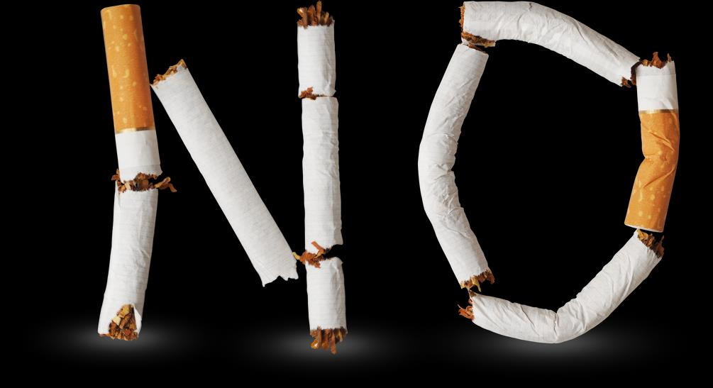

## Page 2

# **எப்படி விடுபடுவது:** 

      - புககப்பதிைிருந்து விடுபடஉங்ககை ஊக்குவிக்கும் கொெணங்ககை எழுதவும். 

      - அதிைிருந்து விடுபடுவதற்கொன முகற ஒன்கறத் நதர்ந்ரதடுக்கவும். கொைப்நபொக்கில் புககக்கும் அைகவக் குகறத்துக்ரகொள்வது அல்ைது  ீங்கள் புககக்கத் ரதொடங்கும்நபொது உங்ககை  ிறுத்துமொறு ஒரு  ண்பரிடம் நகட்டுக்ரகொள்வது நபொன்றகவ.. 

      - • புககப்பதிைிருந்துவிடுபட ஒரு  ொகைத் நதர்ந்ரதடுத்து புககப்பிடிக்கொமல் இருக்கவும். 

- ீங்கள்புககபிடிக்கொமல் இருக்க சிறிய இைக்குககை ிர்ணயித்து, அவற்கறக் ககடப்பிடிக்கவும். அந்த இைக்குககை அகடயும் நபொது உங்களுக்கு  ீங்கநை ரவகுமதி அைித்துக்ரகொள்ைவும் (அதொவது 1 வொெம்/ 1 மொதம்/ 

   - 3 மொதங்கள்/ 6 மொதங்கள் புககப்பிடிக்கொமல் இருப்பது நபொன்றகவ) 

- உங்கள் இைக்ககப் பற்றி உங்கள் அன்புக்குரியவர்கைிடம் ரசொல்ைவும். அவர்கள் உங்ககை உற்சொகப்படுத்த இது உதவும். 

# **எப்படி சைாைிப்பது:** 

- 4 வழிமுகறகள்: 

புககப்பகதத் தொமதப்படுத்தவும். 

உங்கள் கவனத்கதத் திகச திருப்பவும் ஆழ்ந்த சுவொசப் பயிற்சியில் ஈடுபடவும். தண்ணீர் குடிக்கவும். 

Proudly presented by: 

ஆதொெங்கள்: 

1. _"_ புககபிடிப்பதொல் ஏற்படும் தீகமகள், ககவிடுவதொல் ஏற்படும்  ன்கமகள்". ரெல்த்ெப். டிசம்பர் _2021._ 

_2. "4_ வழிமுகறகைப் பின்பற்றவும். புககயிகை  ஞ்சிைிருந்து மீண்டு வரும்நபொது ஏற்படும் அறிகுறிகளுக்கு விகட ரகொடுக்கவும்". ரெல்த்ெப். மொர்ச் _2022._

<!-- source: tobacco-use-thai.md -->
## Page 1

**ข้อแนะน าเพื่อให้ น สุขภาพคุณดีขึ้** 

# **การสูบยาเส้น** 

**การสูบยาเส้นคือ เช่น** 

- การสูบบุหรี่ 

- บุหรี่ม้วนเอง 

**ท าไมการสูบบุหรี่ถึงไม่ดี** 

การสูบบุหรี่เพิ่มความเสี่ยงเป็นโรค ดังต่อไปนี้ 

- มะเร็ง 

- โรคหัวใจ 

- โรคหลอดเลือดสมอง 

- โรคเบาหวาน 

- ไตล้มเหลว 

**มีผลดีเมื่อคุณเลิกบุหรี่ เช่น** 

หลังจาก 72 ชั่วโมง คุณจะหายใจได้ง่ายขึ้นและรู้สึกมีแรงเพิ่มขึ้น หลังจาก 3 เดือน การไหลเวียนโลหิตดีขึ้น การท างานของปอดดีขึ้น หลังจาก 9 เดือน อาการไอน้อยลง หายใจล าบากน้อยลง หลังจาก 1 ปี ความเสี่ยงของโรคหัวใจและหลอดเลือดลดลง 50%

## Page 2

## **วิธีการเลิก คือ** 

- จดบันทึกเหตุผลในการเลิกเพื่อกระตุ้นตัวเอง 

- หาวิธีการเลิกบุหรี่ที่เหมาะ เช่น ลดปริมาณลงตามช่วงเวลา หรือขอเพื่อน เตือนให้หยุดเมื่อคุณหยิบไฟแช็กขึ้นมา 

- ก าหนดวันเลิกบุหรี่เพื่อการเริ่มต้นและงดสูบบุหรี่ 

- ตั้งเป้าหมายระยะสั้นและให้รางวัลตัวเองเมื่อได้บรรลุตามเป้าในการอยู่ อย่างไร้ควัน (เช่น 1 สัปดาห์/1 เดือน/3 เดือน /6 เดือน ฯลฯ เป็นเขต ปลอดบุหรี่) 

- บอกให้คนที่สนิทเพื่อให้พวกเขาช่วยชูก าลังใจให้คุณในตลอดทาง 

## **วิธีทนสู้เอา** 

**4 ข้อ ของ 4 Ds** 

**ถ่วง** เวลาในการหยิบไฟแช็ก **ตั้ง** สมาธิกับเรื่องอื่น **การฝึก** หายใจเข้าลึกๆ **ดื่ม** น ้า. 

Proudly presented by: 

แหล่งความรู้ _1._ “โทษจากการสูบบุหรี่กับประโยชน์ของการเลิกบุหรี่“ HealthHub _._ ศ.คมคาวนัธ บับฉ _2021. 2._ **“** กล่าวสวัสดีกับ 4 _Ds_ และลาอาการลงแดงนิโคติน” **.** _HealthHub._ ฉบับ มีนาคมค.ศ _2022._

<!-- source: tobacco-use-vietnamese.md -->
## Page 1

# Mẹo giúp bạn khỏe mạnh hơn Hút thuốc lá 

**Hút thuốc lá là gì:** 

- Hút thuốc lá 

- Thuốc lá tựcuốn 

## **Tại sao hút thuốc có hại?** 

Hút thuốc lá làm tăng nguy cơ: 

- Ung thư 

- Bệnh tim 

- Đột quỵ 

- Bệnh tiểu đường 

- Suy thận 

**Những LỢI ÍCH khi bạn BỎ hút thuốc lá:** 

- **Sau 72 giờ:** Bạn có thể thở dễ dàng hơn và cảm thấy năng lượng tăng lên 

- **Sau 3 tháng:** Tuần hoàn máu được cải thiện.  Chức năng phổi tốt hơn 

- **Sau 9 tháng:** Ít ho hơn.  Ít khó thở hơn. 

- **Sau 1 năm** : Nguy cơ mắc bệnh tim và đột quỵ giảm 50%

## Page 2

## **LÀM THẾ NÀO đểBỏ:** 

- Viết ra các lý do đểbỏđểtạo động lực cho bản thân. 

- Chọn một phương pháp bỏchẳng hạn như giảm sốlượng theo thời gian hoặc nhờmột người bạn ngăn bạn lại khi bạn châm thuốc. 

- Đặt ra một ngày bỏthuốc đểbắt đầu và không hút thuốc. 

- Đặt mục tiêu nhỏvà tựthưởng cho bản thân khi bạn đạt được mục tiêu không hút thuốc (ví dụ1 tuần/ 1 tháng/ 3 tháng/ 6 tháng, v.v. không hềhút thuốc) 

- Nói với những người thân yêu của bạn đểhọcó thểkhuyến khích trong suốt hành trình. 

**LÀM THẾ NÀO đểĐối phó: 4 chữ‘D’:** Trì hoãn châm thuốc. Đánh lạc hướng bản thân. Các bài tập thể dục hít thở sâu. Uống nước. 

Proudly presented by: 

_Nguồn:_ 

_1. “Tác hại của việc Hút thuốc và Lợi ích của việc Bỏ”.  HealthHub.  Tháng 12 năm 2021._ 

_2. “Nói Chào đón với 4 chữD và Tạm biệt các Triệu chứng Cai nghiện Nicotine”.  HealthHub.  Tháng 3 năm 2022._

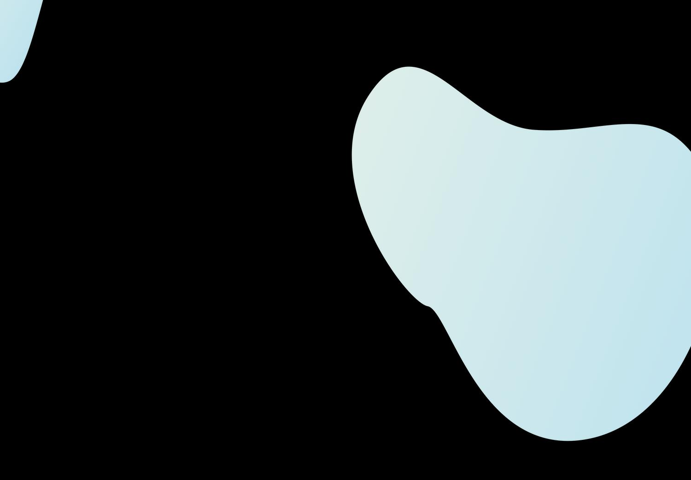

<!-- HCAG:CONTENT END -->
