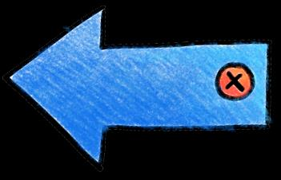

## Page 1

# **让您活得更 加健康的小贴士** 

**误区** 

## **揭露真相：关于“营养”的误区** 

<!-- Start of picture text -->
事实 <!-- End of picture text -->

**误区一：** 所有油炸食品， 都对我的健康有害。 

**事实：** 无论吃什么食物，都要有节制，适可而止。您不应天天吃油 炸食物，或是一个星期吃许多次油炸食品。 

**误区二：** 晚上吃得太多， 会导致体重增加。 

**事实：** 更重要的一点是，您必须了解自己一整天所吃的食物总量和 类别。一顿均衡的饭菜，应该有半盘的蔬菜、四分之一盘的米饭/ 面条和肉类。食物中也应该含少油、少糖、少盐和少调味料。 

**误区三：** 能量饮料能让我 集中注意力和给我提供额 外精力 

**事实：** 您可能会在短时间内增加精力，可是另一方面，这也可能增 加您的心率和血压，使您感到更加口渴。每天 **不可以** 喝超过3罐的 能量饮料。如果您总是感到疲倦，请确保自己有充足的睡眠、定期 锻炼身体和注重健康饮食。 

**误区四：** 因为我从事很多 体力工作，因此，我可以 吃更多食物。 

**事实：** 您 **不应该** 因为工作量比较大，而食用更多白米饭和面条。米 饭和面条含有大量的碳水化合物，会增加体内血糖的水平。相反地， 您应该多吃新鲜的蔬菜和水果，选择全麦大米、面条和面粉。 

**误区五：** 我可以用喝果汁 代替吃新鲜水果 

**事实：** 实际上，果汁含有添加糖，您应该限制自己，每天只喝1杯 的果汁，最好是多吃新鲜的水果，以便摄取更多的维生素、矿物质 和食物纤维。 

资料来源： 

1.《10个营养和健康饮食误区》。保健中心。2021年12月。 

> 2.《揭露食物误区：能量饮料》。《我的安微尼亚》杂志：第24期。安微尼亚山医院。 

3.《果汁与全水果，哪个较健康？》。健康交换HealthXchange。新保健SingHealth。

