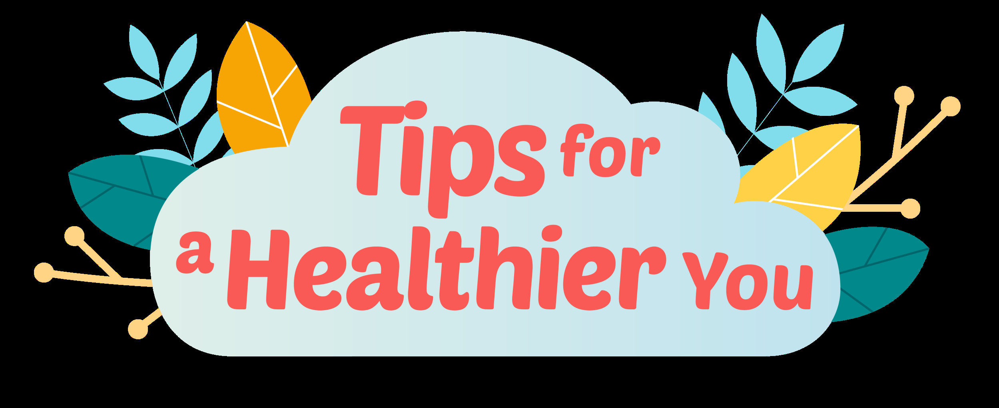

## Page 1

**Do you know how many cups of water you should drink in a day?** 

**Here's a hint: it's the number of colours in a rainbow, plus 1.** 

Drinking water does more than just quench your thirst! It's essential for your body to function properly. 

# Ans: 8 cups 

Source: 

1. “The Best Refreshment”. HealthHub. December 2021.

