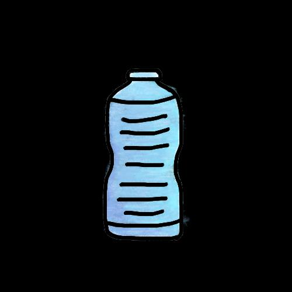

## Page 1

# **நீங்கள் ஆவரொக்கியமொக இருக்க உதேிக்குறிப்புகள்** 

**ஒரு நொளைக்கு எவ்ேைவு தண்ணீர் குடிக்க வேண்டும் என்று கதரியுமொ? இங்வக ஒரு குறிப்பு உள்ைது: இது ஒரு ேொனேில் நிறங்கைின்எண்ணிக்ளக,  ிைஸ்1.** 

தண்ணீர் குடிப் துஉங்கள் தொகத்ழதத்தணிப் ழதைிட அதிகம்! உங்கள் உடல் சரியொக பசயல் ட இது அைசியம். 

## தில்: 8 குைழளகள் 

ஆதொ ம்: 

1. "சிறந்த புத்துணர்ச்சி". பெல்த்ெப். டிசம் ர் 2021.

