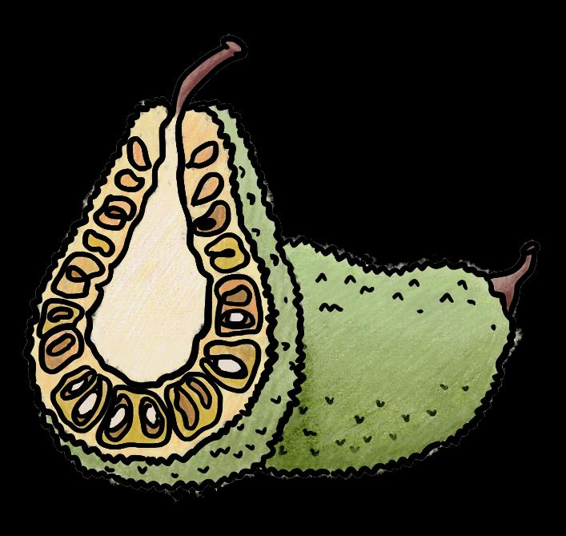

## Page 1

# **நீங்கள் ஆவரொக்கியமொக இருக்க உதேிக்குறிப்புகள்** 

**மதியஉணவுக்குப் ிறகு சிக்கிறதொ? தப் டுத்தப் ட்டதின் ண்டங்களுக்குப் திலொக உப் ில்லொதககொட்ளடகள்அல்லதுதயிர்சொப் ிடுங்கள்.** அழைநீண்டகொலத்திற்குஉங்கள்உடலுக்குமிகவும்நல்லது, தமலும்அழைநீண்டகொலத்திற்குஆற்றழலத்தருளகின்றன.

## Page 2

**நீங்கள் ஆவரொக்கியமொக இருக்க உதேிக்குறிப்புகள் இந்தஆவரொக்கியமொன$5 சிற்றுண்டிகளைமுயற்சிக்கவும்!** உணவுக்குஇடையில்ஏதாவதுசாப்பிைஆடசப்படுகிறீர்காா? வாடைப்பைம்அல்லதுபலாப்பைம்பபான்றசிலபுதியபைங்கு **க** கு உங்கா்சர்க்கடரசிற்றுண்டிடயத்தவிர்க்கவும். அவற்றின்விடல $5க்கும்குடறவானதுமற்றும்மிகவும்ஆபராக்கியமானது.

