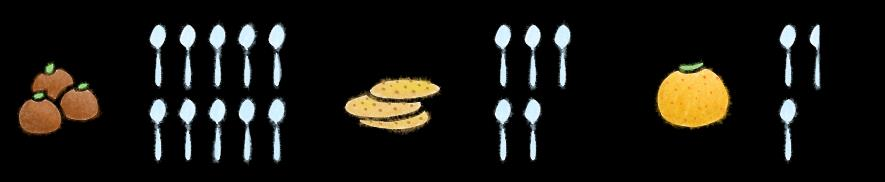

## Page 1

# Tips untuk membuat  Anda yang Lebih Sehat 

**7 Gula Tersembunyi asalah Bom dalam Diet Anda** 

Berikut adalah beberapa makanan populer dan kandungan gulanya yang tersembunyi! 

**Minuman Energi** (473ml) 51g gula = 10 sdt 

**Kopi** 

20g gula = 4 sdt 

**Milk Rusk** 

23g gula = kira-kira 5 sdt 

**1 Nastar** 

6,2 g gula = kira-kira 1 sdt 

**Gulab jammun** (per 100g) 52g gula = 10 sdt 

**3 biskuit tawar** 

22g gula = kira-kira 5 sdt 

**1 Ladoo** 

13g gula = 2,5 sdt 

**Konsumsi gula harian Anda tidak boleh lebih dari 10 sdt (berdasarkan asupan 2000 kalori harian). Dalam skenario berikut, apa yang dapat Anda hindari atau ubah agar tetap dalam batas 10 sdt per hari?** 

**Skenario 1:** 2 potong Roti Prata + 2 paket teh + 1 porsi kue susu = 14 sdt gula **Skenario 2:** 1 Biryani Ayam + 1 cangkir milo + 1 porsi biskuit tawar = 11 sdt gula **Skenario 3:** 1 Mi Goreng + 1 kaleng minuman 100 plus + 1 ladoo = 10,5 sdt gula **Skenario 4:** 1 Mi Wanton + 1 susu kacang kedelai + 1 babi asam manis = 12 sdt gula 

Sumber: 

1. “10 Hidden Sugar Bombshells in Your Diet”. HealthHub. December 2021. 

> 2. “Hawker Food and its Hidden Sugar”. Minmed Group Pte Ltd. April 2020. 

3. “Eating at the foodcourt” Tips to make healthier choices”. HealthXchange. SingHealth.

