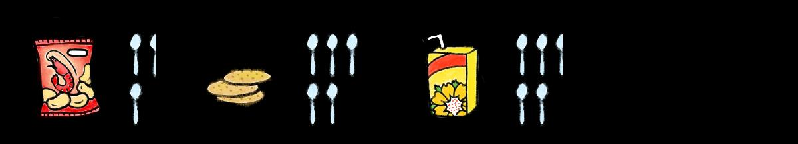
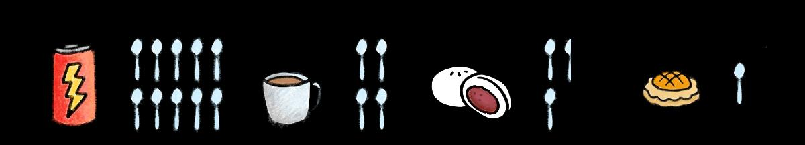

## Page 1

# **让您活得更 加健康的小贴士** 

**隐藏在饮食中的7个糖炸弹** 以下是一些受欢迎的饮食和隐藏其中的糖分！ 

**能量饮料** (473毫升) **咖啡 2 个红豆包** 含51克糖= 约10 茶匙 含20 克糖= 约4 茶匙 含13 克糖= 约2.5 茶匙 

**1 个凤梨挞** 含6.2 克糖= 约1 茶匙 

**虾饼** （每56克） **3 块原味饼干** 含12.1 克糖= 约2.4 茶匙 含22 克糖= 约5 茶匙 

**1 包菊花茶** 含20克糖= 约4.5 茶匙 

**您每日的糖摄入量，不应超过10茶匙（根据每日2000卡路里的摄入量计算）。根据 以下方案，您要如何采取避开或替换的方式，将每日摄入的糖分，限制在10茶匙内？ 方案1：** 1 碗鱼丸面+ 2 包茶+ 2 个红豆包= 24.5 茶匙糖。 **方案2：** 1 盘烤鸡饭+ 1 杯咖啡+ 1 份原味饼干= 12 茶匙糖 **方案3：** 1 碗米暹+ 1 罐100 plus饮料+ 1 条猪肠粉= 20.5 茶匙糖 **方案4：** 1 碗云吞面+ 1 杯豆浆+ 1 份咕噜肉= 12茶匙糖 

资料来源： 

- 1.《饮食中隐藏的10个糖炸弹》。保健中心。2021年12 月。 

- 2.《小贩美食和隐藏糖分》。Minmed集团。2020年4月。 

- 3.《在食阁用餐，如何做出更健康选择》。健康交换。新保健。 

4. Nutritionix 食物数据库。

