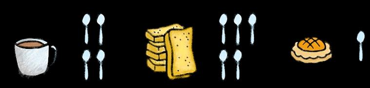

## Page 1

# Mẹo giúp b **ạ** n kh **ỏ** e m **ạ** nh h **ơ** n 

**7 quả bom Đường ăn ẩn trong Chế độ Ăn uống của bạn** Dưới đây là một số loại thực phẩm phổ biến và hàm lượng đường tiềm ẩn của chúng! 

**Nước tăng lực** (473ml) 51g đường = 10 thìa cà phê đường 

## **Cà phê đường** 

20g đường = 4 thìa cà phê đường 

**Bánh milk rusk** 23g đường = khoảng 5 thìa cà phê đường 

**1 Bánh dứa** 

6,2g đường = khoảng 1 thìa cà phê đường 

**3 cái bánh quy** 22g đường = khoảng 5 thìa cà phê đường 

**Gulab jammun** (100g) 52g đường = 10 thìa cà phê đường 

## **1 Ladoo** 

13g đường = 2,5 thìa cà phê đường 

<!-- Start of picture text -->
đường <!-- End of picture text -->

**Lượng đường tiêu thụ hàng ngày của bạn không được nhiều hơn 10 thìa cà phê đường (dựa trên mức thu  vào 2000 calo hàng ngày). Trong các tình huống sau đây, bạn có thể bỏ qua hoặc chuyển đổi gì để giữ trong giới hạn 10 thìa cà phê đường hàng ngày?** 

**Tình huống 1:** 2 miếng bánh Roti Prata + 2 bịch trà + 1 phần bánh milk rusk = 14 thìa cà phê đường **Tình huống 2:** 1 phần gà Biryani + 1 cốc milo + 1 khẩu phần bánh quy thường = 11 thìa cà phê đường đường **Tình huống 3:** 1 mì Goreng + 1 lon 100 plus + 1 viên ladoo = 10,5 thìa cà phê đường **Tình huống 4:** 1 mì Wanton + 1 sữa đậu nành + 1 thịt lợn chua ngọt = 12 thìa cà phê đường 

Nguồn: 

### **Proudly presented by:** 

> 1. “10 quảbom đường ẩn trong chếđộăn uống của bạn”.  HealthHub.  Tháng 12 năm 2021. 

> 2. "Thức ăn Hawker và Đường ẩn của nó".  Công ty Minmed Group. Tháng 4 năm 2020. 

> 3. “Ăn tại khu ăn uống” Mẹo đểcó những lựa chọn lành mạnh hơn ”. HealthXchange.  SingHealth.

