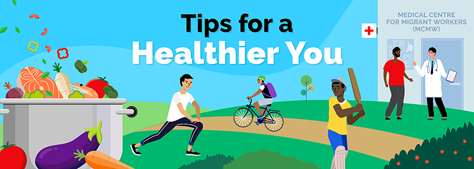

# Health and well-being resources for migrant workers

Living a healthy lifestyle can help reduce the risk of chronic diseases and other health conditions. Having good personal hygiene keeps you healthy and stops the spread of infections. By taking care of your overall health, you will also feel more energised and productive.

Explore disease prevention and health tips on the following topics.

## Topics

## Healthy living

Besides keeping yourself free from diseases, you should also look after your physical and mental health. This means eating a balanced diet, getting regular exercise, avoiding tobacco and getting enough rest.

## NutritionShow

A healthy diet replenishes the body's nutritional needs and supports tissue repair leading to overall well-being. Good nutrition is also key to good mental and physical health. Long-term poor nutrition may lead to costly diseases, including strokes, heart diseases and some cancers.

Find out how to include healthy options in your daily meals with these tips:

### Debunking myths about nutrition

### Drink 8 cups of water

### Eat healthy, live happy

### Healthy snacks

### 8 hidden sugar bombshells in your diet

### Healthy cooking – Chicken Biryani

### Healthy cooking – Assam Fish Curry

## Physical activityShow

Regular physical activity enhances your mental well-being by releasing ‘feel-good hormones’ such as endorphins. Exercise also helps to burn calories, get rid of excess body fat and control your body weight. It reduces the risks of chronic diseases and its complications such as heart attacks and stroke.

Find out more on how you and your friends can stay healthy through physical activities:

### Physical activity

### Home workouts for you and your friends

## Alcohol useShow

Long-term alcohol use and misuse can have serious health risks such as liver disease, cancers and stomach ulcers. Alcohol when consumed in excess will also impair judgment and lead to riskier actions. In its most severe form, alcohol addiction is a chronic disorder where you may not have control over your alcohol intake.

Find out more on alcohol addiction and how you and your friends can seek help:

### Alcohol use

## Tobacco useShow

All forms of tobacco are harmful and addictive. There is no safe tobacco product. Cigarette smoking exposes your body to very harmful chemicals that can cause cancer. Long-term exposure to tobacco smoke puts you at a higher risk for cancer, stroke, heart and lung disease, and airway infections that can affect your quality of life.

Find out more on how you can quit smoking safely:

### Tobacco use

## Chronic diseases

Chronic diseases such as high cholesterol, Diabetes and Hypertension (high blood pressure) can be prevented and well managed with a good diet and lifestyle. Poorly controlled chronic diseases may affect your quality of life and increase your risks of complications and need for more medical treatments.

Find out how you can be in control of your chronic condition with these tips:

## DiabetesShow

### Diabetes

## High cholesterolShow

### High cholesterol

## HypertensionShow

### Hypertension

## Mental health

Mental health is important for everyone. It impacts our thoughts, behaviours and emotions. Being emotionally healthy promotes productivity at work, helps you interact well with your friends and allows you to adapt to changes in your life and cope with challenges.

## Tips and resources for workersShow

### Support and care for your friends

### How to handle issues at work

### How to deal with personal problems

### How to cope with living in a new country

### Self-care tips migrant workers

### Light up your life guide

### Staying well and informed on mental health

### Wellness in mind and body

### Videos on counselling helplines available for migrant workers

### World suicide prevention day

### Available channels for migrant workers to seek help

## Guide for employers and dormitory operatorsShow

### Psychological first aid guide for employers and dormitory operators

Read this [Psychological First Aid Guide](https://www.mom.gov.sg/-/media/mom/documents/publications/health-well-being-resources/mental-health/employers-and-dormitories-guide-to-provide-mental-health-support-for-workers.pdf) to learn how to:

- Recognise signs of distress in your workers
- Support your workers through simple measures like the setting up a buddy system.

## Oral health

Good oral hygiene keeps your teeth free from decay and prevents infection in the mouth. Untreated or undiagnosed oral diseases may increase the risk of adverse health conditions such as heart inflammation, heart disease or severe gum problems. Regular dental visits can help you to identify oral problems earlier and save on dental cost.

See quick tips on easy oral care:

## Oral careShow

### Dental care tips

## Infectious diseases

Infectious diseases are caused by micro-organisms such as bacteria, viruses, fungi or parasites that are passed directly or indirectly, such as through mosquitoes, from one person to another. Some examples include common cold, Influenza, Coronaviruses and Dengue.

A weak immune system, unhygienic practices or travel to endemic areas can increase your risk of getting an infectious disease. Good personal hygiene and living habits can protect you from getting infected or seriously ill.

## ChickenpoxShow

Chickenpox is a viral infection that causes rashes with small, itchy blisters on the skin of the whole body. Symptoms may include fever, headache and body ache, which is then followed by the characteristic rash. It can spread easily from one person to another through droplet transmission often via direct contact.

Persons who have not had the infection or vaccination against chickenpox are more likely to be infected. While Chickenpox is harmless to most people, it can lead to complications in people with weaker immune systems. Seek medical attention if you have these symptoms and get vaccinated to protect yourself from Chickenpox

## COVID-19Show

COVID-19 is an infectious disease caused by the SARS-CoV-2 virus. Most people who are vaccinated and are infected with the virus will experience mild to moderate respiratory illness and self-recover. However, COVID-19 can result in severe disease in those who are not vaccinated. Protect yourself and others from infection by keeping updated on your vaccinations and maintain good personal hygiene practices as such washing your hands frequently.

Protect yourself and others from infection by:

- Staying up to date on your [COVID-19 vaccinations](https://www.mom.gov.sg/passes-and-permits/work-permit-for-foreign-worker/recreation-well-being-and-other-resources-for-migrant-workers/educational-resources-on-covid-19-vaccination)
- Maintaining [good personal hygiene practices](#good-hygiene-practices)

### How you can reduce the spread of COVID-19?

### Dr Ashif explains what is COVID-19

### Foreign workers talk about COVID-19

## DengueShow

Dengue fever is a tropical disease caused by a virus that is carried by the Aedes mosquito. The virus can cause fever, headaches, rashes and pain throughout the body. In rare cases, Dengue fever can lead to more serious medical complications and even death.

To prevent the spread of Dengue, it is important to stop the breeding of mosquitoes at your residence such as dormitories and at worksites.

You can take simple steps to protect yourself and your friends from dengue:

- Protect yourself against mosquito bites. Apply a mosquito repellent to exposed skin or clothing. Wear light-coloured clothing or long sleeves and pants for maximum coverage.
- Spray insecticide in dark corners around the room.
- Prevent mosquito breeding at worksite or dormitories. Do not let water stagnate in any containers.

### Stop Dengue at our Dormitories

## MonkeypoxShow

Monkeypox is a viral disease that is caused by the monkeypox virus. Monkeypox is generally a self-recovering illness that presents with fever and rash. However, serious complications or death can occur in some individuals. Good hygiene habits can protect you and your friends from getting infected with the virus.

As the vast majority of current cases are spread through sexual encounters, avoiding high risk sexual activities (e.g. multiple partners) will protect yourself from being infected or further disease transmission.

See the infographic to find out more on [Monkeypox symptoms and prevention tips](https://www.mom.gov.sg/-/media/mom/documents/publications/health-well-being-resources/infectious-diseases/monkeypox-infographic.pdf).

## Sexually Transmitted Infections (STIs)Show

Sexually Transmitted Infections (STIs) are passed from one person to another through sexual contact. These infections may spread via vaginal, anal or oral sex. While some people may not show any symptoms of being infected, you should look out for the following symptoms:

- Sores or bumps on genitals, near your mouth or rectal area
- Painful or burning feeling during urination
- Discharge from the penis
- Swollen lymph nodes near your genitals
- Rashes on hands, feet and rectal area

You should see a doctor immediately and seek treatment if:

- You have symptoms of a STI.
- You are sexually active and think you may have been exposed to STIs through your partner.

There may be serious health risks involved with STIs so it is important to protect yourself through safe sex practices.

If you are infected and need to talk to someone about how you feel, call the following helpline:

**HealthServe’s helpline:** [3129 5000](tel:31295000)

## TuberculosisShow

Tuberculosis (TB) is a bacterial infection that mainly affects the lungs. It is treatable and hence is important for TB patients to complete their medications as directed.

You can get infected if you inhale small droplets from the cough or sneeze of an infected person. Generally, after 2 weeks of medication, the TB patient will no longer be infectious.

Look out for the following symptoms of TB:

- Coughing blood
- Fever
- Chest pain
- Chills
- Prolonged cough
- Tiredness
- Night sweats
- Weight loss

You should see a doctor immediately if you have the above symptoms. If infected, you must complete the whole course of medication to be cured.

Here are some TB prevention tips that you can share with your friends:

- Practice good hygiene habits such as frequent hand washing with soap and not sharing food and drinks
- Go for a medical check-up at any Medical Centre for Migrant Workers (MCMWs) if you suspect any TB symptoms
- Adopt healthier lifestyle practices to make your immune system strong

## Preventing the spread of diseases

Effective infection prevention and control (IPC) practices reduce the risk of infection transmission between you and your friends. This includes good hygiene practices to prevent the spread of infectious diseases such as [COVID-19](#covid-19), influenza and gastrointestinal infections. Keeping your hands clean is an important step you can take to avoid falling sick. 

Learn how to keep you and your friends safe:

### The coolest hand wash guide

Check out this fun video and learn the 8 steps to washing your hands properly.

### Tips to keep your dorm pest-free

### When taking public transport

### When at eating places

The Antigen Rapid Test (ART) is a fast and easy swab test that you can use to test if you have been infected with the COVID-19 virus.

### How to use the ART kit

Watch this step-by-step video on how to use your ART kit. The test takes less than 20 minutes, and is safe and easy to do.
