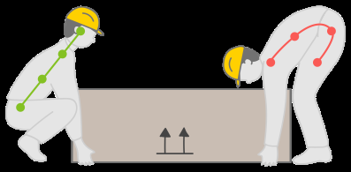

## Page 1

# **ข้อแนะน ำเพื่อให้ สุขภำพคุณดีขึ้น** 

## **น ้ำหนักของคุณถูกพลำนำมัยหรือเปล่ำ** 

**น ้ำหนัก** (กก.) 

ค านวณ **น ้ำหนัก** (กก.) = **BMI ควำมสูง** คูณ **ควำมสูง** (ม.) 

**กำรมีน ้ำหนักเกิน* ส่งผลให้เกิดปัญหำสุขภำพ ได้แก่:** ความดันโลหิตสูง• เบาหวาน• โรคหลอดเลือดหัวใจ• มะเร็งบางชนิด • ความผิดปกติของกระดูกและข้อ (*BMI ในโซนสีส้มและสีแดง) 

## **วิธีกำรอ่ำนค่ำดัชนีมวลกำยของคุณ** 

### **ช่วงค่ำดัชนีมวลกำย** 

18.5 - 22.9 = ความเสี่ยงต ่า 23 - 27.4 = ความเสี่ยงปานกลาง 27.5 ขึ้นไป = ความเสี่ยงสูง 

- 23 - 27.4 = ความเสี่ยงปานกลาง 

#### น ้าหนัก (กก.) ค่าดัชนีมวลกาย 

<!-- Start of picture text -->
110 27.5 100 90 23 80 70 18.5 60 50 40 1.4 1.5 1.6 1.7 1.8 1.9 ความสูง (ม.) <!-- End of picture text -->

## **เหตุผลอะไรที่คุณไม่ ออกก ำลังกำย** 

- **เหตุผลที่ 1: ผมรู้สึกเหนื่อยมำก ข้อแนะน ำ:** การออกก าลังกายแบ่งออกเป็น 3 ช่วง ช่วงละ 10 นาที 

- **เหตุผลที่ 2: ผมรู้สึกขี้เกียจ ข้อแนะน ำ:** หาเพื่อนหรือเพื่อนร่วมงานเพื่อช่วยให้คุณมีแรง บันดาลใจ 

- **เหตุผลที่ 3: ผมยุ่งมำก ข้อแนะน ำ:** ตั้งเป้ากับเพื่อนเพื่อร่วมกิจกรรมกลางแจ้งกัน เช่น เล่นคริกเก็ตหรือฟุตบอลกัน 

## **วิธีในกำรเริ่มออกก ำลังกำย** 

- ให้ออกก าลังกาย 3 ถึง 4 ครั้งต่อสัปดาห์ 

- พยายามออกก าลังกายใช้แบบต่าง ๆ เพื่อเสริมสร้างส่วนต่างๆ ของร่างกาย เช่น การขึ้นบันไดหรือการวิ่งเหยาะ ๆ เพื่อสุขภาพ หัวใจ 

- ค่อย ๆ เพิ่มความเข้มข้นและระยะเวลาของกิจกรรมเมื่อระดับความ ฟิตของคุณดีขึ้น 

- หลังจากออกก าลังกายแล้ว ให้คลายร้อนด้วยการยืดเส้นยืดสาย อย่างเบา ๆ ✔ ⨯ 

- เมื่อยกน ้าหนัก ให้หลังตรงเพื่อป้องกันการ บาดเจ็บที่ตัวข้างหลัง 

## **จงจ ำไว้ ทุกควำมพยำยำมมีค่ำ** 

แหล่งความรู้ 1. “น ้าหนักที่ดีต่อสุขภาพคืออะไร” Healthhub. ฉบับ มีนาคม ค.ศ. 2022. 2. “วิธีการลุกขึ้นและไป”.Healthhub. ฉบับ ธันวาคม ค.ศ. 2021

