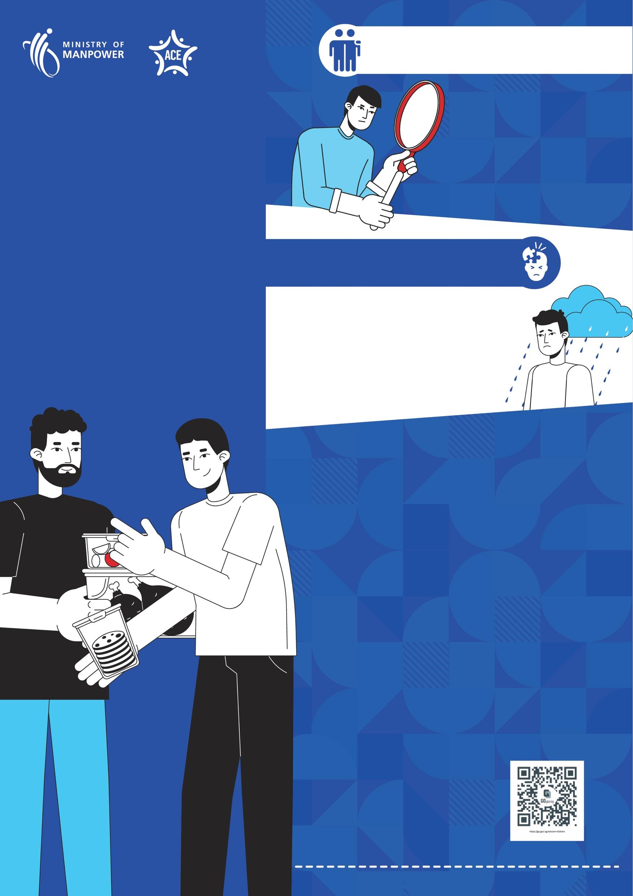

## Page 1

## 为有以下情况的员工 提供更多支持 

# 支持 与 关怀 您的 朋友 

感觉不适 刚加入公司或入 住宿舍 刚来新加坡 （不到两年) 

可能需要帮助的迹象 

看起来忧郁或压力大 独自待在外面 行为与平时不同 经常缺勤 

------ 如何提供帮助 -----留意 警示征兆 倾听 并给予支持 

引导 他们获得更多帮助： 

通过 FWMOMCare 应用与人力部 （MOM）联系 

康侍（HealthServe）：3129 5000 （心理和健康咨询） 

外籍劳工中心（MWC）：6536 2692 （就业问题） 

使用 “We Care!” WhatsApp 贴纸， 让他们知道您 关心他们

