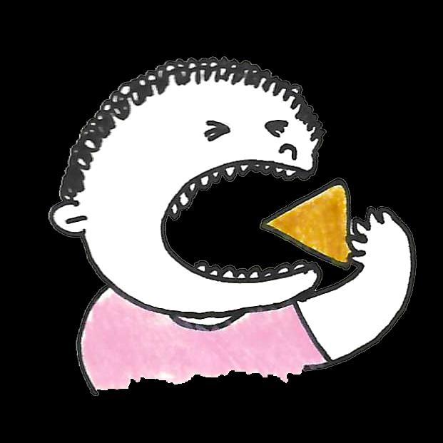

## Page 1

# Tips untuk membuat  Anda yang Lebih Sehat 

## **Apa itu Diabetes?** 

Diabetes adalah kondisi medis kronis yang **memengaruhi kemampuan tubuh Anda untuk memecah gula** . Ini berarti banyak gula yang tersisa dalam darah Anda. 

Jika tidak diobati, Diabetes dapat menyebabkan kerusakan pada pembuluh darah, yang dapat menyebabkan serangan jantung, stroke, dan masalah dengan ginjal, mata, kaki, dan saraf.

## Page 2

# Tips untuk membuat  Anda yang Lebih Sehat 

**Bagaimana saya tahu jika saya menderita Diabetes?** Gejala umum Diabetes termasuk: 

**kencing berlebihan** 

<!-- Start of picture text -->
kelelahan <!-- End of picture text -->

**haus** 

**pusing** 

**penurunan berat badan yang tidak dapat dijelaskan** 

**rasa lapar yang berlebihan** 

Jika Anda memiliki diabetes atau menduga bahwa Anda memilikinya, silakan kunjungi dokter. Kunjungi klinik medis, terutama jika majikan Anda telah mendaftarkan Anda dengan Rencana Perawatan Primer. Temukan pusat kesehatan . terdekat dan lokasinya **<u>di sini</u>**

## Page 3

# Tips untuk membuat  Anda yang Lebih Sehat 

## **Cegah Diabetes!** 

Ikuti langkah-langkah sederhana ini untuk mengurangi resiko terkena Diabetes! 

Pilihlah makanan yang lebih sehat. 

Minum air putih daripada minuman manis. 

Berhenti atau kurangi alkohol dan merokok. 

Lakukan olahraga seperti Makan makanan berserat tinggi berjalan, joging, atau seperti kacang dal, havermut atau memanjat tangga. kacang-kacangan, kacang almond, biskuit gandum atau yogurt tawar. 

Sumber: 

1. “Let’s beat Diabetes”. HealthHub.

