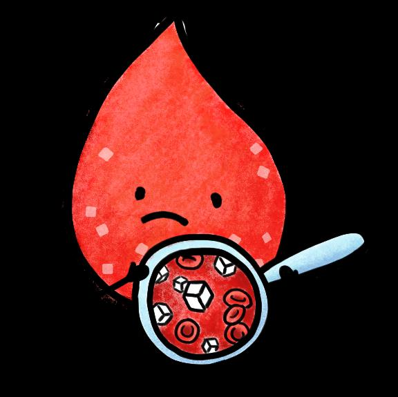
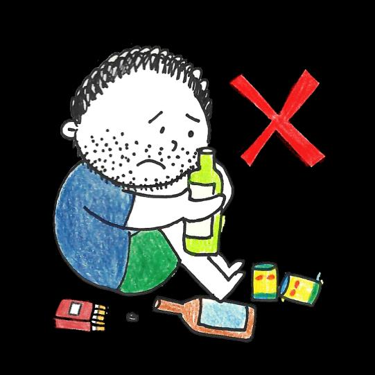
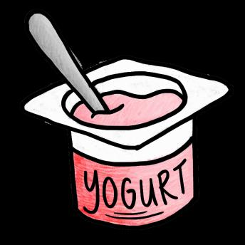

## Page 1

**স্বাস্থ্যবান থাকার ননয়মাবলী** 

## **ডায়ারবটিসনক?** 

এটিএকটিদীর্ঘস্থাযীশারীররকঅবস্থাযা **আপনারশরীররউপনস্থ্তনিননরকভেরেভেলার ক্ষমতারকপ্রোনবতকরর।** এরমানে, আপোর রনেপ্রচুররচরেথানকযায। 

যরদরচরকত্সাোকরাহয, তনবডাযানবটিস রেোলীগুরলরক্ষরতকনর, যাহার্ঘ অযার্াক, স্ট্রাকএবংরকডরে, স্ট্চাখ, পাএবংস্নাযুর সমসযাকরনতপানর।

## Page 2

# **স্বাস্থ্যবান থাকার ননয়মাবলী** 

**আমার ডায়ারবটিস আরে নকনা আনম নকোরব জানব?** ডাযানবটিনসর সাধারণ লক্ষণগুরলর হনে: 

**অতযনিক প্রস্রাব** 

**তৃষ্ণা** 

**বযাখ্যাহীন ওজনকমা** 

<!-- Start of picture text -->
ক্লানি <!-- End of picture text -->

<!-- Start of picture text -->
মাথা ভ ারা <!-- End of picture text -->

<!-- Start of picture text -->
অতযনিক ক্ষুিা <!-- End of picture text -->

যরদ স্ট্তামার ডাইনবটিস থানক বা সনেহ কনরা স্ট্যআনে, তাহনল ডাোর স্ট্দখাও। স্ট্মরডনকল এ যাও, আরও যাও যরদ স্ট্তামার চাকরর দাতা স্ট্তামানক প্রাথরমক পররচযঘা পররকল্পোনত ভরতঘ কররনয থানক। স্ট্তামার সবনচনয কানের স্ট্মরডনকল স্ট্সন্টার এবং তার ঠিকাো এখানে স্ট্দনখা|

## Page 3

**স্বাস্থ্যবান থাকার ননয়মাবলী** 

**ডায়ারবটিসপ্রনতররািকরুন!** 

ডাযানবটিসহওযারঝুুঁরককমানতএইসহজপদনক্ষপগুরলঅেুসরণকরুে! 

স্বাস্থযকরখাবারখাে। 

রচরেযুেপােীনযরপররবনতঘ পারেপােকরুে। 

অযালনকাহলএবংধূমপাে স্ট্েন়ে রদেবাকরমনযরদে। 

বযাযামকরনতহনবস্ট্যমে হার্া, হাল্কাস্ট্দৌ়োনোবা রসুঁর়ে রদনযউঠা। 

শষ্যআআুঁশজাতীযখাবার স্ট্খনতহনবস্ট্যমে, মূনেরডাল, বাদাম, েনমররবস্কুর্বাদই। 

সূত্র: 

1. “Let’s beat Diabetes”. HealthHub.

